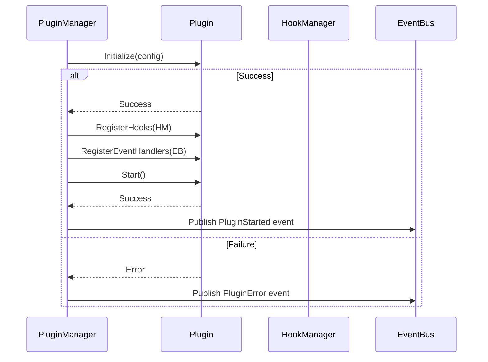
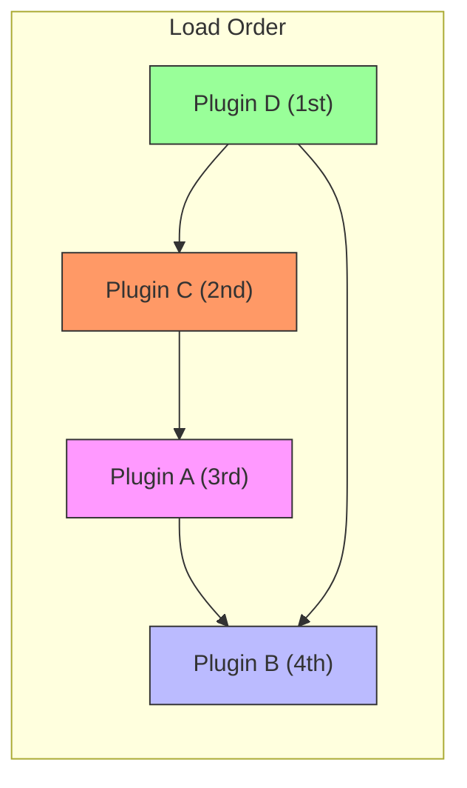
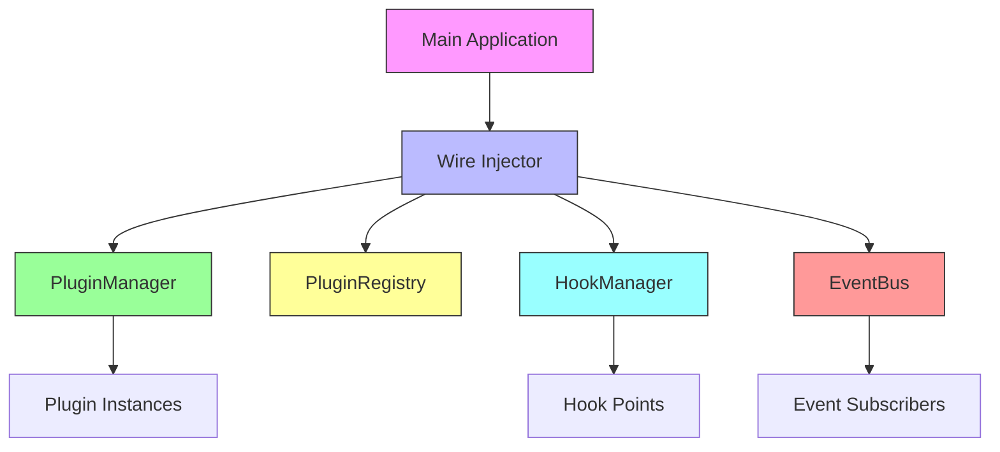
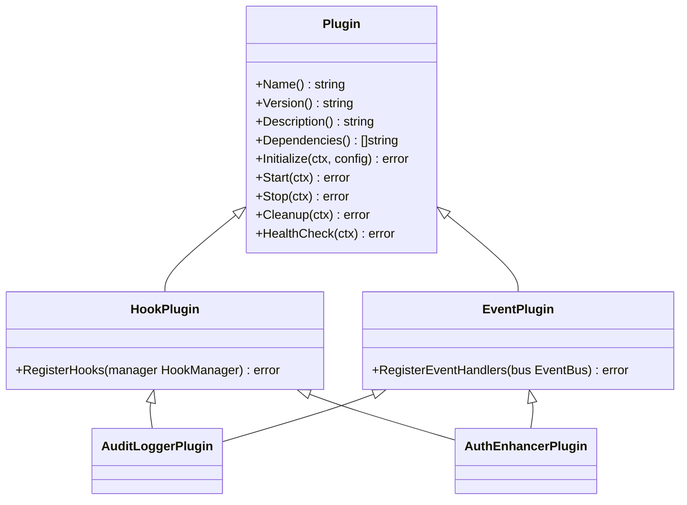
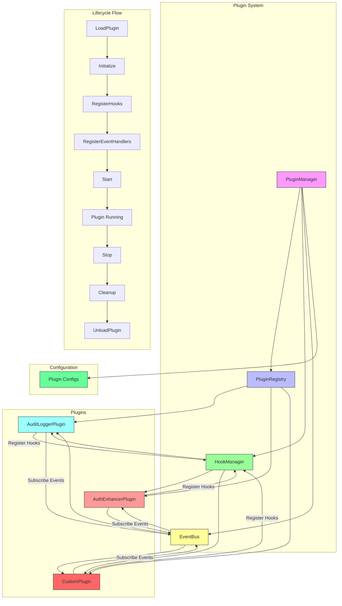

# Plugin Management

<cite>
**Referenced Files in This Document**   
- [plugin_manager.go](file://internal/pkg/plugin/plugin_manager.go#L1-L442)
- [interfaces.go](file://internal/pkg/plugin/interfaces.go#L1-L70)
- [plugin_registry.go](file://internal/pkg/plugin/plugin_registry.go#L1-L312)
- [wire.go](file://internal/pkg/plugin/wire.go#L1-L15)
- [audit_logger.go](file://plugins/audit_logger.go#L1-L132)
- [auth_enhancer.go](file://plugins/auth_enhancer.go#L1-L122)
- [audit_logger.yaml](file://configs/plugins/audit_logger.yaml#L1-L14)
</cite>

## Table of Contents
1. [Introduction](#introduction)
2. [Core Components](#core-components)
3. [Plugin Lifecycle Management](#plugin-lifecycle-management)
4. [Plugin Registry and Dependency Management](#plugin-registry-and-dependency-management)
5. [Dependency Injection with Wire](#dependency-injection-with-wire)
6. [Plugin Interface Contract](#plugin-interface-contract)
7. [Error Handling and Common Issues](#error-handling-and-common-issues)
8. [Implementing Custom Plugins](#implementing-custom-plugins)
9. [Architecture Overview](#architecture-overview)

## Introduction
The Plugin Manager component in kratos-boilerplate provides a comprehensive system for dynamic plugin loading, initialization, and lifecycle management. It enables extensible application functionality through a well-defined plugin architecture that supports dependency resolution, configuration management, and event-driven interactions. The system discovers plugins from the `plugins/` directory, loads them based on configuration files in `configs/plugins/`, and manages their complete lifecycle from loading to cleanup.

The architecture follows a modular design with clear separation of concerns between the PluginManager (orchestrator), PluginRegistry (metadata store), and supporting components like HookManager and EventBus. This documentation details the implementation, usage patterns, and integration points for developers working with or extending the plugin system.

## Core Components

The plugin system consists of several key components that work together to provide a robust plugin management framework:

- **PluginManager**: Central orchestrator responsible for loading, starting, stopping, and unloading plugins
- **PluginRegistry**: Maintains plugin metadata, state, and dependency relationships
- **HookManager**: Enables plugins to register hooks at specific execution points
- **EventBus**: Facilitates event-driven communication between plugins and the core system
- **Plugin Interface**: Defines the contract that all plugins must implement

These components are instantiated and wired together using Google Wire for dependency injection, ensuring loose coupling and testability.

**Section sources**
- [plugin_manager.go](file://internal/pkg/plugin/plugin_manager.go#L1-L442)
- [interfaces.go](file://internal/pkg/plugin/interfaces.go#L1-L70)
- [wire.go](file://internal/pkg/plugin/wire.go#L1-L15)

## Plugin Lifecycle Management

### Plugin Loading Process
The PluginManager discovers and loads plugins through a structured process:

1. **File Discovery**: The system scans the `plugins/` directory for plugin files
2. **Configuration Loading**: For each plugin, it loads the corresponding YAML configuration from `configs/plugins/`
3. **Validation**: Checks if the plugin is enabled in its configuration
4. **Registration**: Registers the plugin with the PluginRegistry
5. **Event Publishing**: Emits a `PluginLoaded` event

```go
func (pm *pluginManagerImpl) LoadPlugin(path string) error {
    // Check if plugin file exists
    if _, err := os.Stat(path); os.IsNotExist(err) {
        return NewPluginError(ErrCodePluginNotFound, "plugin file not found", filepath.Base(path), err)
    }

    // Load plugin configuration
    config, err := pm.loadPluginConfig(filepath.Base(path))
    if err != nil {
        return err
    }

    if !config.Enabled {
        return NewPluginError(ErrCodePluginConfigError, "plugin is disabled", filepath.Base(path), nil)
    }

    // Create plugin instance (in actual implementation, this would use dynamic loading)
    pluginName := filepath.Base(path)
    plugin := &mockPlugin{
        name: pluginName,
    }

    // Wrap plugin with metadata
    wrapper := &pluginWrapper{
        plugin: plugin,
        info: PluginInfo{
            Metadata: PluginMetadata{
                Name:        pluginName,
                Version:     "1.0.0",
                Description: "Mock plugin for demonstration",
                Author:      "System",
            },
            Status:   PluginStatusLoaded,
            LoadTime: time.Now(),
            Path:     path,
        },
        config: config,
    }

    pm.plugins[pluginName] = wrapper

    // Register with registry
    if err := pm.registry.Register(plugin); err != nil {
        delete(pm.plugins, pluginName)
        return err
    }

    // Publish event
    pm.eventBus.PublishAsync(context.Background(), NewEvent(
        EventPluginLoaded,
        "plugin_manager",
        map[string]interface{}{
            "plugin": pluginName,
            "path":   path,
        },
    ))

    return nil
}
```

### Plugin Initialization and Startup
After loading, plugins must be explicitly started. The startup sequence follows a strict order:

1. **Initialize**: Calls the plugin's `Initialize` method with its configuration
2. **Register Hooks**: If the plugin implements `HookPlugin`, registers its hooks
3. **Register Event Handlers**: If the plugin implements `EventPlugin`, subscribes to events
4. **Start**: Calls the plugin's `Start` method to begin operation



**Diagram sources**
- [plugin_manager.go](file://internal/pkg/plugin/plugin_manager.go#L164-L204)
- [interfaces.go](file://internal/pkg/plugin/interfaces.go#L1-L70)

**Section sources**
- [plugin_manager.go](file://internal/pkg/plugin/plugin_manager.go#L164-L256)

## Plugin Registry and Dependency Management

### Plugin Registry Implementation
The PluginRegistry maintains a comprehensive registry of all loaded plugins, their metadata, and current status. It provides methods for:

- **Registration/Unregistration**: Adding and removing plugins from the registry
- **Status Tracking**: Monitoring plugin lifecycle states (Loaded, Started, Stopped, Error)
- **Dependency Resolution**: Managing plugin dependencies and load order
- **Querying**: Listing plugins by status, metadata, or other criteria

```go
type pluginRegistryImpl struct {
    mu       sync.RWMutex
    plugins  map[string]Plugin
    byStatus map[PluginStatus][]Plugin
}
```

### Dependency Resolution and Load Ordering
The system implements sophisticated dependency management to ensure plugins are loaded in the correct order. It uses topological sorting to resolve dependencies and detect circular references.

```go
func (pr *pluginRegistryImpl) GetLoadOrder() ([]Plugin, error) {
    // Build dependency graph
    dependencyGraph := make(map[string][]string)
    
    // Initialize graph
    for name := range pr.plugins {
        dependencyGraph[name] = []string{}
    }
    
    // Build dependency relationships
    for name, plugin := range pr.plugins {
        for _, dep := range plugin.Dependencies() {
            dependencyGraph[dep] = append(dependencyGraph[dep], name)
        }
    }
    
    // Topological sort
    sorted, err := pr.topologicalSort(dependencyGraph)
    if err != nil {
        return nil, err
    }
    
    // Return plugins in sorted order
    result := make([]Plugin, 0, len(sorted))
    for _, name := range sorted {
        result = append(result, pr.plugins[name])
    }
    
    return result, nil
}
```



**Diagram sources**
- [plugin_registry.go](file://internal/pkg/plugin/plugin_registry.go#L121-L177)
- [plugin_registry.go](file://internal/pkg/plugin/plugin_registry.go#L179-L240)

**Section sources**
- [plugin_registry.go](file://internal/pkg/plugin/plugin_registry.go#L121-L311)

## Dependency Injection with Wire

### Wire Configuration
The plugin system uses Google Wire for dependency injection, which eliminates the need for manual wiring of components and ensures consistent initialization across the application.

```go
// ProviderSet 插件系统依赖注入配置
var ProviderSet = wire.NewSet(
    NewPluginManager,
    NewPluginRegistry,
    NewHookManager,
    NewEventBus,
    wire.Bind(new(PluginManager), new(*pluginManagerImpl)),
    wire.Bind(new(PluginRegistry), new(*pluginRegistryImpl)),
    wire.Bind(new(HookManager), new(*hookManagerImpl)),
    wire.Bind(new(EventBus), new(*eventBusImpl)),
)
```

### Integration with Main Application
The Wire provider set is integrated into the main application's dependency graph, allowing the plugin system to be injected into other components that need to interact with plugins.



**Diagram sources**
- [wire.go](file://internal/pkg/plugin/wire.go#L1-L15)
- [plugin_manager.go](file://internal/pkg/plugin/plugin_manager.go#L1-L442)

**Section sources**
- [wire.go](file://internal/pkg/plugin/wire.go#L1-L15)

## Plugin Interface Contract

### Core Plugin Interface
All plugins must implement the `Plugin` interface, which defines the standard lifecycle methods and metadata accessors:

```go
// Plugin 插件基础接口
type Plugin interface {
    // 插件元数据
    Name() string
    Version() string
    Description() string
    Dependencies() []string

    // 生命周期方法
    Initialize(ctx context.Context, config PluginConfig) error
    Start(ctx context.Context) error
    Stop(ctx context.Context) error
    Cleanup(ctx context.Context) error

    // 健康检查
    HealthCheck(ctx context.Context) error
}
```

### Extension Interfaces
Plugins can implement additional interfaces to extend functionality:

- **HookPlugin**: Allows registration of hooks at specific execution points
- **EventPlugin**: Enables subscription to and handling of system events



**Diagram sources**
- [interfaces.go](file://internal/pkg/plugin/interfaces.go#L1-L70)
- [audit_logger.go](file://plugins/audit_logger.go#L1-L132)
- [auth_enhancer.go](file://plugins/auth_enhancer.go#L1-L122)

**Section sources**
- [interfaces.go](file://internal/pkg/plugin/interfaces.go#L1-L70)

## Error Handling and Common Issues

### Error Types and Handling
The plugin system defines specific error codes for different failure scenarios:

- **ErrCodePluginNotFound**: Plugin file or instance not found
- **ErrCodePluginAlreadyExist**: Duplicate plugin registration
- **ErrCodePluginConfigError**: Configuration loading or parsing failure
- **ErrCodePluginDependency**: Missing dependency or circular dependency
- **ErrCodePluginStartFailed**: Plugin initialization or startup failure
- **ErrCodePluginStopFailed**: Plugin shutdown failure

```go
// Example error handling in LoadPlugin
if _, err := os.Stat(path); os.IsNotExist(err) {
    return NewPluginError(ErrCodePluginNotFound, "plugin file not found", filepath.Base(path), err)
}

// Example error handling in Register
if _, exists := pr.plugins[name]; exists {
    return NewPluginError(ErrCodePluginAlreadyExist, "plugin already registered", name, nil)
}
```

### Common Issues and Solutions

**Duplicate Plugin IDs**
- **Cause**: Two plugins with the same name attempting to register
- **Solution**: Ensure each plugin has a unique name in its `Name()` method
- **Detection**: The registry checks for existing plugins during registration

**Failed Plugin Initialization**
- **Cause**: Plugin's `Initialize` method returns an error
- **Solution**: Check plugin configuration and dependencies
- **Recovery**: The system marks the plugin as `PluginStatusError` and preserves error details

**Circular Dependencies**
- **Cause**: Plugin A depends on Plugin B, which depends on Plugin A
- **Solution**: Restructure dependencies to create a directed acyclic graph
- **Detection**: Topological sorting detects cycles and returns an error

**Missing Dependencies**
- **Cause**: Plugin declares a dependency that hasn't been registered
- **Solution**: Ensure all dependencies are loaded before the dependent plugin
- **Detection**: The registry verifies all dependencies exist during registration

**Section sources**
- [plugin_manager.go](file://internal/pkg/plugin/plugin_manager.go#L1-L442)
- [plugin_registry.go](file://internal/pkg/plugin/plugin_registry.go#L1-L312)

## Implementing Custom Plugins

### Example Plugin Implementation
Here's a complete example of a custom plugin implementation:

```go
//go:build plugin

package main

import (
    "context"
    "fmt"
    "time"

    "kratos-boilerplate/internal/pkg/plugin"
)

// CustomPlugin 示例插件
type CustomPlugin struct {
    name    string
    config  plugin.PluginConfig
    started bool
}

// NewCustomPlugin 创建自定义插件实例
func NewCustomPlugin() *CustomPlugin {
    return &CustomPlugin{
        name: "custom_plugin",
    }
}

func (p *CustomPlugin) Name() string {
    return p.name
}

func (p *CustomPlugin) Version() string {
    return "1.0.0"
}

func (p *CustomPlugin) Description() string {
    return "Custom plugin demonstrating the plugin interface"
}

func (p *CustomPlugin) Dependencies() []string {
    return []string{"audit_logger"} // Depends on audit_logger
}

func (p *CustomPlugin) Initialize(ctx context.Context, config plugin.PluginConfig) error {
    p.config = config
    fmt.Printf("CustomPlugin initialized with config: %+v\n", config)
    return nil
}

func (p *CustomPlugin) Start(ctx context.Context) error {
    p.started = true
    fmt.Println("CustomPlugin started")
    return nil
}

func (p *CustomPlugin) Stop(ctx context.Context) error {
    p.started = false
    fmt.Println("CustomPlugin stopped")
    return nil
}

func (p *CustomPlugin) Cleanup(ctx context.Context) error {
    fmt.Println("CustomPlugin cleaned up")
    return nil
}

func (p *CustomPlugin) HealthCheck(ctx context.Context) error {
    if !p.started {
        return fmt.Errorf("plugin not started")
    }
    return nil
}

func (p *CustomPlugin) RegisterHooks(manager plugin.HookManager) error {
    hook := plugin.NewBaseHook(
        "custom_plugin_hook",
        10,
        3*time.Second,
        func(ctx context.Context, data plugin.HookData) error {
            fmt.Println("CustomPlugin hook executed")
            return nil
        },
    )
    return manager.RegisterHook(plugin.HookPointBeforeRequest, hook)
}

func (p *CustomPlugin) RegisterEventHandlers(bus plugin.EventBus) error {
    handler := plugin.NewBaseEventHandler(
        "custom_plugin_handler",
        []plugin.EventType{plugin.EventUserLogin},
        10*time.Second,
        func(ctx context.Context, event plugin.Event) error {
            fmt.Printf("CustomPlugin received login event: %+v\n", event.GetData())
            return nil
        },
    )
    return bus.Subscribe(plugin.EventUserLogin, handler)
}

// 导出插件实例
var CustomPluginInstance = NewCustomPlugin()
```

### Configuration File
Each plugin should have a corresponding YAML configuration file:

```yaml
enabled: true
priority: 10
timeout: 30s
retry_count: 3
settings:
  feature_enabled: true
  max_connections: 100
  log_level: "debug"
metadata:
  category: "custom"
  author: "developer"
  version: "1.0.0"
```

**Section sources**
- [audit_logger.go](file://plugins/audit_logger.go#L1-L132)
- [auth_enhancer.go](file://plugins/auth_enhancer.go#L1-L122)
- [audit_logger.yaml](file://configs/plugins/audit_logger.yaml#L1-L14)

## Architecture Overview



**Diagram sources**
- [plugin_manager.go](file://internal/pkg/plugin/plugin_manager.go#L1-L442)
- [plugin_registry.go](file://internal/pkg/plugin/plugin_registry.go#L1-L312)
- [interfaces.go](file://internal/pkg/plugin/interfaces.go#L1-L70)