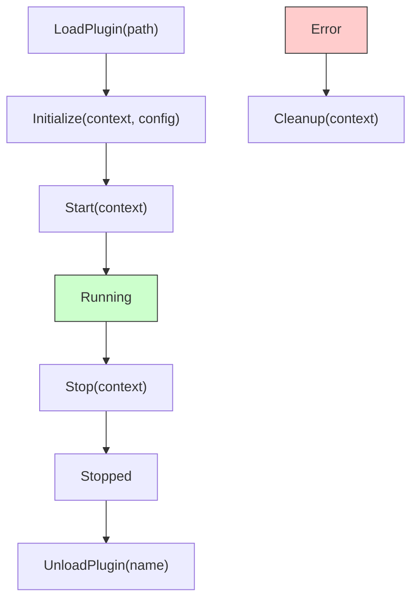
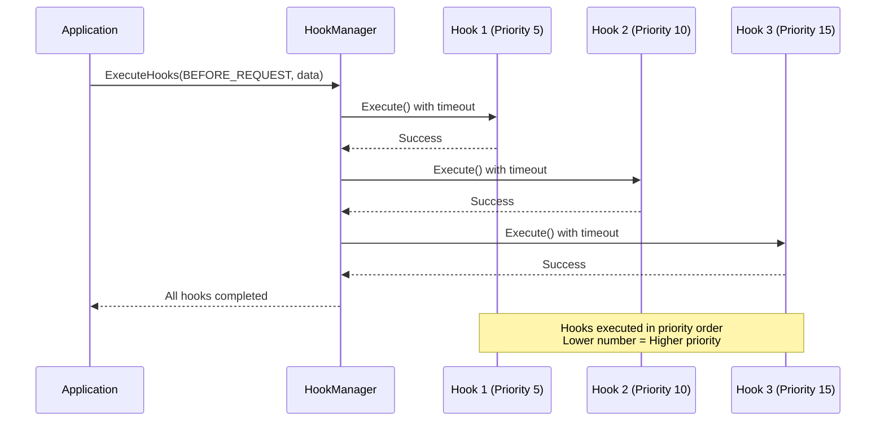
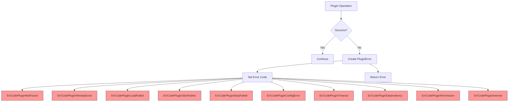
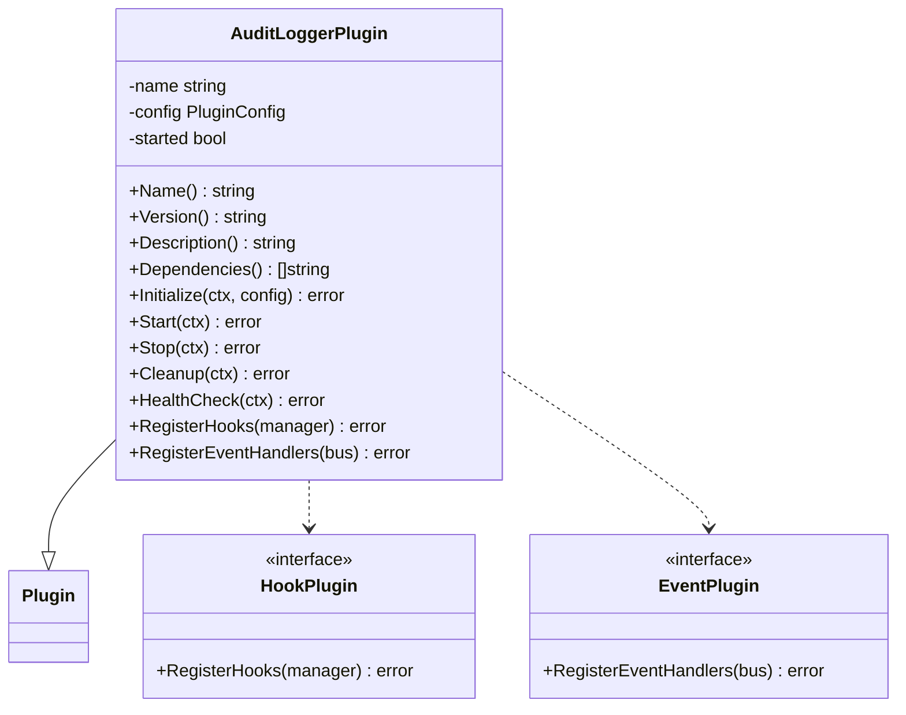
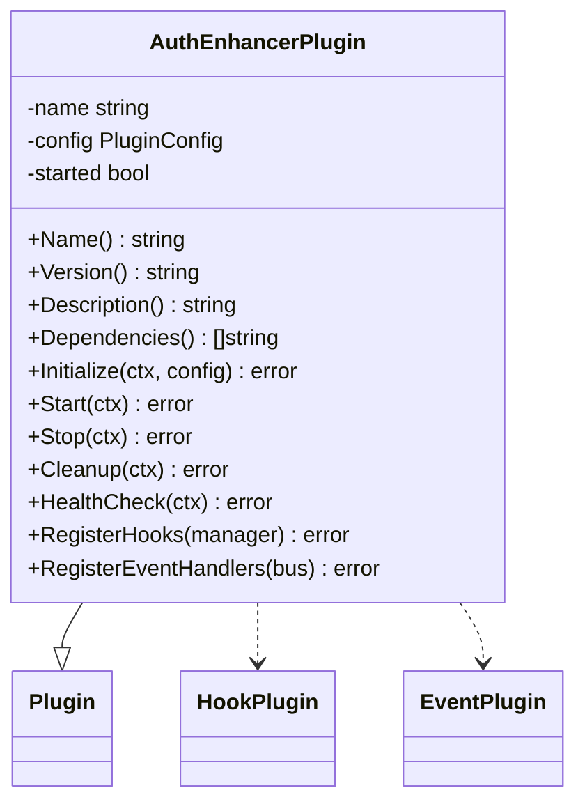
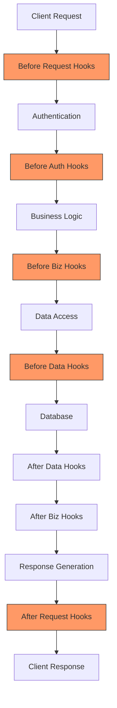

# Plugin System

<cite>
**Referenced Files in This Document**   
- [plugin_manager.go](file://internal/pkg/plugin/plugin_manager.go)
- [interfaces.go](file://internal/pkg/plugin/interfaces.go)
- [hook_manager.go](file://internal/pkg/plugin/hook_manager.go)
- [event_bus.go](file://internal/pkg/plugin/event_bus.go)
- [types.go](file://internal/pkg/plugin/types.go)
- [audit_logger.go](file://plugins/audit_logger.go)
- [auth_enhancer.go](file://plugins/auth_enhancer.go)
- [audit_logger.yaml](file://configs/plugins/audit_logger.yaml)
- [auth_enhancer.yaml](file://configs/plugins/auth_enhancer.yaml)
</cite>

## Table of Contents
1. [Introduction](#introduction)
2. [Core Architecture](#core-architecture)
3. [Plugin Lifecycle Management](#plugin-lifecycle-management)
4. [Event-Driven Architecture](#event-driven-architecture)
5. [Hook System](#hook-system)
6. [Security and Configuration](#security-and-configuration)
7. [Plugin Examples](#plugin-examples)
8. [Implementation Details](#implementation-details)
9. [Common Use Cases](#common-use-cases)
10. [Potential Issues and Best Practices](#potential-issues-and-best-practices)

## Introduction

The plugin system in kratos-boilerplate provides a flexible and extensible framework for enhancing application functionality without modifying core code. This modular architecture enables developers to add, remove, or update features dynamically through plugins that integrate seamlessly with the main application via well-defined interfaces and communication mechanisms.

The system supports dynamic loading, event-driven interactions, and hook-based extensions, allowing for non-invasive modifications to application behavior. Plugins operate within a security sandbox model and can be configured independently through YAML configuration files. The architecture promotes loose coupling, high cohesion, and separation of concerns, making it suitable for complex enterprise applications requiring customizable functionality.

**Section sources**
- [plugin_manager.go](file://internal/pkg/plugin/plugin_manager.go#L1-L50)
- [interfaces.go](file://internal/pkg/plugin/interfaces.go#L1-L10)

## Core Architecture

The plugin system follows a modular architecture with clear separation of concerns between components. The core consists of four main components: Plugin Manager, Plugin Registry, Hook Manager, and Event Bus, each responsible for specific aspects of plugin management and interaction.

```mermaid
graph TB
subgraph "Plugin System Core"
PM[Plugin Manager]
PR[Plugin Registry]
HM[Hook Manager]
EB[Event Bus]
end
subgraph "Plugins"
AL[Audit Logger Plugin]
AE[Auth Enhancer Plugin]
end
PM --> PR : "Registers plugins"
PM --> HM : "Manages hooks"
PM --> EB : "Handles events"
AL --> HM : "Registers hooks"
AL --> EB : "Subscribes to events"
AE --> HM : "Registers hooks"
AE --> EB : "Subscribes to events"
EB --> AL : "Publishes events"
EB --> AE : "Publishes events"
style PM fill:#f9f,stroke:#333
style PR fill:#bbf,stroke:#333
style HM fill:#f96,stroke:#333
style EB fill:#6f9,stroke:#333
```

**Diagram sources**
- [plugin_manager.go](file://internal/pkg/plugin/plugin_manager.go#L20-L30)
- [interfaces.go](file://internal/pkg/plugin/interfaces.go#L15-L25)

**Section sources**
- [plugin_manager.go](file://internal/pkg/plugin/plugin_manager.go#L1-L100)
- [interfaces.go](file://internal/pkg/plugin/interfaces.go#L1-L30)

## Plugin Lifecycle Management

The plugin lifecycle is managed through a well-defined state machine with distinct phases: loading, initialization, starting, running, stopping, and unloading. The PluginManager orchestrates this lifecycle through a series of methods that control plugin state transitions.

### Lifecycle States

The system defines several states through the PluginStatus type:
- **Unloaded**: Plugin is not loaded into memory
- **Loaded**: Plugin is loaded but not initialized
- **Initialized**: Plugin has been initialized with configuration
- **Started**: Plugin is actively running and processing
- **Stopped**: Plugin has been stopped but remains in memory
- **Error**: Plugin encountered an error during operation

### Lifecycle Methods

The PluginManager interface provides the following lifecycle methods:



**Diagram sources**
- [plugin_manager.go](file://internal/pkg/plugin/plugin_manager.go#L100-L200)
- [types.go](file://internal/pkg/plugin/types.go#L5-L25)

**Section sources**
- [plugin_manager.go](file://internal/pkg/plugin/plugin_manager.go#L50-L300)
- [types.go](file://internal/pkg/plugin/types.go#L5-L30)

## Event-Driven Architecture

The event-driven architecture enables asynchronous communication between plugins and the core system through a publish-subscribe pattern. The EventBus serves as the central message broker, allowing components to emit events and subscribe to them without direct dependencies.

### Event Bus Implementation

The EventBus implementation provides both synchronous and asynchronous event publishing:

```mermaid
classDiagram
class EventBus {
<<interface>>
+Subscribe(eventType, handler) error
+Unsubscribe(eventType, handlerName) error
+Publish(ctx, event) error
+PublishAsync(ctx, event) error
+AddFilter(filter) error
+RemoveFilter(filter) error
}
class eventBusImpl {
-subscribers map[EventType][]*subscription
-filters []EventFilter
-asyncWorkers int
+Subscribe(eventType, handler) error
+Unsubscribe(eventType, handlerName) error
+Publish(ctx, event) error
+PublishAsync(ctx, event) error
}
class Event {
<<interface>>
+GetID() string
+GetType() EventType
+GetSource() string
+GetTimestamp() time.Time
+GetData() map[string]interface{}
+GetMetadata() map[string]string
}
class eventImpl {
-id string
-type_ EventType
-source string
-timestamp time.Time
-data map[string]interface{}
-metadata map[string]string
}
class EventHandler {
<<interface>>
+GetName() string
+GetEventTypes() []EventType
+GetTimeout() time.Duration
+Handle(ctx, event) error
}
class baseEventHandler {
-name string
-eventTypes []EventType
-timeout time.Duration
-handler func(ctx, event) error
}
EventBus <|-- eventBusImpl
Event <|-- eventImpl
EventHandler <|-- baseEventHandler
eventBusImpl o-- subscription
subscription {
-handler EventHandler
-id string
}
```

**Diagram sources**
- [event_bus.go](file://internal/pkg/plugin/event_bus.go#L15-L50)
- [interfaces.go](file://internal/pkg/plugin/interfaces.go#L40-L50)

**Section sources**
- [event_bus.go](file://internal/pkg/plugin/event_bus.go#L1-L150)
- [interfaces.go](file://internal/pkg/plugin/interfaces.go#L40-L60)

## Hook System

The hook system provides a synchronous extension mechanism that allows plugins to inject custom logic at specific execution points in the application flow. The HookManager coordinates hook registration and execution based on priority and execution point.

### Hook Execution Flow

The hook execution follows a specific sequence based on predefined hook points:



**Diagram sources**
- [hook_manager.go](file://internal/pkg/plugin/hook_manager.go#L50-L100)
- [interfaces.go](file://internal/pkg/plugin/interfaces.go#L25-L35)

**Section sources**
- [hook_manager.go](file://internal/pkg/plugin/hook_manager.go#L1-L150)
- [interfaces.go](file://internal/pkg/plugin/interfaces.go#L25-L40)

### Hook Points

The system defines several hook points where plugins can register their hooks:

- **HookPointBeforeRequest**: Before HTTP request processing
- **HookPointAfterRequest**: After HTTP request processing
- **HookPointBeforeAuth**: Before authentication processing
- **HookPointAfterAuth**: After authentication processing
- **HookPointBeforeBiz**: Before business logic execution
- **HookPointAfterBiz**: After business logic execution
- **HookPointBeforeData**: Before data access operations
- **HookPointAfterData**: After data access operations

Each hook executes within a context with a configurable timeout, ensuring that poorly performing hooks don't block the main application flow.

## Security and Configuration

The plugin system incorporates a security sandbox model and comprehensive configuration options to ensure safe and flexible plugin operation.

### Plugin Configuration

Plugins are configured through YAML files in the `configs/plugins/` directory. The PluginConfig structure defines the following configuration options:

```go
type PluginConfig struct {
    Enabled    bool                   `json:"enabled" yaml:"enabled"`
    Priority   int                    `json:"priority" yaml:"priority"`
    Settings   map[string]interface{} `json:"settings" yaml:"settings"`
    Timeout    time.Duration          `json:"timeout" yaml:"timeout"`
    RetryCount int                    `json:"retry_count" yaml:"retry_count"`
    Metadata   map[string]string      `json:"metadata" yaml:"metadata"`
}
```

Example configuration for the audit_logger plugin:
```yaml
enabled: true
priority: 100
timeout: 30s
retry_count: 3
settings:
  log_level: info
  output_format: json
metadata:
  category: security
  criticality: high
```

**Section sources**
- [types.go](file://internal/pkg/plugin/types.go#L60-L80)
- [audit_logger.yaml](file://configs/plugins/audit_logger.yaml)
- [auth_enhancer.yaml](file://configs/plugins/auth_enhancer.yaml)

### Security Sandbox

The security model enforces several protective measures:

1. **Isolation**: Plugins run within the same process but are logically isolated through interface boundaries
2. **Configuration Validation**: All plugin configurations are validated before application
3. **Timeout Enforcement**: Each plugin operation has configurable timeouts to prevent hanging
4. **Error Containment**: Plugin errors are captured and handled without affecting core functionality
5. **Dependency Management**: Plugin dependencies are checked before loading
6. **Permission Controls**: Future extensions could include capability-based access controls

The system uses PluginError with specific error codes to categorize and handle different types of failures:



**Diagram sources**
- [types.go](file://internal/pkg/plugin/types.go#L85-L100)
- [plugin_manager.go](file://internal/pkg/plugin/plugin_manager.go#L150-L200)

**Section sources**
- [types.go](file://internal/pkg/plugin/types.go#L80-L100)
- [plugin_manager.go](file://internal/pkg/plugin/plugin_manager.go#L150-L200)

## Plugin Examples

The repository includes two example plugins that demonstrate the system's capabilities: audit_logger and auth_enhancer.

### Audit Logger Plugin

The AuditLoggerPlugin provides comprehensive auditing capabilities by monitoring system events and recording security-relevant activities.



**Diagram sources**
- [audit_logger.go](file://plugins/audit_logger.go#L15-L30)
- [interfaces.go](file://internal/pkg/plugin/interfaces.go#L20-L30)

**Section sources**
- [audit_logger.go](file://plugins/audit_logger.go#L1-L132)

### Authentication Enhancer Plugin

The AuthEnhancerPlugin extends the authentication system with additional security features such as JWT validation and rate limiting.



**Diagram sources**
- [auth_enhancer.go](file://plugins/auth_enhancer.go#L15-L30)
- [interfaces.go](file://internal/pkg/plugin/interfaces.go#L20-L30)

**Section sources**
- [auth_enhancer.go](file://plugins/auth_enhancer.go#L1-L122)

## Implementation Details

### Plugin Manager

The PluginManager implementation coordinates all plugin operations and maintains the state of loaded plugins:

```go
type pluginManagerImpl struct {
    mu              sync.RWMutex
    plugins         map[string]*pluginWrapper
    registry        PluginRegistry
    hookManager     HookManager
    eventBus        EventBus
    configDir       string
    pluginDir       string
    autoLoadEnabled bool
}
```

The manager uses a pluginWrapper to encapsulate plugin instances with their metadata, configuration, and registered hooks:

```go
type pluginWrapper struct {
    plugin        Plugin
    info          PluginInfo
    config        PluginConfig
    hooks         []Hook
    eventHandlers []EventHandler
}
```

**Section sources**
- [plugin_manager.go](file://internal/pkg/plugin/plugin_manager.go#L15-L50)

### Hook Manager

The HookManager implements priority-based hook execution:

```go
type hookManagerImpl struct {
    mu     sync.RWMutex
    hooks  map[HookPoint][]hookEntry
    timers map[string]*time.Timer
}

type hookEntry struct {
    hook     Hook
    priority int
}
```

Hooks are sorted by priority (lower number = higher priority) when registered, ensuring predictable execution order.

**Section sources**
- [hook_manager.go](file://internal/pkg/plugin/hook_manager.go#L15-L30)

### Plugin Interfaces

The system defines several interfaces to enable extensibility:

```go
// Plugin base interface
type Plugin interface {
    Name() string
    Version() string
    Description() string
    Dependencies() []string
    Initialize(ctx context.Context, config PluginConfig) error
    Start(ctx context.Context) error
    Stop(ctx context.Context) error
    Cleanup(ctx context.Context) error
    HealthCheck(ctx context.Context) error
}

// Extension interfaces
type HookPlugin interface {
    Plugin
    RegisterHooks(manager HookManager) error
}

type EventPlugin interface {
    Plugin
    RegisterEventHandlers(bus EventBus) error
}
```

Plugins can implement one or both extension interfaces based on their needs.

**Section sources**
- [interfaces.go](file://internal/pkg/plugin/interfaces.go#L5-L60)

## Common Use Cases

### Audit Logging

The audit_logger plugin demonstrates how to implement comprehensive auditing:

1. **Request Monitoring**: Hooks on request boundaries capture API interactions
2. **Event Subscription**: Listens to security-relevant events like logins and data modifications
3. **Compliance**: Maintains audit trails for regulatory requirements
4. **Security Monitoring**: Detects suspicious patterns in system activity

### Authentication Enhancement

The auth_enhancer plugin shows authentication extension patterns:

1. **Pre-Authentication**: Validates JWT tokens and enforces rate limiting
2. **Post-Authentication**: Records successful logins and updates session state
3. **Multi-Factor Integration**: Could be extended to support additional authentication factors
4. **Adaptive Security**: Adjusts security measures based on risk assessment

### Custom Business Logic Injection

Plugins can inject custom business rules at various points:



**Diagram sources**
- [hook_manager.go](file://internal/pkg/plugin/hook_manager.go#L50-L100)
- [interfaces.go](file://internal/pkg/plugin/interfaces.go#L25-L35)

**Section sources**
- [hook_manager.go](file://internal/pkg/plugin/hook_manager.go#L50-L150)

## Potential Issues and Best Practices

### Plugin Conflicts

Potential conflicts can arise when multiple plugins:

1. **Register for the same hook point** with overlapping responsibilities
2. **Subscribe to the same events** and perform conflicting actions
3. **Modify shared data** without proper coordination
4. **Have circular dependencies** that prevent proper loading

**Mitigation strategies:**
- Use clear naming conventions for hooks and event handlers
- Document plugin responsibilities and side effects
- Implement dependency declarations in plugin metadata
- Use configuration to enable/disable conflicting features

### Version Compatibility

Version mismatches can occur when:

1. **Plugin interfaces change** in the core system
2. **Plugins depend on specific versions** of other plugins
3. **Configuration schema evolves** breaking existing plugin configurations

**Best practices:**
- Maintain backward compatibility in plugin interfaces
- Use semantic versioning for plugins
- Provide migration tools for configuration changes
- Implement version compatibility checks during loading

### Performance Overhead

Plugins can introduce performance overhead through:

1. **Synchronous hook execution** adding latency to request processing
2. **Excessive event publishing** creating message bus congestion
3. **Resource leaks** from improper cleanup in Stop and Cleanup methods
4. **Long-running operations** without proper timeout handling

**Optimization recommendations:**
- Use asynchronous processing for non-critical operations
- Configure appropriate timeouts for all plugin operations
- Implement efficient event filtering to reduce unnecessary processing
- Monitor plugin performance and resource usage
- Use priority settings to control execution order of critical hooks

### Development Best Practices

When creating plugins:

1. **Implement all lifecycle methods** properly, especially error handling
2. **Use configuration for runtime settings** rather than hardcoding values
3. **Handle errors gracefully** without crashing the plugin or system
4. **Implement health checks** to report plugin status accurately
5. **Use descriptive names** for hooks and event handlers
6. **Document dependencies** clearly in plugin metadata
7. **Test thoroughly** in isolation and with other plugins
8. **Follow security principles** by validating inputs and minimizing privileges

The plugin system in kratos-boilerplate provides a robust foundation for extensible application development, enabling modular functionality that can be easily maintained and evolved over time.

**Section sources**
- [plugin_manager.go](file://internal/pkg/plugin/plugin_manager.go#L300-L400)
- [types.go](file://internal/pkg/plugin/types.go#L80-L100)
- [audit_logger.go](file://plugins/audit_logger.go#L1-L132)
- [auth_enhancer.go](file://plugins/auth_enhancer.go#L1-L122)