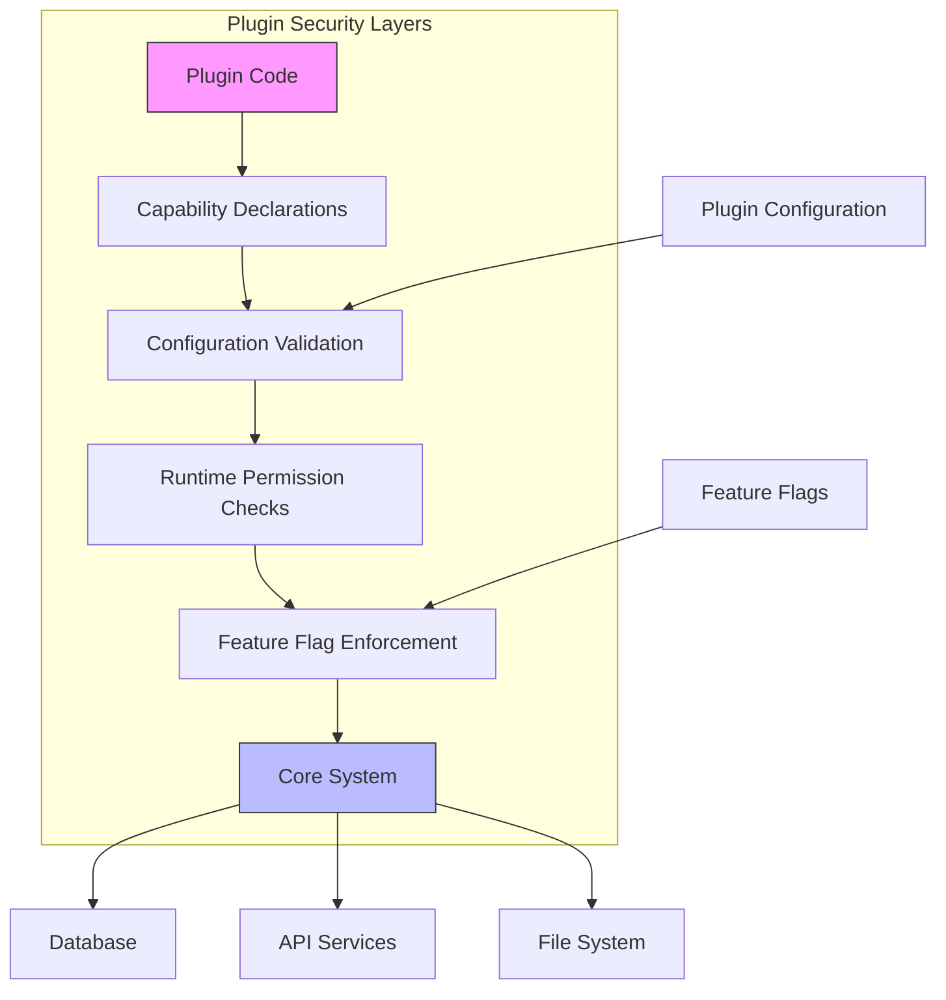
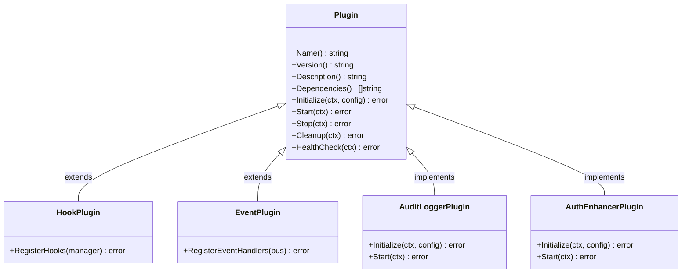
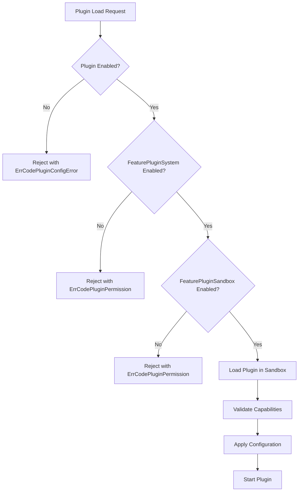
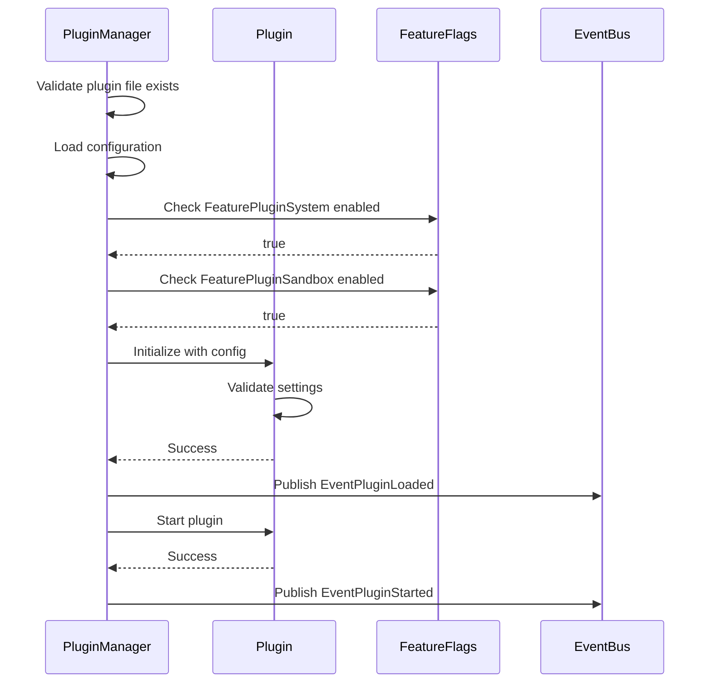
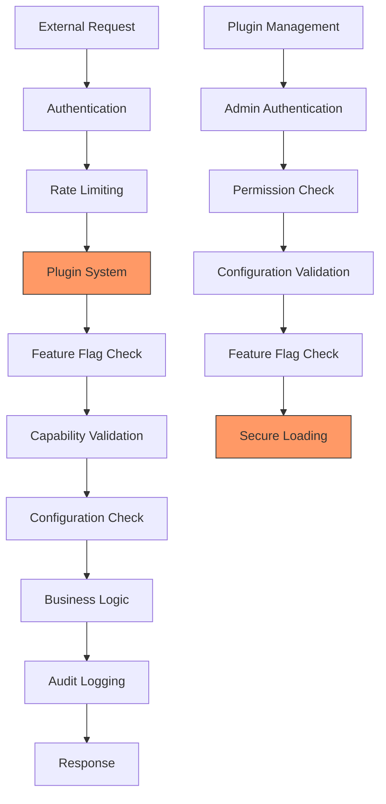

# Security Model

<cite>
**Referenced Files in This Document**   
- [types.go](file://internal/pkg/plugin/types.go#L0-L95)
- [interfaces.go](file://internal/pkg/plugin/interfaces.go#L0-L69)
- [plugin_manager.go](file://internal/pkg/plugin/plugin_manager.go#L0-L441)
- [audit_logger.yaml](file://configs/plugins/audit_logger.yaml#L0-L13)
- [auth_enhancer.yaml](file://configs/plugins/auth_enhancer.yaml#L0-L13)
- [file_repository.go](file://internal/pkg/feature/file_repository.go#L280-L327)
- [interfaces.go](file://internal/pkg/feature/interfaces.go#L0-L52)
</cite>

## Table of Contents
1. [Introduction](#introduction)
2. [Plugin Security Architecture](#plugin-security-architecture)
3. [Capability-Based Permissions Model](#capability-based-permissions-model)
4. [Plugin Configuration and Access Control](#plugin-configuration-and-access-control)
5. [Principle of Least Privilege Implementation](#principle-of-least-privilege-implementation)
6. [Secure vs Insecure Configuration Patterns](#secure-vs-insecure-configuration-patterns)
7. [Runtime Permission Validation](#runtime-permission-validation)
8. [Secure Plugin Design Guidelines](#secure-plugin-design-guidelines)
9. [Common Security Concerns](#common-security-concerns)
10. [Integration with Application Security Posture](#integration-with-application-security-posture)

## Introduction
The kratos-boilerplate framework implements a robust security model for its plugin system, designed to enforce strict access controls and prevent unauthorized operations. This document details the security sandbox mechanism that isolates plugins and governs their interactions with core system components through a capability-based permission system. The security model ensures that plugins operate within defined boundaries, minimizing potential attack surfaces while maintaining extensibility.

**Section sources**
- [types.go](file://internal/pkg/plugin/types.go#L0-L95)
- [interfaces.go](file://internal/pkg/plugin/interfaces.go#L0-L69)

## Plugin Security Architecture
The plugin security architecture in kratos-boilerplate is built around a sandboxed execution environment that restricts plugin capabilities through explicit permission declarations. The system employs a multi-layered approach combining configuration-based access control, runtime validation, and feature flag gating to ensure secure plugin operation.



**Diagram sources**
- [types.go](file://internal/pkg/plugin/types.go#L0-L95)
- [plugin_manager.go](file://internal/pkg/plugin/plugin_manager.go#L0-L441)

**Section sources**
- [types.go](file://internal/pkg/plugin/types.go#L0-L95)
- [plugin_manager.go](file://internal/pkg/plugin/plugin_manager.go#L0-L441)

## Capability-Based Permissions Model
The security model implements a capability-based permission system where plugins must explicitly declare their required capabilities. These capabilities are defined through interface implementations and configuration settings that determine the plugin's access to system resources and operations.

### Core Capability Interfaces
The framework defines several capability interfaces that plugins can implement to gain specific privileges:



**Diagram sources**
- [interfaces.go](file://internal/pkg/plugin/interfaces.go#L0-L69)
- [types.go](file://internal/pkg/plugin/types.go#L0-L95)

The capability model follows a strict opt-in principle:
- **Basic Capability**: All plugins implement the base `Plugin` interface, providing only lifecycle management
- **Hook Capability**: Plugins implementing `HookPlugin` can register middleware hooks at specific execution points
- **Event Capability**: Plugins implementing `EventPlugin` can subscribe to and handle system events

Plugins are only granted access to the capabilities they explicitly declare through interface implementation. This prevents privilege escalation by ensuring plugins cannot access functionality outside their declared scope.

**Section sources**
- [interfaces.go](file://internal/pkg/plugin/interfaces.go#L0-L69)
- [types.go](file://internal/pkg/plugin/types.go#L0-L95)

## Plugin Configuration and Access Control
Plugin configuration files in YAML format serve as the primary mechanism for controlling plugin access to sensitive operations and resources. The configuration system enforces security policies through structured settings that limit plugin behavior.

### Configuration Structure
The `PluginConfig` struct defines the configuration schema with security-focused fields:

```go
type PluginConfig struct {
    Enabled    bool                   `json:"enabled" yaml:"enabled"`
    Priority   int                    `json:"priority" yaml:"priority"`
    Settings   map[string]interface{} `json:"settings" yaml:"settings"`
    Timeout    time.Duration          `json:"timeout" yaml:"timeout"`
    RetryCount int                    `json:"retry_count" yaml:"retry_count"`
    Metadata   map[string]string      `json:"metadata" yaml:"metadata"`
}
```

### Security-Relevant Configuration Examples

**Audit Logger Configuration** (`audit_logger.yaml`):
```yaml
enabled: true
priority: 20
timeout: 30s
retry_count: 3
settings:
  log_level: "info"
  output_format: "json"
  max_log_size: "100MB"
  retention_days: 30
  sensitive_data_masking: true
metadata:
  category: "logging"
  author: "system"
  version: "1.0.0"
```

**Authentication Enhancer Configuration** (`auth_enhancer.yaml`):
```yaml
enabled: true
priority: 10
timeout: 30s
retry_count: 3
settings:
  jwt_validation: true
  rate_limiting: true
  max_requests_per_minute: 100
  token_expiry: 3600
  audit_logging: true
metadata:
  category: "authentication"
  author: "system"
  version: "1.0.0"
```

The configuration system enforces several security principles:
- **Explicit Enablement**: Plugins must be explicitly enabled in configuration
- **Resource Limits**: Timeout and retry settings prevent denial-of-service conditions
- **Behavior Control**: Settings govern specific security behaviors like sensitive data masking
- **Metadata Validation**: Metadata provides provenance and categorization for audit purposes

**Section sources**
- [types.go](file://internal/pkg/plugin/types.go#L0-L95)
- [audit_logger.yaml](file://configs/plugins/audit_logger.yaml#L0-L13)
- [auth_enhancer.yaml](file://configs/plugins/auth_enhancer.yaml#L0-L13)

## Principle of Least Privilege Implementation
The plugin system strictly adheres to the principle of least privilege through multiple enforcement mechanisms that ensure plugins operate with minimal necessary permissions.

### Default-Deny Security Policy
The system implements a default-deny approach where:
- Plugins are disabled by default (`enabled: false` would disable)
- Minimal permissions are granted initially
- Additional capabilities require explicit configuration
- Unused features are automatically disabled

### Feature Flag Integration
The security model integrates with the system's feature flag system to provide granular control over plugin capabilities:

```go
// Feature flags that control plugin security
const (
    FeaturePluginSystem  FeatureFlag = "plugin_system"
    FeaturePluginSandbox FeatureFlag = "plugin_sandbox"
    FeatureAuditLog      FeatureFlag = "audit_log"
    FeatureSensitiveData FeatureFlag = "sensitive_data"
)
```

These feature flags act as circuit breakers that can disable entire categories of functionality:
- `FeaturePluginSandbox`: Enables/disables the plugin sandbox environment
- `FeatureAuditLog`: Controls access to audit logging capabilities
- `FeatureSensitiveData`: Governs handling of sensitive data operations

### Capability Escalation Prevention
The system prevents privilege escalation through:
- **Interface Segregation**: Capabilities are separated into distinct interfaces
- **Runtime Validation**: Permission checks occur at method invocation time
- **Configuration Lockdown**: Configuration changes require administrative privileges
- **Dependency Verification**: Plugin dependencies are validated before loading



**Diagram sources**
- [file_repository.go](file://internal/pkg/feature/file_repository.go#L280-L327)
- [interfaces.go](file://internal/pkg/feature/interfaces.go#L0-L52)
- [plugin_manager.go](file://internal/pkg/plugin/plugin_manager.go#L0-L441)

**Section sources**
- [file_repository.go](file://internal/pkg/feature/file_repository.go#L280-L327)
- [interfaces.go](file://internal/pkg/feature/interfaces.go#L0-L52)
- [plugin_manager.go](file://internal/pkg/plugin/plugin_manager.go#L0-L441)

## Secure vs Insecure Configuration Patterns
The security model distinguishes between secure and insecure configuration patterns that significantly impact the overall system security posture.

### Secure Configuration Patterns
**Principle**: Explicit, minimal, and validated settings

```yaml
# Secure audit logger configuration
enabled: true
priority: 20
timeout: 10s  # Reasonable timeout
retry_count: 2  # Limited retries
settings:
  log_level: "warn"  # Minimal logging
  output_format: "json"
  max_log_size: "50MB"  # Enforced size limit
  retention_days: 14  # Compliance with policy
  sensitive_data_masking: true  # Data protection
metadata:
  category: "logging"
  security_critical: "true"
```

**Key Characteristics**:
- Conservative resource limits
- Sensitive data protection enabled
- Minimal logging level
- Short retention periods
- Explicit security metadata

### Insecure Configuration Patterns
**Principle**: Permissive, unlimited, and unvalidated settings

```yaml
# Insecure configuration example
enabled: true
priority: 100
timeout: 0s  # No timeout (dangerous)
retry_count: 10  # Excessive retries
settings:
  log_level: "debug"  # Excessive logging
  output_format: "text"  # Less secure format
  max_log_size: "0"  # No size limit
  retention_days: 365  # Excessive retention
  sensitive_data_masking: false  # Data exposure risk
metadata:
  category: "unknown"
  # Missing security metadata
```

**Security Risks**:
- Denial-of-service potential from unlimited timeouts
- Information disclosure from debug logging
- Storage exhaustion from unlimited log sizes
- Data privacy violations from disabled masking
- Lack of audit trail from missing metadata

The system validates configurations during loading and rejects insecure patterns when security policies are enforced.

**Section sources**
- [audit_logger.yaml](file://configs/plugins/audit_logger.yaml#L0-L13)
- [auth_enhancer.yaml](file://configs/plugins/auth_enhancer.yaml#L0-L13)
- [plugin_manager.go](file://internal/pkg/plugin/plugin_manager.go#L0-L441)

## Runtime Permission Validation
The security model includes comprehensive runtime validation mechanisms that enforce permission checks throughout the plugin lifecycle.

### Lifecycle Validation Process


### Error Handling and Validation
The system uses a comprehensive error code system to handle security violations:

```go
// Predefined error codes for security validation
const (
    ErrCodePluginNotFound     = "PLUGIN_NOT_FOUND"
    ErrCodePluginAlreadyExist = "PLUGIN_ALREADY_EXIST"
    ErrCodePluginLoadFailed   = "PLUGIN_LOAD_FAILED"
    ErrCodePluginStartFailed  = "PLUGIN_START_FAILED"
    ErrCodePluginConfigError  = "PLUGIN_CONFIG_ERROR"
    ErrCodePluginTimeout      = "PLUGIN_TIMEOUT"
    ErrCodePluginDependency   = "PLUGIN_DEPENDENCY_ERROR"
    ErrCodePluginPermission   = "PLUGIN_PERMISSION_ERROR"
    ErrCodePluginInternal     = "PLUGIN_INTERNAL_ERROR"
)
```

Each validation failure returns specific error codes that indicate the nature of the security violation, enabling proper auditing and troubleshooting.

**Diagram sources**
- [plugin_manager.go](file://internal/pkg/plugin/plugin_manager.go#L0-L441)
- [types.go](file://internal/pkg/plugin/types.go#L0-L95)

**Section sources**
- [plugin_manager.go](file://internal/pkg/plugin/plugin_manager.go#L0-L441)
- [types.go](file://internal/pkg/plugin/types.go#L0-L95)

## Secure Plugin Design Guidelines
To ensure plugins maintain the system's security posture, developers should follow these secure design principles.

### Minimizing Attack Surface
1. **Implement only necessary interfaces**: Only implement `HookPlugin` or `EventPlugin` if required
2. **Use minimal configuration**: Only define settings that are essential
3. **Validate all inputs**: Sanitize configuration and runtime inputs
4. **Implement proper error handling**: Avoid information leakage in error messages

### Secure Coding Practices
```go
// Example of secure plugin initialization
func (p *SecurePlugin) Initialize(ctx context.Context, config PluginConfig) error {
    // Validate configuration settings
    if config.Timeout < 1*time.Second || config.Timeout > 30*time.Second {
        return NewPluginError(ErrCodePluginConfigError, "timeout must be between 1s and 30s", p.Name(), nil)
    }
    
    // Validate settings
    if logLevel, ok := config.Settings["log_level"].(string); ok {
        if !isValidLogLevel(logLevel) {
            return NewPluginError(ErrCodePluginConfigError, "invalid log level", p.Name(), nil)
        }
    }
    
    // Initialize resources with proper limits
    p.logger = createLoggerWithLimits(config)
    
    return nil
}
```

### Security Checklist for Plugin Developers
- [ ] Implement only required capabilities
- [ ] Validate all configuration inputs
- [ ] Set reasonable timeouts and resource limits
- [ ] Enable sensitive data protection features
- [ ] Include security metadata in configuration
- [ ] Handle errors without information leakage
- [ ] Test with security feature flags disabled
- [ ] Document security assumptions and requirements

**Section sources**
- [interfaces.go](file://internal/pkg/plugin/interfaces.go#L0-L69)
- [types.go](file://internal/pkg/plugin/types.go#L0-L95)
- [plugin_manager.go](file://internal/pkg/plugin/plugin_manager.go#L0-L441)

## Common Security Concerns
The security model addresses several common concerns in plugin-based systems through proactive measures.

### Privilege Escalation Prevention
The system prevents privilege escalation through:
- **Interface-based capability control**: Plugins cannot access functionality beyond their implemented interfaces
- **Configuration validation**: Settings are validated against security policies
- **Feature flag gating**: High-privilege capabilities require enabled feature flags
- **Sandbox enforcement**: Plugins run in isolated environment with restricted access

### Configuration Injection Protection
The YAML configuration system protects against injection attacks by:
- **Strict schema validation**: Only predefined fields are accepted
- **Type checking**: Values are validated against expected types
- **Sanitization**: String values are sanitized before use
- **Whitelist approach**: Unknown fields are ignored or rejected

### Unsafe Dependencies Management
The dependency system includes safeguards:
- **Explicit dependency declaration**: Plugins must declare all dependencies
- **Version compatibility checking**: Dependency versions are validated
- **Isolated loading**: Dependencies are loaded in isolated contexts
- **Integrity verification**: Plugin files are verified before loading

The system also provides mechanisms to disable plugins with unsafe dependencies through the feature flag system.

**Section sources**
- [types.go](file://internal/pkg/plugin/types.go#L0-L95)
- [interfaces.go](file://internal/pkg/plugin/interfaces.go#L0-L69)
- [file_repository.go](file://internal/pkg/feature/file_repository.go#L280-L327)

## Integration with Application Security Posture
The plugin security model is fully integrated with the overall application security framework, creating a cohesive defense-in-depth strategy.

### Security Feature Integration
The plugin system interacts with other security components:
- **Audit Logging**: All plugin operations are logged when `FeatureAuditLog` is enabled
- **Sensitive Data Handling**: Plugins can leverage the sensitive data anonymizer
- **Rate Limiting**: Plugin API calls are subject to system rate limits
- **Authentication**: Plugin operations are authenticated and authorized

### Defense-in-Depth Strategy


**Diagram sources**
- [file_repository.go](file://internal/pkg/feature/file_repository.go#L280-L327)
- [plugin_manager.go](file://internal/pkg/plugin/plugin_manager.go#L0-L441)

The integration ensures that plugin security is not isolated but part of a comprehensive security ecosystem that includes:
- Centralized logging and monitoring
- Unified feature management
- Consistent authentication and authorization
- Standardized error handling and reporting

This holistic approach ensures that plugins do not introduce security weaknesses but instead benefit from and contribute to the overall security posture of the application.

**Section sources**
- [file_repository.go](file://internal/pkg/feature/file_repository.go#L280-L327)
- [plugin_manager.go](file://internal/pkg/plugin/plugin_manager.go#L0-L441)
- [interfaces.go](file://internal/pkg/feature/interfaces.go#L0-L52)