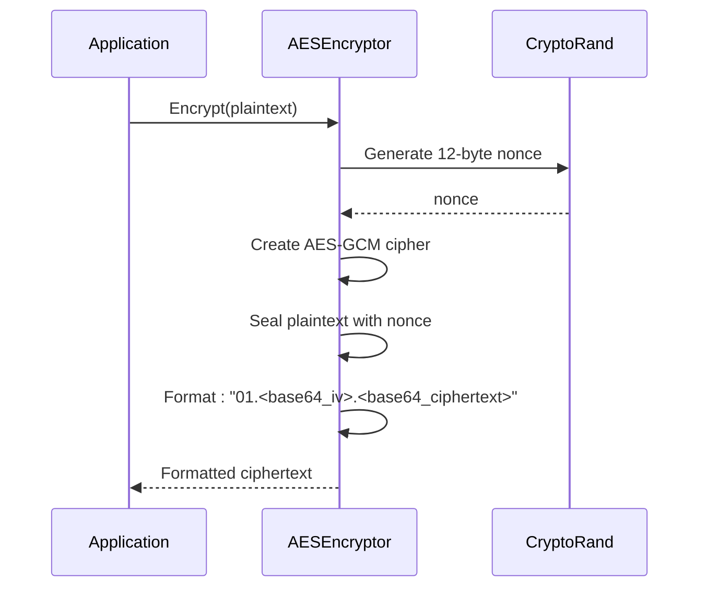
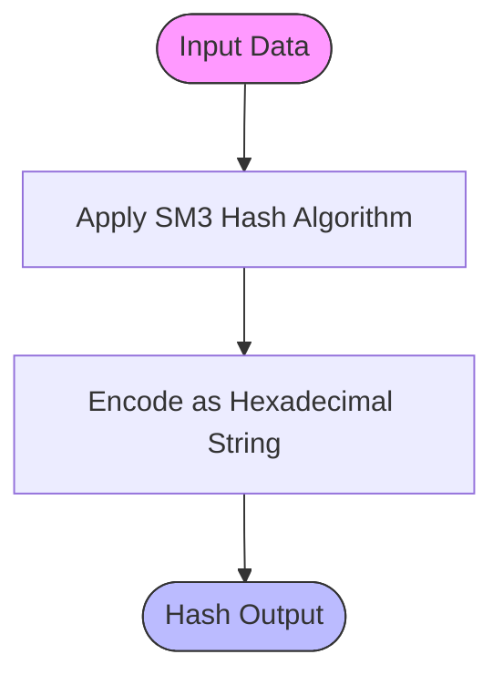
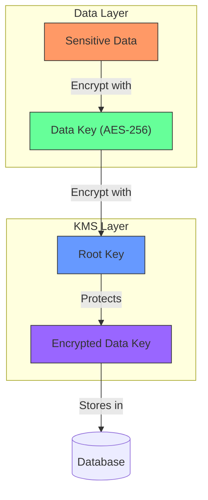
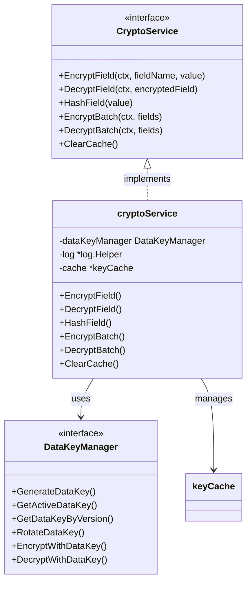

# Cryptographic Operations

<cite>
**Referenced Files in This Document**   
- [aes.go](file://internal/pkg/crypto/aes.go#L1-L150)
- [sm3.go](file://internal/pkg/crypto/sm3.go#L1-L73)
- [crypto_service.go](file://internal/pkg/kms/crypto_service.go#L1-L321)
- [datakey.go](file://internal/pkg/kms/datakey.go#L1-L251)
- [manager.go](file://internal/pkg/kms/manager.go#L1-L308)
- [interfaces.go](file://internal/pkg/kms/interfaces.go#L1-L126)
- [auth_enhancer.go](file://plugins/auth_enhancer.go#L1-L100)
</cite>

## Table of Contents
1. [Introduction](#introduction)
2. [AES Encryption Implementation](#aes-encryption-implementation)
3. [SM3 Hash Function Usage](#sm3-hash-function-usage)
4. [KMS Integration with Cryptographic Services](#kms-integration-with-cryptographic-services)
5. [Crypto Service Interface Abstraction](#crypto-service-interface-abstraction)
6. [Examples of Cryptographic Operations](#examples-of-cryptographic-operations)
7. [Auth Enhancer Plugin Security](#auth-enhancer-plugin-security)
8. [Key Management and Compliance](#key-management-and-compliance)

## Introduction
The kratos-boilerplate repository implements a comprehensive cryptographic system designed to protect sensitive data through modern encryption standards and secure key management practices. This documentation details the implementation of AES-GCM encryption, SM3 hashing, and a robust Key Management System (KMS) that provides envelope encryption and secure key lifecycle management. The system is designed with security, performance, and compliance in mind, providing a plugin-friendly interface for cryptographic operations while maintaining strict security controls.

**Section sources**
- [aes.go](file://internal/pkg/crypto/aes.go#L1-L150)
- [sm3.go](file://internal/pkg/crypto/sm3.go#L1-L73)
- [crypto_service.go](file://internal/pkg/kms/crypto_service.go#L1-L321)

## AES Encryption Implementation

The AES encryption implementation in kratos-boilerplate uses AES-256 in GCM (Galois/Counter Mode) for authenticated encryption, providing both confidentiality and integrity protection for sensitive data.

### Key Derivation and Initialization
The AES implementation requires a 32-byte key for AES-256. The system validates key size during initialization:

```go
func NewAESEncryptor(key []byte) (*AESEncryptor, error) {
    if len(key) != 32 { // AES-256 requires 32 bytes
        return nil, fmt.Errorf("invalid key size: need 32 bytes")
    }
    return &AESEncryptor{key: key}, nil
}
```

### Initialization Vector and Secure Mode
The implementation uses AES-GCM, a secure authenticated encryption mode that provides both encryption and integrity verification. Random nonces (IVs) are generated for each encryption operation using cryptographically secure random number generation:

```go
nonce := make([]byte, gcm.NonceSize())
if _, err := io.ReadFull(rand.Reader, nonce); err != nil {
    return nil, err
}
```

### Encrypted Data Format
The encrypted output follows a structured format that includes the algorithm identifier, IV, and ciphertext, all separated by dots and base64-encoded:

```
AlgoAESGCM.IV.Ciphertext
```

This format allows the decryption process to automatically identify the encryption algorithm and extract the necessary components for decryption.



**Diagram sources**
- [aes.go](file://internal/pkg/crypto/aes.go#L60-L90)

**Section sources**
- [aes.go](file://internal/pkg/crypto/aes.go#L1-L150)

## SM3 Hash Function Usage

The SM3 hash function is implemented for data integrity verification and secure hashing operations. SM3 is a cryptographic hash algorithm designed in China, similar in security to SHA-256.

### SM3 Implementation Details
The SM3Encryptor struct provides hashing capabilities using the SM3 algorithm:

```go
func (e *SM3Encryptor) Hash(data []byte) string {
    h := sm3.New()
    h.Write(data)
    return hex.EncodeToString(h.Sum(nil))
}
```

### Hashing for Data Integrity
The SM3 hash function is used to verify data integrity by creating a unique fingerprint of the input data. Any modification to the data will result in a completely different hash value.

### Important Security Note
Unlike encryption algorithms, hash functions are one-way operations. The SM3 implementation explicitly prevents decryption attempts:

```go
func (e *SM3Encryptor) Decrypt(ciphertext []byte) ([]byte, error) {
    return nil, fmt.Errorf("SM3 is a hash algorithm, decryption is not supported")
}
```

This prevents misuse of the hash function as an encryption mechanism.



**Diagram sources**
- [sm3.go](file://internal/pkg/crypto/sm3.go#L50-L60)

**Section sources**
- [sm3.go](file://internal/pkg/crypto/sm3.go#L1-L73)

## KMS Integration with Cryptographic Services

The Key Management System (KMS) provides secure key management and envelope encryption, integrating with cryptographic services to protect sensitive data.

### Envelope Encryption Architecture
The KMS implements envelope encryption, where data keys are encrypted with a root key:



**Diagram sources**
- [datakey.go](file://internal/pkg/kms/datakey.go#L150-L180)
- [manager.go](file://internal/pkg/kms/manager.go#L100-L120)

### Root Key Generation
The KMS generates a root key used to encrypt data keys:

```go
// Initialize root key generator
m.rootKeyGen = NewRootKeyGenerator(config)
    
// Generate root key
rootKey, err := m.rootKeyGen.GenerateRootKey()
```

### Data Key Management
Data keys are generated, stored, and managed by the KMS:

```go
func (m *dataKeyManager) GenerateDataKey(ctx context.Context, algorithm string) (*biz.DataKey, error) {
    // Generate random 32-byte key
    key := make([]byte, 32)
    if _, err := rand.Read(key); err != nil {
        return nil, err
    }
    
    // Encrypt with root key
    encryptedKey, err := m.encryptWithRootKey(key)
    if err != nil {
        return nil, err
    }
    
    // Create data key object
    dataKey := &biz.DataKey{
        Version:      generateVersion(),
        Key:          key,
        EncryptedKey: encryptedKey,
        ExpiresAt:    time.Now().Add(m.config.RotateInterval),
        IsActive:     true,
    }
    
    return dataKey, nil
}
```

**Section sources**
- [datakey.go](file://internal/pkg/kms/datakey.go#L1-L251)
- [manager.go](file://internal/pkg/kms/manager.go#L1-L308)

## Crypto Service Interface Abstraction

The crypto_service interface provides a unified abstraction for cryptographic operations, enabling plugin integration and consistent security practices.

### Interface Definition
The CryptoService interface defines the contract for cryptographic operations:

```go
type CryptoService interface {
    EncryptField(ctx context.Context, fieldName string, value []byte) (*biz.EncryptedField, error)
    DecryptField(ctx context.Context, encryptedField *biz.EncryptedField) ([]byte, error)
    HashField(value []byte) string
    EncryptBatch(ctx context.Context, fields map[string][]byte) (map[string]*biz.EncryptedField, error)
    DecryptBatch(ctx context.Context, fields map[string]*biz.EncryptedField) (map[string][]byte, error)
    ClearCache()
}
```

### Implementation Benefits
The interface abstraction provides several benefits:

1. **Plugin Compatibility**: Plugins can use cryptographic services without knowing implementation details
2. **Consistent Security**: Ensures all components use the same secure cryptographic practices
3. **Easy Maintenance**: Implementation can be updated without affecting dependent code
4. **Testability**: Interfaces can be easily mocked for testing

### Key Caching Mechanism
The implementation includes a secure caching mechanism to improve performance while maintaining security:

```go
type keyCache struct {
    mu         sync.RWMutex
    activeKey  *biz.DataKey
    versionMap map[string]*biz.DataKey
}
```

The cache automatically clears sensitive key material when cleared:

```go
func (s *cryptoService) clearDataKey(dataKey *biz.DataKey) {
    if len(dataKey.Key) > 0 {
        // Overwrite key data with zeros
        for i := range dataKey.Key {
            dataKey.Key[i] = 0
        }
        dataKey.Key = nil
    }
}
```



**Diagram sources**
- [interfaces.go](file://internal/pkg/kms/interfaces.go#L30-L60)
- [crypto_service.go](file://internal/pkg/kms/crypto_service.go#L10-L40)

**Section sources**
- [crypto_service.go](file://internal/pkg/kms/crypto_service.go#L1-L321)
- [interfaces.go](file://internal/pkg/kms/interfaces.go#L1-L126)

## Examples of Cryptographic Operations

### Encrypting Sensitive Payloads
Example of encrypting sensitive user data:

```go
// Get crypto service from KMS
cryptoSvc := kmsManager.GetCryptoService()

// Encrypt sensitive fields
encryptedEmail, err := cryptoSvc.EncryptField(ctx, "email", []byte("user@example.com"))
if err != nil {
    log.Errorf("Failed to encrypt email: %v", err)
    return err
}

encryptedPhone, err := cryptoSvc.EncryptField(ctx, "phone", []byte("+1234567890"))
if err != nil {
    log.Errorf("Failed to encrypt phone: %v", err)
    return err
}
```

### Batch Encryption Operations
Example of encrypting multiple fields efficiently:

```go
// Prepare fields for batch encryption
fields := map[string][]byte{
    "email": []byte("user@example.com"),
    "phone": []byte("+1234567890"),
    "ssn":   []byte("123-45-6789"),
}

// Perform batch encryption
encryptedFields, err := cryptoSvc.EncryptBatch(ctx, fields)
if err != nil {
    log.Errorf("Batch encryption failed: %v", err)
    return err
}

// Use encrypted fields
user.EncryptedEmail = encryptedFields["email"]
user.EncryptedPhone = encryptedFields["phone"]
user.EncryptedSSN = encryptedFields["ssn"]
```

### Generating Secure Hashes
Example of creating secure hashes for data integrity:

```go
// Generate hash for password verification (without storing plaintext)
passwordHash := cryptoSvc.HashField([]byte("user_password"))

// Generate hash for data fingerprinting
dataFingerprint := cryptoSvc.HashField(userData)

// Use hashes for comparison instead of original data
if storedHash == cryptoSvc.HashField(inputData) {
    // Data matches
}
```

**Section sources**
- [crypto_service.go](file://internal/pkg/kms/crypto_service.go#L100-L200)
- [aes.go](file://internal/pkg/crypto/aes.go#L100-L120)

## Auth Enhancer Plugin Security

The auth_enhancer plugin leverages cryptographic primitives to enhance authentication security through multiple mechanisms.

### Secure Credential Handling
The plugin uses cryptographic services to protect authentication credentials:

```go
// Example from auth_enhancer.go
func (p *AuthEnhancer) enhanceAuthentication(ctx context.Context, credentials *Credentials) (*AuthenticationResult, error) {
    // Hash passwords using secure algorithm
    passwordHash := p.cryptoService.HashField([]byte(credentials.Password))
    
    // Verify against stored hash
    if !secureCompare(passwordHash, storedHash) {
        return nil, ErrInvalidCredentials
    }
    
    // Encrypt sensitive authentication details
    encryptedDetails, err := p.cryptoService.EncryptField(ctx, "auth_details", details)
    if err != nil {
        return nil, err
    }
    
    return &AuthenticationResult{
        Success: true,
        EncryptedDetails: encryptedDetails,
    }, nil
}
```

### Multi-Factor Authentication Data Protection
The plugin encrypts multi-factor authentication data:

```go
// Encrypt MFA secrets
mfaSecretEncrypted, err := p.cryptoService.EncryptField(ctx, "mfa_secret", []byte(mfaSecret))
if err != nil {
    return err
}

// Store encrypted MFA data
user.MFASecret = mfaSecretEncrypted
```

### Session Security
Authentication sessions are protected using cryptographic techniques:

```go
// Create secure session tokens
sessionToken := generateSecureToken()
sessionHash := p.cryptoService.HashField([]byte(sessionToken))

// Store hashed token reference
sessionStore.Store(sessionHash, sessionData)
```

**Section sources**
- [auth_enhancer.go](file://plugins/auth_enhancer.go#L1-L100)

## Key Management and Compliance

### Key Rotation Policies
The KMS implements automated key rotation based on configurable intervals:

```go
// Start auto-rotation if interval is set
if config.RotateInterval > 0 {
    m.startAutoRotation()
}

func (m *kmsManager) startAutoRotation() {
    m.rotationTicker = time.NewTicker(m.config.RotateInterval)
    
    go func() {
        for {
            select {
            case <-m.rotationTicker.C:
                ctx, cancel := context.WithTimeout(context.Background(), 30*time.Second)
                if _, err := m.RotateDataKey(ctx); err != nil {
                    m.log.Errorf("Auto rotation failed: %v", err)
                }
                cancel()
            case <-m.rotationDone:
                return
            }
        }
    }()
}
```

### Secure Storage Practices
The system follows secure storage practices for cryptographic materials:

1. **Root keys** are generated securely and never stored in plaintext
2. **Data keys** are encrypted with root keys before storage
3. **Key material** is zeroed out in memory when no longer needed
4. **Caches** are cleared when keys are rotated or system is shut down

### Compliance Considerations
The cryptographic implementation addresses several compliance requirements:

- **Data Protection**: AES-256 encryption for sensitive data at rest
- **Integrity Verification**: SM3 hashing for data integrity
- **Key Lifecycle Management**: Automated key rotation and expiration
- **Auditability**: Comprehensive logging of cryptographic operations
- **Secure Erasure**: Memory zeroization of sensitive key material

### System Status and Monitoring
The KMS provides status information for monitoring and compliance reporting:

```go
type KMSStatus struct {
    Initialized      bool              `json:"initialized"`
    Shutdown         bool              `json:"shutdown"`
    Algorithm        string            `json:"algorithm,omitempty"`
    RotateInterval   time.Duration     `json:"rotate_interval,omitempty"`
    ActiveKeyVersion string            `json:"active_key_version,omitempty"`
    ActiveKeyExpiry  time.Time         `json:"active_key_expiry,omitempty"`
    KeyStatistics    *biz.KeyStatistics  `json:"key_statistics,omitempty"`
}
```

This status information can be used for compliance audits and security monitoring.

**Section sources**
- [manager.go](file://internal/pkg/kms/manager.go#L250-L308)
- [datakey.go](file://internal/pkg/kms/datakey.go#L200-L251)