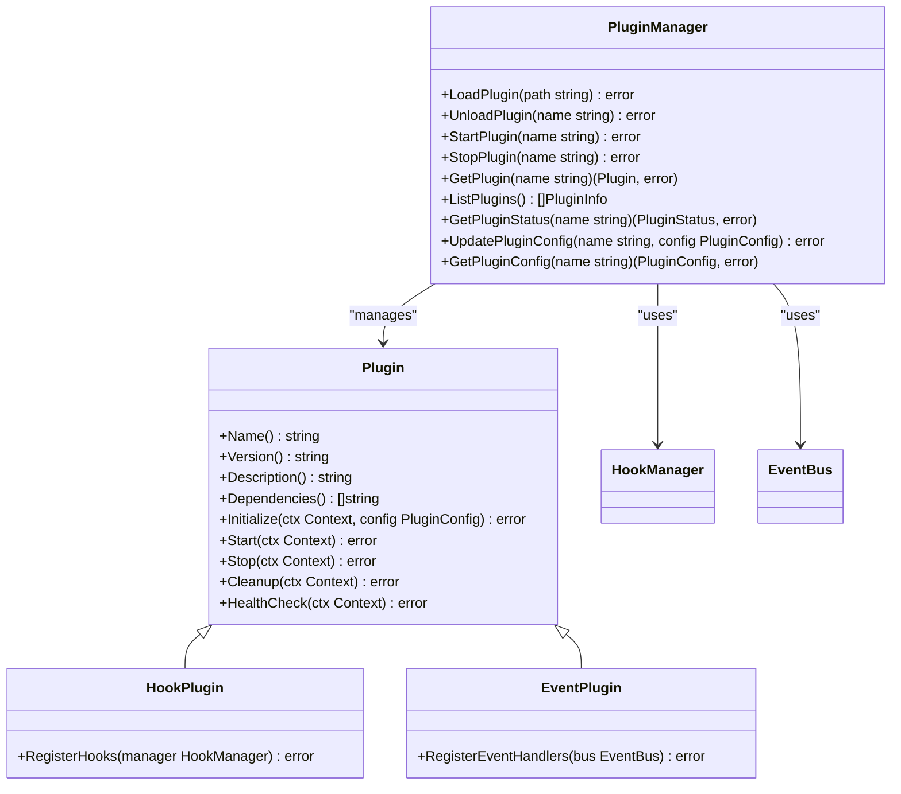
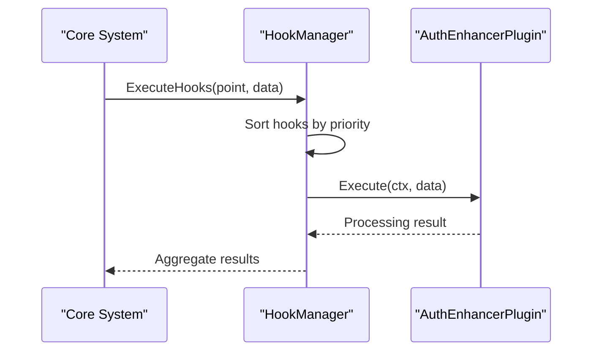
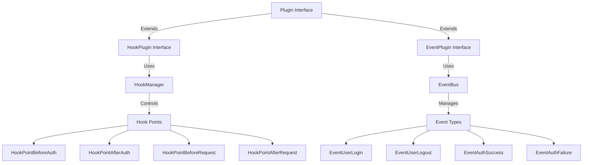
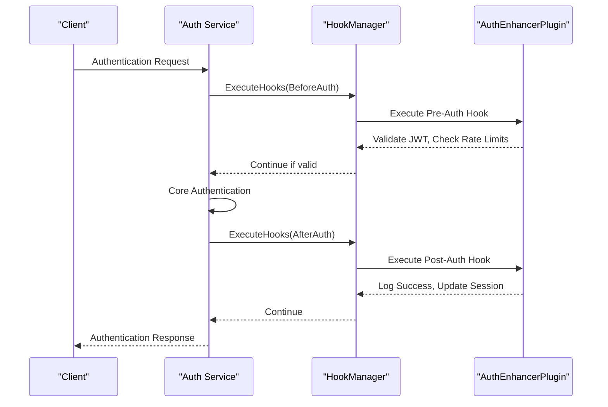
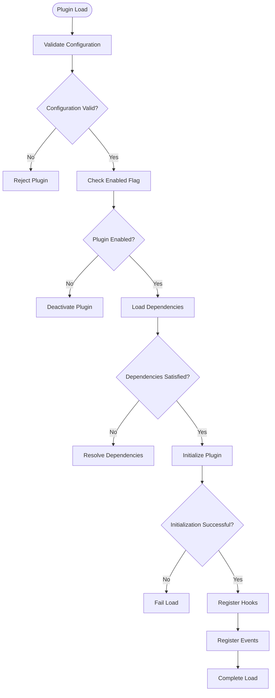

# Plugin System Security

<cite>
**Referenced Files in This Document**   
- [interfaces.go](file://internal/pkg/plugin/interfaces.go#L0-L69)
- [plugin_manager.go](file://internal/pkg/plugin/plugin_manager.go#L0-L441)
- [hook_manager.go](file://internal/pkg/plugin/hook_manager.go#L0-L234)
- [event_bus.go](file://internal/pkg/plugin/event_bus.go#L0-L273)
- [auth_enhancer.go](file://plugins/auth_enhancer.go#L0-L121)
- [auth_enhancer.yaml](file://configs/plugins/auth_enhancer.yaml#L0-L13)
</cite>

## Table of Contents
1. [Introduction](#introduction)
2. [Plugin Security Model Overview](#plugin-security-model-overview)
3. [Plugin Isolation and Capability Restrictions](#plugin-isolation-and-capability-restrictions)
4. [Hook System Architecture](#hook-system-architecture)
5. [Security Boundaries and Allowed Interfaces](#security-boundaries-and-allowed-interfaces)
6. [Configuration-Driven Plugin Behavior](#configuration-driven-plugin-behavior)
7. [Auth Enhancer Plugin Integration Example](#auth-enhancer-plugin-integration-example)
8. [Threat Mitigation Strategies](#threat-mitigation-strategies)
9. [Secure Plugin Development Guidelines](#secure-plugin-development-guidelines)

## Introduction
The kratos-boilerplate plugin system implements a comprehensive security model designed to enable extensibility while maintaining strict security boundaries. This document details the architecture and mechanisms that ensure plugin sandboxing, prevent privilege escalation, and provide controlled extension points through hooks and events. The system allows plugins like auth_enhancer to securely integrate with core functionality without direct access to sensitive systems.

## Plugin Security Model Overview
The plugin security model in kratos-boilerplate is built around the principle of least privilege, ensuring plugins operate within strictly defined boundaries. The system employs a multi-layered approach combining interface restrictions, configuration controls, and runtime monitoring to maintain security while enabling extensibility.

The core security components include:
- Plugin manager enforcing lifecycle and isolation
- Hook system for controlled integration points
- Event bus for decoupled communication
- Configuration-driven behavior control
- Runtime monitoring and health checks

This architecture ensures that plugins can extend functionality without compromising system integrity or security.

**Section sources**
- [interfaces.go](file://internal/pkg/plugin/interfaces.go#L0-L69)
- [plugin_manager.go](file://internal/pkg/plugin/plugin_manager.go#L0-L441)

## Plugin Isolation and Capability Restrictions
The plugin manager enforces strict isolation through a well-defined interface contract that limits plugin capabilities. Plugins are restricted to the methods defined in the Plugin interface, preventing direct access to core system components.



**Diagram sources**
- [interfaces.go](file://internal/pkg/plugin/interfaces.go#L0-L69)
- [plugin_manager.go](file://internal/pkg/plugin/plugin_manager.go#L0-L441)

The plugin manager implements capability restrictions through several mechanisms:

1. **Interface-based access control**: Plugins can only interact with the system through explicitly defined interfaces (Plugin, HookPlugin, EventPlugin).

2. **Sandboxed execution environment**: The plugin manager wraps each plugin in a pluginWrapper that controls access to system resources.

3. **Configuration validation**: All plugin configurations are validated before application, preventing malformed or malicious settings.

4. **Lifecycle management**: The plugin manager controls when plugins are loaded, started, and stopped, ensuring proper initialization and cleanup.

The pluginWrapper struct maintains separation between the plugin instance and system resources:

```go
type pluginWrapper struct {
    plugin      Plugin
    info        PluginInfo
    config      PluginConfig
    hooks       []Hook
    eventHandlers []EventHandler
}
```

This design ensures that plugins cannot bypass the security model by directly accessing system components.

**Section sources**
- [plugin_manager.go](file://internal/pkg/plugin/plugin_manager.go#L0-L441)
- [interfaces.go](file://internal/pkg/plugin/interfaces.go#L0-L69)

## Hook System Architecture
The hook system provides a secure mechanism for plugins to extend functionality without direct access to core systems. Hooks are registered at specific integration points, allowing plugins to participate in processing flows while maintaining isolation.



**Diagram sources**
- [hook_manager.go](file://internal/pkg/plugin/hook_manager.go#L0-L234)
- [auth_enhancer.go](file://plugins/auth_enhancer.go#L0-L121)

The hook system implements several security features:

1. **Priority-based execution**: Hooks are executed in order of priority, with lower numerical values indicating higher priority.

2. **Timeout enforcement**: Each hook has a configurable timeout to prevent hanging or denial-of-service attacks.

3. **Context propagation**: Hooks operate within a context that can be cancelled, allowing for graceful termination.

4. **Error isolation**: Errors in one hook do not prevent the execution of subsequent hooks.

The HookManager interface defines the contract for hook registration and execution:

```go
type HookManager interface {
    RegisterHook(point HookPoint, hook Hook) error
    UnregisterHook(point HookPoint, hookName string) error
    ExecuteHooks(ctx context.Context, point HookPoint, data HookData) error
    ListHooks(point HookPoint) []Hook
    GetHook(point HookPoint, hookName string) (Hook, error)
}
```

Plugins implement the HookPlugin interface to register their hooks:

```go
type HookPlugin interface {
    Plugin
    RegisterHooks(manager HookManager) error
}
```

This architecture ensures that plugins can extend functionality at well-defined integration points without requiring direct access to core system components.

**Section sources**
- [hook_manager.go](file://internal/pkg/plugin/hook_manager.go#L0-L234)
- [interfaces.go](file://internal/pkg/plugin/interfaces.go#L0-L69)

## Security Boundaries and Allowed Interfaces
The security boundaries in kratos-boilerplate are defined by the interfaces exposed to plugins in internal/pkg/plugin/interfaces.go. These interfaces establish the contract between plugins and the core system, ensuring that plugins operate within well-defined limits.

The primary security boundaries are:

1. **Plugin interface**: Defines the basic lifecycle and metadata methods that all plugins must implement.

2. **HookPlugin interface**: Extends Plugin to allow registration of hooks at specific integration points.

3. **EventPlugin interface**: Extends Plugin to allow registration of event handlers for asynchronous communication.

4. **PluginManager interface**: Controls plugin lifecycle and configuration, but is not directly accessible to plugins.

5. **PluginRegistry interface**: Manages plugin registration and discovery, but is abstracted from plugins.

The allowed interfaces provide controlled access to system functionality while preventing privilege escalation:



**Diagram sources**
- [interfaces.go](file://internal/pkg/plugin/interfaces.go#L0-L69)
- [hook_manager.go](file://internal/pkg/plugin/hook_manager.go#L0-L234)
- [event_bus.go](file://internal/pkg/plugin/event_bus.go#L0-L273)

Key security principles enforced by these interfaces:

1. **Least privilege**: Plugins only have access to the specific interfaces they need.

2. **Separation of concerns**: Different interfaces handle different aspects of plugin functionality.

3. **Controlled extension points**: Hooks and events provide specific, well-defined integration points.

4. **Configuration-driven behavior**: Plugin capabilities can be adjusted through configuration without code changes.

5. **Runtime monitoring**: Health checks and status tracking allow for monitoring plugin behavior.

These boundaries ensure that plugins can extend functionality while maintaining system security and stability.

**Section sources**
- [interfaces.go](file://internal/pkg/plugin/interfaces.go#L0-L69)
- [hook_manager.go](file://internal/pkg/plugin/hook_manager.go#L0-L234)
- [event_bus.go](file://internal/pkg/plugin/event_bus.go#L0-L273)

## Configuration-Driven Plugin Behavior
Plugin behavior and access levels are controlled through configuration files in the configs/plugins directory. The auth_enhancer.yaml configuration file demonstrates how plugin capabilities can be managed without code changes.

```yaml
enabled: true
priority: 10
timeout: 30s
retry_count: 3
settings:
  jwt_validation: true
  rate_limiting: true
  max_requests_per_minute: 100
  token_expiry: 3600
  audit_logging: true
metadata:
  category: "authentication"
  author: "system"
  version: "1.0.0"
```

The configuration system implements several security controls:

1. **Enable/disable control**: The enabled flag allows administrators to activate or deactivate plugins.

2. **Priority management**: The priority value determines execution order for hooks and events.

3. **Timeout enforcement**: The timeout setting prevents plugins from hanging or causing denial-of-service.

4. **Retry limits**: The retry_count parameter limits retry attempts to prevent resource exhaustion.

5. **Feature toggles**: Settings allow granular control over plugin functionality.

The plugin manager loads and validates configuration through the loadPluginConfig method:

```go
func (pm *pluginManagerImpl) loadPluginConfig(pluginName string) (PluginConfig, error) {
    configPath := filepath.Join(pm.configDir, pluginName+".yaml")
    
    config := PluginConfig{
        Enabled:    true,
        Priority:   100,
        Settings:   make(map[string]interface{}),
        Timeout:    30 * time.Second,
        RetryCount: 3,
        Metadata:   make(map[string]string),
    }
    
    // Merge with file configuration if it exists
    if _, err := os.Stat(configPath); !os.IsNotExist(err) {
        data, err := os.ReadFile(configPath)
        if err != nil {
            return config, NewPluginError(ErrCodePluginConfigError, "failed to read config file", pluginName, err)
        }
        
        if err := yaml.Unmarshal(data, &config); err != nil {
            return config, NewPluginError(ErrCodePluginConfigError, "failed to parse config file", pluginName, err)
        }
    }
    
    return config, nil
}
```

This configuration-driven approach allows for runtime adjustments to plugin behavior without requiring code changes or system restarts, providing flexibility while maintaining security controls.

**Section sources**
- [auth_enhancer.yaml](file://configs/plugins/auth_enhancer.yaml#L0-L13)
- [plugin_manager.go](file://internal/pkg/plugin/plugin_manager.go#L0-L441)

## Auth Enhancer Plugin Integration Example
The auth_enhancer plugin demonstrates how plugins can securely integrate with the authentication flow to add additional verification steps without direct access to core authentication systems.



**Diagram sources**
- [auth_enhancer.go](file://plugins/auth_enhancer.go#L0-L121)
- [hook_manager.go](file://internal/pkg/plugin/hook_manager.go#L0-L234)

The auth_enhancer plugin implements both hook and event functionality to extend authentication capabilities:

```go
func (p *AuthEnhancerPlugin) RegisterHooks(manager plugin.HookManager) error {
    // Pre-authentication hook for JWT validation and rate limiting
    authHook := plugin.NewBaseHook(
        "auth_enhancer_pre_auth",
        10, // High priority
        5*time.Second,
        func(ctx context.Context, data plugin.HookData) error {
            // JWT validation logic
            // Rate limiting checks
            return nil
        },
    )
    
    if err := manager.RegisterHook(plugin.HookPointBeforeAuth, authHook); err != nil {
        return err
    }
    
    // Post-authentication hook for logging and auditing
    authPostHook := plugin.NewBaseHook(
        "auth_enhancer_post_auth",
        20, // Lower priority
        5*time.Second,
        func(ctx context.Context, data plugin.HookData) error {
            // Audit logging
            // Session management
            return nil
        },
    )
    
    return manager.RegisterHook(plugin.HookPointAfterAuth, authPostHook)
}
```

The plugin also registers event handlers for user login events:

```go
func (p *AuthEnhancerPlugin) RegisterEventHandlers(bus plugin.EventBus) error {
    loginHandler := plugin.NewBaseEventHandler(
        "auth_enhancer_login_handler",
        []plugin.EventType{plugin.EventUserLogin},
        10*time.Second,
        func(ctx context.Context, event plugin.Event) error {
            // Login audit logging
            // Anomaly detection
            return nil
        },
    )
    
    return bus.Subscribe(plugin.EventUserLogin, loginHandler)
}
```

This integration pattern allows the auth_enancer plugin to enhance authentication security with JWT validation, rate limiting, and audit logging while operating within the security boundaries defined by the plugin system.

**Section sources**
- [auth_enhancer.go](file://plugins/auth_enhancer.go#L0-L121)
- [hook_manager.go](file://internal/pkg/plugin/hook_manager.go#L0-L234)
- [event_bus.go](file://internal/pkg/plugin/event_bus.go#L0-L273)

## Threat Mitigation Strategies
The kratos-boilerplate plugin system implements multiple threat mitigation strategies to protect against malicious plugins and ensure system security.

### Code Signing and Verification
While not explicitly implemented in the current codebase, the architecture supports code signing through:
- Plugin metadata fields for author and version
- Configuration-based enable/disable controls
- External verification systems that could validate plugin signatures before loading

### Permission Model
The system implements a capability-based permission model through:
- Interface restrictions that limit plugin capabilities
- Configuration-driven feature toggles
- Priority-based execution control
- Timeout enforcement to prevent denial-of-service



**Diagram sources**
- [plugin_manager.go](file://internal/pkg/plugin/plugin_manager.go#L0-L441)
- [interfaces.go](file://internal/pkg/plugin/interfaces.go#L0-L69)

### Runtime Monitoring
The system includes comprehensive runtime monitoring through:
- Health checks that verify plugin status
- Execution timeouts for hooks and event handlers
- Error tracking and logging
- Status reporting through the PluginManager interface

The Plugin interface requires health check implementation:

```go
type Plugin interface {
    // ... other methods
    HealthCheck(ctx context.Context) error
}
```

Plugins must implement health checks to report their operational status, allowing the system to detect and respond to issues.

### Isolation Mechanisms
Multiple isolation mechanisms prevent privilege escalation:
- Interface-based access control
- Configuration sandboxing
- Execution context separation
- Resource usage limits

These strategies work together to create a secure plugin environment that allows for extensibility while minimizing security risks.

**Section sources**
- [plugin_manager.go](file://internal/pkg/plugin/plugin_manager.go#L0-L441)
- [interfaces.go](file://internal/pkg/plugin/interfaces.go#L0-L69)
- [hook_manager.go](file://internal/pkg/plugin/hook_manager.go#L0-L234)

## Secure Plugin Development Guidelines
Developing secure plugins for kratos-boilerplate requires adherence to least-privilege principles and the security model established by the system.

### Follow Interface Contracts
Plugins should strictly implement the defined interfaces without attempting to bypass security boundaries:

```go
// Correct implementation
func (p *MyPlugin) RegisterHooks(manager plugin.HookManager) error {
    // Use only methods defined in HookManager interface
    return manager.RegisterHook(plugin.HookPointBeforeAuth, myHook)
}

// Avoid: attempting to access internal implementation details
// manager.(*hookManagerImpl).hooks // This would break encapsulation
```

### Implement Proper Error Handling
Plugins should handle errors gracefully and avoid exposing sensitive information:

```go
func (p *MyPlugin) HealthCheck(ctx context.Context) error {
    // Check internal state
    if !p.started {
        return fmt.Errorf("plugin not started") // Generic error message
    }
    
    // Validate external dependencies
    if err := p.validateDatabaseConnection(); err != nil {
        return fmt.Errorf("health check failed") // Avoid exposing database details
    }
    
    return nil
}
```

### Respect Configuration Settings
Plugins should honor configuration parameters and avoid hardcoding values:

```go
func (p *MyPlugin) Initialize(ctx context.Context, config plugin.PluginConfig) error {
    p.config = config
    
    // Use configured timeout
    if timeout, ok := config.Settings["timeout"]; ok {
        p.timeout = time.Duration(timeout.(int)) * time.Second
    } else {
        p.timeout = 30 * time.Second // Default from config
    }
    
    return nil
}
```

### Minimize Resource Usage
Plugins should be efficient and avoid resource exhaustion:

```go
func (p *MyPlugin) Execute(ctx context.Context, data plugin.HookData) error {
    // Respect context deadline
    select {
    case <-ctx.Done():
        return ctx.Err()
    case <-time.After(p.timeout):
        return fmt.Errorf("operation timed out")
    default:
        // Perform work
    }
    
    return nil
}
```

### Use Asynchronous Processing When Appropriate
For long-running operations, use event-driven architecture:

```go
func (p *MyPlugin) RegisterEventHandlers(bus plugin.EventBus) error {
    // Subscribe to events instead of blocking hooks
    handler := plugin.NewBaseEventHandler(
        "my_async_handler",
        []plugin.EventType{plugin.EventUserLogin},
        10*time.Second,
        func(ctx context.Context, event plugin.Event) error {
            // Process asynchronously
            go p.processLoginEvent(event)
            return nil
        },
    )
    
    return bus.Subscribe(plugin.EventUserLogin, handler)
}
```

By following these guidelines, developers can create plugins that extend functionality securely while maintaining system stability and performance.

**Section sources**
- [auth_enhancer.go](file://plugins/auth_enhancer.go#L0-L121)
- [interfaces.go](file://internal/pkg/plugin/interfaces.go#L0-L69)
- [plugin_manager.go](file://internal/pkg/plugin/plugin_manager.go#L0-L441)