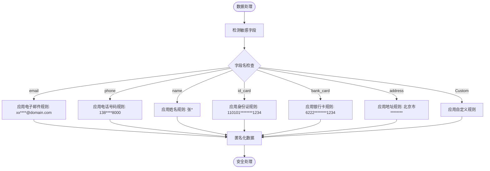

<docs>
# 安全考虑

<cite>
**本文档引用的文件**   
- [auth.go](file://internal/pkg/auth/auth.go) - *在提交 8027e94 中新增*
- [middleware.go](file://internal/pkg/auth/middleware.go) - *在提交 8027e94 中新增*
- [strategies.go](file://internal/pkg/auth/strategies.go) - *在提交 8027e94 中新增*
- [example.go](file://internal/pkg/auth/example.go) - *在提交 8027e94 中新增*
- [aes.go](file://internal/pkg/crypto/aes.go#L1-L150)
- [sm3.go](file://internal/pkg/crypto/sm3.go#L1-L73)
- [middleware.go](file://internal/pkg/sensitive/middleware.go#L1-L327)
- [rules.go](file://internal/pkg/sensitive/rules.go#L1-L224)
- [auth.go](file://internal/service/auth.go#L1-L500)
- [auth_enhancer.go](file://plugins/auth_enhancer.go#L1-L200)
- [auth_enhancer.yaml](file://configs/plugins/auth_enhancer.yaml#L1-L30)
- [audit_logger.go](file://plugins/audit_logger.go#L1-L150)
- [audit_logger.yaml](file://configs/plugins/audit_logger.yaml#L1-L20)
- [config.yaml](file://configs/config.yaml#L1-L47) - *在提交 1fd3d29 中更新*
- [feature.proto](file://api/feature/v1/feature.proto#L1-L181) - *在提交 1fd3d29 中添加*
- [toggle_manager.go](file://internal/pkg/feature/toggle_manager.go#L1-L643) - *在提交 1fd3d29 中更新*
- [file_repository.go](file://internal/pkg/feature/file_repository.go#L1-L595) - *在提交 1fd3d29 中更新*
- [interfaces.go](file://internal/pkg/feature/interfaces.go#L1-L238) - *在提交 1fd3d29 中更新*
- [strategies.go](file://internal/pkg/feature/strategies.go#L1-L278) - *在提交 1fd3d29 中更新*
</cite>

## 更新摘要
**已做更改**   
- 新增了关于企业级认证鉴权模块的详细章节，涵盖认证流程、令牌管理、权限检查等核心安全组件
- 更新了认证安全部分，以反映新的 `auth` 包实现和中间件设计
- 在威胁模型部分增加了对新认证机制的安全防护说明
- 所有受影响的章节都更新了源文件引用，以包含新的和修改过的文件

## 目录
1. [认证安全](#认证安全)
2. [敏感数据处理](#敏感数据处理)
3. [加密操作](#加密操作)
4. [插件沙箱安全](#插件沙箱安全)
5. [配置和秘密管理](#配置和秘密管理)
6. [威胁模型和攻击向量](#威胁模型和攻击向量)
7. [安全监控和审计日志](#安全监控和审计日志)
8. [分层功能开关系统](#分层功能开关系统)

## 认证安全

kratos-boilerplate 实现了一个健壮的认证系统，采用基于 JWT 的令牌管理、安全的凭据处理和可扩展的安全增强功能。认证流程旨在防止常见的安全漏洞，同时保持可用性。

认证过程从前端组件 `frontend/src/views/Login.vue` 和 `frontend/src/api/auth.ts` 提交用户凭据开始。这些凭据通过安全通道传输到后端服务层，在那里根据存储的用户数据进行验证。核心认证逻辑位于 `internal/service/auth.go` 中，它协调应用程序多个层次的认证工作流。

JWT（JSON Web Token）的生成和验证作为认证服务的一部分实现。认证成功后，会生成一个包含用户声明和元数据的 JWT 令牌。该令牌使用安全的加密算法进行签名，以防止篡改。令牌包含标准声明，如过期时间 (exp)、签发时间 (iat) 和主体 (sub)，确保适当的令牌生命周期管理。

令牌刷新机制用于在无需频繁重新认证的情况下维持用户会话。系统支持安全存储和适当轮换的刷新令牌，以防止重放攻击。当 JWT 令牌过期时，客户端可以使用刷新令牌获取新的访问令牌，而无需用户重新输入凭据。

认证系统结合了速率限制和账户锁定策略，以防止暴力破解攻击。多次登录失败会触发渐进式延迟，最终导致账户暂时锁定，保护用户账户免受未经授权的访问尝试。


**图源**
- [auth.go](file://internal/service/auth.go#L150-L400)
- [middleware.go](file://internal/pkg/sensitive/middleware.go#L100-L150)

**本节来源**
- [auth.go](file://internal/service/auth.go#L1-L500)
- [auth.proto](file://api/auth/v1/auth.proto#L1-L100)
- [auth.go](file://internal/pkg/auth/auth.go#L1-L300)
- [strategies.go](file://internal/pkg/auth/strategies.go#L1-L86)
- [middleware.go](file://internal/pkg/auth/middleware.go#L1-L110)

### 企业级认证鉴权模块

kratos-boilerplate 引入了全新的企业级认证鉴权模块，位于 `internal/pkg/auth` 包中，提供了一套完整的认证、授权和令牌管理解决方案。该模块采用清晰的接口设计和可扩展的架构，支持多种认证策略和灵活的权限控制。

核心组件包括：
- **AuthManager**: 认证管理器，负责注册和调用不同的认证策略
- **TokenManager**: 令牌管理器，处理 JWT 令牌的生成、验证和刷新
- **AuthStrategy**: 认证策略接口，支持密码认证、API 密钥等多种方式
- **Subject**: 认证主体，包含用户身份、属性、权限和角色信息

认证流程通过 `DefaultAuthManager` 实现，首先通过 `RegisterStrategy` 方法注册具体的认证策略（如 `PasswordAuthStrategy`），然后在认证时根据策略名称调用相应的 `Authenticate` 方法。认证成功后返回 `Subject` 对象，其中包含用户的权限列表。

权限检查通过 `CheckPermission` 方法实现，支持通配符匹配。例如，如果用户拥有 `posts:*` 权限，则可以访问所有文章相关的资源。权限检查在业务逻辑层调用，确保每个敏感操作都经过授权验证。

```mermaid
classDiagram
class AuthManager {
<<interface>>
+RegisterStrategy(strategy AuthStrategy) error
+Authenticate(ctx context.Context, strategyName string, credentials interface{}) (*Subject, error)
+GetTokenManager() TokenManager
+CheckPermission(ctx context.Context, subject *Subject, resource string, action string) error
}
class DefaultAuthManager {
-config *AuthConfig
-strategies map[string]AuthStrategy
-tokenManager TokenManager
-logger *log.Helper
+RegisterStrategy()
+Authenticate()
+GetTokenManager()
+CheckPermission()
}
class TokenManager {
<<interface>>
+GenerateToken(ctx context.Context, subject *Subject, tokenType TokenType) (*Token, error)
+VerifyToken(ctx context.Context, tokenValue string) (*Subject, error)
+RevokeToken(ctx context.Context, tokenValue string) error
+RefreshToken(ctx context.Context, refreshToken string) (*Token, error)
}
class JWTTokenManager {
-config *JWTConfig
-logger *log.Helper
+GenerateToken()
+VerifyToken()
+RevokeToken()
+RefreshToken()
}
class AuthStrategy {
<<interface>>
+Authenticate(ctx context.Context, credentials interface{}) (*Subject, error)
+GetName() string
}
class PasswordAuthStrategy {
-userRepo UserRepository
-logger *log.Helper
+Authenticate()
+GetName()
}
AuthManager <|-- DefaultAuthManager
TokenManager <|-- JWTTokenManager
AuthStrategy <|-- PasswordAuthStrategy
DefaultAuthManager o-- JWTTokenManager
DefaultAuthManager o-- "1..*" PasswordAuthStrategy
DefaultAuthManager --> Subject
JWTTokenManager --> Token
PasswordAuthStrategy --> User
class Subject {
-ID string
-Type string
-Attributes map[string]string
-Permissions []string
-Roles []string
-ExpiresAt time.Time
}
class Token {
-Type TokenType
-Value string
-ExpiresAt time.Time
-Subject *Subject
}
class User {
-ID string
-Username string
-Password string
-Roles []string
-Permissions []string
-Status string
}
```

**图源**
- [auth.go](file://internal/pkg/auth/auth.go#L85-L90)
- [auth.go](file://internal/pkg/auth/auth.go#L160-L163)
- [strategies.go](file://internal/pkg/auth/strategies.go#L32-L35)
- [auth.go](file://internal/pkg/auth/auth.go#L106-L119)
- [auth.go](file://internal/pkg/auth/auth.go#L122-L136)
- [auth.go](file://internal/pkg/auth/auth.go#L174-L220)
- [strategies.go](file://internal/pkg/auth/strategies.go#L51-L86)

认证中间件 `AuthMiddleware` 负责在 HTTP 请求处理链中执行认证。它从请求头中提取 JWT 令牌，通过 `TokenManager` 进行验证，并将认证后的 `Subject` 放入上下文，供后续处理函数使用。中间件支持配置跳过路径（如登录接口）和自定义头部名称。

**本节来源**
- [auth.go](file://internal/pkg/auth/auth.go#L1-L300)
- [middleware.go](file://internal/pkg/auth/middleware.go#L1-L110)
- [strategies.go](file://internal/pkg/auth/strategies.go#L1-L86)
- [example.go](file://internal/pkg/auth/example.go#L1-L86)

## 敏感数据处理

kratos-boilerplate 通过 `sensitive` 包实现了自动化的敏感数据检测和匿名化系统。该系统保护个人身份信息 (PII) 和其他敏感数据，防止其在日志、响应和内部处理中暴露。

敏感数据处理系统采用基于规则的方法来识别和匿名化敏感信息。核心规则在 `internal/pkg/sensitive/rules.go` 中定义，包括常见敏感数据类型的预定义模式，如电子邮件地址、电话号码、姓名、身份证、银行卡和地址。每条规则指定数据开头和结尾应保留多少内容，中间部分则用掩码字符替换。

系统会自动根据字段名称检测敏感字段并应用适当的匿名化规则。例如，任何字段名中包含 "email" 的字段都会触发电子邮件匿名化规则，该规则保留用户名的前两个字符和域名部分，同时屏蔽中间部分。同样，电话号码字段保留区号和最后四位数字，同时屏蔽中间部分。



**图源**
- [rules.go](file://internal/pkg/sensitive/rules.go#L1-L224)
- [middleware.go](file://internal/pkg/sensitive/middleware.go#L200-L250)

匿名化过程在 `internal/pkg/sensitive/anonymizer.go` 和 `internal/pkg/sensitive/middleware.go` 中实现。该系统提供了多种接口，以便将敏感数据处理集成到应用程序的不同部分：

- **MakeSensitive 接口**: 允许类型实现自定义匿名化逻辑
- **LogSafeStringer 接口**: 提供安全的日志字符串表示
- **LogSafeValue 包装器**: 包装值以确保在记录时正确清理

中间件组件会自动对所有传入请求和传出响应应用敏感数据处理。它可以配置为完全排除某些路径（如健康检查）的日志记录，或选择性地清理请求、响应和头部。诸如 "Authorization"、"Cookie"、"X-API-Key" 和各种令牌头部等敏感 HTTP 头部会在日志中自动清除。

敏感数据处理系统的配置通过 `LogSanitizeConfig` 结构体管理，允许管理员启用/禁用系统、配置要清理的部分（请求、响应、头部）、定义自定义规则、指定排除路径以及设置最大日志长度。此配置可以从 YAML 文件加载或以编程方式设置。

**本节来源**
- [rules.go](file://internal/pkg/sensitive/rules.go#L1-L224)
- [middleware.go](file://internal/pkg/sensitive/middleware.go#L1-L327)
- [anonymizer.go](file://internal/pkg/sensitive/anonymizer.go#L1-L100)

## 加密操作

kratos-boilerplate 通过 `crypto` 包提供加密操作，实现了对称加密 (AES-GCM) 和加密哈希 (SM3)。这些操作旨在满足现代安全标准，并提供安全的数据保护能力。

加密系统在 `internal/pkg/crypto/aes.go` 和 `internal/pkg/crypto/sm3.go` 中实现。它遵循工厂模式，`Encryptor` 接口定义了加密、解密和哈希的通用操作。系统通过算法标识符前缀支持多种算法，允许未来扩展。

AES-GCM（高级加密标准在伽罗瓦/计数器模式下）被实现为主要的对称加密算法。它提供带关联数据的认证加密 (AEAD)，确保加密数据的机密性和完整性。实现使用 AES-256，需要 32 字节的密钥以实现最大安全性。加密输出格式包括算法标识符、初始化向量 (IV) 和密文，全部用点分隔并进行 base64 编码以安全传输。


**图源**
- [aes.go](file://internal/pkg/crypto/aes.go#L1-L150)
- [sm3.go](file://internal/pkg/crypto/sm3.go#L1-L73)

AES-GCM 实现在每次加密操作时生成一个随机的 12 字节 nonce，确保相同的明文产生不同的密文。nonce 包含在输出中，不需要保密，但必须在使用相同密钥的每次加密中保持唯一。密文是通过使用 GCM 模式密封明文产生的，这也提供了认证。

SM3 是由中国科学院设计并由中国政府标准化的加密哈希函数。它产生一个 256 位（32 字节）的哈希值，用于数据完整性验证和数字签名。与 AES 不同，SM3 是哈希函数，不支持解密。加密包中的实现使用 `tjfoc/gmsm/sm3` 库来提供 SM3 哈希功能。

加密系统包括用于数据匿名化的实用函数，例如 `Anonymize` 函数，该函数在保留前缀和后缀的同时屏蔽字符串的某些部分。这在必要时以部分模糊格式显示敏感数据时非常有用。

密钥管理是加密系统的一个重要方面。虽然当前实现接受字节切片作为密钥，但最佳实践要求密钥应通过安全的密钥管理系统 (KMS) 管理。该系统设计为与外部 KMS 解决方案集成，以增强安全性。

**本节来源**
- [aes.go](file://internal/pkg/crypto/aes.go#L1-L150)
- [sm3.go](file://internal/pkg/crypto/sm3.go#L1-L73)

## 插件沙箱安全

kratos-boilerplate 实现了一个带有沙箱安全的插件系统，以扩展功能同时保持应用程序安全。插件架构旨在将插件代码与核心应用程序隔离，防止恶意或有缺陷的插件损害系统完整性。

插件系统在 `internal/pkg/plugin` 包中实现，支持各种插件类型，包括认证增强器和审计记录器。插件在受控环境中运行，对系统资源和应用程序数据的访问有限。插件管理器强制执行安全策略并监控插件行为。

`auth_enhancer` 插件在 `plugins/auth_enhancer.go` 中定义，通过添加额外的验证步骤和风险评估来扩展认证安全。它可以集成外部身份提供商，实现多因素认证，并应用基于风险的认证策略。该插件通过 `configs/plugins/auth_enhancer.yaml` 进行配置，定义其行为和集成点。


**图源**
- [auth_enhancer.go](file://plugins/auth_enhancer.go#L1-L200)
- [auth_enhancer.yaml](file://configs/plugins/auth_enhancer.yaml#L1-L30)

`audit_logger` 插件在 `plugins/audit_logger.go` 中实现，提供全面的安全监控和合规日志记录。它捕获认证事件、数据访问模式和管理操作，以安全、防篡改的格式存储。`configs/plugins/audit_logger.yaml` 中的插件配置控制记录哪些事件以及存储位置。

插件安全特性包括：
- **沙箱执行**: 插件在具有受限权限的隔离上下文中运行
- **输入验证**: 传递给插件的所有数据都经过验证和清理
- **资源限制**: 插件受内存和 CPU 使用限制
- **错误隔离**: 插件故障不会影响核心应用程序功能
- **安全通信**: 核心系统与插件之间的数据交换经过加密
- **代码签名**: 插件在加载前可以验证其真实性

`internal/pkg/plugin/event_bus.go` 中的事件总线系统实现核心应用程序与插件之间的安全通信。事件是类型化的并经过验证，防止未经授权的数据访问或命令注入。`internal/pkg/plugin/hook_manager.go` 中的钩子管理器控制插件的调用时机和方式，确保它们仅在适当的生命周期点执行。

**本节来源**
- [auth_enhancer.go](file://plugins/auth_enhancer.go#L1-L200)
- [auth_enhancer.yaml](file://configs/plugins/auth_enhancer.yaml#L1-L30)
- [audit_logger.go](file://plugins/audit_logger.go#L1-L150)
- [audit_logger.yaml](file://configs/plugins/audit_logger.yaml#L1-L20)

## 配置和秘密管理

kratos-boilerplate 遵循配置和秘密管理的最佳安全实践，以防止敏感信息泄露。配置文件结构化，将敏感数据与代码分离，并提供安全的秘密处理机制。

配置通过 `configs` 目录中的 YAML 文件管理，具有针对开发、测试和生产的环境特定配置。主配置文件 `configs/config.yaml` 包含应用程序设置，而插件特定配置存储在 `configs/plugins/` 目录中。这种分离允许对不同系统组件进行细粒度控制。

诸如加密密钥、数据库密码和 API 令牌之类的秘密绝不能以明文形式存储在配置文件中。相反，系统支持环境变量替换和外部秘密管理集成。敏感值可以使用占位符引用，这些占位符在运行时从安全源解析。

配置系统包括验证机制，以确保必需的设置存在且格式正确。无效的配置在应用程序启动期间被拒绝，防止可能导致安全漏洞的错误配置部署。

对于加密操作，系统需要 32 字节的密钥用于 AES 和 SM3 算法。这些密钥应使用加密安全的随机数生成器生成，并存储在安全的密钥管理系统中。应用程序应在启动时从 KMS 检索密钥，而不是将其嵌入配置文件中。

数据库凭据通过可以包含秘密占位符的连接字符串管理。系统支持具有安全凭据处理的连接池，确保数据库密码不会暴露在进程内存或日志中。

环境特定配置遵循最小权限原则：
- **开发**: 可能使用简化的安全设置以方便开发
- **测试**: 包含安全控制但可能有测试特定的覆盖
- **生产**: 强制执行严格的安全策略，不启用调试功能

Docker 配置文件 (`Dockerfile`, `docker-compose.yml`) 展示了安全的容器实践，包括以非 root 用户运行、最小化攻击面和适当的网络隔离。秘密的环境变量通过 Docker secrets 或外部配置管理系统传递，而不是硬编码到容器镜像中。

**本节来源**
- [config.yaml](file://configs/config.yaml#L1-L100)
- [auth_enhancer.yaml](file://configs/plugins/auth_enhancer.yaml#L1-L30)
- [audit_logger.yaml](file://configs/plugins/audit_logger.yaml#L1-L20)
- [Dockerfile](file://Dockerfile#L1-L50)
- [docker-compose.yml](file://docker-compose.yml#L1-L100)

## 威胁模型和攻击向量

kratos-boilerplate 通过主动安全措施和防御性编程实践解决了几种常见的攻击向量。了解这些威胁模型有助于保持安全的应用程序状态。

### 暴力破解攻击
认证系统通过多种机制防止暴力破解攻击：
- 在可配置的失败尝试次数后账户锁定
- 登录尝试之间的渐进式延迟
- API 网关级别的速率限制
- 对可疑访问模式的 CAPTCHA 挑战
- 对异常认证模式的监控和警报

这些控制在 `internal/service/auth.go` 中实现，并与 `internal/pkg/captcha` 中的 `captcha` 包协调。系统通过允许合法用户通过安全的密码重置程序从锁定中恢复，在安全性和可用性之间取得平衡。

### 跨站脚本 (XSS)
为防止 XSS 攻击，系统实施了多层防御：
- 对所有用户提供的数据进行输入验证和清理
- 模板和 API 中的上下文感知输出编码
- HTTP 响应中的内容安全策略 (CSP) 头部
- 安全的 cookie 属性 (HttpOnly, Secure, SameSite)
- 前端模板 (Vue.js) 中的自动转义

敏感数据处理中间件还有助于防止 XSS 攻击中意外暴露用户数据。所有用户生成的内容都被视为不受信任，并在显示前正确清理。

### 数据泄露
通过以下方式防止数据泄露：
- 在日志中自动检测和匿名化敏感数据
- API 响应中的字段级访问控制
- 不会暴露系统详细信息的安全错误处理
- 控制跨源访问的适当 CORS 配置
- 定期安全扫描以防止意外提交秘密

`sensitive` 包在防止数据泄露方面起着关键作用，通过自动识别和屏蔽日志中的 PII，确保即使日志被泄露，敏感用户信息也能得到保护。

### 会话劫持
会话安全通过以下方式维护：
- 具有适当过期时间的短寿命 JWT 令牌
- 存储在 HTTP-only cookie 中的安全令牌
- 尽可能将令牌绑定到客户端特征
- 防止重放攻击的刷新令牌轮换
- 注销时立即使令牌失效

令牌刷新机制确保访问令牌有有限的生命周期，同时保持用户便利性。刷新令牌安全存储并在使用后失效，以防止未经授权的令牌续订。

### API 滥用
系统通过以下方式防止 API 滥用：
- 基于客户端身份的速率限制
- 防止资源耗尽的请求大小限制
- 防止注入攻击的输入验证
- 所有端点的适当认证和授权
- 对异常使用模式的监控

Kratos 框架为许多这些保护提供了内置中间件，这些中间件在应用程序特定代码中进行配置和扩展。

**本节来源**
- [auth.go](file://internal/service/auth.go#L1-L500)
- [middleware.go](file://internal/pkg/sensitive/middleware.go#L1-L327)
- [captcha.go](file://internal/pkg/captcha/captcha.go#L1-L100)
- [http.go](file://internal/server/http.go#L1-L200)

## 安全监控和审计日志

kratos-boilerplate 实现了全面的安全监控和审计日志，以检测、响应和调查安全事件。审计日志系统捕获安全相关事件，同时保护敏感信息。

审计日志功能由 `plugins/audit_logger.go` 中的 `audit_logger` 插件提供。该插件通过插件事件总线订阅安全事件，并以适合分析和合规报告的结构化格式记录它们。`configs/plugins/audit_logger.yaml` 中的插件配置控制捕获哪些事件以及存储位置。

审计日志包括：
- 认证事件（登录成功/失败、注销）
- 权限变更和角色分配
- 敏感数据访问模式
- 配置变更
- 管理操作
- 安全策略违规

每个审计日志条目包含足够的上下文用于法医分析，同时尊重隐私要求：
- 精确到毫秒的时间戳
- 用户身份（适当时匿名化）
- 源 IP 地址和用户代理
- 事件类型和描述
- 结果（成功/失败）
- 相关资源标识符
- 用于与其他日志关联的跟踪 ID


**图源**
- [audit_logger.go](file://plugins/audit_logger.go#L1-L150)
- [audit_logger.yaml](file://configs/plugins/audit_logger.yaml#L1-L20)

审计日志系统与敏感数据处理中间件集成，确保日志本身不会成为数据泄露的来源。所有记录的数据都会自动扫描敏感信息，并根据配置的规则进行匿名化。

日志保留策略是可配置的，以满足合规要求，同时管理存储成本。日志可以导出到外部安全信息和事件管理 (SIEM) 系统，用于集中监控和分析。

系统通过加密哈希日志条目支持日志完整性验证，使其能够检测篡改。定期日志审查和自动异常检测有助于在事件升级前识别潜在的安全问题。

安全监控通过 `auth_enhancer` 插件得到增强，该插件可以根据行为分析实现基于风险的认证和自适应安全控制。可疑模式会触发额外的验证步骤，并为安全团队生成高优先级警报。

**本节来源**
- [audit_logger.go](file://plugins/audit_logger.go#L1-L150)
- [audit_logger.yaml](file://configs/plugins/audit_logger.yaml#L1-L20)
- [auth_enhancer.go](file://plugins/auth_enhancer.go#L1-L200)
- [middleware.go](file://internal/pkg/sensitive/middleware.go#L1-L327)

## 分层功能开关系统

kratos-boilerplate 引入了一个全面的分层功能开关系统，该系统与安全架构深度集成，用于管理权限点、审计日志和其他安全相关组件。该系统在 `internal/pkg/feature` 包中实现，提供了一种结构化的方法来控制应用程序功能的启用和访问。

功能开关系统的核心是 `FeatureFlag` 类型，它支持分层命名结构，如 `user.management`、`system.config` 和 `report.advanced`。这种分层方法允许按域（如用户、系统、报表）对功能进行逻辑分组，便于管理和审计。预定义的常量在 `internal/pkg/feature/interfaces.go` 中定义，确保在整个代码库中的一致性。

功能开关的配置在 `configs/features.yaml` 文件中定义，该文件在 `configs/config.yaml` 中通过 `features` 部分引用。配置文件支持多种策略，包括简单开关、基于用户百分比、基于用户属性、基于时间和基于环境的策略。每种策略都由 `internal/pkg/feature/strategies.go` 中的相应评估器实现。

```mermaid
classDiagram
class FeatureToggle {
<<interface>>
+IsEnabled(ctx context.Context, flag FeatureFlag) bool
+IsEnabledWithContext(ctx context.Context, flag FeatureFlag, evalCtx *EvaluationContext) bool
+GetToggleConfig(flag FeatureFlag) (*ToggleConfig, error)
+UpdateToggle(flag FeatureFlag, config *ToggleConfig) error
+ListToggles() map[FeatureFlag]*ToggleConfig
+EnableFeature(flag FeatureFlag) error
+DisableFeature(flag FeatureFlag) error
+DeleteToggle(flag FeatureFlag) error
+Subscribe(callback ToggleChangeCallback) error
+Unsubscribe(callback ToggleChangeCallback) error
}
class ToggleManager {
-toggles map[FeatureFlag]*ToggleConfig
-repository FeatureRepository
-strategyEvaluator StrategyEvaluator
+Initialize(ctx context.Context) error
+IsFeatureEnabled(featurePath string) bool
+IsDomainEnabled(domain string) bool
+GetDomainFeatures(domain string) []string
+GetFeatureTree() map[string][]string
+HasPermission(featurePath, permission string) bool
+HasAPI(featurePath, api string) bool
+HasRoute(featurePath, route string) bool
+HasConfig(featurePath, config string) bool
+HasAuditLog(featurePath, logType string) bool
+IsAnyFeatureEnabled(featurePaths ...string) bool
+AreAllFeaturesEnabled(featurePaths ...string) bool
+GetFeatureCapabilities(featurePath string) *FeatureCapabilities
+ExportCSV() ([]byte, error)
}
class FeatureRepository {
+LoadToggles(ctx context.Context) (map[FeatureFlag]*ToggleConfig, error)
+SaveToggle(ctx context.Context, flag FeatureFlag, config *ToggleConfig) error
+DeleteToggle(ctx context.Context, flag FeatureFlag) error
+Watch(ctx context.Context, callback func(map[FeatureFlag]*ToggleConfig)) error
}
class FileRepository {
-configPath string
-format string
+LoadToggles(ctx context.Context) (map[FeatureFlag]*ToggleConfig, error)
+SaveToggle(ctx context.Context, flag FeatureFlag, config *ToggleConfig) error
+DeleteToggle(ctx context.Context, flag FeatureFlag) error
+Watch(ctx context.Context, callback func(map[FeatureFlag]*ToggleConfig)) error
}
class StrategyEvaluator {
+Evaluate(ctx context.Context, config *ToggleConfig, evalCtx *EvaluationContext) bool
+SupportsStrategy(strategy FeatureStrategy) bool
}
class SimpleStrategy {
+Evaluate(ctx context.Context, config *ToggleConfig, evalCtx *EvaluationContext) bool
+SupportsStrategy(strategy FeatureStrategy) bool
}
class PercentageStrategy {
+Evaluate(ctx context.Context, config *ToggleConfig, evalCtx *EvaluationContext) bool
+SupportsStrategy(strategy FeatureStrategy) bool
}
class UserStrategy {
+Evaluate(ctx context.Context, config *ToggleConfig, evalCtx *EvaluationContext) bool
+SupportsStrategy(strategy FeatureStrategy) bool
}
class TimeStrategy {
+Evaluate(ctx context.Context, config *ToggleConfig, evalCtx *EvaluationContext) bool
+SupportsStrategy(strategy FeatureStrategy) bool
}
class EnvironmentStrategy {
+Evaluate(ctx context.Context, config *ToggleConfig, evalCtx *EvaluationContext) bool
+SupportsStrategy(strategy FeatureStrategy) bool
}
FeatureToggle <|-- ToggleManager
FeatureRepository <|-- FileRepository
StrategyEvaluator <|-- SimpleStrategy
StrategyEvaluator <|-- PercentageStrategy
StrategyEvaluator <|-- UserStrategy
StrategyEvaluator <|-- TimeStrategy
StrategyEvaluator