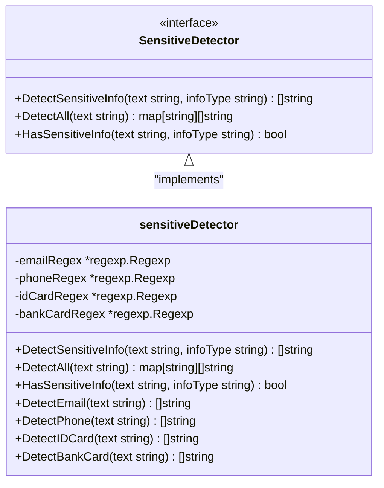
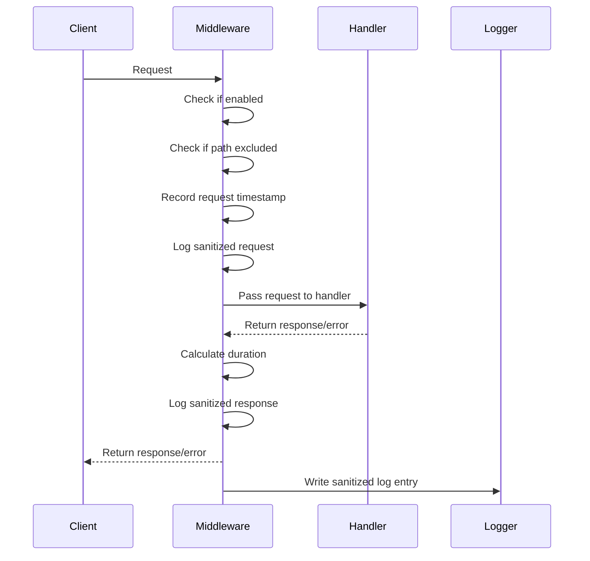
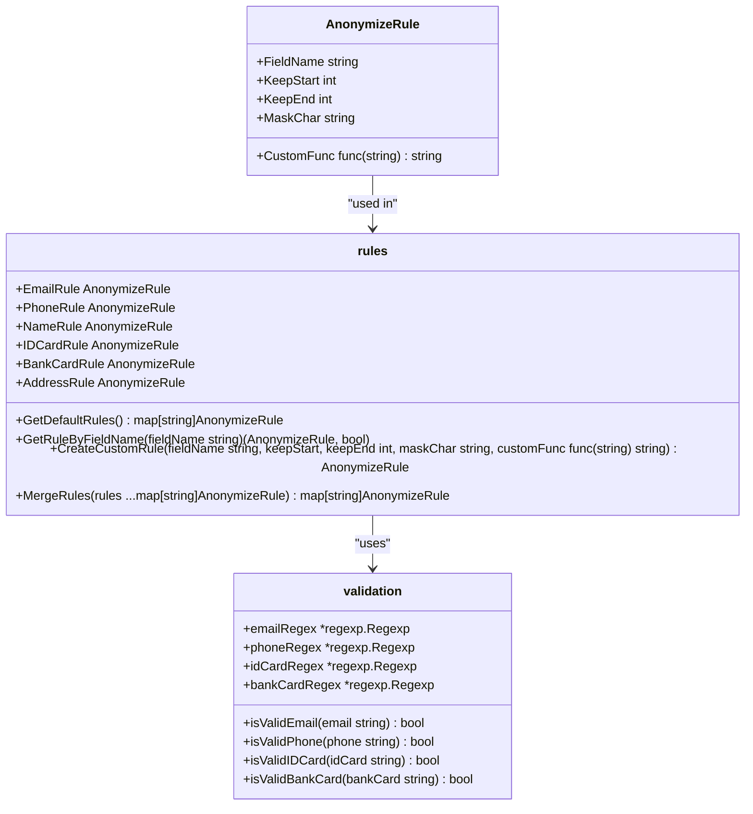

# Sensitive Data Handling

<cite>
**Referenced Files in This Document**   
- [README.md](file://internal/pkg/sensitive/README.md)
- [rules.go](file://internal/pkg/sensitive/rules.go)
- [anonymizer.go](file://internal/pkg/sensitive/anonymizer.go)
- [structured_logger.go](file://internal/pkg/sensitive/structured_logger.go)
- [interfaces.go](file://internal/pkg/sensitive/interfaces.go)
- [middleware.go](file://internal/pkg/sensitive/middleware.go)
- [rules_test.go](file://internal/pkg/sensitive/rules_test.go)
- [detector_test.go](file://internal/pkg/sensitive/detector_test.go)
</cite>

## Table of Contents
1. [Introduction](#introduction)
2. [Core Components](#core-components)
3. [Sensitive Data Detection](#sensitive-data-detection)
4. [Anonymization Process](#anonymization-process)
5. [Structured Logging](#structured-logging)
6. [Middleware Integration](#middleware-integration)
7. [Rule Configuration and Extension](#rule-configuration-and-extension)
8. [Performance Considerations](#performance-considerations)
9. [Testing and Validation](#testing-and-validation)
10. [Conclusion](#conclusion)

## Introduction
The sensitive data protection system in kratos-boilerplate provides comprehensive mechanisms for identifying, anonymizing, and logging sensitive information. This system ensures that personally identifiable information (PII) and other sensitive data are properly handled throughout the application lifecycle. The architecture consists of several interconnected components: a detector for identifying sensitive information, an anonymizer for masking or hashing sensitive data, a structured logger for automatic redaction in logs, and middleware for applying these protections across service boundaries. The system is designed to be configurable, extensible, and performant, allowing developers to customize detection rules and anonymization strategies based on their specific requirements.

## Core Components
The sensitive data protection system comprises several key components that work together to identify and protect sensitive information. The system is organized within the `internal/pkg/sensitive` package and includes interfaces, detectors, anonymizers, and logging utilities. The main components include the SensitiveDetector interface for identifying PII, the Anonymizer interface for masking sensitive data, the StructuredLogger for automatic redaction in logs, and the LogSanitizeMiddleware for applying protections across service boundaries. These components are designed with clear separation of concerns and follow the dependency inversion principle, allowing for easy testing and customization. The system leverages Go interfaces to define contracts between components, enabling flexible composition and extension.

**Section sources**
- [interfaces.go](file://internal/pkg/sensitive/interfaces.go#L5-L121)
- [anonymizer.go](file://internal/pkg/sensitive/anonymizer.go#L15-L379)
- [structured_logger.go](file://internal/pkg/sensitive/structured_logger.go#L15-L387)

## Sensitive Data Detection
The sensitive data detection system identifies PII and other sensitive information using configurable rules and pattern matching. The core component is the SensitiveDetector interface, which defines methods for detecting specific types of sensitive information such as emails, phone numbers, and ID cards. The implementation uses regular expressions to identify patterns in text content. The detector supports multiple detection methods including `DetectAll` which scans text for all known sensitive information types, and specific methods like `DetectEmail` and `DetectPhone` for targeted detection.



**Diagram sources**
- [interfaces.go](file://internal/pkg/sensitive/interfaces.go#L105-L115)
- [anonymizer.go](file://internal/pkg/sensitive/anonymizer.go#L275-L379)

The detector uses specific regular expressions for each type of sensitive information:
- Email detection: `[a-zA-Z0-9._%+-]+@[a-zA-Z0-9.-]+\.[a-zA-Z]{2,}`
- Phone detection: `1[3-9]\d{9}` (Chinese mobile numbers)
- ID card detection: `[1-9]\d{5}(18|19|20)\d{2}(0[1-9]|1[0-2])(0[1-9]|[12]\d|3[01])\d{3}[\dXx]`
- Bank card detection: `[1-9]\d{11,19}`

The `DetectAll` method returns a map of detected information types to their matches, allowing the system to handle multiple types of sensitive data simultaneously. This approach enables efficient scanning of text content for various sensitive information patterns in a single pass.

**Section sources**
- [anonymizer.go](file://internal/pkg/sensitive/anonymizer.go#L275-L379)
- [detector_test.go](file://internal/pkg/sensitive/detector_test.go#L15-L293)

## Anonymization Process
The anonymization process replaces sensitive data with masked or hashed values using the anonymizer and sanitizer components. The system provides a flexible framework for defining custom anonymization rules through the AnonymizeRule struct, which specifies how sensitive data should be masked. Each rule includes parameters such as the field name, number of characters to keep at the start and end, the mask character to use, and an optional custom function for specialized anonymization logic.

```mermaid
classDiagram
class Anonymizer {
<<interface>>
+AnonymizeString(value string, rule AnonymizeRule) string
+AnonymizeObject(obj MakeSensitive) interface{}
+AnonymizeBatch(objects []MakeSensitive) []interface{}
+AnonymizeValue(value interface{}, rules map[string]AnonymizeRule) interface{}
}
class anonymizer {
-defaultRules map[string]AnonymizeRule
-detector SensitiveDetector
+AnonymizeString(value string, rule AnonymizeRule) string
+AnonymizeObject(obj MakeSensitive) interface{}
+AnonymizeBatch(objects []MakeSensitive) []interface{}
+AnonymizeValue(value interface{}, rules map[string]AnonymizeRule) interface{}
+anonymizeValueByReflection(value interface{}, rules map[string]AnonymizeRule) interface{}
+anonymizeStruct(v reflect.Value, t reflect.Type, rules map[string]AnonymizeRule) interface{}
+anonymizeSlice(v reflect.Value, rules map[string]AnonymizeRule) interface{}
+anonymizeMap(v reflect.Value, rules map[string]AnonymizeRule) interface{}
+anonymizeStringValue(value string, rules map[string]AnonymizeRule) string
}
class LogSanitizer {
<<interface>>
+SanitizeLogContent(content interface{}) string
+SanitizeLogMessage(message string) string
+ContainsSensitiveInfo(content string) bool
}
class logSanitizer {
-anonymizer Anonymizer
-detector SensitiveDetector
-rules map[string]AnonymizeRule
+SanitizeLogContent(content interface{}) string
+SanitizeLogMessage(message string) string
+ContainsSensitiveInfo(content string) bool
}
Anonymizer <|.. anonymizer : "implements"
LogSanitizer <|.. logSanitizer : "implements"
```

**Diagram sources**
- [interfaces.go](file://internal/pkg/sensitive/interfaces.go#L55-L75)
- [anonymizer.go](file://internal/pkg/sensitive/anonymizer.go#L15-L274)

The anonymization process supports multiple approaches:
1. **String anonymization**: Direct masking of string values based on rules
2. **Object anonymization**: Processing of structs that implement the MakeSensitive interface
3. **Batch anonymization**: Processing of slices of sensitive objects
4. **Reflection-based anonymization**: Automatic processing of arbitrary data structures

The system uses reflection to traverse complex data structures and apply appropriate anonymization rules to sensitive fields. For string values, it applies character masking based on the specified rule parameters. The anonymizer first checks if a custom function is defined in the rule and uses it if present; otherwise, it applies the generic masking logic based on keepStart, keepEnd, and maskChar parameters.

**Section sources**
- [anonymizer.go](file://internal/pkg/sensitive/anonymizer.go#L15-L274)
- [rules.go](file://internal/pkg/sensitive/rules.go#L15-L223)

## Structured Logging
The structured logger ensures sensitive fields are automatically redacted in logs through the StructuredLogger implementation. This component wraps the Kratos log.Helper and provides both structured logging methods (Infow, Debugw, etc.) and compatibility methods (Info, Infof, etc.) to facilitate gradual migration. The logger automatically applies anonymization rules to log entries, ensuring that sensitive information is never written to logs in plain text.

```mermaid
classDiagram
class StructuredLogger {
-helper *log.Helper
-logger log.Logger
-anonymizer Anonymizer
-rules map[string]AnonymizeRule
-config *StructuredLogConfig
+Infow(msg string, keysAndValues ...interface{})
+Debugw(msg string, keysAndValues ...interface{})
+Errorw(msg string, keysAndValues ...interface{})
+Warnw(msg string, keysAndValues ...interface{})
+Fatalw(msg string, keysAndValues ...interface{})
+WithContext(ctx context.Context) StructuredLoggerInterface
+WithFields(keysAndValues ...interface{}) StructuredLoggerInterface
+Info(args ...interface{})
+Infof(template string, args ...interface{})
+sanitizeKeyValues(keysAndValues ...interface{}) []interface{}
+isSensitiveKey(key string) bool
+sanitizeValue(key string, value interface{}) interface{}
+autoDetectAndSanitize(value interface{}) interface{}
+defaultSanitize(key, value string) string
+truncateIfNeeded(value interface{}) interface{}
+UpdateRules(rules map[string]AnonymizeRule)
+AddSensitiveKey(key string)
+GetHelper() *log.Helper
}
class StructuredLogConfig {
+Enabled bool
+AutoDetect bool
+CustomRules map[string]AnonymizeRule
+SensitiveKeys []string
+MaxValueLength int
+TruncateThreshold int
}
class StructuredLoggerInterface {
<<interface>>
+Infow(msg string, keysAndValues ...interface{})
+Debugw(msg string, keysAndValues ...interface{})
+Errorw(msg string, keysAndValues ...interface{})
+Warnw(msg string, keysAndValues ...interface{})
+Fatalw(msg string, keysAndValues ...interface{})
+Info(args ...interface{})
+Infof(template string, args ...interface{})
+Debug(args ...interface{})
+Debugf(template string, args ...interface{})
+Error(args ...interface{})
+Errorf(template string, args ...interface{})
+Warn(args ...interface{})
+Warnf(template string, args ...interface{})
+Fatal(args ...interface{})
+Fatalf(template string, args ...interface{})
+WithContext(ctx context.Context) StructuredLoggerInterface
+WithFields(keysAndValues ...interface{}) StructuredLoggerInterface
+UpdateRules(rules map[string]AnonymizeRule)
+AddSensitiveKey(key string)
}
StructuredLoggerInterface <|.. StructuredLogger : "implements"
```

**Diagram sources**
- [structured_logger.go](file://internal/pkg/sensitive/structured_logger.go#L15-L387)
- [interfaces.go](file://internal/pkg/sensitive/interfaces.go#L100-L121)

The structured logger processes log entries through several steps:
1. **Key-value sanitization**: The `sanitizeKeyValues` method processes each key-value pair in the log entry
2. **Sensitive key detection**: The `isSensitiveKey` method checks if a field name matches known sensitive patterns
3. **Value anonymization**: Sensitive values are processed through the anonymization system
4. **Automatic detection**: When auto-detection is enabled, the system scans string values for sensitive patterns
5. **Length truncation**: Long values are truncated to prevent excessive log sizes

The logger supports both field-based anonymization (when field names match sensitive patterns) and content-based anonymization (when sensitive patterns are detected within string values). This dual approach ensures comprehensive protection of sensitive information in logs.

**Section sources**
- [structured_logger.go](file://internal/pkg/sensitive/structured_logger.go#L15-L387)
- [README.md](file://internal/pkg/sensitive/README.md#L0-L338)

## Middleware Integration
The middleware integration applies detection and anonymization across service boundaries through the LogSanitizeMiddleware component. This middleware intercepts requests and responses in the Kratos framework, automatically sanitizing sensitive data in logs. It operates at the transport layer, capturing information from HTTP and gRPC requests and responses, and ensures that sensitive data is never exposed in service logs.



**Diagram sources**
- [middleware.go](file://internal/pkg/sensitive/middleware.go#L15-L326)

The middleware configuration is defined by the LogSanitizeConfig struct, which includes options for:
- Enabling/disabling the middleware
- Controlling sanitization of requests, responses, and headers
- Specifying custom anonymization rules
- Defining excluded paths (e.g., health checks)
- Setting maximum log length

The middleware processes requests and responses through several steps:
1. **Request logging**: Before the handler is called, the middleware logs the sanitized request
2. **Response logging**: After the handler returns, the middleware logs the sanitized response
3. **Header sanitization**: Sensitive headers (authorization, cookies, etc.) are redacted
4. **Data sanitization**: Request and response bodies are processed through the anonymization system
5. **Error handling**: Errors are sanitized before logging

The middleware uses the same anonymization rules as the structured logger, ensuring consistent handling of sensitive data across the application.

**Section sources**
- [middleware.go](file://internal/pkg/sensitive/middleware.go#L15-L326)

## Rule Configuration and Extension
The rules system allows for extension to support custom sensitive data types through configurable rules. The system provides default rules for common PII types (emails, phone numbers, ID cards, etc.) but can be extended with custom rules for application-specific sensitive data. The rules are defined in the AnonymizeRule struct and can be customized through various parameters.



**Diagram sources**
- [rules.go](file://internal/pkg/sensitive/rules.go#L15-L223)
- [interfaces.go](file://internal/pkg/sensitive/interfaces.go#L77-L90)

The system includes several mechanisms for extending the rules:
1. **CreateCustomRule**: Function to create new rules with custom parameters
2. **MergeRules**: Function to combine multiple rule sets
3. **UpdateRules**: Method to update rules in the structured logger
4. **AddSensitiveKey**: Method to add new sensitive field names

Examples from the test files demonstrate detection patterns for common data types:
- Email: `test@example.com` → `te**@example.com`
- Phone: `13812345678` → `138****5678`
- Name: `张三丰` → `张*丰`
- ID card: `110101199001011234` → `110101********1234`
- Bank card: `6222021234567890` → `6222********7890`

These patterns can be extended to support custom data types by creating new rules with appropriate regular expressions and masking strategies.

**Section sources**
- [rules.go](file://internal/pkg/sensitive/rules.go#L15-L223)
- [rules_test.go](file://internal/pkg/sensitive/rules_test.go#L15-L452)

## Performance Considerations
The sensitive data protection system balances detection accuracy with performance implications through several optimization strategies. The detection algorithms use compiled regular expressions for pattern matching, which provides good performance for text scanning operations. However, the system's performance characteristics vary depending on configuration and usage patterns.

Key performance considerations include:
- **Regex compilation**: Regular expressions are compiled once at initialization, reducing runtime overhead
- **Reflection overhead**: Processing complex data structures with reflection has higher CPU cost
- **String operations**: Frequent string manipulation and replacement operations impact performance
- **Memory allocation**: Creating new strings for masked values increases memory usage

The system provides configuration options to optimize performance:
- **Auto-detection toggle**: Disabling auto-detection reduces processing overhead
- **Value length limits**: Preventing processing of excessively long values
- **Excluded paths**: Bypassing middleware for non-sensitive endpoints
- **Rule optimization**: Using efficient regular expressions for pattern matching

In high-throughput scenarios, the system can be configured to disable certain features or apply them selectively to minimize performance impact while maintaining adequate protection for sensitive data.

**Section sources**
- [anonymizer.go](file://internal/pkg/sensitive/anonymizer.go#L15-L379)
- [structured_logger.go](file://internal/pkg/sensitive/structured_logger.go#L15-L387)
- [middleware.go](file://internal/pkg/sensitive/middleware.go#L15-L326)

## Testing and Validation
The sensitive data protection system includes comprehensive test coverage to validate detection accuracy and anonymization correctness. The test suite includes unit tests for individual components and integration tests for the complete workflow. The tests verify both positive and negative cases for detection patterns and ensure that anonymization produces expected results.

Key aspects of the test suite:
- **Rule validation**: Tests for each predefined rule (email, phone, ID card, etc.)
- **Detection accuracy**: Tests for pattern matching with various input formats
- **Anonymization correctness**: Tests for proper masking of sensitive values
- **Edge cases**: Tests for empty strings, invalid formats, and boundary conditions
- **Performance testing**: Benchmarks for detection and anonymization operations

The test files demonstrate the expected behavior of the system:
- `rules_test.go` contains tests for all predefined rules and validation functions
- `detector_test.go` contains tests for the sensitive information detection capabilities
- Various test cases cover common data types and edge cases

The testing approach ensures that the system reliably detects and anonymizes sensitive information while maintaining performance and correctness.

**Section sources**
- [rules_test.go](file://internal/pkg/sensitive/rules_test.go#L15-L452)
- [detector_test.go](file://internal/pkg/sensitive/detector_test.go#L15-L293)

## Conclusion
The sensitive data protection system in kratos-boilerplate provides a comprehensive solution for identifying, anonymizing, and logging sensitive information. The system's modular architecture separates concerns between detection, anonymization, and logging, enabling flexible configuration and extension. Key features include configurable rules for common PII types, automatic detection of sensitive patterns, and seamless integration across service boundaries through middleware. The structured logger ensures that sensitive data is automatically redacted in logs, while the anonymization components provide flexible masking strategies for various data types. The system balances security requirements with performance considerations, allowing developers to optimize based on their specific use cases. By following the documented patterns and best practices, developers can effectively protect sensitive data throughout their applications.