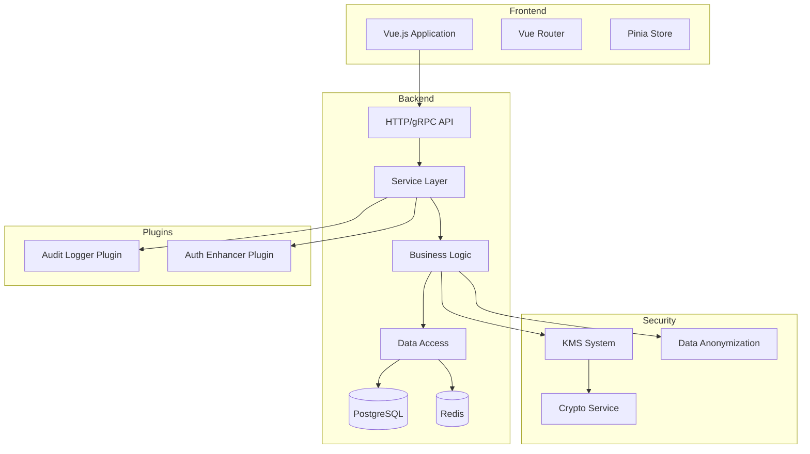
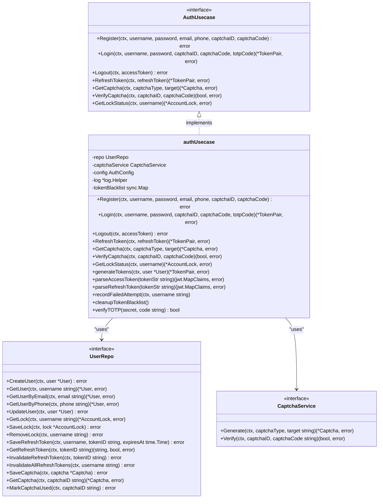
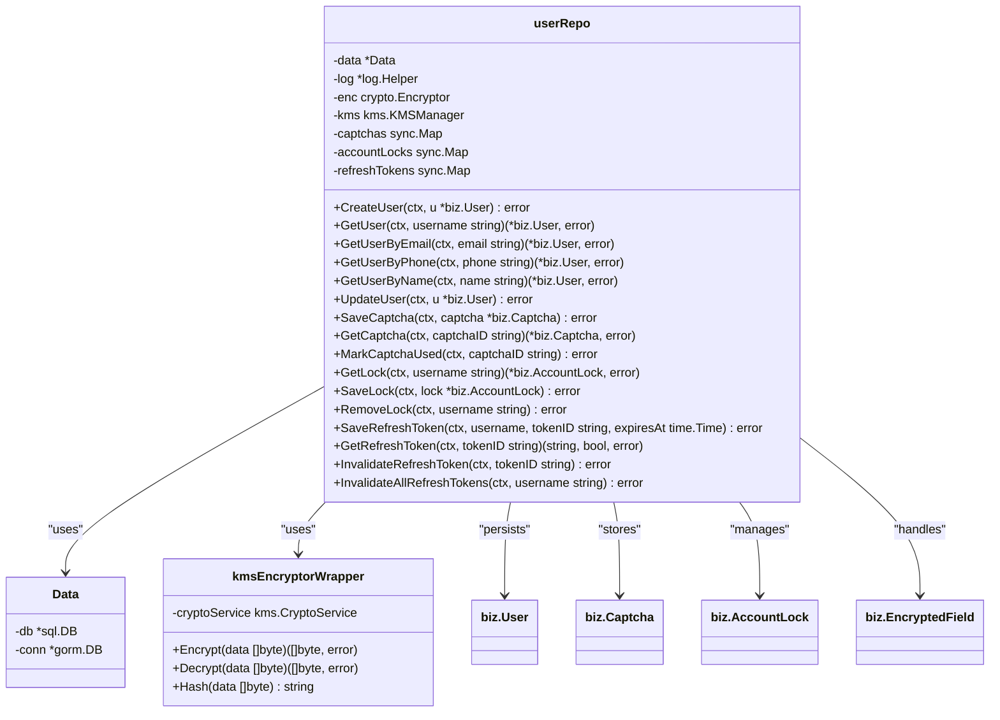
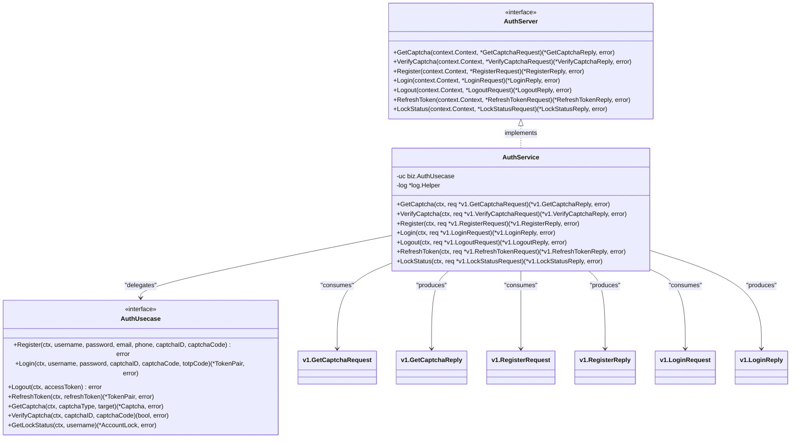
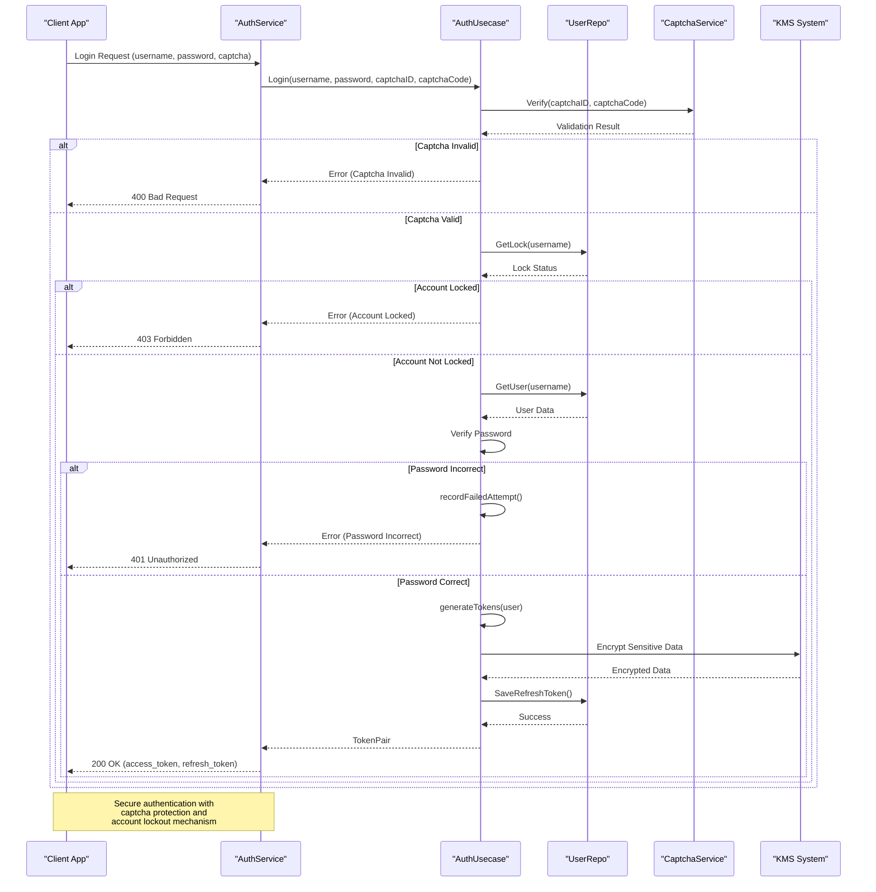
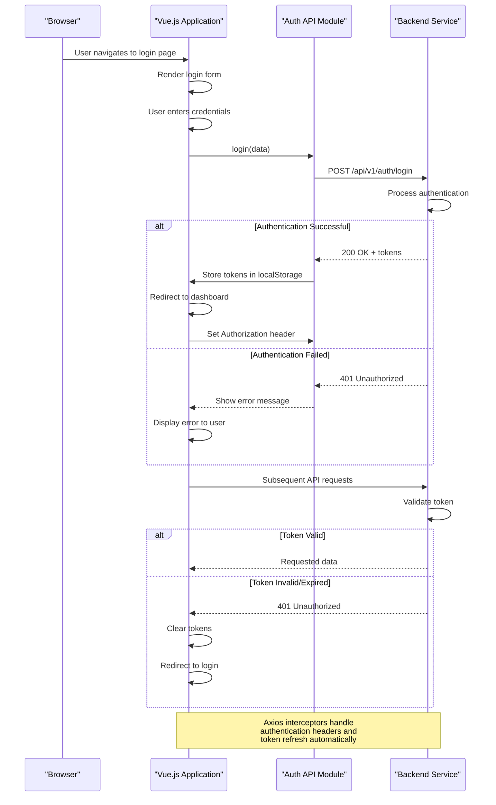

# System Overview

<cite>
**Referenced Files in This Document**   
- [main.go](file://cmd/kratos-boilerplate/main.go)
- [auth.go](file://internal/biz/auth.go)
- [auth.go](file://internal/data/auth.go)
- [auth.go](file://internal/service/auth.go)
- [auth.proto](file://api/auth/v1/auth.proto)
- [auth.ts](file://frontend/src/api/auth.ts)
- [crypto_service.go](file://internal/pkg/kms/crypto_service.go)
- [manager.go](file://internal/pkg/kms/manager.go)
</cite>

## Table of Contents
1. [System Overview](#system-overview)
2. [Core Components](#core-components)
3. [Architecture Overview](#architecture-overview)
4. [Detailed Component Analysis](#detailed-component-analysis)
5. [Authentication Flow](#authentication-flow)
6. [Security and Data Protection](#security-and-data-protection)
7. [Frontend-Backend Integration](#frontend-backend-integration)

## Core Components

The kratos-boilerplate system is a production-ready microservice template built with Go and the Kratos framework, featuring comprehensive authentication, security, and extensibility capabilities. The system follows a clean architecture pattern with clear separation between layers.

The core components include:
- **API Layer**: Defined in Protocol Buffer files, providing gRPC and HTTP interfaces
- **Service Layer**: Implements business logic and coordinates between use cases and data access
- **Business Logic (Usecase)**: Contains the core business rules and workflows
- **Data Access Layer**: Handles database operations and data persistence
- **Frontend Application**: Vue.js-based user interface for interacting with the backend

The system leverages the Kratos framework for service creation, dependency injection via Wire, and standardized project structure. It includes built-in support for authentication, authorization, and secure data handling.

**Section sources**
- [main.go](file://cmd/kratos-boilerplate/main.go#L1-L92)
- [auth.go](file://internal/biz/auth.go#L1-L695)

## Architecture Overview

The kratos-boilerplate follows a microservices architecture with a clear separation between frontend and backend components. The system is designed to be modular, extensible, and production-ready with comprehensive security features.



**Diagram sources**
- [main.go](file://cmd/kratos-boilerplate/main.go#L1-L92)
- [auth.go](file://internal/biz/auth.go#L1-L695)
- [auth.go](file://internal/data/auth.go#L1-L438)
- [auth.go](file://internal/service/auth.go#L1-L235)

## Detailed Component Analysis

### Authentication Business Logic

The authentication business logic is implemented in the `authUsecase` struct, which follows the use case pattern to encapsulate business rules. The implementation provides comprehensive user management functionality including registration, login, logout, and token refresh operations.



**Diagram sources**
- [auth.go](file://internal/biz/auth.go#L1-L695)

**Section sources**
- [auth.go](file://internal/biz/auth.go#L1-L695)

### Data Access Implementation

The data access layer implements the UserRepo interface with a concrete implementation that handles database operations for user management. The implementation includes encryption and hashing of sensitive data using the KMS system.



**Diagram sources**
- [auth.go](file://internal/data/auth.go#L1-L438)

**Section sources**
- [auth.go](file://internal/data/auth.go#L1-L438)

### Service Layer Implementation

The service layer exposes the business logic through gRPC and HTTP endpoints. The AuthService implements the AuthServer interface defined in the protobuf specification, translating API requests into business logic calls.



**Diagram sources**
- [auth.go](file://internal/service/auth.go#L1-L235)

**Section sources**
- [auth.go](file://internal/service/auth.go#L1-L235)

## Authentication Flow

The authentication flow in kratos-boilerplate follows a secure, multi-step process that includes captcha verification, credential validation, and JWT token generation. The system implements account locking after multiple failed attempts to prevent brute force attacks.



**Diagram sources**
- [auth.go](file://internal/biz/auth.go#L1-L695)
- [auth.go](file://internal/service/auth.go#L1-L235)
- [auth.proto](file://api/auth/v1/auth.proto#L1-L156)

**Section sources**
- [auth.go](file://internal/biz/auth.go#L1-L695)
- [auth.go](file://internal/service/auth.go#L1-L235)

## Security and Data Protection

The kratos-boilerplate implements a comprehensive security model with multiple layers of protection for sensitive data. The Key Management System (KMS) provides centralized encryption key management and data protection.

```mermaid
graph TD
A[Application Data] --> B[Encryption Request]
B --> C{KMS Manager}
C --> D[Root Key Generator]
C --> E[Data Key Manager]
C --> F[Crypto Service]
E --> G[Key Storage]
F --> H[AES-GCM Encryption]
H --> I[Encrypted Data]
I --> J[Database Storage]
K[Data Retrieval] --> L[Decryption Request]
L --> C
C --> F
F --> M[AES-GCM Decryption]
M --> N[Plaintext Data]
N --> O[Application]
P[Security Features]
P --> Q[Field-Level Encryption]
P --> R[Data Key Rotation]
P --> S[Secure Key Storage]
P --> T[Hashing for Indexing]
P --> U[Memory Protection]
P --> V[Access Control]
style C fill:#f9f,stroke:#333
style F fill:#bbf,stroke:#333
style H fill:#bbf,stroke:#333
style M fill:#bbf,stroke:#333
Note over C: KMS Manager coordinates<br/>all encryption operations
Note over F: Crypto Service performs<br/>actual encryption/decryption
Note over H,M: AES-GCM provides authenticated<br/>encryption with integrity
```

**Diagram sources**
- [crypto_service.go](file://internal/pkg/kms/crypto_service.go#L1-L321)
- [manager.go](file://internal/pkg/kms/manager.go#L1-L308)

**Section sources**
- [crypto_service.go](file://internal/pkg/kms/crypto_service.go#L1-L321)
- [manager.go](file://internal/pkg/kms/manager.go#L1-L308)

## Frontend-Backend Integration

The frontend application is built with Vue.js and communicates with the backend through well-defined API endpoints. The integration includes proper error handling, authentication token management, and request/response typing.



**Diagram sources**
- [auth.ts](file://frontend/src/api/auth.ts#L1-L99)
- [auth.go](file://internal/service/auth.go#L1-L235)

**Section sources**
- [auth.ts](file://frontend/src/api/auth.ts#L1-L99)
- [auth.go](file://internal/service/auth.go#L1-L235)