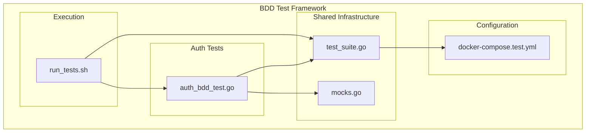
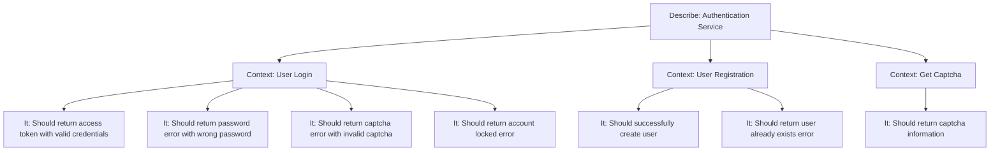
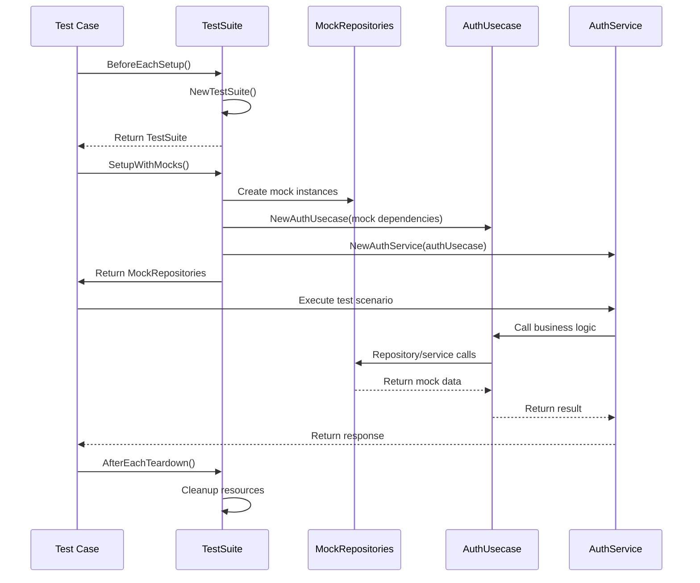
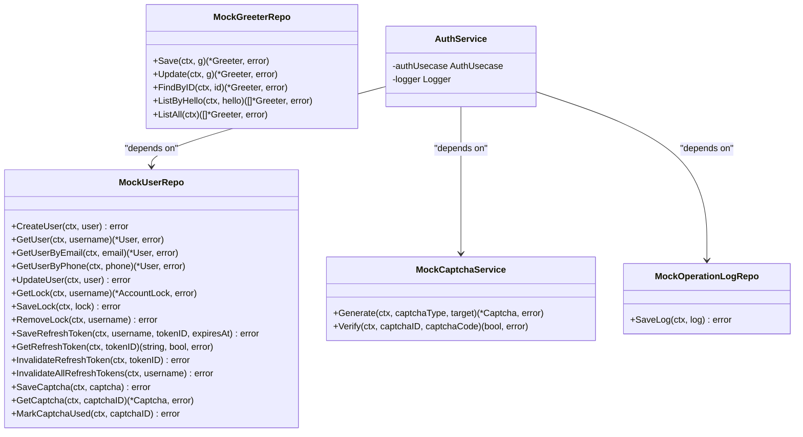
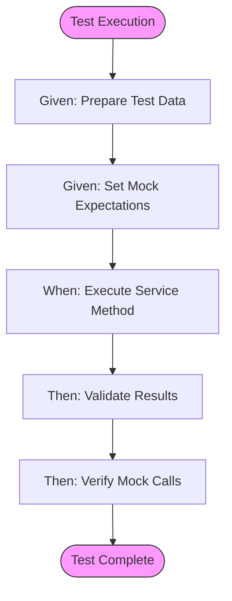
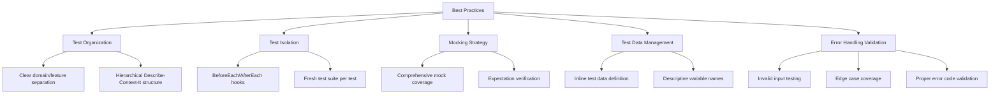
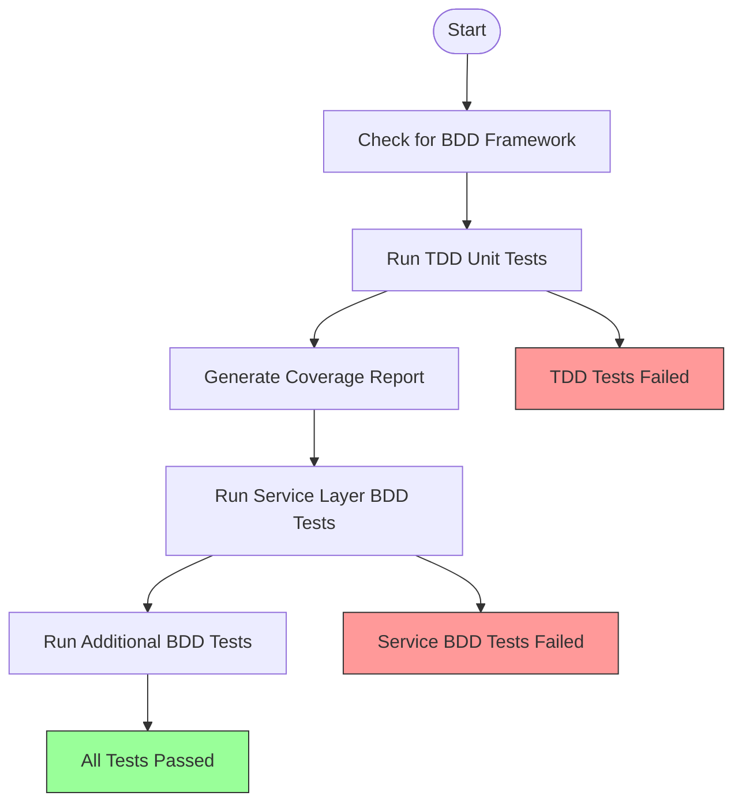
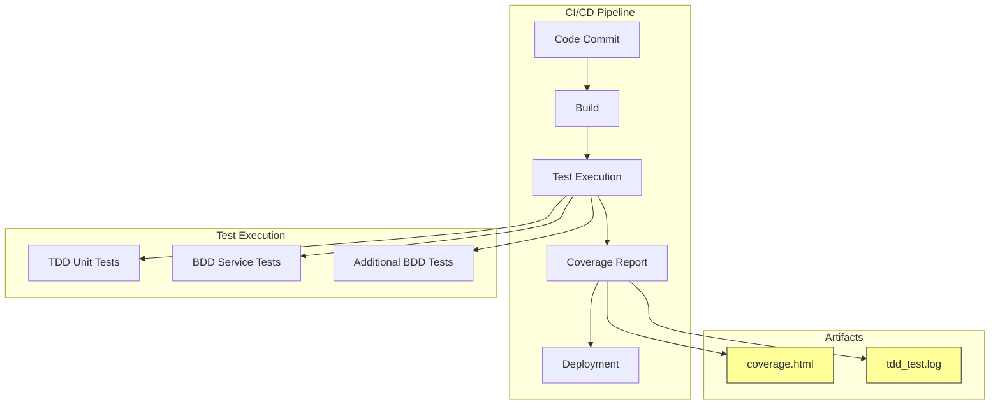

# Behavior-Driven Development (BDD) Testing

<cite>
**Referenced Files in This Document**   
- [auth_bdd_test.go](file://test/bdd/auth/auth_bdd_test.go)
- [test_suite.go](file://test/bdd/shared/test_suite.go)
- [mocks.go](file://test/bdd/shared/mocks.go)
- [docker-compose.test.yml](file://test/config/docker-compose.test.yml)
- [run_tests.sh](file://scripts/run_tests.sh)
</cite>

## Table of Contents
1. [Introduction](#introduction)
2. [BDD Testing Framework Overview](#bdd-testing-framework-overview)
3. [Gherkin-Style Scenario Design](#gherkin-style-scenario-design)
4. [Test Suite Initialization](#test-suite-initialization)
5. [Dependency Mocking and Isolation](#dependency-mocking-and-isolation)
6. [Concrete BDD Test Examples](#concrete-bdd-test-examples)
7. [Best Practices for BDD Testing](#best-practices-for-bdd-testing)
8. [Test Execution Workflow](#test-execution-workflow)
9. [CI/CD Integration](#cicd-integration)
10. [Conclusion](#conclusion)

## Introduction
This document provides a comprehensive analysis of the Behavior-Driven Development (BDD) testing framework implemented in the kratos-boilerplate repository. It explains how Gherkin-style scenarios are implemented using Go testing tools, with a focus on the authentication service's behavior specifications. The documentation covers the shared test suite initialization, dependency mocking strategy, and execution workflow, providing concrete examples and best practices for maintainable BDD testing.

## BDD Testing Framework Overview
The BDD testing framework in kratos-boilerplate leverages Ginkgo and Gomega to implement behavior-driven specifications for the authentication service. The framework follows a structured approach to test design, using descriptive syntax that mirrors natural language specifications. This approach enables developers and stakeholders to understand test cases as behavioral requirements rather than mere code validations.

The framework is organized into a dedicated test directory structure under `test/bdd/`, with domain-specific test suites separated into logical packages. The authentication service tests are located in `test/bdd/auth/`, while shared infrastructure components reside in `test/bdd/shared/`. This separation of concerns allows for reusable test components while maintaining domain-specific test clarity.



**Diagram sources**
- [auth_bdd_test.go](file://test/bdd/auth/auth_bdd_test.go)
- [test_suite.go](file://test/bdd/shared/test_suite.go)
- [mocks.go](file://test/bdd/shared/mocks.go)
- [docker-compose.test.yml](file://test/config/docker-compose.test.yml)
- [run_tests.sh](file://scripts/run_tests.sh)

**Section sources**
- [auth_bdd_test.go](file://test/bdd/auth/auth_bdd_test.go)
- [test_suite.go](file://test/bdd/shared/test_suite.go)

## Gherkin-Style Scenario Design
The BDD framework implements Gherkin-style scenario design using Ginkgo's descriptive syntax, which closely mirrors the Given-When-Then structure of traditional BDD. The test cases are organized hierarchically using `Describe`, `Context`, and `It` blocks to create a natural language-like specification of system behavior.

In the authentication service tests, this structure is evident in the organization of test cases. The top-level `Describe` blocks define major feature areas such as "认证服务" (Authentication Service), while nested `Context` blocks specify particular scenarios or conditions. The `It` blocks contain the actual test assertions, describing the expected outcome.



**Diagram sources**
- [auth_bdd_test.go](file://test/bdd/auth/auth_bdd_test.go#L35-L285)

**Section sources**
- [auth_bdd_test.go](file://test/bdd/auth/auth_bdd_test.go#L35-L285)

## Test Suite Initialization
The test suite initialization is centralized in the `test_suite.go` file, which provides a comprehensive infrastructure for BDD tests. The `TestSuite` struct encapsulates all necessary components for test execution, including context management, logging, data access, and service instances.

The initialization process begins with the `BeforeEachSetup` function, which is called before each test case to create a fresh test environment. This function creates a new `TestSuite` instance with a background context and standard logger, ensuring test isolation and consistent logging.

```go
func BeforeEachSetup() *TestSuite {
    ts := NewTestSuite()
    GinkgoWriter.Printf("Setting up test suite at %s\n", time.Now().Format(time.RFC3339))
    return ts
}
```

The `SetupWithMocks` method configures the test environment with mock dependencies, allowing for isolated testing of the authentication service without relying on external systems. This method creates mock instances for all repositories and services, then constructs the dependency chain from repositories to use cases to services.



**Diagram sources**
- [test_suite.go](file://test/bdd/shared/test_suite.go#L100-L130)
- [test_suite.go](file://test/bdd/shared/test_suite.go#L132-L170)

**Section sources**
- [test_suite.go](file://test/bdd/shared/test_suite.go#L100-L170)

## Dependency Mocking and Isolation
Dependency isolation is achieved through the use of mock objects defined in `mocks.go`. The framework employs testify/mock to create mock implementations of all external dependencies, including user repository, captcha service, and operation log repository. This approach ensures that tests focus solely on the behavior of the authentication service without being affected by external system states.

The `MockRepositories` struct in `test_suite.go` aggregates all mock instances, providing a convenient interface for test setup. Each mock is implemented as a Go struct that embeds testify's `mock.Mock` type, allowing for flexible expectation setting and verification.

```go
type MockUserRepo struct {
    mock.Mock
}

func (m *MockUserRepo) GetUser(ctx context.Context, username string) (*biz.User, error) {
    args := m.Called(ctx, username)
    if args.Get(0) == nil {
        return nil, args.Error(1)
    }
    return args.Get(0).(*biz.User), args.Error(1)
}
```

In test cases, mocks are configured using the `On` method to define expected method calls and their return values. After test execution, the `AssertExpectations` method verifies that all expected calls were made, ensuring that the service under test interacted with dependencies as expected.



**Diagram sources**
- [mocks.go](file://test/bdd/shared/mocks.go)
- [test_suite.go](file://test/bdd/shared/test_suite.go#L45-L55)

**Section sources**
- [mocks.go](file://test/bdd/shared/mocks.go)
- [test_suite.go](file://test/bdd/shared/test_suite.go#L45-L55)

## Concrete BDD Test Examples
The authentication service BDD tests provide concrete examples of the Given-When-Then pattern in action. Each test case follows a consistent structure: preparing test data (Given), executing the service method (When), and validating the results (Then).

For example, the test for successful user login demonstrates this pattern clearly:

```go
It("should return access token", func() {
    // Given: Prepare test data
    loginReq := &v1.LoginRequest{
        Username:    "testuser",
        Password:    "password123",
        CaptchaId:   "captcha-123",
        CaptchaCode: "123456",
        TotpCode:    "",
    }

    user := &biz.User{
        ID:       1,
        Username: "testuser",
        Password: "$2a$10$oX.ALctDnUvY.7OGzQbU/OmVtBMr0KzOyrl3XVppNfuWvt7EoW9M6",
        Email:    "test@example.com",
    }

    // Given: Set up mock expectations
    mocks.UserRepo.On("GetUser", ctx, "testuser").Return(user, nil)
    mocks.UserRepo.On("GetLock", ctx, "testuser").Return(nil, biz.ErrUserNotFound)
    mocks.CaptchaService.On("Verify", ctx, "captcha-123", "123456").Return(true, nil)
    mocks.UserRepo.On("SaveRefreshToken", ctx, "testuser", mock.AnythingOfType("string"), mock.AnythingOfType("time.Time")).Return(nil)

    // When: Execute the test
    response, err := testSuite.Services.AuthService.Login(ctx, loginReq)

    // Then: Validate the results
    Expect(err).NotTo(HaveOccurred())
    Expect(response).NotTo(BeNil())
    Expect(response.AccessToken).NotTo(BeEmpty())
    Expect(response.RefreshToken).NotTo(BeEmpty())
    Expect(response.ExpiresIn).To(BeNumerically(">", 0))

    // Then: Verify mock calls
    mocks.UserRepo.AssertExpectations(GinkgoT())
})
```

This test follows the classic BDD structure:
- **Given**: Test data is prepared, including the login request and user entity
- **Given**: Mock expectations are set up to define the behavior of dependencies
- **When**: The `Login` method of the authentication service is called
- **Then**: The response is validated to ensure it contains the expected data
- **Then**: Mock expectations are verified to ensure proper interaction with dependencies



**Diagram sources**
- [auth_bdd_test.go](file://test/bdd/auth/auth_bdd_test.go#L50-L100)

**Section sources**
- [auth_bdd_test.go](file://test/bdd/auth/auth_bdd_test.go#L50-L100)

## Best Practices for BDD Testing
The kratos-boilerplate BDD framework exemplifies several best practices for writing maintainable and effective BDD tests:

### Test Organization
Tests are organized by domain (authentication) and feature (login, registration, captcha), making it easy to locate relevant tests. The hierarchical structure using `Describe`, `Context`, and `It` blocks creates a natural language specification that is easy to read and understand.

### Test Isolation
Each test runs in isolation with its own test suite instance, preventing state leakage between tests. The `BeforeEach` and `AfterEach` hooks ensure consistent setup and teardown, maintaining a clean test environment.

### Mocking Strategy
The framework uses a comprehensive mocking strategy that isolates the service under test from all external dependencies. This allows for focused testing of business logic without relying on external systems.

### Test Data Management
Test data is defined inline within test cases, making it clear what data is being used and why. This approach improves test readability and maintainability.

### Error Handling Validation
The framework thoroughly tests error conditions, ensuring that the service handles invalid inputs and edge cases appropriately. This includes testing for invalid passwords, expired captchas, and locked accounts.



**Diagram sources**
- [auth_bdd_test.go](file://test/bdd/auth/auth_bdd_test.go)
- [test_suite.go](file://test/bdd/shared/test_suite.go)
- [mocks.go](file://test/bdd/shared/mocks.go)

**Section sources**
- [auth_bdd_test.go](file://test/bdd/auth/auth_bdd_test.go)
- [test_suite.go](file://test/bdd/shared/test_suite.go)

## Test Execution Workflow
The test execution workflow is orchestrated through the `run_tests.sh` script, which provides a comprehensive testing pipeline. The script follows a multi-stage approach to ensure thorough test coverage and reliable results.

The workflow begins with traditional TDD unit tests for non-service components, followed by BDD tests for the service layer. This separation allows for faster feedback on lower-level components while ensuring comprehensive behavioral testing of the service layer.

```bash
#!/bin/bash
# run_tests.sh execution flow

# 1. Check for BDD framework
if [ -f "$PROJECT_ROOT/test/scripts/run_all.sh" ]; then
    log_info "BDD framework detected"
fi

# 2. Run TDD unit tests (excluding service layer)
go test $(go list ./internal/... | grep -v '/service') -coverprofile=coverage.out

# 3. Generate coverage report
go tool cover -html=coverage.out -o coverage.html

# 4. Run Ginkgo BDD tests for service layer
if command -v ginkgo &> /dev/null; then
    ginkgo -r ./internal/service
fi

# 5. Run additional BDD tests if available
if [ -d "$PROJECT_ROOT/test/bdd" ]; then
    ginkgo -r "$PROJECT_ROOT/test/bdd"
fi
```

The script also provides enhanced functionality when the full BDD framework is available, allowing users to run different test configurations through command-line options.



**Diagram sources**
- [run_tests.sh](file://scripts/run_tests.sh)

**Section sources**
- [run_tests.sh](file://scripts/run_tests.sh)

## CI/CD Integration
The BDD testing framework is designed for seamless integration with CI/CD pipelines. The `run_tests.sh` script provides a reliable and consistent interface for test execution, generating standardized output and coverage reports that can be easily consumed by CI/CD systems.

Key integration points include:
- **Coverage reporting**: The script generates HTML coverage reports that can be published as build artifacts
- **Exit codes**: The script uses appropriate exit codes to indicate test success or failure
- **Structured logging**: Colored log output provides clear feedback during pipeline execution
- **Modular design**: The separation of TDD and BDD tests allows for selective execution in different pipeline stages

The framework also supports extended testing configurations through the optional BDD framework scripts, enabling more sophisticated test scenarios in CI/CD environments.



**Diagram sources**
- [run_tests.sh](file://scripts/run_tests.sh)

**Section sources**
- [run_tests.sh](file://scripts/run_tests.sh)

## Conclusion
The BDD testing framework in kratos-boilerplate provides a robust and maintainable approach to behavioral testing of the authentication service. By leveraging Ginkgo and Gomega, the framework enables clear, readable test specifications that serve as both validation code and living documentation.

The architecture emphasizes test isolation through comprehensive mocking, ensuring reliable and fast test execution. The shared test suite infrastructure promotes consistency across test cases, while the hierarchical organization improves test discoverability and maintainability.

The integration with CI/CD pipelines through the `run_tests.sh` script ensures that these tests can be reliably executed in automated environments, providing continuous feedback on the system's behavioral correctness. This comprehensive testing approach contributes significantly to the overall quality and reliability of the kratos-boilerplate application.