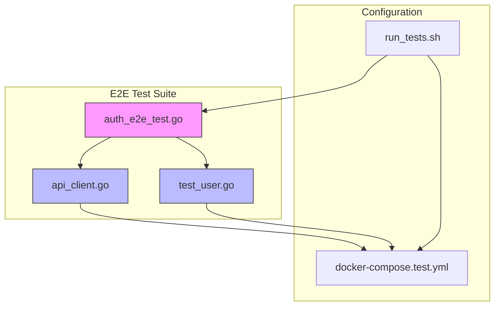
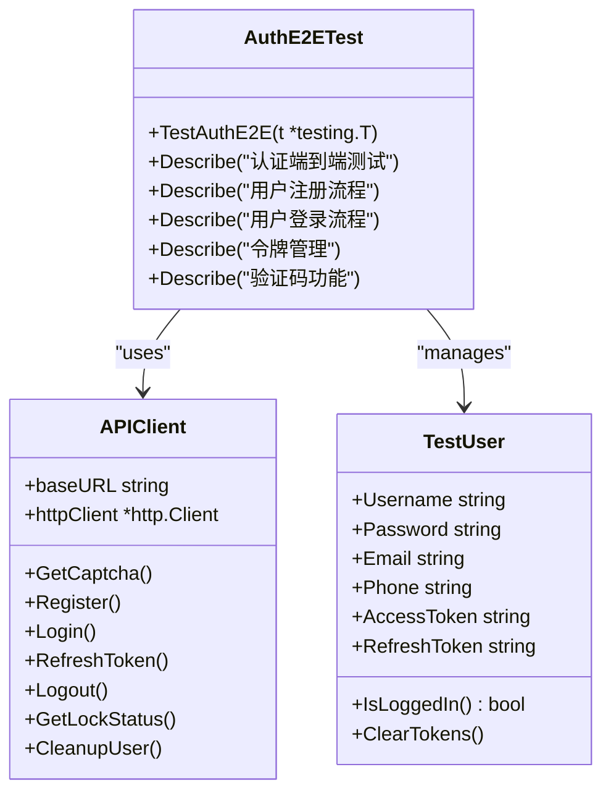
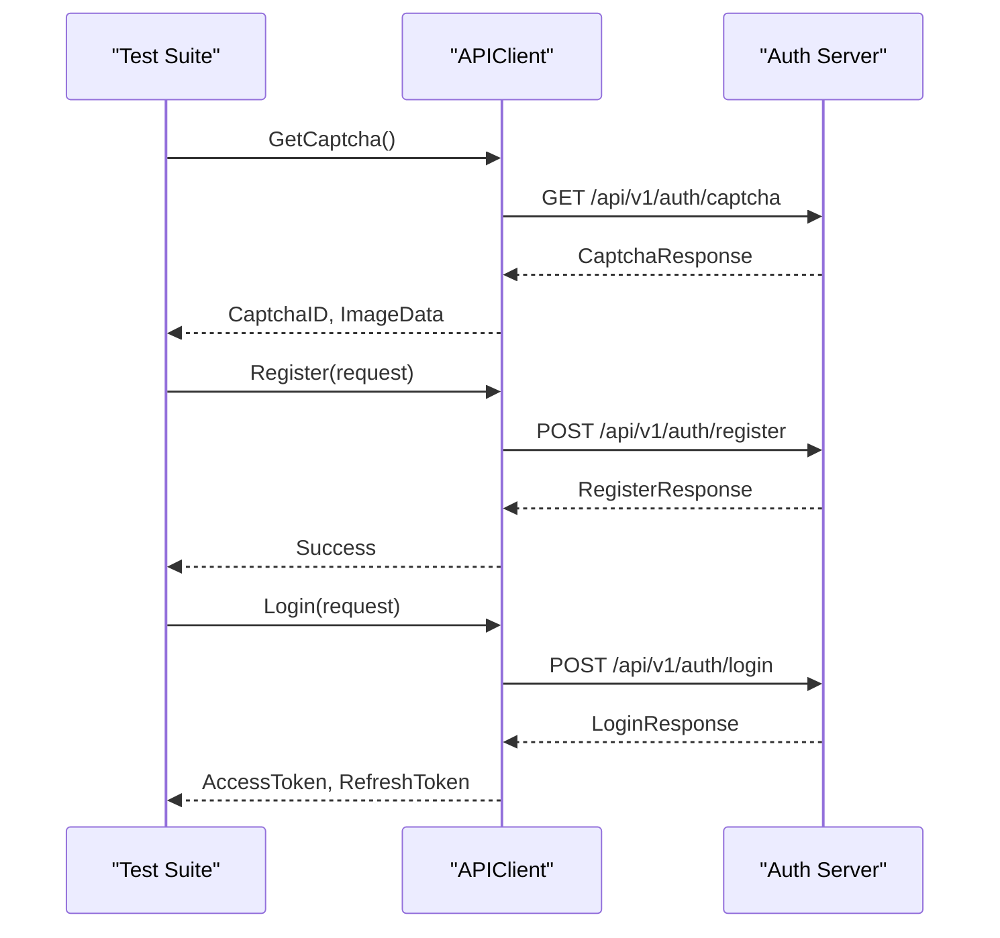
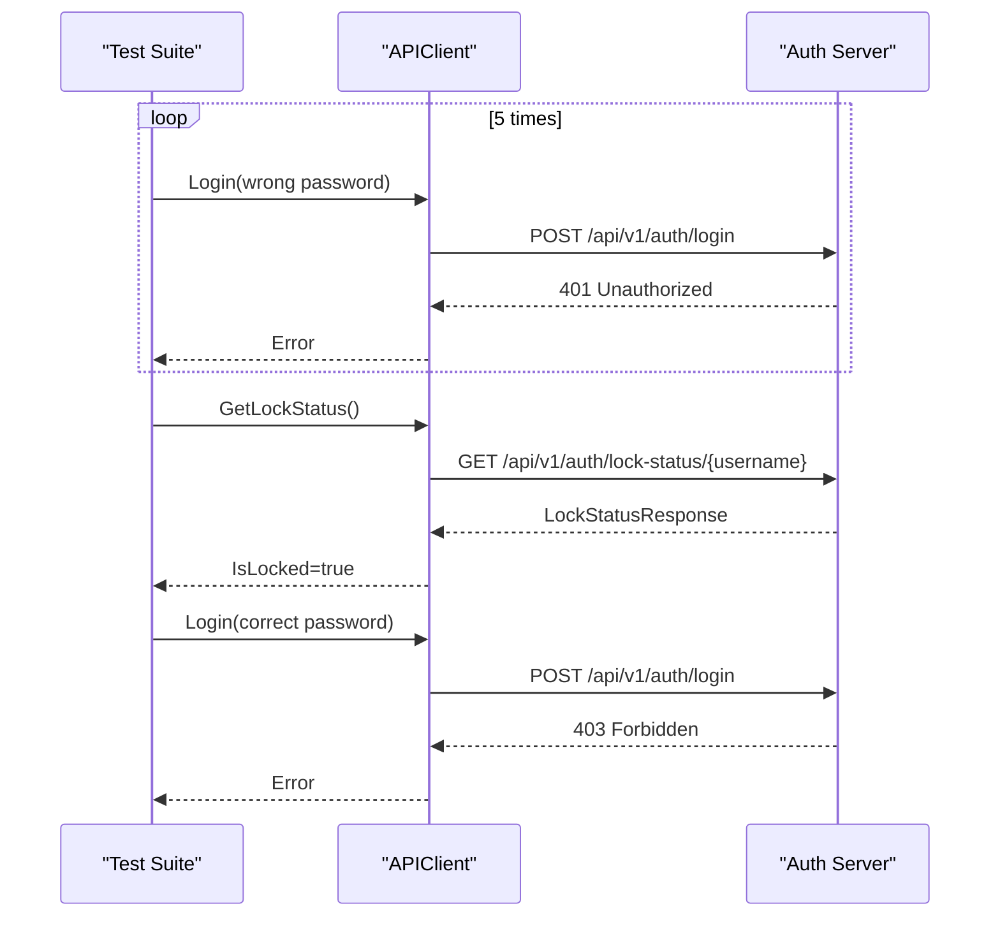
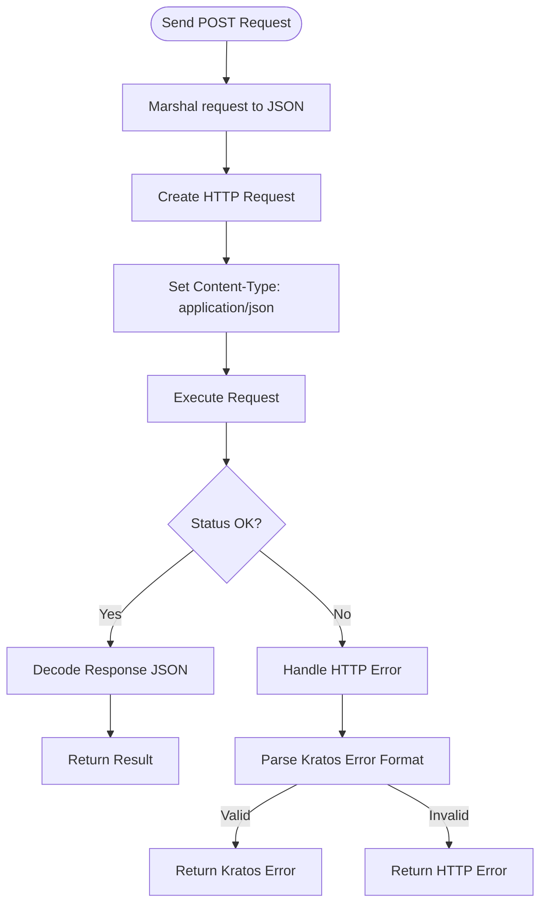
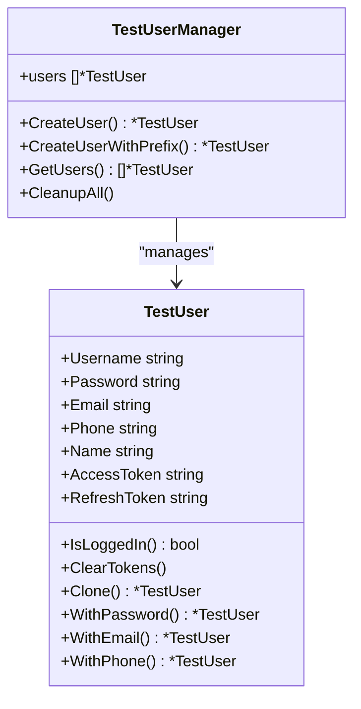
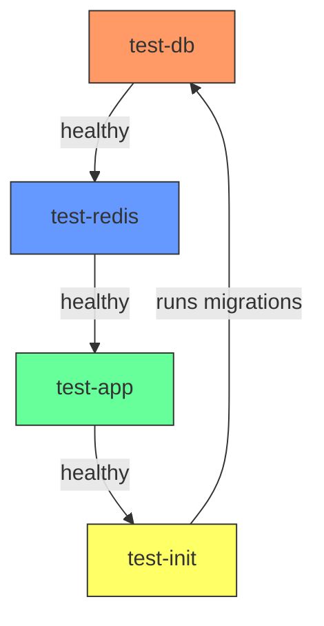
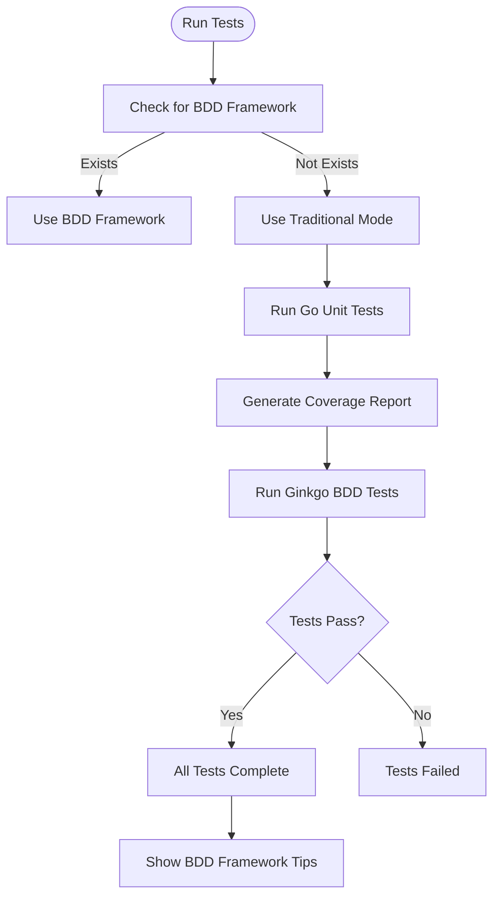

# End-to-End (E2E) Testing

<cite>
**Referenced Files in This Document**   
- [auth_e2e_test.go](file://test/e2e/scenarios/auth_e2e_test.go)
- [api_client.go](file://test/e2e/helpers/api_client.go)
- [test_user.go](file://test/e2e/helpers/test_user.go)
- [docker-compose.test.yml](file://test/config/docker-compose.test.yml)
- [run_tests.sh](file://scripts/run_tests.sh)
- [auth.proto](file://api/auth/v1/auth.proto)
</cite>

## Table of Contents
1. [Introduction](#introduction)
2. [Project Structure and E2E Testing Overview](#project-structure-and-e2e-testing-overview)
3. [Core Components of E2E Testing](#core-components-of-e2e-testing)
4. [Authentication E2E Test Flow](#authentication-e2e-test-flow)
5. [API Client Abstraction Layer](#api-client-abstraction-layer)
6. [Test User Management](#test-user-management)
7. [Environment Setup and Service Orchestration](#environment-setup-and-service-orchestration)
8. [Test Execution and Reporting](#test-execution-and-reporting)
9. [Best Practices for Reliable E2E Tests](#best-practices-for-reliable-e2e-tests)
10. [Conclusion](#conclusion)

## Introduction
End-to-end (E2E) testing in the kratos-boilerplate project ensures that the complete authentication workflow functions correctly across all layers of the application stack. These tests simulate real user interactions by making actual HTTP API calls to a fully running system, validating behavior from frontend to backend, database, and external services. This document details how the E2E test suite validates registration, login, token refresh, protected endpoint access, and other critical authentication flows using a robust testing framework built on Ginkgo and Gomega.

**Section sources**
- [auth_e2e_test.go](file://test/e2e/scenarios/auth_e2e_test.go#L1-L386)

## Project Structure and E2E Testing Overview
The E2E tests are organized under the `test/e2e` directory, which contains helper utilities and scenario-specific test files. The main test file `auth_e2e_test.go` resides in the `scenarios` subdirectory and uses the Ginkgo BDD framework to define test suites and specifications. Helper components in the `helpers` directory provide abstractions for API interaction and test user management.



**Diagram sources**
- [auth_e2e_test.go](file://test/e2e/scenarios/auth_e2e_test.go#L1-L386)
- [api_client.go](file://test/e2e/helpers/api_client.go#L1-L251)
- [test_user.go](file://test/e2e/helpers/test_user.go#L1-L170)
- [docker-compose.test.yml](file://test/config/docker-compose.test.yml#L1-L112)
- [run_tests.sh](file://scripts/run_tests.sh#L1-L103)

**Section sources**
- [auth_e2e_test.go](file://test/e2e/scenarios/auth_e2e_test.go#L1-L386)
- [api_client.go](file://test/e2e/helpers/api_client.go#L1-L251)
- [test_user.go](file://test/e2e/helpers/test_user.go#L1-L170)

## Core Components of E2E Testing
The E2E testing framework consists of three main components: the test scenarios, the API client abstraction, and the test user manager. These components work together to simulate real user workflows while maintaining clean, reusable, and maintainable test code.

### Test Scenarios
The `auth_e2e_test.go` file defines a comprehensive suite of tests for the authentication system using the Ginkgo BDD syntax. It covers registration, login, token management, and captcha functionality.



**Diagram sources**
- [auth_e2e_test.go](file://test/e2e/scenarios/auth_e2e_test.go#L1-L386)
- [api_client.go](file://test/e2e/helpers/api_client.go#L1-L251)
- [test_user.go](file://test/e2e/helpers/test_user.go#L1-L170)

**Section sources**
- [auth_e2e_test.go](file://test/e2e/scenarios/auth_e2e_test.go#L1-L386)

## Authentication E2E Test Flow
The E2E tests simulate complete user authentication workflows by interacting with the running application via HTTP API calls. Each test scenario follows a structured pattern of setup, execution, and teardown.

### Registration Workflow
The registration test flow verifies that new users can successfully create accounts with proper validation.



**Diagram sources**
- [auth_e2e_test.go](file://test/e2e/scenarios/auth_e2e_test.go#L1-L386)
- [api_client.go](file://test/e2e/helpers/api_client.go#L1-L251)

**Section sources**
- [auth_e2e_test.go](file://test/e2e/scenarios/auth_e2e_test.go#L1-L386)

### Login and Account Locking Workflow
The login tests verify both successful authentication and security features like account locking after multiple failed attempts.



**Diagram sources**
- [auth_e2e_test.go](file://test/e2e/scenarios/auth_e2e_test.go#L1-L386)
- [api_client.go](file://test/e2e/helpers/api_client.go#L1-L251)

**Section sources**
- [auth_e2e_test.go](file://test/e2e/scenarios/auth_e2e_test.go#L1-L386)

## API Client Abstraction Layer
The `api_client.go` file provides a clean abstraction over raw HTTP calls, making test code more readable and maintainable.

### APIClient Structure and Methods
The `APIClient` struct encapsulates the base URL and HTTP client configuration, exposing methods for each API endpoint.

```go
// APIClient encapsulates HTTP API calls
type APIClient struct {
    baseURL    string
    httpClient *http.Client
}

// NewAPIClient creates a new API client
func NewAPIClient(baseURL string) *APIClient {
    return &APIClient{
        baseURL: baseURL,
        httpClient: &http.Client{
            Timeout: 30 * time.Second,
        },
    }
}
```

### HTTP Request Handling
The client uses a generic `postJSON` method to handle JSON serialization and error handling consistently across all POST requests.



**Diagram sources**
- [api_client.go](file://test/e2e/helpers/api_client.go#L1-L251)

**Section sources**
- [api_client.go](file://test/e2e/helpers/api_client.go#L1-L251)

## Test User Management
The `test_user.go` file provides utilities for creating and managing test users with unique credentials.

### TestUser Structure
The `TestUser` struct holds user credentials and authentication tokens, enabling stateful testing.

```go
// TestUser represents a test user
type TestUser struct {
    Username     string
    Password     string
    Email        string
    Phone        string
    Name         string
    AccessToken  string
    RefreshToken string
}
```

### Dynamic User Creation
The `NewTestUser` function generates unique users with randomized suffixes to prevent test data collisions.



**Diagram sources**
- [test_user.go](file://test/e2e/helpers/test_user.go#L1-L170)

**Section sources**
- [test_user.go](file://test/e2e/helpers/test_user.go#L1-L170)

## Environment Setup and Service Orchestration
The E2E tests rely on a complete test environment orchestrated using Docker Compose.

### Docker Compose Configuration
The `docker-compose.test.yml` file defines services for the test database, Redis cache, and application server.

```yaml
version: '3.8'
services:
  test-db:
    image: postgres:15-alpine
    environment:
      POSTGRES_DB: test_db
      POSTGRES_USER: postgres
      POSTGRES_PASSWORD: postgres
    healthcheck:
      test: ["CMD-SHELL", "pg_isready -U postgres -d test_db"]
      interval: 10s
      retries: 5

  test-redis:
    image: redis:7-alpine
    healthcheck:
      test: ["CMD", "redis-cli", "ping"]
      interval: 10s
      retries: 5

  test-app:
    build:
      context: ../..
      dockerfile: Dockerfile.dev
    environment:
      - CONFIG_PATH=/app/test/config/test.yaml
    depends_on:
      test-db:
        condition: service_healthy
      test-redis:
        condition: service_healthy
    healthcheck:
      test: ["CMD", "curl", "-f", "http://localhost:8000/health"]
      interval: 10s
      retries: 10
```

### Service Dependencies and Health Checks
The orchestration ensures services start in the correct order with proper health checks.



**Diagram sources**
- [docker-compose.test.yml](file://test/config/docker-compose.test.yml#L1-L112)

**Section sources**
- [docker-compose.test.yml](file://test/config/docker-compose.test.yml#L1-L112)

## Test Execution and Reporting
The `run_tests.sh` script orchestrates the complete test execution process.

### Test Execution Flow
The script runs both unit tests and E2E tests, generating coverage reports and handling dependencies.



### Script Features
The test script includes color-coded logging, error handling, and helpful prompts for developers.

```bash
#!/bin/bash
set -e

# Color definitions
RED='\033[0;31m'
GREEN='\033[0;32m'
YELLOW='\033[1;33m'
BLUE='\033[0;34m'
NC='\033[0m'

log_info() {
    echo -e "${BLUE}[INFO]${NC} $1"
}

log_success() {
    echo -e "${GREEN}[SUCCESS]${NC} $1"
}

log_error() {
    echo -e "${RED}[ERROR]${NC} $1"
}
```

**Diagram sources**
- [run_tests.sh](file://scripts/run_tests.sh#L1-L103)

**Section sources**
- [run_tests.sh](file://scripts/run_tests.sh#L1-L103)

## Best Practices for Reliable E2E Tests
The kratos-boilerplate E2E tests follow several best practices to ensure reliability and maintainability.

### Test Isolation
Each test creates unique users to prevent data collisions and ensure isolation.

```go
BeforeEach(func() {
    // Create unique test user for each test
    testUser = helpers.NewTestUser()
})

AfterEach(func() {
    // Clean up test data
    if testUser != nil {
        client.CleanupUser(ctx, testUser.Username)
    }
})
```

### Service Readiness Checks
The tests wait for services to be fully ready before executing requests.

```go
BeforeSuite(func() {
    Eventually(func() error {
        return client.HealthCheck(ctx)
    }, 30*time.Second, 1*time.Second).Should(Succeed())
})
```

### Comprehensive Test Coverage
The test suite covers positive and negative scenarios, including edge cases and error conditions.

```go
Context("注册验证", func() {
    It("应该拒绝重复的用户名", func() {
        // Test duplicate username rejection
    })

    It("应该拒绝无效的验证码", func() {
        // Test invalid captcha rejection
    })
})
```

**Section sources**
- [auth_e2e_test.go](file://test/e2e/scenarios/auth_e2e_test.go#L1-L386)
- [api_client.go](file://test/e2e/helpers/api_client.go#L1-L251)
- [test_user.go](file://test/e2e/helpers/test_user.go#L1-L170)

## Conclusion
The E2E testing framework in kratos-boilerplate provides comprehensive validation of the authentication system through realistic user workflows. By using Ginkgo's BDD syntax, abstracting API calls through the `APIClient`, managing test state with `TestUser`, orchestrating services with Docker Compose, and automating execution with `run_tests.sh`, the project ensures high-quality, reliable, and maintainable end-to-end tests. This approach validates system behavior across all layers and services, providing confidence in the application's correctness and robustness.