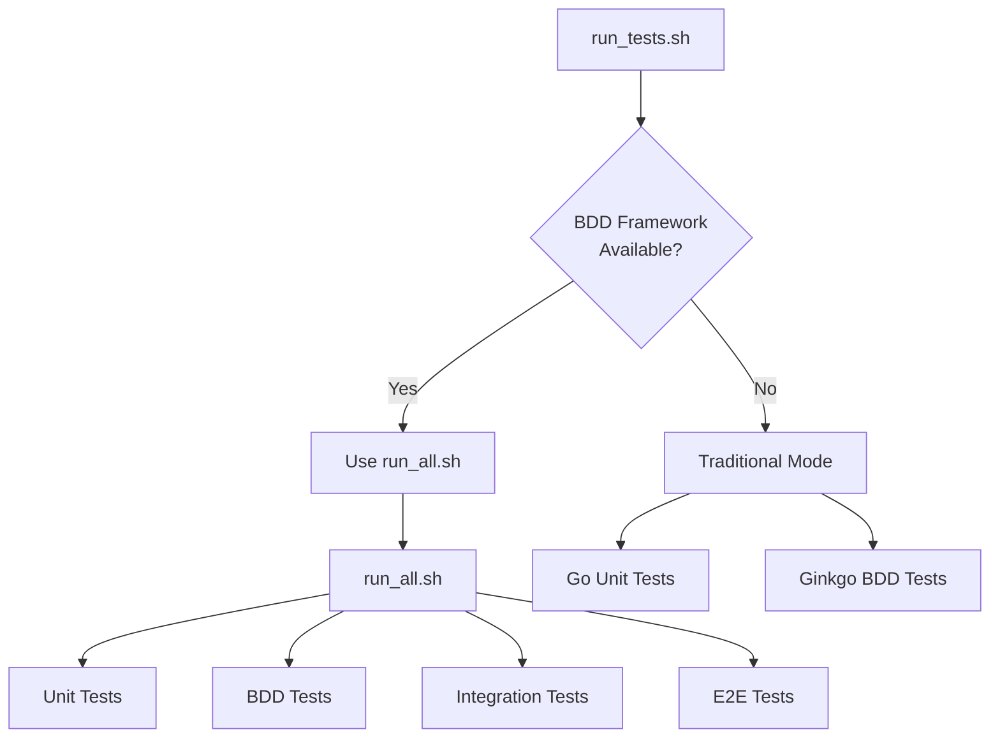
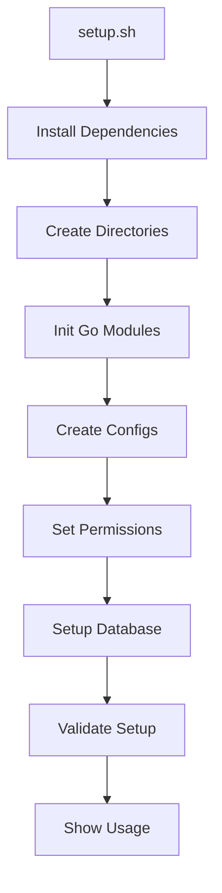
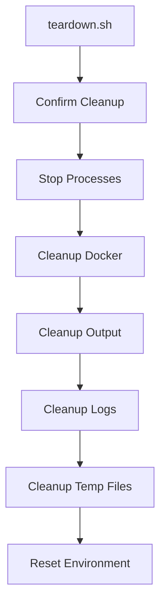
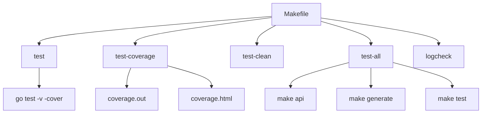
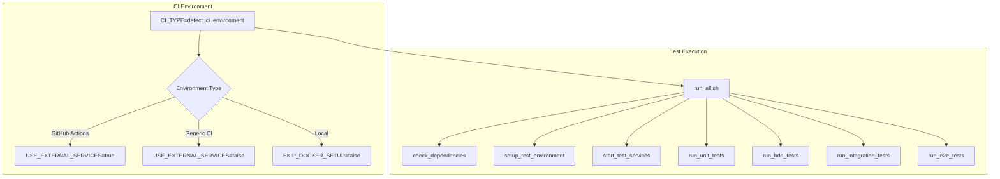
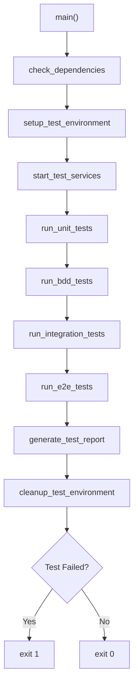
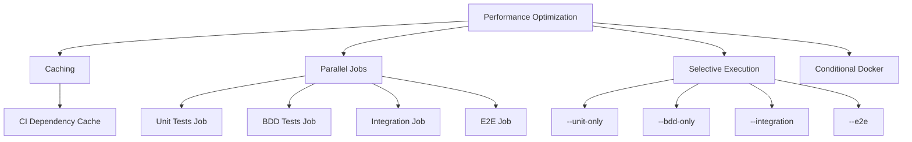
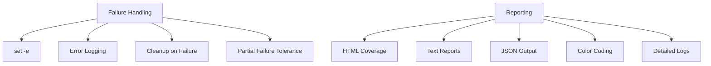

# Test Automation and CI/CD Integration

<cite>
**Referenced Files in This Document**   
- [scripts/run_tests.sh](file://scripts/run_tests.sh)
- [test/scripts/run_all.sh](file://test/scripts/run_all.sh)
- [test/scripts/setup.sh](file://test/scripts/setup.sh)
- [test/scripts/teardown.sh](file://test/scripts/teardown.sh)
- [Makefile](file://Makefile)
- [test/config/docker-compose.test.yml](file://test/config/docker-compose.test.yml)
</cite>

## Table of Contents
1. [Introduction](#introduction)
2. [Test Execution Orchestration](#test-execution-orchestration)
3. [Environment Lifecycle Management](#environment-lifecycle-management)
4. [Standardized Test Execution via Makefile](#standardized-test-execution-via-makefile)
5. [CI/CD Integration Architecture](#cicd-integration-architecture)
6. [Test Pipeline Execution Flow](#test-pipeline-execution-flow)
7. [Parallel Execution and Performance Optimization](#parallel-execution-and-performance-optimization)
8. [Reporting and Failure Handling](#reporting-and-failure-handling)
9. [Extensibility and Best Practices](#extensibility-and-best-practices)

## Introduction
The kratos-boilerplate repository implements a comprehensive test automation framework that supports multiple testing methodologies including unit testing (TDD), behavior-driven development (BDD), integration testing, and end-to-end (E2E) testing. The test infrastructure is designed to work seamlessly across development and continuous integration (CI) environments, providing consistent test execution, environment management, and reporting capabilities. This document details the architecture and implementation of the test automation and CI/CD integration system, focusing on the orchestration of test execution, environment preparation and cleanup, standardized execution interfaces, and integration with CI systems.

## Test Execution Orchestration

The test automation framework in kratos-boilerplate features a hierarchical orchestration system that coordinates the execution of different test types through multiple entry points. The primary orchestration is handled by the `run_tests.sh` script, which serves as the main interface for test execution.



**Diagram sources**
- [scripts/run_tests.sh](file://scripts/run_tests.sh#L1-L102)
- [test/scripts/run_all.sh](file://test/scripts/run_all.sh#L1-L508)

The `run_tests.sh` script first checks for the presence of the enhanced BDD testing framework by looking for the `test/scripts/run_all.sh` script. When the BDD framework is available, it delegates execution to `run_all.sh`, which provides more comprehensive test orchestration capabilities. In traditional mode, it runs Go unit tests for all internal packages except the service layer, followed by Ginkgo BDD tests for the service layer.

The enhanced `run_all.sh` script provides granular control over test execution through command-line flags:
- `--unit-only`: Run only unit tests
- `--bdd-only`: Run only BDD tests
- `--integration`: Run integration tests
- `--e2e`: Run end-to-end tests
- `--all`: Run all test types
- `--no-coverage`: Skip coverage report generation
- `--no-cleanup`: Skip environment cleanup after tests
- `--verbose`: Enable verbose output

**Section sources**
- [scripts/run_tests.sh](file://scripts/run_tests.sh#L1-L102)
- [test/scripts/run_all.sh](file://test/scripts/run_all.sh#L1-L508)

## Environment Lifecycle Management

The test framework includes dedicated scripts for managing the lifecycle of test environments, ensuring consistent setup and cleanup operations. The `setup.sh` and `teardown.sh` scripts handle environment preparation and cleanup respectively.

### Setup Process
The `setup.sh` script performs the following initialization tasks:
1. Installs required dependencies (Go, Ginkgo, Docker)
2. Creates the complete test directory structure
3. Initializes Go module dependencies
4. Creates test configuration files including a Makefile for test operations
5. Sets appropriate permissions on test scripts
6. Configures the test database using Docker Compose
7. Validates the setup and provides usage instructions



**Diagram sources**
- [test/scripts/setup.sh](file://test/scripts/setup.sh#L1-L324)

### Teardown Process
The `teardown.sh` script handles cleanup operations with configurable options:
- `--no-docker`: Preserve Docker containers and volumes
- `--no-output`: Keep test output files
- `--no-logs`: Retain log files
- `--force`: Skip confirmation prompts

The cleanup process includes:
1. Stopping running test processes
2. Removing Docker containers and volumes
3. Cleaning test output and log files
4. Removing temporary files
5. Resetting the test environment



**Diagram sources**
- [test/scripts/teardown.sh](file://test/scripts/teardown.sh#L1-L259)

**Section sources**
- [test/scripts/setup.sh](file://test/scripts/setup.sh#L1-L324)
- [test/scripts/teardown.sh](file://test/scripts/teardown.sh#L1-L259)

## Standardized Test Execution via Makefile

The Makefile provides standardized targets for test execution across development and CI environments, ensuring consistency in how tests are run. The key test-related targets include:

```makefile
.PHONY: test
test:
	go test -v -cover ./internal/...

.PHONY: test-coverage
test-coverage:
	go test $(go list ./internal/... | grep -v '/service') -coverprofile=coverage.out
	go tool cover -html=coverage.out -o coverage.html
	@go tool cover -func=coverage.out | grep total:
```

The Makefile defines several important test targets:
- `test`: Runs all tests with verbose output and coverage
- `test-coverage`: Runs tests and generates HTML coverage reports
- `test-clean`: Removes generated test files
- `test-all`: Regenerates code and runs all tests
- `logcheck`: Runs log compliance checks with various output formats

These targets provide a consistent interface for test execution regardless of the underlying environment, making it easy to integrate with CI/CD systems that expect standard Make targets.



**Diagram sources**
- [Makefile](file://Makefile#L1-L140)

**Section sources**
- [Makefile](file://Makefile#L1-L140)

## CI/CD Integration Architecture

The test framework is designed to integrate seamlessly with CI/CD systems like GitHub Actions, with built-in detection and adaptation to different CI environments. The `run_all.sh` script includes CI environment detection that automatically configures test execution based on the environment type.



**Diagram sources**
- [test/scripts/run_all.sh](file://test/scripts/run_all.sh#L1-L508)

The CI integration features include:
- Automatic detection of GitHub Actions and generic CI environments
- Support for external services in CI environments (using GitHub Actions services)
- Conditional Docker setup based on environment type
- Environment-specific configuration of database and Redis URLs
- Integration with CI secrets management through environment variables

The framework adapts its behavior based on the detected environment:
- In GitHub Actions: Uses external services and skips Docker setup
- In generic CI: May use Docker or external services depending on configuration
- In local development: Uses Docker Compose for service orchestration

**Section sources**
- [test/scripts/run_all.sh](file://test/scripts/run_all.sh#L1-L508)

## Test Pipeline Execution Flow

The complete test pipeline execution follows a well-defined sequence of operations that ensures reliable and repeatable test results. The main execution flow in `run_all.sh` coordinates all test activities:



**Diagram sources**
- [test/scripts/run_all.sh](file://test/scripts/run_all.sh#L1-L508)

The execution flow includes several key phases:
1. **Dependency Checking**: Verifies all required tools are available
2. **Environment Setup**: Prepares the test environment and directories
3. **Service Initialization**: Starts database, Redis, and application services
4. **Test Execution**: Runs tests in sequence (unit → BDD → integration → E2E)
5. **Reporting**: Generates comprehensive test reports
6. **Cleanup**: Restores the environment to its original state

Each test phase is executed sequentially to prevent interference between test types. The script uses a trap to ensure cleanup occurs even if tests are interrupted.

## Parallel Execution and Performance Optimization

While the default execution mode runs tests sequentially to avoid race conditions, the framework provides options for performance optimization in CI environments. The `run_unit_tests` function uses the `-p=1` flag to ensure unit tests run serially, preventing concurrent access to shared resources.

For performance optimization in CI:
- **Caching**: The framework can leverage CI system caches for dependencies
- **Parallel Jobs**: Different test types can run in parallel CI jobs
- **Selective Execution**: Specific test suites can be run using command-line flags
- **Verbose Mode**: The `--verbose` flag provides detailed output for debugging

The framework also includes optimization features:
- Go test cache cleaning (`go clean -testcache`)
- Selective test execution to reduce execution time
- Conditional Docker operations to save setup time
- Reusable test containers in CI environments



**Section sources**
- [test/scripts/run_all.sh](file://test/scripts/run_all.sh#L1-L508)

## Reporting and Failure Handling

The test framework includes comprehensive reporting and failure handling mechanisms to provide clear feedback on test results. Key features include:

### Test Reporting
- HTML coverage reports generated with `go tool cover`
- Comprehensive test reports in text format
- JSON and HTML output options for log compliance checks
- Color-coded console output for easy result identification
- Detailed test reports with configuration and results

### Failure Handling
- Immediate failure propagation (set -e)
- Comprehensive error logging with color coding
- Partial failure tolerance in some scenarios
- Graceful cleanup even when tests fail
- Detailed error messages with context

The `generate_test_report` function creates a detailed text report that includes:
- Test execution timestamp
- Configuration summary
- Coverage information
- File locations for reports and logs



**Section sources**
- [test/scripts/run_all.sh](file://test/scripts/run_all.sh#L1-L508)
- [Makefile](file://Makefile#L1-L140)

## Extensibility and Best Practices

The test automation framework in kratos-boilerplate is designed to be extensible and follows several best practices for CI/CD integration.

### Extensibility Guidelines
1. **Adding New Test Types**: Create new directories under `test/` and update `run_all.sh`
2. **Custom Test Configuration**: Modify `test/config/test.yaml` for test-specific settings
3. **Service Integration**: Add new services to `docker-compose.test.yml`
4. **Makefile Targets**: Add new targets for specialized test operations

### Test Secrets Management
- Use environment variables for sensitive data
- Leverage CI system secrets management
- Never commit secrets to version control
- Use configuration files that are git-ignored

### CI/CD Optimization Best Practices
1. **Caching Dependencies**: Cache Go modules and Docker layers
2. **Parallel Test Execution**: Run different test types in parallel jobs
3. **Selective Testing**: Run specific test suites based on code changes
4. **Artifact Preservation**: Save coverage reports and logs as CI artifacts
5. **Early Failure Detection**: Run fast tests first to fail quickly

The framework's modular design allows teams to extend and customize the test pipeline while maintaining consistency across environments.

**Section sources**
- [test/scripts/run_all.sh](file://test/scripts/run_all.sh#L1-L508)
- [test/scripts/setup.sh](file://test/scripts/setup.sh#L1-L324)
- [test/scripts/teardown.sh](file://test/scripts/teardown.sh#L1-L259)
- [Makefile](file://Makefile#L1-L140)
- [test/config/docker-compose.test.yml](file://test/config/docker-compose.test.yml#L1-L111)