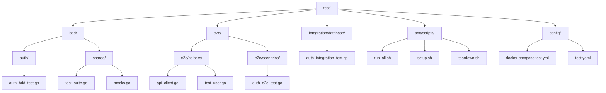
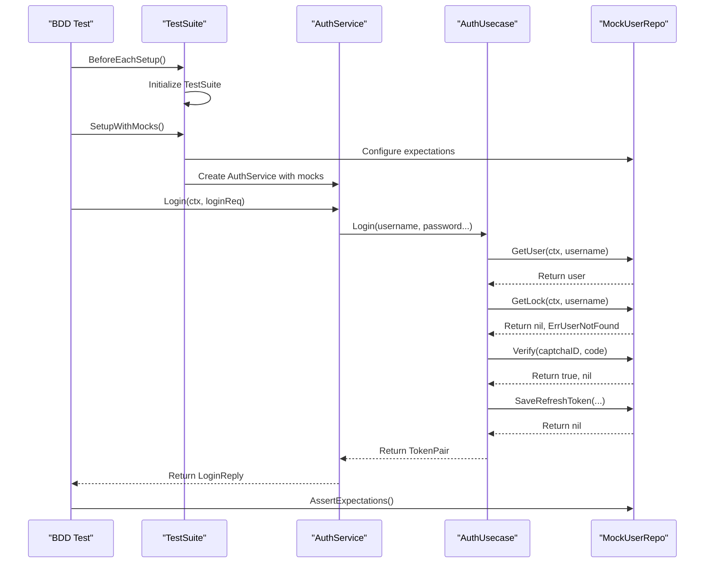
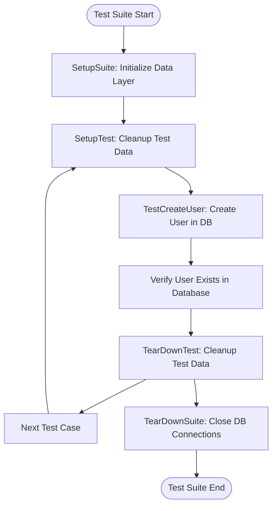
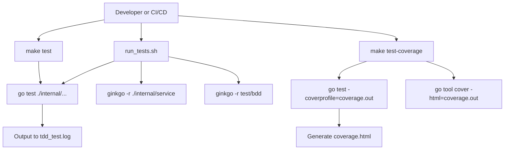

# Testing Strategy

<cite>
**Referenced Files in This Document**   
- [auth_bdd_test.go](file://test/bdd/auth/auth_bdd_test.go)
- [auth_integration_test.go](file://test/integration/database/auth_integration_test.go)
- [run_tests.sh](file://scripts/run_tests.sh)
- [Makefile](file://Makefile)
- [test_suite.go](file://test/bdd/shared/test_suite.go)
- [mocks.go](file://test/bdd/shared/mocks.go)
- [api_client.go](file://test/e2e/helpers/api_client.go)
- [test_user.go](file://test/e2e/helpers/test_user.go)
- [auth_e2e_test.go](file://test/e2e/scenarios/auth_e2e_test.go)
- [auth.go](file://internal/biz/auth.go)
- [auth.go](file://internal/service/auth.go)
</cite>

## Table of Contents
1. [Introduction](#introduction)
2. [Test Organization and Directory Structure](#test-organization-and-directory-structure)
3. [Multi-Layered Testing Approach](#multi-layered-testing-approach)
4. [BDD Testing with Gherkin-Style Scenarios](#bdd-testing-with-gherkin-style-scenarios)
5. [Integration Testing with Database Fixtures](#integration-testing-with-database-fixtures)
6. [End-to-End Testing](#end-to-end-testing)
7. [Test Execution via Scripts and Makefile](#test-execution-via-scripts-and-makefile)
8. [Test Coverage Analysis](#test-coverage-analysis)
9. [Mocking Strategies and Test Doubles](#mocking-strategies-and-test-doubles)
10. [Test Data Management](#test-data-management)
11. [Guidelines for Writing New Tests](#guidelines-for-writing-new-tests)
12. [Debugging Test Failures](#debugging-test-failures)
13. [CI/CD Integration and Test Automation](#cicd-integration-and-test-automation)

## Introduction
The kratos-boilerplate project implements a comprehensive, multi-layered testing strategy designed to ensure high code quality, reliability, and maintainability. This document details the testing architecture, covering unit tests, Behavior-Driven Development (BDD) tests using Gherkin-style syntax, integration tests with real database interactions, and end-to-end (E2E) tests simulating user workflows. The test suite is organized under the `test/` directory and executed through both shell scripts and Makefile commands, enabling consistent and automated test runs. The approach emphasizes clear separation of concerns, effective mocking for isolated unit testing, robust test data management, and seamless integration with CI/CD pipelines for continuous validation.

## Test Organization and Directory Structure
The test suite is meticulously organized into distinct directories based on test type and scope, promoting clarity and maintainability. The primary structure under the `test/` directory includes `bdd/` for high-level behavioral tests, `e2e/` for full system integration tests, and `integration/database/` for database-focused integration tests. Shared utilities and test setup code are located in `test/bdd/shared/`, while configuration files for test environments are in `test/config/`. This separation allows developers to easily locate and run specific test categories. The `scripts/run_tests.sh` and `Makefile` provide unified entry points for executing various test suites, ensuring a consistent developer experience.

**Diagram sources**
- [auth_bdd_test.go](file://test/bdd/auth/auth_bdd_test.go)
- [auth_integration_test.go](file://test/integration/database/auth_integration_test.go)
- [auth_e2e_test.go](file://test/e2e/scenarios/auth_e2e_test.go)
- [test_suite.go](file://test/bdd/shared/test_suite.go)

## Multi-Layered Testing Approach
The project employs a multi-layered testing pyramid, with a strong foundation of unit tests, a middle layer of integration tests, and a smaller top layer of end-to-end tests. Unit tests, primarily located in `internal/biz/` and `internal/data/`, verify the correctness of individual functions and methods in isolation. BDD tests in the `test/bdd/` directory focus on the behavior of service-layer components, using a Given-When-Then structure to describe user stories. Integration tests in `test/integration/database/` validate interactions between the application and external systems, particularly the database and Redis, using real connections. Finally, E2E tests in `test/e2e/` simulate real user interactions with the API, ensuring the entire system functions as expected from an external perspective. This layered approach maximizes test coverage while optimizing for speed and reliability.

## BDD Testing with Gherkin-Style Scenarios
Behavior-Driven Development (BDD) tests are implemented using the Ginkgo framework, which supports a Gherkin-like syntax with `Describe`, `Context`, and `It` blocks to create human-readable test scenarios. These tests are located in `test/bdd/auth/auth_bdd_test.go` and focus on the `AuthService` in the service layer. Each test scenario clearly defines a feature (e.g., "用户登录" - User Login), a specific context (e.g., "当提供有效的用户名和密码时" - When valid username and password are provided), and the expected outcome (e.g., "应该返回访问令牌" - Should return an access token).

The `TestSuite` struct in `test/bdd/shared/test_suite.go` provides a common setup for all BDD tests, initializing the test context, logger, and service dependencies. It uses dependency injection to replace real repositories with mocks, ensuring tests are fast and isolated. The `SetupWithMocks` method configures these mocks with predefined expectations, allowing the tests to verify that the correct methods are called with the right parameters.

**Diagram sources**
- [auth_bdd_test.go](file://test/bdd/auth/auth_bdd_test.go#L15-L285)
- [test_suite.go](file://test/bdd/shared/test_suite.go#L1-L230)
- [auth.go](file://internal/service/auth.go#L1-L234)
- [auth.go](file://internal/biz/auth.go#L1-L694)

**Section sources**
- [auth_bdd_test.go](file://test/bdd/auth/auth_bdd_test.go)
- [test_suite.go](file://test/bdd/shared/test_suite.go)

## Integration Testing with Database Fixtures
Integration tests are designed to verify the application's interaction with external systems, primarily the database. The `auth_integration_test.go` file contains a suite of tests that use a real PostgreSQL database and Redis instance, configured via environment variables (`TEST_DATABASE_URL`, `TEST_REDIS_URL`). The `AuthIntegrationTestSuite` struct, which embeds `suite.Suite` from the `testify` library, manages the test lifecycle with `SetupSuite` and `TearDownSuite` methods for one-time setup and cleanup.

The `SetupSuite` method initializes the `Data` layer, which establishes connections to the database and Redis. It then creates a real `UserRepo` that uses these connections, allowing the tests to perform actual CRUD operations. The `mockKMSManager` struct is used to simulate the Key Management System (KMS) without requiring a real implementation, demonstrating a hybrid approach where some dependencies are mocked while the primary system under test (the database) is real.

Each test method, such as `TestCreateUser` and `TestGetUser`, follows a clear pattern: prepare test data, execute the operation, and verify the result against the database state. The `cleanupTestData` method is called before and after each test to ensure a clean state, preventing test interdependence. This approach provides high confidence in the data access logic and its resilience to real-world conditions like concurrency, as demonstrated by the `TestConcurrentOperations` test.

**Diagram sources**
- [auth_integration_test.go](file://test/integration/database/auth_integration_test.go#L1-L477)
- [data.go](file://internal/data/data.go)

**Section sources**
- [auth_integration_test.go](file://test/integration/database/auth_integration_test.go)

## End-to-End Testing
End-to-end (E2E) tests simulate real user interactions with the application's API, ensuring that the entire system functions correctly from the outside in. These tests are located in `test/e2e/scenarios/auth_e2e_test.go` and use an `ApiClient` from `test/e2e/helpers/api_client.go` to make HTTP requests to a running instance of the application. The `TestUser` struct in `test_user.go` helps manage user state across multiple test steps.

An E2E test typically follows a complete user journey, such as registering a new user, logging in to obtain a JWT token, and then using that token to access protected endpoints. This validates the integration of all layers—API, service, business logic, and data—along with external dependencies like the database and authentication mechanisms. E2E tests are crucial for catching integration bugs that unit and integration tests might miss, such as incorrect API routing, serialization issues, or misconfigured middleware.

## Test Execution via Scripts and Makefile
The project provides multiple ways to execute tests, catering to different development and CI/CD workflows. The primary entry point is the `scripts/run_tests.sh` shell script, which orchestrates a comprehensive test run. It first executes traditional Go unit tests (TDD) on all packages under `internal/` except the `service` layer, generating a coverage report. It then runs Ginkgo-based BDD tests on the `internal/service` package and any tests in the `test/bdd` directory.

The `Makefile` offers a set of convenient commands for common tasks:
- `make test`: Runs all Go tests with verbose output.
- `make test-coverage`: Executes tests and generates an HTML coverage report (`coverage.html`).
- `make test-clean`: Removes generated coverage files.
- `make test-all`: Regenerates code (APIs, configs) and runs all tests.

This dual approach provides flexibility: developers can use `make` for quick, targeted commands, while CI/CD pipelines can use `run_tests.sh` for a more comprehensive and standardized test execution.

**Diagram sources**
- [run_tests.sh](file://scripts/run_tests.sh#L1-L103)
- [Makefile](file://Makefile#L1-L141)

**Section sources**
- [run_tests.sh](file://scripts/run_tests.sh)
- [Makefile](file://Makefile)

## Test Coverage Analysis
Test coverage is measured using Go's built-in `go tool cover` command. The `test-coverage` target in the `Makefile` runs the unit tests (excluding the `internal/service` directory) and generates a `coverage.out` profile. This profile is then converted into an interactive HTML report (`coverage.html`), which developers can open in a browser to see which lines of code are covered by tests. The script also outputs the total coverage percentage to the console. This process provides a quantitative measure of test completeness and helps identify untested code paths that require additional test cases.

## Mocking Strategies and Test Doubles
The project employs a sophisticated mocking strategy to isolate components during testing. For BDD tests, the `mocks.go` file in `test/bdd/shared/` defines mock implementations of key interfaces like `UserRepo` and `CaptchaService` using the `testify/mock` library. These mocks allow tests to simulate various scenarios (e.g., a user found in the database, a failed captcha verification) without relying on real external systems.

The `TestSuite` in `test_suite.go` uses dependency injection to inject these mocks into the `AuthUsecase` and `AuthService`. This enables the tests to verify not only the final output but also the internal interactions, such as ensuring that `GetUser` is called with the correct username and that `SaveRefreshToken` is called after a successful login. For integration tests, a `mockKMSManager` is used to stub out the KMS functionality, allowing the data layer to be tested with a real database while keeping other dependencies mocked.

## Test Data Management
Test data is managed through a combination of in-memory mocks, database fixtures, and dynamic generation. In BDD tests, all data is defined within the test scenarios using Go structs. In integration tests, data is created and destroyed programmatically within each test method using the real repository methods. The `generateRandomString` function is used to create unique usernames and IDs, preventing conflicts between test runs. The `cleanupTestData` method ensures that no test data persists after a test suite completes, maintaining a clean and predictable test environment.

## Guidelines for Writing New Tests
When writing new tests, developers should follow these guidelines:
1. **Choose the Right Level**: Write unit tests for pure logic, BDD tests for service-layer behavior, integration tests for database interactions, and E2E tests for complete user journeys.
2. **Use Descriptive Names**: Test names should clearly describe the scenario and expected outcome (e.g., `It("should return an access token when credentials are valid")`).
3. **Follow the Arrange-Act-Assert Pattern**: Structure tests with clear sections for setting up data, executing the operation, and verifying the result.
4. **Isolate Dependencies**: Use mocks for external services to keep tests fast and reliable.
5. **Clean Up**: Ensure all test data is removed after the test completes to prevent side effects.

## Debugging Test Failures
To debug test failures, developers should:
1. **Read the Error Message**: The first step is to carefully read the failure message from `go test` or Ginkgo.
2. **Check Logs**: The `run_tests.sh` script logs detailed information, including the test output and coverage data.
3. **Run Tests in Isolation**: Use `go test -run TestName` or `ginkgo -focus="description"` to run a single failing test.
4. **Use the HTML Coverage Report**: The `coverage.html` file can help identify untested code paths that might be causing the failure.
5. **Add Debug Logging**: Temporarily add `fmt.Println` or `GinkgoWriter.Println` statements to trace the execution flow.

## CI/CD Integration and Test Automation
The testing strategy is designed for seamless integration into CI/CD pipelines. The `run_tests.sh` script provides a single, reliable command that can be executed in any environment. The script's use of exit codes ensures that the pipeline will fail if any test does not pass. The generated coverage report can be archived as a build artifact for historical tracking. By combining unit, integration, and E2E tests, the pipeline can provide rapid feedback on code quality, ensuring that only well-tested code is deployed to production.