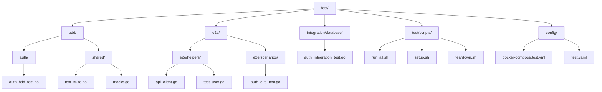
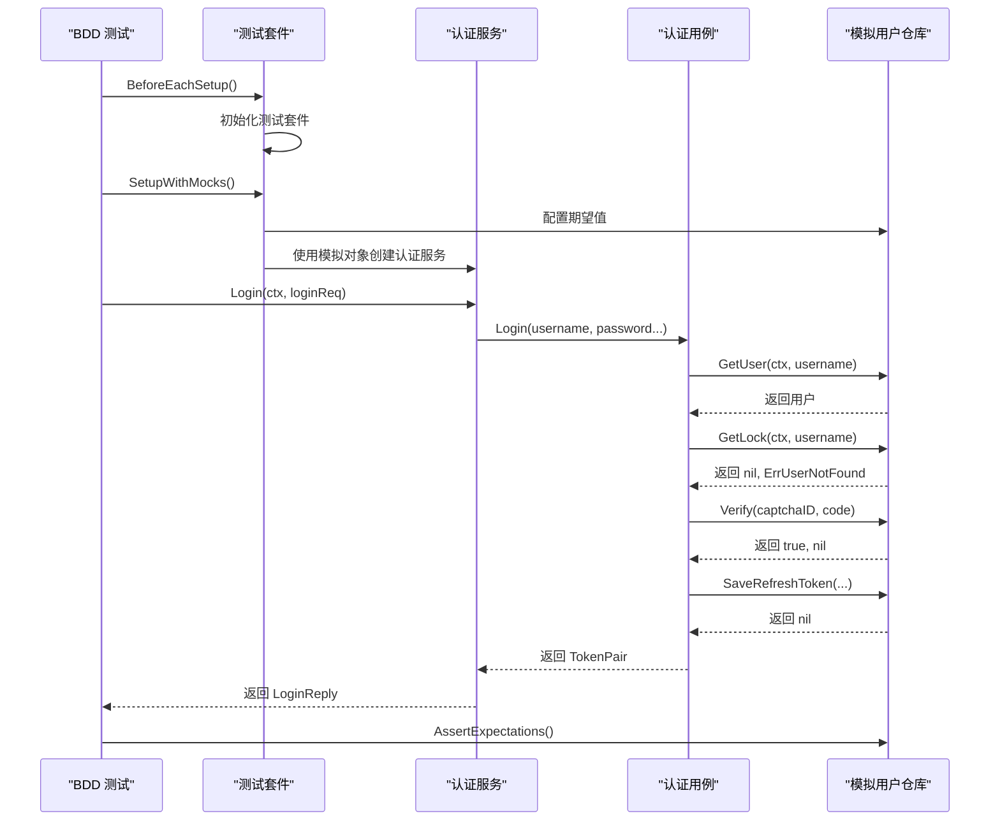
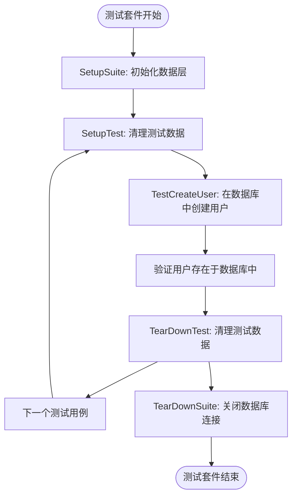
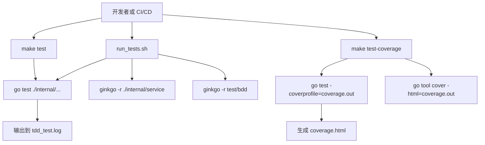

# 测试策略

<cite>
**本文档引用的文件**   
- [auth_bdd_test.go](file://test/bdd/auth/auth_bdd_test.go)
- [auth_integration_test.go](file://test/integration/database/auth_integration_test.go)
- [run_tests.sh](file://scripts/run_tests.sh)
- [Makefile](file://Makefile)
- [test_suite.go](file://test/bdd/shared/test_suite.go)
- [mocks.go](file://test/bdd/shared/mocks.go)
- [api_client.go](file://test/e2e/helpers/api_client.go)
- [test_user.go](file://test/e2e/helpers/test_user.go)
- [auth_e2e_test.go](file://test/e2e/scenarios/auth_e2e_test.go)
- [auth.go](file://internal/biz/auth.go)
- [auth.go](file://internal/service/auth.go)
- [base_modules_test.go](file://test/integration/base_modules_test.go) - *新增于提交 8027e94*
</cite>

## 更新摘要
**已做更改**   
- 在“集成测试”部分新增了基础模块集成测试的内容
- 添加了关于基础模块（配置、日志、错误处理、工具等）测试的新章节
- 更新了多层测试方法以包含基础模块测试
- 增强了对模块间交互和性能基准测试的描述
- 所有内容均已转换为中文并符合语言转换规则

## 目录
1. [简介](#简介)
2. [测试组织与目录结构](#测试组织与目录结构)
3. [多层测试方法](#多层测试方法)
4. [BDD测试与Gherkin风格场景](#bdd测试与gherkin风格场景)
5. [集成测试与数据库Fixture](#集成测试与数据库fixture)
6. [端到端测试](#端到端测试)
7. [通过脚本和Makefile执行测试](#通过脚本和makefile执行测试)
8. [测试覆盖率分析](#测试覆盖率分析)
9. [模拟策略与测试替身](#模拟策略与测试替身)
10. [测试数据管理](#测试数据管理)
11. [编写新测试的指南](#编写新测试的指南)
12. [调试测试失败](#调试测试失败)
13. [CI/CD集成与测试自动化](#cicd集成与测试自动化)

## 简介
kratos-boilerplate项目实施了一种全面的多层次测试策略，旨在确保代码质量、可靠性和可维护性。本文档详细介绍了测试架构，涵盖单元测试、使用Gherkin语法的行为驱动开发（BDD）测试、与真实数据库交互的集成测试以及模拟用户工作流的端到端（E2E）测试。测试套件在`test/`目录下进行了精心组织，并通过shell脚本和Makefile命令执行，从而实现一致且自动化的测试运行。该方法强调关注点分离、用于隔离单元测试的有效模拟、稳健的测试数据管理以及与CI/CD管道的无缝集成。

## 测试组织与目录结构
测试套件根据测试类型和范围被细致地组织成不同的目录，以促进清晰度和可维护性。`test/`目录下的主要结构包括用于高级行为测试的`bdd/`，用于完整系统集成测试的`e2e/`，以及用于数据库重点集成测试的`integration/database/`。共享实用程序和测试设置代码位于`test/bdd/shared/`中，而测试环境的配置文件则位于`test/config/`。这种分离使开发人员能够轻松定位和运行特定的测试类别。`scripts/run_tests.sh`和`Makefile`提供了统一的入口点来执行各种测试套件，确保一致的开发人员体验。

**图源**
- [auth_bdd_test.go](file://test/bdd/auth/auth_bdd_test.go)
- [auth_integration_test.go](file://test/integration/database/auth_integration_test.go)
- [auth_e2e_test.go](file://test/e2e/scenarios/auth_e2e_test.go)
- [test_suite.go](file://test/bdd/shared/test_suite.go)

## 多层测试方法
该项目采用多层测试金字塔，在底部是强大的单元测试，中间层是集成测试，顶部是较小的端到端测试。主要位于`internal/biz/`和`internal/data/`中的单元测试验证单个函数和方法的正确性。`test/bdd/`目录中的BDD测试专注于服务层组件的行为，使用Given-When-Then结构来描述用户故事。`test/integration/database/`中的集成测试验证应用程序与外部系统（特别是数据库和Redis）的交互，使用真实连接。最后，`test/e2e/`中的E2E测试模拟API的真实用户交互，从外部视角确保整个系统按预期运行。这种分层方法在优化速度和可靠性的同时最大化了测试覆盖率。

## BDD测试与Gherkin风格场景
行为驱动开发（BDD）测试使用Ginkgo框架实现，支持类似Gherkin的语法，通过`Describe`、`Context`和`It`块创建人类可读的测试场景。这些测试位于`test/bdd/auth/auth_bdd_test.go`中，重点关注服务层中的`AuthService`。每个测试场景明确定义了一个功能（例如，“用户登录”），一个特定上下文（例如，“当提供有效的用户名和密码时”）以及预期结果（例如，“应该返回访问令牌”）。

`test/bdd/shared/test_suite.go`中的`TestSuite`结构体为所有BDD测试提供了通用设置，初始化测试上下文、记录器和服务依赖项。它使用依赖注入将真实仓库替换为模拟对象，确保测试快速且隔离。`SetupWithMocks`方法配置这些模拟对象的预设期望值，允许测试验证是否以正确的参数调用了正确的方法。

**图源**
- [auth_bdd_test.go](file://test/bdd/auth/auth_bdd_test.go#L15-L285)
- [test_suite.go](file://test/bdd/shared/test_suite.go#L1-L230)
- [auth.go](file://internal/pkg/auth/auth.go#L1-L234)
- [auth.go](file://internal/biz/auth.go#L1-L694)

**节源**
- [auth_bdd_test.go](file://test/bdd/auth/auth_bdd_test.go)
- [test_suite.go](file://test/bdd/shared/test_suite.go)

## 集成测试与数据库Fixture
集成测试旨在验证应用程序与外部系统的交互，主要是数据库。`auth_integration_test.go`文件包含一系列使用真实PostgreSQL数据库和Redis实例的测试，通过环境变量（`TEST_DATABASE_URL`, `TEST_REDIS_URL`）进行配置。嵌入`suite.Suite`来自`testify`库的`AuthIntegrationTestSuite`结构体管理测试生命周期，使用`SetupSuite`和`TearDownSuite`方法进行一次性设置和清理。

`SetupSuite`方法初始化`Data`层，建立与数据库和Redis的连接。然后创建使用这些连接的真实`UserRepo`，允许测试执行实际的CRUD操作。`mockKMSManager`结构体用于模拟密钥管理系统（KMS），而无需真实的实现，展示了混合方法，其中一些依赖项被模拟，而主要被测系统（数据库）是真实的。

每个测试方法，如`TestCreateUser`和`TestGetUser`，遵循清晰的模式：准备测试数据，执行操作，并根据数据库状态验证结果。`cleanupTestData`方法在每个测试前后调用，以确保干净的状态，防止测试相互影响。这种方法为数据访问逻辑及其对并发等现实条件的弹性提供了高度信心，正如`TestConcurrentOperations`测试所证明的那样。

**图源**
- [auth_integration_test.go](file://test/integration/database/auth_integration_test.go#L1-L477)
- [data.go](file://internal/data/data.go)

**节源**
- [auth_integration_test.go](file://test/integration/database/auth_integration_test.go)

### 基础模块集成测试
除了业务逻辑的集成测试外，项目还实现了针对Kratos基础模块的全面测试策略。`test/integration/base_modules_test.go`中的`TestBaseModulesIntegration`函数验证了核心基础设施组件的功能和集成。

#### 配置管理模块测试
配置模块测试验证`config.Manager`的基本操作和默认值处理：
- **存在性验证**: 确保可以成功创建配置管理器实例。
- **默认值获取**: 测试`GetString`、`GetInt`、`GetBool`和`GetDuration`方法在请求不存在的键时能正确返回提供的默认值。

#### 日志模块测试
日志模块测试覆盖了`pkglog.Logger`的核心功能：
- **实例化**: 验证使用默认配置创建日志记录器的成功。
- **基本日志记录**: 测试`Info`、`Warn`和`Error`方法能否正确输出消息和字段。
- **格式化日志**: 验证`Infof`等格式化方法的功能。
- **带字段的日志记录器**: 测试`WithFields`方法创建子记录器的能力。
- **资源清理**: 确认`Close`方法能正常关闭日志记录器。

#### 错误处理模块测试
错误处理模块测试确保`errors`包的健壮性：
- **错误创建**: 验证`NewError`能正确设置错误码和消息。
- **错误包装**: 测试`WrapError`能保留原始错误作为原因。
- **预定义错误**: 检查`InvalidParams`、`Unauthorized`等便捷函数是否生成正确的错误码。
- **错误收集器**: 验证`ErrorCollector`能添加多个错误、检测错误存在性、返回错误列表和第一个错误。

#### 工具模块测试
工具模块测试涵盖了`utils`包的各种实用功能：
- **ID生成**: 测试`GenerateUUID`、`GenerateSnowflake`、`GenerateShortID`和`GenerateCustomID`方法生成有效且唯一的ID。
- **时间工具**: 验证`FormatISO8601`和`ParseISO8601`方法能正确处理ISO 8601格式的时间字符串。
- **验证工具**: 测试`IsEmail`和`IsPhone`方法能准确验证电子邮件和电话号码格式。
- **字符串工具**: 验证`MaskEmail`和`MaskPhone`方法能正确屏蔽敏感信息。

#### 服务模块集成测试
`TestServiceModulesIntegration`函数进一步测试了更复杂的服务模块：
- **健康检查模块**: 创建`HealthChecker`实例，添加自定义检查器，并验证其能并发执行检查并计算整体健康状态。
- **中间件模块**: 测试`MiddlewareChain`能正确构建中间件链，并验证`DefaultMiddlewares`和`TokenBucket`限流器的功能。
- **链路追踪模块**: 在禁用的情况下测试`TracingProvider`的创建，验证`WithSpan`助手函数能正确管理跨度。

#### 模块间交互测试
`TestModulesInteraction`函数专门测试不同模块之间的协同工作：
- **日志与追踪集成**: 验证在启用追踪的上下文中，日志记录器能安全地提取追踪ID和跨度ID。
- **错误与日志集成**: 测试将自定义错误记录到日志中，并验证错误收集器能将多个错误合并为多错误。
- **健康检查与依赖项**: 测试`MemoryChecker`和`HTTPChecker`等预构建检查器与`HealthChecker`的集成。

#### 性能基准测试
`BenchmarkModules`函数提供关键模块的性能基准：
- **ID生成**: 对比`UUID`、`Snowflake`和`ShortID`生成的性能。
- **错误创建**: 测量创建新错误实例的速度。
- **字符串屏蔽**: 测试`MaskEmail`和`MaskPhone`的性能。
- **日志记录**: 测量基本日志记录操作的吞吐量。
- **健康检查**: 测量执行简单健康检查的性能。

**节源**
- [base_modules_test.go](file://test/integration/base_modules_test.go#L23-L412)
- [health.go](file://internal/pkg/health/health.go#L1-L551)

## 端到端测试
端到端（E2E）测试模拟真实用户与应用程序API的交互，确保整个系统从外到内都能正常工作。这些测试位于`test/e2e/scenarios/auth_e2e_test.go`中，使用来自`test/e2e/helpers/api_client.go`的`ApiClient`向正在运行的应用程序实例发出HTTP请求。`test_user.go`中的`TestUser`结构体有助于跨多个测试步骤管理用户状态。

一个E2E测试通常遵循完整的用户旅程，例如注册新用户、登录以获取JWT令牌，然后使用该令牌访问受保护的端点。这验证了所有层——API、服务、业务逻辑和数据——以及外部依赖项（如数据库和身份验证机制）的集成。E2E测试对于捕获单元和集成测试可能遗漏的集成错误至关重要，例如不正确的API路由、序列化问题或配置错误的中间件。

## 通过脚本和Makefile执行测试
项目提供了多种执行测试的方式，以满足不同的开发和CI/CD工作流程。主要入口点是`scripts/run_tests.sh` shell脚本，它编排了全面的测试运行。它首先在`internal/`下的所有包上执行传统的Go单元测试（TDD），但排除`service`层，并生成覆盖率报告。然后运行基于Ginkgo的BDD测试，针对`internal/service`包和`test/bdd`目录中的任何测试。

`Makefile`提供了一组方便的常用任务命令：
- `make test`: 以详细输出运行所有Go测试。
- `make test-coverage`: 执行测试并生成HTML覆盖率报告（`coverage.html`）。
- `make test-clean`: 删除生成的覆盖率文件。
- `make test-all`: 重新生成代码（API、配置）并运行所有测试。

这种双重方法提供了灵活性：开发人员可以使用`make`进行快速、有针对性的命令，而CI/CD管道可以使用`run_tests.sh`进行更全面和标准化的测试执行。

**图源**
- [run_tests.sh](file://scripts/run_tests.sh#L1-L103)
- [Makefile](file://Makefile#L1-L141)

**节源**
- [run_tests.sh](file://scripts/run_tests.sh)
- [Makefile](file://Makefile)

## 测试覆盖率分析
测试覆盖率使用Go内置的`go tool cover`命令进行测量。`Makefile`中的`test-coverage`目标运行单元测试（排除`internal/service`目录）并生成`coverage.out`配置文件。然后将此配置文件转换为交互式HTML报告（`coverage.html`），开发人员可以在浏览器中打开以查看哪些代码行被测试覆盖。该脚本还将总覆盖率百分比输出到控制台。此过程提供了测试完整性的定量衡量标准，并有助于识别需要额外测试用例的未测试代码路径。

## 模拟策略与测试替身
该项目采用复杂的模拟策略，在测试期间隔离组件。对于BDD测试，`test/bdd/shared/mocks.go`文件使用`testify/mock`库定义了`UserRepo`和`CaptchaService`等关键接口的模拟实现。这些模拟允许测试模拟各种场景（例如，数据库中找到用户，验证码验证失败），而无需依赖真实的外部系统。

`test_suite.go`中的`TestSuite`使用依赖注入将这些模拟注入`AuthUsecase`和`AuthService`。这使得测试不仅能验证最终输出，还能验证内部交互，例如确保`GetUser`以正确的用户名被调用，或者`SaveRefreshToken`在成功登录后被调用。对于集成测试，使用`mockKMSManager`存根掉KMS功能，允许在其他依赖项被模拟的同时测试数据层。

## 测试数据管理
测试数据通过内存模拟、数据库Fixture和动态生成相结合的方式进行管理。在BDD测试中，所有数据都在测试场景内使用Go结构体定义。在集成测试中，数据在每个测试方法内使用真实仓库方法以编程方式创建和销毁。`generateRandomString`函数用于创建唯一的用户名和ID，防止测试运行之间的冲突。`cleanupTestData`方法确保在测试套件完成后不会残留任何测试数据，保持干净且可预测的测试环境。

## 编写新测试的指南
编写新测试时，开发人员应遵循以下准则：
1.  **选择合适的层级**: 为纯逻辑编写单元测试，为服务层行为编写BDD测试，为数据库交互编写集成测试，为完整用户旅程编写E2E测试。
2.  **使用描述性名称**: 测试名称应清楚地描述场景和预期结果（例如，`It("should return an access token when credentials are valid")`）。
3.  **遵循Arrange-Act-Assert模式**: 将测试结构化为设置数据、执行操作和验证结果的明确部分。
4.  **隔离依赖项**: 使用模拟对象处理外部服务，以保持测试快速可靠。
5.  **清理**: 确保在测试完成后删除所有测试数据，以防止副作用。

## 调试测试失败
要调试测试失败，开发人员应：
1.  **阅读错误消息**: 第一步是仔细阅读来自`go test`或Ginkgo的失败消息。
2.  **检查日志**: `run_tests.sh`脚本会记录详细信息，包括测试输出和覆盖率数据。
3.  **隔离运行测试**: 使用`go test -run TestName`或`ginkgo -focus="description"`运行单个失败的测试。
4.  **使用HTML覆盖率报告**: `coverage.html`文件可以帮助识别可能导致失败的未测试代码路径。
5.  **添加调试日志**: 临时添加`fmt.Println`或`GinkgoWriter.Println`语句来跟踪执行流程。

## CI/CD集成与测试自动化
测试策略旨在与CI/CD管道无缝集成。`run_tests.sh`脚本提供了一个单一、可靠的命令，可在任何环境中执行。脚本使用的退出码确保如果任何测试未通过，管道将失败。生成的覆盖率报告可以作为构建工件归档，用于历史跟踪。通过结合单元、集成和E2E测试，管道可以就代码质量提供快速反馈，确保只有经过充分测试的代码才能部署到生产环境。