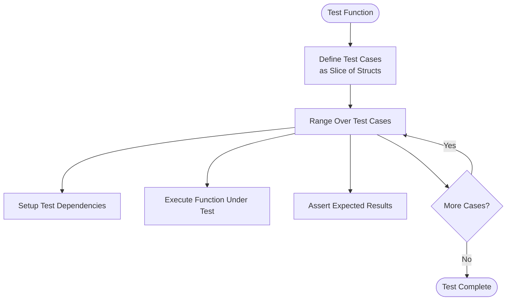
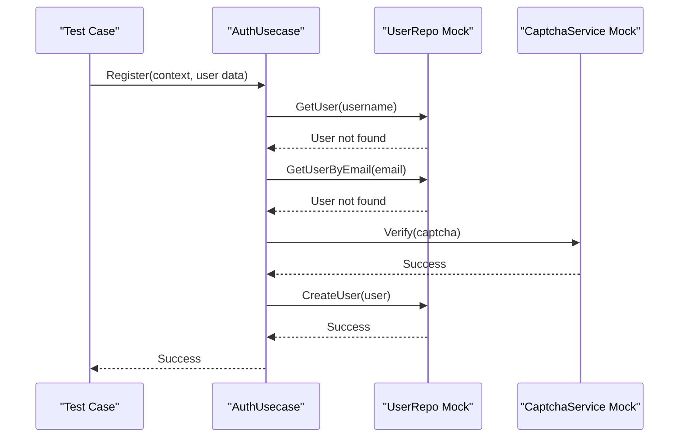
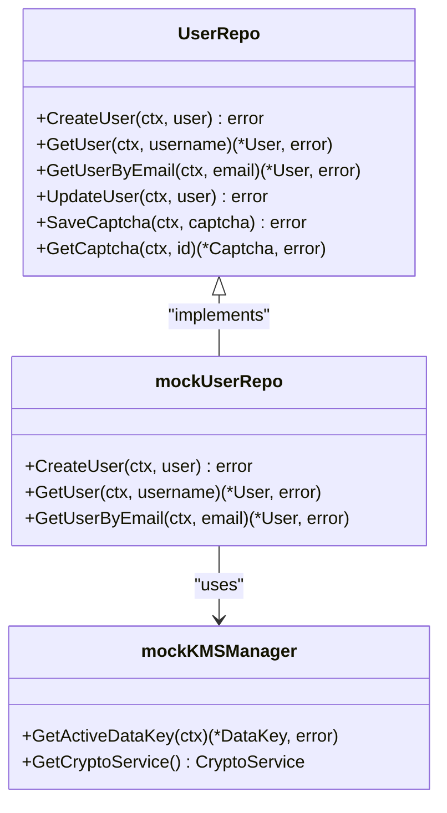
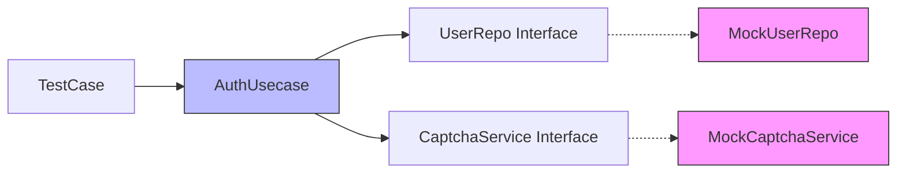

# Unit Testing

<cite>
**Referenced Files in This Document**   
- [auth_test.go](file://internal/biz/auth_test.go#L0-L528)
- [auth_simple_test.go](file://internal/data/auth_simple_test.go#L0-L254)
- [auth_database_test.go](file://internal/data/auth_database_test.go#L0-L413)
- [captcha_test.go](file://internal/pkg/captcha/captcha_test.go)
- [service/auth_test.go](file://internal/service/auth_test.go)
- [service/auth_bdd_test.go](file://internal/service/auth_bdd_test.go)
- [data_comprehensive_test.go](file://internal/data/data_comprehensive_test.go)
- [mock_test.go](file://internal/data/mock_test.go)
</cite>

## Table of Contents
1. [Introduction](#introduction)
2. [Unit Testing in Clean Architecture](#unit-testing-in-clean-architecture)
3. [Testing Patterns and Methodologies](#testing-patterns-and-methodologies)
4. [Component-Level Unit Testing](#component-level-unit-testing)
5. [Mocking Strategies](#mocking-strategies)
6. [Test Setup and Assertion Techniques](#test-setup-and-assertion-techniques)
7. [Test Coverage and Effectiveness](#test-coverage-and-effectiveness)
8. [Integration with Testing Tools](#integration-with-testing-tools)

## Introduction
This document provides a comprehensive overview of unit testing practices in the kratos-boilerplate repository. It focuses on the implementation and organization of unit tests across different layers of the clean architecture, including business logic (biz), data access (data), and service layers. The documentation details testing patterns, mocking techniques, assertion strategies, and integration with Go's testing ecosystem.

## Unit Testing in Clean Architecture

The kratos-boilerplate project implements a clean architecture with distinct layers, each having its own unit testing strategy. Unit tests are designed to validate isolated components within the internal/ packages, ensuring that each layer functions correctly without dependencies on external systems.

The architecture follows the principle of dependency inversion, where higher-level modules depend on abstractions rather than concrete implementations. This design enables effective unit testing by allowing the use of mocks and stubs to isolate components under test.

**Section sources**
- [auth_test.go](file://internal/biz/auth_test.go#L0-L528)
- [auth_simple_test.go](file://internal/data/auth_simple_test.go#L0-L254)

## Testing Patterns and Methodologies

### Table-Driven Tests
The repository extensively uses table-driven tests to verify multiple test cases efficiently. This pattern allows testing various input combinations and expected outcomes in a structured format.



**Diagram sources**
- [auth_test.go](file://internal/biz/auth_test.go#L520-L528)

### Error Path Verification
The test suite thoroughly verifies error handling paths, ensuring that components respond appropriately to invalid inputs and exceptional conditions.

```go
func TestLogin_AccountLocked(t *testing.T) {
    // Test implementation verifies behavior when account is locked
    repo.On("GetLock", mock.Anything, "testuser").Return(lock, nil)
    // ... test execution and assertion
    assert.Equal(t, ErrAccountLocked, err)
}
```

**Section sources**
- [auth_test.go](file://internal/biz/auth_test.go#L300-L320)

### Method Coverage
The testing strategy ensures comprehensive coverage of public methods in each component. Private functions are tested through public method calls, maintaining encapsulation while ensuring thorough validation.

## Component-Level Unit Testing

### Business Logic Testing (biz/)
Unit tests in the biz/ package validate core business rules and workflows. The `auth_test.go` file demonstrates how business use cases are tested in isolation.



**Diagram sources**
- [auth_test.go](file://internal/biz/auth_test.go#L100-L150)

**Section sources**
- [auth_test.go](file://internal/biz/auth_test.go#L0-L528)

### Data Access Testing (data/)
The data/ package contains unit tests that validate data persistence and retrieval operations. These tests use both in-memory implementations and database mocks to verify data access logic.



**Diagram sources**
- [auth_simple_test.go](file://internal/data/auth_simple_test.go#L0-L254)
- [auth_database_test.go](file://internal/data/auth_database_test.go#L0-L413)

The `auth_simple_test.go` file contains tests for the user repository's basic operations, while `auth_database_test.go` focuses on database-specific interactions using sqlmock.

**Section sources**
- [auth_simple_test.go](file://internal/data/auth_simple_test.go#L0-L254)
- [auth_database_test.go](file://internal/data/auth_database_test.go#L0-L413)

### Service Layer Testing (service/)
Service layer tests validate API contracts and integration between business logic and transport layers. The `auth_test.go` file in the service package tests gRPC and HTTP service endpoints.

```go
func TestLogin_Success(t *testing.T) {
    // Test service layer implementation
    uc := &mockAuthUsecase{}
    uc.On("Login", mock.Anything, mock.Anything, mock.Anything, mock.Anything, mock.Anything, mock.Anything).Return(&biz.TokenPair{}, nil)
    
    svc := NewAuthService(uc)
    resp, err := svc.Login(context.Background(), &v1.LoginRequest{
        Username: "testuser",
        Password: "password",
    })
    
    assert.NoError(t, err)
    assert.NotNil(t, resp)
}
```

**Section sources**
- [service/auth_test.go](file://internal/service/auth_test.go)

## Mocking Strategies

The project employs minimal interface mocks to isolate components during testing. The testify/mock package is used to create mock objects for dependencies.

### Dependency Mocking


**Diagram sources**
- [auth_test.go](file://internal/biz/auth_test.go#L30-L90)

### Mock Implementation Examples
The `mockUserRepo` and `mockCaptchaService` structs in `auth_test.go` demonstrate how interfaces are mocked to control test behavior and verify method calls.

```go
type mockUserRepo struct {
    mock.Mock
}

func (m *mockUserRepo) GetUser(ctx context.Context, username string) (*User, error) {
    args := m.Called(ctx, username)
    if args.Get(0) == nil {
        return nil, args.Error(1)
    }
    return args.Get(0).(*User), args.Error(1)
}
```

These mocks allow precise control over return values and enable verification of method invocation patterns using `AssertExpectations`.

**Section sources**
- [auth_test.go](file://internal/biz/auth_test.go#L30-L90)

## Test Setup and Assertion Techniques

### Test Initialization
Tests follow a consistent setup pattern: creating mock dependencies, configuring expectations, executing the test case, and asserting results.

```go
func TestRegister_Success(t *testing.T) {
    // Prepare test dependencies
    repo := new(mockUserRepo)
    captchaService := new(mockCaptchaService)
    logger := log.NewStdLogger(os.Stdout)
    
    // Configure mock behavior
    repo.On("GetUser", mock.Anything, "testuser").Return(nil, ErrUserNotFound)
    repo.On("GetUserByEmail", mock.Anything, "test@example.com").Return(nil, ErrUserNotFound)
    repo.On("CreateUser", mock.Anything, mock.AnythingOfType("*biz.User")).Return(nil)
    captchaService.On("Verify", mock.Anything, "captcha123", "123456").Return(true, nil)
    
    // Create use case and execute
    config := DefaultAuthConfig
    uc := NewAuthUsecase(repo, captchaService, config, logger)
    err := uc.Register(context.Background(), "testuser", "Password123", "test@example.com", "138000138000", "captcha123", "123456")
    
    // Verify results
    assert.NoError(t, err)
    repo.AssertExpectations(t)
    captchaService.AssertExpectations(t)
}
```

### Assertion Strategies
The project uses testify/assert for comprehensive assertion capabilities, including:
- Error validation (`assert.NoError`, `assert.Equal`)
- Value comparison (`assert.Equal`, `assert.NotEmpty`)
- State verification (`assert.True`, `assert.NotNil`)
- Mock expectation validation (`AssertExpectations`)

**Section sources**
- [auth_test.go](file://internal/biz/auth_test.go#L100-L150)

## Test Coverage and Effectiveness

The unit testing strategy aims for high code coverage by testing:
- Happy path scenarios
- Error conditions and edge cases
- Input validation
- State transitions
- Security constraints

The test files are co-located with their implementation files, following Go conventions. This proximity encourages maintaining tests alongside code changes.

Coverage analysis can be performed using:
```bash
go test -coverprofile=coverage.out ./...
go tool cover -html=coverage.out
```

The comprehensive test suite in `data_comprehensive_test.go` demonstrates how multiple aspects of the data layer are tested together, while focused tests in files like `auth_simple_test.go` validate specific components in isolation.

**Section sources**
- [data_comprehensive_test.go](file://internal/data/data_comprehensive_test.go)
- [auth_simple_test.go](file://internal/data/auth_simple_test.go#L0-L254)

## Integration with Testing Tools

### go test Integration
The tests integrate seamlessly with Go's built-in testing tools:
- Standard `go test` command execution
- Benchmark support
- Code coverage reporting
- Race detection with `-race` flag

### Makefile Targets
The project's Makefile likely contains targets for running tests, as indicated by the presence of test scripts in the scripts/ directory.

```makefile
test:
    go test -v ./...

test-race:
    go test -race -v ./...

coverage:
    go test -coverprofile=coverage.out ./...
    go tool cover -html=coverage.out
```

### Test Organization
Tests are organized by component and testing approach:
- Simple unit tests (`*_simple_test.go`)
- Database integration tests (`*_database_test.go`)
- Comprehensive tests (`data_comprehensive_test.go`)
- BDD-style tests (`auth_bdd_test.go`)
- Mock utilities (`mock_test.go`)

This organization allows developers to run specific test suites based on their needs, improving development workflow efficiency.

**Section sources**
- [Makefile](file://Makefile)
- [scripts/run_tests.sh](file://scripts/run_tests.sh)
- [mock_test.go](file://internal/data/mock_test.go)