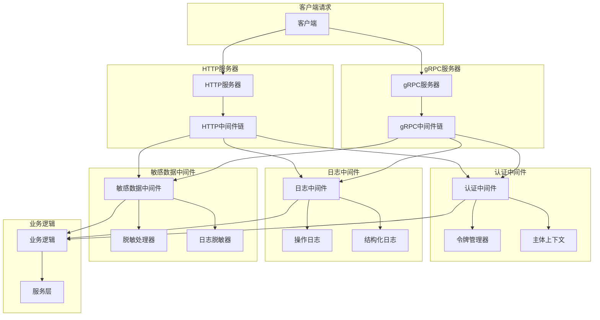
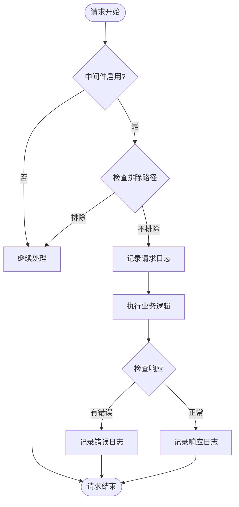
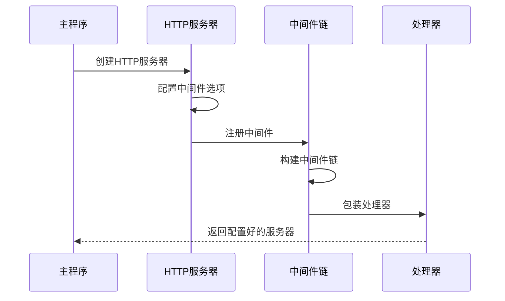
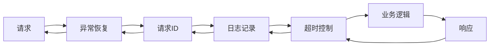
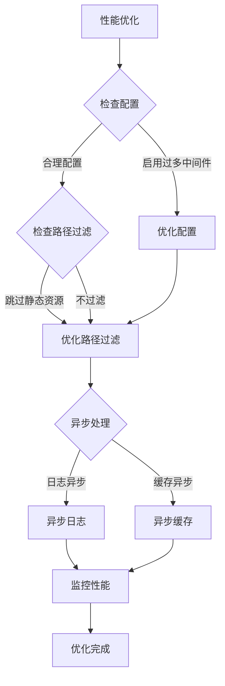

# 中间件机制

<cite>
**本文档引用的文件**
- [internal/pkg/auth/middleware.go](file://internal/pkg/auth/middleware.go)
- [internal/pkg/sensitive/middleware.go](file://internal/pkg/sensitive/middleware.go)
- [internal/pkg/middleware/middleware.go](file://internal/pkg/middleware/middleware.go)
- [internal/pkg/sensitive/anonymizer.go](file://internal/pkg/sensitive/anonymizer.go)
- [internal/pkg/sensitive/rules.go](file://internal/pkg/sensitive/rules.go)
- [internal/server/http.go](file://internal/server/http.go)
- [internal/server/grpc.go](file://internal/server/grpc.go)
- [cmd/kratos-boilerplate/main.go](file://cmd/kratos-boilerplate/main.go)
</cite>

## 目录
1. [简介](#简介)
2. [中间件架构概览](#中间件架构概览)
3. [认证中间件](#认证中间件)
4. [操作日志中间件](#操作日志中间件)
5. [敏感数据中间件](#敏感数据中间件)
6. [HTTP和gRPC服务器集成](#http和grpc服务器集成)
7. [中间件执行顺序](#中间件执行顺序)
8. [自定义中间件开发](#自定义中间件开发)
9. [性能考虑与优化](#性能考虑与优化)
10. [故障排除指南](#故障排除指南)
11. [总结](#总结)

## 简介

Kratos框架采用中间件模式来处理横切关注点，如认证、日志记录、错误处理、限流等。这种设计模式允许开发者将通用功能模块化，提高代码的可维护性和可扩展性。本文档深入探讨了项目中实现的各种中间件及其应用场景。

中间件在Kratos框架中扮演着关键角色，它们位于客户端请求和业务逻辑之间，负责处理各种横切关注点。每个中间件都可以独立工作，也可以组合成中间件链来处理复杂的请求流程。

## 中间件架构概览



**图表来源**
- [internal/server/http.go](file://internal/server/http.go#L1-L37)
- [internal/server/grpc.go](file://internal/server/grpc.go#L1-L35)

## 认证中间件

认证中间件是系统安全的第一道防线，负责验证用户身份并确保只有授权用户才能访问受保护的资源。

### 认证中间件架构

```mermaid
classDiagram
class AuthMiddlewareConfig {
+TokenManager TokenManager
+[]string SkipPaths
+string HeaderName
+string TokenPrefix
+log.Logger Logger
+DefaultAuthMiddlewareConfig() *AuthMiddlewareConfig
}
class AuthMiddleware {
+AuthMiddleware(config *AuthMiddlewareConfig) middleware.Middleware
+GetSubjectFromContext(ctx context.Context) *Subject
-extractToken(tr transport.Transporter, config *AuthMiddlewareConfig) (string, error)
-shouldSkip(tr transport.Transporter, config *AuthMiddlewareConfig) bool
}
class TokenManager {
<<interface>>
+VerifyToken(ctx context.Context, token string) (*Subject, error)
}
class Subject {
+string ID
+string Type
+map[string]interface{} Claims
}
class ContextKey {
<<enumeration>>
SubjectKey
}
AuthMiddlewareConfig --> TokenManager
AuthMiddleware --> AuthMiddlewareConfig
AuthMiddleware --> Subject
AuthMiddleware --> ContextKey
```

**图表来源**
- [internal/pkg/auth/middleware.go](file://internal/pkg/auth/middleware.go#L15-L111)

### 认证流程详解

认证中间件的核心流程如下：

1. **请求拦截**：中间件首先检查请求是否需要认证
2. **令牌提取**：从HTTP头部或gRPC元数据中提取认证令牌
3. **令牌验证**：使用TokenManager验证令牌的有效性
4. **上下文注入**：将认证主体信息注入到请求上下文中
5. **继续处理**：将控制权交给下一个中间件或业务逻辑

### 认证中间件特性

- **可配置跳过路径**：支持配置无需认证的公共路径
- **灵活的令牌格式**：支持多种令牌前缀和格式
- **错误处理**：提供详细的认证失败错误信息
- **上下文传递**：通过context.Value传递认证信息

**章节来源**
- [internal/pkg/auth/middleware.go](file://internal/pkg/auth/middleware.go#L1-L111)

## 操作日志中间件

操作日志中间件负责记录所有请求的操作细节，包括请求路径、方法、耗时和结果，为系统监控和问题排查提供重要依据。

### 日志中间件架构

```mermaid
classDiagram
class LogSanitizeConfig {
+bool Enabled
+bool SanitizeRequest
+bool SanitizeResponse
+bool SanitizeHeaders
+map[string]AnonymizeRule CustomRules
+[]string ExcludePaths
+int MaxLogLength
+DefaultLogSanitizeConfig() *LogSanitizeConfig
}
class LogSanitizeMiddleware {
-config *LogSanitizeConfig
-sanitizer LogSanitizer
-logger log.Logger
+NewLogSanitizeMiddleware(config *LogSanitizeConfig, logger log.Logger) *LogSanitizeMiddleware
+Middleware() middleware.Middleware
-logRequest(ctx context.Context, tr transport.Transporter, req interface{})
-logResponse(ctx context.Context, tr transport.Transporter, resp interface{}, err error, duration time.Duration)
-sanitizeData(data interface{}) interface{}
-isExcludedPath(operation string) bool
-isSensitiveHeader(headerName string) bool
}
class LogSanitizer {
<<interface>>
+SanitizeLogContent(content interface{}) string
+SanitizeLogMessage(message string) string
+ContainsSensitiveInfo(content string) bool
}
class Anonymizer {
<<interface>>
+AnonymizeString(value string, rule AnonymizeRule) string
+AnonymizeValue(value interface{}, rules map[string]AnonymizeRule) interface{}
+AnonymizeObject(obj MakeSensitive) interface{}
}
LogSanitizeConfig --> LogSanitizeMiddleware
LogSanitizeMiddleware --> LogSanitizer
LogSanitizeMiddleware --> Anonymizer
```

**图表来源**
- [internal/pkg/sensitive/middleware.go](file://internal/pkg/sensitive/middleware.go#L15-L327)

### 日志记录机制

日志中间件采用以下策略记录请求和响应：

1. **请求日志记录**：
   - 记录请求的基本信息（路径、方法、时间戳）
   - 脱敏处理请求体中的敏感数据
   - 记录请求头信息（仅非敏感部分）

2. **响应日志记录**：
   - 记录响应状态和耗时
   - 脱敏处理响应体中的敏感数据
   - 记录错误信息（脱敏后）

3. **性能监控**：
   - 计算请求处理时间
   - 记录请求大小和响应大小
   - 支持自定义指标收集

### 敏感数据脱敏

日志中间件内置了强大的敏感数据脱敏功能：

- **预定义规则**：针对常见敏感字段（邮箱、手机号、身份证号等）提供预设脱敏规则
- **自定义规则**：支持开发者定义自己的脱敏规则
- **动态检测**：自动检测文本中的敏感信息并进行脱敏
- **结构化处理**：支持复杂数据结构的递归脱敏

**章节来源**
- [internal/pkg/sensitive/middleware.go](file://internal/pkg/sensitive/middleware.go#L1-L327)
- [internal/pkg/sensitive/anonymizer.go](file://internal/pkg/sensitive/anonymizer.go#L1-L380)
- [internal/pkg/sensitive/rules.go](file://internal/pkg/sensitive/rules.go#L1-L224)

## 敏感数据中间件

敏感数据中间件专门负责处理系统中涉及的敏感信息，确保敏感数据不会在日志、调试输出或其他地方泄露。

### 脱敏处理流程



**图表来源**
- [internal/pkg/sensitive/middleware.go](file://internal/pkg/sensitive/middleware.go#L50-L80)

### 脱敏规则系统

敏感数据中间件提供了灵活的脱敏规则系统：

1. **预定义规则**：
   - 邮箱：保留用户名前两位和域名部分
   - 手机号：保留前三位和后四位
   - 身份证号：保留前六位和后四位
   - 银行卡号：保留前四位和后四位
   - 姓名：保留首尾字符

2. **自定义规则**：
   - 支持自定义脱敏函数
   - 可配置保留字符数量
   - 支持多种掩码字符

3. **智能检测**：
   - 正则表达式匹配
   - 支持多种数据格式
   - 动态识别敏感信息类型

**章节来源**
- [internal/pkg/sensitive/rules.go](file://internal/pkg/sensitive/rules.go#L1-L224)

## HTTP和gRPC服务器集成

中间件在HTTP和gRPC服务器中的注册方式略有不同，但都遵循相同的模式。

### HTTP服务器中间件注册



**图表来源**
- [internal/server/http.go](file://internal/server/http.go#L10-L25)

### gRPC服务器中间件注册

gRPC服务器的中间件注册方式与HTTP类似，但需要处理不同的传输协议：

- **传输层适配**：gRPC使用不同的传输层接口
- **元数据处理**：从gRPC元数据中提取认证信息
- **协议兼容性**：确保中间件在两种协议下的行为一致

### 服务器配置对比

| 特性 | HTTP服务器 | gRPC服务器 |
|------|------------|------------|
| 中间件注册位置 | `http.Middleware()` | `grpc.Middleware()` |
| 传输层接口 | `http.Transport` | `grpc.Transport` |
| 认证信息来源 | HTTP头部 | gRPC元数据 |
| 错误处理 | HTTP状态码 | gRPC状态码 |

**章节来源**
- [internal/server/http.go](file://internal/server/http.go#L1-L37)
- [internal/server/grpc.go](file://internal/server/grpc.go#L1-L35)

## 中间件执行顺序

中间件的执行顺序至关重要，它决定了各个中间件之间的交互关系和数据流向。

### 默认中间件链

根据项目配置，默认的中间件执行顺序如下：

1. **Recovery**：异常恢复中间件，防止panic导致服务崩溃
2. **RequestID**：请求ID生成中间件，为每个请求分配唯一标识
3. **Logging**：日志记录中间件，记录请求和响应信息
4. **Timeout**：超时控制中间件，设置请求处理超时时间

### 中间件链构建



**图表来源**
- [internal/pkg/middleware/middleware.go](file://internal/pkg/middleware/middleware.go#L570-L594)

### 执行顺序的重要性

正确的中间件执行顺序可以确保：

- **错误处理**：Recovery中间件必须最先执行
- **请求追踪**：RequestID中间件确保请求在整个链路中保持一致
- **日志完整性**：Logging中间件能够记录完整的请求生命周期
- **性能监控**：Timeout中间件确保不会出现长时间阻塞

**章节来源**
- [internal/pkg/middleware/middleware.go](file://internal/pkg/middleware/middleware.go#L570-L594)

## 自定义中间件开发

开发者可以根据业务需求创建自定义中间件，扩展现有功能或添加新的横切关注点。

### 中间件开发模式

Kratos框架的中间件遵循统一的模式：

```go
func CustomMiddleware(config *CustomConfig) middleware.Middleware {
    return func(handler middleware.Handler) middleware.Handler {
        return func(ctx context.Context, req interface{}) (interface{}, error) {
            // 1. 请求前处理
            // 2. 调用下一个中间件或业务逻辑
            // 3. 响应后处理
            
            return handler(ctx, req)
        }
    }
}
```

### 常见自定义中间件类型

1. **限流中间件**：控制请求频率，防止系统过载
2. **缓存中间件**：实现请求结果缓存，提高响应速度
3. **权限中间件**：基于用户角色的细粒度权限控制
4. **审计中间件**：记录用户操作历史，满足合规要求
5. **压缩中间件**：对响应数据进行压缩，节省带宽

### 中间件集成步骤

1. **定义配置结构**：创建中间件所需的配置参数
2. **实现中间件逻辑**：按照框架约定实现中间件函数
3. **注册到服务器**：在HTTP或gRPC服务器中注册中间件
4. **测试验证**：确保中间件按预期工作

## 性能考虑与优化

中间件虽然提供了强大的功能，但也可能带来性能开销。合理的优化策略可以最小化这种影响。

### 性能开销分析

中间件的主要性能开销来源：

1. **CPU开销**：令牌验证、日志格式化、数据脱敏等计算密集型操作
2. **内存开销**：日志缓冲区、上下文存储、临时对象创建
3. **I/O开销**：日志写入、数据库查询、外部服务调用
4. **网络开销**：跨服务通信、分布式追踪

### 优化策略



### 具体优化措施

1. **路径过滤**：
   ```go
   // 跳过静态资源路径的认证
   SkipPaths: []string{"/static/", "/health", "/metrics"}
   ```

2. **异步处理**：
   - 异步记录日志
   - 异步发送指标
   - 异步清理资源

3. **缓存策略**：
   - 缓存认证结果
   - 缓存敏感数据检测结果
   - 缓存配置信息

4. **批量处理**：
   - 批量脱敏多个字段
   - 批量记录日志条目
   - 批量发送指标数据

5. **条件执行**：
   - 根据环境变量启用/禁用中间件
   - 根据请求特征选择性执行
   - 动态调整中间件优先级

## 故障排除指南

中间件相关的问题可能出现在认证、日志记录或性能等方面。以下是常见问题的诊断和解决方法。

### 常见问题诊断

1. **认证失败**：
   - 检查令牌格式是否正确
   - 验证TokenManager配置
   - 查看认证日志详情

2. **日志缺失**：
   - 确认中间件已正确注册
   - 检查日志级别配置
   - 验证路径排除规则

3. **性能问题**：
   - 分析中间件执行时间
   - 检查是否存在死锁
   - 优化脱敏算法

### 调试技巧

1. **启用详细日志**：
   ```go
   logger.SetLevel(log.LevelDebug)
   ```

2. **中间件链测试**：
   - 单独测试每个中间件
   - 验证中间件链的完整性
   - 模拟各种请求场景

3. **性能监控**：
   - 使用内置指标收集
   - 监控内存使用情况
   - 分析CPU占用率

**章节来源**
- [internal/pkg/auth/middleware.go](file://internal/pkg/auth/middleware.go#L40-L80)
- [internal/pkg/sensitive/middleware.go](file://internal/pkg/sensitive/middleware.go#L50-L100)

## 总结

Kratos框架的中间件机制为构建现代化微服务应用提供了强大而灵活的基础。通过认证中间件确保安全性，通过日志中间件提供可观测性，通过敏感数据中间件保护隐私，这些中间件协同工作，构成了一个完整的横切关注点处理体系。

### 关键优势

1. **模块化设计**：每个中间件专注于单一职责，便于维护和扩展
2. **统一接口**：所有中间件遵循相同的接口规范，保证一致性
3. **灵活组合**：支持动态配置和中间件链组合
4. **性能优化**：内置多种优化策略，平衡功能和性能

### 最佳实践建议

1. **合理配置**：根据业务需求选择合适的中间件和配置
2. **性能监控**：持续监控中间件的性能表现
3. **安全考虑**：定期审查认证和脱敏规则
4. **文档维护**：保持中间件文档的及时更新

通过深入理解和合理运用中间件机制，开发者可以构建出既安全又高效的微服务应用，为用户提供优质的体验。