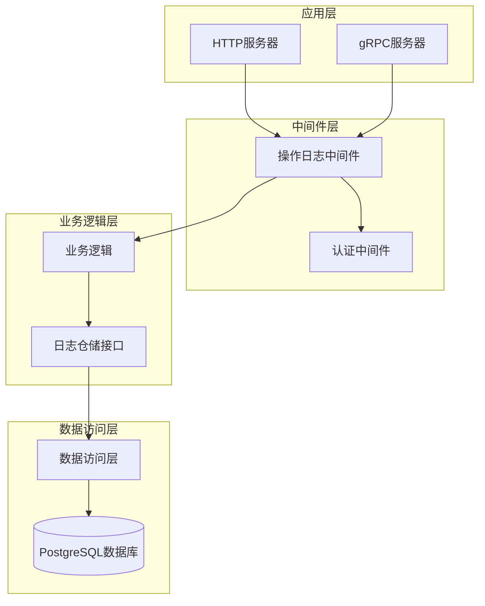
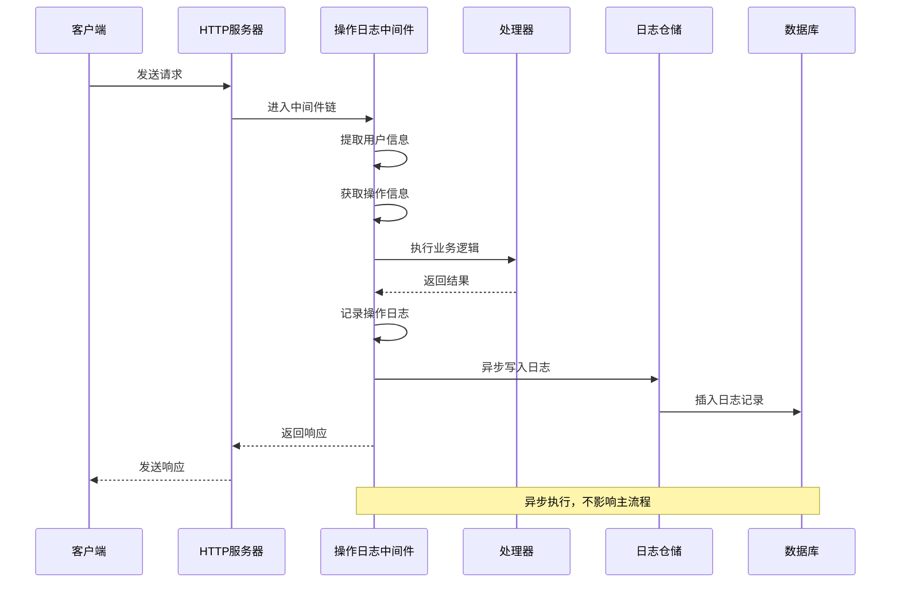
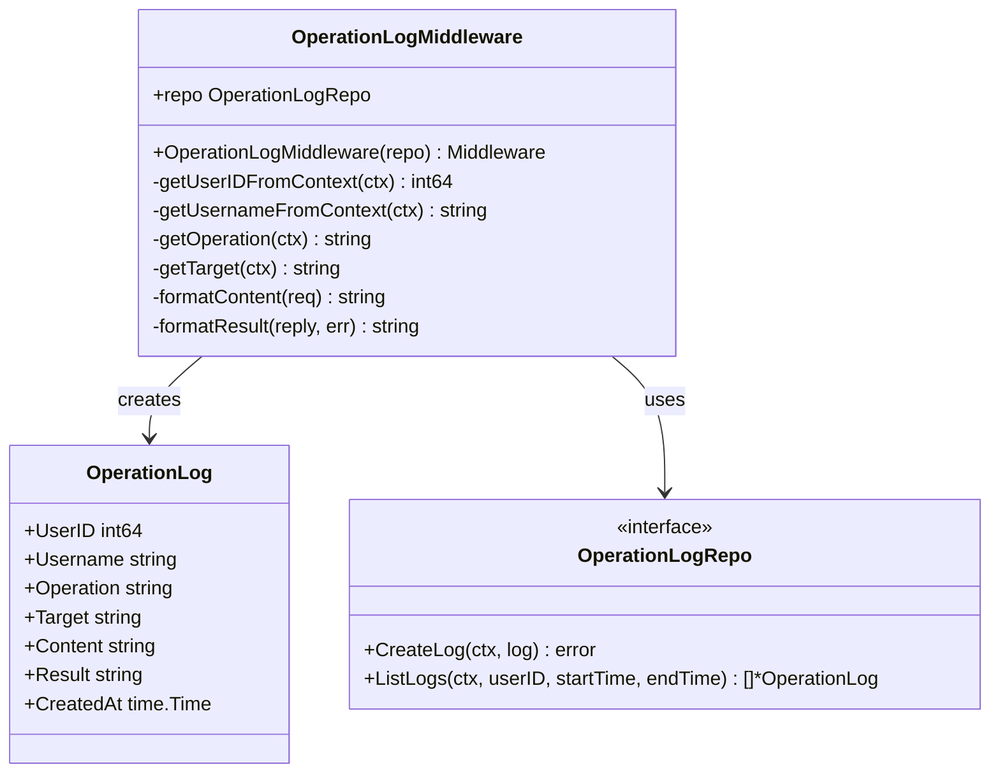
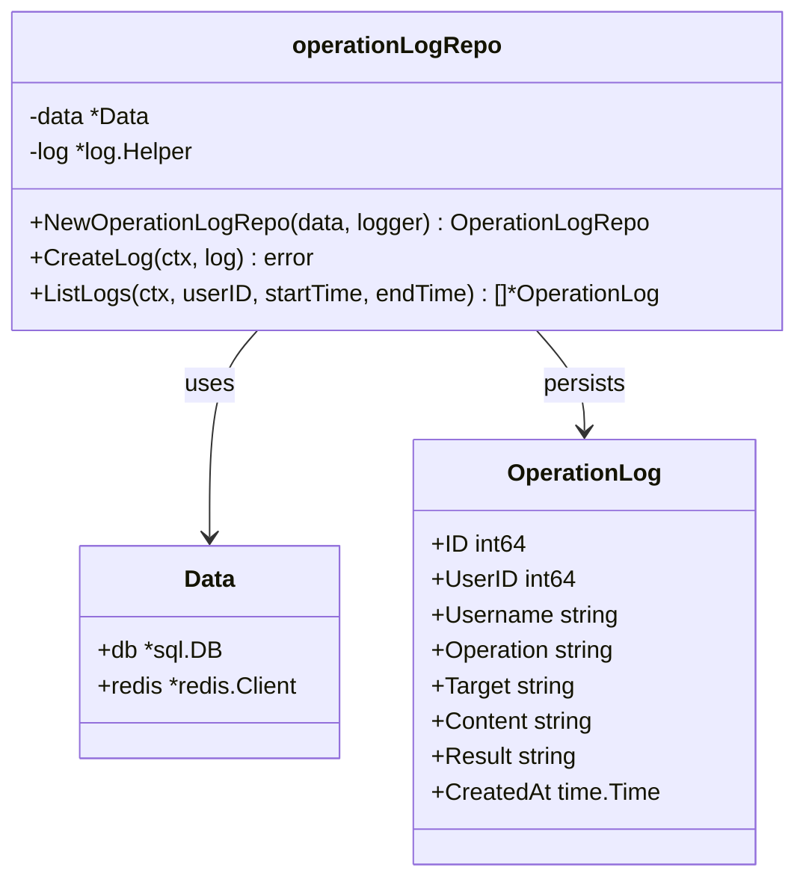
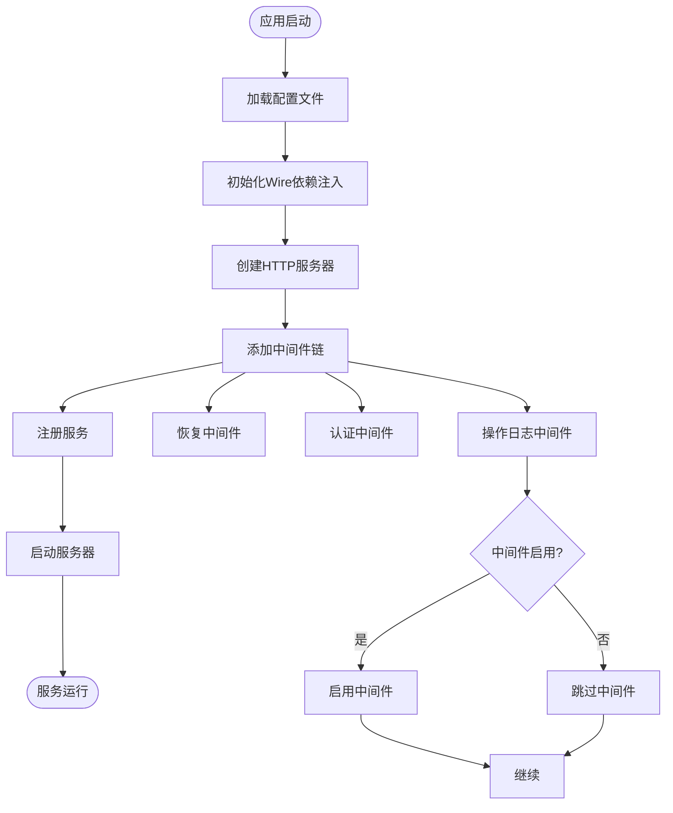
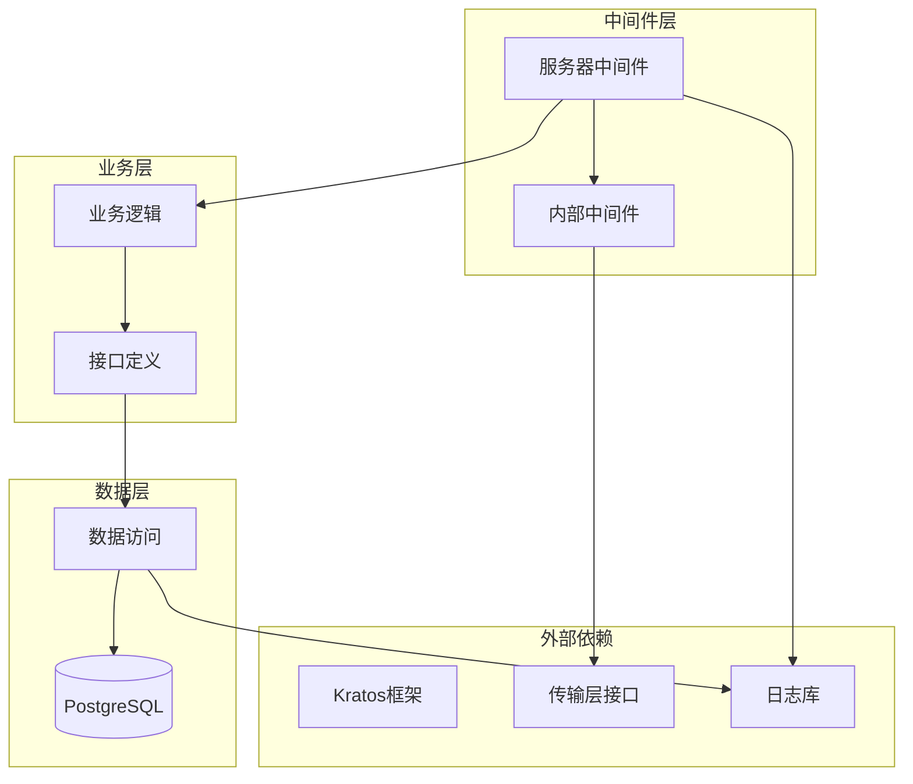

# 操作日志中间件

<cite>
**本文档引用的文件**
- [internal/middleware/operation_log.go](file://internal/middleware/operation_log.go)
- [internal/server/middleware/operation_log.go](file://internal/server/middleware/operation_log.go)
- [internal/biz/operation_log.go](file://internal/biz/operation_log.go)
- [internal/data/operation_log.go](file://internal/data/operation_log.go)
- [internal/server/http.go](file://internal/server/http.go)
- [cmd/kratos-boilerplate/main.go](file://cmd/kratos-boilerplate/main.go)
- [cmd/kratos-boilerplate/wire.go](file://cmd/kratos-boilerplate/wire.go)
- [internal/middleware/operation_log_test.go](file://internal/middleware/operation_log_test.go)
- [internal/data/operation_log_test.go](file://internal/data/operation_log_test.go)
- [configs/config.yaml](file://configs/config.yaml)
</cite>

## 目录
1. [简介](#简介)
2. [项目结构](#项目结构)
3. [核心组件](#核心组件)
4. [架构概览](#架构概览)
5. [详细组件分析](#详细组件分析)
6. [依赖关系分析](#依赖关系分析)
7. [性能考虑](#性能考虑)
8. [故障排除指南](#故障排除指南)
9. [结论](#结论)

## 简介

操作日志中间件是 Kratos 框架中的一个关键组件，负责在 HTTP 和 gRPC 请求的生命周期中捕获和记录关键的操作信息。该中间件采用异步写入机制，确保不会影响主业务流程的性能，同时提供了完整的操作审计功能。

该中间件的核心功能包括：
- 自动捕获请求的 HTTP 方法、路径、gRPC 操作名称
- 从认证上下文中提取用户信息（ID 和用户名）
- 记录请求内容和响应结果的状态
- 支持多种传输协议（HTTP 和 gRPC）
- 提供异步日志记录机制
- 支持错误处理和日志记录失败的优雅降级

## 项目结构

操作日志中间件的实现分布在多个层次中，遵循了清晰的分层架构设计：



**图表来源**
- [internal/server/http.go](file://internal/server/http.go#L15-L25)
- [internal/server/middleware/operation_log.go](file://internal/server/middleware/operation_log.go#L15-L30)

**章节来源**
- [internal/server/http.go](file://internal/server/http.go#L1-L37)
- [internal/server/middleware/operation_log.go](file://internal/server/middleware/operation_log.go#L1-L119)

## 核心组件

### 操作日志结构体

操作日志中间件定义了两个主要的数据结构：一个是用于内部中间件的简单结构，另一个是业务层的完整操作日志结构。

```go
// 内部中间件使用的简单结构
type OperationLog struct {
    Path   string
    Method string
}

// 业务层的完整操作日志结构
type OperationLog struct {
    ID        int64     `json:"id"`
    UserID    int64     `json:"user_id"` // 用户标识
    Username  string    `json:"username"`
    Operation string    `json:"operation"` // 操作类型
    Target    string    `json:"target"`    // 操作对象
    Content   string    `json:"content"`   // 操作内容
    Result    string    `json:"result"`    // 操作结果
    CreatedAt time.Time `json:"created_at"` // 操作时间
}
```

### 仓储接口

```go
type OperationLogRepo interface {
    CreateLog(ctx context.Context, log *OperationLog) error
    ListLogs(ctx context.Context, userID int64, startTime, endTime time.Time) ([]*OperationLog, error)
}
```

**章节来源**
- [internal/middleware/operation_log.go](file://internal/middleware/operation_log.go#L10-L15)
- [internal/biz/operation_log.go](file://internal/biz/operation_log.go#L8-L23)

## 架构概览

操作日志中间件采用了经典的洋葱模型架构，作为 Kratos 框架中间件系统的一部分，在请求处理链中扮演着重要的角色：



**图表来源**
- [internal/server/middleware/operation_log.go](file://internal/server/middleware/operation_log.go#L15-L40)
- [internal/data/operation_log.go](file://internal/data/operation_log.go#L20-L25)

## 详细组件分析

### 中间件实现

操作日志中间件的核心实现位于 `internal/server/middleware/operation_log.go` 文件中，采用了函数式编程风格的中间件模式：



**图表来源**
- [internal/server/middleware/operation_log.go](file://internal/server/middleware/operation_log.go#L15-L40)
- [internal/biz/operation_log.go](file://internal/biz/operation_log.go#L8-L23)

#### 关键功能实现

1. **用户信息提取**：
```go
func getUserIDFromContext(ctx context.Context) int64 {
    // 实际项目中需要根据认证中间件的实现来获取用户 ID
    return 0
}

func getUsernameFromContext(ctx context.Context) string {
    // 实际项目中需要根据认证中间件的实现来获取用户名
    return ""
}
```

2. **操作信息获取**：
```go
func getOperation(ctx context.Context) string {
    tr, ok := transport.FromServerContext(ctx)
    if !ok {
        return "unknown"
    }
    
    switch tr.Kind() {
    case transport.KindHTTP:
        if info, ok := tr.(*http.Transport); ok {
            return info.Request().Method + " " + info.Request().URL.Path
        }
    case transport.KindGRPC:
        if info, ok := tr.(*grpc.Transport); ok {
            return info.Operation()
        }
    }
    return "unknown"
}
```

3. **异步日志记录**：
```go
// 异步记录日志
go func() {
    if err := repo.CreateLog(context.Background(), log); err != nil {
        // 这里可以添加日志记录失败的处理逻辑
    }
}()
```

**章节来源**
- [internal/server/middleware/operation_log.go](file://internal/server/middleware/operation_log.go#L40-L119)

### 数据访问层实现

数据访问层负责将操作日志持久化到 PostgreSQL 数据库中：



**图表来源**
- [internal/data/operation_log.go](file://internal/data/operation_log.go#L10-L25)
- [internal/data/operation_log.go](file://internal/data/operation_log.go#L20-L45)

#### 数据库操作实现

```go
func (r *operationLogRepo) CreateLog(ctx context.Context, log *biz.OperationLog) error {
    query := `INSERT INTO operation_logs (user_id, username, operation, target, content, result, created_at) 
              VALUES ($1, $2, $3, $4, $5, $6, $7)`
    _, err := r.data.db.ExecContext(ctx, query, 
        log.UserID, log.Username, log.Operation, log.Target, 
        log.Content, log.Result, time.Now())
    return err
}
```

**章节来源**
- [internal/data/operation_log.go](file://internal/data/operation_log.go#L20-L25)

### 服务注册流程

在 HTTP 服务器初始化过程中，操作日志中间件通过 Wire 依赖注入系统进行注册：



**图表来源**
- [internal/server/http.go](file://internal/server/http.go#L15-L25)
- [cmd/kratos-boilerplate/wire.go](file://cmd/kratos-boilerplate/wire.go#L15-L25)

**章节来源**
- [internal/server/http.go](file://internal/server/http.go#L15-L25)
- [cmd/kratos-boilerplate/wire.go](file://cmd/kratos-boilerplate/wire.go#L15-L25)

## 依赖关系分析

操作日志中间件的依赖关系体现了清晰的分层架构设计：



**图表来源**
- [internal/server/middleware/operation_log.go](file://internal/server/middleware/operation_log.go#L1-L10)
- [internal/data/operation_log.go](file://internal/data/operation_log.go#L1-L10)

**章节来源**
- [internal/server/middleware/operation_log.go](file://internal/server/middleware/operation_log.go#L1-L10)
- [internal/data/operation_log.go](file://internal/data/operation_log.go#L1-L10)

## 性能考虑

### 异步写入机制

操作日志中间件采用了异步写入策略，确保不会阻塞主业务流程：

1. **goroutine 异步处理**：所有日志记录都在单独的 goroutine 中执行
2. **背景上下文**：使用 `context.Background()` 避免超时影响日志记录
3. **错误优雅处理**：即使日志记录失败也不会影响主业务流程

### 性能优化措施

1. **连接池复用**：数据库连接通过连接池管理，避免频繁建立连接
2. **批量插入**：虽然当前实现是一条一条插入，但可以通过缓冲区实现批量插入
3. **索引优化**：数据库表设计包含适当的索引，支持高效的查询操作

### 敏感信息处理

系统集成了敏感信息过滤中间件，可以在日志记录前对敏感数据进行脱敏处理：

```go
// 在日志记录前进行敏感信息脱敏
sanitizedContent := m.sanitizer.SanitizeLogMessage(string(jsonData))
```

**章节来源**
- [internal/server/middleware/operation_log.go](file://internal/server/middleware/operation_log.go#L35-L45)

## 故障排除指南

### 常见问题及解决方案

1. **日志记录失败**
   - 症状：日志没有写入数据库
   - 原因：数据库连接异常或权限不足
   - 解决方案：检查数据库连接配置和权限设置

2. **用户信息缺失**
   - 症状：日志中显示用户ID和用户名为空
   - 原因：认证中间件未正确设置用户信息
   - 解决方案：确保认证中间件在操作日志中间件之前执行

3. **性能问题**
   - 症状：请求响应变慢
   - 原因：日志记录过于频繁或数据库性能瓶颈
   - 解决方案：调整日志采样率或优化数据库性能

### 测试覆盖

系统提供了全面的单元测试和集成测试：

```go
// 测试操作日志中间件
func TestOperationLogMiddleware(t *testing.T) {
    tests := []struct {
        name          string
        ctxSetup      func() context.Context
        mockSetup     func(*MockOperationLogRepo)
        handlerSetup  func() middleware.Handler
        request       interface{}
        expectedReply interface{}
        expectedError error
    }{
        // 测试各种场景
    }
}
```

**章节来源**
- [internal/middleware/operation_log_test.go](file://internal/middleware/operation_log_test.go#L52-L201)
- [internal/data/operation_log_test.go](file://internal/data/operation_log_test.go#L15-L60)

## 结论

操作日志中间件是一个设计精良、功能完善的组件，它成功地解决了以下关键需求：

### 主要优势

1. **架构清晰**：采用分层架构，职责分离明确
2. **性能优秀**：异步写入机制确保不影响主业务流程
3. **扩展性强**：支持多种传输协议和自定义配置
4. **易于测试**：提供了完整的测试覆盖
5. **错误处理完善**：具备优雅的错误处理和降级机制

### 最佳实践建议

1. **配置管理**：合理配置日志采样率和排除路径
2. **监控告警**：建立日志记录状态的监控机制
3. **定期清理**：制定日志数据的清理和归档策略
4. **安全合规**：确保敏感信息得到适当保护

该中间件为 Kratos 应用提供了强大的操作审计能力，是构建企业级应用的重要基础设施组件。