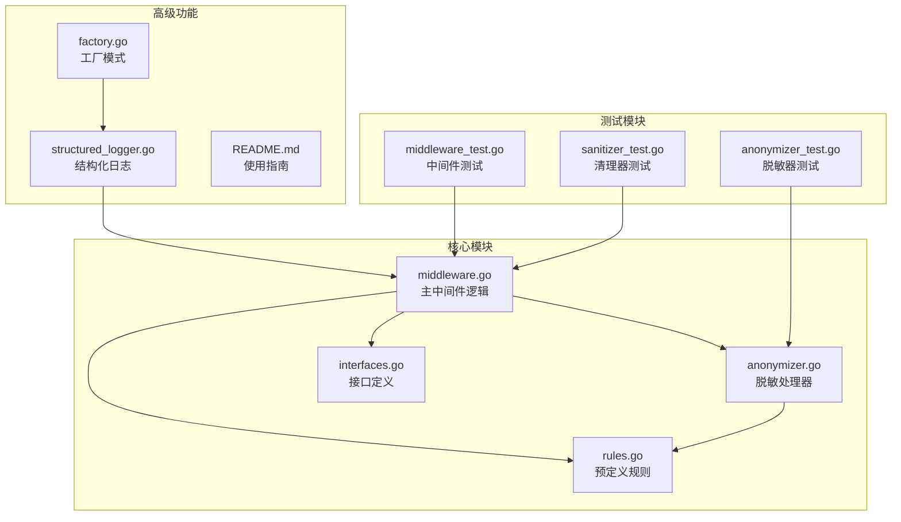
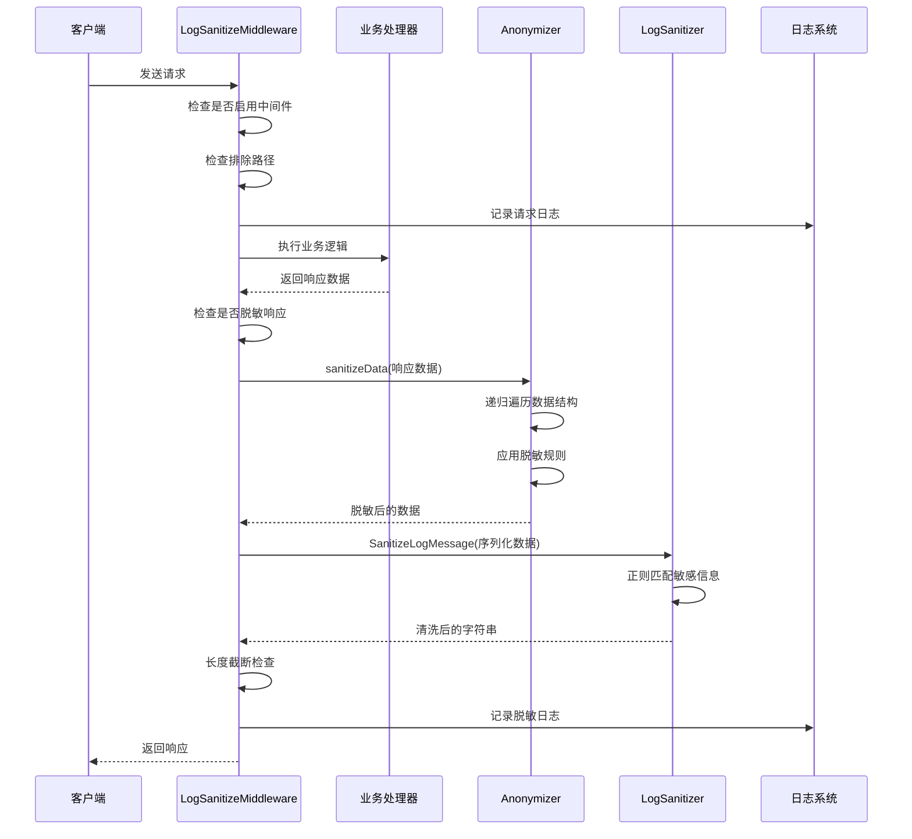
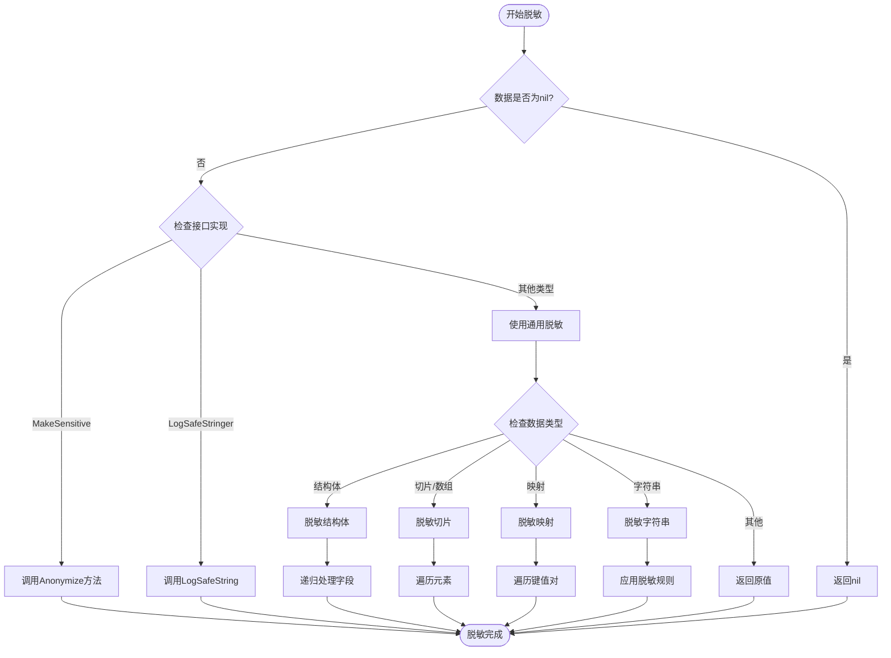
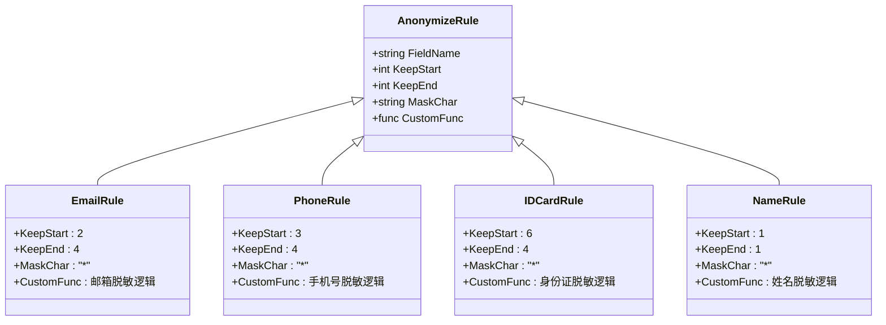
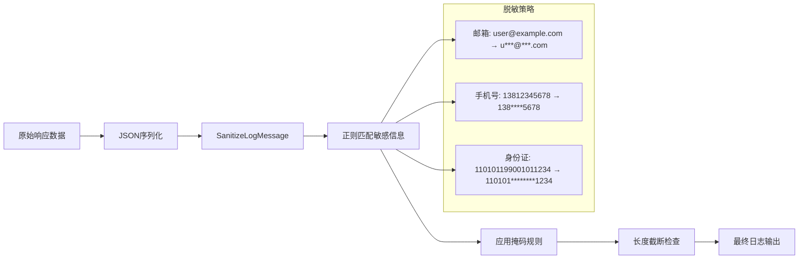
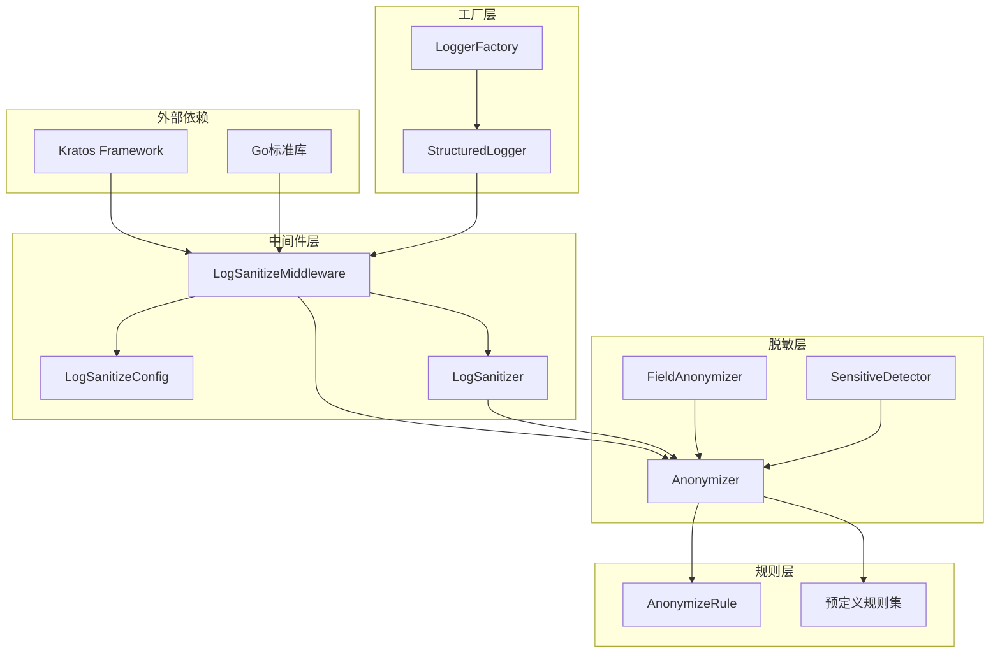

# 敏感数据中间件

<cite>
**本文档中引用的文件**
- [middleware.go](file://internal/pkg/sensitive/middleware.go)
- [anonymizer.go](file://internal/pkg/sensitive/anonymizer.go)
- [rules.go](file://internal/pkg/sensitive/rules.go)
- [interfaces.go](file://internal/pkg/sensitive/interfaces.go)
- [factory.go](file://internal/pkg/sensitive/factory.go)
- [structured_logger.go](file://internal/pkg/sensitive/structured_logger.go)
- [middleware_test.go](file://internal/pkg/sensitive/middleware_test.go)
- [anonymizer_test.go](file://internal/pkg/sensitive/anonymizer_test.go)
- [sanitizer_test.go](file://internal/pkg/sensitive/sanitizer_test.go)
- [README.md](file://internal/pkg/sensitive/README.md)
</cite>

## 目录
1. [简介](#简介)
2. [项目结构](#项目结构)
3. [核心组件](#核心组件)
4. [架构概览](#架构概览)
5. [详细组件分析](#详细组件分析)
6. [依赖关系分析](#依赖关系分析)
7. [性能考虑](#性能考虑)
8. [故障排除指南](#故障排除指南)
9. [结论](#结论)

## 简介

Kratos框架的敏感数据中间件是一个强大的自动化脱敏系统，专门设计用于在HTTP和gRPC响应阶段对输出数据进行智能脱敏处理。该中间件通过递归遍历响应体结构，识别并掩码手机号、身份证号、邮箱等敏感字段，确保敏感信息不会泄露到日志系统中。

核心功能包括：
- 自动检测和脱敏响应数据中的敏感信息
- 支持多种数据类型（字符串、结构体、切片、映射）
- 可配置的脱敏规则和自定义规则支持
- JSON序列化后的字符串级清洗
- 长度截断策略以控制日志大小
- 多种传输协议支持（HTTP/gRPC）

## 项目结构

敏感数据中间件采用模块化设计，主要文件组织如下：



**图表来源**
- [middleware.go](file://internal/pkg/sensitive/middleware.go#L1-L327)
- [anonymizer.go](file://internal/pkg/sensitive/anonymizer.go#L1-L380)
- [rules.go](file://internal/pkg/sensitive/rules.go#L1-L224)

## 核心组件

### LogSanitizeMiddleware 主中间件

`LogSanitizeMiddleware`是整个脱敏系统的核心，负责拦截HTTP和gRPC请求的响应阶段，对输出数据进行脱敏处理。

```go
type LogSanitizeMiddleware struct {
    config    *LogSanitizeConfig
    sanitizer LogSanitizer
    logger    log.Logger
}
```

### 脱敏配置系统

```go
type LogSanitizeConfig struct {
    Enabled         bool                     `json:"enabled"`
    SanitizeRequest bool                     `json:"sanitize_request"`
    SanitizeResponse bool                    `json:"sanitize_response"`
    SanitizeHeaders  bool                    `json:"sanitize_headers"`
    CustomRules      map[string]AnonymizeRule `json:"custom_rules"`
    ExcludePaths     []string                 `json:"exclude_paths"`
    MaxLogLength     int                      `json:"max_log_length"`
}
```

**章节来源**
- [middleware.go](file://internal/pkg/sensitive/middleware.go#L15-L35)
- [middleware.go](file://internal/pkg/sensitive/middleware.go#L40-L50)

## 架构概览

敏感数据中间件采用分层架构设计，确保了高度的可扩展性和维护性：



**图表来源**
- [middleware.go](file://internal/pkg/sensitive/middleware.go#L58-L85)
- [middleware.go](file://internal/pkg/sensitive/middleware.go#L95-L146)

## 详细组件分析

### 数据脱敏核心算法

#### 递归遍历机制

`sanitizeData`方法实现了对复杂数据结构的递归脱敏：



**图表来源**
- [middleware.go](file://internal/pkg/sensitive/middleware.go#L175-L201)
- [anonymizer.go](file://internal/pkg/sensitive/anonymizer.go#L50-L80)

#### 正则匹配规则系统

系统内置了多种预定义的脱敏规则，每种规则都有精确的掩码策略：



**图表来源**
- [rules.go](file://internal/pkg/sensitive/rules.go#L10-L100)
- [interfaces.go](file://internal/pkg/sensitive/interfaces.go#L18-L25)

### 请求头脱敏处理

中间件能够智能识别并脱敏HTTP和gRPC请求头中的敏感信息：

```go
func (m *LogSanitizeMiddleware) isSensitiveHeader(headerName string) bool {
    sensitiveHeaders := []string{
        "authorization", "cookie", "set-cookie",
        "x-api-key", "x-auth-token", "x-access-token",
        "x-refresh-token", "password", "secret", "token",
    }
    
    headerLower := strings.ToLower(headerName)
    for _, sensitive := range sensitiveHeaders {
        if strings.Contains(headerLower, sensitive) {
            return true
        }
    }
    return false
}
```

### JSON序列化后的二次脱敏

在最终记录日志之前，系统会对JSON序列化后的字符串进行二次脱敏处理：



**图表来源**
- [middleware.go](file://internal/pkg/sensitive/middleware.go#L203-L233)

**章节来源**
- [middleware.go](file://internal/pkg/sensitive/middleware.go#L235-L250)
- [middleware.go](file://internal/pkg/sensitive/middleware.go#L203-L233)

### 结构化日志集成

`StructuredLogger`提供了与Kratos日志系统的无缝集成：

```go
type StructuredLogger struct {
    helper     *log.Helper
    logger     log.Logger
    anonymizer Anonymizer
    rules      map[string]AnonymizeRule
    config     *StructuredLogConfig
}
```

支持多种日志级别和结构化方法：

```go
// 结构化日志方法
slogger.Infow("用户登录", "user_id", userID, "email", email)
slogger.Errorw("登录失败", "user_id", userID, "error", err)

// 兼容原有方法
slogger.Info("系统启动")
slogger.Errorf("连接超时: %v", err)
```

**章节来源**
- [structured_logger.go](file://internal/pkg/sensitive/structured_logger.go#L10-L25)
- [structured_logger.go](file://internal/pkg/sensitive/structured_logger.go#L70-L120)

## 依赖关系分析

敏感数据中间件的依赖关系体现了清晰的分层架构：



**图表来源**
- [middleware.go](file://internal/pkg/sensitive/middleware.go#L1-L15)
- [factory.go](file://internal/pkg/sensitive/factory.go#L1-L20)

**章节来源**
- [middleware.go](file://internal/pkg/sensitive/middleware.go#L1-L15)
- [interfaces.go](file://internal/pkg/sensitive/interfaces.go#L1-L15)

## 性能考虑

### 配置优化策略

系统提供了多个配置项来平衡安全性与性能：

1. **SanitizeResponse**: 控制是否对响应数据进行脱敏
2. **MaxLogLength**: 限制日志最大长度，防止内存溢出
3. **ExcludePaths**: 排除特定路径的脱敏处理
4. **Enabled**: 全局开关控制中间件启用状态

### 环境适配配置

不同环境下的推荐配置：

```go
// 生产环境配置（严格脱敏）
productionConfig := &StructuredLogConfig{
    Enabled:           true,
    AutoDetect:        true,
    MaxValueLength:    500,
    TruncateThreshold: 300,
    SensitiveKeys:     []string{"password", "token", "secret", "key", "auth", "credential", "authorization", "session", "cookie"},
}

// 开发环境配置（宽松脱敏）
developmentConfig := &StructuredLogConfig{
    Enabled:           false, // 禁用脱敏
    AutoDetect:        false,
    MaxValueLength:    2000,
    TruncateThreshold: 1000,
}
```

### 性能监控指标

建议监控的关键指标：
- 脱敏处理时间
- 日志大小变化
- 内存使用情况
- 异常处理频率

## 故障排除指南

### 常见问题诊断

#### 1. 脱敏规则不生效

**症状**: 敏感信息未被正确脱敏

**排查步骤**:
1. 检查字段名是否匹配预定义规则
2. 验证自定义规则是否正确配置
3. 确认数据类型是否支持脱敏

```go
// 检查字段名匹配
fieldName := strings.ToLower(fieldType.Name)
if rule, exists := rules[fieldName]; exists {
    // 规则存在，但可能配置错误
}
```

#### 2. 性能问题

**症状**: 日志记录变慢

**解决方案**:
1. 调整MaxLogLength参数
2. 禁用不必要的脱敏功能
3. 优化自定义规则复杂度

#### 3. JSON序列化错误

**症状**: 日志记录失败

**解决方案**:
```go
// 捕获序列化错误
jsonData, err := json.Marshal(data)
if err != nil {
    m.logger.Log(log.LevelError, "msg", "Failed to marshal log data", "error", err)
    return
}
```

**章节来源**
- [middleware.go](file://internal/pkg/sensitive/middleware.go#L203-L215)
- [factory.go](file://internal/pkg/sensitive/factory.go#L80-L120)

### 自定义扩展方法

#### 添加新的敏感字段类型

```go
// 定义新的脱敏规则
newRule := AnonymizeRule{
    FieldName: "passport_number",
    KeepStart: 2,
    KeepEnd:   4,
    MaskChar:  "*",
    CustomFunc: func(passport string) string {
        if len(passport) < 6 {
            return passport
        }
        return passport[:2] + strings.Repeat("*", len(passport)-4) + passport[len(passport)-4:]
    },
}

// 注册到自定义规则
customRules := GetDefaultRules()
customRules["passport_number"] = newRule
```

#### 扩展敏感信息检测

```go
// 实现MakeSensitive接口
type CustomSensitiveData struct {
    PassportNumber string
    OtherData      string
}

func (c CustomSensitiveData) GetSensitiveFields() []string {
    return []string{"PassportNumber"}
}

func (c CustomSensitiveData) Anonymize() interface{} {
    return map[string]string{
        "PassportNumber": anonymizeWithRule(c.PassportNumber, PassportRule),
        "OtherData":      c.OtherData,
    }
}
```

## 结论

Kratos框架的敏感数据中间件提供了一个完整、高效且易于使用的脱敏解决方案。通过精心设计的架构和丰富的配置选项，它能够在保证数据安全的同时，不影响系统的性能和可维护性。

### 主要优势

1. **自动化程度高**: 无需手动标记敏感字段，系统自动识别和脱敏
2. **灵活性强**: 支持自定义规则和扩展接口
3. **性能优化**: 多层次的性能优化策略
4. **易于集成**: 与Kratos框架无缝集成
5. **全面覆盖**: 支持多种数据类型和传输协议

### 最佳实践建议

1. **合理配置**: 根据实际需求调整脱敏策略
2. **定期审计**: 定期检查脱敏效果和性能影响
3. **监控告警**: 建立完善的监控和告警机制
4. **文档维护**: 保持配置文档的及时更新
5. **团队培训**: 确保开发团队了解脱敏机制

通过遵循这些最佳实践，可以充分发挥敏感数据中间件的优势，构建更加安全可靠的应用系统。