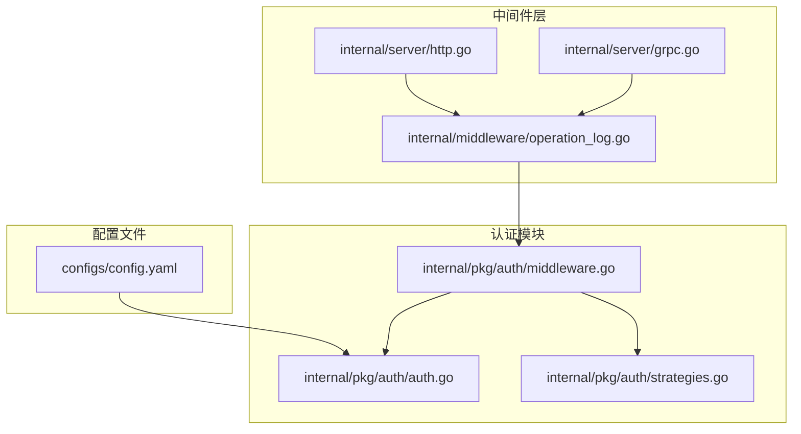
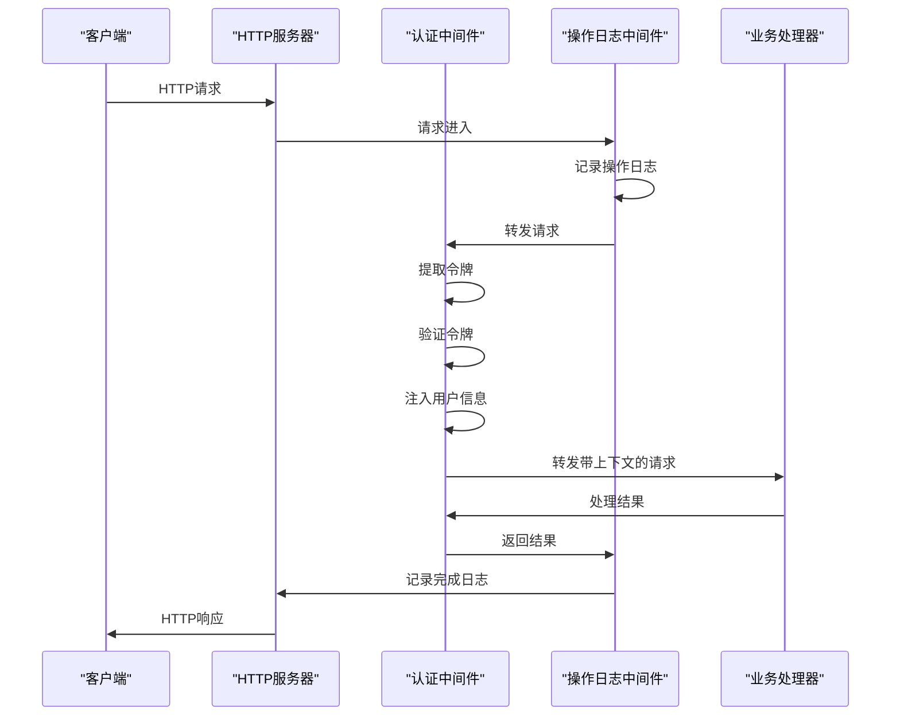
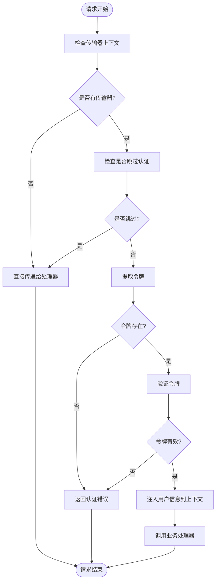
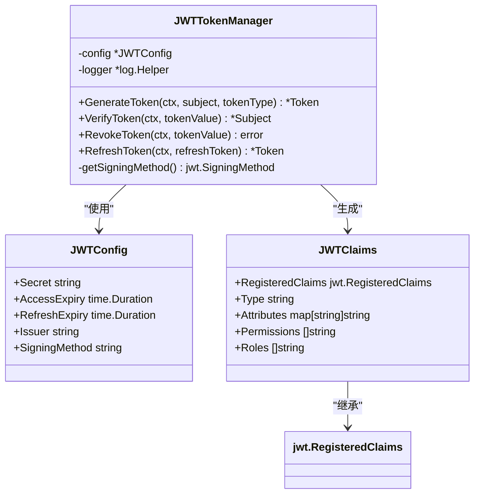
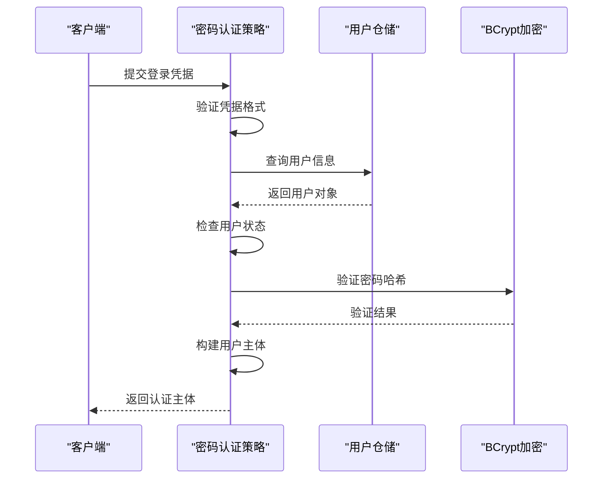
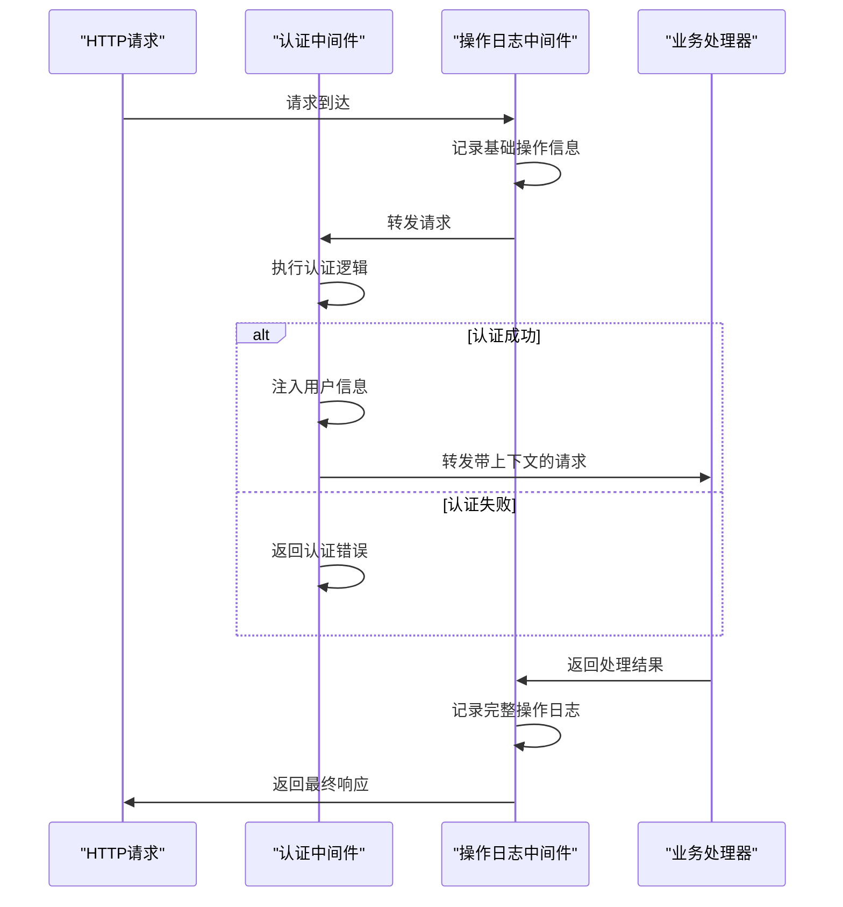
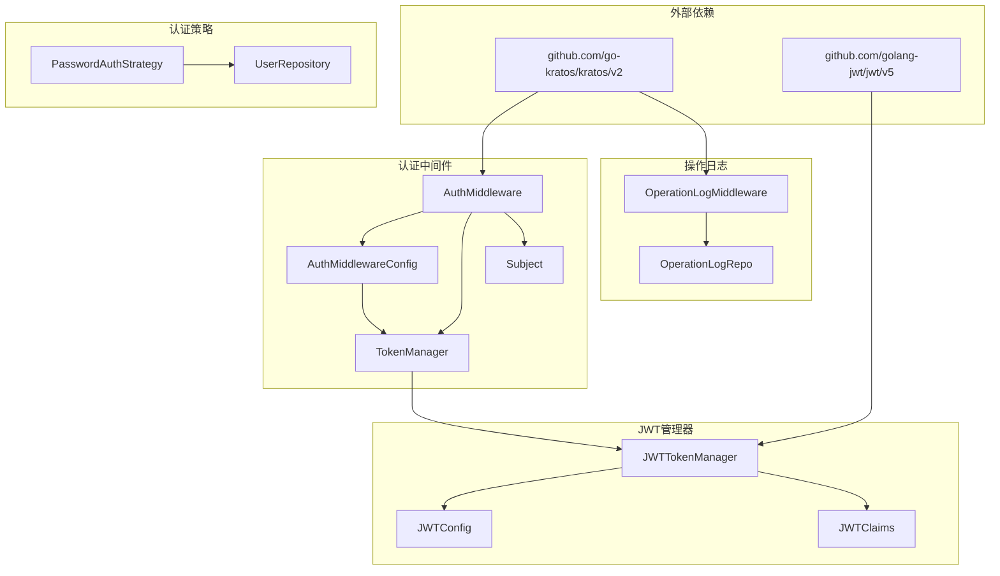

# 认证中间件

<cite>
**本文档中引用的文件**
- [middleware.go](file://internal/pkg/auth/middleware.go)
- [auth.go](file://internal/pkg/auth/auth.go)
- [strategies.go](file://internal/pkg/auth/strategies.go)
- [operation_log.go](file://internal/middleware/operation_log.go)
- [config.yaml](file://configs/config.yaml)
- [http.go](file://internal/server/http.go)
- [grpc.go](file://internal/server/grpc.go)
- [main.go](file://cmd/kratos-boilerplate/main.go)
</cite>

## 目录
1. [简介](#简介)
2. [项目结构](#项目结构)
3. [核心组件](#核心组件)
4. [架构概览](#架构概览)
5. [详细组件分析](#详细组件分析)
6. [依赖关系分析](#依赖关系分析)
7. [性能考虑](#性能考虑)
8. [故障排除指南](#故障排除指南)
9. [结论](#结论)

## 简介

认证中间件是Kratos Boilerplate项目中的核心安全组件，负责验证HTTP请求中的JWT令牌并将其解析为用户身份信息。该中间件提供了完整的认证流程，包括令牌提取、签名验证、用户身份解析和上下文注入等功能。同时，它还支持路径跳过规则配置，允许特定端点绕过认证检查，并与操作日志中间件协同工作，确保所有请求（包括未认证请求）都能被记录。

## 项目结构

认证中间件相关的文件主要分布在以下目录结构中：



**图表来源**
- [middleware.go](file://internal/pkg/auth/middleware.go#L1-L111)
- [auth.go](file://internal/pkg/auth/auth.go#L1-L303)
- [operation_log.go](file://internal/middleware/operation_log.go#L1-L38)

**章节来源**
- [middleware.go](file://internal/pkg/auth/middleware.go#L1-L111)
- [auth.go](file://internal/pkg/auth/auth.go#L1-L303)

## 核心组件

### 认证中间件配置结构

认证中间件通过`AuthMiddlewareConfig`结构体进行配置，支持以下关键参数：

- **TokenManager**: 令牌管理器接口，负责令牌的生成、验证和撤销
- **SkipPaths**: 跳过认证的路径列表，如登录和健康检查接口
- **HeaderName**: HTTP头部名称，默认为"Authorization"
- **TokenPrefix**: 令牌前缀，默认为"Bearer "
- **Logger**: 日志记录器，用于记录认证过程中的调试信息

### 令牌管理器接口

`TokenManager`接口定义了认证系统的核心功能：

```go
type TokenManager interface {
    GenerateToken(ctx context.Context, subject *Subject, tokenType TokenType) (*Token, error)
    VerifyToken(ctx context.Context, tokenValue string) (*Subject, error)
    RevokeToken(ctx context.Context, tokenValue string) error
    RefreshToken(ctx context.Context, refreshToken string) (*Token, error)
}
```

### 认证策略接口

`AuthStrategy`接口支持多种认证方式的扩展：

```go
type AuthStrategy interface {
    Authenticate(ctx context.Context, credentials interface{}) (*Subject, error)
    GetName() string
}
```

**章节来源**
- [middleware.go](file://internal/pkg/auth/middleware.go#L18-L30)
- [auth.go](file://internal/pkg/auth/auth.go#L32-L38)
- [strategies.go](file://internal/pkg/auth/strategies.go#L20-L25)

## 架构概览

认证中间件采用洋葱模型架构，作为HTTP和gRPC服务器的中间件层：



**图表来源**
- [middleware.go](file://internal/pkg/auth/middleware.go#L39-L84)
- [operation_log.go](file://internal/middleware/operation_log.go#L18-L32)

## 详细组件分析

### 认证中间件核心逻辑

认证中间件的核心执行流程如下：



**图表来源**
- [middleware.go](file://internal/pkg/auth/middleware.go#L39-L84)

#### 令牌提取机制

令牌提取函数支持从HTTP头部和Cookie中自动提取JWT令牌：

```go
func extractToken(tr transport.Transporter, config *AuthMiddlewareConfig) (string, error) {
    if header, ok := tr.(interface{ RequestHeader() transport.Header }); ok {
        auth := header.RequestHeader().Get(config.HeaderName)
        if auth != "" {
            if strings.HasPrefix(auth, config.TokenPrefix) {
                return strings.TrimPrefix(auth, config.TokenPrefix), nil
            }
            return auth, nil
        }
    }
    return "", fmt.Errorf("token not found")
}
```

#### 路径跳过规则

认证中间件支持配置跳过特定路径的认证检查：

```go
func shouldSkip(tr transport.Transporter, config *AuthMiddlewareConfig) bool {
    for _, skipPath := range config.SkipPaths {
        // 实际实现应该从transport中获取路径进行精确匹配
        // 当前简化实现仅返回false
        _ = skipPath
    }
    return false
}
```

### JWT令牌管理器

JWT令牌管理器实现了完整的令牌生命周期管理：



**图表来源**
- [auth.go](file://internal/pkg/auth/auth.go#L130-L180)
- [auth.go](file://internal/pkg/auth/auth.go#L60-L70)
- [auth.go](file://internal/pkg/auth/auth.go#L72-L80)

### 密码认证策略

密码认证策略实现了基于用户名和密码的传统认证方式：



**图表来源**
- [strategies.go](file://internal/pkg/auth/strategies.go#L40-L86)

**章节来源**
- [middleware.go](file://internal/pkg/auth/middleware.go#L86-L110)
- [auth.go](file://internal/pkg/auth/auth.go#L130-L220)
- [strategies.go](file://internal/pkg/auth/strategies.go#L40-L86)

### 操作日志中间件集成

认证中间件与操作日志中间件形成协作关系，确保所有请求都能被记录：



**图表来源**
- [operation_log.go](file://internal/middleware/operation_log.go#L18-L32)

**章节来源**
- [operation_log.go](file://internal/middleware/operation_log.go#L1-L38)

## 依赖关系分析

认证中间件的依赖关系图展示了各组件之间的交互：



**图表来源**
- [middleware.go](file://internal/pkg/auth/middleware.go#L1-L15)
- [auth.go](file://internal/pkg/auth/auth.go#L1-L15)

**章节来源**
- [middleware.go](file://internal/pkg/auth/middleware.go#L1-L15)
- [auth.go](file://internal/pkg/auth/auth.go#L1-L15)

## 性能考虑

认证中间件在设计时考虑了以下性能优化策略：

1. **令牌缓存**: JWT令牌验证可以通过内存缓存减少重复计算
2. **异步日志记录**: 操作日志记录采用异步方式，避免阻塞主流程
3. **路径匹配优化**: 跳过认证的路径使用高效的数据结构进行匹配
4. **错误快速返回**: 认证失败时立即返回错误，避免不必要的处理

## 故障排除指南

### 常见认证问题

1. **令牌缺失错误**
   - 检查HTTP头部是否正确设置
   - 验证令牌前缀配置是否正确
   - 确认客户端发送的令牌格式

2. **令牌验证失败**
   - 检查JWT密钥配置
   - 验证令牌签名算法设置
   - 确认令牌未过期

3. **路径跳过不生效**
   - 检查SkipPaths配置格式
   - 验证路径匹配逻辑
   - 确认中间件加载顺序

**章节来源**
- [middleware.go](file://internal/pkg/auth/middleware.go#L55-L65)
- [auth.go](file://internal/pkg/auth/auth.go#L180-L200)

## 结论

认证中间件为Kratos Boilerplate项目提供了完整的身份验证解决方案。它不仅支持标准的JWT令牌认证，还具备灵活的配置选项和良好的扩展性。通过与操作日志中间件的协作，确保了系统的可审计性和安全性。开发者可以通过实现自定义认证策略来扩展认证功能，满足不同场景的需求。

该中间件的设计遵循了中间件模式的最佳实践，具有清晰的职责分离、良好的错误处理和完善的日志记录机制，为构建安全可靠的企业级应用奠定了坚实的基础。