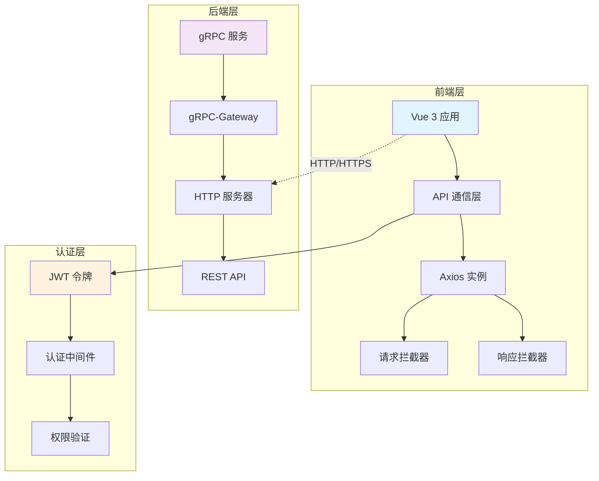
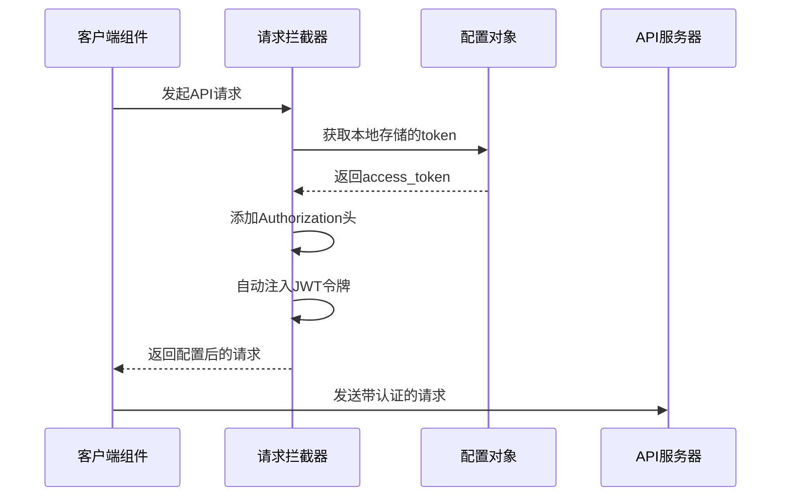
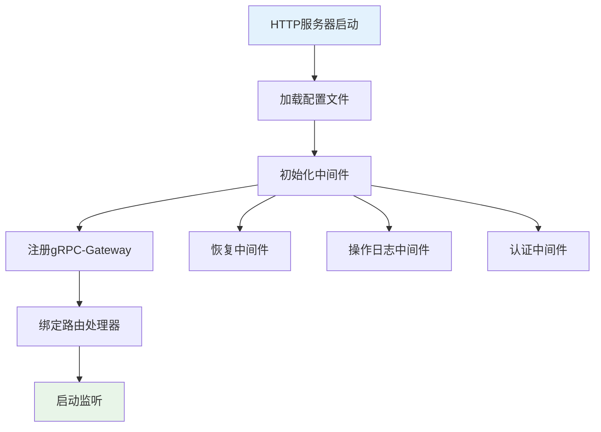
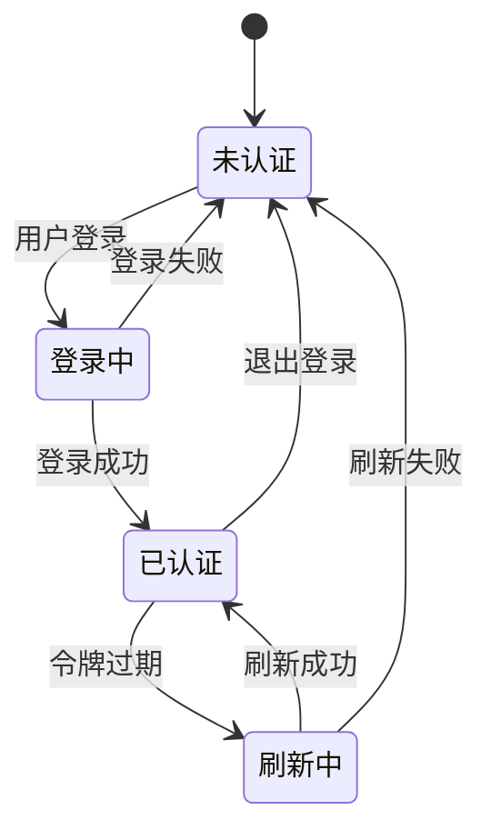
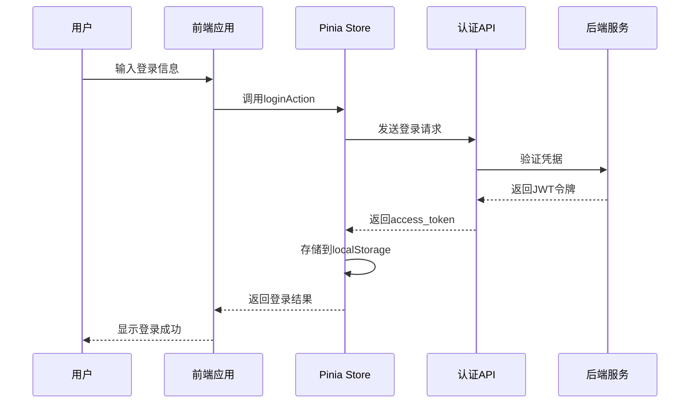
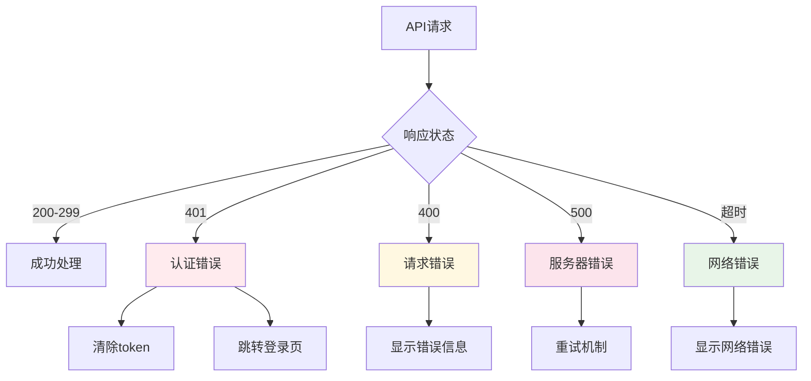

# API通信机制

<cite>
**本文档引用的文件**
- [frontend/src/api/request.ts](file://frontend/src/api/request.ts)
- [frontend/src/api/auth.ts](file://frontend/src/api/auth.ts)
- [frontend/src/types/api.d.ts](file://frontend/src/types/api.d.ts)
- [frontend/src/views/Login.vue](file://frontend/src/views/Login.vue)
- [frontend/src/stores/auth.ts](file://frontend/src/stores/auth.ts)
- [cmd/kratos-boilerplate/main.go](file://cmd/kratos-boilerplate/main.go)
- [internal/server/http.go](file://internal/server/http.go)
- [internal/server/grpc.go](file://internal/server/grpc.go)
- [api/helloworld/v1/greeter.proto](file://api/helloworld/v1/greeter.proto)
- [api/auth/v1/auth.proto](file://api/auth/v1/auth.proto)
</cite>

## 目录
1. [简介](#简介)
2. [项目架构概览](#项目架构概览)
3. [前端API通信层设计](#前端API通信层设计)
4. [后端gRPC-Gateway集成](#后端gRPC-Gateway集成)
5. [认证与授权机制](#认证与授权机制)
6. [类型安全实践](#类型安全实践)
7. [错误处理与重试机制](#错误处理与重试机制)
8. [性能优化策略](#性能优化策略)
9. [调试与监控工具](#调试与监控工具)
10. [故障排除指南](#故障排除指南)
11. [总结](#总结)

## 简介

本项目采用现代化的前后端分离架构，通过gRPC-Gateway实现gRPC服务的HTTP REST API暴露，为前端提供统一的API通信机制。系统的核心特点包括：

- **统一的API通信层**：基于Axios构建的请求封装，提供一致的API调用体验
- **完整的认证体系**：支持JWT令牌管理、验证码验证、双因子认证等功能
- **类型安全保障**：通过TypeScript确保API调用的类型安全
- **优雅的错误处理**：统一的错误响应格式和自动化的错误处理机制
- **灵活的配置管理**：支持环境变量配置和动态API基础路径设置

## 项目架构概览



**图表来源**
- [frontend/src/api/request.ts](file://frontend/src/api/request.ts#L1-L29)
- [internal/server/http.go](file://internal/server/http.go#L1-L37)
- [internal/server/grpc.go](file://internal/server/grpc.go#L1-L35)

**章节来源**
- [cmd/kratos-boilerplate/main.go](file://cmd/kratos-boilerplate/main.go#L1-L92)
- [internal/server/http.go](file://internal/server/http.go#L1-L37)
- [internal/server/grpc.go](file://internal/server/grpc.go#L1-L35)

## 前端API通信层设计

### Axios实例封装

前端API通信层的核心是基于Axios的封装，提供了统一的请求配置和拦截器机制。

```typescript
// 基础配置
const request = axios.create({
    baseURL: import.meta.env.VITE_API_BASE_URL || '/api',
    timeout: 5000
})
```

### 请求拦截器机制



**图表来源**
- [frontend/src/api/auth.ts](file://frontend/src/api/auth.ts#L15-L25)

### 响应拦截器处理

响应拦截器负责统一处理API响应，包括成功数据提取和错误处理：

```typescript
// 成功响应处理
request.interceptors.response.use(
    (response) => {
        return response.data
    },
    (error) => {
        return Promise.reject(error)
    }
)
```

**章节来源**
- [frontend/src/api/request.ts](file://frontend/src/api/request.ts#L1-L29)
- [frontend/src/api/auth.ts](file://frontend/src/api/auth.ts#L1-L99)

## 后端gRPC-Gateway集成

### gRPC服务定义

后端采用Protocol Buffers定义服务接口，通过gRPC-Gateway自动生成REST API。

```protobuf
// 认证服务定义
service Auth {
  rpc Login(LoginRequest) returns (LoginReply) {
    option (google.api.http) = {
      post: "/api/v1/auth/login"
      body: "*"
    };
  }
}
```

### HTTP服务器配置



**图表来源**
- [internal/server/http.go](file://internal/server/http.go#L15-L30)
- [internal/server/grpc.go](file://internal/server/grpc.go#L15-L25)

### 服务注册流程

后端服务通过依赖注入的方式注册各个服务处理器：

```go
srv := http.NewServer(opts...)
v1.RegisterGreeterHTTPServer(srv, greeter)
authv1.RegisterAuthHTTPServer(srv, auth)
```

**章节来源**
- [api/auth/v1/auth.proto](file://api/auth/v1/auth.proto#L1-L235)
- [internal/server/http.go](file://internal/server/http.go#L1-L37)
- [internal/server/grpc.go](file://internal/server/grpc.go#L1-L35)

## 认证与授权机制

### JWT令牌管理

系统采用JWT（JSON Web Token）作为主要的认证机制，支持访问令牌和刷新令牌的双重管理。



**图表来源**
- [frontend/src/stores/auth.ts](file://frontend/src/stores/auth.ts#L15-L50)

### 认证流程详解



**图表来源**
- [frontend/src/stores/auth.ts](file://frontend/src/stores/auth.ts#L15-L35)
- [frontend/src/api/auth.ts](file://frontend/src/api/auth.ts#L55-L75)

### 验证码系统

系统支持多种类型的验证码验证，包括图片验证码、短信验证码和邮件验证码。

```typescript
// 获取验证码
export const getCaptcha = (type: string, target?: string) => {
    return request.get<ApiResponse<CaptchaResponse>>('/v1/auth/captcha', {
        params: {
            captcha_type: type,
            target,
        },
    });
};
```

**章节来源**
- [frontend/src/api/auth.ts](file://frontend/src/api/auth.ts#L35-L50)
- [frontend/src/stores/auth.ts](file://frontend/src/stores/auth.ts#L1-L99)

## 类型安全实践

### TypeScript接口定义

系统通过TypeScript确保API调用的类型安全，所有接口响应都经过严格的类型定义。

```typescript
// 通用响应接口
export interface ApiResponse<T> {
    code: number;
    message: string;
    data: T;
}

// 登录响应接口
export interface LoginResponse {
    access_token: string;
    refresh_token: string;
    expires_in: number;
}
```

### 类型断言使用

在实际的API调用中，通过泛型参数确保返回数据的类型安全：

```typescript
// 类型断言示例
const response = await login({
    username: 'test',
    password: 'password'
}) as ApiResponse<LoginResponse>;
```

**章节来源**
- [frontend/src/types/api.d.ts](file://frontend/src/types/api.d.ts#L1-L32)

## 错误处理与重试机制

### 自动错误处理

响应拦截器实现了自动的错误处理逻辑，特别是针对401未授权状态的处理：

```typescript
request.interceptors.response.use(
    (response) => {
        return response.data;
    },
    (error) => {
        if (error.response?.status === 401) {
            // 处理token过期
            localStorage.removeItem('access_token');
            localStorage.removeItem('refresh_token');
            window.location.href = '/login';
        }
        return Promise.reject(error);
    }
);
```

### 错误分类处理



**章节来源**
- [frontend/src/api/auth.ts](file://frontend/src/api/auth.ts#L25-L40)

## 性能优化策略

### 请求超时配置

系统设置了合理的请求超时时间，平衡用户体验和服务器负载：

```typescript
const request = axios.create({
    baseURL: import.meta.env.VITE_API_BASE_URL || '/api',
    timeout: 5000 // 5秒超时
})
```

### 并发请求控制

通过Pinia状态管理实现请求的幂等性和并发控制，避免重复请求：

```typescript
// 防止重复登录
const loginAction = async (data: LoginParams) => {
    if (isAuthenticated.value) return;
    // 执行登录逻辑
};
```

### 缓存策略

对于非敏感数据，可以在前端实现适当的缓存机制，减少不必要的API调用。

## 调试与监控工具

### 浏览器开发者工具

推荐使用浏览器的Network面板监控API请求：

1. **请求详情**：查看请求URL、方法、头部和参数
2. **响应分析**：检查响应状态、数据格式和错误信息
3. **性能分析**：监控请求耗时和网络状况

### Mock服务器

开发阶段可以使用Mock服务器模拟API响应：

```javascript
// Mock API示例
app.post('/api/v1/auth/login', (req, res) => {
    const { username, password } = req.body;
    // 模拟登录验证
    res.json({
        code: 0,
        message: 'success',
        data: {
            access_token: 'mock_token',
            refresh_token: 'mock_refresh_token',
            expires_in: 3600
        }
    });
});
```

### 日志监控

后端服务集成了完善的日志记录和监控机制：

```go
logger := log.With(log.NewStdLogger(os.Stdout),
    "ts", log.DefaultTimestamp,
    "caller", log.DefaultCaller,
    "service.id", id,
    "service.name", Name,
    "service.version", Version,
)
```

**章节来源**
- [cmd/kratos-boilerplate/main.go](file://cmd/kratos-boilerplate/main.go#L35-L45)

## 故障排除指南

### 常见问题及解决方案

#### 1. 跨域问题

**症状**：浏览器控制台出现CORS错误
**原因**：前端和后端部署在不同域名或端口
**解决方案**：
- 配置正确的CORS头
- 使用代理服务器
- 设置正确的API基础路径

#### 2. 认证失败

**症状**：401未授权错误频繁出现
**原因**：
- JWT令牌过期
- 令牌格式不正确
- 后端认证服务异常

**解决方案**：
```typescript
// 自动刷新令牌
const refreshTokenAction = async () => {
    if (!refreshTokenValue.value) {
        throw new Error('No refresh token available');
    }
    // 执行令牌刷新逻辑
};
```

#### 3. 网络超时

**症状**：API请求长时间无响应
**原因**：
- 网络连接不稳定
- 服务器负载过高
- 请求参数过大

**解决方案**：
- 增加超时时间配置
- 实现请求重试机制
- 优化请求参数大小

#### 4. 类型错误

**症状**：TypeScript编译错误
**原因**：API响应结构与类型定义不匹配
**解决方案**：
- 更新类型定义
- 检查API版本兼容性
- 使用类型断言

### 调试技巧

1. **启用详细日志**：在开发环境中开启详细的请求日志
2. **使用断点调试**：在关键API调用处设置断点
3. **模拟环境**：使用测试环境验证API行为
4. **监控指标**：关注API响应时间和成功率

**章节来源**
- [frontend/src/api/auth.ts](file://frontend/src/api/auth.ts#L25-L40)
- [frontend/src/stores/auth.ts](file://frontend/src/stores/auth.ts#L50-L70)

## 总结

本项目建立了一套完整、安全、高效的API通信机制，具有以下核心优势：

1. **统一的通信层**：基于Axios的封装提供了简洁一致的API调用方式
2. **强大的类型安全**：TypeScript确保了API调用的类型安全和开发效率
3. **完善的认证体系**：支持JWT令牌管理、多因素认证和自动刷新机制
4. **优雅的错误处理**：自动化的错误处理和用户友好的错误提示
5. **灵活的配置管理**：支持环境变量和动态配置调整
6. **良好的扩展性**：模块化的设计便于功能扩展和维护

这套API通信机制不仅满足了当前业务需求，也为未来的功能扩展奠定了坚实的基础。通过合理的架构设计和最佳实践的应用，系统具备了高可用性、高性能和易维护性的特点。