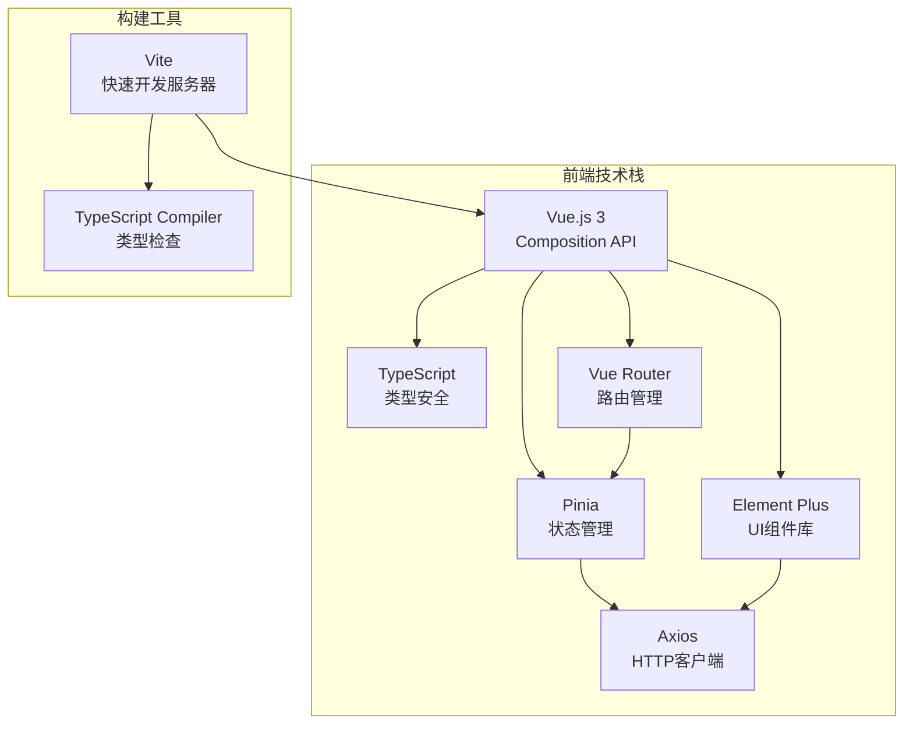
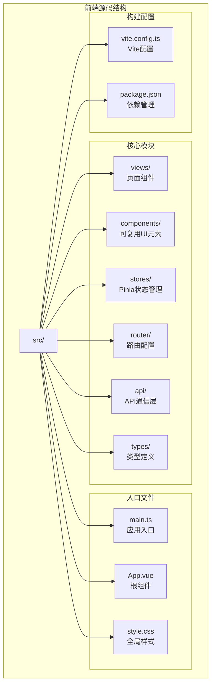
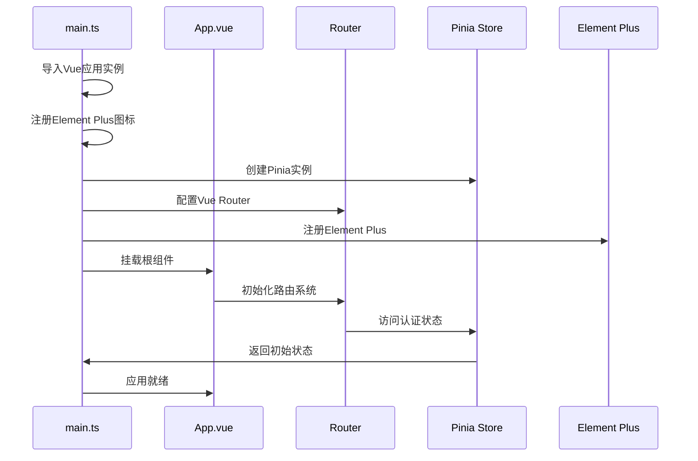
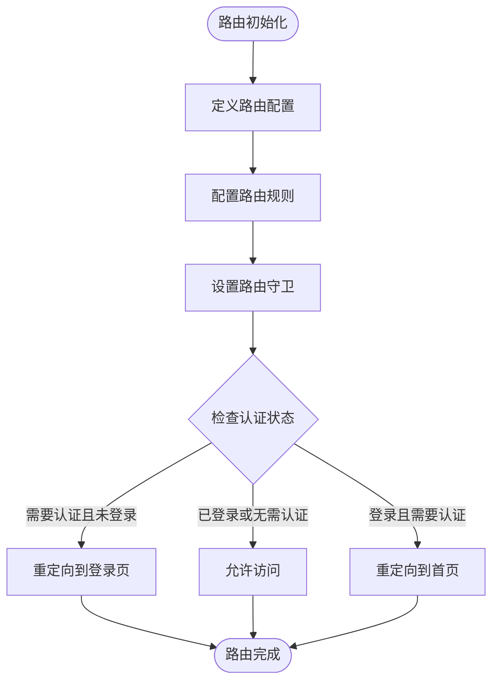
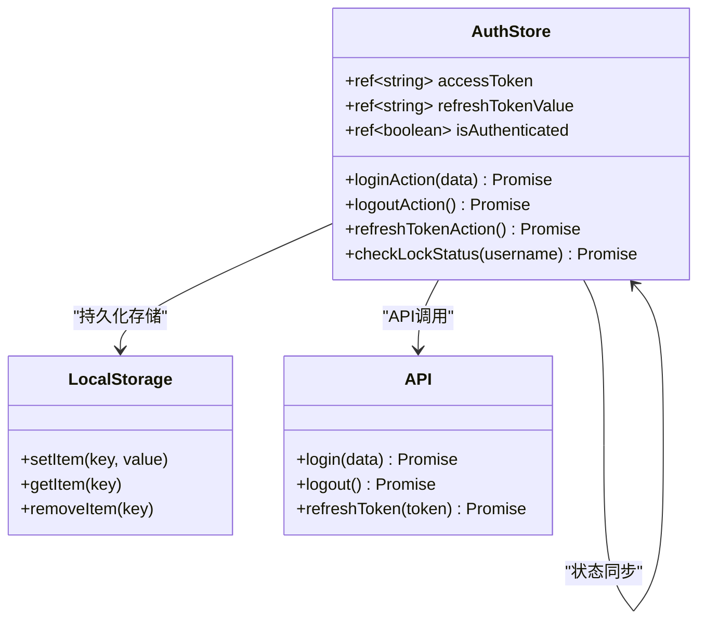
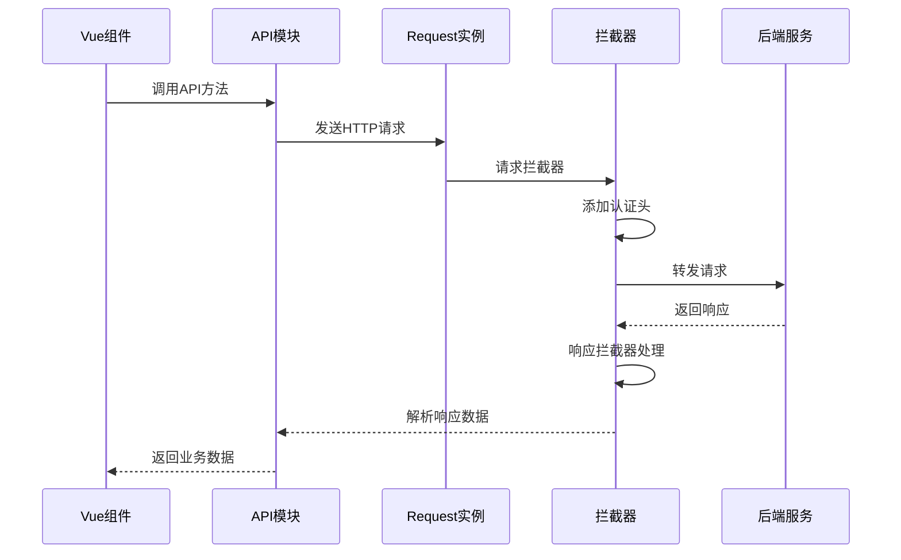
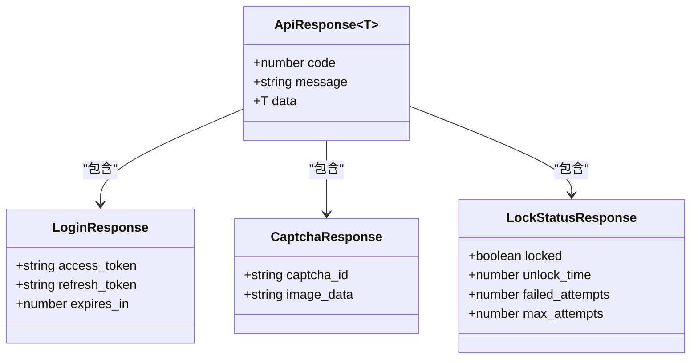
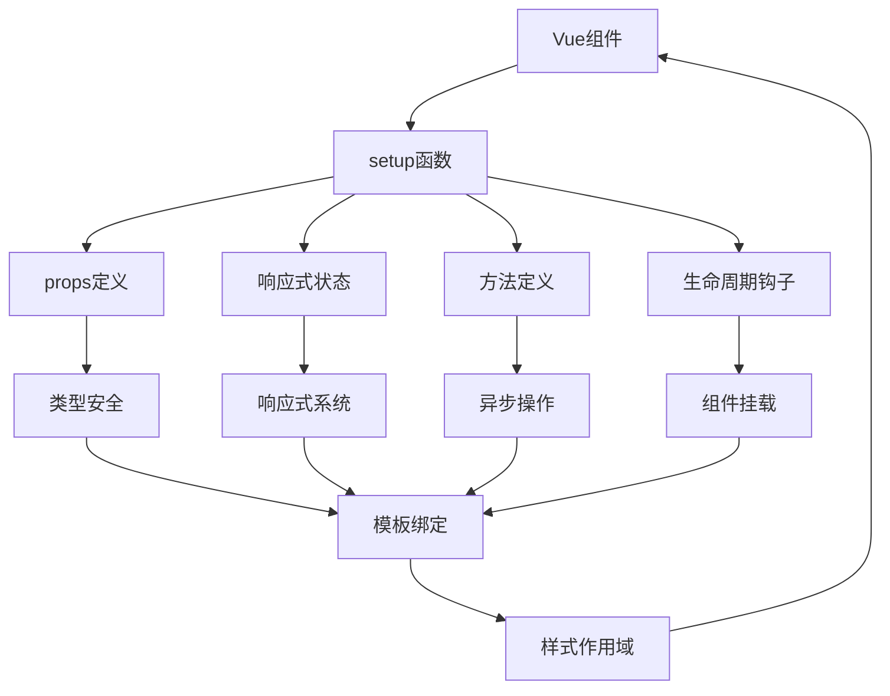
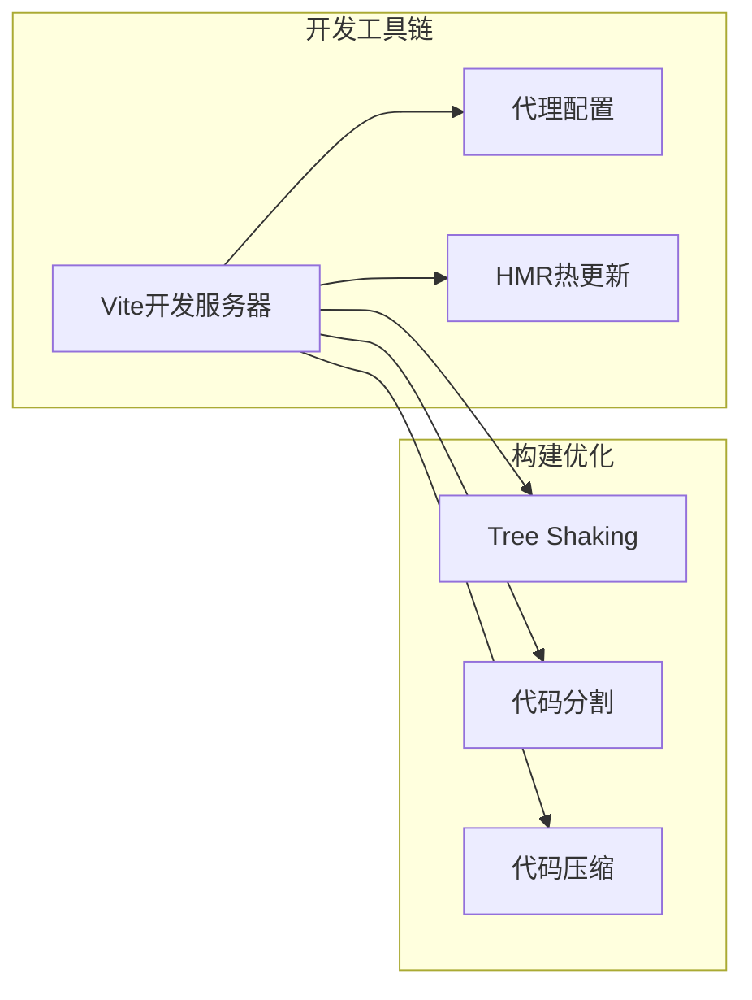

# 前端架构设计文档

<cite>
**本文档引用的文件**
- [main.ts](file://frontend/src/main.ts)
- [router/index.ts](file://frontend/src/router/index.ts)
- [stores/auth.ts](file://frontend/src/stores/auth.ts)
- [api/request.ts](file://frontend/src/api/request.ts)
- [api/auth.ts](file://frontend/src/api/auth.ts)
- [types/api.d.ts](file://frontend/src/types/api.d.ts)
- [views/Home.vue](file://frontend/src/views/Home.vue)
- [components/HelloWorld.vue](file://frontend/src/components/HelloWorld.vue)
- [App.vue](file://frontend/src/App.vue)
- [package.json](file://frontend/package.json)
- [vite.config.ts](file://frontend/vite.config.ts)
</cite>

## 目录
1. [项目概述](#项目概述)
2. [技术栈架构](#技术栈架构)
3. [项目结构分析](#项目结构分析)
4. [应用初始化流程](#应用初始化流程)
5. [路由系统设计](#路由系统设计)
6. [状态管理架构](#状态管理架构)
7. [API通信机制](#api通信机制)
8. [类型安全实践](#类型安全实践)
9. [组件开发模式](#组件开发模式)
10. [最佳实践与调试技巧](#最佳实践与调试技巧)
11. [总结](#总结)

## 项目概述

本前端项目是一个基于Vue.js 3和TypeScript构建的企业级单页应用(SPA)，采用现代化的前端开发技术栈。项目遵循模块化设计理念，将功能按职责划分为不同的目录结构，实现了清晰的代码组织和高效的开发流程。

项目的核心特性包括：
- 基于Vue 3 Composition API的现代化组件开发
- TypeScript强类型支持确保代码质量和维护性
- Pinia状态管理提供响应式状态控制
- Element Plus UI组件库提升开发效率
- Axios封装实现统一的API通信机制
- 完整的认证流程支持JWT令牌管理和刷新

## 技术栈架构

**图表来源**
- [package.json](file://frontend/package.json#L10-L18)
- [main.ts](file://frontend/src/main.ts#L1-L21)

**章节来源**
- [package.json](file://frontend/package.json#L1-L28)
- [main.ts](file://frontend/src/main.ts#L1-L21)

## 项目结构分析

前端项目的目录结构体现了清晰的分层架构设计，每个目录都有明确的职责分工：

**图表来源**
- [main.ts](file://frontend/src/main.ts#L1-L21)
- [App.vue](file://frontend/src/App.vue#L1-L28)

### 目录职责详解

- **views/**: 存放页面级别的组件，每个Vue文件对应一个完整的页面视图
- **components/**: 包含可复用的UI组件，遵循单一职责原则
- **stores/**: 使用Pinia实现的状态管理模块，集中管理应用状态
- **router/**: 路由配置文件，定义应用的导航结构和权限控制
- **api/**: 封装API通信逻辑，提供统一的接口调用方式
- **types/**: TypeScript类型定义文件，确保类型安全
- **main.ts**: 应用程序的启动入口，负责初始化和配置

**章节来源**
- [main.ts](file://frontend/src/main.ts#L1-L21)
- [App.vue](file://frontend/src/App.vue#L1-L28)

## 应用初始化流程

应用的初始化过程体现了现代前端框架的最佳实践，通过精心设计的启动序列确保应用的稳定性和性能：

**图表来源**
- [main.ts](file://frontend/src/main.ts#L1-L21)

### 初始化步骤详解

1. **应用实例创建**: 使用`createApp(App)`创建Vue应用实例
2. **插件注册**: 
   - 注册Element Plus UI组件库
   - 注册@element-plus/icons-vue图标库
   - 配置Vue Router路由系统
   - 启用Pinia状态管理
3. **全局配置**: 设置应用的全局行为和默认配置
4. **组件挂载**: 将应用挂载到DOM中的`#app`元素

**章节来源**
- [main.ts](file://frontend/src/main.ts#L1-L21)

## 路由系统设计

路由系统采用Vue Router 4实现，支持动态路由加载和权限控制，为应用提供了灵活的导航机制：

**图表来源**
- [router/index.ts](file://frontend/src/router/index.ts#L1-L42)

### 路由配置特点

- **懒加载**: 使用动态导入实现路由组件的懒加载，优化首屏加载性能
- **元信息**: 通过`meta.requiresAuth`字段标识路由是否需要认证
- **权限控制**: 实现了完善的路由守卫机制，确保安全访问控制
- **历史模式**: 使用HTML5 History模式，提供干净的URL结构

**章节来源**
- [router/index.ts](file://frontend/src/router/index.ts#L1-L42)

## 状态管理架构

Pinia作为状态管理解决方案，提供了TypeScript友好的API和直观的状态管理模式：

**图表来源**
- [stores/auth.ts](file://frontend/src/stores/auth.ts#L1-L99)

### 状态管理特性

- **响应式状态**: 使用Vue 3的响应式系统，自动追踪状态变化
- **持久化存储**: 自动将认证状态保存到localStorage
- **异步操作**: 支持异步的登录、登出和token刷新操作
- **错误处理**: 完善的错误处理机制，确保状态一致性

**章节来源**
- [stores/auth.ts](file://frontend/src/stores/auth.ts#L1-L99)

## API通信机制

API通信层采用了分层设计，通过Axios封装实现了统一的请求处理和响应解析：

**图表来源**
- [api/auth.ts](file://frontend/src/api/auth.ts#L1-L99)
- [api/request.ts](file://frontend/src/api/request.ts#L1-L29)

### API设计原则

- **统一认证**: 自动在请求头中添加JWT令牌
- **错误处理**: 统一处理401未授权错误，自动清理无效token
- **环境适配**: 支持不同环境的API基础URL配置
- **类型安全**: 通过TypeScript确保请求和响应的数据类型

**章节来源**
- [api/auth.ts](file://frontend/src/api/auth.ts#L1-L99)
- [api/request.ts](file://frontend/src/api/request.ts#L1-L29)

## 类型安全实践

项目全面采用TypeScript，通过严格的类型定义确保代码质量和开发体验：

**图表来源**
- [types/api.d.ts](file://frontend/src/types/api.d.ts#L1-L32)

### 类型系统优势

- **编译时检查**: 在开发阶段捕获类型错误
- **智能提示**: 提供准确的IDE代码补全和提示
- **文档化**: 类型定义本身就是代码的文档
- **重构安全**: 类型系统确保重构过程的安全性

**章节来源**
- [types/api.d.ts](file://frontend/src/types/api.d.ts#L1-L32)

## 组件开发模式

项目采用Vue 3的Composition API和TypeScript结合的方式，实现了现代化的组件开发模式：

**图表来源**
- [views/Home.vue](file://frontend/src/views/Home.vue#L1-L85)
- [components/HelloWorld.vue](file://frontend/src/components/HelloWorld.vue#L1-L42)

### 组件开发规范

- **Composition API**: 使用setup语法糖和ref/reactive API
- **类型注解**: 为props、data和方法提供完整的类型定义
- **组合函数**: 提取可复用的逻辑到组合函数中
- **样式作用域**: 使用scoped样式避免样式污染

**章节来源**
- [views/Home.vue](file://frontend/src/views/Home.vue#L1-L85)
- [components/HelloWorld.vue](file://frontend/src/components/HelloWorld.vue#L1-L42)

## 最佳实践与调试技巧

### 开发环境配置

项目使用Vite作为构建工具，提供了快速的开发体验和热更新功能：

**图表来源**
- [vite.config.ts](file://frontend/vite.config.ts#L1-L22)

### 调试技巧

1. **Vue DevTools**: 使用官方浏览器扩展调试Vue应用
2. **TypeScript检查**: 利用IDE的类型检查功能发现潜在问题
3. **网络面板**: 使用浏览器开发者工具监控API请求
4. **状态检查**: 通过Pinia DevTools查看状态变化

### 性能优化建议

- **懒加载**: 对非关键组件使用动态导入
- **代码分割**: 利用Vite的自动代码分割功能
- **缓存策略**: 合理使用浏览器缓存和CDN
- **资源优化**: 压缩图片和静态资源

**章节来源**
- [vite.config.ts](file://frontend/vite.config.ts#L1-L22)

## 总结

本前端项目展现了现代Vue.js应用的最佳实践，通过合理的架构设计和严格的技术规范，实现了高质量、可维护的前端代码。项目的主要优势包括：

1. **清晰的架构**: 模块化的目录结构和职责分离
2. **类型安全**: 全面的TypeScript支持确保代码质量
3. **开发效率**: 现代化的工具链和开发体验
4. **可维护性**: 标准化的开发模式和最佳实践
5. **扩展性**: 灵活的架构设计支持功能扩展

通过遵循这些设计原则和实践，项目能够适应不断变化的需求，同时保持代码的整洁和可读性。这种架构设计不仅适用于当前项目，也为未来的功能扩展和团队协作奠定了坚实的基础。