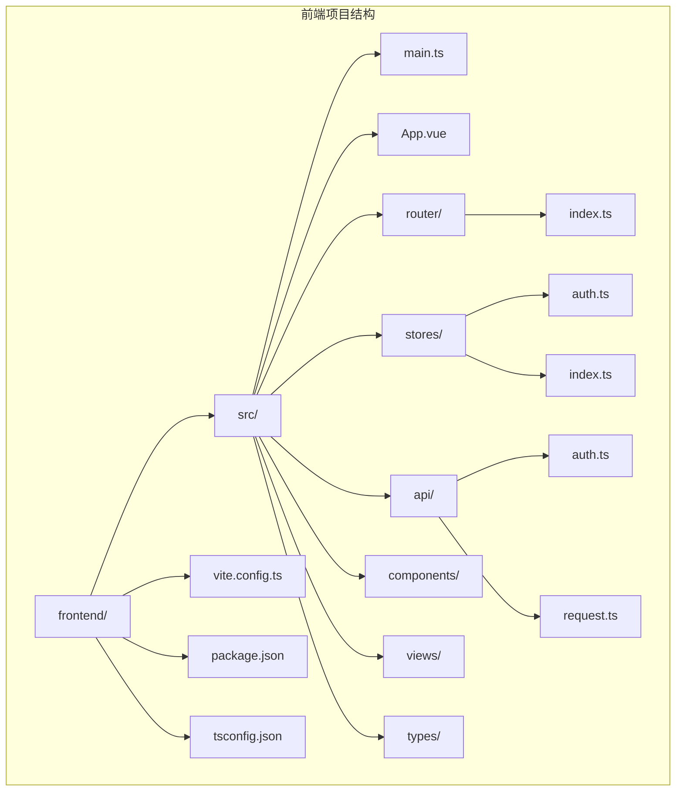
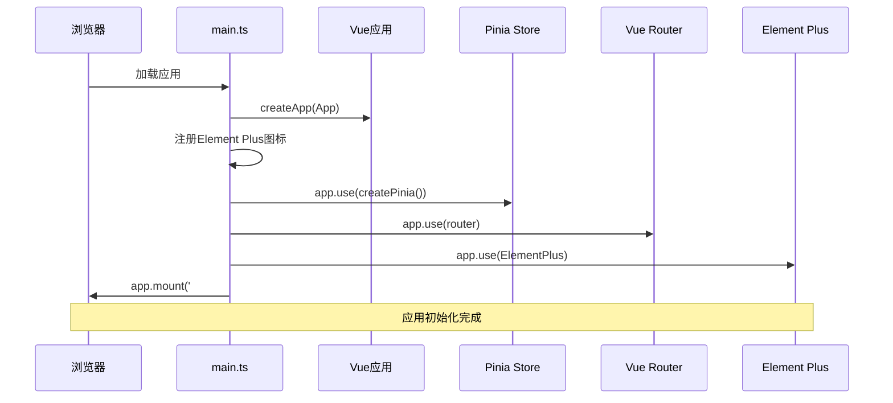
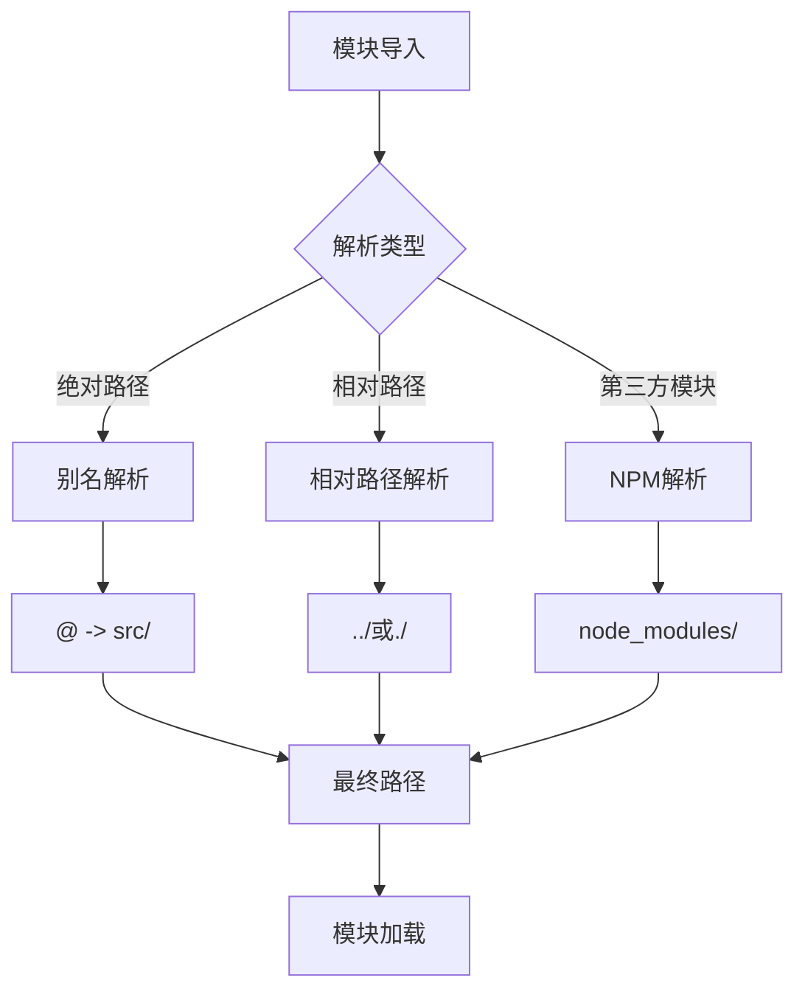
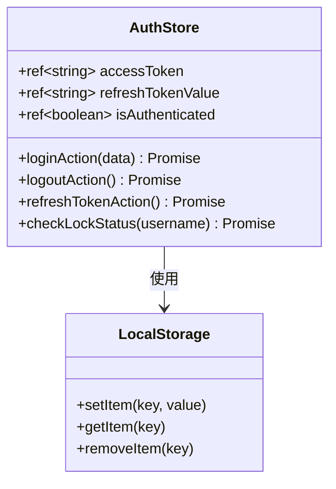
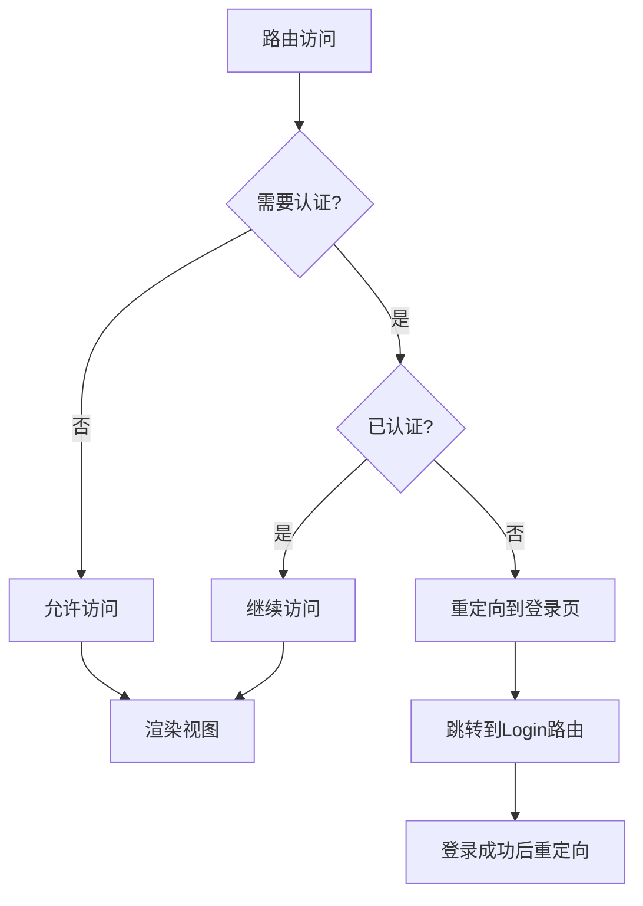
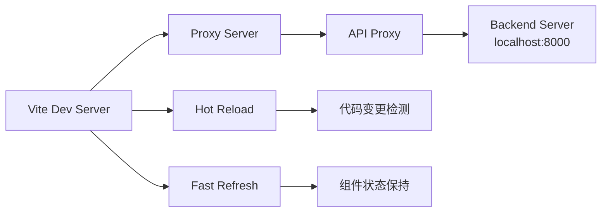
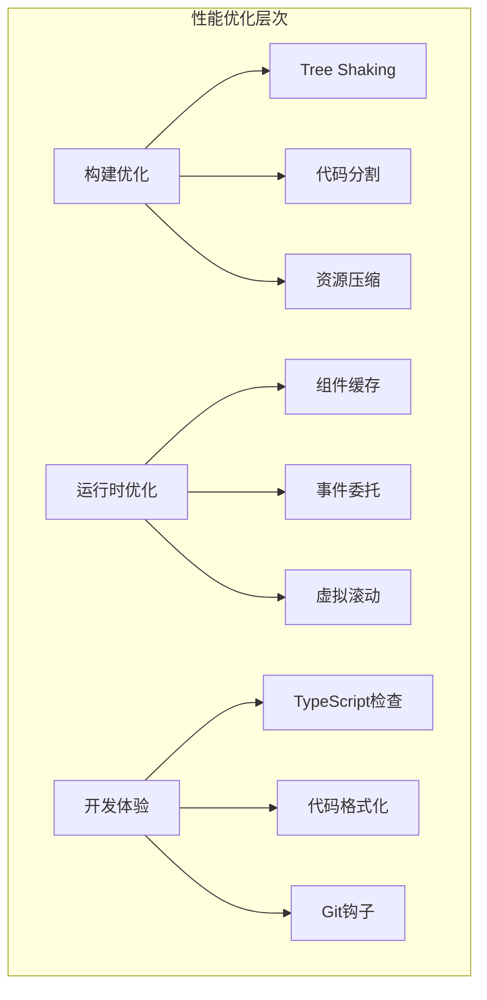

# 前端框架集成方案

<cite>
**本文档引用的文件**
- [main.ts](file://frontend/src/main.ts)
- [vite.config.ts](file://frontend/vite.config.ts)
- [package.json](file://frontend/package.json)
- [vite-env.d.ts](file://frontend/src/vite-env.d.ts)
- [tsconfig.json](file://frontend/tsconfig.json)
- [router/index.ts](file://frontend/src/router/index.ts)
- [stores/auth.ts](file://frontend/src/stores/auth.ts)
- [api/request.ts](file://frontend/api/request.ts)
- [App.vue](file://frontend/src/App.vue)
</cite>

## 目录
1. [项目概述](#项目概述)
2. [项目结构分析](#项目结构分析)
3. [核心配置文件详解](#核心配置文件详解)
4. [应用初始化流程](#应用初始化流程)
5. [依赖管理与模块解析](#依赖管理与模块解析)
6. [状态管理与路由配置](#状态管理与路由配置)
7. [TypeScript配置优化](#typescript配置优化)
8. [开发服务器与代理配置](#开发服务器与代理配置)
9. [常见问题排查指南](#常见问题排查指南)
10. [性能优化建议](#性能优化建议)

## 项目概述

本项目是一个基于Vue.js 3与Vite构建的现代化前端框架集成方案，采用了TypeScript作为主要编程语言，集成了Element Plus组件库、Pinia状态管理和Vue Router路由系统。该框架为Kratos微服务架构提供了完整的前端解决方案，具备热重载开发、模块化构建和完善的TypeScript支持。

## 项目结构分析



**图表来源**
- [main.ts](file://frontend/src/main.ts#L1-L21)
- [vite.config.ts](file://frontend/vite.config.ts#L1-L22)

**章节来源**
- [package.json](file://frontend/package.json#L1-L28)
- [tsconfig.json](file://frontend/tsconfig.json#L1-L43)

## 核心配置文件详解

### Vite配置文件分析

Vite配置文件是整个前端框架的核心配置中心，负责处理开发服务器、构建优化和模块解析等关键功能：

```typescript
// 别名配置：@指向src目录，简化模块导入路径
alias: {
  '@': resolve(__dirname, 'src'),
}

// 开发服务器代理配置
proxy: {
  '/api': {
    target: 'http://localhost:8000',
    changeOrigin: true,
  },
}
```

**章节来源**
- [vite.config.ts](file://frontend/vite.config.ts#L1-L22)

### TypeScript配置优化

TypeScript配置文件针对现代前端开发进行了深度优化：

```json
{
  "compilerOptions": {
    "target": "ES2020",
    "module": "ESNext",
    "moduleResolution": "bundler",
    "baseUrl": ".",
    "paths": {
      "@/*": ["src/*"]
    }
  }
}
```

这种配置提供了：
- **模块解析优化**：使用bundler模式提升构建性能
- **路径别名支持**：通过@符号快速访问src目录
- **严格类型检查**：启用noUnusedLocals、noUnusedParameters等严格选项

**章节来源**
- [tsconfig.json](file://frontend/tsconfig.json#L1-L43)

## 应用初始化流程

### 主应用入口点



**图表来源**
- [main.ts](file://frontend/src/main.ts#L1-L21)

应用初始化过程包含以下关键步骤：

1. **应用实例创建**：使用`createApp(App)`创建Vue应用实例
2. **图标注册**：通过循环注册Element Plus的所有图标组件
3. **插件集成**：依次注册Pinia状态管理、Vue Router路由系统和Element Plus UI库
4. **DOM挂载**：将应用挂载到id为'app'的DOM元素上

**章节来源**
- [main.ts](file://frontend/src/main.ts#L1-L21)

## 依赖管理与模块解析

### 包依赖分析

项目采用现代化的包管理策略，核心依赖包括：

```json
{
  "dependencies": {
    "vue": "^3.5.13",
    "vue-router": "^4.5.0",
    "pinia": "^3.0.1",
    "element-plus": "^2.9.7",
    "axios": "^1.8.4",
    "@element-plus/icons-vue": "^2.3.1"
  }
}
```

这些依赖的选择体现了现代前端开发的最佳实践：
- **Vue 3.5+**：提供Composition API和更好的TypeScript支持
- **Vue Router 4.5+**：支持路由懒加载和导航守卫
- **Pinia 3.0+**：新一代状态管理库，更好的TypeScript支持
- **Element Plus**：完整的Vue 3组件库
- **Axios**：HTTP客户端库，支持请求拦截器

**章节来源**
- [package.json](file://frontend/package.json#L1-L28)

### 模块解析机制

通过Vite和TypeScript的联合配置，实现了高效的模块解析：



**图表来源**
- [tsconfig.json](file://frontend/tsconfig.json#L25-L30)
- [vite.config.ts](file://frontend/vite.config.ts#L8-L11)

## 状态管理与路由配置

### Pinia状态管理

项目使用Pinia作为状态管理解决方案，提供了类型安全的状态管理：



**图表来源**
- [stores/auth.ts](file://frontend/src/stores/auth.ts#L1-L99)

AuthStore实现了完整的认证状态管理：
- **Token管理**：自动存储和刷新访问令牌
- **状态持久化**：使用localStorage保持用户会话
- **异步操作**：封装API调用，提供Promise接口
- **类型安全**：完整的TypeScript类型定义

**章节来源**
- [stores/auth.ts](file://frontend/src/stores/auth.ts#L1-L99)

### Vue Router配置

路由系统支持懒加载和导航守卫：



**图表来源**
- [router/index.ts](file://frontend/src/router/index.ts#L25-L35)

路由守卫逻辑确保：
- 受保护页面只能被认证用户访问
- 已登录用户不能访问登录页面
- 提供流畅的用户体验

**章节来源**
- [router/index.ts](file://frontend/src/router/index.ts#L1-L42)

## TypeScript配置优化

### 编译器选项详解

TypeScript配置针对现代前端开发进行了全面优化：

```json
{
  "compilerOptions": {
    "target": "ES2020",
    "module": "ESNext",
    "moduleResolution": "bundler",
    "allowImportingTsExtensions": true,
    "resolveJsonModule": true,
    "isolatedModules": true,
    "jsx": "preserve"
  }
}
```

这些配置的优势：
- **ES2020目标**：支持现代JavaScript特性
- **ESNext模块**：利用最新的模块系统
- **Bundler模式**：与Vite构建工具完美配合
- **JSON模块解析**：直接导入JSON文件
- **JSX保留**：保持Vue单文件组件的语法

**章节来源**
- [tsconfig.json](file://frontend/tsconfig.json#L1-L43)

### 类型声明文件

项目包含了必要的类型声明文件：

```typescript
/// <reference types="vite/client" />
```

这提供了：
- **Vite环境变量类型**：支持import.meta.env的类型检查
- **模块解析类型**：识别各种文件类型的导入
- **开发工具支持**：IDE智能提示和错误检查

**章节来源**
- [vite-env.d.ts](file://frontend/src/vite-env.d.ts#L1-L2)

## 开发服务器与代理配置

### Vite开发服务器

Vite开发服务器提供了快速的热重载和模块热替换功能：



**图表来源**
- [vite.config.ts](file://frontend/vite.config.ts#L12-L19)

### 代理配置详解

代理配置解决了前后端分离开发中的跨域问题：

```typescript
proxy: {
  '/api': {
    target: 'http://localhost:8000',
    changeOrigin: true,
  },
}
```

这种配置的特点：
- **路径匹配**：所有以/api开头的请求都会被代理
- **源主机修改**：changeOrigin确保请求头中的Host字段正确
- **开发友好**：无需在每个API调用中硬编码后端地址

**章节来源**
- [vite.config.ts](file://frontend/vite.config.ts#L12-L19)

## 常见问题排查指南

### 热重载失效问题

**症状**：修改代码后浏览器不自动刷新

**可能原因**：
1. 文件监听权限问题
2. 路径别名配置错误
3. TypeScript编译缓存

**解决方案**：
```bash
# 清理缓存
rm -rf node_modules/.vite
# 重启开发服务器
npm run dev
```

### 路由懒加载错误

**症状**：路由切换时出现404错误

**可能原因**：
1. 路由路径配置错误
2. 懒加载函数返回值问题
3. 构建配置问题

**解决方案**：
```typescript
// 正确的懒加载写法
component: () => import('@/views/Home.vue')
```

### TypeScript类型错误

**症状**：编译时报类型错误

**常见场景**：
1. API响应类型不匹配
2. 组件属性类型缺失
3. 导入模块类型未声明

**解决方案**：
```typescript
// 添加类型声明
declare module '*.vue' {
  import type { DefineComponent } from 'vue'
  const component: DefineComponent<{}, {}, any>
  export default component
}
```

## 性能优化建议

### 构建优化

1. **Tree Shaking**：确保只打包实际使用的代码
2. **代码分割**：利用Vue Router的懒加载功能
3. **资源压缩**：启用Vite的内置压缩功能

### 运行时优化

1. **组件缓存**：合理使用keep-alive缓存组件状态
2. **事件委托**：减少DOM事件监听器数量
3. **虚拟滚动**：对于大量数据列表使用虚拟滚动

### 开发体验优化

1. **TypeScript检查**：启用严格的类型检查
2. **代码格式化**：使用prettier统一代码风格
3. **Git钩子**：配置pre-commit检查确保代码质量



通过以上配置和优化策略，该项目建立了一个完整、高效且易于维护的前端开发环境，为后续的功能扩展和团队协作奠定了坚实的基础。