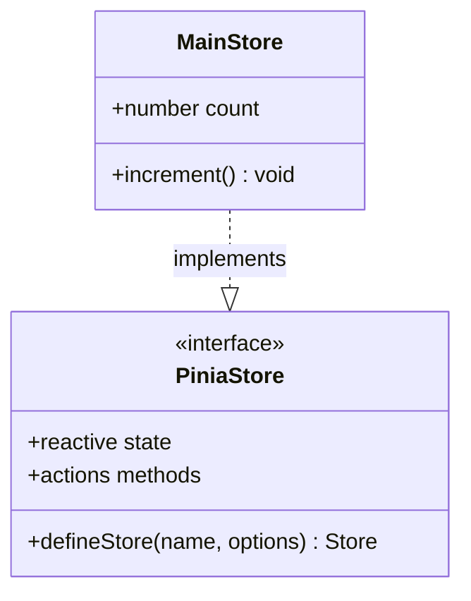
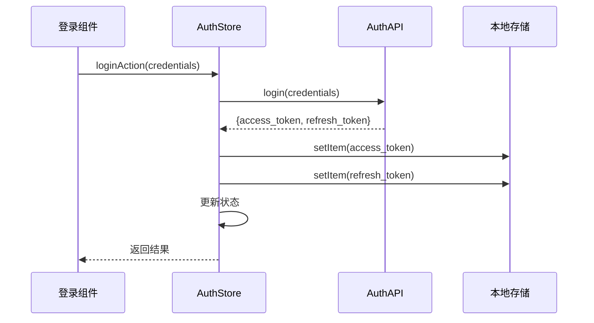
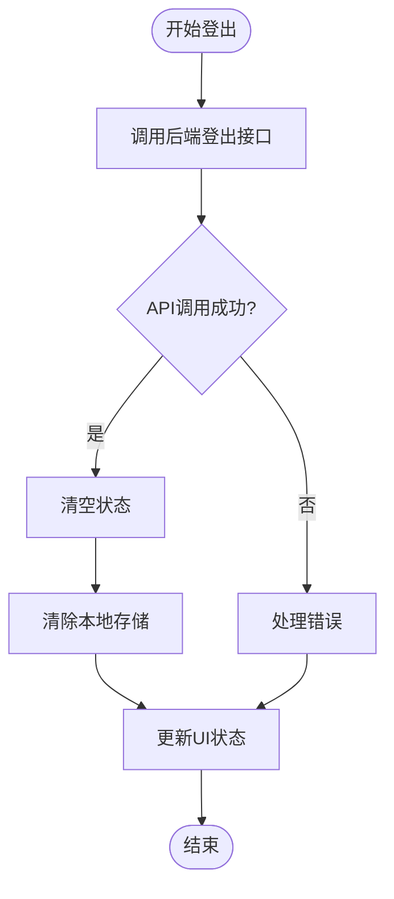
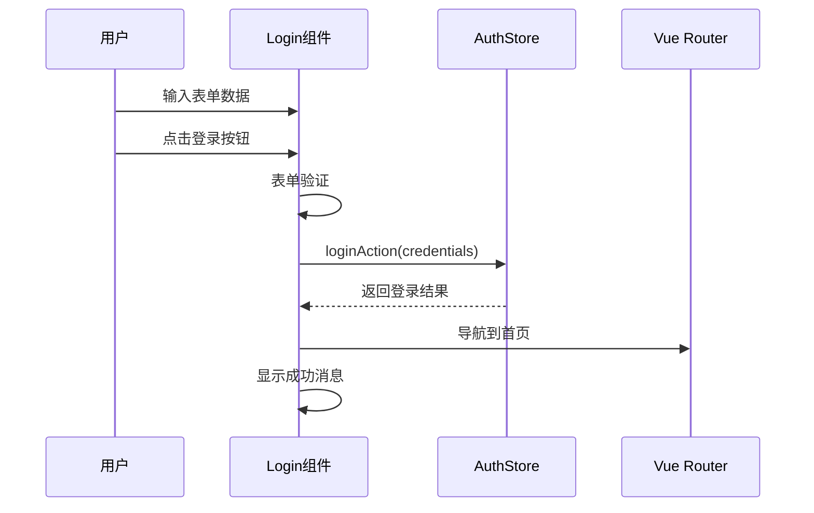
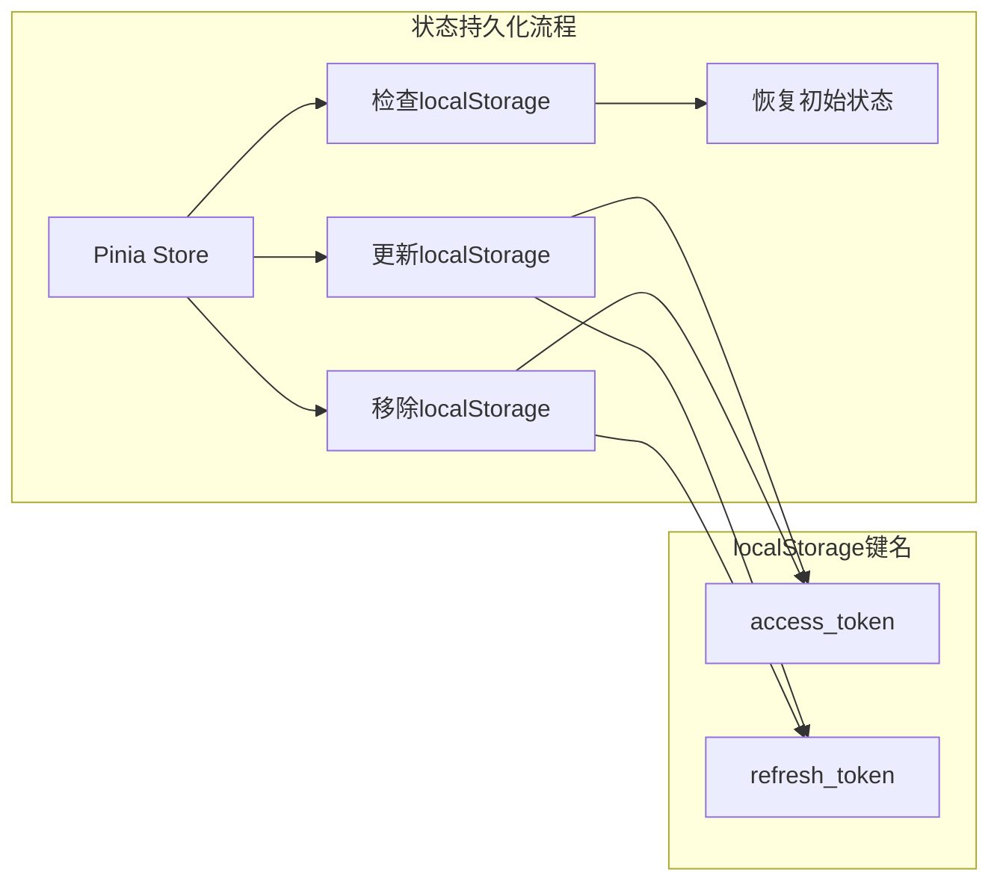
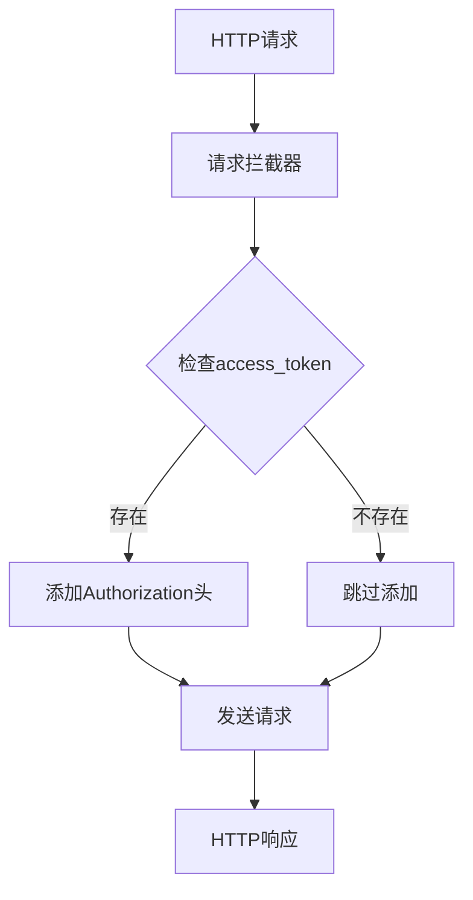
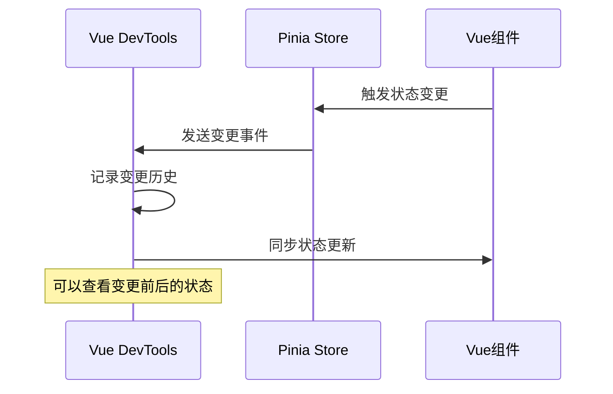

# 状态管理设计

<cite>
**本文档引用的文件**
- [frontend/src/stores/index.ts](file://frontend/src/stores/index.ts)
- [frontend/src/stores/auth.ts](file://frontend/src/stores/auth.ts)
- [frontend/src/views/Login.vue](file://frontend/src/views/Login.vue)
- [frontend/src/main.ts](file://frontend/src/main.ts)
- [frontend/src/api/auth.ts](file://frontend/src/api/auth.ts)
- [frontend/src/types/api.d.ts](file://frontend/src/types/api.d.ts)
- [frontend/src/App.vue](file://frontend/src/App.vue)
</cite>

## 目录
1. [简介](#简介)
2. [项目结构概览](#项目结构概览)
3. [Pinia根Store架构](#pinia根store架构)
4. [认证状态管理](#认证状态管理)
5. [组件状态访问模式](#组件状态访问模式)
6. [状态持久化策略](#状态持久化策略)
7. [API集成与状态同步](#api集成与状态同步)
8. [调试技巧与最佳实践](#调试技巧与最佳实践)
9. [常见陷阱与解决方案](#常见陷阱与解决方案)
10. [总结](#总结)

## 简介

本项目采用Pinia作为状态管理解决方案，为Vue 3应用提供了类型安全且易于维护的状态管理机制。通过分析项目中的状态管理模式，我们可以看到一个清晰的分层架构：根store负责基础状态管理，而专门的auth store处理用户认证相关的复杂业务逻辑。

Pinia相比Vuex提供了更好的TypeScript支持和更简洁的API，使得状态管理更加直观和可预测。项目中的状态管理设计体现了现代前端开发的最佳实践，包括状态持久化、错误处理和组件间通信的优雅解决方案。

## 项目结构概览

项目采用前后端分离架构，前端部分位于`frontend/src`目录下，其中状态管理相关的核心文件组织如下：

```mermaid
graph TB
subgraph "前端状态管理架构"
MainTS[main.ts<br/>应用入口] --> Pinia[createPinia()<br/>Pinia实例]
Pinia --> RootStore[index.ts<br/>根store]
Pinia --> AuthStore[auth.ts<br/>认证store]
subgraph "组件层"
LoginView[Login.vue<br/>登录组件]
AppView[App.vue<br/>主应用组件]
end
subgraph "API层"
AuthAPI[auth.ts<br/>API接口]
Types[api.d.ts<br/>类型定义]
end
LoginView --> AuthStore
AuthStore --> AuthAPI
AuthAPI --> Types
end
```

**图表来源**
- [frontend/src/main.ts](file://frontend/src/main.ts#L1-L21)
- [frontend/src/stores/index.ts](file://frontend/src/stores/index.ts#L1-L12)
- [frontend/src/stores/auth.ts](file://frontend/src/stores/auth.ts#L1-L99)

**章节来源**
- [frontend/src/main.ts](file://frontend/src/main.ts#L1-L21)
- [frontend/src/stores/index.ts](file://frontend/src/stores/index.ts#L1-L12)

## Pinia根Store架构

项目中的根store虽然简单，但遵循了Pinia的最佳实践模式。`index.ts`文件定义了一个基本的计数器store，展示了Pinia的核心概念：

```typescript
import { defineStore } from 'pinia'

export const useMainStore = defineStore('main', {
    state: () => ({
        count: 0
    }),
    actions: {
        increment() {
            this.count++
        }
    }
})
```

这种设计模式体现了以下关键特性：
- **命名空间隔离**：每个store都有唯一的名称标识
- **响应式状态**：自动追踪状态变化并更新依赖组件
- **动作封装**：将状态变更逻辑封装在actions中
- **类型安全**：利用TypeScript提供编译时类型检查



**图表来源**
- [frontend/src/stores/index.ts](file://frontend/src/stores/index.ts#L3-L11)

**章节来源**
- [frontend/src/stores/index.ts](file://frontend/src/stores/index.ts#L1-L12)

## 认证状态管理

认证状态管理是项目状态管理的核心部分，`auth.ts`文件实现了完整的用户认证生命周期管理。该store采用了组合式API的设计模式，充分利用了Vue 3的ref响应式系统。

### 状态结构设计

认证store包含以下核心状态：

```typescript
const accessToken = ref<string | null>(localStorage.getItem('access_token'));
const refreshTokenValue = ref<string | null>(localStorage.getItem('refresh_token'));
const isAuthenticated = ref<boolean>(!!accessToken.value);
```

这种设计的优势：
- **响应式绑定**：使用ref确保状态变化能自动触发UI更新
- **初始值恢复**：从localStorage恢复之前保存的状态
- **类型安全**：明确的类型声明提供编译时保护

### 动作方法详解

#### 登录动作 (loginAction)



**图表来源**
- [frontend/src/stores/auth.ts](file://frontend/src/stores/auth.ts#L13-L32)
- [frontend/src/api/auth.ts](file://frontend/src/api/auth.ts#L47-L56)

#### 退出登录动作 (logoutAction)



**图表来源**
- [frontend/src/stores/auth.ts](file://frontend/src/stores/auth.ts#L34-L47)

#### Token刷新机制

项目实现了完整的token刷新机制，处理了token过期的各种场景：

```typescript
const refreshTokenAction = async () => {
    if (!refreshTokenValue.value) {
        throw new Error('No refresh token available');
    }

    try {
        const response = await refreshToken(refreshTokenValue.value);
        const { access_token, refresh_token } = response.data;
        accessToken.value = access_token;
        refreshTokenValue.value = refresh_token;

        localStorage.setItem('access_token', access_token);
        localStorage.setItem('refresh_token', refresh_token);

        return response;
    } catch (error) {
        // 刷新失败，清除token
        accessToken.value = null;
        refreshTokenValue.value = null;
        isAuthenticated.value = false;
        localStorage.removeItem('access_token');
        localStorage.removeItem('refresh_token');
        throw error;
    }
};
```

**章节来源**
- [frontend/src/stores/auth.ts](file://frontend/src/stores/auth.ts#L1-L99)

## 组件状态访问模式

在`Login.vue`组件中，我们看到了标准的Pinia状态访问模式：

### 组合式函数使用

```typescript
const authStore = useAuthStore();
```

这种模式的优势：
- **简洁明了**：一行代码即可访问store功能
- **类型推断**：TypeScript自动推断返回值类型
- **热重载支持**：开发时支持热重载而不丢失状态

### 状态绑定与事件处理



**图表来源**
- [frontend/src/views/Login.vue](file://frontend/src/views/Login.vue#L85-L105)

### 错误处理与用户体验

组件实现了完善的错误处理机制：

```typescript
catch (error: any) {
    if (error.response?.data?.message === 'TOTP_REQUIRED') {
        showTotp.value = true;
        ElMessage.warning('请输入TOTP验证码');
    } else {
        ElMessage.error(error.response?.data?.message || '登录失败');
        refreshCaptcha();
    }
}
```

**章节来源**
- [frontend/src/views/Login.vue](file://frontend/src/views/Login.vue#L1-L186)

## 状态持久化策略

项目实现了完整的状态持久化策略，确保用户会话在页面刷新后仍然保持：

### 本地存储集成



**图表来源**
- [frontend/src/stores/auth.ts](file://frontend/src/stores/auth.ts#L6-L7)
- [frontend/src/stores/auth.ts](file://frontend/src/stores/auth.ts#L22-L25)

### 持久化时机

状态持久化的关键时机包括：
- **登录成功**：保存新获取的token
- **登出操作**：清除所有相关token
- **token刷新**：更新存储的token值

### 安全考虑

项目在持久化策略中考虑了安全性：
- **分离存储**：access_token和refresh_token分开存储
- **及时清理**：登出时立即清除本地存储
- **错误处理**：token刷新失败时自动清理

**章节来源**
- [frontend/src/stores/auth.ts](file://frontend/src/stores/auth.ts#L22-L47)

## API集成与状态同步

项目实现了完整的API集成模式，确保状态管理与后端服务的同步：

### Axios配置与拦截器

```typescript
const request = axios.create({
    baseURL: import.meta.env.VITE_API_BASE_URL || '/api',
    timeout: 10000,
    headers: {
        'Content-Type': 'application/json',
    },
});
```

### 请求拦截器



**图表来源**
- [frontend/src/api/auth.ts](file://frontend/src/api/auth.ts#L13-L25)

### 响应拦截器

响应拦截器处理了重要的错误场景：

```typescript
request.interceptors.response.use(
    (response) => {
        return response.data;
    },
    (error) => {
        if (error.response?.status === 401) {
            // 处理token过期
            localStorage.removeItem('access_token');
            localStorage.removeItem('refresh_token');
            window.location.href = '/login';
        }
        return Promise.reject(error);
    }
);
```

**章节来源**
- [frontend/src/api/auth.ts](file://frontend/src/api/auth.ts#L1-L99)

## 调试技巧与最佳实践

### Vue DevTools集成

Pinia与Vue DevTools深度集成，提供了强大的调试功能：

1. **时间旅行调试**：可以回放状态变更历史
2. **状态快照**：查看任意时刻的状态快照
3. **动作追踪**：跟踪所有store动作的执行过程
4. **性能监控**：监控状态变更对性能的影响

### 状态变更调试



### 最佳实践建议

1. **单一职责原则**：每个store专注于特定领域
2. **避免深层嵌套**：保持状态结构扁平化
3. **合理使用actions**：将复杂的业务逻辑封装在actions中
4. **类型安全**：充分利用TypeScript提供类型保护
5. **测试友好**：store设计应便于单元测试

## 常见陷阱与解决方案

### 直接修改state陷阱

**问题**：直接修改store的state会导致无法被Vue检测到状态变更

```typescript
// ❌ 错误做法
authStore.accessToken = 'new-token'; // 不会被检测到

// ✅ 正确做法
authStore.loginAction(credentials); // 通过action修改状态
```

### 异步操作处理不当

**问题**：忘记处理异步操作的错误情况

```typescript
// ❌ 错误做法
await authStore.loginAction(credentials); // 忘记错误处理

// ✅ 正确做法
try {
    await authStore.loginAction(credentials);
} catch (error) {
    handleError(error);
}
```

### 状态订阅泄漏

**问题**：忘记清理computed或watcher订阅

```typescript
// ✅ 正确做法
import { watch } from 'vue';

const unwatch = watch(
    () => authStore.isAuthenticated,
    (newValue) => {
        if (newValue) {
            // 执行某些操作
        }
    }
);

// 在组件卸载时清理
onUnmounted(() => {
    unwatch();
});
```

### 解决方案总结

1. **使用actions**：所有状态变更都通过actions进行
2. **完善错误处理**：为所有异步操作添加错误处理
3. **资源清理**：及时清理订阅和定时器
4. **类型检查**：利用TypeScript防止类型错误
5. **单元测试**：为store编写完整的单元测试

## 总结

本项目的状态管理设计展现了现代Vue 3应用的最佳实践。通过Pinia提供的组合式API，项目实现了类型安全、易于维护的状态管理架构。

### 核心优势

1. **类型安全**：完整的TypeScript支持确保编译时错误检测
2. **模块化设计**：清晰的store分离，职责明确
3. **持久化策略**：完整的本地存储集成，确保用户体验
4. **错误处理**：完善的错误处理和恢复机制
5. **调试友好**：与Vue DevTools深度集成，便于开发调试

### 技术亮点

- **响应式状态**：利用Vue 3的响应式系统实现自动更新
- **组合式API**：充分利用Vue 3的新特性提升开发体验
- **API集成**：完整的HTTP客户端配置和拦截器
- **安全考虑**：合理的token管理和错误处理

这种状态管理模式不仅适用于当前项目，也为类似的Vue 3应用提供了可参考的架构模式。通过遵循这些最佳实践，开发者可以构建出高质量、可维护的状态管理系统。