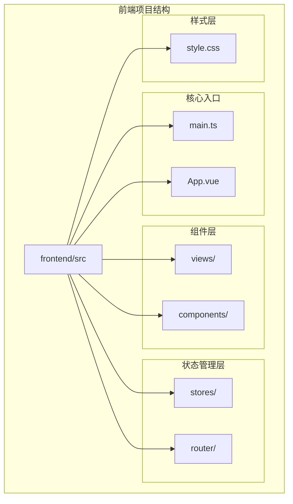
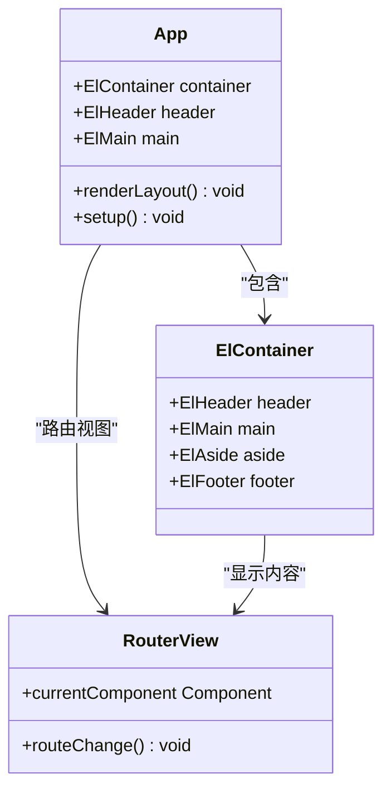
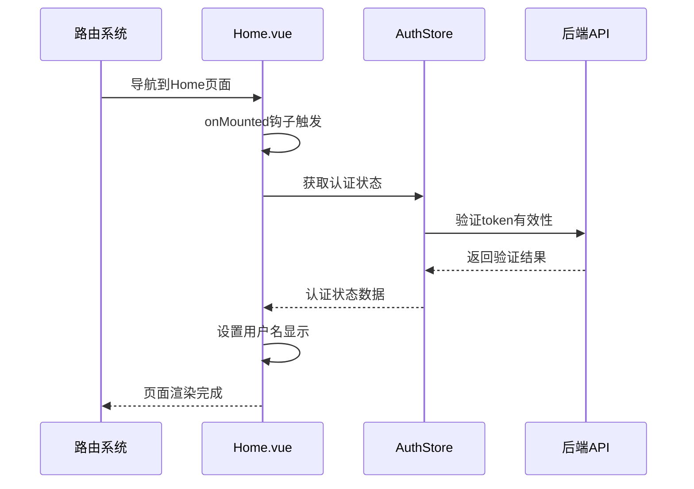
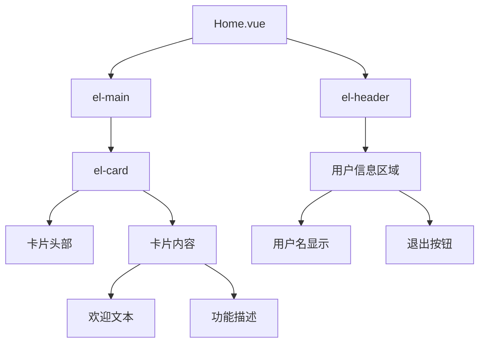
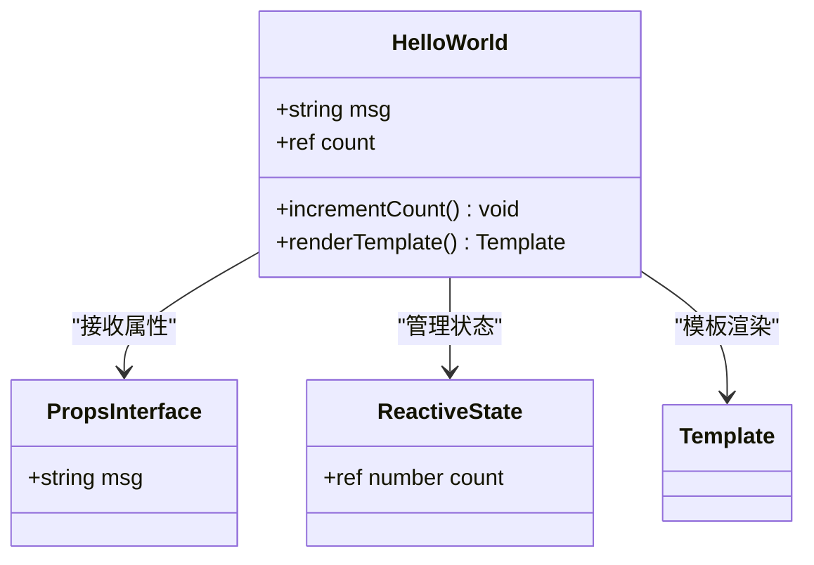
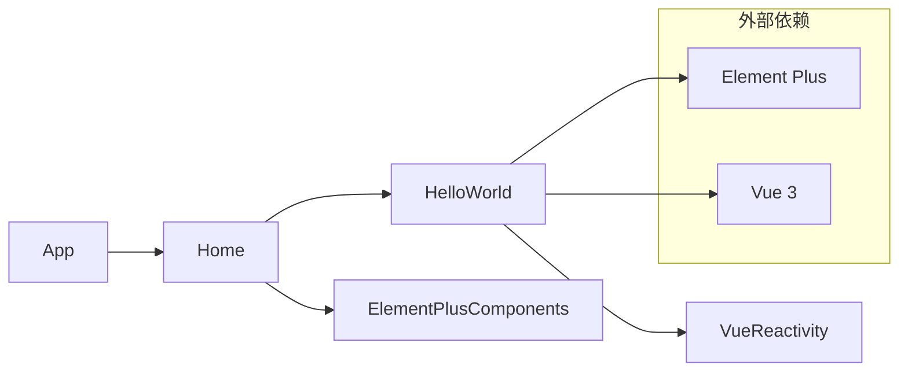
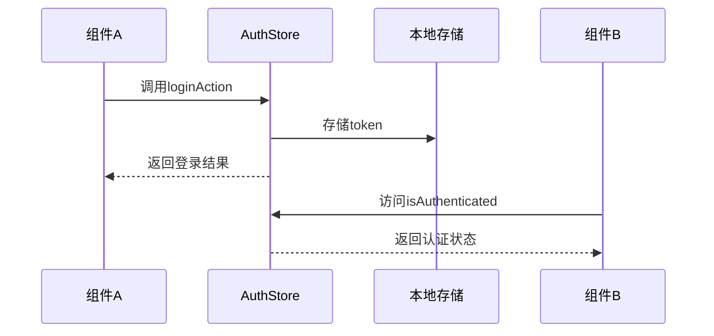
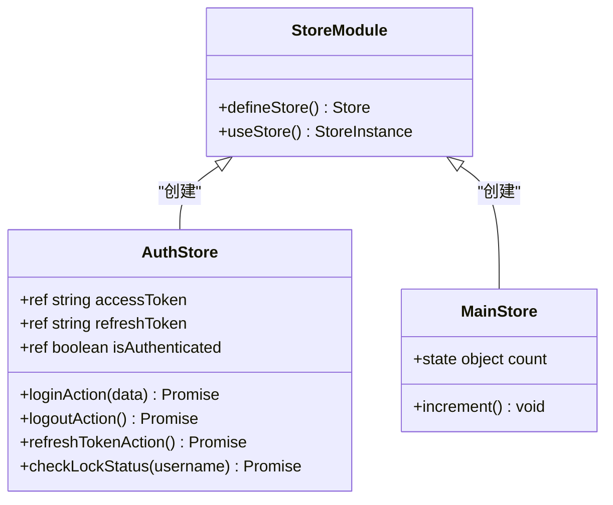
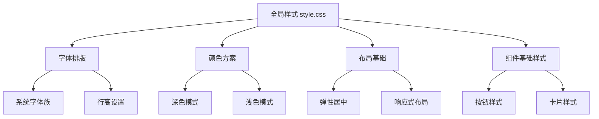
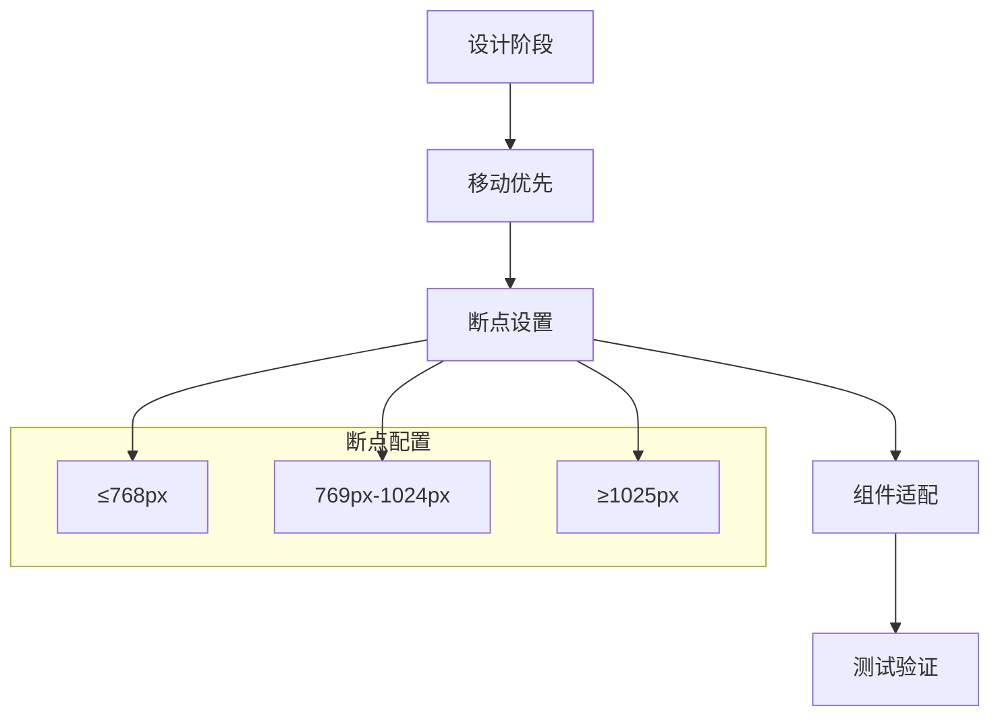

# 组件化架构设计与实现

<cite>
**本文档引用的文件**
- [App.vue](file://frontend/src/App.vue)
- [Home.vue](file://frontend/src/views/Home.vue)
- [HelloWorld.vue](file://frontend/src/components/HelloWorld.vue)
- [main.ts](file://frontend/src/main.ts)
- [style.css](file://frontend/src/style.css)
- [auth.ts](file://frontend/src/stores/auth.ts)
- [index.ts](file://frontend/src/stores/index.ts)
- [router/index.ts](file://frontend/src/router/index.ts)
- [Login.vue](file://frontend/src/views/Login.vue)
</cite>

## 目录
1. [简介](#简介)
2. [项目结构概览](#项目结构概览)
3. [根组件架构](#根组件架构)
4. [页面级组件分析](#页面级组件分析)
5. [功能型子组件](#功能型子组件)
6. [组件通信机制](#组件通信机制)
7. [状态管理架构](#状态管理架构)
8. [样式系统设计](#样式系统设计)
9. [最佳实践指南](#最佳实践指南)
10. [常见问题与解决方案](#常见问题与解决方案)
11. [总结](#总结)

## 简介

本项目采用Vue 3 + TypeScript + Element Plus的现代化前端架构，展现了完整的组件化设计理念与实现方式。通过清晰的组件层次结构、高效的通信机制和统一的状态管理模式，构建了一个可维护、可扩展的前端应用框架。

## 项目结构概览

项目采用模块化的目录结构，将不同类型的组件和服务分离到独立的目录中：



**图表来源**
- [main.ts](file://frontend/src/main.ts#L1-L21)
- [App.vue](file://frontend/src/App.vue#L1-L28)

## 根组件架构

App.vue作为整个应用的根组件，承担着整体布局组织和全局配置的重要职责。

### 根组件设计原理



**图表来源**
- [App.vue](file://frontend/src/App.vue#L5-L12)

### 布局组织策略

App.vue采用了Element Plus的布局组件系统，实现了语义化的页面结构：

- **容器层级**：使用`el-container`构建主容器结构
- **头部区域**：固定高度的标题栏，显示应用名称
- **主体区域**：动态内容区域，通过`router-view`加载当前路由组件
- **样式隔离**：全局样式定义，确保基础布局的一致性

**章节来源**
- [App.vue](file://frontend/src/App.vue#L1-L28)

## 页面级组件分析

Home.vue展示了页面级组件的设计模式，体现了组件化架构中的业务逻辑封装和用户交互处理。

### 组件生命周期管理



**图表来源**
- [Home.vue](file://frontend/src/views/Home.vue#L40-L50)
- [auth.ts](file://frontend/src/stores/auth.ts#L10-L20)

### 组件内部结构

Home.vue采用了模块化的模板结构：



**图表来源**
- [Home.vue](file://frontend/src/views/Home.vue#L1-L20)

### 事件处理机制

组件实现了完整的用户交互流程：

- **登录状态检查**：通过Pinia store管理认证状态
- **退出登录处理**：异步调用store方法，处理错误和反馈
- **路由导航**：使用Vue Router进行页面跳转
- **消息提示**：集成Element Plus的消息组件

**章节来源**
- [Home.vue](file://frontend/src/views/Home.vue#L20-L45)

## 功能型子组件

HelloWorld.vue展示了功能型子组件的设计原则，体现了组件的可复用性和独立性。

### 组件设计模式



**图表来源**
- [HelloWorld.vue](file://frontend/src/components/HelloWorld.vue#L1-L10)

### 组件间依赖关系



**图表来源**
- [main.ts](file://frontend/src/main.ts#L1-L21)
- [Home.vue](file://frontend/src/views/Home.vue#L1-L10)

**章节来源**
- [HelloWorld.vue](file://frontend/src/components/HelloWorld.vue#L1-L42)

## 组件通信机制

项目采用了多种组件通信模式，包括props向下传递、emit事件向上通知以及通过Pinia实现跨组件状态共享。

### Props属性传递

组件通过props接口实现父子组件的数据传递：

```typescript
// 父组件向子组件传递数据
defineProps<{
  msg: string;
}>()

// 子组件接收并使用props
<h1>{{ msg }}</h1>
```

### Emit事件通知

组件通过emit事件向上层组件传递状态变化：

```typescript
// 子组件触发事件
const emit = defineEmits<{
  update: [value: string];
  delete: [];
}>()

// 父组件监听事件
<MyComponent @update="handleUpdate" @delete="handleDelete" />
```

### Pinia状态共享

项目使用Pinia实现跨组件的状态管理：



**图表来源**
- [auth.ts](file://frontend/src/stores/auth.ts#L15-L35)

**章节来源**
- [auth.ts](file://frontend/src/stores/auth.ts#L1-L99)
- [index.ts](file://frontend/src/stores/index.ts#L1-L12)

## 状态管理架构

项目采用Pinia作为状态管理解决方案，实现了集中化的状态控制和持久化存储。

### Store设计模式



**图表来源**
- [auth.ts](file://frontend/src/stores/auth.ts#L5-L15)
- [index.ts](file://frontend/src/stores/index.ts#L3-L10)

### 状态持久化策略

AuthStore实现了完整的token管理机制：

- **本地存储**：自动同步token到localStorage
- **状态同步**：实时更新内存状态与存储状态
- **错误处理**：刷新失败时自动清理无效token
- **安全考虑**：敏感信息的安全存储和传输

**章节来源**
- [auth.ts](file://frontend/src/stores/auth.ts#L15-L70)

## 样式系统设计

项目采用了分层的样式管理策略，结合全局样式和作用域样式，确保样式的可维护性和一致性。

### 全局样式策略



**图表来源**
- [style.css](file://frontend/src/style.css#L1-L80)

### 作用域样式管理

组件采用scoped样式确保样式隔离：

```css
/* Home.vue scoped样式 */
<style scoped>
.home-container {
  height: 100vh;
}

.header-content {
  display: flex;
  justify-content: space-between;
  align-items: center;
  max-width: 1200px;
  margin: 0 auto;
}
</style>
```

### Element Plus集成

项目集成了Element Plus组件库，提供了丰富的UI组件和主题定制能力：

- **组件样式**：自动应用Element Plus的样式规范
- **主题定制**：支持全局主题变量配置
- **图标系统**：集成完整的图标库
- **响应式设计**：内置移动端适配方案

**章节来源**
- [style.css](file://frontend/src/style.css#L1-L80)
- [Home.vue](file://frontend/src/views/Home.vue#L50-L84)

## 最佳实践指南

### 组件复用策略

1. **抽象通用组件**：
   - 创建可配置的表单组件
   - 设计灵活的按钮组件
   - 实现可重用的卡片组件

2. **类型安全**：
   - 使用TypeScript定义组件接口
   - 为props和events提供类型声明
   - 利用泛型增强组件灵活性

3. **可访问性支持**：
   - 添加适当的ARIA标签
   - 支持键盘导航
   - 提供屏幕阅读器友好的交互

### 响应式设计

项目通过以下方式实现响应式支持：



### 性能优化

1. **懒加载**：路由级别的代码分割
2. **组件缓存**：合理使用keep-alive
3. **样式优化**：CSS压缩和按需加载
4. **资源管理**：图片和静态资源优化

## 常见问题与解决方案

### 渲染错误处理

1. **组件未正确注册**
   ```typescript
   // 错误：组件未注册
   // 解决：在main.ts中注册
   app.component('MyComponent', MyComponent)
   ```

2. **props类型不匹配**
   ```typescript
   // 错误：类型不兼容
   // 解决：使用严格类型检查
   defineProps<{
     count: number;
     items: string[];
   }>()
   ```

3. **样式作用域冲突**
   ```css
   /* 错误：样式被覆盖 */
   /* 解决：使用更具体的选择器或 ::v-deep */
   ::v-deep(.custom-class) {
     color: red;
   }
   ```

### 状态管理问题

1. **状态同步延迟**
   ```typescript
   // 解决：使用watchEffect监听状态变化
   watchEffect(() => {
     localStorage.setItem('token', authStore.accessToken)
   })
   ```

2. **内存泄漏**
   ```typescript
   // 解决：及时清理副作用
   onUnmounted(() => {
     clearInterval(timer)
   })
   ```

### 路由导航问题

1. **认证状态检查**
   ```typescript
   // 在路由守卫中处理认证
   router.beforeEach((to, from, next) => {
     const requiresAuth = to.matched.some(record => record.meta.requiresAuth)
     if (requiresAuth && !authStore.isAuthenticated) {
       next({ name: 'Login' })
     } else {
       next()
     }
   })
   ```

**章节来源**
- [router/index.ts](file://frontend/src/router/index.ts#L20-L40)

## 总结

本项目展现了现代前端组件化架构的最佳实践，通过清晰的组件层次、高效的通信机制和统一的状态管理，构建了一个可维护、可扩展的前端应用框架。

### 核心优势

1. **模块化设计**：清晰的目录结构和组件分类
2. **类型安全**：完整的TypeScript支持
3. **状态管理**：集中化的Pinia状态管理
4. **样式隔离**：Scoped样式和全局样式的合理运用
5. **用户体验**：Element Plus提供的丰富组件库

### 发展方向

1. **组件库扩展**：根据业务需求扩展通用组件
2. **性能优化**：持续优化组件渲染和状态更新
3. **测试覆盖**：增加单元测试和集成测试
4. **文档完善**：补充组件使用文档和最佳实践

通过遵循这些设计原则和最佳实践，开发者可以构建出高质量、易维护的前端应用程序。