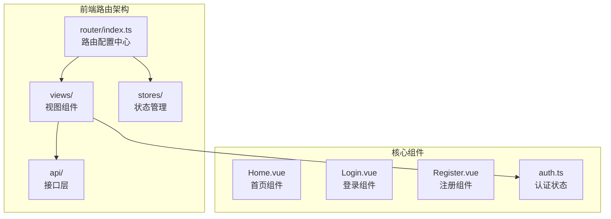
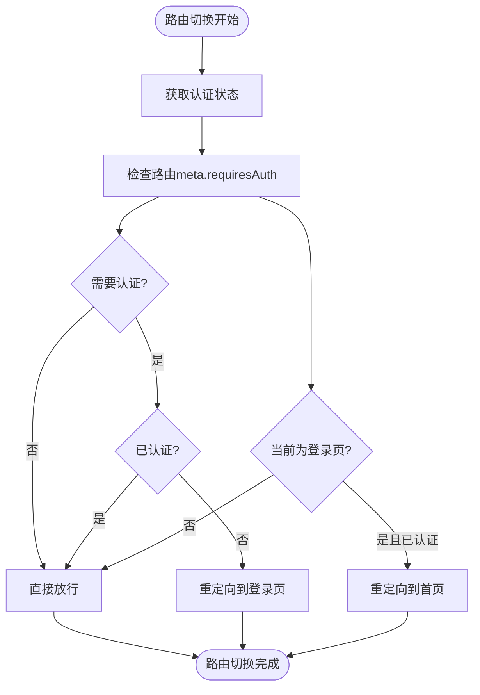
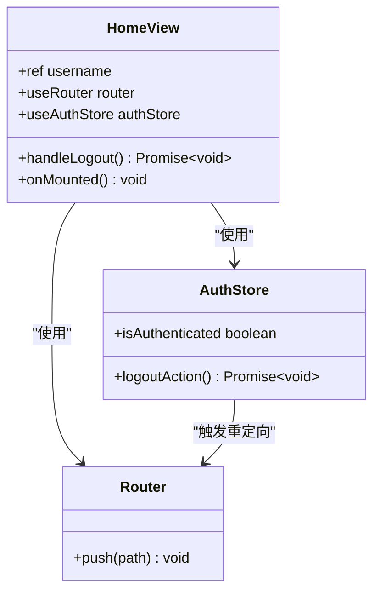

# 基于Vue Router的前端路由架构设计

<cite>
**本文档引用的文件**
- [frontend/src/router/index.ts](file://frontend/src/router/index.ts)
- [frontend/src/views/Home.vue](file://frontend/src/views/Home.vue)
- [frontend/src/views/Login.vue](file://frontend/src/views/Login.vue)
- [frontend/src/views/Register.vue](file://frontend/src/views/Register.vue)
- [frontend/src/stores/auth.ts](file://frontend/src/stores/auth.ts)
- [frontend/src/main.ts](file://frontend/src/main.ts)
</cite>

## 目录
1. [简介](#简介)
2. [项目结构概览](#项目结构概览)
3. [核心路由配置](#核心路由配置)
4. [路由守卫与权限控制](#路由守卫与权限控制)
5. [视图组件分析](#视图组件分析)
6. [路由导航机制](#路由导航机制)
7. [路由懒加载与性能优化](#路由懒加载与性能优化)
8. [典型错误场景与解决方案](#典型错误场景与解决方案)
9. [总结](#总结)

## 简介

本文档深入分析了基于Vue Router的前端路由架构设计，展示了如何通过静态路由配置、动态路由管理、路由守卫实现权限控制，以及如何利用路由懒加载提升应用性能。该架构采用Vue 3 + TypeScript + Element Plus技术栈，提供了完整的用户认证流程和路由管理机制。

## 项目结构概览

该项目的前端路由系统主要位于`frontend/src/router/`目录下，核心文件包括：



**图表来源**
- [frontend/src/router/index.ts](file://frontend/src/router/index.ts#L1-L42)
- [frontend/src/views/Home.vue](file://frontend/src/views/Home.vue#L1-L85)
- [frontend/src/views/Login.vue](file://frontend/src/views/Login.vue#L1-L186)
- [frontend/src/views/Register.vue](file://frontend/src/views/Register.vue#L1-L229)

## 核心路由配置

### 静态路由定义

路由系统通过Vue Router的`createRouter`函数创建，定义了三个主要的静态路由：

```typescript
const router = createRouter({
    history: createWebHistory(),
    routes: [
        {
            path: '/',
            name: 'Home',
            component: () => import('@/views/Home.vue'),
            meta: { requiresAuth: true },
        },
        {
            path: '/login',
            name: 'Login',
            component: () => import('@/views/Login.vue'),
            meta: { requiresAuth: false },
        },
        {
            path: '/register',
            name: 'Register',
            component: () => import('@/views/Register.vue'),
            meta: { requiresAuth: false },
        },
    ]
})
```

### 路由元信息设计

每个路由都配备了`meta`字段，用于定义路由的权限要求：

- **Home路由**：需要认证才能访问（`requiresAuth: true`）
- **Login路由**：无需认证（`requiresAuth: false`）
- **Register路由**：无需认证（`requiresAuth: false`）

这种设计允许路由守卫根据元信息动态决定是否需要进行身份验证。

**章节来源**
- [frontend/src/router/index.ts](file://frontend/src/router/index.ts#L1-L42)

## 路由守卫与权限控制

### beforeEach路由守卫实现

路由守卫是整个权限控制系统的核心，它在每次路由切换前执行：



**图表来源**
- [frontend/src/router/index.ts](file://frontend/src/router/index.ts#L25-L37)

### 权限控制逻辑详解

路由守卫实现了以下核心逻辑：

1. **认证检查**：通过`to.matched.some(record => record.meta.requiresAuth)`检查目标路由是否需要认证
2. **重定向逻辑**：
   - 如果需要认证但未登录，重定向到登录页面
   - 如果已经是登录页面且已登录，重定向到首页
3. **正常通行**：其他情况直接放行

这种设计避免了循环重定向问题，确保用户体验流畅。

**章节来源**
- [frontend/src/router/index.ts](file://frontend/src/router/index.ts#L25-L37)

## 视图组件分析

### Home.vue - 首页组件

首页组件展示了完整的用户界面设计，包含：



**图表来源**
- [frontend/src/views/Home.vue](file://frontend/src/views/Home.vue#L25-L45)
- [frontend/src/stores/auth.ts](file://frontend/src/stores/auth.ts#L15-L35)

### Login.vue - 登录组件

登录组件提供了完整的用户认证功能：

- **表单验证**：用户名、密码、验证码的完整验证规则
- **验证码支持**：集成图形验证码和TOTP双重认证
- **错误处理**：智能识别TOTP缺失并自动启用TOTP模式
- **用户体验**：友好的错误提示和加载状态

### Register.vue - 注册组件

注册组件实现了完整的用户注册流程：

- **多字段验证**：用户名、密码、邮箱、手机号的严格验证
- **密码强度**：包含大小写字母、数字和特殊字符的复杂密码要求
- **验证码集成**：与登录组件共享验证码服务
- **双向导航**：支持快速在登录和注册页面间切换

**章节来源**
- [frontend/src/views/Home.vue](file://frontend/src/views/Home.vue#L1-L85)
- [frontend/src/views/Login.vue](file://frontend/src/views/Login.vue#L1-L186)
- [frontend/src/views/Register.vue](file://frontend/src/views/Register.vue#L1-L229)

## 路由导航机制

### 导航方式对比

项目中使用了两种主要的路由导航方式：

1. **模板中的<router-link>**
   ```html
   <router-link to="/login">登录</router-link>
   ```

2. **编程式导航**
   ```typescript
   // 在组件中使用
   const router = useRouter();
   router.push('/login');
   router.push({ name: 'Home' });
   ```

### 导航守卫的应用

在各个视图组件中，导航守卫的应用体现在：

- **登录成功后导航**：`router.push('/')`
- **注册成功后导航**：`router.push('/login')`
- **退出登录后导航**：`router.push('/login')`
- **快速跳转**：`router.push('/register')` 和 `router.push('/login')`

**章节来源**
- [frontend/src/views/Login.vue](file://frontend/src/views/Login.vue#L150-L160)
- [frontend/src/views/Register.vue](file://frontend/src/views/Register.vue#L180-L190)
- [frontend/src/views/Home.vue](file://frontend/src/views/Home.vue#L35-L45)

## 路由懒加载与性能优化

### 动态导入机制

路由系统采用了Vue Router的动态导入功能：

```typescript
component: () => import('@/views/Home.vue')
```

这种方式的优势：

1. **代码分割**：每个路由组件独立打包，减少初始加载体积
2. **按需加载**：只有访问对应路由时才加载相应组件
3. **缓存友好**：浏览器可以缓存单独的chunk文件

### 性能影响分析

路由懒加载对首屏性能的影响：

- **减少初始包大小**：首页不需要加载登录和注册组件
- **提升加载速度**：用户只需下载当前页面所需的资源
- **改善用户体验**：更快的首次渲染时间

**章节来源**
- [frontend/src/router/index.ts](file://frontend/src/router/index.ts#L8-L20)

## 典型错误场景与解决方案

### 循环重定向问题

**问题描述**：当路由守卫逻辑不当可能导致无限循环重定向

**错误示例**：
```typescript
// 错误的守卫逻辑
router.beforeEach((to, from, next) => {
    if (to.name === 'Login' && !authStore.isAuthenticated) {
        next({ name: 'Home' }); // 可能导致循环
    }
    next();
});
```

**正确解决方案**：
```typescript
// 正确的守卫逻辑
router.beforeEach((to, from, next) => {
    const requiresAuth = to.matched.some(record => record.meta.requiresAuth);
    
    if (requiresAuth && !authStore.isAuthenticated) {
        next({ name: 'Login' });
    } else if (to.name === 'Login' && authStore.isAuthenticated) {
        next({ name: 'Home' }); // 避免循环
    } else {
        next();
    }
});
```

### 守卫未放行问题

**问题描述**：忘记调用next()导致路由卡住

**解决方案**：确保每个守卫分支都有next()调用

### 认证状态同步问题

**问题描述**：路由守卫依赖的认证状态可能不同步

**解决方案**：
1. 使用Pinia状态管理确保状态一致性
2. 在守卫中重新验证认证状态
3. 实现token刷新机制

**章节来源**
- [frontend/src/router/index.ts](file://frontend/src/router/index.ts#L25-L37)
- [frontend/src/stores/auth.ts](file://frontend/src/stores/auth.ts#L15-L98)

## 总结

本路由系统设计体现了现代前端开发的最佳实践：

1. **清晰的权限控制**：通过路由元信息和守卫实现精确的权限管理
2. **优秀的用户体验**：智能的重定向逻辑避免循环跳转
3. **高效的性能表现**：路由懒加载显著提升应用启动速度
4. **完善的错误处理**：多层次的错误处理确保系统稳定性
5. **模块化的架构设计**：清晰的职责分离便于维护和扩展

该架构为构建大型单页应用提供了坚实的基础，同时保持了良好的可维护性和扩展性。通过合理的路由设计和状态管理，系统能够优雅地处理各种复杂的用户交互场景。