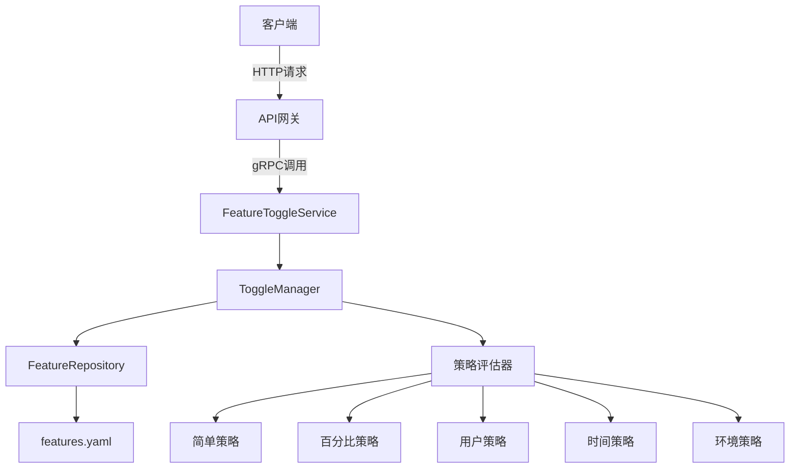
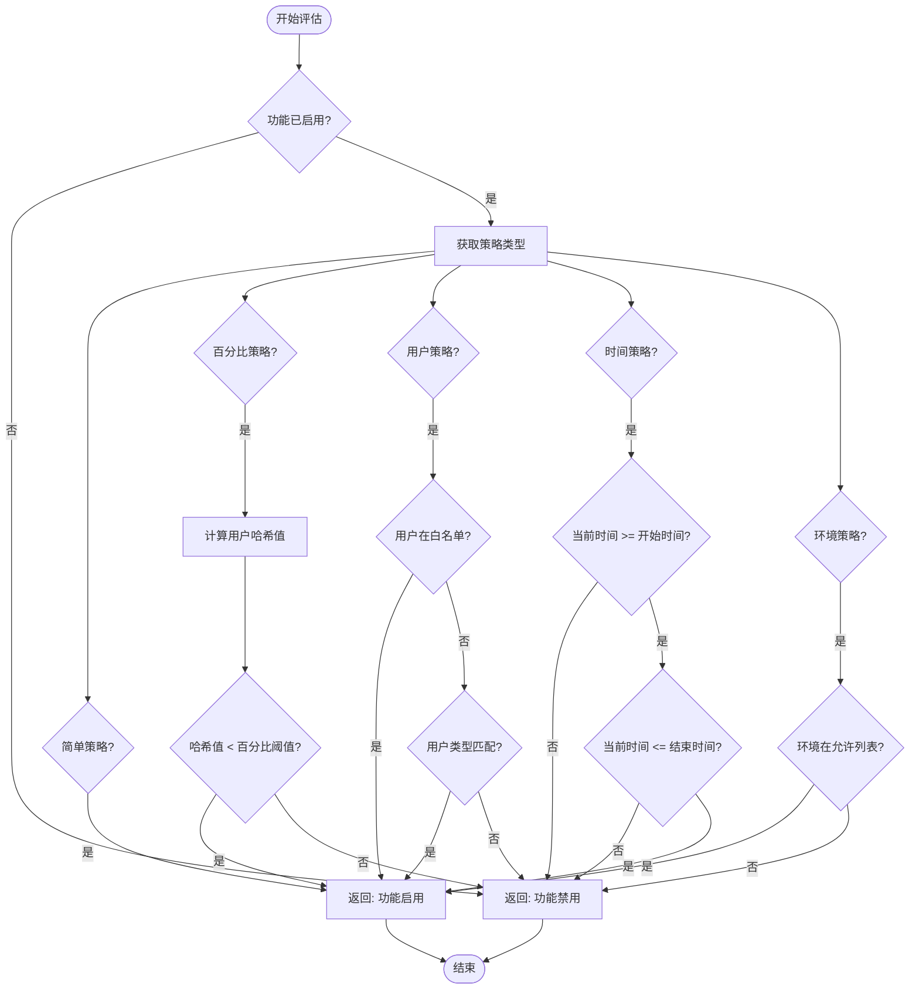

# 功能开关API

<cite>
**本文档引用的文件**
- [feature.proto](file://api/feature/v1/feature.proto#L1-L181)
- [feature.go](file://internal/service/feature.go#L1-L337)
- [toggle_manager.go](file://internal/pkg/feature/toggle_manager.go#L1-L642)
- [interfaces.go](file://internal/pkg/feature/interfaces.go#L1-L237)
- [strategies.go](file://internal/pkg/feature/strategies.go#L1-L277)
- [features.yaml](file://configs/features.yaml#L1-L340)
</cite>

## 目录
1. [功能开关API概述](#功能开关api概述)
2. [核心组件分析](#核心组件分析)
3. [功能开关策略详解](#功能开关策略详解)
4. [接口详细说明](#接口详细说明)
5. [配置文件结构](#配置文件结构)
6. [使用示例](#使用示例)

## 功能开关API概述

功能开关API提供了一套完整的功能特性管理解决方案，支持动态启用/禁用系统功能、渐进式发布、A/B测试等场景。该API基于gRPC和Protobuf定义，通过HTTP映射提供RESTful接口，实现了灵活的功能控制机制。

系统采用分层架构设计，包含API层、服务层、业务逻辑层和数据存储层。核心功能由`FeatureToggleService`实现，通过`ToggleManager`管理所有功能开关的状态和策略评估。

**功能特性包括：**
- 支持多种功能开关策略（简单开关、百分比、用户属性、时间、环境）
- 分层功能集合管理（域、模块、能力）
- 实时配置变更通知
- 统计信息收集
- CSV格式导出功能



**图示来源**
- [feature.go](file://internal/service/feature.go#L1-L337)
- [toggle_manager.go](file://internal/pkg/feature/toggle_manager.go#L1-L642)
- [strategies.go](file://internal/pkg/feature/strategies.go#L1-L277)

## 核心组件分析

### FeatureToggleService

`FeatureToggleService`是功能开关API的主要服务实现，负责处理所有gRPC请求并将其转换为底层业务逻辑调用。

```go
type FeatureToggleService struct {
	v1.UnimplementedFeatureToggleServer
	toggleManager feature.FeatureToggle
	logger        *log.Helper
}
```

该服务通过依赖注入获取`ToggleManager`实例，实现了所有功能开关相关的RPC方法。

**Section sources**
- [feature.go](file://internal/service/feature.go#L1-L337)

### ToggleManager

`ToggleManager`是功能开关的核心管理器，负责维护所有功能开关的状态、执行策略评估和管理配置变更。

```go
type ToggleManager struct {
	mu                sync.RWMutex
	toggles           map[FeatureFlag]*ToggleConfig
	repository        FeatureRepository
	strategyEvaluator StrategyEvaluator
	callbacks         []ToggleChangeCallback
	logger            *log.Helper
	defaultContext    *EvaluationContext
}
```

关键特性：
- 使用读写锁保证并发安全
- 支持从配置文件加载功能开关
- 提供策略评估功能
- 支持变更回调通知
- 内置统计信息收集

```mermaid
classDiagram
class FeatureToggleService {
+toggleManager FeatureToggle
+logger *log.Helper
+ListToggles(ctx, req) (*ListTogglesReply, error)
+GetToggle(ctx, req) (*GetToggleReply, error)
+UpdateToggle(ctx, req) (*UpdateToggleReply, error)
+EnableToggle(ctx, req) (*EnableToggleReply, error)
+DisableToggle(ctx, req) (*DisableToggleReply, error)
+DeleteToggle(ctx, req) (*DeleteToggleReply, error)
+EvaluateToggle(ctx, req) (*EvaluateToggleReply, error)
+GetStats(ctx, req) (*GetStatsReply, error)
}
class ToggleManager {
-mu sync.RWMutex
-toggles map[FeatureFlag]*ToggleConfig
-repository FeatureRepository
-strategyEvaluator StrategyEvaluator
-callbacks []ToggleChangeCallback
-logger *log.Helper
-defaultContext *EvaluationContext
+Initialize(ctx) error
+IsEnabled(ctx, flag) bool
+IsEnabledWithContext(ctx, flag, evalCtx) bool
+GetToggleConfig(flag) (*ToggleConfig, error)
+UpdateToggle(flag, config) error
+ListToggles() map[FeatureFlag]*ToggleConfig
+EnableFeature(flag) error
+DisableFeature(flag) error
+DeleteToggle(flag) error
+Subscribe(callback) error
+Unsubscribe(callback) error
+GetStats() map[string]interface{}
}
class FeatureRepository {
<<interface>>
+LoadToggles(ctx) (map[FeatureFlag]*ToggleConfig, error)
+SaveToggle(ctx, flag, config) error
+DeleteToggle(ctx, flag) error
+Watch(ctx, callback) error
}
class StrategyEvaluator {
<<interface>>
+Evaluate(ctx, config, evalCtx) bool
+SupportsStrategy(strategy) bool
}
FeatureToggleService --> ToggleManager : "依赖"
ToggleManager --> FeatureRepository : "使用"
ToggleManager --> StrategyEvaluator : "使用"
```

**图示来源**
- [feature.go](file://internal/service/feature.go#L1-L337)
- [toggle_manager.go](file://internal/pkg/feature/toggle_manager.go#L1-L642)
- [interfaces.go](file://internal/pkg/feature/interfaces.go#L1-L237)

## 功能开关策略详解

系统支持多种功能开关策略，每种策略适用于不同的业务场景。

### 简单开关策略

最基础的开关策略，仅根据启用状态决定功能是否可用。

```go
type SimpleStrategy struct{}

func (s *SimpleStrategy) Evaluate(ctx context.Context, config *ToggleConfig, evalCtx *EvaluationContext) bool {
	return config.Enabled
}
```

**适用场景：** 功能的简单启用/禁用控制

### 百分比策略

基于用户百分比的渐进式发布策略，确保特定比例的用户可以访问新功能。

```go
func (p *PercentageStrategy) Evaluate(ctx context.Context, config *ToggleConfig, evalCtx *EvaluationContext) bool {
	if !config.Enabled {
		return false
	}

	percentage, ok := config.Rules["percentage"].(float64)
	if !ok {
		return false
	}

	if evalCtx == nil || evalCtx.UserID == "" {
		return false
	}

	hash := simpleHash(evalCtx.UserID)
	return float64(hash%100) < percentage
}
```

**适用场景：** 新功能的灰度发布、A/B测试

### 用户属性策略

基于用户属性（如用户ID、用户类型、自定义属性）的精细化控制策略。

```go
func (u *UserStrategy) Evaluate(ctx context.Context, config *ToggleConfig, evalCtx *EvaluationContext) bool {
	if !config.Enabled || evalCtx == nil {
		return false
	}

	// 检查用户白名单
	if whitelist, ok := config.Rules["whitelist"].([]interface{}); ok {
		for _, user := range whitelist {
			if userStr, ok := user.(string); ok && userStr == evalCtx.UserID {
				return true
			}
		}
	}

	// 检查用户类型
	if userTypes, ok := config.Rules["user_types"].([]interface{}); ok {
		for _, userType := range userTypes {
			if typeStr, ok := userType.(string); ok && typeStr == evalCtx.UserType {
				return true
			}
		}
	}

	return false
}
```

**适用场景：** 内部测试、VIP用户特权、用户分群实验

### 时间策略

基于时间条件的功能控制策略，支持时间段、工作日等时间相关规则。

```go
func (t *TimeStrategy) Evaluate(ctx context.Context, config *ToggleConfig, evalCtx *EvaluationContext) bool {
	if !config.Enabled {
		return false
	}

	now := time.Now()

	// 检查开始时间
	if startTimeStr, ok := config.Rules["start_time"].(string); ok {
		if startTime, err := time.Parse(time.RFC3339, startTimeStr); err == nil {
			if now.Before(startTime) {
				return false
			}
		}
	}

	// 检查结束时间
	if endTimeStr, ok := config.Rules["end_time"].(string); ok {
		if endTime, err := time.Parse(time.RFC3339, endTimeStr); err == nil {
			if now.After(endTime) {
				return false
			}
		}
	}

	return true
}
```

**适用场景：** 限时活动、节日主题、维护窗口

### 环境策略

基于部署环境的功能控制策略，确保功能在不同环境中具有不同的行为。

```go
func (e *EnvironmentStrategy) Evaluate(ctx context.Context, config *ToggleConfig, evalCtx *EvaluationContext) bool {
	if !config.Enabled || evalCtx == nil {
		return false
	}

	// 检查环境白名单
	if environments, ok := config.Rules["environments"].([]interface{}); ok {
		for _, env := range environments {
			if envStr, ok := env.(string); ok && envStr == evalCtx.Environment {
				return true
			}
		}
		return false
	}

	return true
}
```

**适用场景：** 开发环境调试功能、生产环境限制功能



**图示来源**
- [strategies.go](file://internal/pkg/feature/strategies.go#L1-L277)

## 接口详细说明

### ListToggles - 获取所有功能开关

获取系统中所有功能开关的列表，支持分页和过滤。

**HTTP映射**
```
GET /api/v1/features
```

**请求参数**
- `page`: 页码（默认1）
- `page_size`: 每页数量（默认20）
- `tags`: 标签过滤
- `enabled_only`: 仅返回启用的功能

**响应结构**
```json
{
  "toggles": [
    {
      "flag": "user.management",
      "config": {
        "enabled": true,
        "strategy": "simple",
        "rules": {},
        "description": "用户管理功能集合",
        "tags": ["user", "admin"],
        "created_at": "2025-01-10T10:00:00Z",
        "updated_at": "2025-01-10T10:00:00Z"
      }
    }
  ],
  "total": 10,
  "page": 1,
  "page_size": 20
}
```

**Section sources**
- [feature.proto](file://api/feature/v1/feature.proto#L1-L181)
- [feature.go](file://internal/service/feature.go#L1-L337)

### GetToggle - 获取单个功能开关

获取指定功能开关的详细配置信息。

**HTTP映射**
```
GET /api/v1/features/{flag}
```

**路径参数**
- `flag`: 功能开关标识符

**响应结构**
```json
{
  "toggle": {
    "flag": "user.management",
    "config": {
      "enabled": true,
      "strategy": "simple",
      "rules": {},
      "description": "用户管理功能集合",
      "tags": ["user", "admin"],
      "created_at": "2025-01-10T10:00:00Z",
      "updated_at": "2025-01-10T10:00:00Z"
    }
  }
}
```

**错误响应**
- `TOGGLE_NOT_FOUND`: 功能开关不存在

**Section sources**
- [feature.proto](file://api/feature/v1/feature.proto#L1-L181)
- [feature.go](file://internal/service/feature.go#L1-L337)

### UpdateToggle - 更新功能开关

更新指定功能开关的配置。

**HTTP映射**
```
PUT /api/v1/features/{flag}
```

**路径参数**
- `flag`: 功能开关标识符

**请求体**
```json
{
  "config": {
    "enabled": true,
    "strategy": "percentage",
    "rules": {
      "percentage": "10.0"
    },
    "description": "新版用户仪表盘渐进式发布",
    "tags": ["ui", "rollout"]
  }
}
```

**响应结构**
```json
{
  "toggle": {
    "flag": "new_user_dashboard",
    "config": {
      "enabled": true,
      "strategy": "percentage",
      "rules": {
        "percentage": "10.0"
      },
      "description": "新版用户仪表盘渐进式发布",
      "tags": ["ui", "rollout"],
      "created_at": "2025-01-10T10:00:00Z",
      "updated_at": "2025-01-15T14:30:00Z"
    }
  }
}
```

**错误响应**
- `UPDATE_FAILED`: 更新失败

**Section sources**
- [feature.proto](file://api/feature/v1/feature.proto#L1-L181)
- [feature.go](file://internal/service/feature.go#L1-L337)

### EnableToggle - 启用功能开关

启用指定的功能开关。

**HTTP映射**
```
POST /api/v1/features/{flag}/enable
```

**路径参数**
- `flag`: 功能开关标识符

**请求体**
```json
{}
```

**响应结构**
```json
{
  "toggle": {
    "flag": "captcha",
    "config": {
      "enabled": true,
      "strategy": "simple",
      "rules": {},
      "description": "验证码功能开关",
      "tags": ["auth", "security"],
      "created_at": "2025-01-10T10:00:00Z",
      "updated_at": "2025-01-15T14:30:00Z"
    }
  }
}
```

**错误响应**
- `ENABLE_FAILED`: 启用失败

**Section sources**
- [feature.proto](file://api/feature/v1/feature.proto#L1-L181)
- [feature.go](file://internal/service/feature.go#L1-L337)

### DisableToggle - 禁用功能开关

禁用指定的功能开关。

**HTTP映射**
```
POST /api/v1/features/{flag}/disable
```

**路径参数**
- `flag`: 功能开关标识符

**请求体**
```json
{}
```

**响应结构**
```json
{
  "toggle": {
    "flag": "captcha",
    "config": {
      "enabled": false,
      "strategy": "simple",
      "rules": {},
      "description": "验证码功能开关",
      "tags": ["auth", "security"],
      "created_at": "2025-01-10T10:00:00Z",
      "updated_at": "2025-01-15T14:30:00Z"
    }
  }
}
```

**错误响应**
- `DISABLE_FAILED`: 禁用失败

**Section sources**
- [feature.proto](file://api/feature/v1/feature.proto#L1-L181)
- [feature.go](file://internal/service/feature.go#L1-L337)

### DeleteToggle - 删除功能开关

删除指定的功能开关。

**HTTP映射**
```
DELETE /api/v1/features/{flag}
```

**路径参数**
- `flag`: 功能开关标识符

**响应结构**
```json
{
  "success": true
}
```

**错误响应**
- `DELETE_FAILED`: 删除失败

**Section sources**
- [feature.proto](file://api/feature/v1/feature.proto#L1-L181)
- [feature.go](file://internal/service/feature.go#L1-L337)

### EvaluateToggle - 评估功能开关

评估指定功能开关在给定上下文中的状态。

**HTTP映射**
```
POST /api/v1/features/{flag}/evaluate
```

**路径参数**
- `flag`: 功能开关标识符

**请求体**
```json
{
  "context": {
    "user_id": "user123",
    "user_type": "premium",
    "environment": "production",
    "version": "1.2.0",
    "attributes": {
      "role": "admin"
    }
  }
}
```

**响应结构**
```json
{
  "enabled": true,
  "reason": "Feature is enabled"
}
```

**错误处理**
- 如果功能开关不存在，默认返回`enabled: true`

**Section sources**
- [feature.proto](file://api/feature/v1/feature.proto#L1-L181)
- [feature.go](file://internal/service/feature.go#L1-L337)

### GetStats - 获取功能开关统计

获取系统中所有功能开关的统计信息。

**HTTP映射**
```
GET /api/v1/features/stats
```

**响应结构**
```json
{
  "total_toggles": 20,
  "enabled_count": 15,
  "disabled_count": 5,
  "strategies": {
    "simple": 10,
    "percentage": 3,
    "user": 4,
    "time": 1,
    "environment": 2
  }
}
```

**Section sources**
- [feature.proto](file://api/feature/v1/feature.proto#L1-L181)
- [feature.go](file://internal/service/feature.go#L1-L337)

## 配置文件结构

功能开关的配置存储在YAML文件中，支持分层功能集合和多种策略。

### 基本结构

```yaml
# 功能开关标识符
feature.flag.name:
  enabled: true
  strategy: simple
  rules: {}
  description: "功能描述"
  tags: ["tag1", "tag2"]
  created_at: "2025-01-10T10:00:00Z"
  updated_at: "2025-01-10T10:00:00Z"
```

### 分层功能集合

支持分层结构的功能集合，包含权限、API、路由等能力定义。

```yaml
user.management:
  enabled: true
  strategy: simple
  permissions:
    - "user.create"
    - "user.update"
  audit_logs:
    - "user_created"
  apis:
    - "POST /api/v1/users"
  routes:
    - "/admin/users"
  configs:
    - "user.max_count"
  description: "用户管理功能集合"
  tags: ["user", "admin"]
```

### 策略配置示例

#### 百分比策略
```yaml
new_user_dashboard:
  enabled: true
  strategy: percentage
  rules:
    percentage: 10.0
  description: "新版用户仪表盘渐进式发布"
```

#### 时间策略
```yaml
holiday_theme:
  enabled: false
  strategy: time
  rules:
    start_time: "2025-12-20T00:00:00Z"
    end_time: "2026-01-05T23:59:59Z"
  description: "节日主题开关"
```

#### 用户属性策略
```yaml
beta_features:
  enabled: true
  strategy: user
  rules:
    user_types: ["beta_tester", "internal"]
    attributes:
      role: "admin"
  description: "Beta功能开关"
```

#### 环境策略
```yaml
swagger_ui:
  enabled: true
  strategy: environment
  rules:
    environments: ["development", "staging"]
  description: "Swagger UI开关"
```

**Section sources**
- [features.yaml](file://configs/features.yaml#L1-L340)

## 使用示例

### 获取所有功能开关

```bash
curl -X GET "http://localhost:8000/api/v1/features?page=1&page_size=10" \
  -H "Content-Type: application/json"
```

### 获取特定功能开关

```bash
curl -X GET "http://localhost:8000/api/v1/features/user.management" \
  -H "Content-Type: application/json"
```

### 更新功能开关配置

```bash
curl -X PUT "http://localhost:8000/api/v1/features/new_user_dashboard" \
  -H "Content-Type: application/json" \
  -d '{
    "config": {
      "enabled": true,
      "strategy": "percentage",
      "rules": {
        "percentage": "25.0"
      },
      "description": "扩大新版用户仪表盘的用户范围",
      "tags": ["ui", "rollout"]
    }
  }'
```

### 启用功能开关

```bash
curl -X POST "http://localhost:8000/api/v1/features/captcha/enable" \
  -H "Content-Type: application/json" \
  -d '{}'
```

### 评估功能开关状态

```bash
curl -X POST "http://localhost:8000/api/v1/features/beta_features/evaluate" \
  -H "Content-Type: application/json" \
  -d '{
    "context": {
      "user_id": "user123",
      "user_type": "beta_tester",
      "environment": "production",
      "version": "1.5.0",
      "attributes": {
        "role": "admin"
      }
    }
  }'
```

### 获取统计信息

```bash
curl -X GET "http://localhost:8000/api/v1/features/stats" \
  -H "Content-Type: application/json"
```

### Go客户端使用示例

```go
// 创建gRPC客户端
conn, err := grpc.Dial("localhost:9000", grpc.WithInsecure())
if err != nil {
    log.Fatal(err)
}
defer conn.Close()

client := v1.NewFeatureToggleClient(conn)

// 评估功能开关
ctx := context.Background()
evalReq := &v1.EvaluateToggleRequest{
    Flag: "beta_features",
    Context: &v1.EvaluationContext{
        UserId:      "user123",
        UserType:    "beta_tester",
        Environment: "production",
        Version:     "1.5.0",
        Attributes:  map[string]string{"role": "admin"},
    },
}

evalResp, err := client.EvaluateToggle(ctx, evalReq)
if err != nil {
    log.Printf("评估失败: %v", err)
} else {
    log.Printf("功能状态: %v, 原因: %s", evalResp.Enabled, evalResp.Reason)
}
```

**Section sources**
- [examples/feature_toggle_example.go](file://examples/feature_toggle_example.go)
- [feature.proto](file://api/feature/v1/feature.proto#L1-L181)