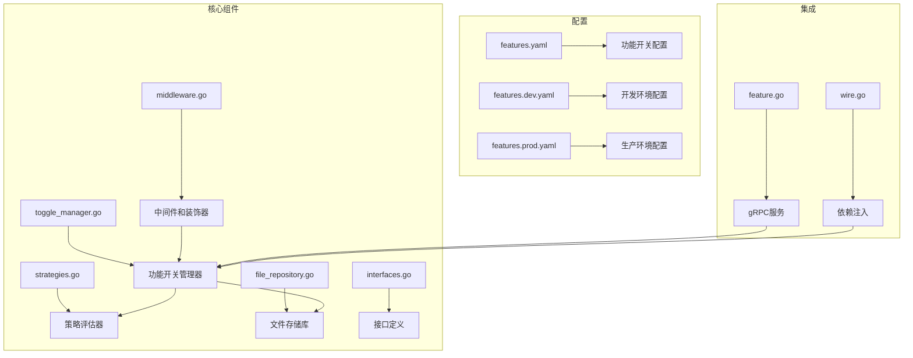
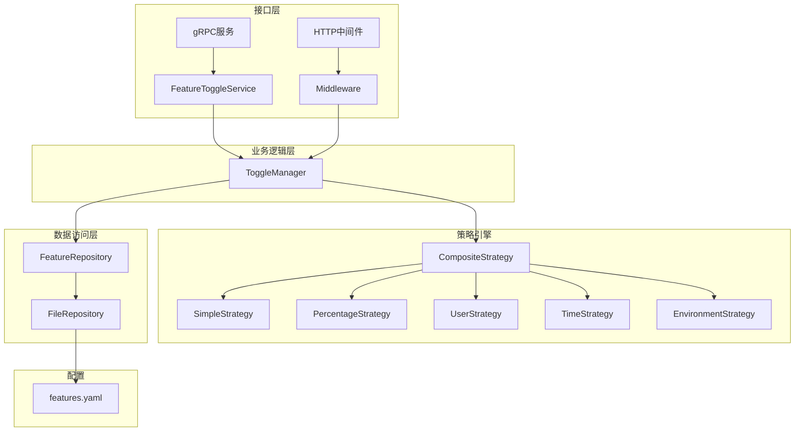
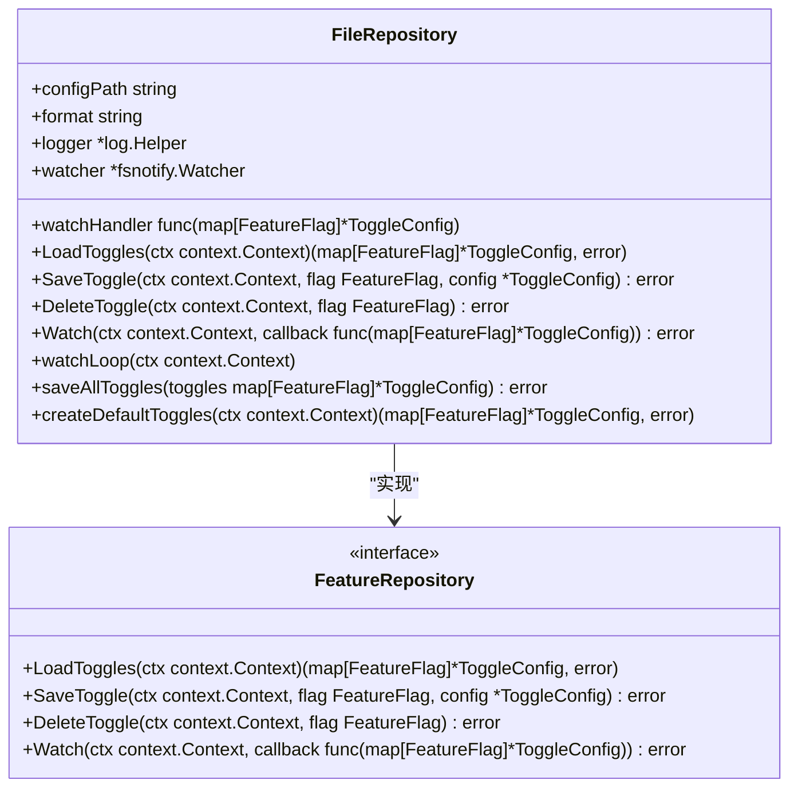
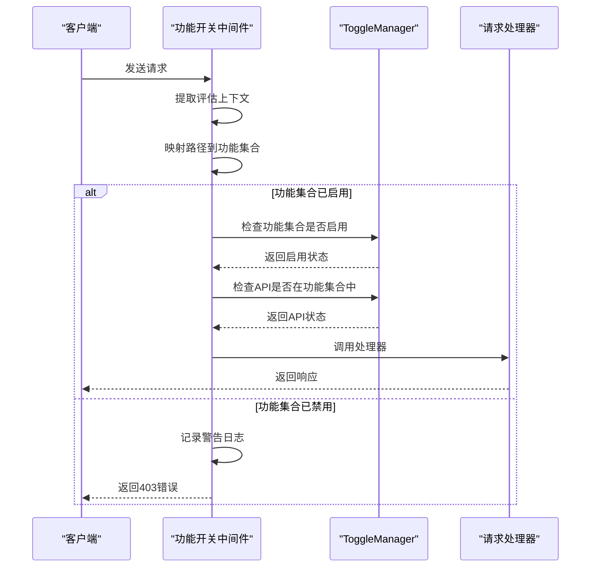
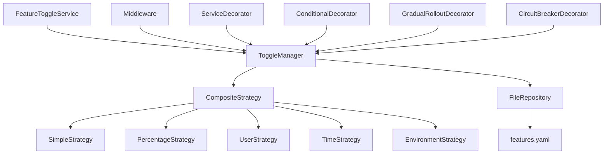

# 功能开关服务

<cite>
**本文档引用文件**   
- [toggle_manager.go](file://internal/pkg/feature/toggle_manager.go)
- [strategies.go](file://internal/pkg/feature/strategies.go)
- [file_repository.go](file://internal/pkg/feature/file_repository.go)
- [interfaces.go](file://internal/pkg/feature/interfaces.go)
- [middleware.go](file://internal/pkg/feature/middleware.go)
- [wire.go](file://internal/pkg/feature/wire.go)
- [features.yaml](file://configs/features.yaml)
- [feature.go](file://internal/service/feature.go)
- [feature.proto](file://api/feature/v1/feature.proto) - *在最近的提交中更新*
</cite>

## 更新摘要
**变更内容**   
- 根据最新的API定义更新了功能开关评估请求和响应的详细说明
- 扩展了服务接口能力的相关文档
- 在相关部分添加了新的源文件引用
- 保持现有架构和组件描述的一致性

## 目录
1. [简介](#简介)
2. [项目结构](#项目结构)
3. [核心组件](#核心组件)
4. [架构概述](#架构概述)
5. [详细组件分析](#详细组件分析)
6. [依赖分析](#依赖分析)
7. [性能考虑](#性能考虑)
8. [故障排除指南](#故障排除指南)
9. [结论](#结论)

## 简介
功能开关服务是一个灵活的特性管理解决方案，允许在运行时动态启用或禁用系统功能。该服务支持多种策略类型，包括简单开关、百分比发布、用户属性、时间和环境策略。通过分层功能集合和能力检查机制，系统能够实现细粒度的访问控制和功能管理。服务提供REST和gRPC接口，支持配置热更新和变更通知，适用于复杂的微服务架构。

## 项目结构
功能开关服务的代码组织遵循清晰的分层架构，核心功能位于`internal/pkg/feature`包中，配置文件存放在`configs`目录下。



**图示来源**
- [toggle_manager.go](file://internal/pkg/feature/toggle_manager.go)
- [file_repository.go](file://internal/pkg/feature/file_repository.go)
- [strategies.go](file://internal/pkg/feature/strategies.go)
- [middleware.go](file://internal/pkg/feature/middleware.go)
- [feature.go](file://internal/service/feature.go)
- [wire.go](file://internal/pkg/feature/wire.go)
- [features.yaml](file://configs/features.yaml)

## 核心组件
功能开关服务的核心组件包括`ToggleManager`、策略引擎、文件仓库和中间件集成。`ToggleManager`是主要的管理器，负责协调所有功能开关操作。策略引擎支持多种评估策略，文件仓库提供持久化存储，中间件集成允许在请求处理链中进行功能检查。

**组件来源**
- [toggle_manager.go](file://internal/pkg/feature/toggle_manager.go#L1-L100)
- [strategies.go](file://internal/pkg/feature/strategies.go#L1-L50)
- [file_repository.go](file://internal/pkg/feature/file_repository.go#L1-L50)
- [middleware.go](file://internal/pkg/feature/middleware.go#L1-L50)

## 架构概述
功能开关服务采用分层架构设计，包含数据访问层、业务逻辑层和接口层。各组件通过清晰的接口进行通信，支持灵活的扩展和替换。



**图示来源**
- [toggle_manager.go](file://internal/pkg/feature/toggle_manager.go#L1-L50)
- [strategies.go](file://internal/pkg/feature/strategies.go#L1-L50)
- [file_repository.go](file://internal/pkg/feature/file_repository.go#L1-L50)
- [middleware.go](file://internal/pkg/feature/middleware.go#L1-L50)
- [feature.go](file://internal/service/feature.go#L1-L50)

## 详细组件分析

### ToggleManager 分析
`ToggleManager`是功能开关服务的核心组件，负责管理所有功能开关的生命周期和状态。

```mermaid
classDiagram
class ToggleManager {
+toggles map[FeatureFlag]*ToggleConfig
+repository FeatureRepository
+strategyEvaluator StrategyEvaluator
+callbacks []ToggleChangeCallback
+logger *log.Helper
+defaultContext *EvaluationContext
+Initialize(ctx context.Context) error
+IsEnabled(ctx context.Context, flag FeatureFlag) bool
+IsEnabledWithContext(ctx context.Context, flag FeatureFlag, evalCtx *EvaluationContext) bool
+GetToggleConfig(flag FeatureFlag) (*ToggleConfig, error)
+UpdateToggle(flag FeatureFlag, config *ToggleConfig) error
+ListToggles() map[FeatureFlag]*ToggleConfig
+Subscribe(callback ToggleChangeCallback) error
+Unsubscribe(callback ToggleChangeCallback) error
+EnableFeature(flag FeatureFlag) error
+DisableFeature(flag FeatureFlag) error
+DeleteToggle(flag FeatureFlag) error
+SetDefaultContext(ctx *EvaluationContext)
+GetStats() map[string]interface{}
+watchConfigChanges(ctx context.Context)
+notifyChange(flag FeatureFlag, oldConfig, newConfig *ToggleConfig)
+configEqual(config1, config2 *ToggleConfig) bool
}
class FeatureRepository {
<<interface>>
+LoadToggles(ctx context.Context) (map[FeatureFlag]*ToggleConfig, error)
+SaveToggle(ctx context.Context, flag FeatureFlag, config *ToggleConfig) error
+DeleteToggle(ctx context.Context, flag FeatureFlag) error
+Watch(ctx context.Context, callback func(map[FeatureFlag]*ToggleConfig)) error
}
class StrategyEvaluator {
<<interface>>
+Evaluate(ctx context.Context, config *ToggleConfig, evalCtx *EvaluationContext) bool
+SupportsStrategy(strategy FeatureStrategy) bool
}
ToggleManager --> FeatureRepository : "依赖"
ToggleManager --> StrategyEvaluator : "依赖"
```

**组件来源**
- [toggle_manager.go](file://internal/pkg/feature/toggle_manager.go#L15-L45)
- [interfaces.go](file://internal/pkg/feature/interfaces.go#L5-L20)

### 策略引擎分析
策略引擎实现了多种功能开关评估策略，支持灵活的条件判断。

```mermaid
classDiagram
class StrategyEvaluator {
<<interface>>
+Evaluate(ctx context.Context, config *ToggleConfig, evalCtx *EvaluationContext) bool
+SupportsStrategy(strategy FeatureStrategy) bool
}
class CompositeStrategy {
+evaluators map[FeatureStrategy]StrategyEvaluator
+Evaluate(ctx context.Context, config *ToggleConfig, evalCtx *EvaluationContext) bool
+SupportsStrategy(strategy FeatureStrategy) bool
+RegisterEvaluator(strategy FeatureStrategy, evaluator StrategyEvaluator)
}
class SimpleStrategy {
+Evaluate(ctx context.Context, config *ToggleConfig, evalCtx *EvaluationContext) bool
+SupportsStrategy(strategy FeatureStrategy) bool
}
class PercentageStrategy {
+Evaluate(ctx context.Context, config *ToggleConfig, evalCtx *EvaluationContext) bool
+SupportsStrategy(strategy FeatureStrategy) bool
}
class UserStrategy {
+Evaluate(ctx context.Context, config *ToggleConfig, evalCtx *EvaluationContext) bool
+SupportsStrategy(strategy FeatureStrategy) bool
}
class TimeStrategy {
+Evaluate(ctx context.Context, config *ToggleConfig, evalCtx *EvaluationContext) bool
+SupportsStrategy(strategy FeatureStrategy) bool
}
class EnvironmentStrategy {
+Evaluate(ctx context.Context, config *ToggleConfig, evalCtx *EvaluationContext) bool
+SupportsStrategy(strategy FeatureStrategy) bool
}
CompositeStrategy --> StrategyEvaluator : "实现"
SimpleStrategy --> StrategyEvaluator : "实现"
PercentageStrategy --> StrategyEvaluator : "实现"
UserStrategy --> StrategyEvaluator : "实现"
TimeStrategy --> StrategyEvaluator : "实现"
EnvironmentStrategy --> StrategyEvaluator : "实现"
CompositeStrategy --> SimpleStrategy : "包含"
CompositeStrategy --> PercentageStrategy : "包含"
CompositeStrategy --> UserStrategy : "包含"
CompositeStrategy --> TimeStrategy : "包含"
CompositeStrategy --> EnvironmentStrategy : "包含"
```



**组件来源**
- [strategies.go](file://internal/pkg/feature/strategies.go#L15-L45)
- [interfaces.go](file://internal/pkg/feature/interfaces.go#L5-L20)

### 文件仓库分析
文件仓库实现了基于文件的功能开关持久化存储，支持YAML和JSON格式。



**组件来源**
- [file_repository.go](file://internal/pkg/feature/file_repository.go#L15-L45)
- [interfaces.go](file://internal/pkg/feature/interfaces.go#L5-L20)

### 中间件集成分析
中间件集成提供了在请求处理链中进行功能开关检查的能力。



**组件来源**
- [middleware.go](file://internal/pkg/feature/middleware.go#L20-L60)
- [toggle_manager.go](file://internal/pkg/feature/toggle_manager.go#L30-L80)

### 服务装饰器模式分析
服务装饰器模式提供了灵活的功能开关应用方式，支持多种装饰模式。

```mermaid
classDiagram
class ServiceDecorator {
+toggleManager HierarchicalFeatureToggle
+logger *log.Helper
+WithFeatureCheck(featurePath string) func(func(context.Context, interface{}) (interface{}, error)) func(context.Context, interface{}) (interface{}, error)
}
class ConditionalDecorator {
+toggleManager HierarchicalFeatureToggle
+logger *log.Helper
+WithAlternative(featurePath string, primaryImpl func(context.Context, interface{}) (interface{}, error), fallbackImpl func(context.Context, interface{}) (interface{}, error)) func(context.Context, interface{}) (interface{}, error)
}
class GradualRolloutDecorator {
+toggleManager HierarchicalFeatureToggle
+logger *log.Helper
+WithRollout(featurePath string, newImpl func(context.Context, interface{}) (interface{}, error), oldImpl func(context.Context, interface{}) (interface{}, error)) func(context.Context, interface{}) (interface{}, error)
}
class CircuitBreakerDecorator {
+toggleManager HierarchicalFeatureToggle
+logger *log.Helper
+WithCircuitBreaker(featurePath string, impl func(context.Context, interface{}) (interface{}, error), fallback func(context.Context, interface{}) (interface{}, error)) func(context.Context, interface{}) (interface{}, error)
}
class FeatureDecorator {
<<interface>>
+Decorate(ctx context.Context, flag FeatureFlag, next func(context.Context) error) error
}
ServiceDecorator --> FeatureDecorator : "实现"
ConditionalDecorator --> FeatureDecorator : "实现"
GradualRolloutDecorator --> FeatureDecorator : "实现"
CircuitBreakerDecorator --> FeatureDecorator : "实现"
```

**组件来源**
- [middleware.go](file://internal/pkg/feature/middleware.go#L15-L45)
- [interfaces.go](file://internal/pkg/feature/interfaces.go#L5-L20)

## 依赖分析
功能开关服务的依赖关系清晰，各组件通过接口进行通信，降低了耦合度。



**组件来源**
- [feature.go](file://internal/service/feature.go#L1-L20)
- [toggle_manager.go](file://internal/pkg/feature/toggle_manager.go#L1-L20)
- [middleware.go](file://internal/pkg/feature/middleware.go#L1-L20)
- [strategies.go](file://internal/pkg/feature/strategies.go#L1-L20)
- [file_repository.go](file://internal/pkg/feature/file_repository.go#L1-L20)
- [features.yaml](file://configs/features.yaml#L1-L10)

## 性能考虑
功能开关服务在设计时考虑了性能因素，采用读写锁保护共享状态，避免在高并发场景下出现性能瓶颈。策略评估操作的时间复杂度为O(1)，配置加载和保存操作通过文件监听机制实现热更新，避免了频繁的磁盘I/O操作。对于高频访问的功能开关检查，建议在应用层添加缓存机制。

## 故障排除指南
当功能开关服务出现问题时，可以按照以下步骤进行排查：

1. 检查配置文件路径和格式是否正确
2. 验证功能开关名称是否匹配
3. 检查策略规则配置是否正确
4. 查看日志中的错误信息
5. 验证依赖组件是否正常工作

**组件来源**
- [toggle_manager.go](file://internal/pkg/feature/toggle_manager.go#L10-L50)
- [file_repository.go](file://internal/pkg/feature/file_repository.go#L10-L50)
- [strategies.go](file://internal/pkg/feature/strategies.go#L10-L50)

## 结论
功能开关服务提供了一个完整、灵活且可扩展的特性管理解决方案。通过分层架构设计和清晰的接口定义，系统能够轻松适应不同的应用场景和需求变化。服务支持多种策略类型和集成方式，能够满足复杂的业务需求。建议在生产环境中使用时，结合监控和告警机制，确保功能开关系统的稳定性和可靠性。