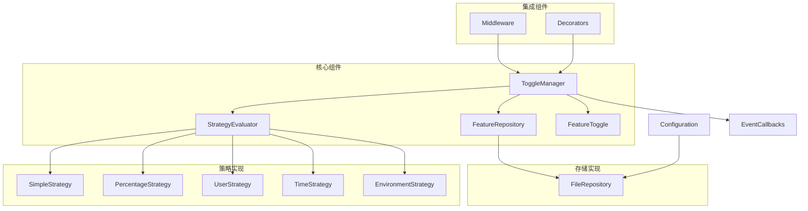
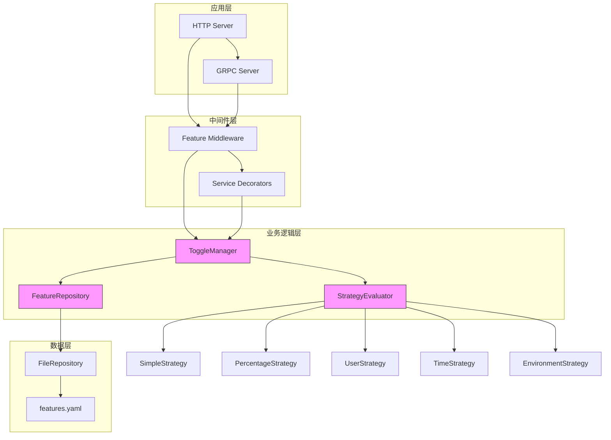
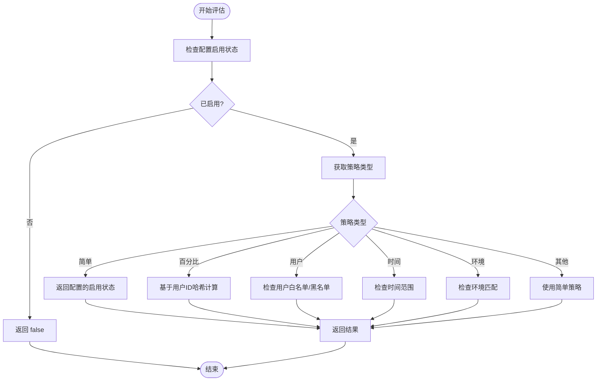
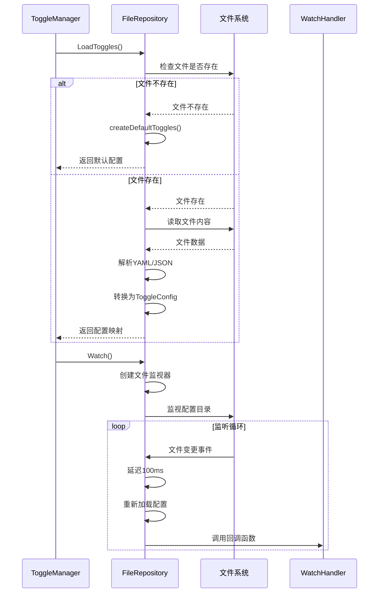
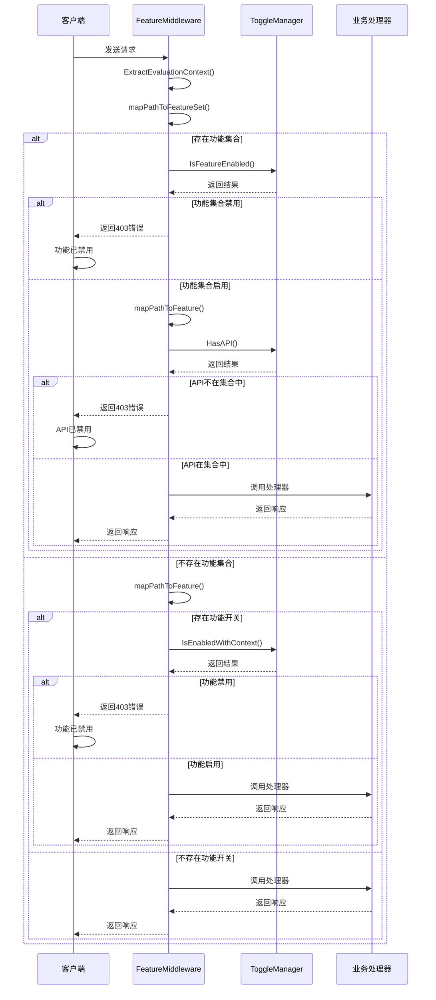
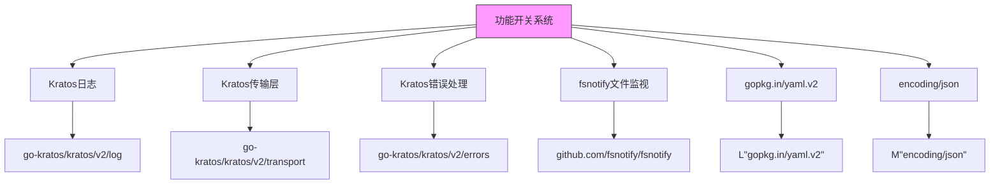

# 功能开关系统

<cite>
**本文档引用文件**   
- [toggle_manager.go](file://internal/pkg/feature/toggle_manager.go)
- [interfaces.go](file://internal/pkg/feature/interfaces.go)
- [strategies.go](file://internal/pkg/feature/strategies.go)
- [file_repository.go](file://internal/pkg/feature/file_repository.go)
- [middleware.go](file://internal/pkg/feature/middleware.go)
- [features.yaml](file://configs/features.yaml)
- [feature.proto](file://api/feature/v1/feature.proto) - *新增API定义*
- [hierarchical_features_demo.go](file://examples/hierarchical_features_demo.go)
</cite>

## 更新摘要
**已做更改**
- 根据最新代码更新了功能策略类型和API接口文档
- 新增了对Proto文件中验证属性的说明
- 更新了核心组件分析以反映最新的枚举类型定义
- 增强了架构概述中的API层描述
- 保持原有文档结构不变，仅更新受影响部分

## 目录
1. [简介](#简介)
2. [项目结构](#项目结构)
3. [核心组件](#核心组件)
4. [架构概述](#架构概述)
5. [详细组件分析](#详细组件分析)
6. [依赖分析](#依赖分析)
7. [性能考虑](#性能考虑)
8. [故障排除指南](#故障排除指南)
9. [结论](#结论)

## 简介
功能开关系统是一个灵活、可扩展的特性管理框架，用于控制应用程序功能的启用和禁用。该系统支持多种策略（简单、百分比、用户定向、时间、环境），提供分层功能集合管理，并支持动态配置和中间件集成。系统设计遵循模块化原则，通过接口定义清晰的职责边界，支持热更新和事件通知机制。

## 项目结构
功能开关系统主要位于`internal/pkg/feature`目录下，配置文件位于`configs`目录。系统采用分层架构，包含接口定义、策略实现、存储管理、中间件集成等组件。



**图示来源**
- [toggle_manager.go](file://internal/pkg/feature/toggle_manager.go#L1-L50)
- [interfaces.go](file://internal/pkg/feature/interfaces.go#L1-L50)
- [strategies.go](file://internal/pkg/feature/strategies.go#L1-L50)
- [file_repository.go](file://internal/pkg/feature/file_repository.go#L1-L50)

**节来源**
- [toggle_manager.go](file://internal/pkg/feature/toggle_manager.go#L1-L100)
- [project_structure](file://#L1-L20)

## 核心组件

功能开关系统的核心组件包括功能开关管理器、策略评估器、存储库和中间件。`ToggleManager`是系统的核心，负责管理所有功能开关的生命周期，包括初始化、状态检查、配置更新和事件通知。`StrategyEvaluator`接口定义了策略评估能力，支持多种策略类型。`FeatureRepository`接口定义了配置持久化机制，当前实现了基于文件的存储。`Middleware`组件提供了与Kratos框架的集成能力。

**节来源**
- [toggle_manager.go](file://internal/pkg/feature/toggle_manager.go#L1-L100)
- [interfaces.go](file://internal/pkg/feature/interfaces.go#L1-L100)

## 架构概述

功能开关系统采用分层架构设计，各组件之间通过明确定义的接口进行通信。系统支持热更新，配置文件变更时会自动重新加载并通知订阅者。架构设计考虑了性能和可扩展性，使用读写锁保护共享状态，确保高并发场景下的线程安全。



**图示来源**
- [toggle_manager.go](file://internal/pkg/feature/toggle_manager.go#L1-L50)
- [middleware.go](file://internal/pkg/feature/middleware.go#L1-L50)
- [strategies.go](file://internal/pkg/feature/strategies.go#L1-L50)
- [file_repository.go](file://internal/pkg/feature/file_repository.go#L1-L50)

## 详细组件分析

### 功能开关管理器分析
`ToggleManager`是功能开关系统的核心组件，负责管理所有功能开关的状态和配置。它提供了丰富的API用于功能状态检查、配置管理、事件订阅等。

#### 类图
```mermaid
classDiagram
class ToggleManager {
+mu sync.RWMutex
+toggles map[FeatureFlag]*ToggleConfig
+repository FeatureRepository
+strategyEvaluator StrategyEvaluator
+callbacks []ToggleChangeCallback
+logger *log.Helper
+defaultContext *EvaluationContext
+Initialize(ctx context.Context) error
+IsEnabled(ctx context.Context, flag FeatureFlag) bool
+IsEnabledWithContext(ctx context.Context, flag FeatureFlag, evalCtx *EvaluationContext) bool
+GetToggleConfig(flag FeatureFlag) (*ToggleConfig, error)
+UpdateToggle(flag FeatureFlag, config *ToggleConfig) error
+ListToggles() map[FeatureFlag]*ToggleConfig
+Subscribe(callback ToggleChangeCallback) error
+Unsubscribe(callback ToggleChangeCallback) error
+EnableFeature(flag FeatureFlag) error
+DisableFeature(flag FeatureFlag) error
+DeleteToggle(flag FeatureFlag) error
+SetDefaultContext(ctx *EvaluationContext)
+GetStats() map[string]interface{}
+IsFeatureEnabled(featurePath string) bool
+IsDomainEnabled(domain string) bool
+GetDomainFeatures(domain string) []string
+GetFeatureTree() map[string][]string
+HasPermission(featurePath, permission string) bool
+HasAPI(featurePath, api string) bool
+HasRoute(featurePath, route string) bool
+HasConfig(featurePath, config string) bool
+HasAuditLog(featurePath, logType string) bool
+IsAnyFeatureEnabled(featurePaths ...string) bool
+AreAllFeaturesEnabled(featurePaths ...string) bool
+GetFeatureCapabilities(featurePath string) *FeatureCapabilities
+ExportCSV() ([]byte, error)
+watchConfigChanges(ctx context.Context) error
+notifyChange(flag FeatureFlag, oldConfig, newConfig *ToggleConfig)
+configEqual(config1, config2 *ToggleConfig) bool
}
class FeatureRepository {
<<interface>>
+LoadToggles(ctx context.Context) (map[FeatureFlag]*ToggleConfig, error)
+SaveToggle(ctx context.Context, flag FeatureFlag, config *ToggleConfig) error
+DeleteToggle(ctx context.Context, flag FeatureFlag) error
+Watch(ctx context.Context, callback func(map[FeatureFlag]*ToggleConfig)) error
}
class StrategyEvaluator {
<<interface>>
+Evaluate(ctx context.Context, config *ToggleConfig, evalCtx *EvaluationContext) bool
+SupportsStrategy(strategy FeatureStrategy) bool
}
ToggleManager --> FeatureRepository : "uses"
ToggleManager --> StrategyEvaluator : "uses"
```

**图示来源**
- [toggle_manager.go](file://internal/pkg/feature/toggle_manager.go#L15-L45)
- [interfaces.go](file://internal/pkg/feature/interfaces.go#L5-L20)

**节来源**
- [toggle_manager.go](file://internal/pkg/feature/toggle_manager.go#L1-L643)

### 策略评估器分析
策略评估器系统支持多种功能开关策略，包括简单开关、百分比发布、用户定向、时间控制和环境控制。`CompositeStrategy`作为策略工厂，管理所有具体策略实现。

#### 策略评估流程图


**图示来源**
- [strategies.go](file://internal/pkg/feature/strategies.go#L1-L278)

**节来源**
- [strategies.go](file://internal/pkg/feature/strategies.go#L1-L278)

### 存储库分析
`FileRepository`实现了基于文件的功能开关存储，支持YAML和JSON格式。它使用文件系统监视器实现配置热更新，确保配置变更能够实时生效。

#### 配置加载序列图


**图示来源**
- [file_repository.go](file://internal/pkg/feature/file_repository.go#L1-L595)

**节来源**
- [file_repository.go](file://internal/pkg/feature/file_repository.go#L1-L595)

### 中间件集成分析
功能开关中间件与Kratos框架集成，自动检查请求路径对应的功能开关状态，实现细粒度的访问控制。

#### 请求处理序列图


**图示来源**
- [middleware.go](file://internal/pkg/feature/middleware.go#L1-L320)

**节来源**
- [middleware.go](file://internal/pkg/feature/middleware.go#L1-L320)

## 依赖分析

功能开关系统依赖于Kratos框架的核心组件，包括日志、传输层和错误处理。系统通过接口定义与外部组件解耦，支持灵活的扩展和替换。



**图示来源**
- [go.mod](file://go.mod#L1-L20)
- [toggle_manager.go](file://internal/pkg/feature/toggle_manager.go#L1-L15)

**节来源**
- [go.mod](file://go.mod#L1-L30)
- [toggle_manager.go](file://internal/pkg/feature/toggle_manager.go#L1-L50)

## 性能考虑

功能开关系统在设计时充分考虑了性能因素：
1. 使用读写锁(`sync.RWMutex`)保护共享状态，允许多个读操作并发执行
2. 配置存储在内存中，状态检查为O(1)时间复杂度
3. 采用延迟写入策略，配置更新时先更新内存再异步保存到文件
4. 使用文件系统监视器实现热更新，避免轮询带来的性能开销
5. 提供批量检查方法(`IsAnyFeatureEnabled`, `AreAllFeaturesEnabled`)，减少重复评估

在高并发场景下，建议：
- 避免频繁更新配置
- 合理使用缓存机制
- 监控配置变更频率
- 定期清理不再使用的功能开关

## 故障排除指南

### 常见问题及解决方案

**问题1：配置变更未生效**
- 检查文件路径是否正确
- 确认文件格式(YAML/JSON)是否匹配配置
- 查看日志是否有文件监视错误
- 确保目录有读写权限

**问题2：功能开关状态不正确**
- 检查评估上下文是否正确传递
- 验证策略配置是否符合预期
- 查看日志中的评估结果详情
- 使用`GetStats()`方法检查整体状态

**问题3：性能下降**
- 检查是否有频繁的配置更新
- 监控文件I/O操作
- 评估策略复杂度是否过高
- 考虑增加缓存层

### 调试工具
系统提供了多种调试工具：
- `GetStats()`：获取功能开关统计信息
- `ExportCSV()`：导出功能集合信息为CSV格式
- 详细的日志记录：包含评估过程和结果
- 事件回调机制：可用于监控配置变更

**节来源**
- [toggle_manager.go](file://internal/pkg/feature/toggle_manager.go#L1-L50)
- [file_repository.go](file://internal/pkg/feature/file_repository.go#L1-L50)

## 结论

功能开关系统提供了一个完整、灵活且高性能的特性管理解决方案。系统支持多种策略类型，满足不同场景的需求；通过分层功能集合管理，实现了细粒度的权限控制；基于文件的存储和热更新机制，确保了配置的灵活性和实时性；与Kratos框架的深度集成，简化了使用和部署。系统设计遵循良好的软件工程实践，具有良好的可扩展性和可维护性，适合在生产环境中使用。