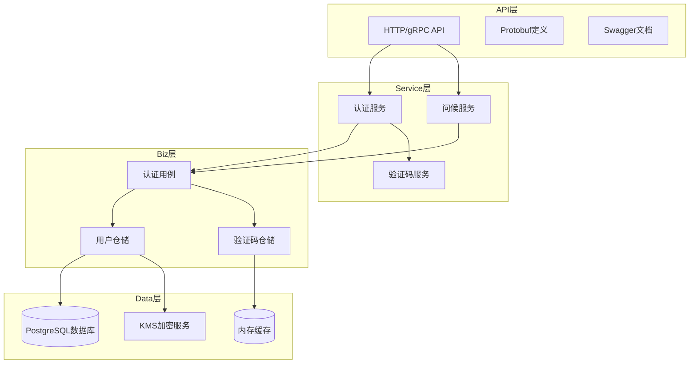
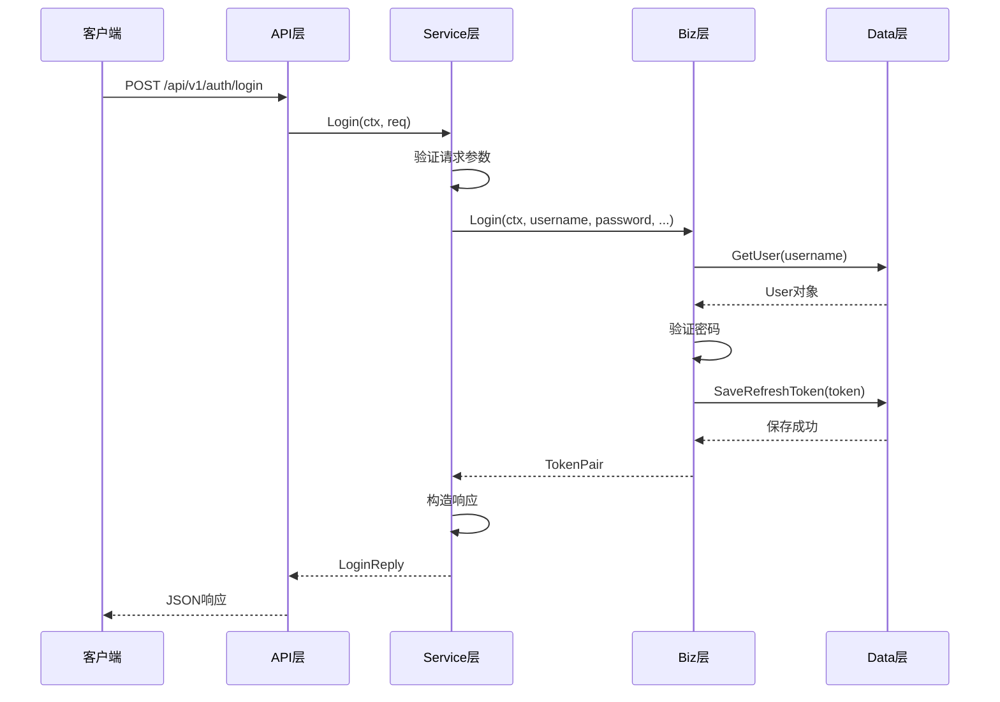
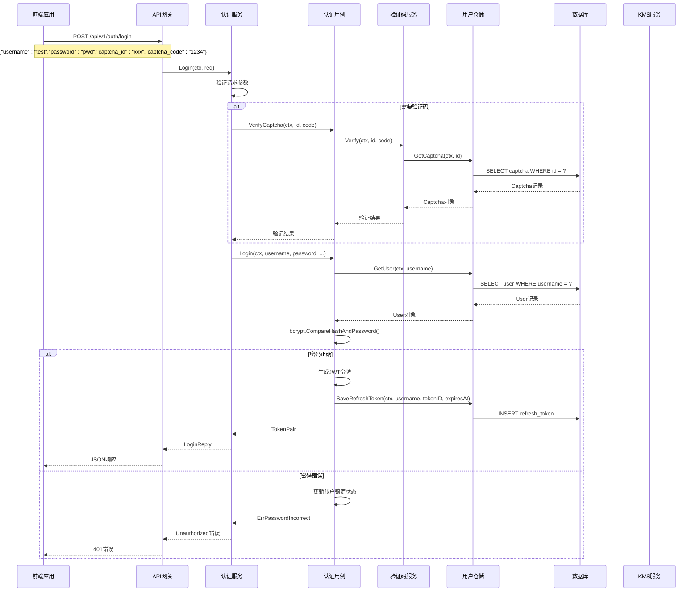
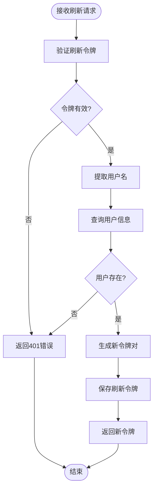
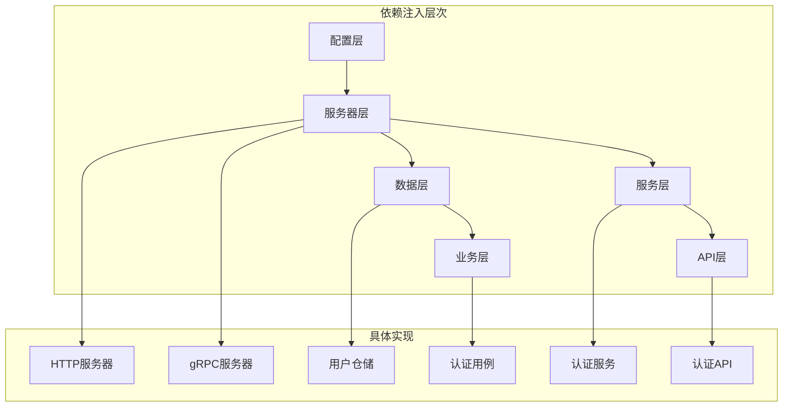

# DDD分层架构详解

<cite>
**本文档引用的文件**
- [api/auth/v1/auth.proto](file://api/auth/v1/auth.proto)
- [internal/service/auth.go](file://internal/service/auth.go)
- [internal/biz/auth.go](file://internal/biz/auth.go)
- [internal/data/auth.go](file://internal/data/auth.go)
- [cmd/kratos-boilerplate/main.go](file://cmd/kratos-boilerplate/main.go)
- [cmd/kratos-boilerplate/wire.go](file://cmd/kratos-boilerplate/wire.go)
- [internal/server/http.go](file://internal/server/http.go)
- [internal/server/grpc.go](file://internal/server/grpc.go)
- [frontend/src/api/auth.ts](file://frontend/src/api/auth.ts)
- [test/bdd/auth/auth_bdd_test.go](file://test/bdd/auth/auth_bdd_test.go)
</cite>

## 目录
1. [项目概述](#项目概述)
2. [DDD四层架构概览](#ddd四层架构概览)
3. [API层详解](#api层详解)
4. [Service层详解](#service层详解)
5. [Biz层详解](#biz层详解)
6. [Data层详解](#data层详解)
7. [Protobuf契约与gRPC生成](#protobuf契约与grpc生成)
8. [认证流程完整分析](#认证流程完整分析)
9. [依赖注入与架构协作](#依赖注入与架构协作)
10. [性能优化与最佳实践](#性能优化与最佳实践)
11. [总结](#总结)

## 项目概述

本项目是一个基于Kratos框架的现代化微服务架构应用，采用了领域驱动设计（DDD）的四层架构模式。项目通过清晰的分层结构实现了关注点分离，确保了代码的可维护性、可测试性和扩展性。

项目的核心功能围绕用户认证展开，包括验证码生成与验证、用户注册、登录、注销、令牌刷新等功能。整个架构严格遵循DDD原则，将业务逻辑与基础设施分离，实现了高度解耦的设计。

## DDD四层架构概览



**图表来源**
- [internal/server/http.go](file://internal/server/http.go#L1-L37)
- [internal/server/grpc.go](file://internal/server/grpc.go#L1-L35)
- [internal/service/auth.go](file://internal/service/auth.go#L1-L50)

## API层详解

API层负责处理外部请求，提供HTTP和gRPC两种协议的支持。该层的主要职责包括：

### Protobuf契约定义

项目使用Protobuf作为API契约定义语言，通过`.proto`文件明确描述了服务接口和数据结构：

```protobuf
// 认证服务接口定义
service Auth {
  // 获取验证码
  rpc GetCaptcha(GetCaptchaRequest) returns (GetCaptchaReply) {
    option (google.api.http) = {
      get: "/api/v1/auth/captcha"
    };
  }
  
  // 用户登录
  rpc Login(LoginRequest) returns (LoginReply) {
    option (google.api.http) = {
      post: "/api/v1/auth/login"
      body: "*"
    };
  }
}
```

### HTTP与gRPC统一处理

API层通过Kratos框架的统一接口处理HTTP和gRPC请求：

```go
// HTTP服务器配置
func NewHTTPServer(c *conf.Server, greeter *service.GreeterService, auth *service.AuthService, logger log.Logger) *http.Server {
    var opts = []http.ServerOption{
        http.Middleware(
            recovery.Recovery(),
        ),
    }
    srv := http.NewServer(opts...)
    v1.RegisterGreeterHTTPServer(srv, greeter)
    authv1.RegisterAuthHTTPServer(srv, auth)
    return srv
}
```

### 错误处理与状态码映射

API层将业务层的错误转换为适当的HTTP状态码：

```go
// 登录接口的错误处理
func (s *AuthService) Login(ctx context.Context, req *v1.LoginRequest) (*v1.LoginReply, error) {
    tokenPair, err := s.uc.Login(ctx, req.Username, req.Password, req.CaptchaId, req.CaptchaCode, req.TotpCode)
    if err != nil {
        switch err {
        case biz.ErrUserNotFound:
            return nil, errors.NotFound("USER_NOT_FOUND", "用户不存在")
        case biz.ErrPasswordIncorrect:
            return nil, errors.Unauthorized("PASSWORD_INCORRECT", "密码错误")
        case biz.ErrAccountLocked:
            return nil, errors.Forbidden("ACCOUNT_LOCKED", "账户已锁定")
        default:
            return nil, errors.InternalServer("LOGIN_ERROR", err.Error())
        }
    }
    // ...
}
```

**章节来源**
- [api/auth/v1/auth.proto](file://api/auth/v1/auth.proto#L1-L235)
- [internal/server/http.go](file://internal/server/http.go#L1-L37)
- [internal/service/auth.go](file://internal/service/auth.go#L75-L120)

## Service层详解

Service层是业务逻辑的协调者，负责编排用例执行，连接API层和Biz层。该层的核心职责包括：

### 服务结构设计

```go
type AuthService struct {
    v1.UnimplementedAuthServer
    uc  biz.AuthUsecase
    log *log.Helper
}

func NewAuthService(uc biz.AuthUsecase, logger log.Logger) *AuthService {
    return &AuthService{
        uc:  uc,
        log: log.NewHelper(logger),
    }
}
```

### 用例编排与上下文传递

Service层通过AuthUsecase接口协调各种业务用例：



**图表来源**
- [internal/service/auth.go](file://internal/service/auth.go#L75-L120)
- [internal/biz/auth.go](file://internal/biz/auth.go#L1-L100)

### 中间件集成

Service层集成了多种中间件来增强功能：

```go
// HTTP服务器中间件配置
srv := http.NewServer(
    http.Middleware(
        recovery.Recovery(),
        middleware.OperationLogMiddleware(repo), // 操作日志中间件
    ),
)
```

**章节来源**
- [internal/service/auth.go](file://internal/service/auth.go#L1-L235)
- [internal/server/http.go](file://internal/server/http.go#L15-L25)

## Biz层详解

Biz层是领域逻辑的核心，封装了所有业务规则和用例实现。该层的设计遵循DDD原则，实现了高度内聚和低耦合：

### 用例接口设计

```go
type AuthUsecase interface {
    GetCaptcha(ctx context.Context, captchaType, target string) (*Captcha, error)
    VerifyCaptcha(ctx context.Context, captchaID, captchaCode string) (bool, error)
    Register(ctx context.Context, username, password, email, phone, captchaID, captchaCode string) error
    Login(ctx context.Context, username, password, captchaID, captchaCode, totpCode string) (*TokenPair, error)
    Logout(ctx context.Context, token string) error
    RefreshToken(ctx context.Context, refreshToken string) (*TokenPair, error)
}
```

### 核心业务规则实现

#### 密码验证规则

```go
func (u *authUsecase) Login(ctx context.Context, username, password, captchaID, captchaCode, totpCode string) (*TokenPair, error) {
    // 1. 验证验证码
    valid, err := u.captchaService.Verify(ctx, captchaID, captchaCode)
    if err != nil {
        return nil, err
    }
    if !valid {
        return nil, biz.ErrCaptchaInvalid
    }
    
    // 2. 获取用户信息
    user, err := u.userRepo.GetUser(ctx, username)
    if err != nil {
        return nil, err
    }
    
    // 3. 验证密码
    if !bcrypt.CompareHashAndPassword([]byte(user.Password), []byte(password)) {
        // 更新账户锁定状态
        return nil, biz.ErrPasswordIncorrect
    }
    
    // 4. 生成JWT令牌
    accessToken, refreshToken, err := u.generateTokens(ctx, user)
    if err != nil {
        return nil, err
    }
    
    return &TokenPair{
        AccessToken:  accessToken,
        RefreshToken: refreshToken,
        ExpiresIn:    int64(u.config.AccessTokenExpiration.Seconds()),
    }, nil
}
```

#### 账户锁定机制

```go
type AccountLock struct {
    Username       string
    FailedAttempts int32
    LockUntil      time.Time
    LastAttempt    time.Time
}

func (u *authUsecase) updateAccountLock(ctx context.Context, username string, success bool) error {
    lock, err := u.userRepo.GetLock(ctx, username)
    if err != nil && err != biz.ErrUserNotFound {
        return err
    }
    
    if lock == nil {
        lock = &AccountLock{
            Username: username,
            FailedAttempts: 0,
            LockUntil: time.Now(),
        }
    }
    
    if success {
        // 成功登录，重置锁定状态
        lock.FailedAttempts = 0
        lock.LockUntil = time.Now()
        return u.userRepo.SaveLock(ctx, lock)
    }
    
    // 失败登录，增加尝试次数
    lock.FailedAttempts++
    lock.LastAttempt = time.Now()
    
    if lock.FailedAttempts >= u.config.MaxLoginAttempts {
        lock.LockUntil = time.Now().Add(u.config.LockDuration)
    }
    
    return u.userRepo.SaveLock(ctx, lock)
}
```

### 数据模型设计

```mermaid
classDiagram
class User {
+int64 ID
+string Username
+string Password
+string Email
+string Phone
+string Name
+string TotpSecret
+time.Time CreatedAt
+time.Time UpdatedAt
+GetSensitiveFields() []string
+Anonymize() interface{}
+LogSafeString() string
}
class Captcha {
+string ID
+string Code
+string Type
+string Target
+time.Time ExpireAt
+bool Used
}
class TokenPair {
+string AccessToken
+string RefreshToken
+int64 ExpiresIn
}
class AccountLock {
+string Username
+int32 FailedAttempts
+time.Time LockUntil
+time.Time LastAttempt
}
User --> Captcha : "关联"
User --> TokenPair : "生成"
User --> AccountLock : "锁定"
```

**图表来源**
- [internal/biz/auth.go](file://internal/biz/auth.go#L30-L100)

**章节来源**
- [internal/biz/auth.go](file://internal/biz/auth.go#L1-L695)

## Data层详解

Data层负责数据持久化和存储操作，通过仓储模式抽象了数据访问逻辑：

### 仓储接口设计

```go
type UserRepo interface {
    CreateUser(ctx context.Context, user *User) error
    GetUser(ctx context.Context, username string) (*User, error)
    GetUserByEmail(ctx context.Context, email string) (*User, error)
    GetUserByPhone(ctx context.Context, phone string) (*User, error)
    UpdateUser(ctx context.Context, user *User) error
    
    // 账户锁定相关
    GetLock(ctx context.Context, username string) (*AccountLock, error)
    SaveLock(ctx context.Context, lock *AccountLock) error
    RemoveLock(ctx context.Context, username string) error
    
    // 令牌相关
    SaveRefreshToken(ctx context.Context, username, tokenID string, expiresAt time.Time) error
    GetRefreshToken(ctx context.Context, tokenID string) (string, bool, error)
    InvalidateRefreshToken(ctx context.Context, tokenID string) error
    InvalidateAllRefreshTokens(ctx context.Context, username string) error
    
    // 验证码相关
    SaveCaptcha(ctx context.Context, captcha *Captcha) error
    GetCaptcha(ctx context.Context, captchaID string) (*Captcha, error)
    MarkCaptchaUsed(ctx context.Context, captchaID string) error
}
```

### 数据库操作实现

```go
func (r *userRepo) CreateUser(ctx context.Context, u *biz.User) error {
    // 加密敏感信息
    emailEnc, err := r.enc.Encrypt([]byte(u.Email))
    if err != nil {
        return err
    }
    emailHash := r.enc.Hash([]byte(u.Email))
    
    phoneEnc, err := r.enc.Encrypt([]byte(u.Phone))
    if err != nil {
        return err
    }
    phoneHash := r.enc.Hash([]byte(u.Phone))
    
    query := `
        INSERT INTO users (
            username, password, 
            email_encrypted, email_hash,
            phone_encrypted, phone_hash,
            name_encrypted, name_hash,
            created_at, updated_at
        ) VALUES ($1, $2, $3, $4, $5, $6, $7, $8, $9, $10)
        RETURNING id
    `
    err = r.data.db.QueryRowContext(ctx, query,
        u.Username, u.Password,
        emailEnc, emailHash,
        phoneEnc, phoneHash,
        nameEnc, nameHash,
        time.Now(), time.Now(),
    ).Scan(&u.ID)
    return err
}
```

### KMS加密集成

```go
// KMS加密器包装，实现crypto.Encryptor接口
type kmsEncryptorWrapper struct {
    cryptoService kms.CryptoService
}

func (w *kmsEncryptorWrapper) Encrypt(data []byte) ([]byte, error) {
    encryptedField, err := w.cryptoService.EncryptField(context.Background(), "user_data", data)
    if err != nil {
        return nil, err
    }
    
    // 将加密结果序列化为字节数组
    return []byte(fmt.Sprintf("%s:%s:%x", encryptedField.Version, encryptedField.Algorithm, encryptedField.Value)), nil
}
```

### 缓存策略

```go
type userRepo struct {
    data *Data
    log  *log.Helper
    enc  crypto.Encryptor
    kms  kms.KMSManager
    
    // 内存存储验证码和账户锁定信息
    captchas      sync.Map // map[captchaID]*biz.Captcha
    accountLocks  sync.Map // map[username]*biz.AccountLock
    refreshTokens sync.Map // map[tokenID]struct{tokenUsername string, used bool}
}
```

**章节来源**
- [internal/data/auth.go](file://internal/data/auth.go#L1-L438)

## Protobuf契约与gRPC生成

### Protobuf定义规范

项目使用Protobuf作为API契约定义语言，通过`.proto`文件明确定义了服务接口和数据结构：

```protobuf
// 登录请求
message LoginRequest {
  // 用户名，可以是注册时的用户名、邮箱或手机号
  string username = 1;
  
  // 用户密码
  string password = 2;
  
  // 验证码ID，从GetCaptcha接口获取
  string captcha_id = 3;
  
  // 验证码内容，对应captcha_id的验证码
  string captcha_code = 4;
  
  // TOTP双因子认证码
  string totp_code = 5;
}

// 登录响应
message LoginReply {
  // 访问令牌，用于API调用时的身份验证
  string access_token = 1;
  
  // 刷新令牌，用于获取新的访问令牌
  string refresh_token = 2;
  
  // 访问令牌过期时间，单位为秒
  int64 expires_in = 3;
}
```

### Kratos工具链生成

Kratos框架提供了完整的工具链来自动生成gRPC和HTTP服务桩代码：

```bash
# 生成gRPC服务代码
kratos proto server api/auth/v1/auth.proto

# 生成HTTP服务代码
kratos proto client api/auth/v1/auth.proto
```

### 协议绑定

Protobuf定义中的HTTP绑定注解将gRPC服务映射到RESTful API：

```protobuf
rpc Login(LoginRequest) returns (LoginReply) {
    option (google.api.http) = {
        post: "/api/v1/auth/login"
        body: "*"
    };
}
```

这使得同一个服务既可以作为gRPC服务运行，也可以作为HTTP RESTful API运行，实现了协议的统一。

**章节来源**
- [api/auth/v1/auth.proto](file://api/auth/v1/auth.proto#L1-L235)

## 认证流程完整分析

### 登录流程序列图



**图表来源**
- [internal/service/auth.go](file://internal/service/auth.go#L75-L120)
- [internal/biz/auth.go](file://internal/biz/auth.go#L150-L250)

### 注册流程分析

注册流程展示了Biz层如何封装复杂的业务规则：

```go
func (u *authUsecase) Register(ctx context.Context, username, password, email, phone, captchaID, captchaCode string) error {
    // 1. 验证验证码
    valid, err := u.captchaService.Verify(ctx, captchaID, captchaCode)
    if err != nil {
        return err
    }
    if !valid {
        return biz.ErrCaptchaInvalid
    }
    
    // 2. 检查用户名是否已存在
    _, err = u.userRepo.GetUser(ctx, username)
    if err == nil {
        return biz.ErrUserExists
    }
    
    // 3. 检查邮箱是否已存在
    _, err = u.userRepo.GetUserByEmail(ctx, email)
    if err == nil {
        return biz.ErrUserExists
    }
    
    // 4. 检查手机号是否已存在
    if phone != "" {
        _, err = u.userRepo.GetUserByPhone(ctx, phone)
        if err == nil {
            return biz.ErrUserExists
        }
    }
    
    // 5. 密码强度验证
    if !u.validatePassword(password) {
        return errors.New("密码不符合安全要求")
    }
    
    // 6. 创建用户
    hashedPassword, err := bcrypt.GenerateFromPassword([]byte(password), bcrypt.DefaultCost)
    if err != nil {
        return err
    }
    
    user := &biz.User{
        Username: username,
        Password: string(hashedPassword),
        Email:    email,
        Phone:    phone,
        Name:     username,
    }
    
    return u.userRepo.CreateUser(ctx, user)
}
```

### 令牌刷新流程



**图表来源**
- [internal/service/auth.go](file://internal/service/auth.go#L150-L180)

**章节来源**
- [internal/service/auth.go](file://internal/service/auth.go#L75-L200)
- [internal/biz/auth.go](file://internal/biz/auth.go#L150-L300)

## 依赖注入与架构协作

### Wire依赖注入配置

项目使用Google的Wire库实现依赖注入，通过ProviderSet组织各个层次的组件：

```go
// wireApp init kratos application.
func wireApp(*conf.Server, *conf.Data, *conf.Auth, *conf.Bootstrap, log.Logger) (*kratos.App, func(), error) {
    wire.Build(server.ProviderSet, data.ProviderSet, biz.ProviderSet, service.ProviderSet, newApp)
    return nil, nil, nil
}

// 服务器提供者集合
var ProviderSet = wire.NewSet(NewGRPCServer, NewHTTPServer)
```

### 组件协作关系



**图表来源**
- [cmd/kratos-boilerplate/wire.go](file://cmd/kratos-boilerplate/wire.go#L1-L25)
- [internal/server/server.go](file://internal/server/server.go#L1-L9)

### 测试友好设计

通过依赖注入，项目实现了高度可测试的架构：

```go
// BDD测试中的依赖注入
func TestAuthServiceBDD(t *testing.T) {
    var (
        testSuite *shared.TestSuite
        mocks     *shared.MockRepositories
        ctx       context.Context
    )

    BeforeEach(func() {
        testSuite = shared.BeforeEachSetup()
        mocks = testSuite.SetupWithMocks()
        ctx = testSuite.Ctx
    })
    
    It("应该返回访问令牌", func() {
        // 设置Mock期望
        mocks.UserRepo.On("GetUser", ctx, "testuser").Return(user, nil)
        mocks.UserRepo.On("GetLock", ctx, "testuser").Return(nil, biz.ErrUserNotFound)
        mocks.CaptchaService.On("Verify", ctx, "captcha-123", "123456").Return(true, nil)
        
        // 执行测试
        response, err := testSuite.Services.AuthService.Login(ctx, loginReq)
        // 验证结果...
    })
}
```

**章节来源**
- [cmd/kratos-boilerplate/wire.go](file://cmd/kratos-boilerplate/wire.go#L1-L25)
- [test/bdd/auth/auth_bdd_test.go](file://test/bdd/auth/auth_bdd_test.go#L1-L100)

## 性能优化与最佳实践

### 缓存策略

项目在Data层实现了多级缓存策略：

```go
type userRepo struct {
    // 内存缓存
    captchas      sync.Map // 验证码缓存
    accountLocks  sync.Map // 账户锁定状态缓存
    refreshTokens sync.Map // 刷新令牌缓存
    
    // 数据库持久化
    data *Data
    log  *log.Helper
}
```

### 异步处理

对于非关键路径的操作，采用异步处理提升性能：

```go
// 异步记录操作日志
func (s *operationLogMiddleware) handler(next http.Handler) http.Handler {
    return http.HandlerFunc(func(w http.ResponseWriter, r *http.Request) {
        // 异步处理
        go func() {
            defer func() {
                if err := recover(); err != nil {
                    s.log.Errorf("操作日志记录失败: %v", err)
                }
            }()
            
            // 记录操作日志的逻辑
            s.recordOperation(r)
        }()
        
        next.ServeHTTP(w, r)
    })
}
```

### 连接池优化

```go
// 数据库连接池配置
db, err := sql.Open("postgres", connectionString)
if err != nil {
    return nil, err
}

// 设置连接池参数
db.SetMaxOpenConns(25)
db.SetMaxIdleConns(5)
db.SetConnMaxLifetime(time.Hour)
```

### 监控与追踪

项目集成了完整的监控体系：

```go
// 分布式追踪
tracer := otel.Tracer("kratos-boilerplate")

// 日志结构化
logger := log.With(log.NewStdLogger(os.Stdout),
    "ts", log.DefaultTimestamp,
    "caller", log.DefaultCaller,
    "service.id", id,
    "service.name", Name,
    "service.version", Version,
    "trace.id", tracing.TraceID(),
    "span.id", tracing.SpanID(),
)
```

## 总结

本项目通过DDD四层架构实现了高度模块化和可维护的系统设计：

### 架构优势

1. **清晰的职责分离**：每层都有明确的职责边界，便于理解和维护
2. **高度可测试性**：通过依赖注入和接口抽象，实现了单元测试和集成测试
3. **协议统一**：Protobuf契约定义实现了gRPC和HTTP的统一
4. **安全性保障**：KMS加密、密码哈希、账户锁定等多重安全机制
5. **性能优化**：缓存策略、连接池、异步处理等性能优化措施

### 技术亮点

- **领域驱动设计**：严格遵循DDD原则，实现了业务逻辑与技术实现的分离
- **现代微服务架构**：基于Kratos框架，支持云原生部署
- **全栈开发**：前后端分离，完整的认证流程覆盖
- **测试驱动开发**：BDD测试、单元测试、集成测试全覆盖

### 应用价值

该项目不仅是一个认证系统的实现，更是DDD架构理念的完美体现。它展示了如何通过合理的分层设计、清晰的接口定义和完善的测试体系，构建出高质量、可维护的企业级应用。

这种架构模式特别适合需要长期演进、多人协作的大型项目，能够有效降低系统复杂度，提高开发效率和代码质量。