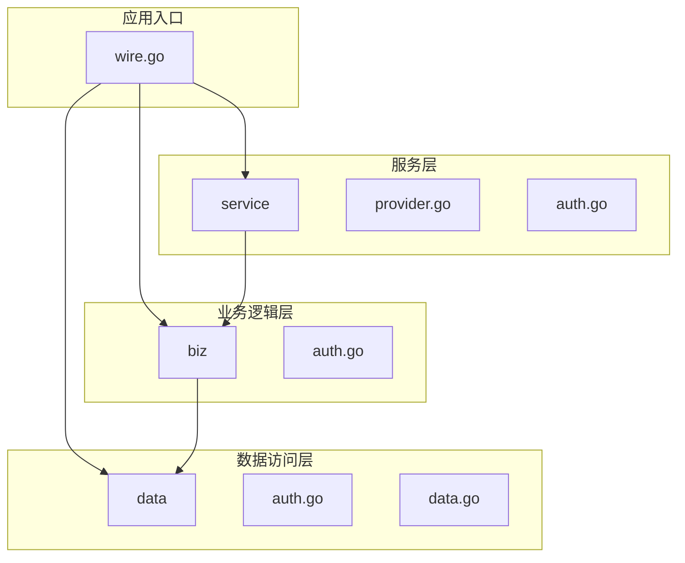
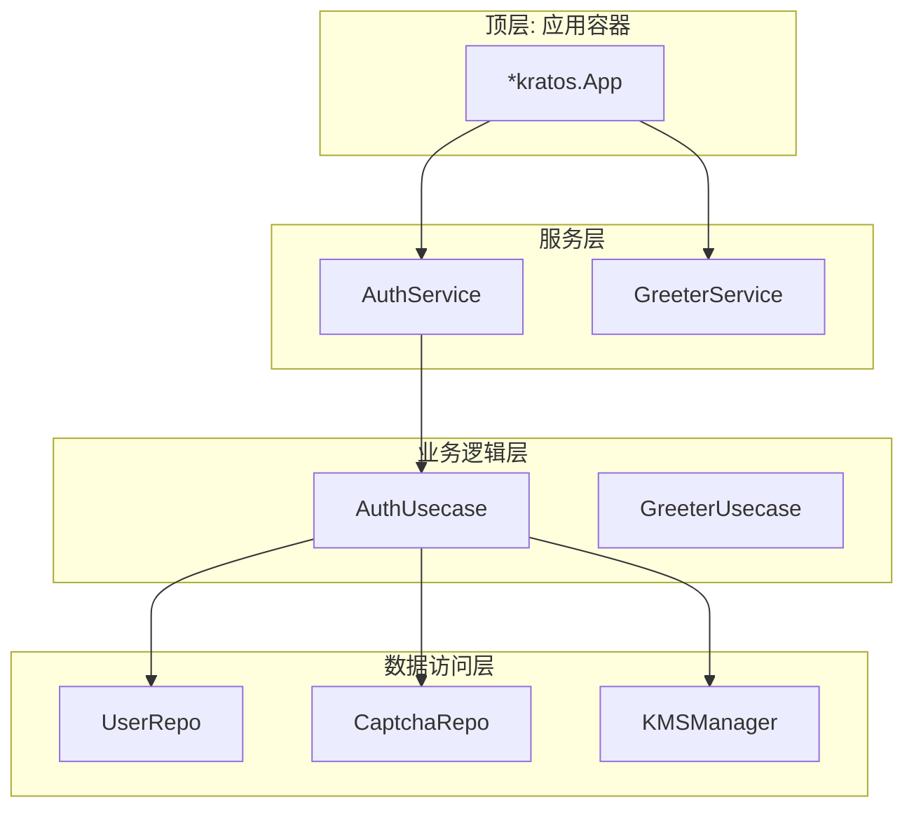
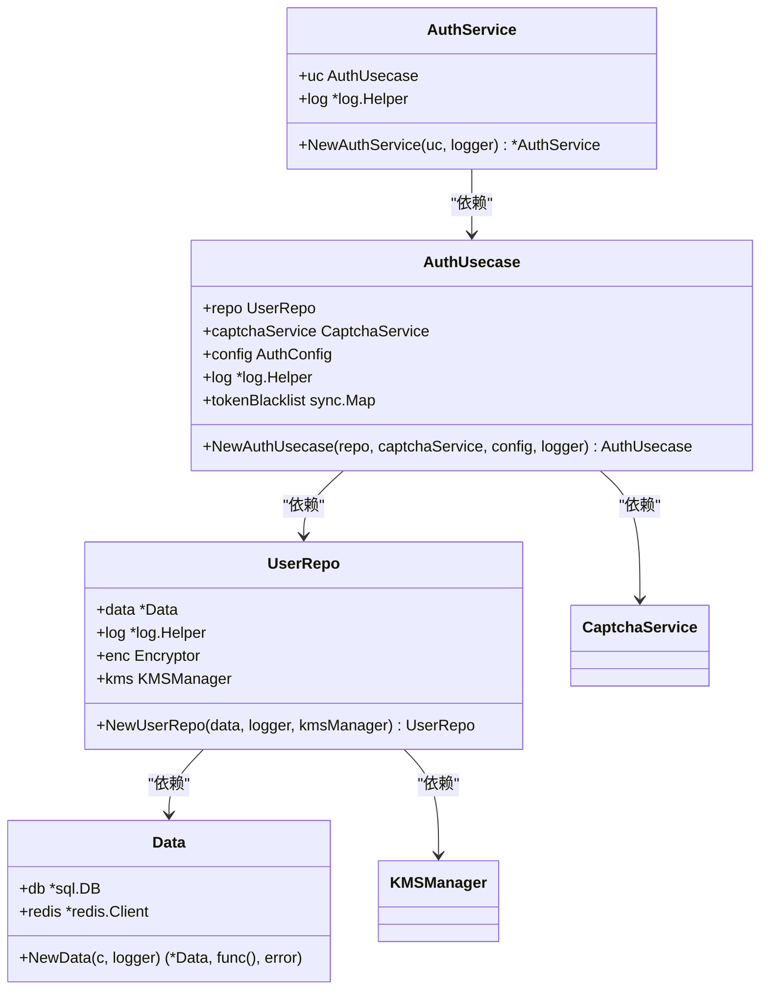
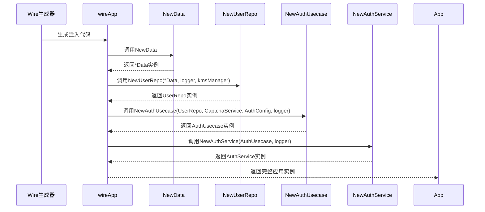
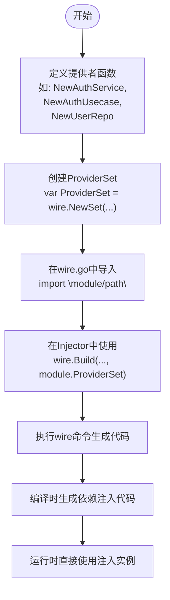
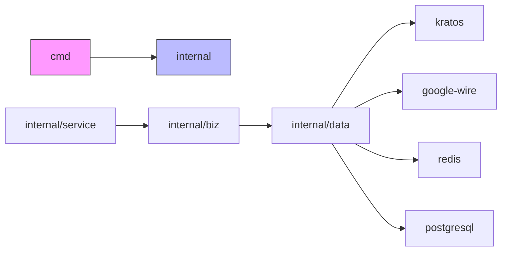

# 依赖注入机制（Wire）

<cite>
**本文档中引用的文件**
- [wire.go](file://cmd/kratos-boilerplate/wire.go)
- [provider.go](file://internal/service/provider.go)
- [auth.go](file://internal/service/auth.go)
- [auth.go](file://internal/biz/auth.go)
- [auth.go](file://internal/data/auth.go)
- [data.go](file://internal/data/data.go)
</cite>

## 目录
1. [简介](#简介)
2. [项目结构](#项目结构)
3. [核心组件](#核心组件)
4. [架构概述](#架构概述)
5. [详细组件分析](#详细组件分析)
6. [依赖分析](#依赖分析)
7. [性能考量](#性能考量)
8. [故障排除指南](#故障排除指南)
9. [结论](#结论)

## 简介
本文档全面介绍基于Google Wire实现的编译时依赖注入系统。该系统通过静态代码生成方式，在编译阶段自动构建服务依赖树，避免了运行时反射带来的性能开销。文档将深入解析`wire.go`中Provider集合的定义方式，展示从初始化配置到最终服务实例创建的全过程，并提供开发者添加新依赖组件的最佳实践。

## 项目结构
本项目采用分层架构设计，依赖注入系统贯穿于各业务层级之间。核心依赖注入逻辑位于`cmd/kratos-boilerplate/wire.go`，而各模块的Provider集合分别定义在`internal/data`、`internal/biz`和`internal/service`等目录下。

**Diagram sources**
- [wire.go](file://cmd/kratos-boilerplate/wire.go)
- [provider.go](file://internal/service/provider.go)
- [auth.go](file://internal/service/auth.go)
- [auth.go](file://internal/biz/auth.go)
- [auth.go](file://internal/data/auth.go)
- [data.go](file://internal/data/data.go)

**Section sources**
- [wire.go](file://cmd/kratos-boilerplate/wire.go)
- [data.go](file://internal/data/data.go)

## 核心组件
本系统的依赖注入机制围绕三个核心概念构建：Provider Set、Injector函数和编译时代码生成。`wireApp`函数作为Injector，通过组合多个Provider Set来声明应用程序所需的所有依赖关系。

**Section sources**
- [wire.go](file://cmd/kratos-boilerplate/wire.go)

## 架构概述
整个依赖注入系统的架构遵循分层依赖原则，上层组件依赖下层组件提供的接口实现。Google Wire在编译时根据这些声明自动生成连接代码，确保类型安全且高效。

**Diagram sources**
- [wire.go](file://cmd/kratos-boilerplate/wire.go)
- [provider.go](file://internal/service/provider.go)
- [auth.go](file://internal/biz/auth.go)
- [auth.go](file://internal/data/auth.go)

## 详细组件分析

### 认证服务注入流程分析
以`AuthUseCase`为例，展示从配置初始化到服务实例创建的完整依赖注入过程。

#### 对象关系图

**Diagram sources**
- [auth.go](file://internal/service/auth.go)
- [auth.go](file://internal/biz/auth.go)
- [auth.go](file://internal/data/auth.go)
- [data.go](file://internal/data/data.go)

#### 依赖注入调用序列

**Diagram sources**
- [wire.go](file://cmd/kratos-boilerplate/wire.go)
- [data.go](file://internal/data/data.go)
- [auth.go](file://internal/data/auth.go)
- [auth.go](file://internal/biz/auth.go)
- [auth.go](file://internal/service/auth.go)

**Section sources**
- [wire.go](file://cmd/kratos-boilerplate/wire.go)
- [data.go](file://internal/data/data.go)
- [auth.go](file://internal/data/auth.go)
- [auth.go](file://internal/biz/auth.go)
- [auth.go](file://internal/service/auth.go)

### Provider集合定义方式
Provider Set是Wire系统的核心构建块，使用`wire.NewSet`宏将多个提供者函数组合在一起。每个模块都定义了自己的Provider Set，便于管理和复用。

**Diagram sources**
- [wire.go](file://cmd/kratos-boilerplate/wire.go)
- [provider.go](file://internal/service/provider.go)
- [data.go](file://internal/data/data.go)

**Section sources**
- [wire.go](file://cmd/kratos-boilerplate/wire.go)
- [provider.go](file://internal/service/provider.go)
- [data.go](file://internal/data/data.go)

## 依赖分析
系统通过明确的依赖方向保证了架构的清晰性。上层组件只能依赖下层组件，形成了稳定的技术栈结构。

**Diagram sources**
- [wire.go](file://cmd/kratos-boilerplate/wire.go)
- [provider.go](file://internal/service/provider.go)
- [data.go](file://internal/data/data.go)

**Section sources**
- [wire.go](file://cmd/kratos-boilerplate/wire.go)
- [go.mod](file://go.mod)

## 性能考量
Google Wire通过编译时依赖注入显著提升了系统性能：

1. **消除反射开销**：与运行时DI框架不同，Wire在编译期生成所有依赖连接代码，避免了反射带来的性能损耗。
2. **提前发现错误**：依赖关系在编译阶段验证，能够在开发早期发现配置错误。
3. **优化内存分配**：生成的代码经过Go编译器优化，减少了不必要的内存分配。
4. **启动速度提升**：无需在程序启动时解析依赖关系，加快了应用初始化速度。

这些优势使得系统在高并发场景下表现更加稳定和高效。

## 故障排除指南
在使用Wire依赖注入系统时可能遇到以下常见问题及解决方案：

### 循环依赖排查
当两个或多个组件相互依赖时会出现循环依赖错误。解决方法：
- 重构代码，引入中间接口解耦
- 使用延迟初始化模式
- 检查Provider Set是否无意中包含了双向依赖