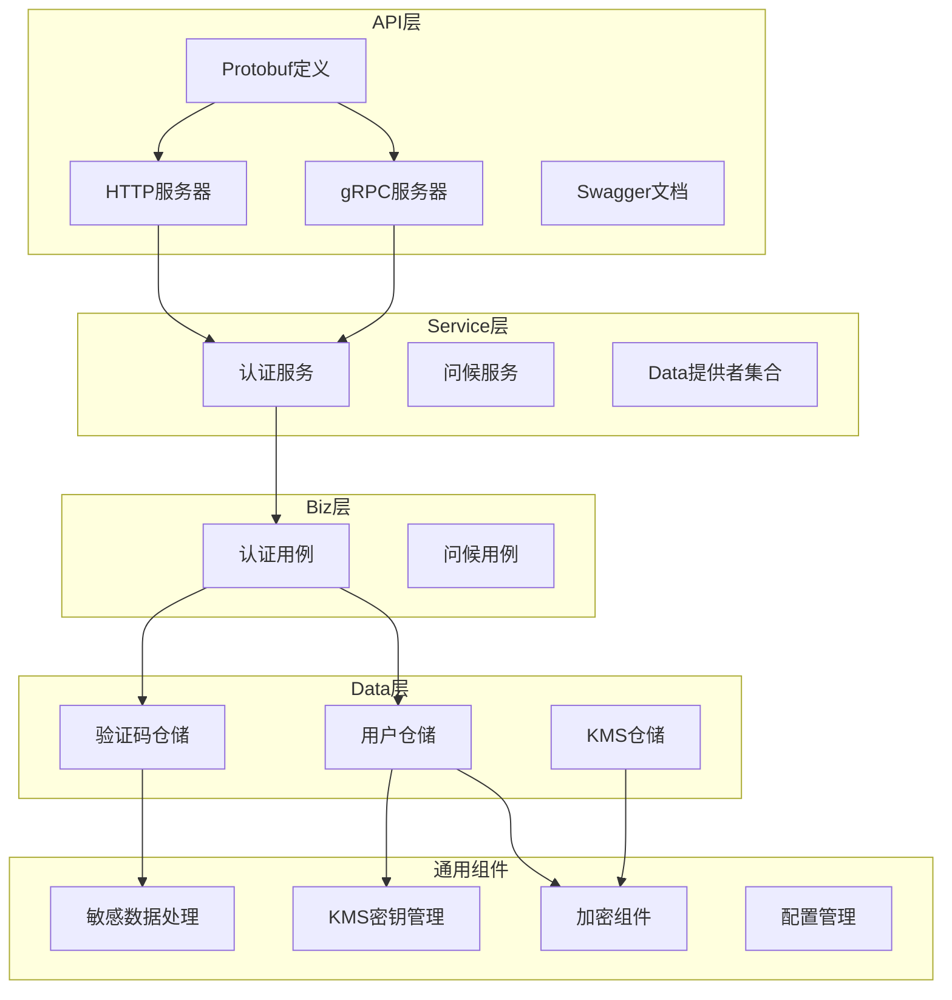
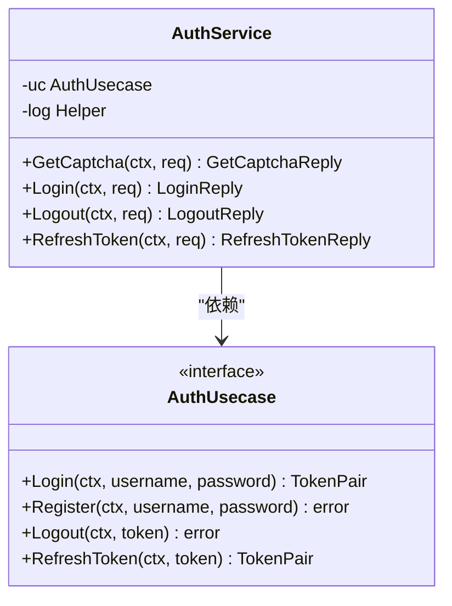
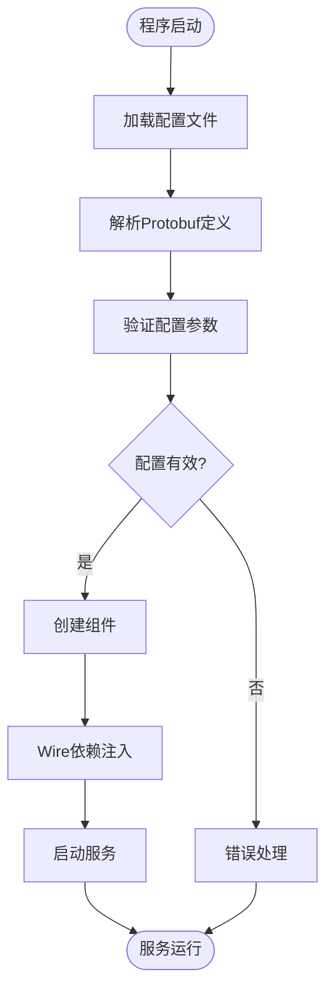
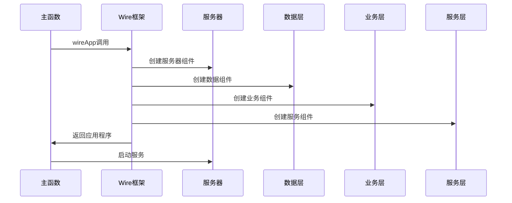
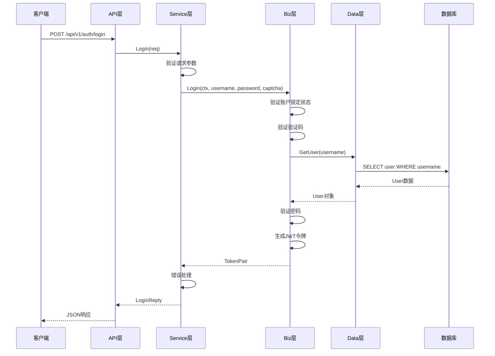
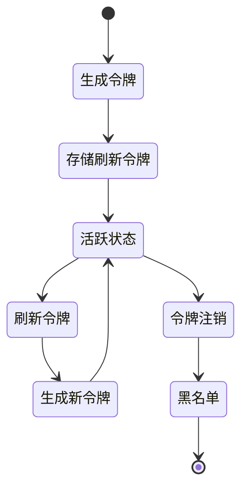

# 后端架构设计文档

<cite>
**本文档引用的文件**
- [cmd/kratos-boilerplate/main.go](file://cmd/kratos-boilerplate/main.go)
- [cmd/kratos-boilerplate/wire.go](file://cmd/kratos-boilerplate/wire.go)
- [internal/conf/conf.proto](file://internal/conf/conf.proto)
- [configs/config.yaml](file://configs/config.yaml)
- [internal/biz/biz.go](file://internal/biz/biz.go)
- [internal/biz/auth.go](file://internal/biz/auth.go)
- [internal/data/data.go](file://internal/data/data.go)
- [internal/data/auth.go](file://internal/data/auth.go)
- [internal/service/auth.go](file://internal/service/auth.go)
- [api/auth/v1/auth.proto](file://api/auth/v1/auth.proto)
</cite>

## 目录
1. [项目概述](#项目概述)
2. [整体架构设计](#整体架构设计)
3. [分层架构详解](#分层架构详解)
4. [配置管理系统](#配置管理系统)
5. [依赖注入机制](#依赖注入机制)
6. [组件间调用流程](#组件间调用流程)
7. [认证系统分析](#认证系统分析)
8. [性能优化考虑](#性能优化考虑)
9. [总结](#总结)

## 项目概述

本项目是一个基于Go Kratos框架构建的企业级后端系统，采用了领域驱动设计（DDD）的分层架构模式。该架构通过清晰的分层设计实现了关注点分离，提供了高度的可维护性和扩展性。

项目的核心特点包括：
- **分层架构**：API层、Service层、Biz层、Data层的明确分离
- **协议定义**：通过Protobuf定义API契约，自动生成gRPC和REST接口
- **依赖注入**：使用Wire框架实现编译时依赖注入
- **配置管理**：基于Protobuf的配置结构化定义
- **安全机制**：完整的认证授权体系，支持多种安全特性

## 整体架构设计



**图表来源**
- [api/auth/v1/auth.proto](file://api/auth/v1/auth.proto#L1-L50)
- [internal/service/auth.go](file://internal/service/auth.go#L1-L30)
- [internal/biz/auth.go](file://internal/biz/auth.go#L1-L100)
- [internal/data/auth.go](file://internal/data/auth.go#L1-L50)

## 分层架构详解

### API层（API Layer）

API层负责定义服务契约和处理传输协议，主要包含以下组件：

#### Protobuf契约定义
API层通过Protobuf文件定义服务接口和数据结构，支持自动生成gRPC和REST接口：

```protobuf
service Auth {
  rpc Login(LoginRequest) returns (LoginReply) {
    option (google.api.http) = {
      post: "/api/v1/auth/login"
      body: "*"
    };
  }
}
```

#### gRPC服务器
gRPC服务器提供高性能的RPC通信能力，支持流式传输和双向通信。

#### HTTP服务器
HTTP服务器通过Swagger集成提供RESTful API，支持OpenAPI规范。

**章节来源**
- [api/auth/v1/auth.proto](file://api/auth/v1/auth.proto#L1-L235)
- [cmd/kratos-boilerplate/main.go](file://cmd/kratos-boilerplate/main.go#L30-L45)

### Service层（Service Layer）

Service层作为业务逻辑的协调者，负责：
- 协调Biz层的业务用例
- 处理业务规则和流程控制
- 提供服务方法给API层调用



**图表来源**
- [internal/service/auth.go](file://internal/service/auth.go#L15-L30)
- [internal/biz/auth.go](file://internal/biz/auth.go#L150-L180)

**章节来源**
- [internal/service/auth.go](file://internal/service/auth.go#L1-L235)

### Biz层（Business Logic Layer）

Biz层封装核心业务逻辑和规则，是领域驱动设计的核心体现：

#### 业务用例实现
Biz层通过usecase模式实现业务逻辑，每个usecase代表一个业务场景：

```go
type AuthUsecase interface {
    Register(ctx context.Context, username, password, email, phone, captchaID, captchaCode string) error
    Login(ctx context.Context, username, password, captchaID, captchaCode, totpCode string) (*TokenPair, error)
    Logout(ctx context.Context, accessToken string) error
    RefreshToken(ctx context.Context, refreshToken string) (*TokenPair, error)
}
```

#### 业务实体和值对象
Biz层定义了业务实体和值对象，如User、Captcha、TokenPair等：

```go
type User struct {
    ID         int64
    Username   string
    Password   string
    Email      string
    Phone      string
    Name       string
    TotpSecret string
    CreatedAt  time.Time
    UpdatedAt  time.Time
}
```

**章节来源**
- [internal/biz/auth.go](file://internal/biz/auth.go#L150-L200)
- [internal/biz/auth.go](file://internal/biz/auth.go#L30-L50)

### Data层（Data Access Layer）

Data层负责数据持久化和外部资源交互，采用仓储模式：

#### 仓储接口设计
Data层通过接口抽象数据访问，实现解耦：

```go
type UserRepo interface {
    CreateUser(ctx context.Context, user *User) error
    GetUser(ctx context.Context, username string) (*User, error)
    GetUserByEmail(ctx context.Context, email string) (*User, error)
    UpdateUser(ctx context.Context, user *User) error
    // ... 其他方法
}
```

#### 数据源集成
Data层支持多种数据源，包括PostgreSQL数据库和Redis缓存：

```go
type Data struct {
    db    *sql.DB
    redis *redis.Client
}
```

**章节来源**
- [internal/data/auth.go](file://internal/data/auth.go#L40-L80)
- [internal/data/data.go](file://internal/data/data.go#L20-L40)

## 配置管理系统

### Protobuf配置定义

配置系统通过Protobuf定义配置结构，提供强类型的安全性：

```protobuf
message Bootstrap {
  Server server = 1;
  Data data = 2;
  Auth auth = 3;
  Features features = 4;
}

message Auth {
  string jwt_secret_key = 1;
  google.protobuf.Duration access_token_expiration = 2;
  google.protobuf.Duration refresh_token_expiration = 3;
  bool captcha_enabled = 4;
  google.protobuf.Duration captcha_expiration = 5;
  int32 max_login_attempts = 6;
  google.protobuf.Duration lock_duration = 7;
  bool totp_enabled = 8;
}
```

### YAML配置实例化

配置系统通过YAML文件实例化Protobuf定义的配置结构：

```yaml
auth:
  jwt_secret_key: "your-super-secret-jwt-key-here"
  access_token_expiration: "24h"
  refresh_token_expiration: "7d"
  captcha_enabled: true
  captcha_expiration: "5m"
  max_login_attempts: 5
  lock_duration: "30m"
  totp_enabled: false
```

### 配置加载流程



**图表来源**
- [cmd/kratos-boilerplate/main.go](file://cmd/kratos-boilerplate/main.go#L50-L70)
- [configs/config.yaml](file://configs/config.yaml#L1-L48)

**章节来源**
- [internal/conf/conf.proto](file://internal/conf/conf.proto#L1-L70)
- [configs/config.yaml](file://configs/config.yaml#L1-L48)

## 依赖注入机制

### Wire框架集成

项目使用Google的Wire框架实现编译时依赖注入：

```go
func wireApp(*conf.Server, *conf.Data, *conf.Auth, *conf.Bootstrap, log.Logger) (*kratos.App, func(), error) {
    wire.Build(server.ProviderSet, data.ProviderSet, biz.ProviderSet, service.ProviderSet, newApp)
    return nil, nil, nil
}
```

### Provider集合设计

每个层次都定义了ProviderSet，用于声明组件的创建方式：

```go
// Biz层ProviderSet
var ProviderSet = wire.NewSet(NewGreeterUsecase, NewAuthUsecase, NewAuthConfig)

// Data层ProviderSet
var ProviderSet = wire.NewSet(NewData, NewGreeterRepo, NewUserRepo, NewOperationLogRepo, NewCaptchaRepo, captcha.NewCaptchaService, NewCaptchaConfig, NewKMSRepo, NewKMSManager)
```

### 组件组装流程



**图表来源**
- [cmd/kratos-boilerplate/wire.go](file://cmd/kratos-boilerplate/wire.go#L18-L24)
- [cmd/kratos-boilerplate/main.go](file://cmd/kratos-boilerplate/main.go#L65-L75)

**章节来源**
- [cmd/kratos-boilerplate/wire.go](file://cmd/kratos-boilerplate/wire.go#L1-L25)
- [internal/biz/biz.go](file://internal/biz/biz.go#L10-L15)

## 组件间调用流程

### 完整请求处理流程

以用户登录为例，展示一个完整请求在各层之间的流转过程：



**图表来源**
- [internal/service/auth.go](file://internal/service/auth.go#L80-L120)
- [internal/biz/auth.go](file://internal/biz/auth.go#L300-L350)

### 请求处理层次分解

#### API层处理
API层负责协议转换和请求验证：

```go
func (s *AuthService) Login(ctx context.Context, req *v1.LoginRequest) (*v1.LoginReply, error) {
    tokenPair, err := s.uc.Login(ctx, req.Username, req.Password, req.CaptchaId, req.CaptchaCode, req.TotpCode)
    if err != nil {
        // 错误映射和HTTP状态码设置
        return nil, errors.InternalServer("LOGIN_ERROR", err.Error())
    }
    return &v1.LoginReply{
        AccessToken:  tokenPair.AccessToken,
        RefreshToken: tokenPair.RefreshToken,
        ExpiresIn:    tokenPair.ExpiresIn,
    }, nil
}
```

#### Service层协调
Service层协调业务逻辑并进行错误处理：

```go
func (uc *authUsecase) Login(ctx context.Context, username, password, captchaID, captchaCode, totpCode string) (*TokenPair, error) {
    // 业务逻辑实现
    // ...
    return tokenPair, nil
}
```

#### Biz层业务规则
Biz层实现具体的业务规则和算法：

```go
func (uc *authUsecase) generateTokens(ctx context.Context, user *User) (*TokenPair, error) {
    // JWT令牌生成逻辑
    // ...
    return &TokenPair{
        AccessToken:  signedAccessToken,
        RefreshToken: signedRefreshToken,
        ExpiresIn:    int64(uc.config.AccessTokenExpiration.Seconds()),
    }, nil
}
```

**章节来源**
- [internal/service/auth.go](file://internal/service/auth.go#L80-L120)
- [internal/biz/auth.go](file://internal/biz/auth.go#L500-L550)

## 认证系统分析

### 认证流程设计

认证系统是一个完整的安全解决方案，包含多个安全特性：

#### 多因素认证
系统支持传统的用户名密码认证，同时支持TOTP双因子认证：

```go
// TOTP验证逻辑
if uc.config.TOTPEnabled && user.TotpSecret != "" {
    if totpCode == "" {
        return nil, ErrTotpRequired
    }
    if !uc.verifyTOTP(user.TotpSecret, totpCode) {
        return nil, ErrTotpCodeInvalid
    }
}
```

#### 账户锁定机制
系统实现了智能的账户锁定机制：

```go
func (uc *authUsecase) recordFailedAttempt(ctx context.Context, username string) {
    lock, err := uc.repo.GetLock(ctx, username)
    if err != nil {
        if err == ErrUserNotFound {
            lock = &AccountLock{
                Username:       username,
                FailedAttempts: 0,
                LastAttempt:    time.Now(),
            }
        }
    }
    
    lock.FailedAttempts++
    if lock.FailedAttempts >= uc.config.MaxLoginAttempts {
        lock.LockUntil = time.Now().Add(uc.config.LockDuration)
    }
    
    uc.repo.SaveLock(ctx, lock)
}
```

#### 令牌管理
系统实现了完整的令牌生命周期管理：



**图表来源**
- [internal/biz/auth.go](file://internal/biz/auth.go#L600-L650)

### 安全特性实现

#### 敏感数据保护
系统使用KMS（密钥管理服务）保护敏感数据：

```go
type kmsEncryptorWrapper struct {
    cryptoService kms.CryptoService
}

func (w *kmsEncryptorWrapper) Encrypt(data []byte) ([]byte, error) {
    encryptedField, err := w.cryptoService.EncryptField(context.Background(), "user_data", data)
    if err != nil {
        return nil, err
    }
    return []byte(fmt.Sprintf("%s:%s:%x", encryptedField.Version, encryptedField.Algorithm, encryptedField.Value)), nil
}
```

#### 验证码系统
系统实现了灵活的验证码生成和验证机制：

```go
type CaptchaService interface {
    Generate(ctx context.Context, captchaType, target string) (*Captcha, error)
    Verify(ctx context.Context, captchaID, captchaCode string) (bool, error)
}
```

**章节来源**
- [internal/biz/auth.go](file://internal/biz/auth.go#L400-L450)
- [internal/data/auth.go](file://internal/data/auth.go#L50-L100)

## 性能优化考虑

### 缓存策略

系统在多个层面实现了缓存优化：

#### 内存缓存
用户锁定信息和验证码使用内存缓存：

```go
captchas      sync.Map // map[captchaID]*biz.Captcha
accountLocks  sync.Map // map[username]*biz.AccountLock
refreshTokens sync.Map // map[tokenID]struct{tokenUsername string, used bool}
```

#### Redis集成
系统集成了Redis作为分布式缓存：

```go
redisClient := redis.NewClient(&redis.Options{
    Addr:     c.Redis.Addr,
    Network:  c.Redis.Network,
    Password: "",
    DB:       0,
})
```

### 并发处理

系统使用sync.Map确保并发安全：

```go
func (r *userRepo) SaveCaptcha(ctx context.Context, captcha *biz.Captcha) error {
    r.captchas.Store(captcha.ID, captcha)
    return nil
}
```

### 数据库优化

#### 连接池管理
系统合理配置数据库连接池：

```go
db, err := sql.Open(c.Database.Driver, c.Database.Source)
if err != nil {
    return nil, nil, err
}
if err := db.Ping(); err != nil {
    return nil, nil, err
}
```

#### 索引优化
用户表使用哈希索引优化敏感信息查询：

```sql
CREATE INDEX idx_email_hash ON users(email_hash);
CREATE INDEX idx_phone_hash ON users(phone_hash);
CREATE INDEX idx_name_hash ON users(name_hash);
```

**章节来源**
- [internal/data/data.go](file://internal/data/data.go#L30-L50)
- [internal/data/auth.go](file://internal/data/auth.go#L200-L250)

## 总结

本项目通过精心设计的分层架构实现了企业级后端系统的最佳实践：

### 架构优势

1. **清晰的分层设计**：API层、Service层、Biz层、Data层职责明确，便于维护和扩展
2. **强类型配置**：通过Protobuf定义配置结构，提供编译时类型检查
3. **依赖注入**：使用Wire框架实现编译时依赖注入，提高代码质量和可测试性
4. **安全机制完善**：多因素认证、账户锁定、敏感数据保护等安全特性
5. **性能优化**：缓存策略、并发处理、数据库优化等性能考虑

### 设计模式应用

- **领域驱动设计**：Biz层实现业务用例，Data层实现仓储模式
- **依赖倒置原则**：通过接口抽象实现层次间的解耦
- **单一职责原则**：每个层次和组件都有明确的职责边界
- **开闭原则**：通过接口和抽象类支持功能扩展而不修改现有代码

### 技术栈特色

- **Protobuf优先**：通过Protobuf定义API契约，自动生成多种协议实现
- **Wire依赖注入**：编译时依赖注入，提高运行时性能
- **KMS集成**：企业级密钥管理服务，保障数据安全
- **多协议支持**：同时支持gRPC和RESTful API

这种架构设计不仅满足了当前的功能需求，还为未来的扩展和维护奠定了坚实的基础，是现代企业级应用开发的优秀范例。