# 通用组件复用机制

<cite>
**本文档引用的文件**
- [internal/pkg/auth/auth.go](file://internal/pkg/auth/auth.go)
- [internal/pkg/sensitive/anonymizer.go](file://internal/pkg/sensitive/anonymizer.go)
- [internal/pkg/kms/interfaces.go](file://internal/pkg/kms/interfaces.go)
- [internal/pkg/captcha/captcha.go](file://internal/pkg/captcha/captcha.go)
- [internal/pkg/sensitive/middleware.go](file://internal/pkg/sensitive/middleware.go)
- [internal/biz/auth.go](file://internal/biz/auth.go)
- [internal/middleware/operation_log.go](file://internal/middleware/operation_log.go)
- [internal/conf/conf.proto](file://internal/conf/conf.proto)
- [internal/pkg/wire.go](file://internal/pkg/wire.go)
</cite>

## 目录
1. [引言](#引言)
2. [项目架构概览](#项目架构概览)
3. [核心通用组件分析](#核心通用组件分析)
4. [组件集成模式](#组件集成模式)
5. [中间件模式应用](#中间件模式应用)
6. [策略模式实现](#策略模式实现)
7. [接口抽象设计](#接口抽象设计)
8. [开发标准与测试规范](#开发标准与测试规范)
9. [最佳实践指南](#最佳实践指南)
10. [总结](#总结)

## 引言

kratos-boilerplate项目采用分层架构设计，其中`internal/pkg`目录包含了多个可复用的通用组件。这些组件通过精心设计的接口抽象和依赖注入机制，实现了高度的模块化和可扩展性。本文档将深入分析auth包的身份验证抽象、sensitive包的数据脱敏策略、kms包的密钥管理接口以及captcha包的验证码生成逻辑，探讨它们如何被Biz和Data层透明调用，同时保持低耦合性。

## 项目架构概览

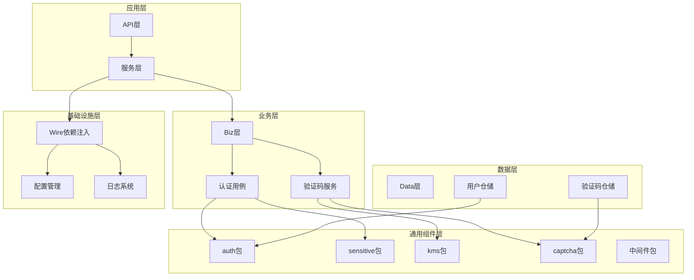

**图表来源**
- [internal/pkg/wire.go](file://internal/pkg/wire.go#L1-L50)
- [internal/biz/auth.go](file://internal/biz/auth.go#L1-L100)

## 核心通用组件分析

### Auth包：身份验证抽象

Auth包提供了企业级认证鉴权解决方案，采用了策略模式和工厂模式的组合设计。

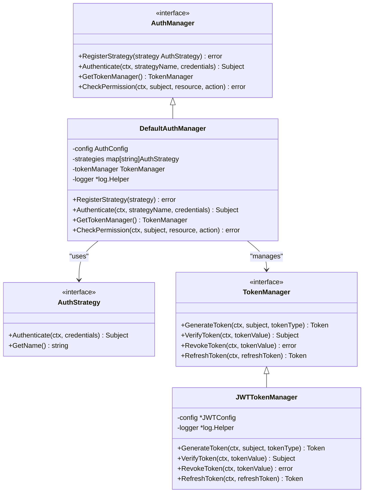

**图表来源**
- [internal/pkg/auth/auth.go](file://internal/pkg/auth/auth.go#L25-L100)

**章节来源**
- [internal/pkg/auth/auth.go](file://internal/pkg/auth/auth.go#L1-L303)

### Sensitive包：数据脱敏策略

Sensitive包实现了多层次的数据脱敏机制，包括字段级脱敏、对象级脱敏和日志级脱敏。

```mermaid
classDiagram
class Anonymizer {
<<interface>>
+AnonymizeString(value, rule) string
+AnonymizeObject(obj) interface{}
+AnonymizeBatch(objects) []interface{}
+AnonymizeValue(value, rules) interface{}
}
class SensitiveDetector {
<<interface>>
+DetectSensitiveInfo(text, infoType) []string
+HasSensitiveInfo(text, infoType) bool
+DetectEmail(text) []string
+DetectPhone(text) []string
+DetectIDCard(text) []string
+DetectBankCard(text) []string
+DetectAll(text) map[string][]string
}
class LogSanitizer {
<<interface>>
+SanitizeLogContent(content) string
+SanitizeLogMessage(message) string
+ContainsSensitiveInfo(content) bool
}
class FieldAnonymizer {
<<interface>>
+AnonymizeEmail(email) string
+AnonymizePhone(phone) string
+AnonymizeName(name) string
+AnonymizeIDCard(idCard) string
+AnonymizeBankCard(bankCard) string
+AnonymizeAddress(address) string
}
class anonymizer {
-defaultRules map[string]AnonymizeRule
-detector SensitiveDetector
+AnonymizeString(value, rule) string
+AnonymizeObject(obj) interface{}
+AnonymizeBatch(objects) []interface{}
+AnonymizeValue(value, rules) interface{}
}
class sensitiveDetector {
-emailRegex *regexp.Regexp
-phoneRegex *regexp.Regexp
-idCardRegex *regexp.Regexp
-bankCardRegex *regexp.Regexp
+DetectSensitiveInfo(text, infoType) []string
+HasSensitiveInfo(text, infoType) bool
+DetectEmail(text) []string
+DetectPhone(text) []string
+DetectIDCard(text) []string
+DetectBankCard(text) []string
+DetectAll(text) map[string][]string
}
Anonymizer <|-- anonymizer
SensitiveDetector <|-- sensitiveDetector
anonymizer --> SensitiveDetector : "uses"
```

**图表来源**
- [internal/pkg/sensitive/anonymizer.go](file://internal/pkg/sensitive/anonymizer.go#L15-L100)

**章节来源**
- [internal/pkg/sensitive/anonymizer.go](file://internal/pkg/sensitive/anonymizer.go#L1-L380)

### KMS包：密钥管理接口

KMS包提供了统一的密钥管理系统接口，支持多种密钥存储和加密算法。

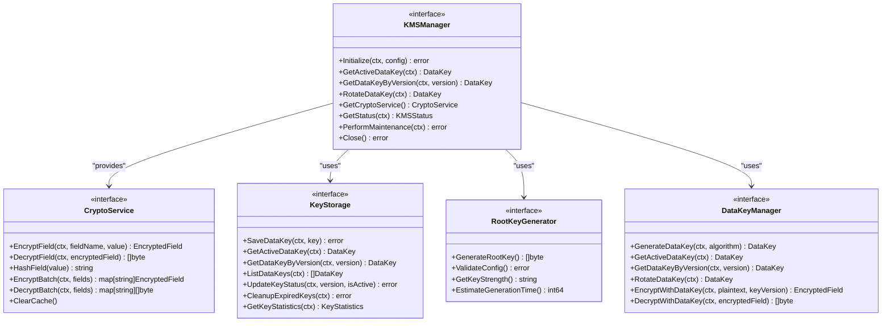

**图表来源**
- [internal/pkg/kms/interfaces.go](file://internal/pkg/kms/interfaces.go#L10-L80)

**章节来源**
- [internal/pkg/kms/interfaces.go](file://internal/pkg/kms/interfaces.go#L1-L126)

### Captcha包：验证码生成逻辑

Captcha包实现了灵活的验证码生成和验证机制，支持多种验证码类型。

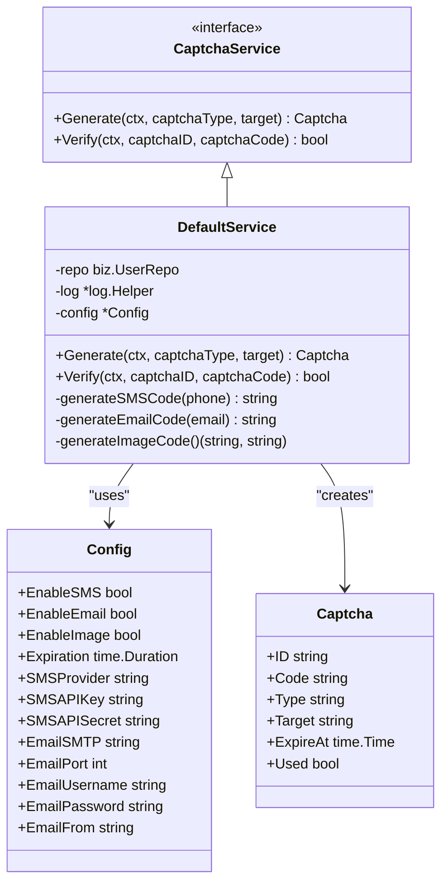

**图表来源**
- [internal/pkg/captcha/captcha.go](file://internal/pkg/captcha/captcha.go#L25-L80)

**章节来源**
- [internal/pkg/captcha/captcha.go](file://internal/pkg/captcha/captcha.go#L1-L283)

## 组件集成模式

### 依赖注入集成

项目使用Wire框架实现依赖注入，确保组件间的松耦合。

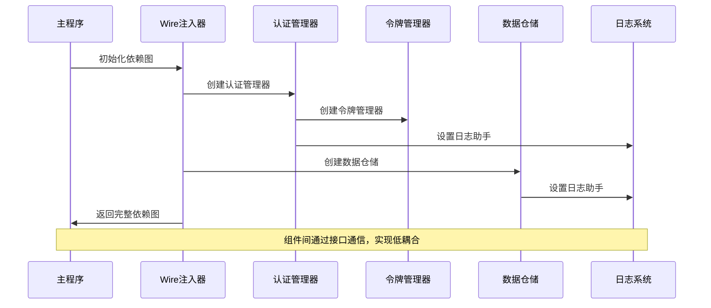

**图表来源**
- [internal/pkg/wire.go](file://internal/pkg/wire.go#L15-L50)

### Biz层透明调用

Biz层通过接口抽象实现对通用组件的透明调用。

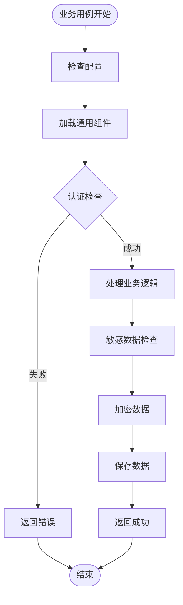

**图表来源**
- [internal/biz/auth.go](file://internal/biz/auth.go#L200-L300)

**章节来源**
- [internal/biz/auth.go](file://internal/biz/auth.go#L1-L695)

## 中间件模式应用

### 日志脱敏中间件

项目实现了基于中间件模式的日志脱敏机制，自动处理敏感信息。

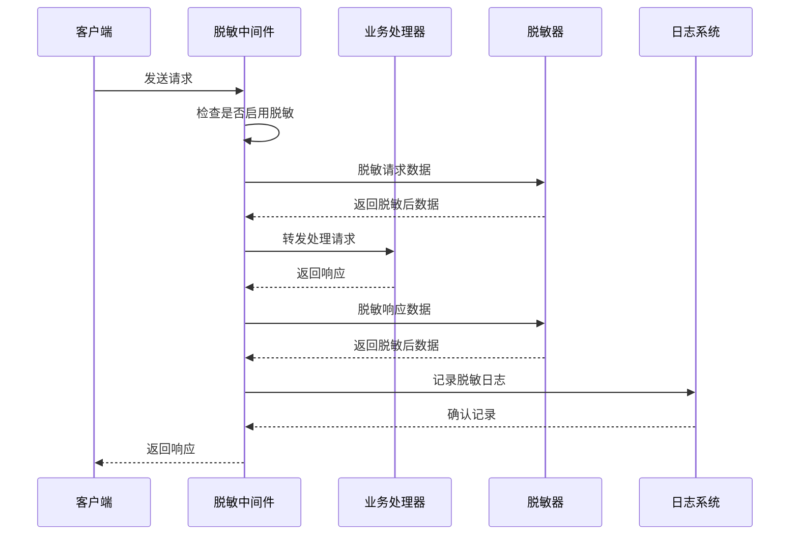

**图表来源**
- [internal/pkg/sensitive/middleware.go](file://internal/pkg/sensitive/middleware.go#L50-L100)

**章节来源**
- [internal/pkg/sensitive/middleware.go](file://internal/pkg/sensitive/middleware.go#L1-L327)

### 操作日志中间件

操作日志中间件展示了另一种中间件模式的应用。

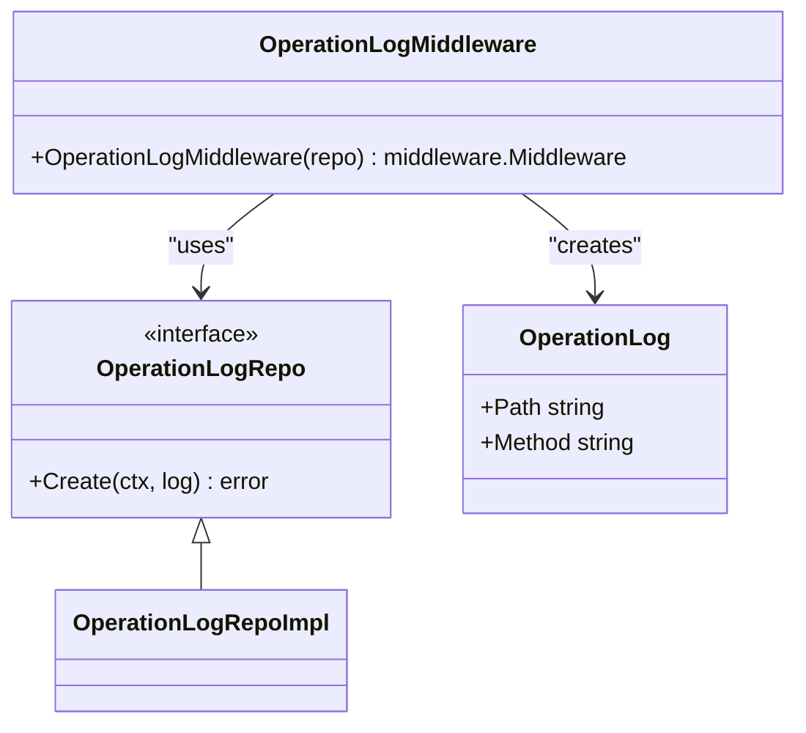

**图表来源**
- [internal/middleware/operation_log.go](file://internal/middleware/operation_log.go#L10-L30)

**章节来源**
- [internal/middleware/operation_log.go](file://internal/middleware/operation_log.go#L1-L38)

## 策略模式实现

### 认证策略模式

Auth包采用策略模式支持多种认证方式。

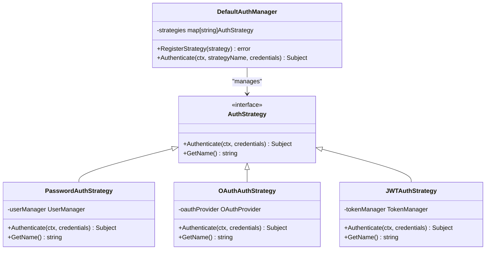

**图表来源**
- [internal/pkg/auth/auth.go](file://internal/pkg/auth/auth.go#L40-L80)

### 脱敏策略模式

Sensitive包支持多种脱敏策略。

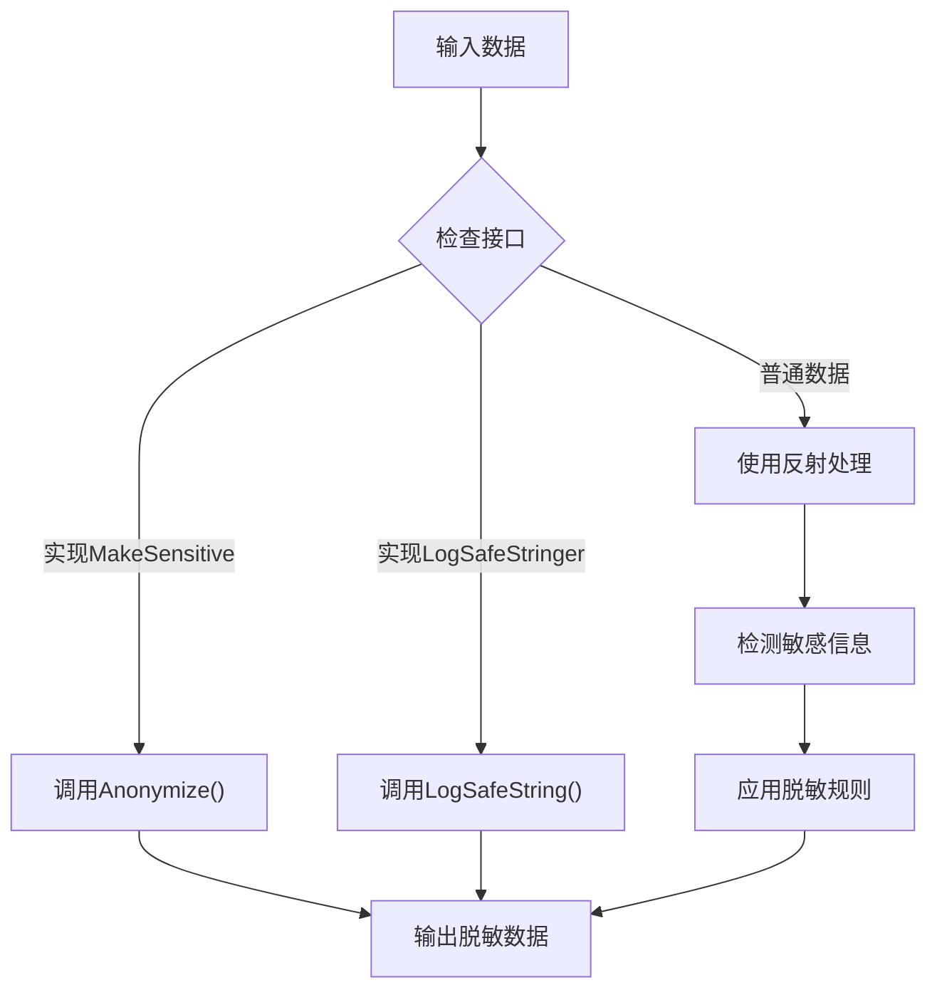

**图表来源**
- [internal/pkg/sensitive/anonymizer.go](file://internal/pkg/sensitive/anonymizer.go#L50-L100)

## 接口抽象设计

### 统一接口设计原则

所有通用组件都遵循统一的接口设计原则：

1. **单一职责**：每个接口只负责一个明确的功能领域
2. **最小接口**：接口方法数量最少化，避免过度设计
3. **稳定接口**：接口设计考虑向后兼容性
4. **可测试性**：接口易于单元测试和模拟

### 接口层次结构

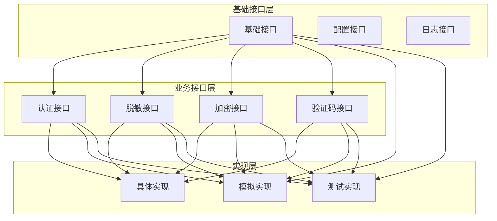

**章节来源**
- [internal/pkg/auth/auth.go](file://internal/pkg/auth/auth.go#L25-L50)
- [internal/pkg/sensitive/anonymizer.go](file://internal/pkg/sensitive/anonymizer.go#L15-L40)

## 开发标准与测试规范

### 新组件开发标准模板

开发新通用组件时应遵循以下标准模板：

```go
// 示例：新通用组件开发模板
package mycomponent

import (
    "context"
    "github.com/go-kratos/kratos/v2/log"
)

// MyComponent 接口定义
type MyComponent interface {
    Initialize(ctx context.Context, config *Config) error
    Execute(ctx context.Context, input interface{}) (interface{}, error)
    Shutdown() error
}

// Config 配置结构
type Config struct {
    // 配置字段
}

// DefaultConfig 默认配置
var DefaultConfig = &Config{
    // 默认值
}

// MyComponentImpl 具体实现
type MyComponentImpl struct {
    config *Config
    logger *log.Helper
}

// NewMyComponent 创建组件实例
func NewMyComponent(config *Config, logger log.Logger) MyComponent {
    if config == nil {
        config = DefaultConfig
    }
    return &MyComponentImpl{
        config: config,
        logger: log.NewHelper(logger),
    }
}

// Initialize 初始化组件
func (c *MyComponentImpl) Initialize(ctx context.Context, config *Config) error {
    // 实现初始化逻辑
    return nil
}

// Execute 执行主要功能
func (c *MyComponentImpl) Execute(ctx context.Context, input interface{}) (interface{}, error) {
    // 实现执行逻辑
    return nil, nil
}

// Shutdown 关闭组件
func (c *MyComponentImpl) Shutdown() error {
    // 实现清理逻辑
    return nil
}
```

### 测试规范

所有通用组件必须遵循以下测试规范：

1. **单元测试覆盖率**：达到80%以上
2. **边界条件测试**：覆盖所有边界情况
3. **错误处理测试**：测试各种错误场景
4. **并发测试**：测试多线程环境下的行为
5. **集成测试**：与Biz层和Data层的集成测试

### 配置管理

组件配置应遵循以下原则：

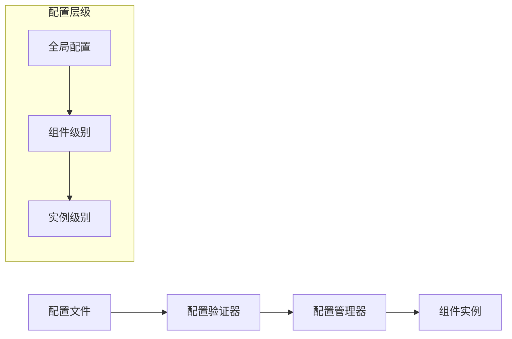

**章节来源**
- [internal/conf/conf.proto](file://internal/conf/conf.proto#L1-L70)

## 最佳实践指南

### 组件设计最佳实践

1. **接口优先设计**：先定义接口，再实现具体功能
2. **依赖倒置原则**：高层模块不应依赖低层模块，都应依赖抽象
3. **单一职责原则**：每个组件只负责一个功能领域
4. **开闭原则**：对扩展开放，对修改关闭
5. **依赖注入**：使用依赖注入容器管理组件生命周期

### 性能优化建议

1. **缓存策略**：合理使用缓存减少重复计算
2. **批量处理**：对大量数据操作使用批量处理
3. **异步处理**：对于耗时操作使用异步处理
4. **资源池化**：对频繁创建销毁的对象使用对象池

### 安全考虑

1. **输入验证**：严格验证所有输入参数
2. **权限控制**：实施细粒度的权限控制
3. **审计日志**：记录关键操作的审计日志
4. **数据加密**：对敏感数据进行加密存储

### 监控和可观测性

1. **指标收集**：收集关键性能指标
2. **链路追踪**：实现分布式链路追踪
3. **告警机制**：设置合理的告警阈值
4. **健康检查**：定期进行组件健康检查

## 总结

kratos-boilerplate项目的通用组件复用机制展现了现代Go语言微服务架构的最佳实践。通过精心设计的接口抽象、依赖注入机制和中间件模式，实现了高度模块化和可扩展的系统架构。

### 核心优势

1. **低耦合高内聚**：各组件通过接口抽象实现松耦合
2. **可测试性强**：所有组件都易于单元测试和集成测试
3. **可扩展性好**：新增组件只需实现相应接口即可无缝集成
4. **维护成本低**：清晰的架构层次和标准化的开发流程

### 技术亮点

1. **策略模式应用**：支持多种认证方式和脱敏策略
2. **中间件模式**：实现横切关注点的统一处理
3. **依赖注入**：Wire框架确保组件间的松耦合
4. **接口抽象**：统一的接口设计保证系统一致性

### 应用价值

这套通用组件复用机制不仅适用于当前项目，也可以作为其他Go语言微服务项目的参考模板。通过遵循本文档介绍的设计原则和最佳实践，开发者可以快速构建高质量、可维护的企业级应用系统。