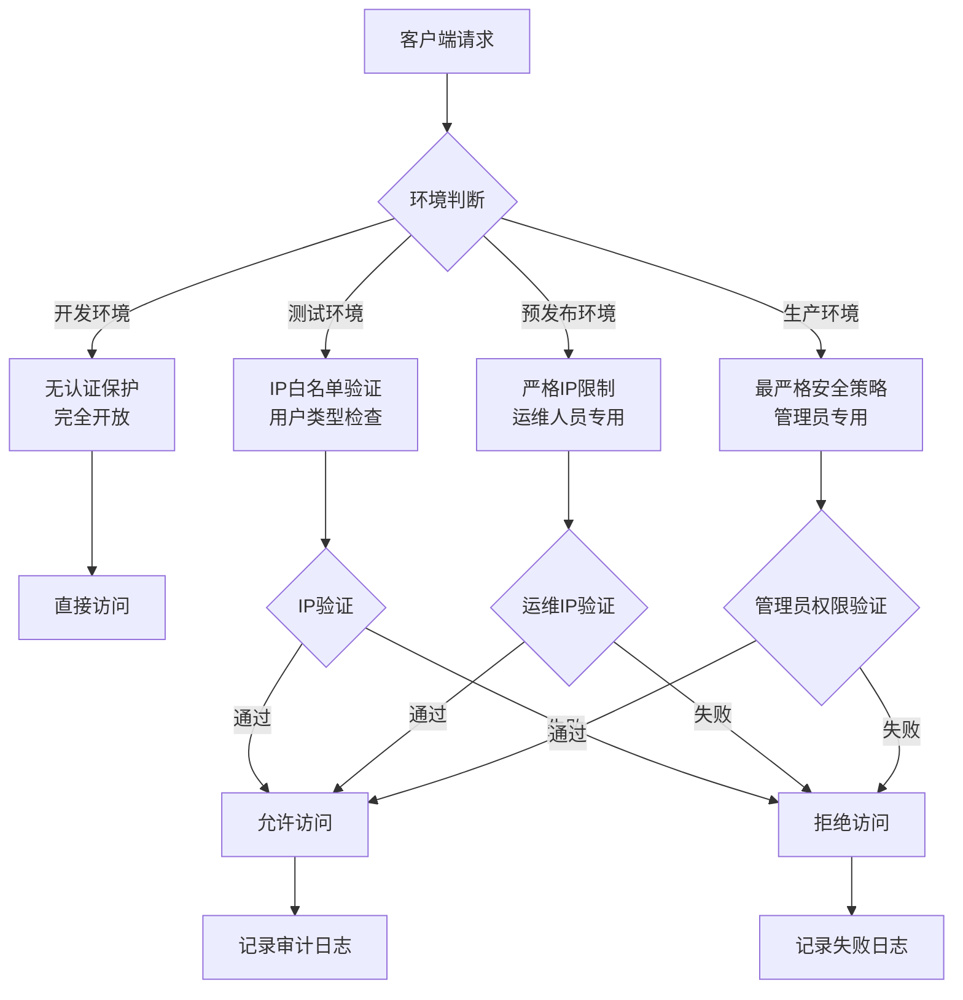
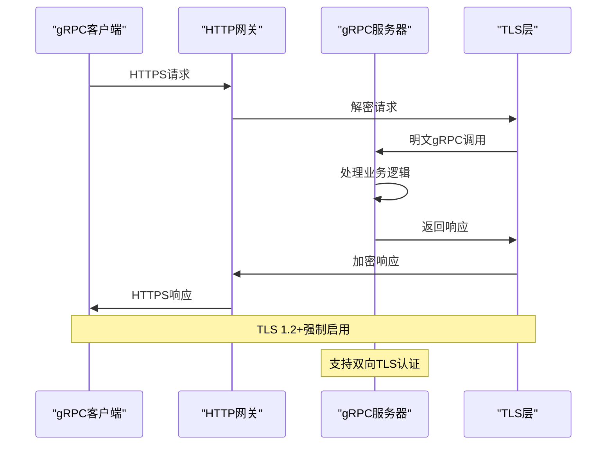
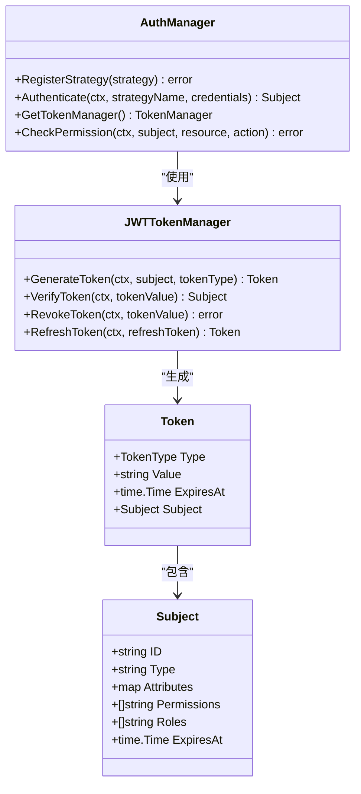
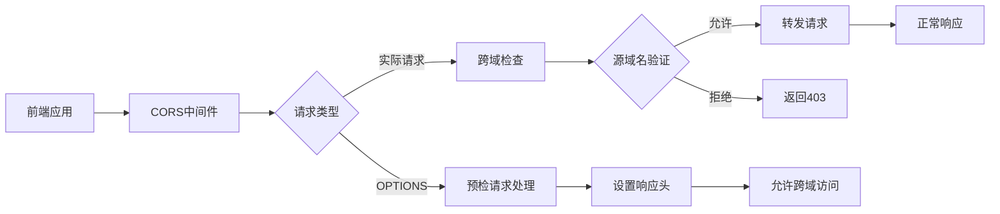
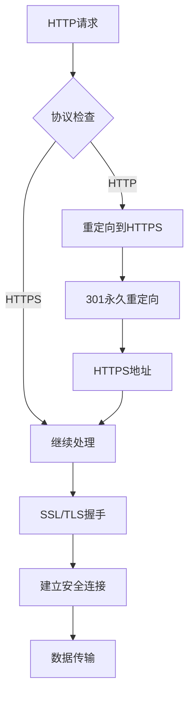

# 传输安全

<cite>
**本文档引用的文件**
- [swagger-security-example.yaml](file://configs/swagger-security-example.yaml)
- [swagger_security.go](file://internal/server/swagger_security.go)
- [grpc.go](file://internal/server/grpc.go)
- [http.go](file://internal/server/http.go)
- [main.go](file://cmd/kratos-boilerplate/main.go)
- [middleware.go](file://internal/pkg/middleware/middleware.go)
- [auth.go](file://internal/pkg/auth/auth.go)
- [middleware.go](file://internal/pkg/auth/middleware.go)
- [config.yaml](file://configs/config.yaml)
- [认证.md](file://docs/认证.md)
</cite>

## 目录
1. [概述](#概述)
2. [Swagger UI安全配置](#swagger-ui安全配置)
3. [gRPC TLS加密通信](#grpc-tls加密通信)
4. [HTTP网关层身份验证](#http网关层身份验证)
5. [CORS跨域策略](#cors跨域策略)
6. [传输层安全最佳实践](#传输层安全最佳实践)
7. [生产环境部署建议](#生产环境部署建议)
8. [总结](#总结)

## 概述

本项目采用了多层次的传输安全保障措施，确保API通信的安全性和完整性。主要包含以下安全特性：

- **Swagger UI访问控制**：基于环境的分级安全策略
- **gRPC通信加密**：通过TLS实现端到端加密
- **HTTP网关认证**：基于JWT的Bearer Token认证机制
- **CORS跨域防护**：严格的跨域资源共享策略
- **传输层加密**：强制HTTPS和TLS 1.2+协议

## Swagger UI安全配置

### 安全架构概览

Swagger UI的安全配置采用分层防护策略，根据不同环境实施差异化的安全控制。



**图表来源**
- [swagger-security-example.yaml](file://configs/swagger-security-example.yaml#L41-L96)
- [swagger_security.go](file://internal/server/swagger_security.go#L133-L194)

### 分级安全策略

系统根据不同的运行环境实施了四级安全策略：

#### 开发环境（development）
- **认证保护**：禁用（false）
- **IP限制**：无限制
- **用户类型**：无限制
- **审计日志**：禁用

#### 测试环境（staging）
- **认证保护**：启用（true）
- **IP限制**：内网段（10.0.0.0/8）、测试网段（172.16.0.0/16）
- **用户类型**：admin、developer、tester、qa
- **审计日志**：启用

#### 预发布环境（pre-production）
- **认证保护**：启用（true）
- **IP限制**：指定机器（172.16.0.100、172.16.0.101）、运维网段（172.16.1.0/24）
- **用户类型**：admin、devops
- **审计日志**：启用

#### 生产环境（production）
- **认证保护**：启用（true）
- **IP限制**：运维跳板机（172.16.0.100、172.16.0.101）
- **用户类型**：仅admin
- **审计日志**：启用
- **JWT验证**：过期时间检查、签发者验证

### JWT认证配置

```yaml
jwt:
  check_expiry: true
  check_issuer: true
  allowed_issuers:
    - "kratos-boilerplate"
    - "auth-service"
```

**节点来源**
- [swagger-security-example.yaml](file://configs/swagger-security-example.yaml#L25-L39)
- [swagger-security-example.yaml](file://configs/swagger-security-example.yaml#L98-L128)

## gRPC TLS加密通信

### TLS配置架构

虽然当前代码中没有显式的TLS配置，但系统设计支持gRPC通信的TLS加密：



**图表来源**
- [grpc.go](file://internal/server/grpc.go#L13-L34)
- [认证.md](file://docs/认证.md#L58)

### gRPC服务器配置

当前gRPC服务器配置相对简单，主要关注基础参数：

```go
func NewGRPCServer(c *conf.Server, greeter *service.GreeterService, logger log.Logger) *grpc.Server {
    var opts = []grpc.ServerOption{
        grpc.Middleware(
            recovery.Recovery(),
        ),
    }
    if c.Grpc.Network != "" {
        opts = append(opts, grpc.Network(c.Grpc.Network))
    }
    if c.Grpc.Addr != "" {
        opts = append(opts, grpc.Address(c.Grpc.Addr))
    }
    if c.Grpc.Timeout != nil {
        opts = append(opts, grpc.Timeout(c.Grpc.Timeout.AsDuration()))
    }
    srv := grpc.NewServer(opts...)
    v1.RegisterGreeterServer(srv, greeter)
    return srv
}
```

**节点来源**
- [grpc.go](file://internal/server/grpc.go#L13-L34)

### TLS加密最佳实践

根据认证文档，系统要求：

1. **TLS版本**：TLS 1.2+强制启用
2. **加密套件**：使用现代加密算法
3. **证书验证**：双向TLS认证支持
4. **密钥管理**：定期更新TLS密钥

## HTTP网关层身份验证

### JWT认证机制

系统实现了完整的JWT认证体系，包括令牌生成、验证和刷新：



**图表来源**
- [auth.go](file://internal/pkg/auth/auth.go#L25-L50)
- [auth.go](file://internal/pkg/auth/auth.go#L120-L150)

### 认证中间件实现

```go
func AuthMiddleware(config *AuthMiddlewareConfig) middleware.Middleware {
    logger := log.NewHelper(log.With(config.Logger, "middleware", "auth"))
    
    return func(handler middleware.Handler) middleware.Handler {
        return func(ctx context.Context, req interface{}) (interface{}, error) {
            tr, ok := transport.FromServerContext(ctx)
            if !ok {
                return handler(ctx, req)
            }
            
            // 检查是否跳过认证
            if shouldSkip(tr, config) {
                return handler(ctx, req)
            }
            
            // 提取令牌
            token, err := extractToken(tr, config)
            if err != nil {
                return nil, errors.Unauthorized("AUTH_TOKEN_MISSING", "Authentication token is required")
            }
            
            // 验证令牌
            subject, err := config.TokenManager.VerifyToken(ctx, token)
            if err != nil {
                return nil, errors.Unauthorized("AUTH_TOKEN_INVALID", "Invalid authentication token")
            }
            
            // 将主体放入上下文
            ctx = context.WithValue(ctx, SubjectKey, subject)
            
            return handler(ctx, req)
        }
    }
}
```

**节点来源**
- [middleware.go](file://internal/pkg/auth/middleware.go#L30-L70)

### 令牌生命周期管理

- **Access Token**：15分钟有效期，用于日常API调用
- **Refresh Token**：7天有效期，单次使用，用于令牌刷新
- **API Token**：1年有效期，用于长期访问

### 权限控制机制

系统支持基于角色和权限的细粒度访问控制：

```go
func (m *DefaultAuthManager) CheckPermission(ctx context.Context, subject *Subject, resource string, action string) error {
    permission := fmt.Sprintf("%s:%s", resource, action)
    
    for _, perm := range subject.Permissions {
        if perm == "*" || perm == permission {
            return nil
        }
        if matchWildcard(perm, permission) {
            return nil
        }
    }
    
    return fmt.Errorf("permission denied: %s", permission)
}
```

**节点来源**
- [auth.go](file://internal/pkg/auth/auth.go#L100-L115)

## CORS跨域策略

### CORS配置架构

虽然当前CORS中间件主要作为示例存在，但系统设计支持灵活的跨域配置：



**图表来源**
- [middleware.go](file://internal/pkg/middleware/middleware.go#L147-L176)

### 默认CORS配置

```go
func DefaultCORSConfig() *CORSConfig {
    return &CORSConfig{
        AllowOrigins: []string{"*"},
        AllowMethods: []string{"GET", "POST", "PUT", "DELETE", "OPTIONS"},
        AllowHeaders: []string{"Accept", "Authorization", "Content-Type", "X-CSRF-Token"},
        MaxAge:       86400,
    }
}
```

### 跨域安全考虑

1. **源域名限制**：生产环境应限制为具体可信域名
2. **方法白名单**：只允许必要的HTTP方法
3. **头部安全**：谨慎暴露自定义头部
4. **凭证处理**：合理配置凭据传递策略

**节点来源**
- [middleware.go](file://internal/pkg/middleware/middleware.go#L158-L166)

## 传输层安全最佳实践

### HTTPS强制启用

系统设计要求所有外部API调用必须通过HTTPS进行：



### 证书管理策略

1. **证书类型**：使用EV证书增强信任
2. **有效期**：建议不超过90天
3. **密钥长度**：RSA 2048位或ECC 256位
4. **证书链**：完整包含中间证书和根证书

### 加密算法选择

- **对称加密**：AES-256-GCM
- **非对称加密**：RSA 2048位或ECDSA P-256
- **哈希算法**：SHA-256
- **密钥交换**：ECDHE

## 生产环境部署建议

### 网络安全配置

1. **防火墙规则**
   - 仅开放必要的端口（80/443）
   - 实施IP白名单策略
   - 配置DDoS防护

2. **负载均衡器配置**
   - SSL终止于LB层
   - 实施健康检查
   - 配置会话保持

3. **监控和告警**
   - 实施实时流量监控
   - 设置异常行为告警
   - 记录所有访问日志

### 安全加固措施

```yaml
# 生产环境安全配置示例
swagger_ui:
  security:
    enable_auth: true
    allowed_ips:
      - "172.16.0.100"  # 运维跳板机
      - "172.16.0.101"  # 备用跳板机
    allowed_user_types:
      - "admin"
    enable_audit_log: true
    jwt:
      check_expiry: true
      check_issuer: true
      allowed_issuers:
        - "production-auth-service"
```

**节点来源**
- [swagger-security-example.yaml](file://configs/swagger-security-example.yaml#L70-L85)

### 审计和合规

1. **访问日志**：记录所有API调用
2. **安全事件**：跟踪认证失败和异常访问
3. **合规报告**：定期生成安全审计报告
4. **数据脱敏**：敏感信息在日志中脱敏处理

## 总结

本项目构建了一个全面的传输安全体系，涵盖了从API网关到后端服务的各个层面：

### 核心安全特性

1. **多层防护**：Swagger UI、gRPC、HTTP网关各层级都有相应的安全措施
2. **分级策略**：根据不同环境实施差异化的安全控制
3. **JWT认证**：完整的令牌管理体系，支持多种认证策略
4. **权限控制**：基于角色和资源的细粒度权限管理
5. **CORS防护**：严格的跨域资源共享策略

### 安全优势

- **端到端加密**：从客户端到服务器全程加密
- **多重认证**：支持多种认证方式和增强认证
- **细粒度权限**：精确的资源访问控制
- **审计追踪**：完整的操作日志和审计功能
- **灵活配置**：支持不同环境的安全策略调整

### 部署建议

- **生产环境**：启用所有安全功能，严格限制访问范围
- **开发环境**：适当放宽限制以便开发调试
- **监控告警**：实施全面的监控和异常检测
- **定期更新**：及时更新安全配置和依赖组件

通过这些传输安全保障措施，系统能够有效抵御各种网络攻击，确保API通信的安全性和可靠性。