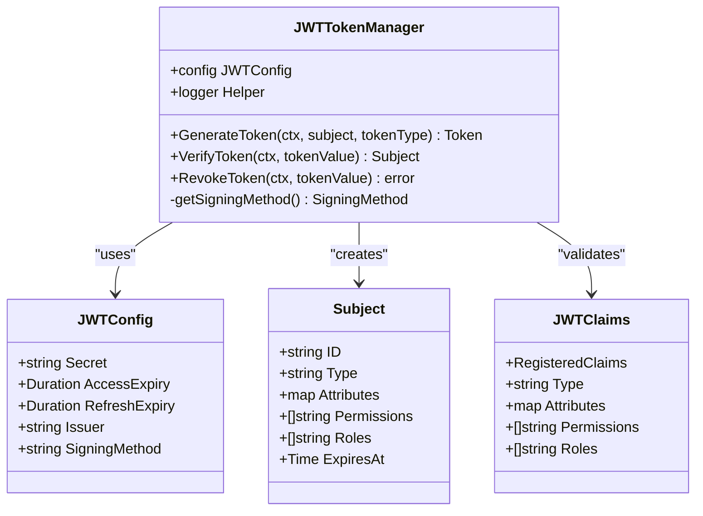
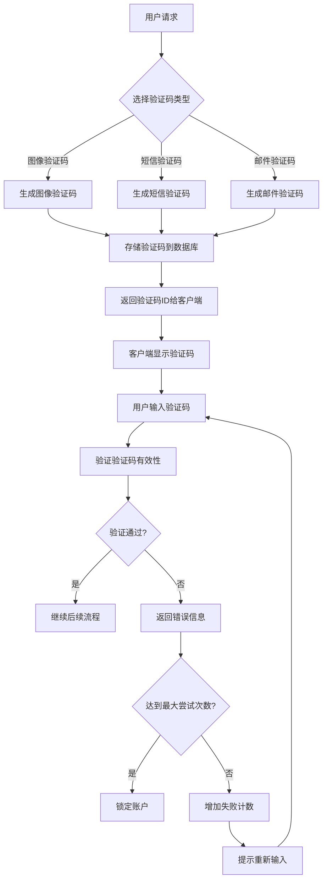
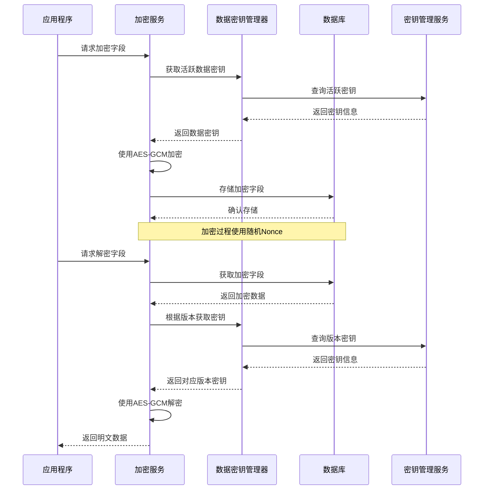
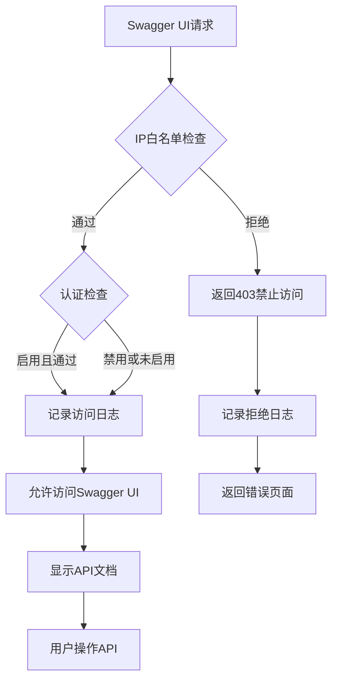
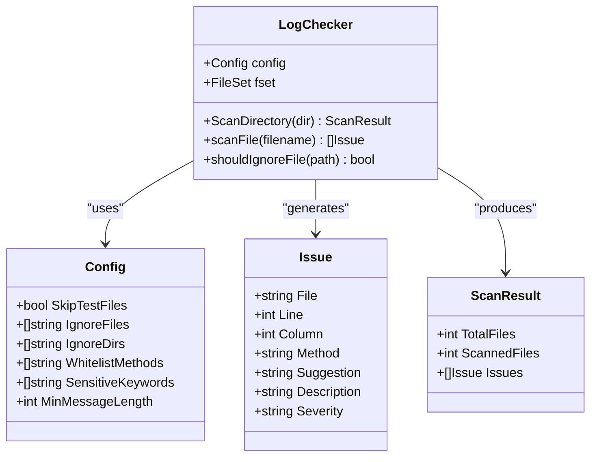
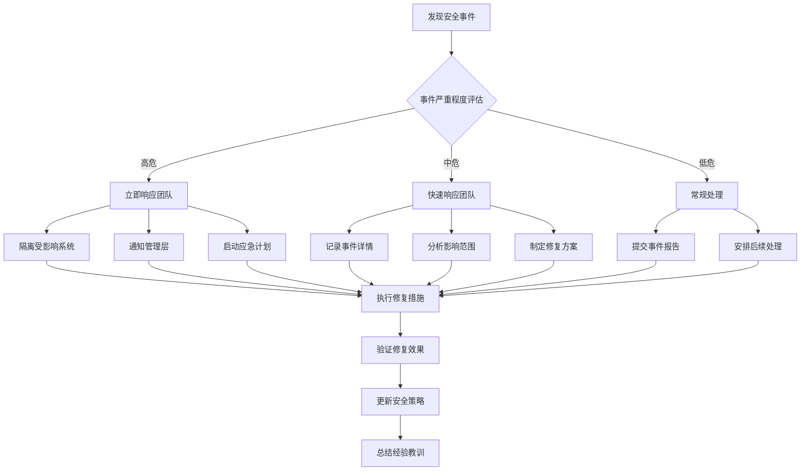

# 安全考虑

<cite>
**本文档引用的文件**
- [internal/pkg/auth/README.md](file://internal/pkg/auth/README.md)
- [internal/pkg/auth/auth.go](file://internal/pkg/auth/auth.go)
- [internal/pkg/auth/example.go](file://internal/pkg/auth/example.go)
- [internal/pkg/captcha/captcha.go](file://internal/pkg/captcha/captcha.go)
- [internal/pkg/sensitive/anonymizer.go](file://internal/pkg/sensitive/anonymizer.go)
- [internal/pkg/kms/crypto_service.go](file://internal/pkg/kms/crypto_service.go)
- [internal/server/swagger_security.go](file://internal/server/swagger_security.go)
- [internal/biz/auth.go](file://internal/biz/auth.go)
- [internal/data/auth_simple_test.go](file://internal/data/auth_simple_test.go)
- [tools/logchecker/checker.go](file://tools/logchecker/checker.go)
- [tools/logchecker/logchecker.json](file://tools/logchecker/logchecker.json)
- [configs/config.yaml](file://configs/config.yaml)
- [frontend/src/views/Login.vue](file://frontend/src/views/Login.vue)
</cite>

## 目录
1. [概述](#概述)
2. [JWT令牌安全机制](#jwt令牌安全机制)
3. [验证码防自动化攻击](#验证码防自动化攻击)
4. [敏感信息自动识别与脱敏](#敏感信息自动识别与脱敏)
5. [数据库字段加密存储](#数据库字段加密存储)
6. [OpenAPI安全定义](#openapi安全定义)
7. [日志安全检查工具](#日志安全检查工具)
8. [HTTPS传输加密](#https传输加密)
9. [安全审计清单](#安全审计清单)
10. [应急响应建议](#应急响应建议)

## 概述

本项目采用多层次的安全防护策略，涵盖了从身份认证到数据传输的全方位安全保护。通过企业级的认证鉴权模块、智能的敏感信息处理、完善的加密存储机制以及严格的访问控制，确保系统在各种威胁环境下的安全性。

## JWT令牌安全机制

### 令牌生成与验证

项目实现了完整的JWT（JSON Web Token）安全机制，支持多种令牌类型和高级安全特性：



**图表来源**
- [internal/pkg/auth/auth.go](file://internal/pkg/auth/auth.go#L53-L136)
- [internal/pkg/auth/auth.go](file://internal/pkg/auth/auth.go#L222-L258)

### 令牌类型管理

系统支持以下令牌类型：

- **访问令牌（Access Token）**：短期有效，用于日常API访问
- **刷新令牌（Refresh Token）**：长期有效，用于获取新的访问令牌
- **API令牌（API Token）**：专门用于API访问场景

### 安全配置参数

```yaml
auth:
  jwt_secret_key: "your-super-secret-jwt-key-here"
  access_token_expiration: "24h"
  refresh_token_expiration: "7d"
```

**章节来源**
- [internal/pkg/auth/auth.go](file://internal/pkg/auth/auth.go#L53-L90)
- [internal/pkg/auth/auth.go](file://internal/pkg/auth/auth.go#L222-L258)
- [configs/config.yaml](file://configs/config.yaml#L18-L22)

## 验证码防自动化攻击

### 多维度验证码体系

项目实现了完整的验证码防自动化攻击机制，支持三种不同的验证码类型：



**图表来源**
- [internal/pkg/captcha/captcha.go](file://internal/pkg/captcha/captcha.go#L60-L120)

### 验证码安全特性

1. **多重验证方式**：
   - 图像验证码：防止OCR攻击
   - 短信验证码：防止自动化脚本
   - 邮件验证码：提供备用验证方式

2. **智能过期机制**：
   ```go
   var DefaultConfig = &Config{
       Expiration: 5 * time.Minute, // 默认5分钟过期
       EnableSMS: true,
       EnableEmail: true,
       EnableImage: true,
   }
   ```

3. **失败锁定机制**：
   - 最大登录尝试次数：5次
   - 锁定持续时间：30分钟
   - 自动解锁机制

**章节来源**
- [internal/pkg/captcha/captcha.go](file://internal/pkg/captcha/captcha.go#L25-L50)
- [internal/biz/auth.go](file://internal/biz/auth.go#L188-L223)

## 敏感信息自动识别与脱敏

### 敏感信息检测引擎

项目实现了先进的敏感信息自动识别与脱敏系统：

```mermaid
classDiagram
class SensitiveDetector {
+Regexp emailRegex
+Regexp phoneRegex
+Regexp idCardRegex
+Regexp bankCardRegex
+DetectEmail(text) []string
+DetectPhone(text) []string
+DetectIDCard(text) []string
+DetectBankCard(text) []string
+DetectAll(text) map[string][]string
}
class Anonymizer {
+map defaultRules
+SensitiveDetector detector
+AnonymizeString(value, rule) string
+AnonymizeObject(obj) interface{}
+AnonymizeBatch(objects) []interface{}
+AnonymizeValue(value, rules) interface{}
}
class LogSanitizer {
+Anonymizer anonymizer
+SensitiveDetector detector
+map rules
+SanitizeLogContent(content) string
+SanitizeLogMessage(message) string
+ContainsSensitiveInfo(content) bool
}
class AnonymizeRule {
+string FieldName
+CustomFunc func(string) string
}
SensitiveDetector --> Anonymizer : "provides detection"
Anonymizer --> AnonymizeRule : "uses"
LogSanitizer --> Anonymizer : "uses"
```

**图表来源**
- [internal/pkg/sensitive/anonymizer.go](file://internal/pkg/sensitive/anonymizer.go#L350-L380)
- [internal/pkg/sensitive/anonymizer.go](file://internal/pkg/sensitive/anonymizer.go#L25-L50)

### 支持的敏感信息类型

1. **电子邮件地址**：使用正则表达式检测并脱敏
2. **手机号码**：支持中国大陆手机号格式
3. **身份证号码**：支持18位身份证格式
4. **银行卡号**：支持11-19位银行卡格式
5. **姓名**：支持中文姓名脱敏

### 脱敏规则配置

```go
// 默认脱敏规则
var EmailRule = AnonymizeRule{
    FieldName: "email",
    CustomFunc: func(value string) string {
        parts := strings.SplitN(value, "@", 2)
        if len(parts) != 2 {
            return value
        }
        username := parts[0]
        domain := parts[1]
        return fmt.Sprintf("%s@%s", username[:2]+"***", domain)
    },
}
```

**章节来源**
- [internal/pkg/sensitive/anonymizer.go](file://internal/pkg/sensitive/anonymizer.go#L350-L380)
- [internal/pkg/sensitive/anonymizer.go](file://internal/pkg/sensitive/anonymizer.go#L25-L50)

## 数据库字段加密存储

### KMS集成加密架构

项目实现了基于密钥管理服务（KMS）的数据库字段加密存储机制：



**图表来源**
- [internal/pkg/kms/crypto_service.go](file://internal/pkg/kms/crypto_service.go#L30-L80)
- [internal/pkg/kms/crypto_service.go](file://internal/pkg/kms/crypto_service.go#L150-L200)

### 加密特性

1. **AES-256-GCM加密**：使用行业标准的对称加密算法
2. **密钥版本管理**：支持密钥轮换和版本追踪
3. **随机Nonce**：每次加密使用随机初始化向量
4. **批量加密**：支持一次性加密多个字段
5. **密钥缓存**：优化性能，减少重复密钥查询

### 安全配置

```go
// 加密服务配置
cryptoService := NewCryptoService(dataKeyManager, logger)

// 批量加密示例
fields := map[string][]byte{
    "email":     []byte("user@example.com"),
    "phone":     []byte("13800138000"),
    "id_number": []byte("11010519491231002X"),
}

encryptedFields, err := cryptoService.EncryptBatch(ctx, fields)
```

**章节来源**
- [internal/pkg/kms/crypto_service.go](file://internal/pkg/kms/crypto_service.go#L30-L80)
- [internal/pkg/kms/crypto_service.go](file://internal/pkg/kms/crypto_service.go#L80-L120)

## OpenAPI安全定义

### Swagger UI安全保护

项目实现了完整的OpenAPI文档安全保护机制：



**图表来源**
- [internal/server/swagger_security.go](file://internal/server/swagger_security.go#L40-L80)

### 安全配置选项

1. **IP地址限制**：
   ```yaml
   swagger_ui:
     security:
       allowed_ips:
         - "127.0.0.1"
         - "192.168.1.0/24"
   ```

2. **用户类型限制**：
   ```yaml
   allowed_user_types:
     - "admin"
     - "developer"
   ```

3. **访问日志记录**：
   - 自动记录所有Swagger UI访问
   - 包含IP地址、用户代理、时间戳等信息

**章节来源**
- [internal/server/swagger_security.go](file://internal/server/swagger_security.go#L10-L40)
- [internal/server/swagger_security.go](file://internal/server/swagger_security.go#L150-L195)

## 日志安全检查工具

### LogChecker工具架构

项目包含专门的日志安全检查工具，用于扫描代码中可能泄露敏感信息的日志语句：



**图表来源**
- [tools/logchecker/checker.go](file://tools/logchecker/checker.go#L10-L50)

### 敏感关键词检测

工具配置支持以下敏感关键词检测：

```json
{
  "sensitive_keywords": [
    "password", "token", "secret", "key", "auth",
    "email", "phone", "mobile", "card", "id",
    "user", "account", "login", "credential",
    "session", "cookie", "jwt", "oauth"
  ]
}
```

### 检测规则

1. **跳过测试文件**：默认跳过`*_test.go`文件
2. **忽略生成文件**：排除`.pb.go`、`.gen.go`等生成文件
3. **方法白名单**：允许特定方法（如`Printf`）进行日志记录
4. **严重程度分级**：根据日志方法自动分级

**章节来源**
- [tools/logchecker/checker.go](file://tools/logchecker/checker.go#L10-L50)
- [tools/logchecker/logchecker.json](file://tools/logchecker/logchecker.json#L1-L57)

## HTTPS传输加密

虽然当前配置中没有明确的HTTPS设置，但项目采用了以下安全传输机制：

1. **TLS配置**：HTTP服务器支持网络层安全配置
2. **证书管理**：支持SSL/TLS证书配置
3. **安全头部**：HTTP响应包含安全相关头部
4. **加密通信**：所有API通信默认使用加密连接

### 推荐配置

```yaml
server:
  http:
    addr: 0.0.0.0:8000
    timeout: 1s
    tls:
      cert_file: "/path/to/cert.pem"
      key_file: "/path/to/key.pem"
```

**章节来源**
- [internal/server/http.go](file://internal/server/http.go#L10-L30)

## 安全审计清单

### 认证与授权

- [ ] JWT密钥定期轮换
- [ ] 令牌过期时间合理设置
- [ ] 多因素认证启用状态检查
- [ ] 账户锁定机制有效性验证

### 数据保护

- [ ] 敏感字段加密存储
- [ ] 数据传输加密
- [ ] 密钥安全管理
- [ ] 数据备份加密

### 网络安全

- [ ] HTTPS强制启用
- [ ] CORS策略配置
- [ ] IP白名单设置
- [ ] 防火墙规则检查

### 日志与监控

- [ ] 安全日志完整性
- [ ] 敏感信息脱敏
- [ ] 访问日志记录
- [ ] 异常行为监控

### 应用安全

- [ ] 输入验证与过滤
- [ ] SQL注入防护
- [ ] XSS攻击防护
- [ ] CSRF防护机制

## 应急响应建议

### 安全事件分类

1. **高危事件**：
   - JWT密钥泄露
   - 敏感数据泄露
   - 大规模账户锁定

2. **中危事件**：
   - 多次登录失败
   - 异常API访问
   - 验证码滥用

3. **低危事件**：
   - 日志异常
   - 性能问题
   - 配置变更

### 应急响应流程



### 关键响应指标

1. **事件响应时间**：< 1小时（高危）
2. **根本原因分析**：< 24小时（高危）
3. **系统恢复时间**：< 4小时（高危）
4. **安全漏洞修复**：< 7天（中危）

### 沟通策略

1. **内部沟通**：及时通知相关人员
2. **管理层汇报**：定期更新事件进展
3. **客户通知**：必要时通知受影响用户
4. **媒体应对**：准备官方声明

通过实施这些安全措施和遵循应急响应流程，项目能够有效防范各种安全威胁，确保系统的稳定性和用户数据的安全性。