# 字段级加密方案

<cite>
**本文档引用的文件**
- [manager.go](file://internal/pkg/kms/manager.go)
- [datakey.go](file://internal/pkg/kms/datakey.go)
- [crypto_service.go](file://internal/pkg/kms/crypto_service.go)
- [interfaces.go](file://internal/pkg/kms/interfaces.go)
- [kms.go](file://internal/biz/kms.go)
- [kms.go](file://internal/data/kms.go)
- [aes.go](file://internal/pkg/crypto/aes.go)
- [auth.go](file://internal/data/auth.go)
- [000002_create_kms_data_keys.up.sql](file://migrations/000002_create_kms_data_keys.up.sql)
- [crypto_service_test.go](file://internal/pkg/kms/crypto_service_test.go)
</cite>

## 目录
1. [简介](#简介)
2. [项目结构概览](#项目结构概览)
3. [核心组件分析](#核心组件分析)
4. [架构设计](#架构设计)
5. [详细组件分析](#详细组件分析)
6. [密钥管理体系](#密钥管理体系)
7. [加密解密流程](#加密解密流程)
8. [数据库迁移与存储](#数据库迁移与存储)
9. [性能考虑](#性能考虑)
10. [故障处理与安全审计](#故障处理与安全审计)
11. [总结](#总结)

## 简介

本文档全面描述了基于KMS（密钥管理服务）的字段级加密架构设计。该方案采用分层密钥体系，通过数据密钥（Data Key）与根密钥（Root Key）的分离设计，实现了高安全性、高性能的敏感数据保护机制。

该架构的核心特点包括：
- **分层密钥体系**：根密钥负责保护数据密钥，数据密钥负责加密具体业务数据
- **AES-GCM算法**：采用业界标准的对称加密算法，提供认证加密功能
- **密钥缓存机制**：优化性能，减少重复密钥查询开销
- **自动密钥轮换**：定期更新数据密钥，增强安全性
- **完整的生命周期管理**：从密钥生成到销毁的全生命周期管理

## 项目结构概览

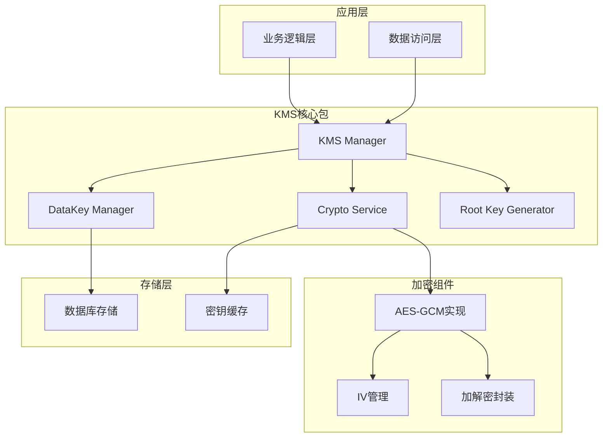

**图表来源**
- [manager.go](file://internal/pkg/kms/manager.go#L1-L50)
- [datakey.go](file://internal/pkg/kms/datakey.go#L1-L30)
- [crypto_service.go](file://internal/pkg/kms/crypto_service.go#L1-L30)

## 核心组件分析

### KMS Manager（KMS管理器）

KMS Manager是整个加密系统的核心协调器，负责初始化、管理和协调各个子组件的工作。

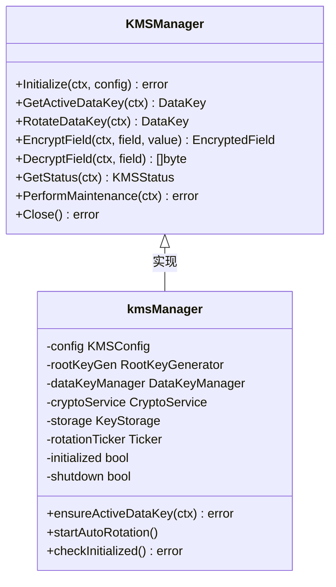

**图表来源**
- [manager.go](file://internal/pkg/kms/manager.go#L15-L30)
- [interfaces.go](file://internal/pkg/kms/interfaces.go#L1-L50)

### DataKey Manager（数据密钥管理器）

DataKey Manager专门负责数据密钥的生成、存储和管理，确保每个业务数据都有独立的加密密钥。

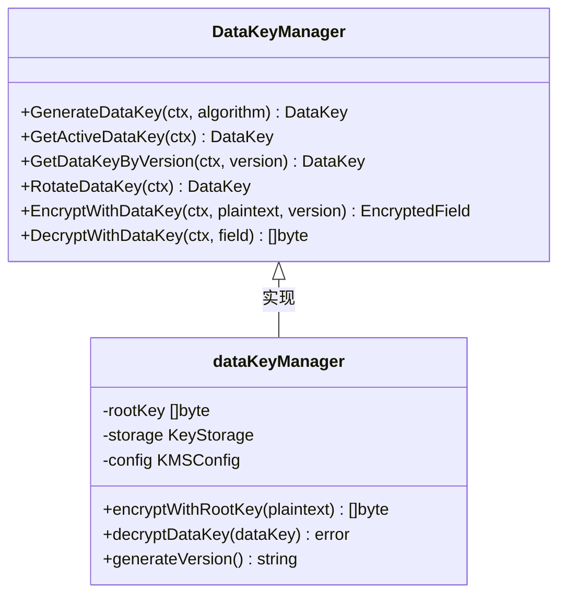

**图表来源**
- [datakey.go](file://internal/pkg/kms/datakey.go#L15-L30)
- [interfaces.go](file://internal/pkg/kms/interfaces.go#L95-L125)

### Crypto Service（加密服务）

Crypto Service提供统一的加解密接口，内部集成了密钥缓存机制，优化性能表现。

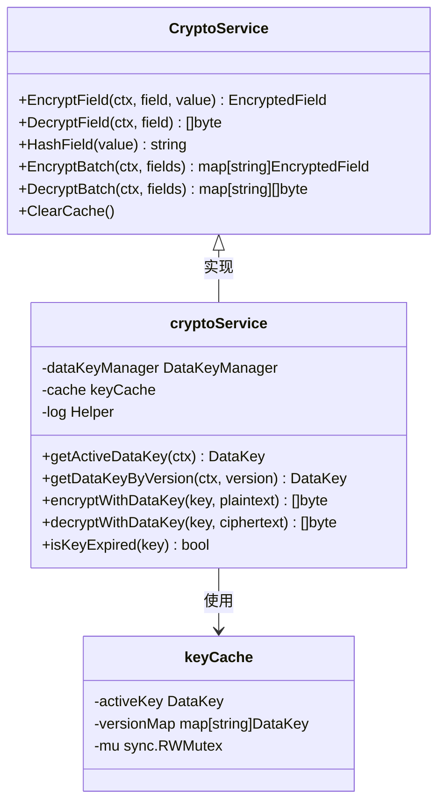

**图表来源**
- [crypto_service.go](file://internal/pkg/kms/crypto_service.go#L15-L40)
- [interfaces.go](file://internal/pkg/kms/interfaces.go#L125-L150)

**章节来源**
- [manager.go](file://internal/pkg/kms/manager.go#L1-L308)
- [datakey.go](file://internal/pkg/kms/datakey.go#L1-L251)
- [crypto_service.go](file://internal/pkg/kms/crypto_service.go#L1-L321)

## 架构设计

### 分层密钥体系

该架构采用两层密钥体系设计，实现了密钥的安全隔离和灵活管理：

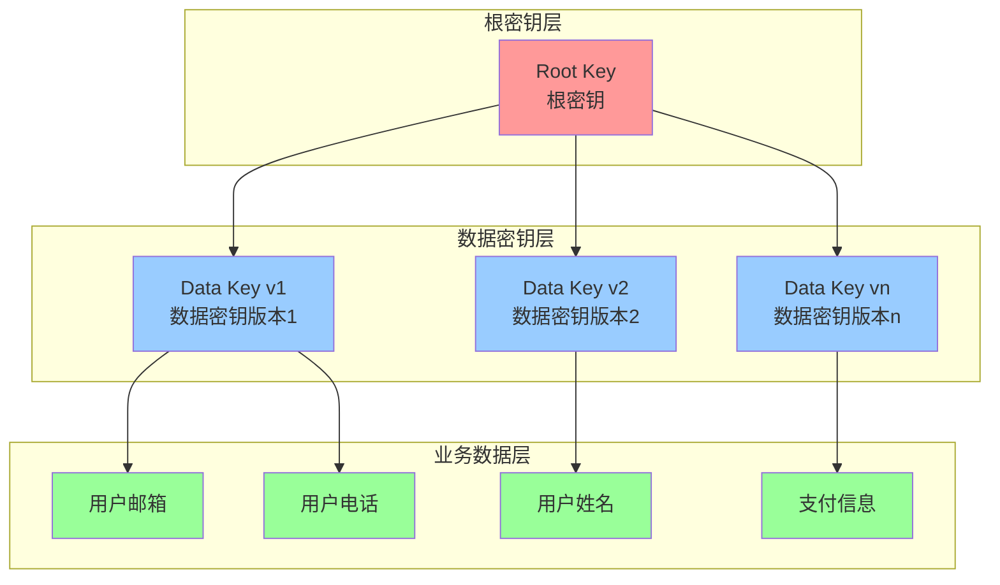

**图表来源**
- [datakey.go](file://internal/pkg/kms/datakey.go#L30-L80)
- [kms.go](file://internal/biz/kms.go#L10-L20)

### 系统架构总览

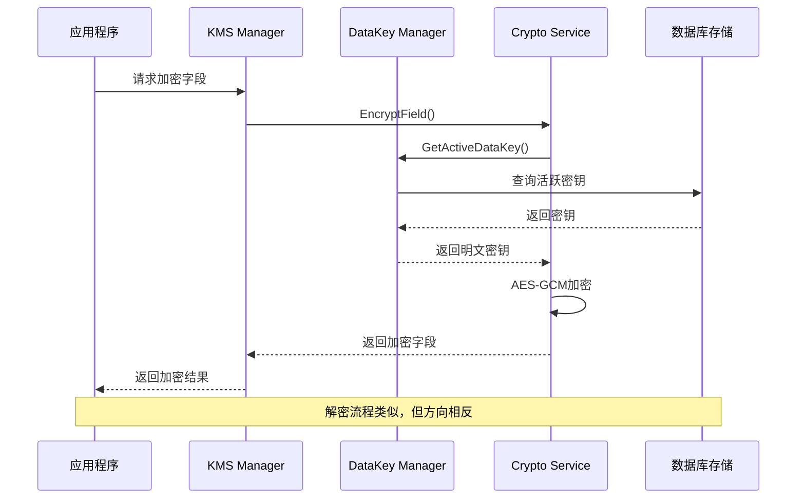

**图表来源**
- [manager.go](file://internal/pkg/kms/manager.go#L120-L140)
- [crypto_service.go](file://internal/pkg/kms/crypto_service.go#L42-L70)

**章节来源**
- [manager.go](file://internal/pkg/kms/manager.go#L1-L308)
- [datakey.go](file://internal/pkg/kms/datakey.go#L1-L251)
- [crypto_service.go](file://internal/pkg/kms/crypto_service.go#L1-L321)

## 详细组件分析

### 密钥生成与加密流程

#### 数据密钥生成过程

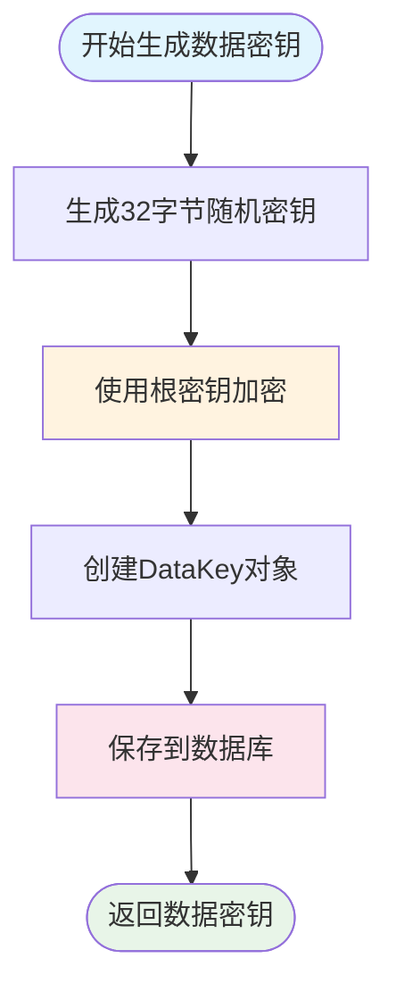

**图表来源**
- [datakey.go](file://internal/pkg/kms/datakey.go#L30-L60)

#### AES-GCM算法实现

系统采用AES-GCM（Galois/Counter Mode）作为主要加密算法，具有以下优势：

1. **认证加密**：同时提供机密性和完整性保护
2. **高效性能**：硬件加速支持，适合大规模数据处理
3. **标准化**：广泛接受的国际标准

```go
// AES-GCM加密实现示例
block, err := aes.NewCipher(dataKey.Key)
gcm, err := cipher.NewGCM(block)
nonce := make([]byte, gcm.NonceSize())
rand.Read(nonce)
ciphertext := gcm.Seal(nonce, nonce, plaintext, nil)
```

### 密钥缓存机制

为了提高性能，Crypto Service实现了两级缓存机制：

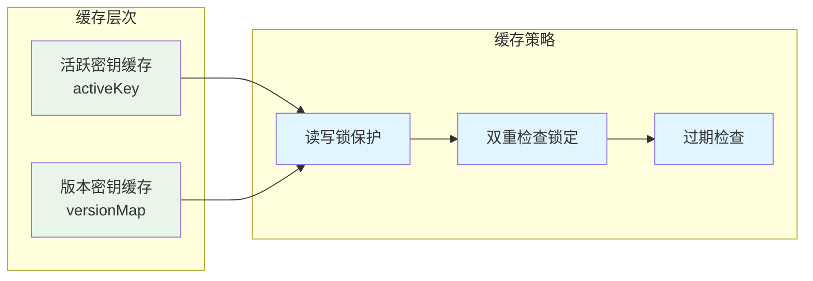

**图表来源**
- [crypto_service.go](file://internal/pkg/kms/crypto_service.go#L180-L220)

### 自动密钥轮换

系统支持定时密钥轮换，确保长期安全性：

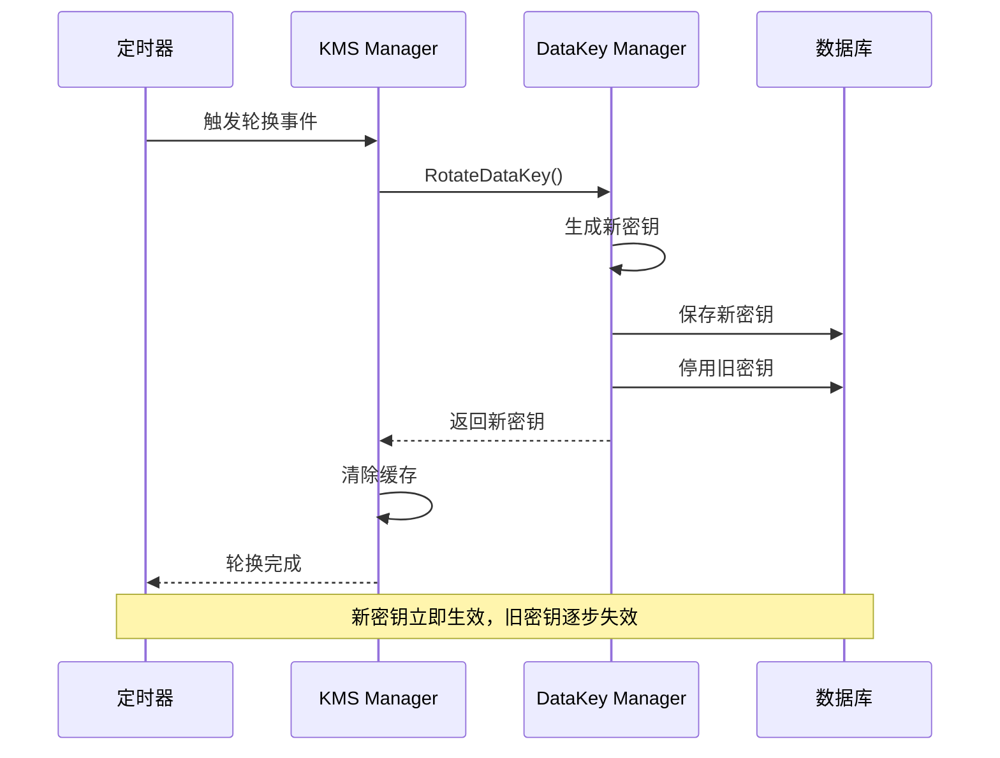

**图表来源**
- [manager.go](file://internal/pkg/kms/manager.go#L250-L280)

**章节来源**
- [datakey.go](file://internal/pkg/kms/datakey.go#L30-L100)
- [crypto_service.go](file://internal/pkg/kms/crypto_service.go#L180-L250)
- [manager.go](file://internal/pkg/kms/manager.go#L250-L308)

## 密钥管理体系

### 数据密钥结构设计

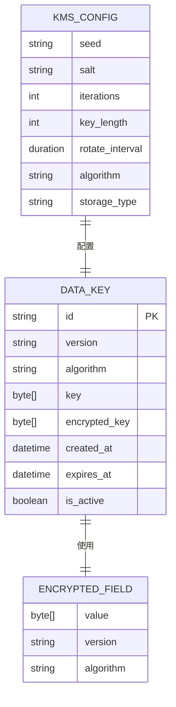

**图表来源**
- [kms.go](file://internal/biz/kms.go#L10-L80)

### 密钥生命周期管理

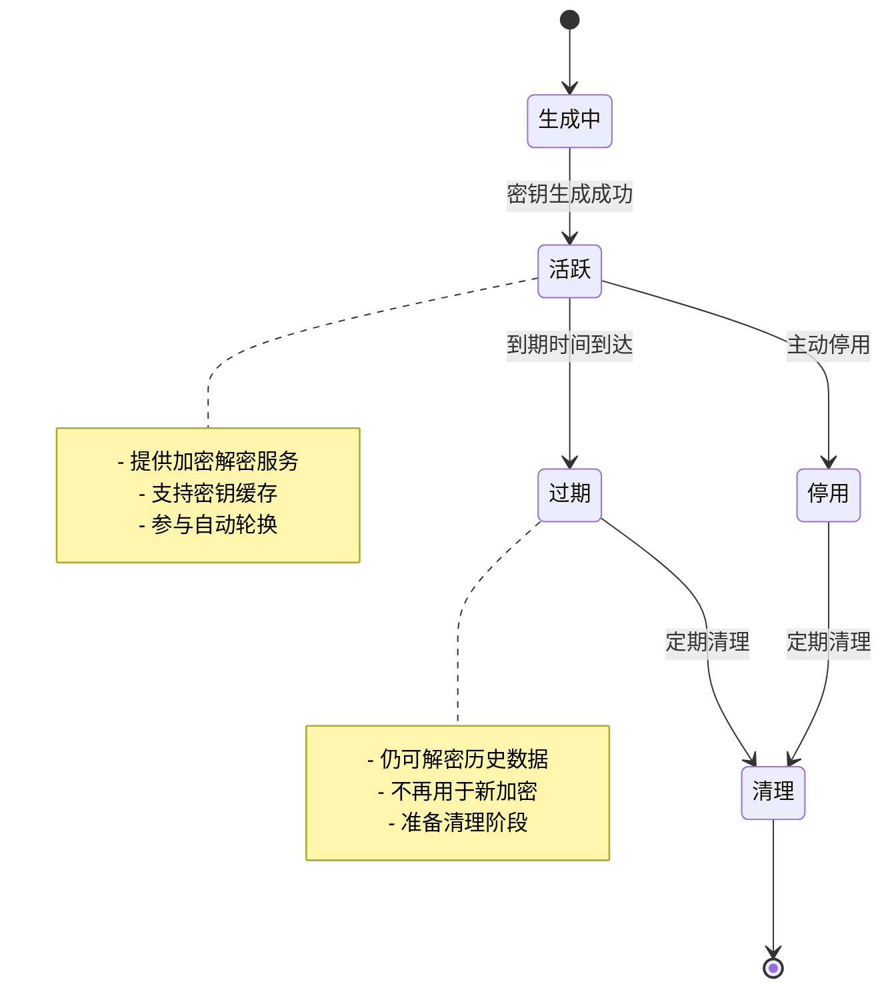

### 密钥存储与检索

系统采用数据库存储密钥，支持高效的密钥检索：

```sql
-- 活跃密钥查询（优先级最高）
SELECT * FROM data_keys 
WHERE is_active = true 
  AND expires_at > NOW() 
ORDER BY created_at DESC 
LIMIT 1;

-- 版本密钥查询（支持历史解密）
SELECT * FROM data_keys 
WHERE version = ? 
  AND expires_at > NOW();
```

**章节来源**
- [kms.go](file://internal/biz/kms.go#L10-L80)
- [kms.go](file://internal/data/kms.go#L50-L150)

## 加密解密流程

### 完整调用链路

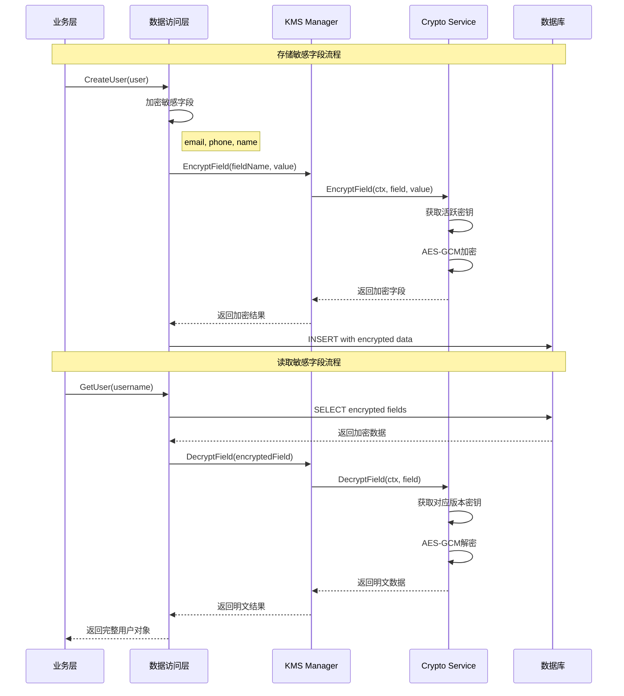

**图表来源**
- [auth.go](file://internal/data/auth.go#L100-L150)
- [manager.go](file://internal/pkg/kms/manager.go#L120-L140)

### 批量加解密优化

系统支持批量加解密操作，显著提升性能：

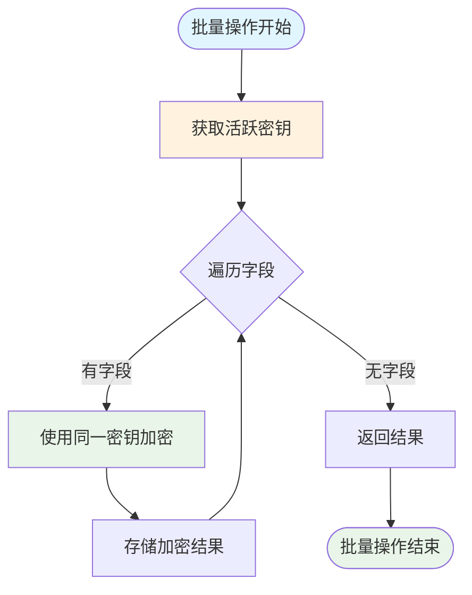

**图表来源**
- [crypto_service.go](file://internal/pkg/kms/crypto_service.go#L80-L120)

### 错误处理与恢复

系统实现了完善的错误处理机制：

```go
// 加密错误处理示例
func (s *cryptoService) EncryptField(ctx context.Context, fieldName string, value []byte) (*biz.EncryptedField, error) {
    if len(value) == 0 {
        return nil, fmt.Errorf("value cannot be empty")
    }
    
    dataKey, err := s.getActiveDataKey(ctx)
    if err != nil {
        return nil, fmt.Errorf("failed to get active data key: %w", err)
    }
    
    encryptedValue, err := s.encryptWithDataKey(dataKey, value)
    if err != nil {
        return nil, fmt.Errorf("%w: %v", biz.ErrKeyEncryptionFail, err)
    }
    
    return &biz.EncryptedField{
        Value:     encryptedValue,
        Version:   dataKey.Version,
        Algorithm: dataKey.Algorithm,
    }, nil
}
```

**章节来源**
- [auth.go](file://internal/data/auth.go#L100-L200)
- [crypto_service.go](file://internal/pkg/kms/crypto_service.go#L42-L120)

## 数据库迁移与存储

### 数据密钥表设计

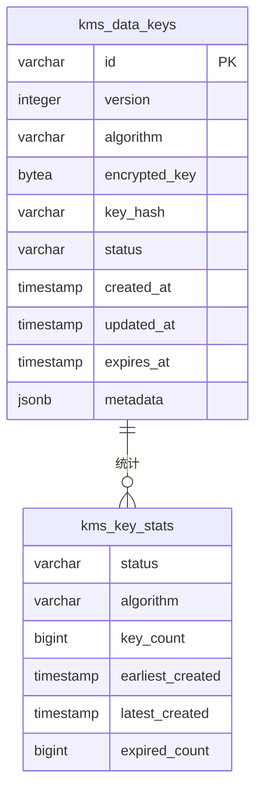

**图表来源**
- [000002_create_kms_data_keys.up.sql](file://migrations/000002_create_kms_data_keys.up.sql#L1-L30)

### 存储设计要点

1. **加密密钥存储**：只存储使用根密钥加密后的数据密钥
2. **版本控制**：支持多版本密钥共存，便于密钥轮换
3. **状态管理**：记录密钥状态（活跃、非活跃、过期、撤销）
4. **索引优化**：为常用查询条件建立索引
5. **统计视图**：提供密钥使用情况的统计信息

### 数据库操作接口

```go
// KMSRepo接口定义
type KMSRepo interface {
    SaveDataKey(ctx context.Context, key *DataKey) error
    GetActiveDataKey(ctx context.Context) (*DataKey, error)
    GetDataKeyByVersion(ctx context.Context, version string) (*DataKey, error)
    UpdateKeyStatus(ctx context.Context, version string, isActive bool) error
    CleanupExpiredKeys(ctx context.Context) error
    GetKeyStatistics(ctx context.Context) (*KeyStatistics, error)
}
```

**章节来源**
- [000002_create_kms_data_keys.up.sql](file://migrations/000002_create_kms_data_keys.up.sql#L1-L70)
- [kms.go](file://internal/data/kms.go#L10-L50)

## 性能考虑

### 密钥缓存策略

系统实现了智能缓存机制，显著提升性能：

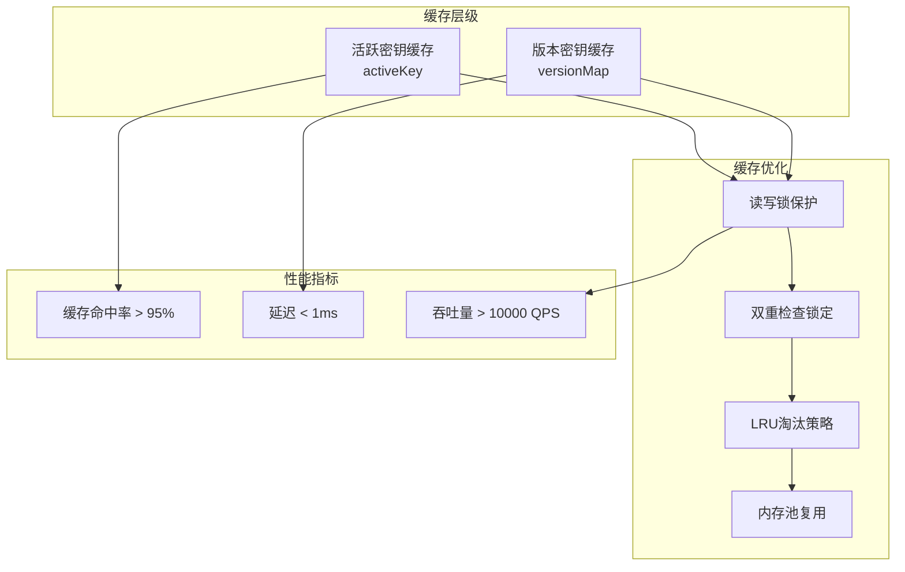

### 批量处理优化

```go
// 批量加密示例
func (s *cryptoService) EncryptBatch(ctx context.Context, fields map[string][]byte) (map[string]*biz.EncryptedField, error) {
    // 一次性获取活跃密钥
    dataKey, err := s.getActiveDataKey(ctx)
    if err != nil {
        return nil, fmt.Errorf("failed to get active data key: %w", err)
    }
    
    // 使用同一密钥批量加密
    result := make(map[string]*biz.EncryptedField, len(fields))
    for fieldName, value := range fields {
        encryptedValue, err := s.encryptWithDataKey(dataKey, value)
        if err != nil {
            continue // 记录错误但继续处理其他字段
        }
        
        result[fieldName] = &biz.EncryptedField{
            Value:     encryptedValue,
            Version:   dataKey.Version,
            Algorithm: dataKey.Algorithm,
        }
    }
    
    return result, nil
}
```

### 内存管理

系统实现了安全的内存清理机制：

```go
// 密钥内存清理
func (s *cryptoService) clearDataKey(dataKey *biz.DataKey) {
    if len(dataKey.Key) > 0 {
        // 使用零值覆盖密钥数据
        for i := range dataKey.Key {
            dataKey.Key[i] = 0
        }
        dataKey.Key = nil
    }
}
```

## 故障处理与安全审计

### 故障降级策略

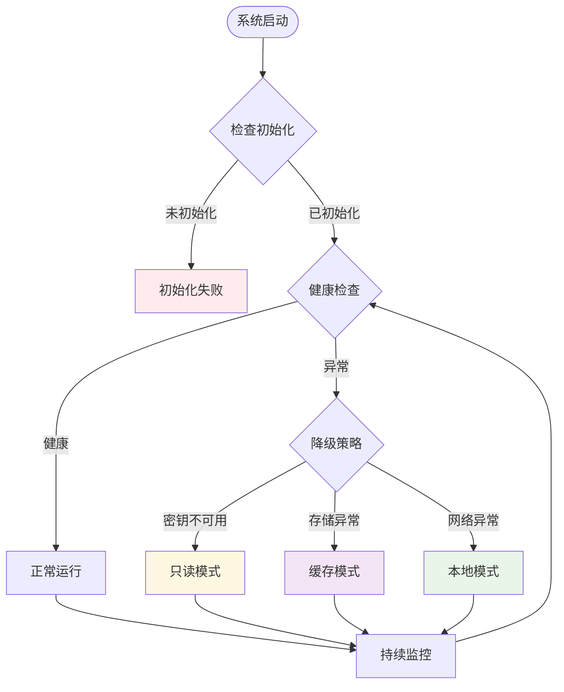

### 安全审计功能

系统提供了完整的审计跟踪：

```go
// KMS状态信息
type KMSStatus struct {
    Initialized      bool              `json:"initialized"`
    Shutdown         bool              `json:"shutdown"`
    Algorithm        string            `json:"algorithm,omitempty"`
    RotateInterval   time.Duration     `json:"rotate_interval,omitempty"`
    ActiveKeyVersion string            `json:"active_key_version,omitempty"`
    ActiveKeyExpiry  time.Time         `json:"active_key_expiry,omitempty"`
    KeyStatistics    *biz.KeyStatistics  `json:"key_statistics,omitempty"`
}
```

### 日志记录与监控

```go
// 关键操作日志记录
func (m *kmsManager) logOperation(operation string, details map[string]interface{}) {
    m.log.With(
        "operation", operation,
        "timestamp", time.Now(),
        "details", details,
    ).Info("KMS operation performed")
}

// 性能监控指标
func (s *cryptoService) recordMetrics(operation string, duration time.Duration) {
    metrics.Record(
        "kms.operation_duration",
        float64(duration.Milliseconds()),
        "operation", operation,
    )
}
```

**章节来源**
- [crypto_service.go](file://internal/pkg/kms/crypto_service.go#L280-L321)
- [manager.go](file://internal/pkg/kms/manager.go#L280-L308)

## 总结

本文档详细描述了基于KMS的字段级加密架构设计，该方案具有以下核心优势：

### 技术优势

1. **安全性**：采用分层密钥体系，确保密钥安全隔离
2. **性能**：智能缓存机制，支持批量操作，提供高吞吐量
3. **可扩展性**：模块化设计，易于扩展和维护
4. **合规性**：符合行业标准，支持多种加密算法

### 架构特点

1. **分层设计**：清晰的职责分离，降低耦合度
2. **自动化运维**：自动密钥轮换和清理机制
3. **容错能力**：完善的错误处理和降级策略
4. **可观测性**：完整的监控和审计功能

### 应用场景

该架构适用于需要高安全性的企业级应用，特别是涉及个人隐私、金融数据等敏感信息的系统。通过合理的配置和部署，可以满足各种规模的应用需求。

### 最佳实践建议

1. **定期审查**：定期检查密钥使用情况和系统状态
2. **监控告警**：建立完善的监控和告警机制
3. **备份恢复**：制定密钥备份和灾难恢复计划
4. **权限控制**：严格控制密钥访问权限

通过本文档的详细分析，开发者可以深入理解该字段级加密方案的设计理念和实现细节，为实际项目开发提供有价值的参考。