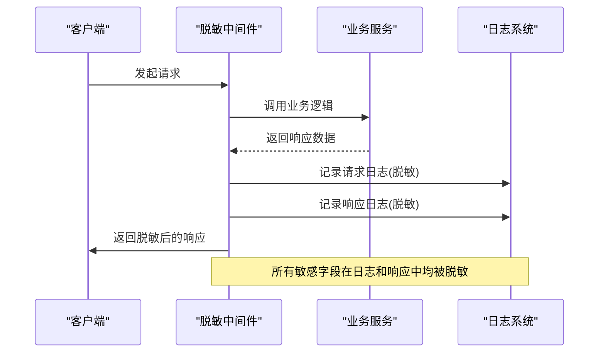
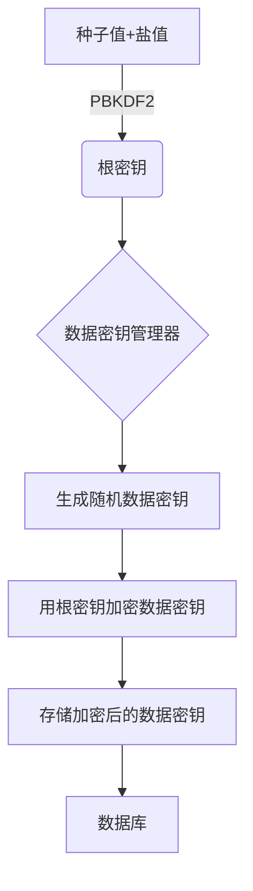
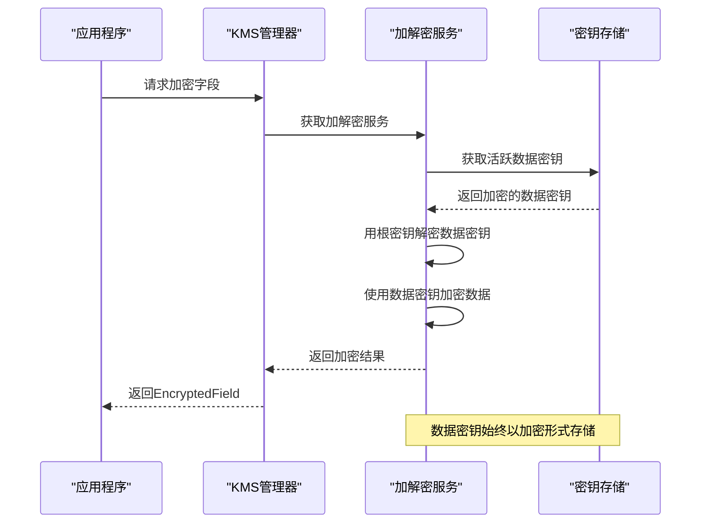

# 数据保护

<cite>
**本文档引用的文件**
- [anonymizer.go](file://internal/pkg/sensitive/anonymizer.go)
- [crypto_service.go](file://internal/pkg/kms/crypto_service.go)
- [datakey.go](file://internal/pkg/kms/datakey.go)
- [interfaces.go](file://internal/pkg/kms/interfaces.go)
- [manager.go](file://internal/pkg/kms/manager.go)
- [rootkey.go](file://internal/pkg/kms/rootkey.go)
- [rules.go](file://internal/pkg/sensitive/rules.go)
- [middleware.go](file://internal/pkg/sensitive/middleware.go)
- [kms.go](file://internal/biz/kms.go)
- [auth.go](file://internal/biz/auth.go)
- [000001_create_users_table.up.sql](file://internal/data/migrations/000001_create_users_table.up.sql)
- [000002_create_data_keys_table.up.sql](file://internal/data/migrations/000002_create_data_keys_table.up.sql)
</cite>

## 目录
1. [引言](#引言)
2. [敏感数据识别与脱敏机制](#敏感数据识别与脱敏机制)
3. [KMS集成下的字段级加密方案](#kms集成下的字段级加密方案)
4. [数据库迁移脚本设计考量](#数据库迁移脚本设计考量)
5. [结构化数据加解密完整链路示例](#结构化数据加解密完整链路示例)
6. [密钥轮换策略](#密钥轮换策略)
7. [性能影响分析](#性能影响分析)
8. [异常处理机制](#异常处理机制)

## 引言
本项目通过`sensitive`包和`kms`包实现了完整的敏感数据全生命周期保护机制。系统采用规则引擎自动识别PII（个人身份信息）字段，并在日志和响应中进行脱敏处理；同时通过KMS（密钥管理系统）实现字段级加密，确保敏感数据在存储过程中的安全性。整个系统设计遵循最小权限原则和纵深防御策略，为敏感数据提供了多层次的安全保障。

## 敏感数据识别与脱敏机制

### 规则引擎驱动的自动识别
`sensitive`包通过预定义的规则引擎自动识别各类PII字段。系统内置了针对邮箱、手机号、姓名、身份证号、银行卡号和地址等常见敏感信息的识别规则，这些规则基于正则表达式和格式验证算法实现。

```mermaid
classDiagram
class SensitiveDetector {
+DetectAll(text string) map[string][]string
+DetectEmail(text string) []string
+DetectPhone(text string) []string
+DetectIDCard(text string) []string
+DetectBankCard(text string) []string
}
class Anonymizer {
+AnonymizeString(value string, rule AnonymizeRule) string
+AnonymizeObject(obj MakeSensitive) interface{}
+AnonymizeBatch(objects []MakeSensitive) []interface{}
+AnonymizeValue(value interface{}, rules map[string]AnonymizeRule) interface{}
}
class LogSanitizer {
+SanitizeLogMessage(message string) string
+SanitizeHeaders(headers map[string]interface{}) map[string]interface{}
}
SensitiveDetector --> Anonymizer : "使用"
LogSanitizer --> Anonymizer : "使用"
```

**图源**
- [sensitive](file://internal/pkg/sensitive/detector_test.go#L1-L20)
- [anonymizer.go](file://internal/pkg/sensitive/anonymizer.go#L1-L50)

### 日志与响应脱敏处理
系统通过中间件机制在日志记录和API响应输出时自动执行脱敏操作。对于实现了`MakeSensitive`接口的对象，会调用其`Anonymize()`方法进行对象级脱敏；对于普通字符串，则根据字段名匹配相应的脱敏规则。



**图源**
- [middleware.go](file://internal/pkg/sensitive/middleware.go#L1-L100)
- [structured_logger.go](file://internal/pkg/sensitive/structured_logger.go#L1-L30)

**章节来源**
- [middleware.go](file://internal/pkg/sensitive/middleware.go#L1-L200)
- [anonymizer.go](file://internal/pkg/sensitive/anonymizer.go#L1-L100)

## KMS集成下的字段级加密方案

### 数据密钥生成与管理
KMS系统采用分层密钥架构，其中根密钥用于加密数据密钥，数据密钥用于加密实际的敏感数据。根密钥通过PBKDF2算法从种子值和盐值派生，而数据密钥则是随机生成的AES密钥。



**图源**
- [rootkey.go](file://internal/pkg/kms/rootkey.go#L1-L50)
- [datakey.go](file://internal/pkg/kms/datakey.go#L1-L50)

### 密钥存储与使用流程
数据密钥在生成后会被加密存储在数据库中，只有活跃的数据密钥才会被加载到内存中使用。系统通过版本号来标识不同的数据密钥，确保加解密操作的一致性。



**图源**
- [manager.go](file://internal/pkg/kms/manager.go#L1-L50)
- [crypto_service.go](file://internal/pkg/kms/crypto_service.go#L1-L50)

**章节来源**
- [interfaces.go](file://internal/pkg/kms/interfaces.go#L1-L100)
- [kms.go](file://internal/biz/kms.go#L1-L50)

## 数据库迁移脚本设计考量

### 加密字段存储设计
数据库表设计充分考虑了加密数据的存储需求，对每个需要加密的字段都设置了对应的加密列和哈希列。这种设计既保证了数据的安全性，又支持了基于明文的检索功能。

```sql
CREATE TABLE IF NOT EXISTS users (
    id SERIAL PRIMARY KEY,
    username VARCHAR(255) NOT NULL UNIQUE,
    password VARCHAR(255) NOT NULL,
    email_encrypted VARCHAR(255),     -- 加密后的邮箱
    email_hash VARCHAR(64),           -- 邮箱哈希值用于检索
    phone_encrypted VARCHAR(255),     -- 加密后的手机号
    phone_hash VARCHAR(64),           -- 手机号哈希值用于检索
    name_encrypted VARCHAR(255),      -- 加密后的姓名
    name_hash VARCHAR(64),            -- 姓名哈希值用于检索
    created_at TIMESTAMP NOT NULL DEFAULT CURRENT_TIMESTAMP,
    updated_at TIMESTAMP NOT NULL DEFAULT CURRENT_TIMESTAMP
);
```

**章节来源**
- [000001_create_users_table.up