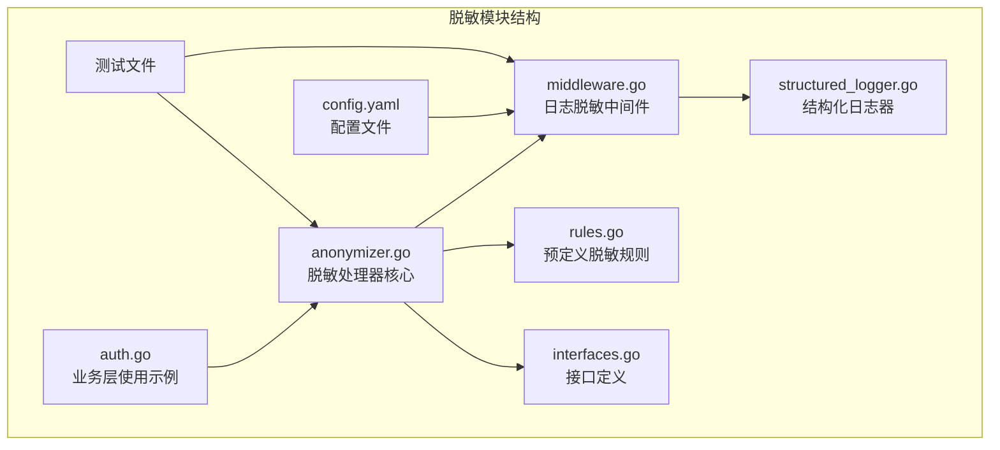
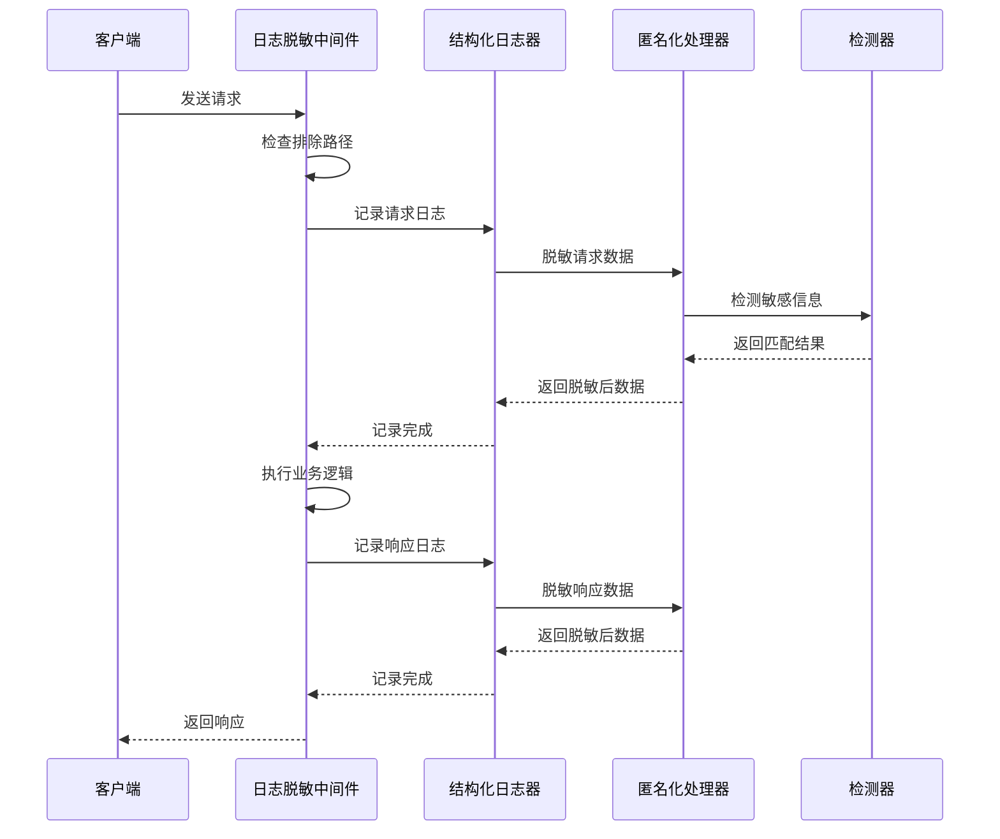
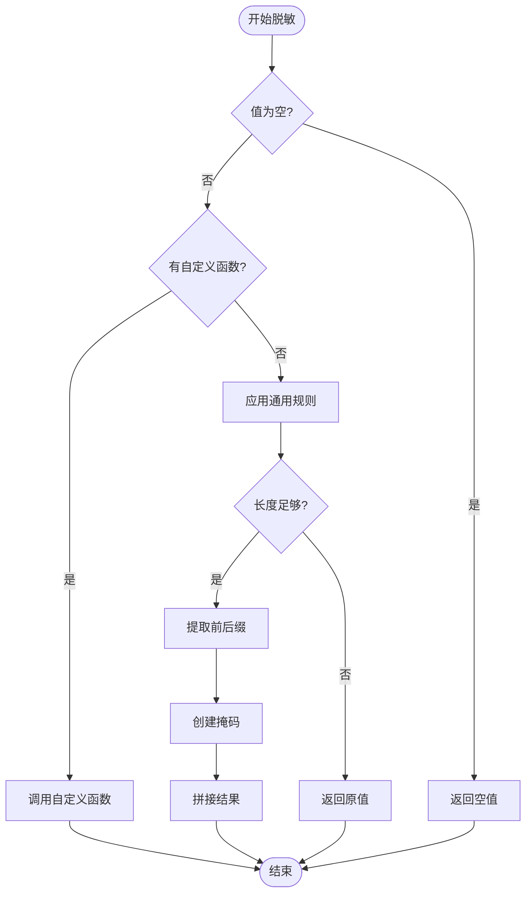
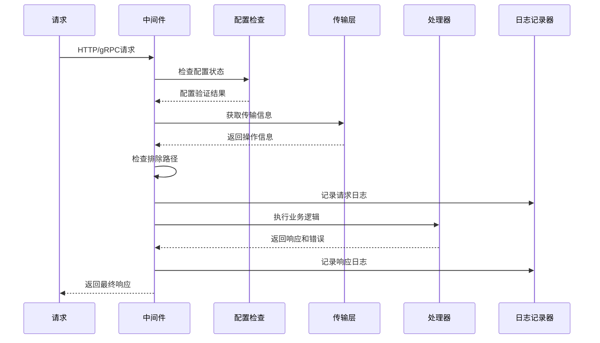
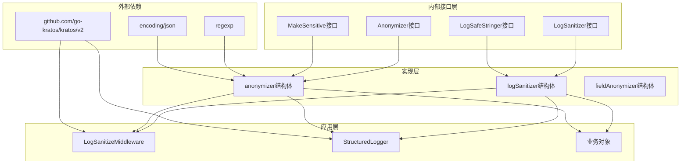

# 数据脱敏机制

<cite>
**本文档中引用的文件**
- [anonymizer.go](file://internal/pkg/sensitive/anonymizer.go)
- [middleware.go](file://internal/pkg/sensitive/middleware.go)
- [rules.go](file://internal/pkg/sensitive/rules.go)
- [interfaces.go](file://internal/pkg/sensitive/interfaces.go)
- [structured_logger.go](file://internal/pkg/sensitive/structured_logger.go)
- [auth.go](file://internal/biz/auth.go)
- [middleware_test.go](file://internal/pkg/sensitive/middleware_test.go)
- [anonymizer_test.go](file://internal/pkg/sensitive/anonymizer_test.go)
- [config.yaml](file://configs/config.yaml)
</cite>

## 目录
1. [简介](#简介)
2. [项目结构](#项目结构)
3. [核心组件](#核心组件)
4. [架构概览](#架构概览)
5. [详细组件分析](#详细组件分析)
6. [依赖关系分析](#依赖关系分析)
7. [性能考虑](#性能考虑)
8. [故障排除指南](#故障排除指南)
9. [结论](#结论)

## 简介

本项目实现了一套完整的企业级数据脱敏机制，专门针对敏感个人信息（PII）进行保护。该系统通过预定义的脱敏规则（如正则表达式匹配）识别包括手机号、身份证号、邮箱等在内的敏感字段，并采用掩码替换策略进行匿名化处理。

系统的核心特性包括：
- **多层次脱敏**：支持字符串、对象、批量数据等多种脱敏形式
- **智能检测**：基于正则表达式的敏感信息自动识别
- **结构化日志**：在请求响应生命周期中自动脱敏日志输出
- **灵活配置**：支持自定义脱敏规则和扩展机制
- **高性能**：优化的算法确保最小化性能开销

## 项目结构

数据脱敏模块位于 `internal/pkg/sensitive/` 目录下，包含以下核心文件：



**图表来源**
- [anonymizer.go](file://internal/pkg/sensitive/anonymizer.go#L1-L50)
- [middleware.go](file://internal/pkg/sensitive/middleware.go#L1-L50)
- [rules.go](file://internal/pkg/sensitive/rules.go#L1-L50)

## 核心组件

### 1. 匿名化处理器（Anonymizer）

匿名化处理器是整个脱敏系统的核心组件，负责执行具体的脱敏操作。

```go
type anonymizer struct {
    defaultRules map[string]AnonymizeRule
    detector     SensitiveDetector
}
```

主要功能：
- **字符串脱敏**：使用预定义规则对敏感字符串进行掩码处理
- **对象脱敏**：通过反射机制处理复杂的数据结构
- **批量处理**：支持同时脱敏多个对象
- **自定义规则**：允许使用自定义脱敏函数

### 2. 敏感信息检测器（SensitiveDetector）

负责识别文本中的敏感信息，支持多种类型的信息检测。

```go
type sensitiveDetector struct {
    emailRegex    *regexp.Regexp
    phoneRegex    *regexp.Regexp
    idCardRegex   *regexp.Regexp
    bankCardRegex *regexp.Regexp
}
```

支持的检测类型：
- 邮箱地址
- 手机号码（中国标准）
- 身份证号码
- 银行卡号

### 3. 日志脱敏中间件（LogSanitizeMiddleware）

在HTTP/gRPC请求响应生命周期中自动脱敏日志输出。

```go
type LogSanitizeMiddleware struct {
    config    *LogSanitizeConfig
    sanitizer LogSanitizer
    logger    log.Logger
}
```

**章节来源**
- [anonymizer.go](file://internal/pkg/sensitive/anonymizer.go#L10-L30)
- [middleware.go](file://internal/pkg/sensitive/middleware.go#L40-L60)

## 架构概览

系统采用分层架构设计，确保脱敏逻辑的可维护性和扩展性：



**图表来源**
- [middleware.go](file://internal/pkg/sensitive/middleware.go#L70-L120)
- [structured_logger.go](file://internal/pkg/sensitive/structured_logger.go#L100-L150)

## 详细组件分析

### 匿名化处理器详细分析

#### 核心脱敏算法

匿名化处理器使用以下算法进行字符串脱敏：



**图表来源**
- [anonymizer.go](file://internal/pkg/sensitive/anonymizer.go#L25-L40)
- [rules.go](file://internal/pkg/sensitive/rules.go#L180-L200)

#### 预定义脱敏规则

系统提供了六种预定义的脱敏规则：

1. **邮箱脱敏规则**：保留用户名前两位和域名部分
   ```go
   EmailRule = AnonymizeRule{
       FieldName: "email",
       KeepStart: 2,
       KeepEnd:   4,
       MaskChar:  "*",
   }
   ```

2. **手机号脱敏规则**：保留前三位和后四位
   ```go
   PhoneRule = AnonymizeRule{
       FieldName: "phone",
       KeepStart: 3,
       KeepEnd:   4,
       MaskChar:  "*",
   }
   ```

3. **姓名脱敏规则**：保留首尾字符
   ```go
   NameRule = AnonymizeRule{
       FieldName: "name",
       KeepStart: 1,
       KeepEnd:   1,
       MaskChar:  "*",
   }
   ```

4. **身份证号脱敏规则**：保留前六位和后四位
   ```go
   IDCardRule = AnonymizeRule{
       FieldName: "id_card",
       KeepStart: 6,
       KeepEnd:   4,
       MaskChar:  "*",
   }
   ```

5. **银行卡号脱敏规则**：保留前四位和后四位
   ```go
   BankCardRule = AnonymizeRule{
       FieldName: "bank_card",
       KeepStart: 4,
       KeepEnd:   4,
       MaskChar:  "*",
   }
   ```

6. **地址脱敏规则**：保留前六位字符
   ```go
   AddressRule = AnonymizeRule{
       FieldName: "address",
       KeepStart: 6,
       KeepEnd:   0,
       MaskChar:  "*",
   }
   ```

**章节来源**
- [rules.go](file://internal/pkg/sensitive/rules.go#L10-L120)

### 日志脱敏中间件详细分析

#### 中间件工作流程



**图表来源**
- [middleware.go](file://internal/pkg/sensitive/middleware.go#L70-L120)

#### 结构化日志器分析

结构化日志器提供了更高级的脱敏功能：

```mermaid
classDiagram
class StructuredLogger {
+helper *log.Helper
+logger log.Logger
+anonymizer Anonymizer
+rules map[string]AnonymizeRule
+config *StructuredLogConfig
+Infow(msg string, keysAndValues ...interface{})
+Debugw(msg string, keysAndValues ...interface{})
+Errorw(msg string, keysAndValues ...interface{})
+sanitizeKeyValues(keysAndValues ...interface{}) []interface{}
+isSensitiveKey(key string) bool
+sanitizeValue(key string, value interface{}) interface{}
+autoDetectAndSanitize(value interface{}) interface{}
}
class StructuredLogConfig {
+Enabled bool
+AutoDetect bool
+CustomRules map[string]AnonymizeRule
+SensitiveKeys []string
+MaxValueLength int
+TruncateThreshold int
}
class Anonymizer {
+AnonymizeString(value string, rule AnonymizeRule) string
+AnonymizeObject(obj MakeSensitive) interface{}
+AnonymizeValue(value interface{}, rules map[string]AnonymizeRule) interface{}
}
StructuredLogger --> StructuredLogConfig : "使用"
StructuredLogger --> Anonymizer : "依赖"
```

**图表来源**
- [structured_logger.go](file://internal/pkg/sensitive/structured_logger.go#L15-L50)
- [interfaces.go](file://internal/pkg/sensitive/interfaces.go#L15-L40)

**章节来源**
- [middleware.go](file://internal/pkg/sensitive/middleware.go#L40-L100)
- [structured_logger.go](file://internal/pkg/sensitive/structured_logger.go#L20-L80)

### 规则扩展机制

系统提供了灵活的规则扩展机制：

#### 自定义规则创建

```go
func CreateCustomRule(fieldName string, keepStart, keepEnd int, maskChar string, customFunc func(string) string) AnonymizeRule {
    return AnonymizeRule{
        FieldName:  fieldName,
        KeepStart:  keepStart,
        KeepEnd:    keepEnd,
        MaskChar:   maskChar,
        CustomFunc: customFunc,
    }
}
```

#### 规则合并

```go
func MergeRules(rules ...map[string]AnonymizeRule) map[string]AnonymizeRule {
    merged := make(map[string]AnonymizeRule)
    
    for _, ruleMap := range rules {
        for key, rule := range ruleMap {
            merged[key] = rule
        }
    }
    
    return merged
}
```

**章节来源**
- [rules.go](file://internal/pkg/sensitive/rules.go#L200-L224)

## 依赖关系分析

系统的依赖关系呈现清晰的层次结构：



**图表来源**
- [anonymizer.go](file://internal/pkg/sensitive/anonymizer.go#L1-L10)
- [middleware.go](file://internal/pkg/sensitive/middleware.go#L1-L15)

**章节来源**
- [interfaces.go](file://internal/pkg/sensitive/interfaces.go#L1-L50)

## 性能考虑

### 算法复杂度分析

1. **字符串脱敏**：O(n)，其中n为字符串长度
2. **正则表达式匹配**：平均O(m)，其中m为模式长度
3. **反射处理**：O(d)，其中d为数据结构深度
4. **批量处理**：O(n×k)，其中n为元素数量，k为平均复杂度

### 性能优化策略

1. **缓存机制**：预编译正则表达式，避免重复编译
2. **短路求值**：优先检查空值和简单条件
3. **批量处理**：减少函数调用开销
4. **内存池**：重用临时对象，减少GC压力

### 异常边界处理

系统实现了完善的异常处理机制：

```go
// 边界情况处理示例
func (a *anonymizer) AnonymizeString(value string, rule AnonymizeRule) string {
    if value == "" {
        return value  // 空字符串直接返回
    }
    
    if rule.CustomFunc != nil {
        return rule.CustomFunc(value)  // 自定义函数优先
    }
    
    // 通用规则处理
    return anonymizeWithRule(value, rule)
}
```

## 故障排除指南

### 常见问题及解决方案

#### 1. 脱敏规则不生效

**症状**：敏感信息未被正确脱敏
**原因**：规则配置错误或字段名不匹配
**解决方案**：
- 检查字段名是否正确（区分大小写）
- 验证自定义规则是否正确设置
- 确认规则优先级顺序

#### 2. 性能问题

**症状**：日志记录变慢
**原因**：大量敏感信息导致频繁脱敏
**解决方案**：
- 调整 `MaxLogLength` 参数
- 优化正则表达式模式
- 使用批量处理减少调用次数

#### 3. JSON序列化错误

**症状**：日志记录失败
**原因**：数据结构无法序列化
**解决方案**：
- 实现 `json.Marshaler` 接口
- 使用 `LogSafeStringer` 接口
- 提供自定义序列化方法

**章节来源**
- [middleware_test.go](file://internal/pkg/sensitive/middleware_test.go#L559-L606)
- [anonymizer_test.go](file://internal/pkg/sensitive/anonymizer_test.go#L1-L50)

## 结论

本数据脱敏机制提供了一个完整、高效且易于扩展的解决方案，能够有效保护敏感个人信息。系统的主要优势包括：

1. **全面覆盖**：支持多种数据类型和脱敏场景
2. **高性能**：优化的算法确保最小化性能影响
3. **易扩展**：灵活的规则系统支持自定义需求
4. **企业级**：完善的错误处理和监控机制

通过合理配置和使用，该系统能够在保证数据安全的同时，维持良好的系统性能和用户体验。