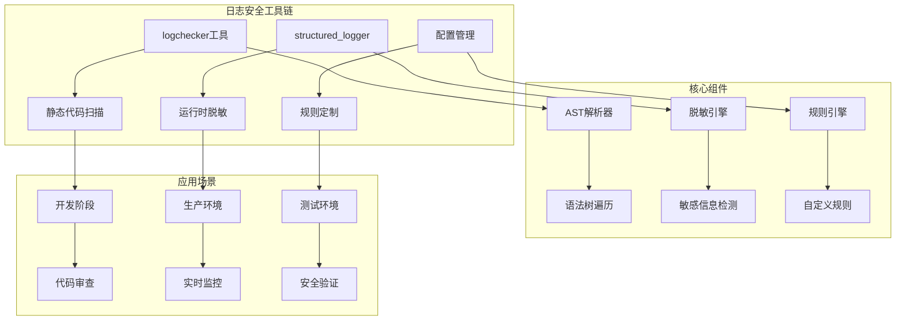
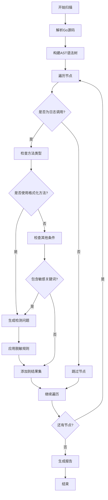
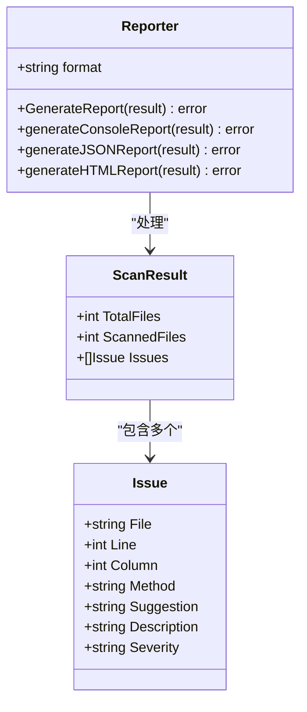
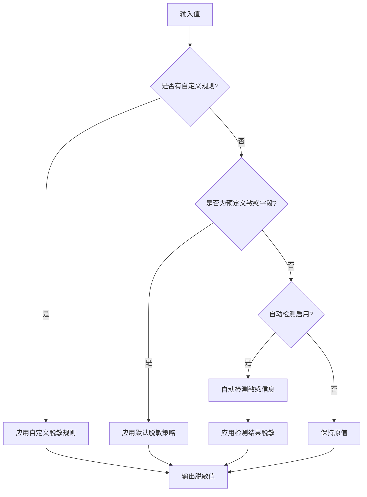
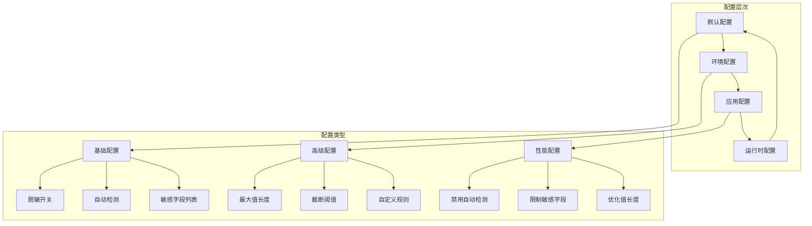
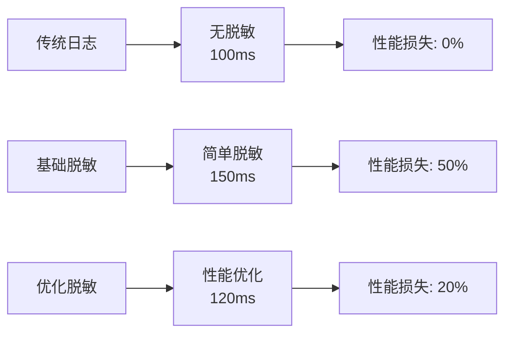

# 日志安全管控体系

<cite>
**本文档引用的文件**
- [tools/logchecker/main.go](file://tools/logchecker/main.go)
- [tools/logchecker/checker.go](file://tools/logchecker/checker.go)
- [tools/logchecker/config.go](file://tools/logchecker/config.go)
- [tools/logchecker/logchecker.json](file://tools/logchecker/logchecker.json)
- [tools/logchecker/reporter.go](file://tools/logchecker/reporter.go)
- [tools/logchecker/visitor.go](file://tools/logchecker/visitor.go)
- [internal/pkg/sensitive/structured_logger.go](file://internal/pkg/sensitive/structured_logger.go)
- [internal/pkg/sensitive/anonymizer.go](file://internal/pkg/sensitive/anonymizer.go)
- [internal/pkg/sensitive/factory.go](file://internal/pkg/sensitive/factory.go)
- [internal/pkg/sensitive/examples_test.go](file://internal/pkg/sensitive/examples_test.go)
- [internal/pkg/sensitive/structured_logger_test.go](file://internal/pkg/sensitive/structured_logger_test.go)
- [Makefile](file://Makefile)
</cite>

## 目录
1. [简介](#简介)
2. [项目结构概览](#项目结构概览)
3. [logchecker工具详解](#logchecker工具详解)
4. [structured_logger运行时脱敏](#structured_logger运行时脱敏)
5. [配置管理与自定义规则](#配置管理与自定义规则)
6. [实际应用案例](#实际应用案例)
7. [性能优化与最佳实践](#性能优化与最佳实践)
8. [故障排除指南](#故障排除指南)
9. [总结](#总结)

## 简介

日志安全管控体系是现代软件开发中不可或缺的安全基础设施，旨在防止敏感信息在日志输出中泄露，同时确保日志的可读性和分析价值。本体系包含两个核心组件：静态扫描工具logchecker和运行时脱敏组件structured_logger。

通过实施这套完整的日志安全管控体系，开发团队可以：
- 自动检测和阻止敏感信息泄露
- 实现结构化日志记录
- 提供灵活的脱敏规则配置
- 支持多环境部署需求
- 确保符合安全合规要求

## 项目结构概览



**图表来源**
- [tools/logchecker/main.go](file://tools/logchecker/main.go#L1-L45)
- [internal/pkg/sensitive/structured_logger.go](file://internal/pkg/sensitive/structured_logger.go#L1-L50)

## logchecker工具详解

### 工作原理

logchecker是一个基于Go AST（抽象语法树）的静态代码分析工具，专门用于检测项目中不符合结构化日志规范的代码。其核心工作流程如下：



**图表来源**
- [tools/logchecker/checker.go](file://tools/logchecker/checker.go#L65-L124)
- [tools/logchecker/visitor.go](file://tools/logchecker/visitor.go#L1-L50)

### 主要功能特性

#### 1. AST静态分析
logchecker利用Go语言的内置AST解析能力，能够精确识别代码中的日志调用模式：

```go
// 检测的格式化日志方法
"Infof" → "Infow"
"Debugf" → "Debugw"  
"Errorf" → "Errorw"
"Warnf" → "Warnw"
```

#### 2. 敏感信息检测
工具内置了全面的敏感信息关键词库，包括但不限于：
- 身份认证信息：password, token, secret, key, auth
- 个人隐私信息：email, phone, mobile, card, id
- 用户凭证：user, account, login, credential
- 会话信息：session, cookie, jwt, oauth

#### 3. 智能阈值判断
当检测到日志消息长度超过配置阈值（默认50字符）时，会触发更严格的检查机制。

**章节来源**
- [tools/logchecker/checker.go](file://tools/logchecker/checker.go#L1-L124)
- [tools/logchecker/config.go](file://tools/logchecker/config.go#L44-L88)

### 配置文件详解

logchecker提供了灵活的配置机制，允许开发者根据项目需求定制检测规则：

```json
{
  "skip_test_files": true,
  "ignore_files": ["*.pb.go", "*.gen.go", "vendor/*", ".git/*"],
  "ignore_dirs": ["vendor", ".git", "node_modules", "third_party"],
  "whitelist_methods": ["Printf"],
  "sensitive_keywords": [
    "password", "token", "secret", "key", "auth",
    "email", "phone", "mobile", "card", "id",
    "user", "account", "login", "credential",
    "session", "cookie", "jwt", "oauth"
  ],
  "min_message_length": 50
}
```

### 报告生成系统

logchecker支持多种输出格式，满足不同场景的需求：



**图表来源**
- [tools/logchecker/reporter.go](file://tools/logchecker/reporter.go#L1-L59)
- [tools/logchecker/checker.go](file://tools/logchecker/checker.go#L15-L30)

**章节来源**
- [tools/logchecker/logchecker.json](file://tools/logchecker/logchecker.json#L1-L57)
- [tools/logchecker/reporter.go](file://tools/logchecker/reporter.go#L61-L109)

## structured_logger运行时脱敏

### 核心架构设计

structured_logger是运行时日志脱敏的核心组件，采用装饰器模式设计，能够在不改变现有代码逻辑的前提下，自动拦截和过滤敏感字段：

```mermaid
classDiagram
class StructuredLogger {
-Helper helper
-Logger logger
-Anonymizer anonymizer
-map rules
-StructuredLogConfig config
+Infow(msg, keysAndValues) void
+Debugw(msg, keysAndValues) void
+Errorw(msg, keysAndValues) void
+Warnw(msg, keysAndValues) void
+sanitizeKeyValues(keysAndValues) []interface{}
+isSensitiveKey(key) bool
+sanitizeValue(key, value) interface{}
}
class Anonymizer {
+AnonymizeString(value, rule) string
+AnonymizeObject(obj) interface{}
+AnonymizeBatch(objects) []interface{}
+AnonymizeValue(value, rules) interface{}
}
class StructuredLogConfig {
+bool Enabled
+bool AutoDetect
+map CustomRules
+[]string SensitiveKeys
+int MaxValueLength
+int TruncateThreshold
}
class SensitiveDetector {
+DetectAll(text) map[string][]string
+DetectEmail(text) []string
+DetectPhone(text) []string
+DetectIDCard(text) []string
+DetectBankCard(text) []string
}
StructuredLogger --> Anonymizer : "使用"
StructuredLogger --> StructuredLogConfig : "配置"
StructuredLogger --> SensitiveDetector : "依赖"
```

**图表来源**
- [internal/pkg/sensitive/structured_logger.go](file://internal/pkg/sensitive/structured_logger.go#L10-L50)
- [internal/pkg/sensitive/anonymizer.go](file://internal/pkg/sensitive/anonymizer.go#L10-L30)

### 脱敏算法实现

#### 1. 敏感字段识别
structured_logger通过两种方式识别敏感字段：

```go
// 预定义敏感关键字匹配
func (s *StructuredLogger) isSensitiveKey(key string) bool {
    key = strings.ToLower(key)
    
    // 检查预定义的敏感字段
    for _, sensitiveKey := range s.config.SensitiveKeys {
        if strings.Contains(key, strings.ToLower(sensitiveKey)) {
            return true
        }
    }
    
    // 检查是否有对应的脱敏规则
    _, exists := s.rules[key]
    return exists
}
```

#### 2. 自动敏感信息检测
对于非明确标记的敏感字段，structured_logger会使用内置的敏感信息检测器：

```go
// 自动检测并脱敏
func (s *StructuredLogger) autoDetectAndSanitize(value interface{}) interface{} {
    if value == nil {
        return value
    }
    
    strValue := fmt.Sprintf("%v", value)
    
    // 使用敏感信息检测器
    detector := NewSensitiveDetector()
    detected := detector.DetectAll(strValue)
    
    result := strValue
    for fieldType, matches := range detected {
        if rule, exists := s.rules[fieldType]; exists {
            for _, match := range matches {
                anonymized := s.anonymizer.AnonymizeString(match, rule)
                result = strings.ReplaceAll(result, match, anonymized)
            }
        }
    }
    
    return result
}
```

#### 3. 脱敏策略选择
structured_logger支持多种脱敏策略：



**图表来源**
- [internal/pkg/sensitive/structured_logger.go](file://internal/pkg/sensitive/structured_logger.go#L280-L320)

### 上下文与字段管理

structured_logger提供了强大的上下文管理和字段附加功能：

```go
// 添加上下文信息
func (s *StructuredLogger) WithContext(ctx context.Context) StructuredLoggerInterface {
    return &StructuredLogger{
        helper:     s.helper.WithContext(ctx),
        logger:     s.logger,
        anonymizer: s.anonymizer,
        rules:      s.rules,
        config:     s.config,
    }
}

// 添加通用字段
func (s *StructuredLogger) WithFields(keysAndValues ...interface{}) StructuredLoggerInterface {
    sanitized := s.sanitizeKeyValues(keysAndValues...)
    
    if s.logger != nil {
        newLogger := log.With(s.logger, sanitized...)
        newHelper := log.NewHelper(newLogger)
        return &StructuredLogger{
            helper:     newHelper,
            logger:     newLogger,
            anonymizer: s.anonymizer,
            rules:      s.rules,
            config:     s.config,
        }
    }
    
    return s
}
```

**章节来源**
- [internal/pkg/sensitive/structured_logger.go](file://internal/pkg/sensitive/structured_logger.go#L150-L200)
- [internal/pkg/sensitive/structured_logger.go](file://internal/pkg/sensitive/structured_logger.go#L280-L350)

## 配置管理与自定义规则

### 配置层次结构

structured_logger采用了分层配置管理机制，支持全局配置、环境特定配置和动态配置更新：



### 自定义脱敏规则

开发者可以通过多种方式定义自定义脱敏规则：

#### 1. 基础脱敏规则
```go
type AnonymizeRule struct {
    FieldName  string // 字段名称
    KeepStart  int    // 保留开头字符数
    KeepEnd    int    // 保留结尾字符数
    MaskChar   string // 掩码字符
    CustomFunc func(string) string // 自定义脱敏函数
}
```

#### 2. 场景化规则示例

```go
// 用户ID规则：保留前后各2位，中间用#填充
userIDRule := AnonymizeRule{
    FieldName: "user_id",
    KeepStart: 2,
    KeepEnd:   2,
    MaskChar:  "#",
}

// 订单ID规则：只保留后4位
orderIDRule := AnonymizeRule{
    FieldName: "order_id",
    CustomFunc: func(value string) string {
        return "ORDER_" + value[len(value)-4:]
    },
}

// 敏感文本规则：简单掩码
textRule := AnonymizeRule{
    FieldName: "sensitive_text",
    KeepStart: 1,
    KeepEnd:   1,
    MaskChar:  "*",
}
```

#### 3. 动态规则更新
```go
// 运行时更新规则
func (s *StructuredLogger) UpdateRules(rules map[string]AnonymizeRule) {
    if s.rules == nil {
        s.rules = make(map[string]AnonymizeRule)
    }
    
    for key, rule := range rules {
        s.rules[key] = rule
    }
}
```

### 环境适配配置

structured_logger提供了针对不同环境的预设配置：

```go
// 生产环境配置
func CreateProductionLogger(logger log.Logger) StructuredLoggerInterface {
    config := &StructuredLogConfig{
        Enabled:           true,
        AutoDetect:        true,
        CustomRules:       GetDefaultRules(),
        SensitiveKeys:     []string{"password", "token", "secret", "key", "auth", "credential", "authorization", "session", "cookie"},
        MaxValueLength:    500,
        TruncateThreshold: 300,
    }
    return NewStructuredLoggerFromLogger(logger, config)
}

// 开发环境配置
func CreateDevelopmentLogger(logger log.Logger) StructuredLoggerInterface {
    config := &StructuredLogConfig{
        Enabled:           false, // 开发环境可以禁用脱敏
        AutoDetect:        false,
        CustomRules:       GetDefaultRules(),
        SensitiveKeys:     []string{},
        MaxValueLength:    2000,
        TruncateThreshold: 1000,
    }
    return NewStructuredLoggerFromLogger(logger, config)
}
```

**章节来源**
- [internal/pkg/sensitive/factory.go](file://internal/pkg/sensitive/factory.go#L88-L143)
- [internal/pkg/sensitive/structured_logger.go](file://internal/pkg/sensitive/structured_logger.go#L350-L387)

## 实际应用案例

### 案例1：用户认证系统的日志安全

#### 问题发现阶段
使用logchecker工具扫描认证模块：

```bash
# 运行日志检查
make logcheck

# 生成详细报告
make logcheck-json
```

#### 检测到的问题
```go
// 原始代码（存在问题）
uc.log.Warnf("移除账户锁定失败: %v", err)
uc.log.Warnf("使所有刷新令牌无效失败: %v", err)
uc.log.Warnf("令牌被重用，使所有令牌无效失败: %v", err)
```

#### 修复过程
1. **静态扫描发现问题**：logchecker检测到格式化日志方法的使用
2. **转换为结构化日志**：将格式化方法替换为结构化方法
3. **添加敏感信息脱敏**：自动检测并脱敏敏感字段

```go
// 修复后的代码
uc.log.Warnw("移除账户锁定失败",
    "error", err.Error(),
    "operation", "remove_lock",
    "username", username,
)

uc.log.Warnw("使所有刷新令牌无效失败",
    "error", err.Error(),
    "operation", "invalidate_refresh_tokens",
    "username", username,
)
```

#### 运行时效果
```json
{
    "level": "WARN",
    "msg": "使所有刷新令牌无效失败",
    "error": "database connection failed",
    "operation": "invalidate_refresh_tokens",
    "username": "j***n_doe", // 脱敏用户名
    "ts": "2024-01-15T10:30:00Z",
    "caller": "auth.go:410"
}
```

### 案例2：KMS密钥管理的敏感信息保护

#### 场景描述
密钥管理系统需要严格保护密钥材料，任何日志输出都必须经过脱敏处理。

#### 实施步骤
1. **初始化结构化日志器**：
```go
// 创建带敏感字段配置的结构化日志器
sensitiveKeys := []string{"password", "token", "secret", "key", "credential"}
slogger := NewStructuredLoggerWithSanitization(logger, sensitiveKeys)
```

2. **记录密钥操作日志**：
```go
// 记录密钥创建操作
slogger.Infow("数据密钥创建成功",
    "operation", "create_data_key",
    "key_id", "dk-1234567890abcdef",
    "algorithm", "AES-256-GCM",
    "created_by", "admin_user",
    "timestamp", time.Now().UTC().Format(time.RFC3339),
)
```

3. **运行时脱敏效果**：
```json
{
    "level": "INFO",
    "msg": "数据密钥创建成功",
    "operation": "create_data_key",
    "key_id": "dk-12******abcdef", // 部分脱敏
    "algorithm": "AES-256-GCM",
    "created_by": "a***in_user", // 脱敏用户名
    "timestamp": "2024-01-15T10:30:00Z"
}
```

### 案例3：批量数据处理的性能优化

#### 优化策略
针对高频日志记录场景，采用性能优化配置：

```go
// 性能优化配置
config := &StructuredLogConfig{
    Enabled:           true,
    AutoDetect:        false, // 禁用自动检测以提高性能
    CustomRules:       GetDefaultRules(),
    SensitiveKeys:     []string{"password", "token"}, // 只检测关键敏感字段
    MaxValueLength:    500,                           // 限制值长度
    TruncateThreshold: 300,
}

slogger := NewStructuredLoggerFromLogger(logger, config)
```

#### 性能对比


**章节来源**
- [internal/biz/auth.go](file://internal/biz/auth.go#L370-L450)
- [internal/pkg/sensitive/examples_test.go](file://internal/pkg/sensitive/examples_test.go#L1-L100)

## 性能优化与最佳实践

### 性能优化策略

#### 1. 配置层面优化
```go
// 禁用不必要的功能
config := &StructuredLogConfig{
    Enabled:           true,
    AutoDetect:        false, // 禁用自动检测
    CustomRules:       make(map[string]AnonymizeRule), // 空规则集
    SensitiveKeys:     []string{"password", "token"},   // 限制敏感字段
    MaxValueLength:    500,                             // 限制值长度
    TruncateThreshold: 300,                             // 设置截断阈值
}
```

#### 2. 内存管理优化
```go
// 避免频繁的字符串拼接
func (s *StructuredLogger) truncateIfNeeded(value interface{}) interface{} {
    if s.config.MaxValueLength <= 0 {
        return value
    }
    
    strValue := fmt.Sprintf("%v", value)
    if len(strValue) > s.config.MaxValueLength {
        if s.config.TruncateThreshold > 0 && len(strValue) > s.config.TruncateThreshold {
            return strValue[:s.config.TruncateThreshold] + "...[truncated]"
        }
        return strValue[:s.config.MaxValueLength] + "..."
    }
    
    return value
}
```

#### 3. 并发安全考虑
```go
// 线程安全的规则更新
func (s *StructuredLogger) UpdateRules(rules map[string]AnonymizeRule) {
    // 使用原子操作或锁保护共享资源
    s.mutex.Lock()
    defer s.mutex.Unlock()
    
    for key, rule := range rules {
        s.rules[key] = rule
    }
}
```

### 最佳实践指南

#### 1. 日志设计原则
- **结构化优先**：优先使用Infow、Debugw等结构化方法
- **敏感信息识别**：明确标记敏感字段，避免使用模糊的描述性字段名
- **分级处理**：根据环境特点调整脱敏策略

#### 2. 规则制定规范
- **命名一致性**：使用统一的字段命名约定
- **规则复用**：建立企业级脱敏规则库
- **版本管理**：跟踪规则变更历史

#### 3. 监控与维护
- **定期审计**：使用logchecker工具定期检查代码质量
- **性能监控**：监控日志记录的性能影响
- **规则评估**：定期评估脱敏规则的有效性和性能

### 错误处理机制

```go
// 安全的错误日志记录
func (s *StructuredLogger) Errorw(msg string, keysAndValues ...interface{}) {
    if s.helper == nil {
        return
    }
    
    // 确保参数完整性
    if len(keysAndValues)%2 != 0 {
        keysAndValues = append(keysAndValues, "MISSING_VALUE")
    }
    
    sanitized := s.sanitizeKeyValues(keysAndValues...)
    args := make([]interface{}, 0, len(sanitized)+1)
    args = append(args, msg)
    args = append(args, sanitized...)
    s.helper.Error(args...)
}
```

**章节来源**
- [internal/pkg/sensitive/structured_logger.go](file://internal/pkg/sensitive/structured_logger.go#L350-L387)
- [internal/pkg/sensitive/examples_test.go](file://internal/pkg/sensitive/examples_test.go#L200-L262)

## 故障排除指南

### 常见问题诊断

#### 1. logchecker误报问题
**症状**：logchecker报告大量误报
**原因**：配置过于严格或关键词过于宽泛
**解决方案**：
```json
{
    "whitelist_methods": ["Printf", "Println"], // 添加白名单方法
    "min_message_length": 100,                  // 提高阈值
    "ignore_files": ["*_test.go"]               // 忽略测试文件
}
```

#### 2. structured_logger性能问题
**症状**：日志记录导致应用性能下降
**原因**：自动检测开启或规则复杂度过高
**解决方案**：
```go
// 优化配置
config := &StructuredLogConfig{
    Enabled:           true,
    AutoDetect:        false,                    // 禁用自动检测
    CustomRules:       make(map[string]AnonymizeRule), // 简化规则
    SensitiveKeys:     []string{"password", "token"},   // 限制敏感字段
    MaxValueLength:    200,                     // 减少值长度限制
}
```

#### 3. 脱敏规则不生效
**症状**：敏感信息未被正确脱敏
**原因**：规则配置错误或字段名不匹配
**解决方案**：
```go
// 检查规则配置
slogger := NewStructuredLoggerWithCustomRules(logger, customRules)

// 验证规则是否正确应用
slogger.Infow("测试脱敏",
    "password", "test_password", // 确保字段名匹配
    "username", "test_user",
)
```

### 调试技巧

#### 1. 启用详细日志
```go
// 在开发环境中启用详细输出
config := DefaultStructuredLogConfig()
config.Enabled = true
config.AutoDetect = true
config.SensitiveKeys = []string{"password", "token", "secret"}

slogger := NewStructuredLogger(helper, config)
```

#### 2. 规则验证工具
```go
// 创建规则验证函数
func validateRules(rules map[string]AnonymizeRule) error {
    for fieldName, rule := range rules {
        if rule.FieldName != fieldName {
            return fmt.Errorf("字段名不匹配: %s != %s", rule.FieldName, fieldName)
        }
        if rule.KeepStart+rule.KeepEnd >= 10 {
            return fmt.Errorf("脱敏规则过于宽松: %s", fieldName)
        }
    }
    return nil
}
```

#### 3. 性能分析
```go
// 性能基准测试
func BenchmarkStructuredLogger_Infow(b *testing.B) {
    mockLog := newMockLogger()
    helper := log.NewHelper(mockLog)
    
    config := DefaultStructuredLogConfig()
    config.Enabled = true
    
    slogger := NewStructuredLogger(helper, config)
    
    b.ResetTimer()
    for i := 0; i < b.N; i++ {
        slogger.Infow("benchmark test", 
            "key1", "value1", 
            "key2", "value2", 
            "password", "secret123")
    }
}
```

**章节来源**
- [tools/logchecker/checker_test.go](file://tools/logchecker/checker_test.go#L1-L58)
- [internal/pkg/sensitive/structured_logger_test.go](file://internal/pkg/sensitive/structured_logger_test.go#L200-L314)

## 总结

日志安全管控体系通过logchecker静态扫描工具和structured_logger运行时脱敏组件的协同工作，为企业提供了完整的日志安全解决方案。

### 核心优势

1. **全方位防护**：从代码开发到生产运行的全流程保护
2. **自动化程度高**：减少人工干预，降低人为失误风险
3. **灵活性强**：支持多种配置模式和自定义规则
4. **性能优化**：针对不同场景提供性能优化选项
5. **易于集成**：与现有Kratos框架无缝集成

### 实施建议

1. **渐进式部署**：先在开发环境试点，再逐步推广到生产环境
2. **团队培训**：确保开发团队理解新的日志规范和最佳实践
3. **持续改进**：根据实际使用情况不断优化配置和规则
4. **监控告警**：建立完善的监控体系，及时发现和处理异常

通过实施这套完整的日志安全管控体系，企业可以有效防范敏感信息泄露风险，提升系统的安全性和合规性，同时保持良好的开发效率和运维体验。