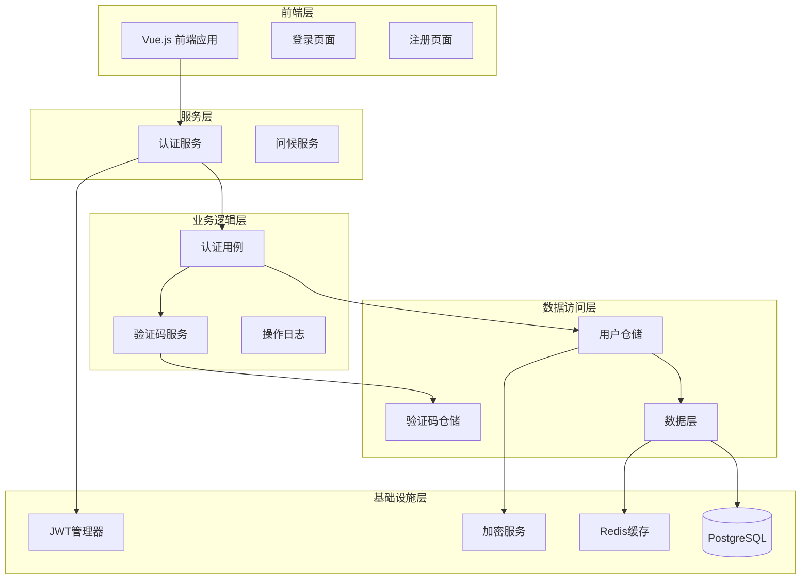
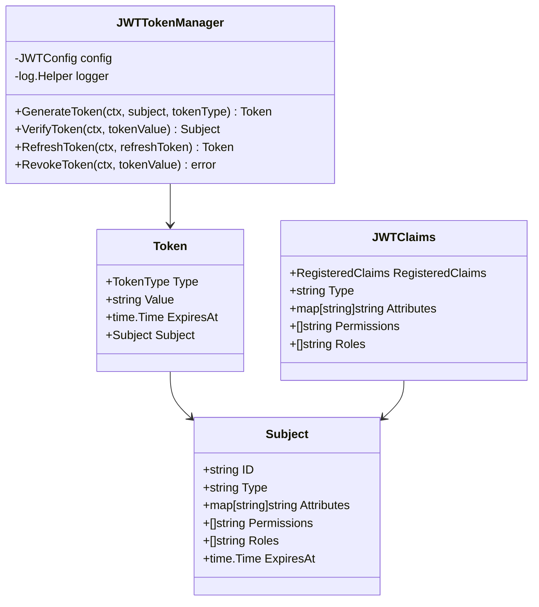
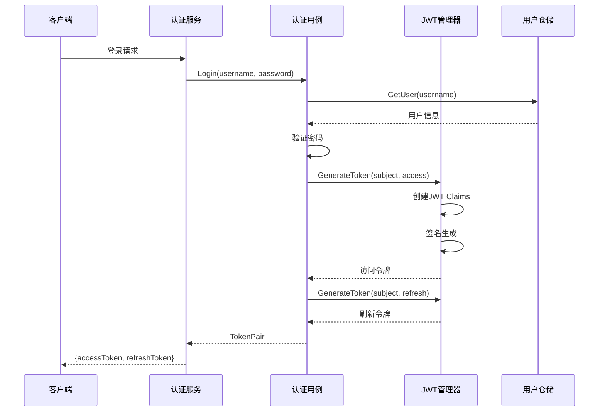
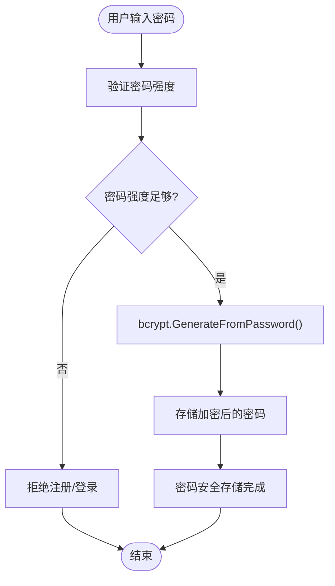
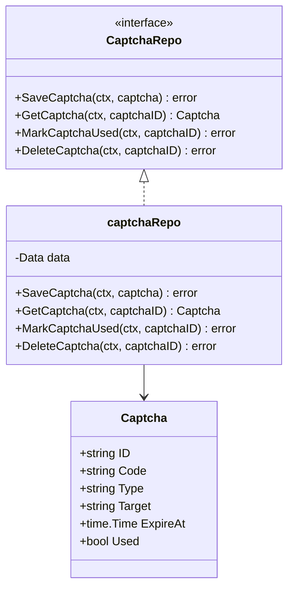
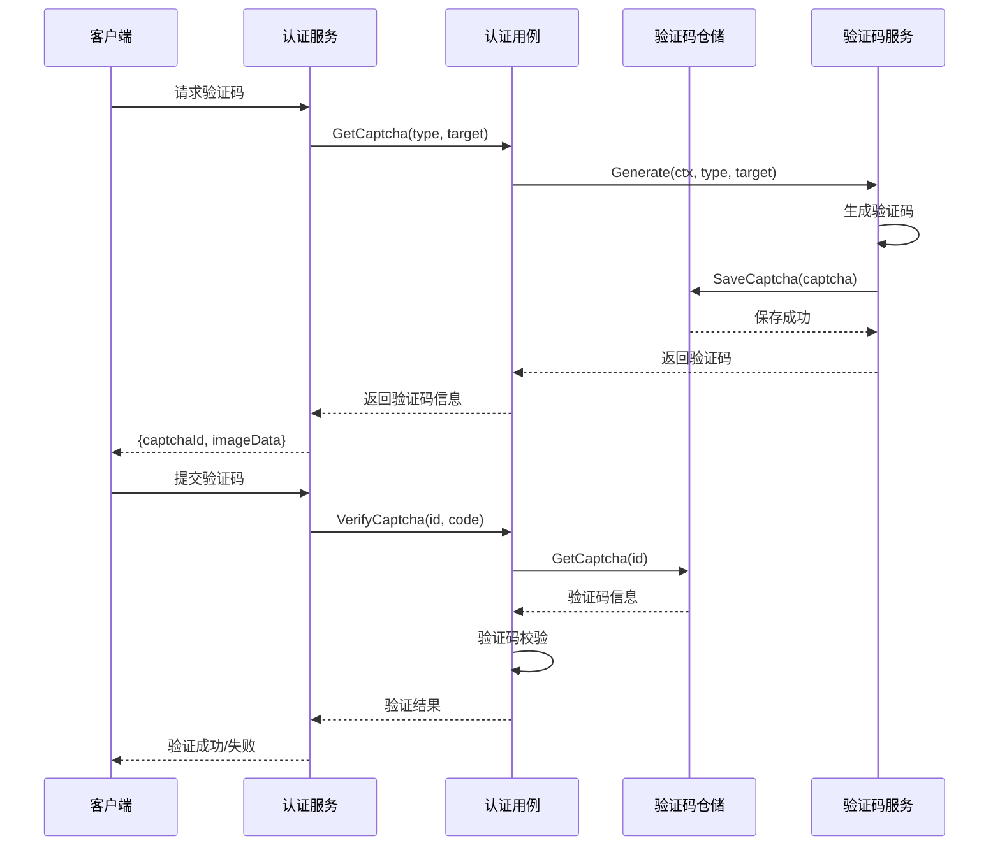
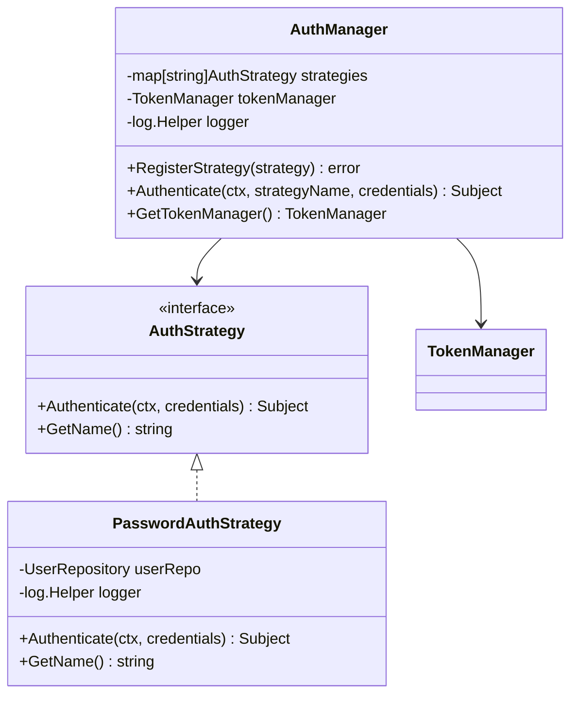
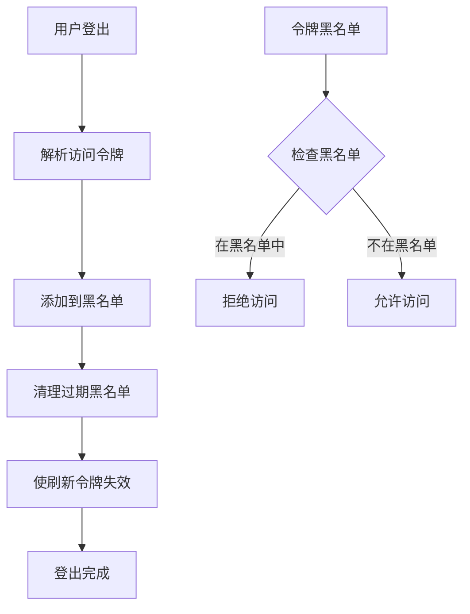
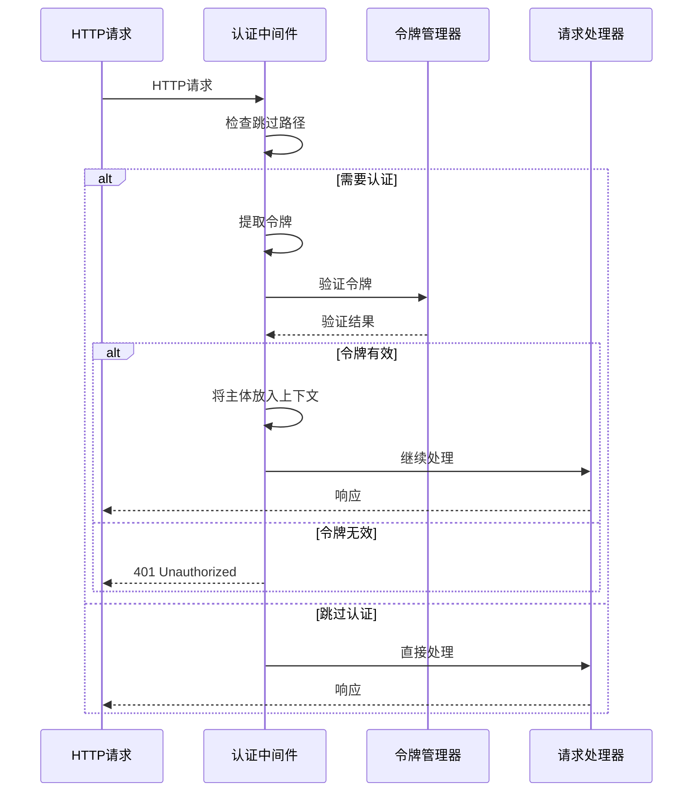

# 认证安全机制

<cite>
**本文档引用的文件**
- [internal/pkg/auth/strategies.go](file://internal/pkg/auth/strategies.go)
- [internal/pkg/auth/auth.go](file://internal/pkg/auth/auth.go)
- [internal/pkg/auth/middleware.go](file://internal/pkg/auth/middleware.go)
- [internal/data/auth.go](file://internal/data/auth.go)
- [internal/data/captcha.go](file://internal/data/captcha.go)
- [internal/service/auth.go](file://internal/service/auth.go)
- [internal/biz/auth.go](file://internal/biz/auth.go)
- [internal/biz/kms.go](file://internal/biz/kms.go)
- [configs/config.yaml](file://configs/config.yaml)
</cite>

## 目录
1. [简介](#简介)
2. [项目架构概览](#项目架构概览)
3. [JWT令牌管理系统](#jwt令牌管理系统)
4. [密码安全机制](#密码安全机制)
5. [用户状态与账户锁定](#用户状态与账户锁定)
6. [验证码系统](#验证码系统)
7. [认证策略实现](#认证策略实现)
8. [会话管理与令牌刷新](#会话管理与令牌刷新)
9. [安全中间件](#安全中间件)
10. [错误处理与日志记录](#错误处理与日志记录)
11. [配置管理](#配置管理)
12. [总结](#总结)

## 简介

本项目采用了一套完整的企业级认证安全机制，基于JWT（JSON Web Token）技术构建，提供了多层次的安全防护体系。该系统集成了密码学算法、验证码验证、账户锁定机制、双因素认证等功能，确保用户身份验证的安全性和可靠性。

主要特性包括：
- 基于bcrypt的高强度密码存储
- 多层次的验证码验证机制
- 智能的账户锁定与解锁策略
- 完整的JWT令牌生命周期管理
- 双因素认证支持
- 详细的审计日志记录

## 项目架构概览



**图表来源**
- [internal/service/auth.go](file://internal/service/auth.go#L1-L50)
- [internal/biz/auth.go](file://internal/biz/auth.go#L1-L100)
- [internal/data/auth.go](file://internal/data/auth.go#L1-L50)

## JWT令牌管理系统

### 令牌类型与结构

系统支持三种类型的JWT令牌：



**图表来源**
- [internal/pkg/auth/auth.go](file://internal/pkg/auth/auth.go#L15-L100)
- [internal/pkg/auth/auth.go](file://internal/pkg/auth/auth.go#L150-L250)

### 令牌生成流程



**图表来源**
- [internal/biz/auth.go](file://internal/biz/auth.go#L300-L350)
- [internal/pkg/auth/auth.go](file://internal/pkg/auth/auth.go#L150-L200)

### 令牌验证机制

系统实现了完整的令牌验证流程，包括签名验证、过期检查和类型校验：

```go
// 令牌验证核心逻辑
func (m *JWTTokenManager) VerifyToken(ctx context.Context, tokenValue string) (*Subject, error) {
    token, err := jwt.ParseWithClaims(tokenValue, &JWTClaims{}, func(token *jwt.Token) (interface{}, error) {
        if token.Method != m.getSigningMethod() {
            return nil, fmt.Errorf("unexpected signing method: %v", token.Header["alg"])
        }
        return []byte(m.config.Secret), nil
    })
    
    if err != nil {
        m.logger.WithContext(ctx).Errorf("failed to parse token: %v", err)
        return nil, fmt.Errorf("invalid token: %w", err)
    }
    
    claims, ok := token.Claims.(*JWTClaims)
    if !ok || !token.Valid {
        return nil, fmt.Errorf("invalid token claims")
    }
    
    // 构建Subject对象
    subject := &Subject{
        ID:          claims.Subject,
        Type:        claims.Type,
        Attributes:  claims.Attributes,
        Permissions: claims.Permissions,
        Roles:       claims.Roles,
        ExpiresAt:   claims.ExpiresAt.Time,
    }
    
    return subject, nil
}
```

**章节来源**
- [internal/pkg/auth/auth.go](file://internal/pkg/auth/auth.go#L200-L250)

## 密码安全机制

### bcrypt密码加密

系统使用bcrypt算法对用户密码进行高强度加密，确保即使数据库泄露，密码也无法被轻易破解：



**图表来源**
- [internal/biz/auth.go](file://internal/biz/auth.go#L650-L670)

### 密码验证流程

```go
// 密码验证核心实现
func (s *PasswordAuthStrategy) Authenticate(ctx context.Context, credentials interface{}) (*Subject, error) {
    creds, ok := credentials.(*PasswordCredentials)
    if !ok {
        return nil, fmt.Errorf("invalid credentials type for password auth")
    }
    
    // 获取用户信息
    user, err := s.userRepo.GetByUsername(ctx, creds.Username)
    if err != nil {
        s.logger.WithContext(ctx).Errorf("failed to get user: %v", err)
        return nil, fmt.Errorf("authentication failed")
    }
    
    // 检查用户状态
    if user.Status != "active" {
        return nil, fmt.Errorf("user account is %s", user.Status)
    }
    
    // 验证密码
    if err := bcrypt.CompareHashAndPassword([]byte(user.Password), []byte(creds.Password)); err != nil {
        s.logger.WithContext(ctx).Warnf("password mismatch for user: %s", user.Username)
        return nil, fmt.Errorf("authentication failed")
    }
    
    // 构建认证主体
    subject := &Subject{
        ID:          user.ID,
        Type:        "user",
        Permissions: user.Permissions,
        Roles:       user.Roles,
    }
    
    return subject, nil
}
```

**章节来源**
- [internal/pkg/auth/strategies.go](file://internal/pkg/auth/strategies.go#L40-L80)

## 用户状态与账户锁定

### 账户锁定策略

系统实现了智能的账户锁定机制，防止暴力破解攻击：

```mermaid
stateDiagram-v2
[*] --> Active : 正常状态
Active --> Locked : 失败次数超限
Locked --> Active : 锁定时间到期
Locked --> Active : 手动解锁
Active --> Suspended : 管理员操作
Suspended --> Active : 解封操作
note right of Locked : 最大失败次数 : 5<br/>锁定时长 : 30分钟
```

### 锁定状态管理

```go
// 账户锁定信息结构
type AccountLock struct {
    Username       string
    FailedAttempts int32
    LockUntil      time.Time
    LastAttempt    time.Time
}

// 记录失败尝试并更新锁定状态
func (uc *authUsecase) recordFailedAttempt(ctx context.Context, username string) {
    // 获取当前锁定状态
    lock, err := uc.repo.GetLock(ctx, username)
    if err != nil {
        if err != ErrUserNotFound {
            uc.log.Errorf("获取账户锁定状态失败: %v", err)
            return
        }
        // 不存在则创建新的锁定记录
        lock = &AccountLock{
            Username:       username,
            FailedAttempts: 0,
            LastAttempt:    time.Now(),
        }
    }

    now := time.Now()
    lock.FailedAttempts++
    lock.LastAttempt = now

    // 达到最大尝试次数，进行锁定
    if lock.FailedAttempts >= uc.config.MaxLoginAttempts {
        lock.LockUntil = now.Add(uc.config.LockDuration)
    }

    // 保存锁定记录
    if err := uc.repo.SaveLock(ctx, lock); err != nil {
        uc.log.Errorf("保存账户锁定状态失败: %v", err)
    }
}
```

**章节来源**
- [internal/biz/auth.go](file://internal/biz/auth.go#L600-L650)

## 验证码系统

### 验证码存储与管理

系统使用Redis作为验证码的缓存存储，确保验证码的时效性和安全性：



**图表来源**
- [internal/data/captcha.go](file://internal/data/captcha.go#L1-L50)

### 验证码验证流程



**图表来源**
- [internal/service/auth.go](file://internal/service/auth.go#L20-L80)
- [internal/biz/auth.go](file://internal/biz/auth.go#L500-L550)

**章节来源**
- [internal/data/captcha.go](file://internal/data/captcha.go#L1-L56)

## 认证策略实现

### 策略模式架构

系统采用策略模式设计认证机制，支持多种认证方式的扩展：



**图表来源**
- [internal/pkg/auth/strategies.go](file://internal/pkg/auth/strategies.go#L1-L87)
- [internal/pkg/auth/auth.go](file://internal/pkg/auth/auth.go#L50-L100)

### 密码认证策略

```go
// 密码认证策略实现
type PasswordAuthStrategy struct {
    userRepo UserRepository
    logger   *log.Helper
}

func (s *PasswordAuthStrategy) Authenticate(ctx context.Context, credentials interface{}) (*Subject, error) {
    creds, ok := credentials.(*PasswordCredentials)
    if !ok {
        return nil, fmt.Errorf("invalid credentials type for password auth")
    }
    
    if creds.Username == "" || creds.Password == "" {
        return nil, fmt.Errorf("username and password are required")
    }
    
    // 获取用户信息
    user, err := s.userRepo.GetByUsername(ctx, creds.Username)
    if err != nil {
        s.logger.WithContext(ctx).Errorf("failed to get user: %v", err)
        return nil, fmt.Errorf("authentication failed")
    }
    
    // 检查用户状态
    if user.Status != "active" {
        return nil, fmt.Errorf("user account is %s", user.Status)
    }
    
    // 验证密码
    if err := bcrypt.CompareHashAndPassword([]byte(user.Password), []byte(creds.Password)); err != nil {
        s.logger.WithContext(ctx).Warnf("password mismatch for user: %s", user.Username)
        return nil, fmt.Errorf("authentication failed")
    }
    
    // 构建认证主体
    subject := &Subject{
        ID:          user.ID,
        Type:        "user",
        Permissions: user.Permissions,
        Roles:       user.Roles,
    }
    
    s.logger.WithContext(ctx).Infof("password authentication successful for user: %s", user.Username)
    return subject, nil
}
```

**章节来源**
- [internal/pkg/auth/strategies.go](file://internal/pkg/auth/strategies.go#L40-L80)

## 会话管理与令牌刷新

### 令牌黑名单机制

系统实现了令牌黑名单机制，用于处理主动注销和令牌撤销：



**图表来源**
- [internal/biz/auth.go](file://internal/biz/auth.go#L400-L450)

### 令牌刷新流程

```go
// 令牌刷新实现
func (uc *authUsecase) RefreshToken(ctx context.Context, refreshToken string) (*TokenPair, error) {
    // 解析刷新令牌
    claims, err := uc.parseRefreshToken(refreshToken)
    if err != nil {
        return nil, err
    }

    tokenID := claims["jti"].(string)
    username := claims["username"].(string)

    // 检查令牌是否已使用
    _, used, err := uc.repo.GetRefreshToken(ctx, tokenID)
    if err != nil {
        return nil, fmt.Errorf("验证刷新令牌失败: %v", err)
    }

    if used {
        // 如果令牌已被使用，可能是令牌被盗用，使所有令牌失效
        if err := uc.repo.InvalidateAllRefreshTokens(ctx, username); err != nil {
            uc.log.Warnf("令牌被重用，使所有令牌无效失败: %v", err)
        }
        return nil, ErrRefreshTokenReused
    }

    // 将当前刷新令牌标记为已使用
    if err := uc.repo.InvalidateRefreshToken(ctx, tokenID); err != nil {
        uc.log.Warnf("将刷新令牌标记为已使用失败: %v", err)
    }

    // 获取用户
    user, err := uc.repo.GetUser(ctx, username)
    if err != nil {
        return nil, fmt.Errorf("获取用户失败: %v", err)
    }

    // 生成新的令牌对
    tokenPair, err := uc.generateTokens(ctx, user)
    if err != nil {
        return nil, fmt.Errorf("生成新令牌失败: %v", err)
    }

    return tokenPair, nil
}
```

**章节来源**
- [internal/biz/auth.go](file://internal/biz/auth.go#L450-L500)

## 安全中间件

### 认证中间件实现

系统提供了完整的认证中间件，用于保护API路由：



**图表来源**
- [internal/pkg/auth/middleware.go](file://internal/pkg/auth/middleware.go#L30-L80)

### 中间件配置

```go
// 认证中间件配置
type AuthMiddlewareConfig struct {
    TokenManager TokenManager
    SkipPaths    []string  // 跳过认证的路径
    HeaderName   string    // 授权头名称
    TokenPrefix  string    // 令牌前缀
    Logger       log.Logger
}

// 默认配置
func DefaultAuthMiddlewareConfig() *AuthMiddlewareConfig {
    return &AuthMiddlewareConfig{
        SkipPaths:   []string{"/api/v1/auth/login", "/health"},
        HeaderName:  "Authorization",
        TokenPrefix: "Bearer ",
    }
}
```

**章节来源**
- [internal/pkg/auth/middleware.go](file://internal/pkg/auth/middleware.go#L20-L50)

## 错误处理与日志记录

### 错误类型定义

系统定义了完整的错误类型体系，便于精确的错误处理：

```go
// 认证相关错误
var (
    ErrUserNotFound        = errors.New("user not found")
    ErrUserExists          = errors.New("user already exists")
    ErrPasswordIncorrect   = errors.New("password incorrect")
    ErrCaptchaRequired     = errors.New("captcha required")
    ErrCaptchaInvalid      = errors.New("captcha invalid")
    ErrCaptchaExpired      = errors.New("captcha expired")
    ErrAccountLocked       = errors.New("account locked")
    ErrTokenInvalid        = errors.New("token invalid")
    ErrTokenExpired        = errors.New("token expired")
    ErrRefreshTokenInvalid = errors.New("refresh token invalid")
    ErrRefreshTokenReused  = errors.New("refresh token reused")
    ErrTotpCodeInvalid     = errors.New("totp code invalid")
    ErrTotpRequired        = errors.New("totp code required")
)
```

### 日志记录策略

系统实现了结构化的日志记录，包含详细的审计信息：

```go
// 认证成功日志
s.logger.WithContext(ctx).Infof("password authentication successful for user: %s", user.Username)

// 认证失败日志  
s.logger.WithContext(ctx).Warnf("password mismatch for user: %s", user.Username)

// 令牌验证日志
m.logger.WithContext(ctx).Infof("token revoked")

// 权限检查日志
m.logger.WithContext(ctx).Infof("authentication successful for subject: %s", subject.ID)
```

**章节来源**
- [internal/biz/auth.go](file://internal/biz/auth.go#L15-L30)
- [internal/pkg/auth/strategies.go](file://internal/pkg/auth/strategies.go#L70-L80)

## 配置管理

### 认证配置结构

```yaml
auth:
  jwt_secret_key: "your-super-secret-jwt-key-here"
  access_token_expiration: "24h"
  refresh_token_expiration: "7d"
  captcha_enabled: true
  captcha_expiration: "5m"
  max_login_attempts: 5
  lock_duration: "30m"
  totp_enabled: false
```

### 配置参数说明

| 参数 | 类型 | 默认值 | 说明 |
|------|------|--------|------|
| jwt_secret_key | string | required | JWT签名密钥 |
| access_token_expiration | duration | 24h | 访问令牌有效期 |
| refresh_token_expiration | duration | 7d | 刷新令牌有效期 |
| captcha_enabled | boolean | true | 是否启用验证码 |
| captcha_expiration | duration | 5m | 验证码有效期 |
| max_login_attempts | integer | 5 | 最大登录尝试次数 |
| lock_duration | duration | 30m | 账户锁定时长 |
| totp_enabled | boolean | false | 是否启用双因素认证 |

**章节来源**
- [configs/config.yaml](file://configs/config.yaml#L15-L25)

## 总结

本项目构建了一套完整的企业级认证安全机制，具有以下特点：

### 安全性保障

1. **密码安全**：使用bcrypt算法进行高强度密码加密
2. **令牌安全**：基于JWT的令牌系统，支持签名验证和过期控制
3. **多重验证**：验证码、账户锁定、双因素认证等多层防护
4. **实时监控**：详细的审计日志和异常检测

### 可扩展性设计

1. **策略模式**：支持多种认证策略的灵活扩展
2. **模块化架构**：清晰的分层设计，便于维护和扩展
3. **配置驱动**：通过配置文件管理安全参数

### 性能优化

1. **缓存机制**：使用Redis缓存验证码和令牌信息
2. **异步处理**：验证码生成和验证采用异步模式
3. **资源池化**：连接池和对象池优化资源使用

这套认证安全机制为企业应用提供了坚实的安全基础，能够有效防范各种常见的安全威胁，同时保持良好的用户体验和系统性能。