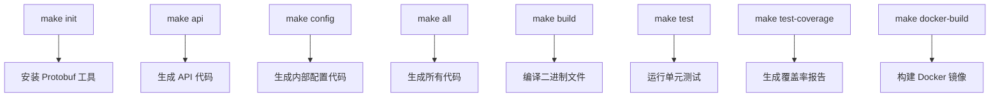
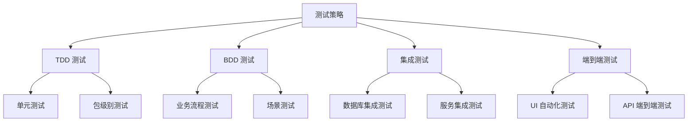
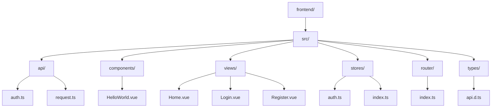
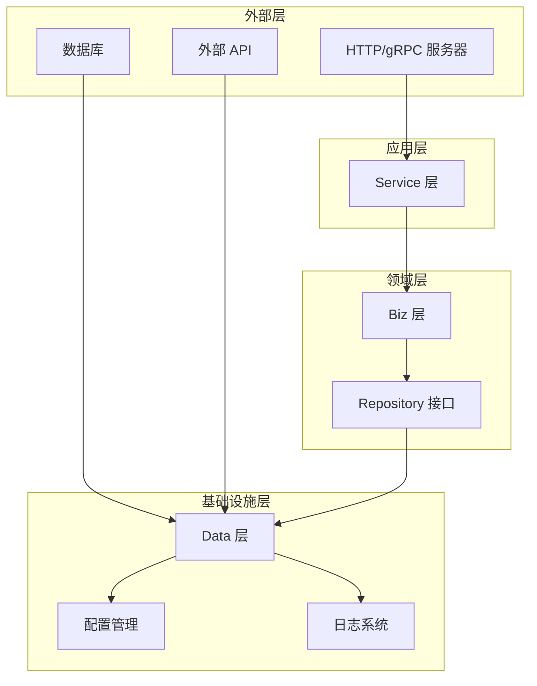

# 开发者指南

<cite>
**本文档中引用的文件**
- [Makefile](file://Makefile)
- [README.md](file://README.md)
- [cmd/kratos-boilerplate/main.go](file://cmd/kratos-boilerplate/main.go)
- [cmd/kratos-boilerplate/wire.go](file://cmd/kratos-boilerplate/wire.go)
- [api/helloworld/v1/greeter.proto](file://api/helloworld/v1/greeter.proto)
- [internal/biz/greeter.go](file://internal/biz/greeter.go)
- [internal/service/greeter.go](file://internal/service/greeter.go)
- [frontend/src/views/Home.vue](file://frontend/src/views/Home.vue)
- [frontend/src/components/HelloWorld.vue](file://frontend/src/components/HelloWorld.vue)
- [frontend/src/api/request.ts](file://frontend/src/api/request.ts)
- [frontend/src/api/auth.ts](file://frontend/src/api/auth.ts)
- [frontend/package.json](file://frontend/package.json)
</cite>

## 目录
1. [项目概述](#项目概述)
2. [开发环境设置](#开发环境设置)
3. [Makefile 快捷命令](#makefile-快捷命令)
4. [添加新的 API 接口](#添加新的-api-接口)
5. [编写高质量测试](#编写高质量测试)
6. [调试 Kratos 服务](#调试-kratos-服务)
7. [前端集成开发](#前端集成开发)
8. [代码贡献流程](#代码贡献流程)
9. [最佳实践](#最佳实践)
10. [故障排除](#故障排除)

## 项目概述

本项目是一个基于 Kratos 框架的企业级微服务模板项目，采用 Go 语言开发后端服务，Vue 3 + TypeScript 开发前端界面。项目遵循 Clean Architecture 设计原则，实现了完整的开发工作流和测试体系。

### 技术栈概览

- **后端框架**: Kratos v2
- **编程语言**: Go 1.22+
- **协议**: Protocol Buffers v3
- **数据库**: PostgreSQL
- **前端框架**: Vue 3 + TypeScript + Element Plus
- **构建工具**: Makefile + Docker
- **测试策略**: TDD + BDD 混合测试

## 开发环境设置

### 系统要求

- Go 1.22+
- Protocol Buffers v3
- Docker (用于数据库和容器化部署)
- Node.js 16+ (用于前端开发)

### 初始化开发环境

```bash
# 下载并安装必要的工具
make init

# 安装完成后验证
which protoc
which kratos
```

### 数据库初始化

```bash
# 启动 PostgreSQL 数据库
docker compose up db -d

# 执行数据库迁移
# 数据库连接配置在 configs/config.yaml 中
```

**章节来源**
- [README.md](file://README.md#L1-L93)
- [Makefile](file://Makefile#L1-L30)

## Makefile 快捷命令

Makefile 提供了完整的开发工作流支持，涵盖了代码生成、编译、测试和部署的各个环节。

### 核心命令概览



**图表来源**
- [Makefile](file://Makefile#L1-L151)

### 代码生成命令

#### 1. 生成 API 代码

```bash
# 生成所有 API 文件（pb.go, http, grpc, validate, swagger）
make api

# 输出示例：
# API proto files generated successfully
# OpenAPI documentation generated in current directory
```

#### 2. 生成配置代码

```bash
# 生成内部配置相关的 Protobuf 代码
make config
```

#### 3. 全量代码生成

```bash
# 生成所有代码文件
make all

# 等价于：
make api; make config; make generate;
```

### 编译和构建

#### 1. 构建二进制文件

```bash
# 构建可执行文件
make build

# 构建后的文件位于 bin/ 目录
./bin/kratos-boilerplate -conf ./configs
```

#### 2. Docker 镜像构建

```bash
# 构建 Docker 镜像
docker build -t kratos-boilerplate:latest .

# 运行容器
docker run --rm -p 8000:8000 -p 9000:9000 \
  -v $(pwd)/configs:/data/conf \
  kratos-boilerplate:latest
```

### 测试相关命令

#### 1. 运行单元测试

```bash
# 运行所有内部包的单元测试
make test

# 输出示例：
# PASS
# coverage: 85.2% of statements
```

#### 2. 生成覆盖率报告

```bash
# 生成 HTML 覆盖率报告
make test-coverage

# 生成的文件：coverage.html 和 coverage.out
# 可用浏览器打开查看详细覆盖情况
```

#### 3. 全量测试

```bash
# 重新生成代码并运行测试
make test-all

# 包含步骤：
# 1. make api
# 2. make generate
# 3. make test
```

**章节来源**
- [Makefile](file://Makefile#L1-L151)

## 添加新的 API 接口

以添加一个名为 "Greeter" 的服务为例，演示从 API 定义到前端调用的完整开发流程。

### 第一步：编写 .proto 文件

在 `api/helloworld/v1/` 目录下创建新的 `.proto` 文件：

```protobuf
syntax = "proto3";

package helloworld.v1;

import "google/api/annotations.proto";

option go_package = "kratos-boilerplate/api/helloworld/v1;v1";
option java_multiple_files = true;
option java_package = "dev.kratos.api.helloworld.v1";
option java_outer_classname = "HelloworldProtoV1";

// The greeting service definition.
service Greeter {
  // Sends a greeting
  rpc SayHello (HelloRequest) returns (HelloReply) {
    option (google.api.http) = {
      get: "/helloworld/{name}"
    };
  }
}

// The request message containing the user's name.
message HelloRequest {
  string name = 1;
}

// The response message containing the greetings
message HelloReply {
  string message = 1;
}
```

### 第二步：生成代码

```bash
# 生成 API 代码
make api

# 生成后的文件结构：
# api/helloworld/v1/
# ├── greeter.pb.go          # Protobuf 生成的 Go 结构体
# ├── greeter_http.pb.go     # HTTP 处理器
# ├── greeter_grpc.pb.go     # gRPC 处理器
# ├── greeter.swagger.json   # Swagger 文档
# └── greeter.swagger.yaml   # OpenAPI 文档
```

### 第三步：实现 Biz 层逻辑

在 `internal/biz/` 目录下创建业务逻辑层：

```go
package biz

import (
    "context"
    "github.com/go-kratos/kratos/v2/log"
)

// Greeter 是一个 Greeter 实体
type Greeter struct {
    Hello string
}

// GreeterRepo 是 Greeter 仓库接口
type GreeterRepo interface {
    Save(context.Context, *Greeter) (*Greeter, error)
    Update(context.Context, *Greeter) (*Greeter, error)
    FindByID(context.Context, int64) (*Greeter, error)
    ListByHello(context.Context, string) ([]*Greeter, error)
    ListAll(context.Context) ([]*Greeter, error)
}

// GreeterUsecase 是 Greeter 业务用例
type GreeterUsecase struct {
    repo GreeterRepo
    log  *log.Helper
}

// NewGreeterUsecase 创建一个新的 Greeter 业务用例
func NewGreeterUsecase(repo GreeterRepo, logger log.Logger) *GreeterUsecase {
    return &GreeterUsecase{repo: repo, log: log.NewHelper(logger)}
}

// CreateGreeter 创建一个 Greeter，并返回新的 Greeter
func (uc *GreeterUsecase) CreateGreeter(ctx context.Context, g *Greeter) (*Greeter, error) {
    uc.log.WithContext(ctx).Infof("CreateGreeter: %v", g.Hello)
    return uc.repo.Save(ctx, g)
}
```

### 第四步：实现 Service 层

在 `internal/service/` 目录下创建服务层：

```go
package service

import (
    "context"
    v1 "kratos-boilerplate/api/helloworld/v1"
    "kratos-boilerplate/internal/biz"
)

// GreeterService 是 greeter 服务
type GreeterService struct {
    v1.UnimplementedGreeterServer
    uc *biz.GreeterUsecase
}

// NewGreeterService 创建一个新的 greeter 服务
func NewGreeterService(uc *biz.GreeterUsecase) *GreeterService {
    return &GreeterService{uc: uc}
}

// SayHello 实现 helloworld.GreeterServer
func (s *GreeterService) SayHello(ctx context.Context, in *v1.HelloRequest) (*v1.HelloReply, error) {
    g, err := s.uc.CreateGreeter(ctx, &biz.Greeter{Hello: in.Name})
    if err != nil {
        return nil, err
    }
    return &v1.HelloReply{Message: "Hello " + g.Hello}, nil
}
```

### 第五步：更新依赖注入配置

修改 `cmd/kratos-boilerplate/wire.go` 文件：

```go
// wireApp 初始化 Kratos 应用程序
func wireApp(*conf.Server, *conf.Data, *conf.Auth, *conf.Bootstrap, log.Logger) (*kratos.App, func(), error) {
    wire.Build(server.ProviderSet, data.ProviderSet, biz.ProviderSet, service.ProviderSet, newApp)
    return nil, nil, nil
}
```

### 第六步：注册服务提供者

确保在各个 ProviderSet 中正确注册新服务：

```go
// 在 internal/biz/provider.go 中添加：
var ProviderSet = wire.NewSet(
    NewGreeterUsecase,
    // 其他业务用例...
)

// 在 internal/service/provider.go 中添加：
var ProviderSet = wire.NewSet(
    NewGreeterService,
    // 其他服务...
)
```

### 第七步：测试新接口

```bash
# 重新生成代码
make api
make generate

# 启动服务
./bin/kratos-boilerplate -conf ./configs

# 测试接口
curl "http://localhost:8000/helloworld/World"
# 应该返回：{"message":"Hello World"}
```

**章节来源**
- [api/helloworld/v1/greeter.proto](file://api/helloworld/v1/greeter.proto#L1-L31)
- [internal/biz/greeter.go](file://internal/biz/greeter.go#L1-L39)
- [internal/service/greeter.go](file://internal/service/greeter.go#L1-L30)

## 编写高质量测试

项目采用 TDD（测试驱动开发）+ BDD（行为驱动开发）的混合测试策略。

### 测试类型概览



### 单元测试示例

以 `internal/biz/greeter.go` 为例：

```go
package biz

import (
    "context"
    "testing"
    "github.com/stretchr/testify/assert"
    "github.com/stretchr/testify/mock"
)

// MockGreeterRepo 是 GreeterRepo 的模拟实现
type MockGreeterRepo struct {
    mock.Mock
}

func (m *MockGreeterRepo) Save(ctx context.Context, g *Greeter) (*Greeter, error) {
    args := m.Called(ctx, g)
    return args.Get(0).(*Greeter), args.Error(1)
}

func TestCreateGreeter(t *testing.T) {
    // 准备测试数据
    ctx := context.Background()
    greeter := &Greeter{Hello: "World"}
    
    // 创建模拟对象
    mockRepo := new(MockGreeterRepo)
    mockRepo.On("Save", ctx, greeter).Return(greeter, nil)
    
    // 创建业务用例
    uc := NewGreeterUsecase(mockRepo, nil)
    
    // 执行测试
    result, err := uc.CreateGreeter(ctx, greeter)
    
    // 断言结果
    assert.NoError(t, err)
    assert.Equal(t, "World", result.Hello)
    mockRepo.AssertExpectations(t)
}
```

### 集成测试示例

```go
package integration_test

import (
    "context"
    "testing"
    "kratos-boilerplate/internal/biz"
    "kratos-boilerplate/internal/data"
    "github.com/stretchr/testify/suite"
)

type GreeterIntegrationTestSuite struct {
    suite.Suite
    greeterUC *biz.GreeterUsecase
    greeterRepo *data.GreeterRepo
}

func (s *GreeterIntegrationTestSuite) SetupTest() {
    // 初始化真实的数据层
    db, _ := data.NewDatabase()
    s.greeterRepo = data.NewGreeterRepo(db)
    s.greeterUC = biz.NewGreeterUsecase(s.greeterRepo, nil)
}

func (s *GreeterIntegrationTestSuite) TestCreateGreeter() {
    ctx := context.Background()
    greeter := &biz.Greeter{Hello: "Integration Test"}
    
    result, err := s.greeterUC.CreateGreeter(ctx, greeter)
    
    s.NoError(err)
    s.NotNil(result)
    s.Equal("Integration Test", result.Hello)
}

func TestGreeterIntegration(t *testing.T) {
    suite.Run(t, new(GreeterIntegrationTestSuite))
}
```

### BDD 测试示例

```go
package bdd_test

import (
    "context"
    "testing"
    "github.com/onsi/ginkgo/v2"
    "github.com/onsi/gomega"
    "kratos-boilerplate/test/bdd/shared"
)

var _ = ginkgo.Describe("Greeter Service", func() {
    var (
        testSuite *shared.TestSuite
        ctx       context.Context
    )

    ginkgo.BeforeEach(func() {
        testSuite = shared.NewTestSuite()
        ctx = context.Background()
    })

    ginkgo.It("should greet a person", func() {
        // Given
        name := "Ginkgo"
        
        // When
        result, err := testSuite.Services.GreeterService.SayHello(ctx, &v1.HelloRequest{Name: name})
        
        // Then
        gomega.Expect(err).ToNot(gomega.HaveOccurred())
        gomega.Expect(result.Message).To(gomega.Equal("Hello Ginkgo"))
    })
})
```

### 测试覆盖率优化

```bash
# 生成详细的覆盖率报告
make test-coverage

# 查看覆盖率统计
go tool cover -func=coverage.out | grep total:

# 期望覆盖率 >80%
```

**章节来源**
- [internal/biz/greeter.go](file://internal/biz/greeter.go#L1-L39)
- [Makefile](file://Makefile#L50-L70)

## 调试 Kratos 服务

### 使用 Delve 调试

#### 1. 安装 Delve

```bash
# 安装 Delve 调试器
go install github.com/go-delve/delve/cmd/dlv@latest

# 验证安装
dlv version
```

#### 2. 启动调试会话

```bash
# 使用 Delve 启动服务
dlv exec ./bin/kratos-boilerplate -- -conf ./configs

# 或者使用 make 命令
make debug
```

#### 3. 设置断点

```bash
# 在特定行设置断点
break internal/biz/greeter.go:25

# 在函数名设置断点
break biz.NewGreeterUsecase

# 查看所有断点
breakpoints
```

#### 4. 调试操作

```bash
# 继续执行到下一个断点
continue

# 单步执行
next

# 进入函数
step

# 查看变量值
print uc

# 查看堆栈信息
stack
```

### 日志检查工具

项目提供了专门的日志合规性检查工具：

```bash
# 运行日志合规性检查
make logcheck

# 生成 JSON 报告
make logcheck-json

# 生成 HTML 报告
make logcheck-html
```

### 性能分析

```bash
# 启动 pprof 分析
go tool pprof http://localhost:9000/debug/pprof/profile

# CPU 性能分析
go tool pprof http://localhost:9000/debug/pprof/profile?seconds=30

# 内存性能分析
go tool pprof http://localhost:9000/debug/pprof/heap
```

**章节来源**
- [Makefile](file://Makefile#L70-L100)

## 前端集成开发

### 前端项目结构



**图表来源**
- [frontend/src/api/auth.ts](file://frontend/src/api/auth.ts#L1-L99)
- [frontend/src/api/request.ts](file://frontend/src/api/request.ts#L1-L29)

### API 请求封装

项目已经封装了统一的 API 请求处理：

```typescript
// src/api/request.ts
import axios from 'axios'

const request = axios.create({
    baseURL: import.meta.env.VITE_API_BASE_URL || '/api',
    timeout: 5000
})

// 请求拦截器
request.interceptors.request.use(
    (config) => {
        // 添加认证信息
        const token = localStorage.getItem('access_token')
        if (token) {
            config.headers.Authorization = `Bearer ${token}`
        }
        return config
    },
    (error) => {
        return Promise.reject(error)
    }
)

// 响应拦截器
request.interceptors.response.use(
    (response) => {
        return response.data
    },
    (error) => {
        // 处理错误
        if (error.response?.status === 401) {
            // 清除无效 token 并跳转登录页
            localStorage.removeItem('access_token')
            localStorage.removeItem('refresh_token')
            window.location.href = '/login'
        }
        return Promise.reject(error)
    }
)

export default request
```

### 添加新的前端组件

#### 1. 创建组件文件

```vue
<!-- src/components/GreeterForm.vue -->
<script setup lang="ts">
import { ref } from 'vue'
import { ElMessage } from 'element-plus'

const props = defineProps<{
    initialName?: string
}>()

const emit = defineEmits<{
    greet: [message: string]
}>()

const name = ref(props.initialName || '')
const loading = ref(false)

const handleSubmit = async () => {
    if (!name.value) {
        ElMessage.warning('请输入名字')
        return
    }
    
    loading.value = true
    try {
        // 调用后端 API
        const response = await sayHello({ name: name.value })
        emit('greet', response.message)
        ElMessage.success('问候成功')
    } catch (error) {
        ElMessage.error('问候失败')
    } finally {
        loading.value = false
    }
}
</script>

<template>
  <el-form @submit.prevent="handleSubmit">
    <el-form-item label="名字">
      <el-input v-model="name" placeholder="请输入您的名字"></el-input>
    </el-form-item>
    <el-form-item>
      <el-button type="primary" :loading="loading" native-type="submit">
        发送问候
      </el-button>
    </el-form-item>
  </el-form>
</template>
```

#### 2. 添加 API 调用方法

```typescript
// src/api/greeter.ts
import request from './request'

// 调用 Greeter 服务
export const sayHello = (data: { name: string }) => {
    return request.post<ApiResponse<HelloReply>>('/v1/helloworld/say-hello', data)
}

// 获取问候消息
export const getGreeting = (name: string) => {
    return request.get<ApiResponse<HelloReply>>(`/v1/helloworld/${name}`)
}
```

#### 3. 在页面中使用

```vue
<!-- src/views/GreeterPage.vue -->
<script setup lang="ts">
import { ref } from 'vue'
import GreeterForm from '@/components/GreeterForm.vue'

const greetingMessage = ref('')

const handleGreet = (message: string) => {
    greetingMessage.value = message
}
</script>

<template>
  <div class="greeter-page">
    <h2>问候服务</h2>
    <GreeterForm @greet="handleGreet" />
    
    <el-card v-if="greetingMessage" class="result-card">
      <h3>收到的问候：</h3>
      <p>{{ greetingMessage }}</p>
    </el-card>
  </div>
</template>
```

### 类型定义

```typescript
// src/types/api.d.ts
interface ApiResponse<T = any> {
    code: number
    message: string
    data: T
}

interface HelloReply {
    message: string
}

interface HelloRequest {
    name: string
}
```

**章节来源**
- [frontend/src/api/request.ts](file://frontend/src/api/request.ts#L1-L29)
- [frontend/src/api/auth.ts](file://frontend/src/api/auth.ts#L1-L99)
- [frontend/src/views/Home.vue](file://frontend/src/views/Home.vue#L1-L85)

## 代码贡献流程

### 分支策略

项目采用 Git Flow 分支模型：

```mermaid
gitGraph
commit id: "master"
branch develop
checkout develop
commit id: "develop"
branch feature/new-greeter
checkout feature/new-greeter
commit id: "Add Greeter API"
commit id: "Implement Business Logic"
commit id: "Write Tests"
checkout develop
merge feature/new-greeter
commit id: "Merge Greeter Feature"
checkout master
merge develop
commit id: "Release v1.1.0"
```

### PR 流程

#### 1. 创建功能分支

```bash
# 从 develop 分支创建新功能分支
git checkout develop
git pull origin develop
git checkout -b feature/add-new-service

# 或使用快捷命令
make feature-branch name=add-new-service
```

#### 2. 开发和测试

```bash
# 开发过程中持续测试
make test
make test-coverage

# 生成代码文档
make docs
```

#### 3. 提交代码

```bash
# 添加更改
git add .

# 提交消息遵循约定式提交规范
git commit -m "feat(api): add new greeter service"

# 支持的消息类型：
# feat: 新功能
# fix: 错误修复
# docs: 文档更新
# style: 代码格式调整
# refactor: 代码重构
# test: 测试相关
# chore: 构建过程或辅助工具的变动
```

#### 4. 推送和创建 PR

```bash
# 推送到远程分支
git push origin feature/add-new-service

# 在 GitHub 上创建 Pull Request
# 标题格式：feat: 功能描述
# 描述包含：
# - 为什么需要这个变更
# - 主要变更内容
# - 如何测试
# - 相关 Issue（如果有）
```

### 代码风格规范

#### Go 代码风格

```bash
# 运行代码格式化
go fmt ./...

# 检查代码质量问题
golint ./...
go vet ./...

# 运行静态分析
staticcheck ./...
```

#### 前端代码风格

```bash
# TypeScript 类型检查
npm run type-check

# ESLint 代码检查
npm run lint

# Prettier 代码格式化
npm run format
```

### 代码审查清单

#### 后端代码审查要点

- [ ] 遵循 Clean Architecture 设计原则
- [ ] 实现适当的错误处理和日志记录
- [ ] 编写充分的单元测试和集成测试
- [ ] API 文档完整且准确
- [ ] 配置管理合理
- [ ] 依赖注入正确使用

#### 前端代码审查要点

- [ ] TypeScript 类型安全
- [ ] 组件设计符合 Vue 3 Composition API 规范
- [ ] 状态管理合理使用 Pinia
- [ ] API 调用封装完善
- [ ] 错误处理和用户反馈
- [ ] 响应式设计适配不同设备

**章节来源**
- [README.md](file://README.md#L70-L93)

## 最佳实践

### 1. 遵循 Clean Architecture

项目严格遵循 Clean Architecture 设计原则：



### 2. 错误处理最佳实践

```go
// 统一错误处理
func (s *GreeterService) SayHello(ctx context.Context, in *v1.HelloRequest) (*v1.HelloReply, error) {
    if in.Name == "" {
        return nil, errors.BadRequest("VALIDATION_ERROR", "name is required")
    }
    
    g, err := s.uc.CreateGreeter(ctx, &biz.Greeter{Hello: in.Name})
    if err != nil {
        s.log.Errorf("Failed to create greeter: %v", err)
        return nil, errors.InternalServer("DATABASE_ERROR", "failed to save greeter")
    }
    
    return &v1.HelloReply{Message: "Hello " + g.Hello}, nil
}
```

### 3. 日志记录最佳实践

```go
// 使用结构化日志
func (uc *GreeterUsecase) CreateGreeter(ctx context.Context, g *Greeter) (*Greeter, error) {
    uc.log.WithContext(ctx).Infof("Creating greeter with name: %s", g.Hello)
    
    result, err := uc.repo.Save(ctx, g)
    if err != nil {
        uc.log.WithContext(ctx).Errorf("Failed to save greeter: %v", err)
        return nil, err
    }
    
    uc.log.WithContext(ctx).Infof("Successfully created greeter with ID: %d", result.ID)
    return result, nil
}
```

### 4. 性能优化建议

- 使用连接池管理数据库连接
- 实现缓存机制减少数据库查询
- 合理使用异步处理耗时任务
- 监控关键指标和性能瓶颈

### 5. 安全考虑

- 输入验证和清理
- SQL 注入防护
- XSS 和 CSRF 防护
- 敏感信息加密存储
- API 访问控制

## 故障排除

### 常见问题及解决方案

#### 1. 代码生成失败

```bash
# 问题：Protobuf 编译错误
# 解决方案：
make init  # 重新安装 Protobuf 工具
make api   # 重新生成代码

# 检查 .proto 文件语法
protoc --proto_path=./api --dry-run --go_out=paths=source_relative:./api api/**/*.proto
```

#### 2. 数据库连接问题

```bash
# 问题：无法连接到 PostgreSQL
# 解决方案：
docker compose up db -d  # 启动数据库容器
psql -h localhost -U postgres  # 测试连接

# 检查配置文件
cat configs/config.yaml | grep -i database
```

#### 3. 前端开发问题

```bash
# 问题：依赖安装失败
# 解决方案：
cd frontend
npm install
npm audit fix

# 问题：热重载不工作
# 解决方案：
npm run dev  # 确保开发服务器正常启动
```

#### 4. 测试失败

```bash
# 问题：测试覆盖率低
# 解决方案：
make test-coverage  # 生成详细报告
# 分析未覆盖的代码路径
# 补充相应的测试用例

# 问题：测试超时
# 解决方案：
# 检查是否有死锁或无限循环
# 适当增加测试超时时间
```

### 调试技巧

#### 1. 启用详细日志

```yaml
# configs/config.yaml
server:
  http:
    timeout: 5s
  grpc:
    timeout: 5s

logger:
  level: DEBUG
  encoding: console
```

#### 2. 使用 Prometheus 监控

```bash
# 启动监控服务
docker run -d -p 9090:9090 prom/prometheus

# 访问 Grafana 仪表板
docker run -d -p 3000:3000 grafana/grafana
```

#### 3. 性能分析

```bash
# CPU 性能分析
go tool pprof http://localhost:9000/debug/pprof/profile?seconds=30

# 内存泄漏检测
go tool pprof http://localhost:9000/debug/pprof/heap

# Goroutine 分析
go tool pprof http://localhost:9000/debug/pprof/goroutine
```

通过遵循这些开发指南和最佳实践，您将能够高效地参与项目开发，同时保持代码质量和系统的稳定性。记住始终关注架构一致性，遵循既定的设计模式和编码规范。