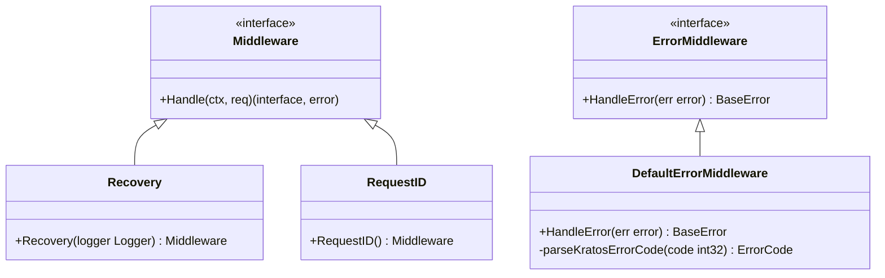
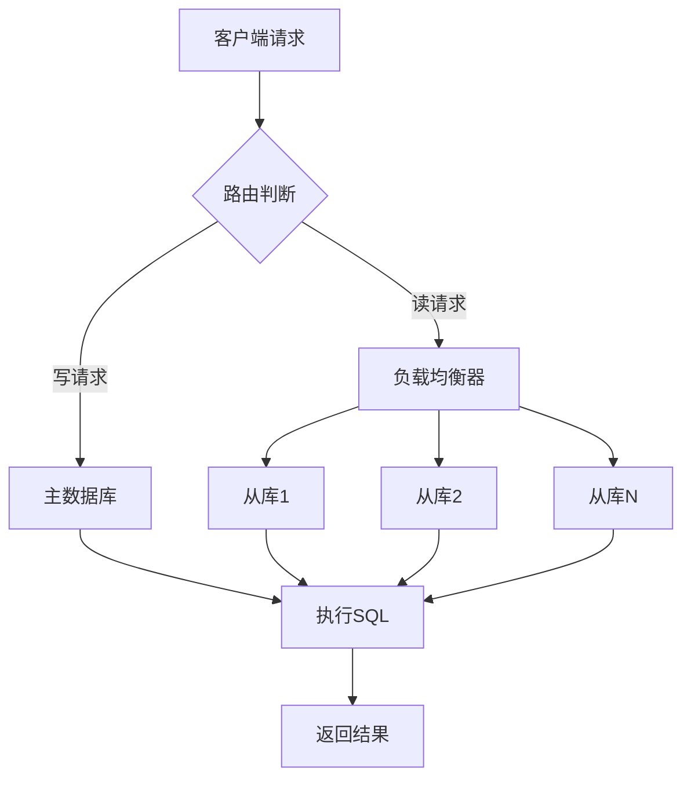

# 技术栈与依赖

<cite>
**本文档中引用的文件**
- [README.md](file://README.md)
- [go.mod](file://go.mod)
- [frontend/package.json](file://frontend/package.json)
- [docker-compose.yml](file://docker-compose.yml)
- [cmd/kratos-boilerplate/main.go](file://cmd/kratos-boilerplate/main.go)
- [Makefile](file://Makefile)
- [internal/pkg/errors/errors.go](file://internal/pkg/errors/errors.go)
- [internal/pkg/middleware/middleware.go](file://internal/pkg/middleware/middleware.go)
- [internal/pkg/db/database.go](file://internal/pkg/db/database.go)
- [internal/pkg/cache/cache.go](file://internal/pkg/cache/cache.go)
- [internal/pkg/config/config.go](file://internal/pkg/config/config.go)
- [frontend/src/main.ts](file://frontend/src/main.ts)
- [frontend/vite.config.ts](file://frontend/vite.config.ts)
</cite>

## 1. 后端技术栈概览

kratos-boilerplate 项目采用了现代化的微服务架构，基于 Go 语言和 Kratos 框架构建。整个后端系统围绕 gRPC 和 HTTP 双协议设计，提供了完整的认证授权、数据库访问、缓存管理、配置管理等功能模块。

### 1.1 Go 语言版本要求

项目使用 Go 1.24+ 版本，通过 `go.mod` 文件明确指定：

```go
go 1.24
toolchain go1.24.1
```

**选择理由**：
- 利用 Go 1.24 的新特性提升性能
- 支持最新的标准库功能
- 提供更好的内存管理和并发性能

### 1.2 Kratos 框架核心组件

#### 1.2.1 核心框架版本
- **Kratos v2.8.4**: 微服务框架核心
- **Swagger API 文档**: v1.0.1

#### 1.2.2 中间件系统
项目实现了完整的中间件体系：



**图表来源**
- [internal/pkg/middleware/middleware.go](file://internal/pkg/middleware/middleware.go#L0-L57)
- [internal/pkg/errors/errors.go](file://internal/pkg/errors/errors.go#L406-L461)

#### 1.2.3 错误处理机制

项目实现了统一的错误处理系统：

- **统一错误格式**: 所有错误都转换为标准化的 `BaseError` 结构
- **Kratos 错误转换**: 自动将 Kratos 内置错误转换为项目标准错误
- **错误分类**: 按照 HTTP 状态码映射到业务错误代码
- **堆栈跟踪**: 完整的错误堆栈记录和追踪

**章节来源**
- [internal/pkg/errors/errors.go](file://internal/pkg/errors/errors.go#L406-L461)
- [internal/pkg/middleware/middleware.go](file://internal/pkg/middleware/middleware.go#L0-L57)

### 1.3 Protobuf 编译工具链

项目使用完整的 Protobuf 工具链进行 API 定义和代码生成：

#### 1.3.1 核心工具
- **protoc**: Google Protobuf 编译器
- **protoc-gen-go**: Go 语言代码生成插件
- **protoc-gen-go-http**: HTTP 协议适配插件
- **protoc-gen-go-grpc**: gRPC 协议适配插件
- **protoc-gen-openapi**: OpenAPI/Swagger 文档生成插件

#### 1.3.2 工具安装流程
通过 Makefile 管理工具安装：

```bash
make init
```

该命令会安装以下工具：
```bash
go install google.golang.org/protobuf/cmd/protoc-gen-go@latest
go install google.golang.org/grpc/cmd/protoc-gen-go-grpc@latest
go install github.com/go-kratos/kratos/cmd/kratos/v2@latest
go install github.com/go-kratos/kratos/cmd/protoc-gen-go-http/v2@latest
go install github.com/google/gnostic/cmd/protoc-gen-openapi@latest
go install github.com/google/wire/cmd/wire@latest
```

**章节来源**
- [Makefile](file://Makefile#L15-L22)

### 1.4 数据库驱动

项目支持多种数据库驱动，采用 GORM 作为 ORM 层：

#### 1.4.1 支持的数据库
- **PostgreSQL**: v1.6.0
- **MySQL**: v1.6.0  
- **SQLite**: v1.6.0
- **SQL Server**: v1.6.1

#### 1.4.2 数据库特性
- **读写分离**: 支持主从数据库配置
- **连接池管理**: 完整的连接池配置选项
- **负载均衡**: 从库自动负载均衡
- **健康检查**: 数据库连接健康状态监控
- **事务支持**: 完整的事务处理能力



**图表来源**
- [internal/pkg/db/database.go](file://internal/pkg/db/database.go#L0-L649)

**章节来源**
- [go.mod](file://go.mod#L40-L50)
- [internal/pkg/db/database.go](file://internal/pkg/db/database.go#L0-L649)

### 1.5 缓存系统

项目集成了 Redis 作为缓存解决方案：

#### 1.5.1 Redis 集成
- **Redis 客户端**: v8.11.5 (github.com/go-redis/redis/v8)
- **Redis 客户端**: v9.7.3 (github.com/redis/go-redis/v9)
- **分布式锁**: 基于 Redis 实现的分布式锁机制

#### 1.5.2 缓存特性
- **基础缓存操作**: GET、SET、DEL、EXISTS
- **分布式锁**: 原子性的分布式锁实现
- **缓存管理器**: 带回调的缓存获取机制
- **连接池配置**: 可配置的连接池参数

**章节来源**
- [go.mod](file://go.mod#L15-L16)
- [internal/pkg/cache/cache.go](file://internal/pkg/cache/cache.go#L0-L262)

## 2. 前端技术栈

前端采用现代化的 Vue.js 3 生态系统，提供了完整的单页应用开发体验。

### 2.1 Vue.js 3 核心

- **Vue.js**: v3.5.13 - 响应式框架核心
- **Vue Router**: v4.5.0 - 路由管理
- **TypeScript**: v5.7.2 - 类型安全的 JavaScript 超集

### 2.2 状态管理

- **Pinia**: v3.0.1 - 现代化的状态管理库

### 2.3 UI 组件库

- **Element Plus**: v2.9.7 - 基于 Vue 3 的桌面端组件库
- **Element Plus Icons**: v2.3.1 - Element Plus 图标库

### 2.4 构建工具

- **Vite**: v6.2.0 - 快速的现代构建工具
- **TypeScript Compiler**: v5.7.2 - TypeScript 编译器
- **Vue Type Checking**: v2.2.4 - Vue 项目类型检查

### 2.5 开发依赖

```json
{
  "devDependencies": {
    "@types/node": "^22.14.1",
    "@vitejs/plugin-vue": "^5.2.1",
    "@vue/tsconfig": "^0.7.0",
    "typescript": "~5.7.2",
    "vite": "^6.2.0",
    "vue-tsc": "^2.2.4"
  }
}
```

**章节来源**
- [frontend/package.json](file://frontend/package.json#L0-L27)
- [frontend/src/main.ts](file://frontend/src/main.ts#L0-L20)

## 3. 基础设施依赖

### 3.1 容器化运行时

#### 3.1.1 Docker
- **Docker Compose**: 用于本地环境编排
- **PostgreSQL**: v14 - 主数据库
- **Redis**: 用于缓存和会话存储

#### 3.1.2 容器配置
```yaml
version: "3.8"
services:
  app:
    build: .
    container_name: cross-redline-app
    ports:
      - "8000:8000"
      - "9000:9000"
    volumes:
      - ./configs:/data/conf
    depends_on:
      db:
        condition: service_healthy
```

**章节来源**
- [docker-compose.yml](file://docker-compose.yml#L0-L49)

### 3.2 数据库系统

#### 3.2.1 主数据库
- **PostgreSQL**: v14 - 生产环境主数据库
- **配置**: 支持连接池、慢查询日志、自动迁移

#### 3.2.2 缓存系统
- **Redis**: 用于会话存储、缓存和分布式锁
- **配置**: 连接池、超时设置、持久化配置

### 3.3 监控与追踪

#### 3.3.1 链路追踪
- **Jaeger**: 分布式链路追踪
- **OpenTelemetry**: 跟踪 SDK 集成

#### 3.3.2 性能监控
- **指标收集**: 自动化的性能指标收集
- **日志聚合**: 结构化日志记录

## 4. 技术选型理由

### 4.1 Kratos 微服务框架

**选择理由**：
- **高性能**: 基于 Go 语言的高并发特性
- **双协议支持**: 同时支持 gRPC 和 HTTP 协议
- **云原生**: 完善的容器化和微服务支持
- **生态完善**: 丰富的中间件和工具链

### 4.2 gRPC + HTTP 双协议

**优势**：
- **灵活性**: 支持不同客户端的需求
- **互操作性**: HTTP 协议便于调试和集成
- **性能**: gRPC 提供高效的二进制通信
- **标准化**: 完整的 Protobuf 定义和文档

### 4.3 Vue.js 3 + TypeScript

**优势**：
- **类型安全**: TypeScript 提供编译时类型检查
- **性能优化**: Vue 3 的 Composition API 和虚拟 DOM
- **生态系统**: 丰富的第三方库和工具
- **开发体验**: Vite 提供快速的热重载和构建

### 4.4 数据库多样性

**支持多种数据库的原因**：
- **场景适配**: 不同数据库适合不同业务场景
- **迁移便利**: 统一的 ORM 层简化数据库切换
- **扩展性**: 支持水平扩展和读写分离

## 5. 依赖安装与环境准备

### 5.1 后端环境准备

#### 5.1.1 Go 环境
```bash
# 安装 Kratos CLI
go install github.com/go-kratos/kratos/cmd/kratos/v2@latest

# 初始化项目依赖
make init
```

#### 5.1.2 数据库准备
```bash
# 启动 PostgreSQL
docker compose up db -d

# 执行数据库迁移
make api
make config
```

### 5.2 前端环境准备

#### 5.2.1 依赖安装
```bash
# 进入前端目录
cd frontend

# 安装依赖
npm install

# 启动开发服务器
npm run dev
```

#### 5.2.2 构建生产版本
```bash
# 构建生产包
npm run build

# 预览生产包
npm run preview
```

### 5.3 版本冲突解决

#### 5.3.1 Go 模块管理
- 使用 `go mod tidy` 清理未使用的依赖
- 使用 `go mod vendor` 生成 vendor 目录
- 使用 `go mod graph` 查看依赖图

#### 5.3.2 前端依赖管理
- 使用 `npm outdated` 检查过期依赖
- 使用 `npm audit` 检查安全漏洞
- 使用 `npm dedupe` 优化依赖树

## 6. 总结

kratos-boilerplate 项目构建了一个完整的现代化微服务架构，涵盖了从后端框架到前端开发的全栈技术栈。通过精心选择的技术组件，项目实现了：

- **高性能**: 基于 Go 语言和 Kratos 框架的高并发能力
- **可扩展**: 支持多种数据库和缓存方案
- **易维护**: 完善的错误处理和日志系统
- **现代化**: Vue.js 3 + TypeScript 的前端开发体验
- **云原生**: 完善的容器化和微服务支持

这套技术栈非常适合构建企业级的微服务应用，既保证了开发效率，又确保了系统的稳定性和可扩展性。