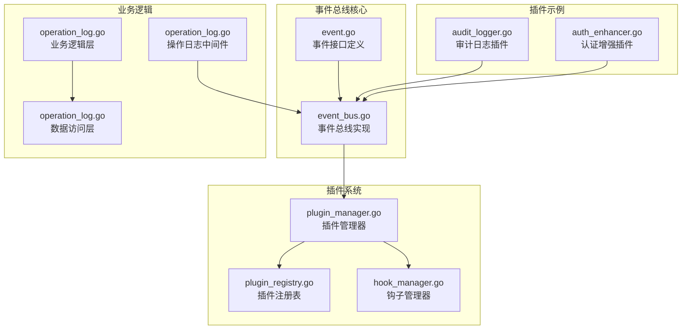
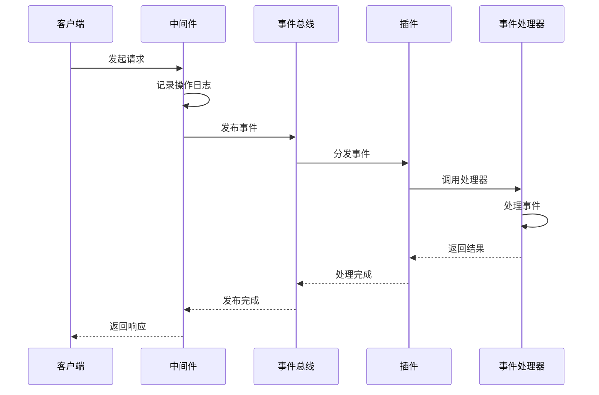
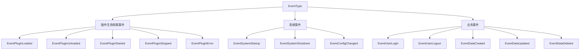
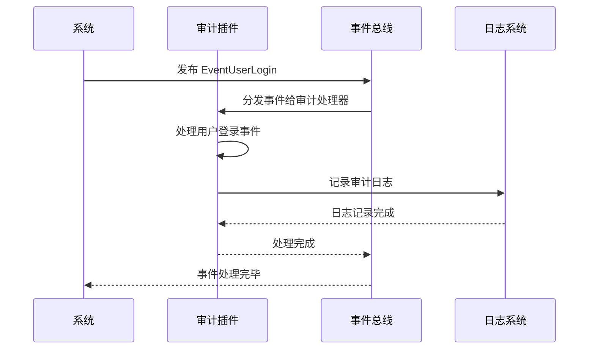

# 事件总线

<cite>
**本文档引用的文件**
- [event_bus.go](file://internal/pkg/plugin/event_bus.go)
- [event.go](file://internal/pkg/plugin/event.go)
- [audit_logger.go](file://plugins/audit_logger.go)
- [plugin_manager.go](file://internal/pkg/plugin/plugin_manager.go)
- [plugin_registry.go](file://internal/pkg/plugin/plugin_registry.go)
- [hook_manager.go](file://internal/pkg/plugin/hook_manager.go)
- [operation_log.go](file://internal/middleware/operation_log.go)
- [operation_log.go](file://internal/biz/operation_log.go)
- [operation_log.go](file://internal/data/operation_log.go)
- [config.yaml](file://configs/config.yaml)
</cite>

## 目录
1. [简介](#简介)
2. [项目结构](#项目结构)
3. [核心组件](#核心组件)
4. [架构概览](#架构概览)
5. [详细组件分析](#详细组件分析)
6. [事件总线机制详解](#事件总线机制详解)
7. [插件集成示例](#插件集成示例)
8. [性能考虑](#性能考虑)
9. [故障排除指南](#故障排除指南)
10. [结论](#结论)

## 简介

事件总线（EventBus）是 Kratos Boilerplate 项目中的核心解耦机制，它实现了发布/订阅模式，使系统能够优雅地处理各种业务事件。通过事件总线，插件系统能够响应用户登录、操作日志记录等关键业务事件，同时保持系统的模块化和可扩展性。

事件总线的主要特点包括：
- **松耦合设计**：发布者和订阅者之间完全解耦
- **异步处理**：支持同步和异步事件发布
- **事件过滤**：提供灵活的事件过滤策略
- **插件集成**：无缝集成插件系统，支持动态加载

## 项目结构

事件总线相关的文件组织结构如下：



**图表来源**
- [event_bus.go](file://internal/pkg/plugin/event_bus.go#L1-L274)
- [event.go](file://internal/pkg/plugin/event.go#L1-L82)
- [plugin_manager.go](file://internal/pkg/plugin/plugin_manager.go#L1-L442)

## 核心组件

事件总线系统由以下核心组件构成：

### 1. 事件总线接口（EventBus）

事件总线是整个系统的核心，负责事件的发布、订阅和分发：

```go
type EventBus interface {
    Subscribe(eventType EventType, handler EventHandler) error
    Unsubscribe(eventType EventType, handlerName string) error
    Publish(ctx context.Context, event Event) error
    PublishAsync(ctx context.Context, event Event) error
    AddFilter(filter EventFilter) error
    RemoveFilter(filter EventFilter) error
}
```

### 2. 事件处理器接口（EventHandler）

事件处理器定义了如何处理特定类型的事件：

```go
type EventHandler interface {
    GetName() string
    GetEventTypes() []EventType
    Handle(ctx context.Context, event Event) error
    GetTimeout() time.Duration
}
```

### 3. 事件过滤器接口（EventFilter）

事件过滤器允许对事件进行预处理和过滤：

```go
type EventFilter interface {
    Match(event Event) bool
}
```

**章节来源**
- [event.go](file://internal/pkg/plugin/event.go#L48-L80)
- [event_bus.go](file://internal/pkg/plugin/event_bus.go#L1-L274)

## 架构概览

事件总线采用发布/订阅模式，结合插件系统实现高度解耦的架构：



**图表来源**
- [operation_log.go](file://internal/middleware/operation_log.go#L1-L38)
- [event_bus.go](file://internal/pkg/plugin/event_bus.go#L67-L126)

## 详细组件分析

### 事件总线实现分析

事件总线的核心实现基于 `eventBusImpl` 结构体：

```mermaid
classDiagram
class eventBusImpl {
-sync.RWMutex mu
-map[EventType][]*subscription subscribers
-[]EventFilter filters
-int asyncWorkers
+Subscribe(eventType, handler) error
+Unsubscribe(eventType, handlerName) error
+Publish(ctx, event) error
+PublishAsync(ctx, event) error
+AddFilter(filter) error
+RemoveFilter(filter) error
-publish(ctx, event, async) error
-handleEvent(ctx, handler, event) error
-passFilters(event) bool
}
class subscription {
+EventHandler handler
+string id
}
class Event {
<<interface>>
+GetID() string
+GetType() EventType
+GetSource() string
+GetTimestamp() time.Time
+GetData() map[string]interface{}
+GetMetadata() map[string]string
}
class EventHandler {
<<interface>>
+GetName() string
+GetEventTypes() []EventType
+Handle(ctx, event) error
+GetTimeout() time.Duration
}
eventBusImpl --> subscription : "管理"
eventBusImpl --> Event : "处理"
eventBusImpl --> EventHandler : "调用"
subscription --> EventHandler : "包含"
```

**图表来源**
- [event_bus.go](file://internal/pkg/plugin/event_bus.go#L10-L25)
- [event.go](file://internal/pkg/plugin/event.go#L25-L47)

### 事件类型定义

系统预定义了多种事件类型，涵盖插件生命周期、系统事件和业务事件：



**图表来源**
- [event.go](file://internal/pkg/plugin/event.go#L10-L23)

**章节来源**
- [event_bus.go](file://internal/pkg/plugin/event_bus.go#L1-L274)
- [event.go](file://internal/pkg/plugin/event.go#L1-L82)

## 事件总线机制详解

### Subscribe 和 Publish 机制

事件总线通过 `Subscribe` 和 `Publish` 方法实现发布/订阅模式：

#### Subscribe 订阅机制

```go
func (eb *eventBusImpl) Subscribe(eventType EventType, handler EventHandler) error {
    eb.mu.Lock()
    defer eb.mu.Unlock()

    sub := &subscription{
        handler: handler,
        id:      uuid.New().String(),
    }

    eb.subscribers[eventType] = append(eb.subscribers[eventType], sub)
    return nil
}
```

订阅过程的关键特性：
- **线程安全**：使用读写锁保护并发访问
- **唯一标识**：每个订阅都分配唯一的UUID
- **类型映射**：按事件类型组织订阅者列表

#### Publish 同步发布机制

```go
func (eb *eventBusImpl) Publish(ctx context.Context, event Event) error {
    return eb.publish(ctx, event, false)
}
```

同步发布的特点：
- **阻塞等待**：直到所有处理器完成处理
- **错误聚合**：收集所有处理错误
- **事务性**：要么全部成功，要么全部失败

#### PublishAsync 异步发布机制

```go
func (eb *eventBusImpl) PublishAsync(ctx context.Context, event Event) error {
    return eb.publish(ctx, event, true)
}
```

异步发布的优势：
- **非阻塞**：立即返回，不等待处理完成
- **高吞吐量**：适合大量事件处理
- **容错性**：单个处理器失败不影响其他处理器

### 同步 vs 异步发布对比

| 特性 | 同步发布 (Publish) | 异步发布 (PublishAsync) |
|------|-------------------|------------------------|
| 执行方式 | 阻塞等待 | 非阻塞立即返回 |
| 性能 | 较低吞吐量 | 高吞吐量 |
| 错误处理 | 聚合所有错误 | 单独处理每个错误 |
| 使用场景 | 关键路径、需要确认 | 非关键路径、批量处理 |

### 事件过滤机制

事件过滤器提供了精细化的事件处理控制：

```go
func (eb *eventBusImpl) publish(ctx context.Context, event Event, async bool) error {
    // 检查事件过滤器
    if !eb.passFilters(event) {
        return nil
    }
    
    // 继续处理...
}
```

过滤器的工作流程：
1. **预处理检查**：在事件分发前进行过滤
2. **条件匹配**：根据事件属性决定是否处理
3. **性能优化**：避免不必要的处理器调用

**章节来源**
- [event_bus.go](file://internal/pkg/plugin/event_bus.go#L30-L126)

## 插件集成示例

### 审计日志插件集成

审计日志插件展示了如何订阅和处理事件：



**图表来源**
- [audit_logger.go](file://plugins/audit_logger.go#L80-L131)

#### 审计插件事件处理器实现

```go
func (p *AuditLoggerPlugin) RegisterEventHandlers(bus plugin.EventBus) error {
    events := []plugin.EventType{
        plugin.EventUserLogin,
        plugin.EventUserLogout,
        plugin.EventDataCreated,
        plugin.EventDataUpdated,
        plugin.EventDataDeleted,
        plugin.EventPluginLoaded,
        plugin.EventPluginStarted,
    }

    eventHandler := plugin.NewBaseEventHandler(
        "audit_logger_event_handler",
        events,
        15*time.Second,
        func(ctx context.Context, event plugin.Event) error {
            fmt.Printf("AuditLoggerPlugin: Event %s received: %+v\n", event.GetType(), event.GetData())
            // 记录详细的审计日志
            return nil
        },
    )

    return bus.Subscribe(plugin.EventUserLogin, eventHandler)
}
```

### 插件生命周期事件

插件管理器自动发布插件生命周期事件：

```go
// 发布插件加载事件
pm.eventBus.PublishAsync(context.Background(), NewEvent(
    EventPluginLoaded,
    "plugin_manager",
    map[string]interface{}{
        "plugin": pluginName,
        "path":   path,
    },
))

// 发布插件启动事件
pm.eventBus.PublishAsync(context.Background(), NewEvent(
    EventPluginStarted,
    "plugin_manager",
    map[string]interface{}{
        "plugin": name,
    },
))
```

### 操作日志中间件事件

操作日志中间件通过事件总线记录系统事件：

```go
// 记录操作日志
log := &OperationLog{
    Path:   tr.Operation(),
    Method: tr.Kind().String(),
}
_ = repo.Create(ctx, log) // 异步记录日志，忽略错误
```

**章节来源**
- [audit_logger.go](file://plugins/audit_logger.go#L80-L131)
- [plugin_manager.go](file://internal/pkg/plugin/plugin_manager.go#L80-L120)
- [operation_log.go](file://internal/middleware/operation_log.go#L1-L38)

## 性能考虑

### 避免阻塞事件处理器

为了确保系统性能，事件处理器应遵循以下最佳实践：

#### 1. 异步处理大量数据

```go
// ❌ 不推荐：在事件处理器中直接进行数据库操作
func badEventHandler(ctx context.Context, event Event) error {
    // 直接执行数据库操作，可能阻塞事件总线
    return db.Create(event.GetData())
}

// ✅ 推荐：使用异步队列处理
func goodEventHandler(ctx context.Context, event Event) error {
    // 将任务发送到消息队列
    return messageQueue.Publish("audit_task", event.GetData())
}
```

#### 2. 设置合理的超时时间

```go
eventHandler := plugin.NewBaseEventHandler(
    "audit_logger_event_handler",
    events,
    15*time.Second, // 设置合理的超时时间
    func(ctx context.Context, event plugin.Event) error {
        // 处理逻辑
        return nil
    },
)
```

#### 3. 使用异步发布提高吞吐量

```go
// 对于非关键路径的事件，使用异步发布
err := eb.PublishAsync(ctx, event)
if err != nil {
    // 记录错误但不中断主流程
    log.Errorf("Failed to publish event asynchronously: %v", err)
}
```

### 内存管理和资源释放

事件总线实现了完善的资源管理机制：

```go
// 自动清理超时的钩子
timer := time.AfterFunc(hook.GetTimeout(), func() {
    // 超时处理
})
hm.timers[hookID] = timer
defer delete(hm.timers, hookID)
```

### 性能监控指标

建议监控以下关键指标：
- **事件处理延迟**：平均和95百分位处理时间
- **事件积压**：未处理事件的数量
- **处理器失败率**：事件处理器失败的比例
- **内存使用**：事件总线占用的内存

## 故障排除指南

### 常见错误类型

事件总线系统定义了详细的错误类型：

```go
// 插件错误代码
const (
    ErrCodePluginNotFound     ErrorCode = "PLUGIN_NOT_FOUND"
    ErrCodePluginAlreadyExist ErrorCode = "PLUGIN_ALREADY_EXISTS"
    ErrCodePluginStartFailed  ErrorCode = "PLUGIN_START_FAILED"
    ErrCodePluginStopFailed   ErrorCode = "PLUGIN_STOP_FAILED"
    ErrCodePluginInternal     ErrorCode = "PLUGIN_INTERNAL_ERROR"
    ErrCodePluginDependency   ErrorCode = "PLUGIN_DEPENDENCY_ERROR"
    ErrCodePluginConfigError  ErrorCode = "PLUGIN_CONFIG_ERROR"
)
```

### 调试技巧

#### 1. 启用详细日志

```go
// 在配置中启用调试日志
logger := log.With(log.NewStdLogger(os.Stdout),
    "ts", log.DefaultTimestamp,
    "caller", log.DefaultCaller,
    "level", "debug",
)
```

#### 2. 监控事件流

```go
// 记录事件发布和处理
func (eb *eventBusImpl) Publish(ctx context.Context, event Event) error {
    log.Infof("Publishing event: %s (%s)", event.GetType(), event.GetID())
    err := eb.publish(ctx, event, false)
    if err != nil {
        log.Errorf("Failed to publish event: %v", err)
    }
    return err
}
```

#### 3. 检查订阅状态

```go
// 检查事件处理器是否正确注册
func debugSubscriptions(eb EventBus) {
    // 实现调试逻辑
    // 可以遍历订阅者列表进行检查
}
```

#### 4. 验证事件过滤器

```go
// 测试事件过滤器
func testFilters(eb EventBus, event Event) bool {
    return eb.(*eventBusImpl).passFilters(event)
}
```

### 性能问题诊断

#### 1. 事件积压检测

```go
// 监控事件处理队列长度
func monitorEventQueue(eb EventBus) {
    // 实现队列长度监控逻辑
}
```

#### 2. 处理器性能分析

```go
// 分析事件处理器性能
func profileEventHandler(handler EventHandler) {
    // 实现性能分析逻辑
}
```

**章节来源**
- [event_bus.go](file://internal/pkg/plugin/event_bus.go#L121-L183)
- [plugin_test.go](file://internal/pkg/plugin/plugin_test.go#L156-L205)

## 结论

事件总线作为 Kratos Boilerplate 项目的核心解耦机制，提供了强大而灵活的事件处理能力。通过发布/订阅模式，它实现了系统各组件之间的松耦合，使得插件系统能够响应各种业务事件，包括用户登录、操作日志记录等关键业务场景。

### 主要优势

1. **高度解耦**：发布者和订阅者完全分离，降低系统复杂度
2. **灵活扩展**：支持动态插件加载和事件处理器注册
3. **性能优化**：提供同步和异步两种发布模式，适应不同场景需求
4. **错误隔离**：事件处理器失败不会影响其他处理器的正常运行
5. **易于调试**：完善的错误处理和日志记录机制

### 最佳实践总结

- 使用异步发布处理非关键路径事件
- 为事件处理器设置合理的超时时间
- 实现适当的事件过滤策略
- 监控事件总线性能指标
- 遵循事件处理器的最佳实践，避免阻塞操作

事件总线的设计充分体现了现代软件架构的解耦思想，为构建可扩展、高性能的企业级应用提供了坚实的基础。