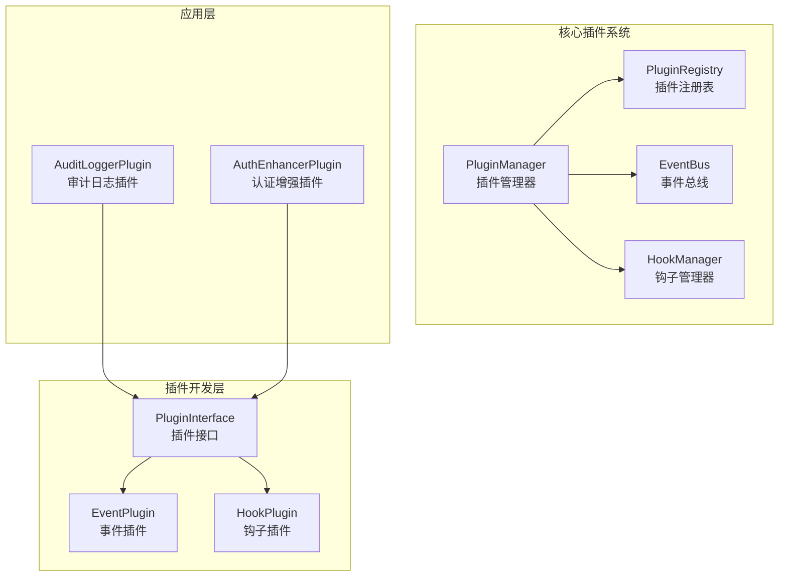
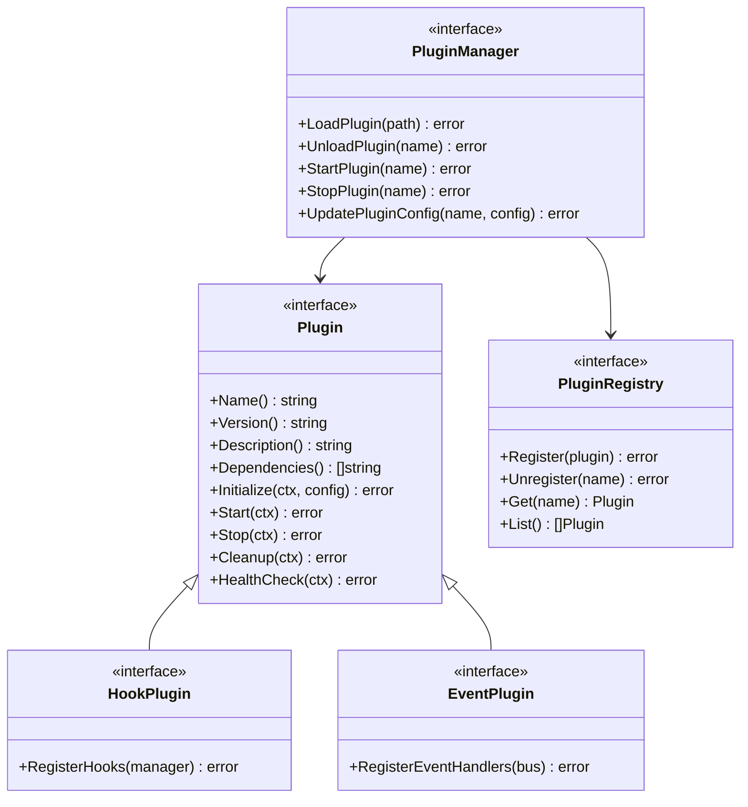
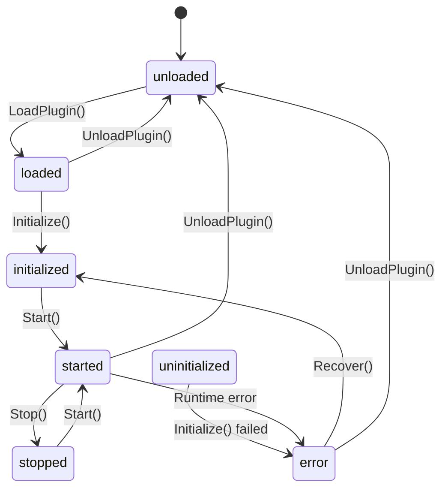
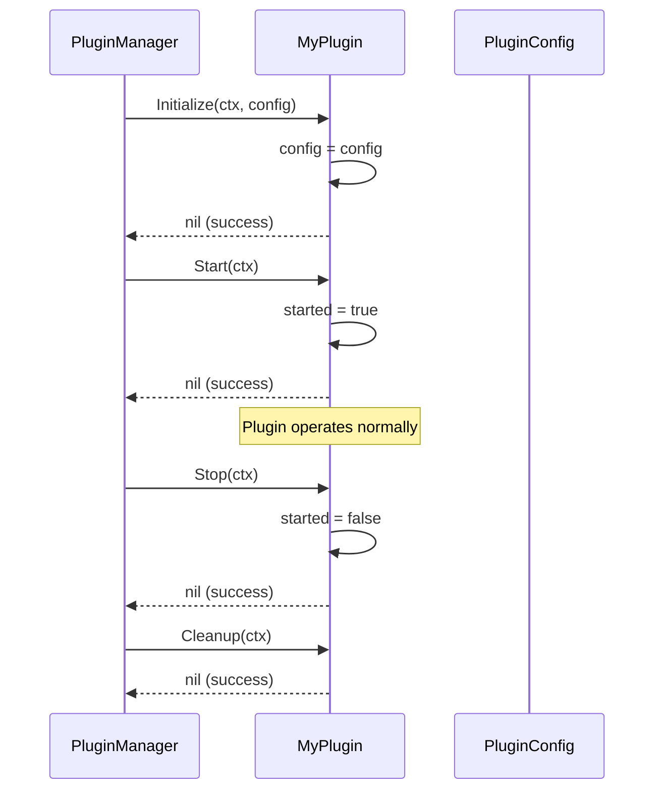
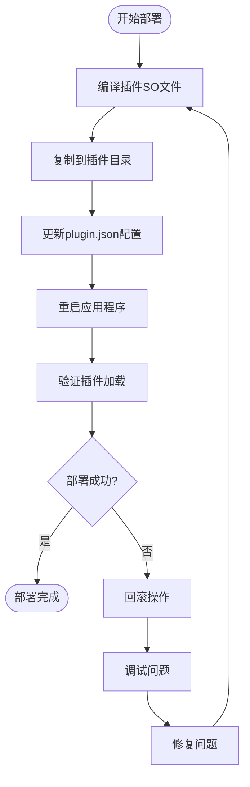

# 插件开发实战指南

<cite>
**本文档中引用的文件**
- [audit_logger.go](file://plugins/audit_logger.go)
- [interfaces.go](file://internal/pkg/plugin/interfaces.go)
- [types.go](file://internal/pkg/plugin/types.go)
- [event.go](file://internal/pkg/plugin/event.go)
- [hook.go](file://internal/pkg/plugin/hook.go)
- [mock_repository.go](file://internal/pkg/kms/mock_repository.go)
- [auth_bdd_test.go](file://test/bdd/auth/auth_bdd_test.go)
- [Makefile](file://Makefile)
</cite>

## 目录
1. [简介](#简介)
2. [项目架构概览](#项目架构概览)
3. [插件系统核心组件](#插件系统核心组件)
4. [插件开发基础](#插件开发基础)
5. [插件结构体定义](#插件结构体定义)
6. [Plugin接口实现](#plugin接口实现)
7. [事件监听器注册](#事件监听器注册)
8. [钩子函数注册](#钩子函数注册)
9. [配置文件管理](#配置文件管理)
10. [单元测试策略](#单元测试策略)
11. [BDD测试验证](#bdd测试验证)
12. [编译与部署](#编译与部署)
13. [最佳实践](#最佳实践)
14. [故障排除](#故障排除)

## 简介

本指南基于Kratos框架的插件系统架构，提供了一套完整的插件开发实战方案。通过分析audit_logger.go插件模板，我们将深入探讨如何创建、配置、测试和部署功能插件。

插件系统采用模块化设计，支持事件驱动和钩子机制，允许开发者在不修改核心代码的情况下扩展系统功能。该系统提供了完整的生命周期管理、配置管理和错误处理机制。

## 项目架构概览



**图表来源**
- [interfaces.go](file://internal/pkg/plugin/interfaces.go#L1-L70)
- [types.go](file://internal/pkg/plugin/types.go#L1-L96)

**章节来源**
- [interfaces.go](file://internal/pkg/plugin/interfaces.go#L1-L70)
- [types.go](file://internal/pkg/plugin/types.go#L1-L96)

## 插件系统核心组件

### 插件接口体系

插件系统基于清晰的接口层次结构设计：



**图表来源**
- [interfaces.go](file://internal/pkg/plugin/interfaces.go#L8-L69)

### 插件状态管理

插件具有明确的状态生命周期：



**章节来源**
- [interfaces.go](file://internal/pkg/plugin/interfaces.go#L1-L70)
- [types.go](file://internal/pkg/plugin/types.go#L8-L15)

## 插件开发基础

### 开发环境准备

1. **Go环境配置**：确保Go版本符合项目要求
2. **插件构建标签**：使用`//go:build plugin`标签标识插件代码
3. **依赖管理**：正确导入插件包路径

### 基础插件结构

每个插件都必须遵循以下基本结构：

```go
//go:build plugin

package main

import (
    "context"
    "fmt"
    "time"
    
    "kratos-boilerplate/internal/pkg/plugin"
)

type MyPlugin struct {
    name    string
    config  plugin.PluginConfig
    started bool
}

func NewMyPlugin() *MyPlugin {
    return &MyPlugin{
        name: "my_plugin",
    }
}
```

**章节来源**
- [audit_logger.go](file://plugins/audit_logger.go#L1-L15)

## 插件结构体定义

### 核心字段设计

插件结构体应包含以下关键字段：

```go
type MyPlugin struct {
    name    string              // 插件唯一标识符
    config  plugin.PluginConfig // 插件配置
    started bool                // 启动状态标志
    // 其他自定义字段
}
```

### 构造函数实现

```go
func NewMyPlugin() *MyPlugin {
    return &MyPlugin{
        name: "my_plugin",
    }
}
```

### 元数据方法

```go
func (p *MyPlugin) Name() string {
    return p.name
}

func (p *MyPlugin) Version() string {
    return "1.0.0"
}

func (p *MyPlugin) Description() string {
    return "My custom plugin for extending system functionality"
}

func (p *MyPlugin) Dependencies() []string {
    return []string{"required_plugin_v1"}
}
```

**章节来源**
- [audit_logger.go](file://plugins/audit_logger.go#L16-L35)
- [types.go](file://internal/pkg/plugin/types.go#L20-L35)

## Plugin接口实现

### 生命周期方法

插件必须实现完整的生命周期管理：



**图表来源**
- [audit_logger.go](file://plugins/audit_logger.go#L37-L65)

### 初始化方法

```go
func (p *MyPlugin) Initialize(ctx context.Context, config plugin.PluginConfig) error {
    p.config = config
    fmt.Printf("MyPlugin initialized with config: %+v\n", config)
    return nil
}
```

### 启动和停止方法

```go
func (p *MyPlugin) Start(ctx context.Context) error {
    p.started = true
    fmt.Println("MyPlugin started")
    return nil
}

func (p *MyPlugin) Stop(ctx context.Context) error {
    p.started = false
    fmt.Println("MyPlugin stopped")
    return nil
}
```

### 健康检查

```go
func (p *MyPlugin) HealthCheck(ctx context.Context) error {
    if !p.started {
        return fmt.Errorf("plugin not started")
    }
    return nil
}
```

**章节来源**
- [audit_logger.go](file://plugins/audit_logger.go#L37-L65)

## 事件监听器注册

### 事件系统架构

```mermaid
classDiagram
class EventBus {
<<interface>>
+Subscribe(eventType, handler) error
+Unsubscribe(eventType, handlerName) error
+Publish(ctx, event) error
+PublishAsync(ctx, event) error
}
class Event {
<<interface>>
+GetID() string
+GetType() EventType
+GetData() map[string]interface{}
+GetMetadata() map[string]string
}
class EventHandler {
<<interface>>
+GetName() string
+GetEventTypes() []EventType
+Handle(ctx, event) error
+GetTimeout() time.Duration
}
class BaseEventHandler {
+name string
+events []EventType
+timeout time.Duration
+handlerFunc func(ctx, event) error
+Handle(ctx, event) error
}
EventBus --> Event
EventBus --> EventHandler
EventHandler <|-- BaseEventHandler
```

**图表来源**
- [event.go](file://internal/pkg/plugin/event.go#L35-L81)

### 事件处理器实现

```go
func (p *MyPlugin) RegisterEventHandlers(bus plugin.EventBus) error {
    events := []plugin.EventType{
        plugin.EventUserLogin,
        plugin.EventUserLogout,
        plugin.EventDataCreated,
        plugin.EventDataUpdated,
        plugin.EventDataDeleted,
    }

    eventHandler := plugin.NewBaseEventHandler(
        "my_plugin_event_handler",
        events,
        15*time.Second,
        func(ctx context.Context, event plugin.Event) error {
            fmt.Printf("MyPlugin: Event %s received: %+v\n", event.GetType(), event.GetData())
            // 实现事件处理逻辑
            return nil
        },
    )

    for _, eventType := range events {
        if err := bus.Subscribe(eventType, eventHandler); err != nil {
            return err
        }
    }
    
    return nil
}
```

### 预定义事件类型

系统预定义了丰富的事件类型：

- **插件生命周期事件**：`plugin.loaded`, `plugin.unloaded`, `plugin.started`, `plugin.stopped`
- **系统事件**：`system.startup`, `system.shutdown`, `config.changed`
- **业务事件**：`user.login`, `user.logout`, `data.created`, `data.updated`, `data.deleted`

**章节来源**
- [audit_logger.go](file://plugins/audit_logger.go#L85-L110)
- [event.go](file://internal/pkg/plugin/event.go#L12-L28)

## 钩子函数注册

### 钩子系统架构

```mermaid
classDiagram
class HookManager {
<<interface>>
+RegisterHook(point, hook) error
+UnregisterHook(point, hookName) error
+ExecuteHooks(ctx, point, data) error
+ListHooks(point) []Hook
}
class Hook {
<<interface>>
+GetName() string
+GetPriority() int
+Execute(ctx, data) error
+GetTimeout() time.Duration
}
class HookData {
<<interface>>
+GetContext() context.Context
+GetData() map[string]interface{}
+SetData(key, value)
+GetMetadata() map[string]string
}
class BaseHook {
+name string
+priority int
+timeout time.Duration
+hookFunc func(ctx, data) error
+Execute(ctx, data) error
}
HookManager --> Hook
Hook --> HookData
Hook <|-- BaseHook
```

**图表来源**
- [hook.go](file://internal/pkg/plugin/hook.go#L45-L71)

### 钩子点类型

系统支持多种钩子点：

```go
const (
    // 请求处理钩子点
    HookPointBeforeRequest  HookPoint = "before_request"
    HookPointAfterRequest   HookPoint = "after_request"
    HookPointBeforeResponse HookPoint = "before_response"
    HookPointAfterResponse  HookPoint = "after_response"

    // 认证相关钩子点
    HookPointBeforeAuth HookPoint = "before_auth"
    HookPointAfterAuth  HookPoint = "after_auth"
    HookPointAuthFailed HookPoint = "auth_failed"

    // 业务逻辑钩子点
    HookPointBeforeBiz HookPoint = "before_biz"
    HookPointAfterBiz  HookPoint = "after_biz"
    HookPointBizError  HookPoint = "biz_error"

    // 数据访问钩子点
    HookPointBeforeData HookPoint = "before_data"
    HookPointAfterData  HookPoint = "after_data"
    HookPointDataError  HookPoint = "data_error"
)
```

### 钩子注册示例

```go
func (p *MyPlugin) RegisterHooks(manager plugin.HookManager) error {
    // 注册请求前置钩子
    requestHook := plugin.NewBaseHook(
        "my_plugin_pre_request",
        5, // 高优先级
        3*time.Second,
        func(ctx context.Context, data plugin.HookData) error {
            fmt.Println("MyPlugin: Pre-request hook executed")
            // 实现请求前处理逻辑
            return nil
        },
    )

    if err := manager.RegisterHook(plugin.HookPointBeforeRequest, requestHook); err != nil {
        return err
    }

    // 注册请求后置钩子
    responseHook := plugin.NewBaseHook(
        "my_plugin_post_request",
        15, // 较低优先级
        3*time.Second,
        func(ctx context.Context, data plugin.HookData) error {
            fmt.Println("MyPlugin: Post-request hook executed")
            // 实现请求后处理逻辑
            return nil
        },
    )

    return manager.RegisterHook(plugin.HookPointAfterRequest, responseHook)
}
```

**章节来源**
- [audit_logger.go](file://plugins/audit_logger.go#L67-L83)
- [hook.go](file://internal/pkg/plugin/hook.go#L12-L28)

## 配置文件管理

### plugin.json配置格式

插件配置文件采用JSON格式，支持以下字段：

```json
{
  "name": "my_plugin",
  "version": "1.0.0",
  "description": "My custom plugin",
  "author": "Developer Name",
  "license": "MIT",
  "homepage": "https://example.com",
  "dependencies": ["required_plugin_v1"],
  "tags": ["security", "logging"],
  "metadata": {
    "custom_key": "custom_value"
  },
  "enabled": true,
  "priority": 10,
  "settings": {
    "log_level": "info",
    "max_entries": 1000
  },
  "timeout": "30s",
  "retry_count": 3
}
```

### UpdatePluginConfig集成

插件配置可以通过管理器动态更新：

```go
// 更新插件配置
updatedConfig := plugin.PluginConfig{
    Enabled: true,
    Priority: 5,
    Settings: map[string]interface{}{
        "log_level": "debug",
        "max_entries": 5000,
    },
    Timeout: 60 * time.Second,
    RetryCount: 5,
}

err := pluginManager.UpdatePluginConfig("my_plugin", updatedConfig)
if err != nil {
    log.Printf("Failed to update plugin config: %v", err)
}
```

### 配置验证

插件应验证配置的有效性：

```go
func (p *MyPlugin) Initialize(ctx context.Context, config plugin.PluginConfig) error {
    // 验证必需配置
    if config.Settings == nil {
        return fmt.Errorf("missing required settings")
    }
    
    // 验证特定配置项
    if level, ok := config.Settings["log_level"].(string); ok {
        if level != "debug" && level != "info" && level != "warn" && level != "error" {
            return fmt.Errorf("invalid log_level: %s", level)
        }
    }
    
    p.config = config
    return nil
}
```

**章节来源**
- [types.go](file://internal/pkg/plugin/types.go#L45-L65)

## 单元测试策略

### MockRepository模式

基于audit_logger.go的设计理念，我们可以创建专门的MockRepository用于插件测试：

```go
// MockPluginRepo 模拟插件数据仓库
type MockPluginRepo struct {
    mu       sync.RWMutex
    plugins  map[string]*plugin.PluginInfo
    failures map[string]bool
}

func NewMockPluginRepo() *MockPluginRepo {
    return &MockPluginRepo{
        plugins:  make(map[string]*plugin.PluginInfo),
        failures: make(map[string]bool),
    }
}

// 实现PluginRepository接口方法
func (m *MockPluginRepo) SavePluginInfo(ctx context.Context, info *plugin.PluginInfo) error {
    m.mu.Lock()
    defer m.mu.Unlock()
    
    if m.failures["save"] {
        return fmt.Errorf("mock save failure")
    }
    
    m.plugins[info.Metadata.Name] = info
    return nil
}

func (m *MockPluginRepo) GetPluginInfo(ctx context.Context, name string) (*plugin.PluginInfo, error) {
    m.mu.RLock()
    defer m.mu.RUnlock()
    
    info, exists := m.plugins[name]
    if !exists {
        return nil, plugin.ErrPluginNotFound
    }
    
    return info, nil
}
```

### 测试用例结构

```go
func TestMyPlugin_Lifecycle(t *testing.T) {
    plugin := NewMyPlugin()
    
    // 测试初始化
    ctx := context.Background()
    config := plugin.PluginConfig{
        Enabled: true,
        Priority: 10,
        Settings: map[string]interface{}{
            "test_mode": true,
        },
    }
    
    err := plugin.Initialize(ctx, config)
    assert.NoError(t, err)
    assert.Equal(t, config, plugin.config)
    
    // 测试启动
    err = plugin.Start(ctx)
    assert.NoError(t, err)
    assert.True(t, plugin.started)
    
    // 测试健康检查
    err = plugin.HealthCheck(ctx)
    assert.NoError(t, err)
    
    // 测试停止
    err = plugin.Stop(ctx)
    assert.NoError(t, err)
    assert.False(t, plugin.started)
}
```

**章节来源**
- [mock_repository.go](file://internal/pkg/kms/mock_repository.go#L1-L50)

## BDD测试验证

### 行为驱动测试框架

基于audit_logger.go的BDD测试模式，我们可以创建完整的插件行为测试：

```go
var _ = Describe("MyPlugin", func() {
    var (
        myPlugin *MyPlugin
        testSuite *shared.TestSuite
        mocks     *shared.MockRepositories
        ctx       context.Context
    )

    BeforeEach(func() {
        myPlugin = NewMyPlugin()
        testSuite = shared.BeforeEachSetup()
        mocks = testSuite.SetupWithMocks()
        ctx = testSuite.Ctx
        
        // 初始化插件
        config := plugin.PluginConfig{
            Enabled: true,
            Priority: 10,
            Settings: map[string]interface{}{
                "log_level": "debug",
            },
        }
        
        err := myPlugin.Initialize(ctx, config)
        Expect(err).NotTo(HaveOccurred())
    })

    AfterEach(func() {
        shared.AfterEachTeardown(testSuite)
    })

    Describe("插件生命周期", func() {
        It("应该能够正常启动和停止", func() {
            err := myPlugin.Start(ctx)
            Expect(err).NotTo(HaveOccurred())
            Expect(myPlugin.started).To(BeTrue())
            
            err = myPlugin.Stop(ctx)
            Expect(err).NotTo(HaveOccurred())
            Expect(myPlugin.started).To(BeFalse())
        })
    })

    Describe("事件处理", func() {
        It("应该能够处理用户登录事件", func() {
            // 准备事件数据
            eventData := map[string]interface{}{
                "username": "testuser",
                "timestamp": time.Now(),
            }
            
            event := &mockEvent{
                eventType: plugin.EventUserLogin,
                data:      eventData,
            }
            
            // 设置Mock期望
            mocks.Logger.On("Info", "MyPlugin: Event user.login received", 
                "username", "testuser").Return(nil)
            
            // 执行事件处理
            err := myPlugin.Handle(ctx, event)
            Expect(err).NotTo(HaveOccurred())
            
            // 验证Mock调用
            mocks.Logger.AssertExpectations(GinkgoT())
        })
    })
})
```

### 测试数据准备

```go
// mockEvent 实现Event接口用于测试
type mockEvent struct {
    eventType plugin.EventType
    data      map[string]interface{}
    metadata  map[string]string
}

func (m *mockEvent) GetID() string {
    return "test-event-id"
}

func (m *mockEvent) GetType() plugin.EventType {
    return m.eventType
}

func (m *mockEvent) GetData() map[string]interface{} {
    return m.data
}

func (m *mockEvent) GetMetadata() map[string]string {
    return m.metadata
}
```

**章节来源**
- [auth_bdd_test.go](file://test/bdd/auth/auth_bdd_test.go#L1-L50)

## 编译与部署

### Makefile配置

基于项目现有的Makefile，我们可以添加插件编译目标：

```makefile
.PHONY: build-plugin
# 编译插件SO文件
build-plugin:
	mkdir -p plugins/bin/
	go build -buildmode=plugin -o plugins/bin/my_plugin.so ./plugins/my_plugin.go

.PHONY: build-plugins
# 批量编译所有插件
build-plugins:
	find plugins -name "*.go" -not -name "*_test.go" | while read plugin; do \
	    plugin_name=$$(basename "$$plugin" .go); \
	    echo "Building $$plugin_name..."; \
	    go build -buildmode=plugin -o plugins/bin/$$plugin_name.so "$$plugin"; \
	done

.PHONY: test-plugin
# 运行插件测试
test-plugin:
	go test -v ./plugins/...

.PHONY: clean-plugins
# 清理插件编译文件
clean-plugins:
	rm -rf plugins/bin/
```

### 版本兼容性

确保插件与主程序版本兼容：

```go
//go:build plugin

package main

import (
    "fmt"
    "runtime"
    
    "kratos-boilerplate/internal/pkg/plugin"
)

// 检查版本兼容性
func checkCompatibility() error {
    kratosVersion := runtime.Version()
    pluginVersion := "1.0.0"
    
    fmt.Printf("Kratos version: %s\n", kratosVersion)
    fmt.Printf("Plugin version: %s\n", pluginVersion)
    
    // 实现版本检查逻辑
    return nil
}

func main() {
    if err := checkCompatibility(); err != nil {
        fmt.Printf("Version compatibility check failed: %v\n", err)
        return
    }
    
    // 注册插件实例
    var MyPluginInstance = NewMyPlugin()
}
```

### 插件部署流程



**章节来源**
- [Makefile](file://Makefile#L1-L151)

## 最佳实践

### 命名规范

1. **插件名称**：使用小写字母和下划线，如`audit_logger`
2. **变量命名**：使用驼峰命名法，如`pluginInstance`
3. **常量命名**：使用大写字母和下划线，如`PLUGIN_VERSION`
4. **包命名**：保持简洁，如`mypkg`

### 日志输出标准

```go
import (
    "go.uber.org/zap"
    "go.uber.org/zap/zapcore"
)

type MyPlugin struct {
    logger *zap.Logger
    // ...
}

func NewMyPlugin() *MyPlugin {
    logger, _ := zap.NewProduction()
    return &MyPlugin{
        logger: logger.With(
            zap.String("plugin", "my_plugin"),
            zap.String("version", "1.0.0"),
        ),
    }
}

func (p *MyPlugin) LogInfo(msg string, fields ...zap.Field) {
    p.logger.Info(msg, fields...)
}

func (p *MyPlugin) LogError(msg string, err error, fields ...zap.Field) {
    p.logger.Error(msg, append(fields, zap.Error(err))...)
}
```

### 错误码定义

```go
const (
    ErrCodePluginNotFound     = "PLUGIN_NOT_FOUND"
    ErrCodePluginAlreadyExist = "PLUGIN_ALREADY_EXIST"
    ErrCodePluginLoadFailed   = "PLUGIN_LOAD_FAILED"
    ErrCodePluginStartFailed  = "PLUGIN_START_FAILED"
    ErrCodePluginStopFailed   = "PLUGIN_STOP_FAILED"
    ErrCodePluginConfigError  = "PLUGIN_CONFIG_ERROR"
    ErrCodePluginTimeout      = "PLUGIN_TIMEOUT"
    ErrCodePluginDependency   = "PLUGIN_DEPENDENCY_ERROR"
    ErrCodePluginPermission   = "PLUGIN_PERMISSION_ERROR"
    ErrCodePluginInternal     = "PLUGIN_INTERNAL_ERROR"
)

func NewPluginError(code, message, plugin string, cause error) *plugin.PluginError {
    return &plugin.PluginError{
        Code:    code,
        Message: message,
        Plugin:  plugin,
        Cause:   cause,
    }
}
```

### 性能优化建议

1. **异步处理**：对于耗时操作使用goroutine
2. **缓存机制**：合理使用内存缓存减少重复计算
3. **连接池**：数据库和网络连接使用连接池
4. **资源清理**：及时释放不再使用的资源

### 安全考虑

1. **输入验证**：严格验证所有外部输入
2. **权限控制**：最小权限原则
3. **敏感信息**：避免在日志中记录敏感信息
4. **依赖管理**：定期更新第三方依赖

## 故障排除

### 常见问题诊断

```go
// 插件诊断工具
func diagnosePlugin(pluginName string) error {
    fmt.Printf("=== Diagnosing %s ===\n", pluginName)
    
    // 检查插件是否存在
    if !pluginExists(pluginName) {
        return fmt.Errorf("plugin %s not found", pluginName)
    }
    
    // 检查插件状态
    status, err := getPluginStatus(pluginName)
    if err != nil {
        return fmt.Errorf("failed to get plugin status: %w", err)
    }
    
    fmt.Printf("Plugin status: %s\n", status)
    
    // 检查依赖关系
    deps, err := getPluginDependencies(pluginName)
    if err != nil {
        return fmt.Errorf("failed to get dependencies: %w", err)
    }
    
    fmt.Printf("Dependencies: %v\n", deps)
    
    // 检查配置
    config, err := getPluginConfig(pluginName)
    if err != nil {
        return fmt.Errorf("failed to get config: %w", err)
    }
    
    fmt.Printf("Config: %+v\n", config)
    
    return nil
}
```

### 调试技巧

1. **启用详细日志**：设置日志级别为DEBUG
2. **使用pprof**：性能分析和内存泄漏检测
3. **单元测试覆盖**：确保高覆盖率的测试
4. **集成测试**：验证插件与系统的交互

### 监控和告警

```go
// 插件监控指标
type PluginMetrics struct {
    ExecutionCount    int64
    ExecutionTime     time.Duration
    ErrorCount        int64
    LastExecutionTime time.Time
}

func (p *MyPlugin) RecordMetric(operation string, duration time.Duration, err error) {
    p.metrics.ExecutionCount++
    p.metrics.ExecutionTime += duration
    
    if err != nil {
        p.metrics.ErrorCount++
        p.LogError("Plugin operation failed", err,
            zap.String("operation", operation),
            zap.Duration("duration", duration))
    }
    
    p.metrics.LastExecutionTime = time.Now()
}
```

通过遵循本指南的实践，开发者可以创建高质量、可维护且功能强大的插件，充分利用Kratos框架的插件系统优势。记住始终关注安全性、性能和可维护性，确保插件能够在生产环境中稳定运行。