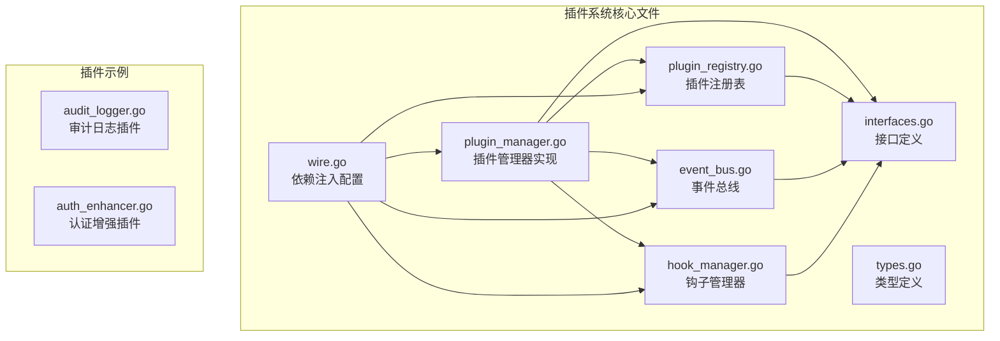
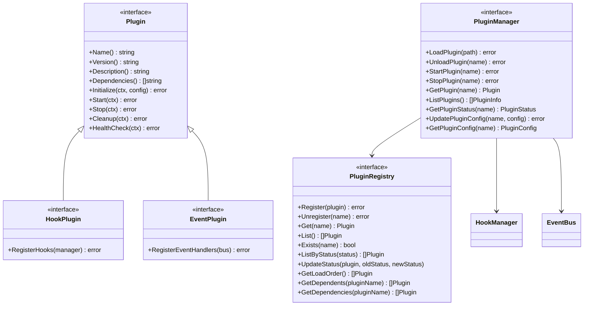
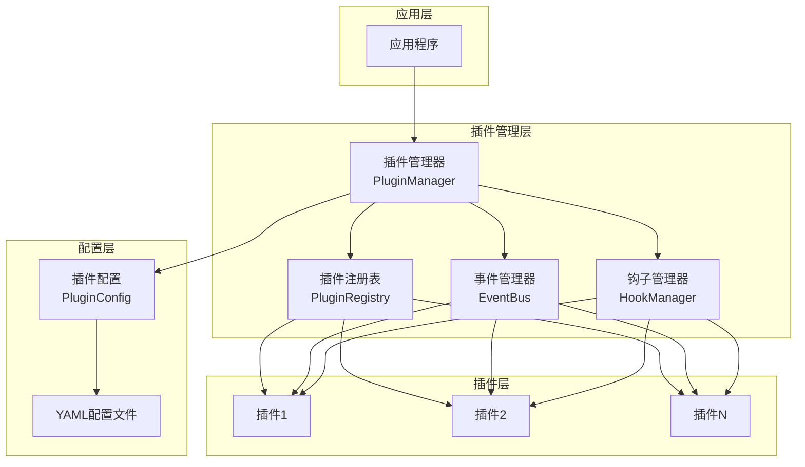
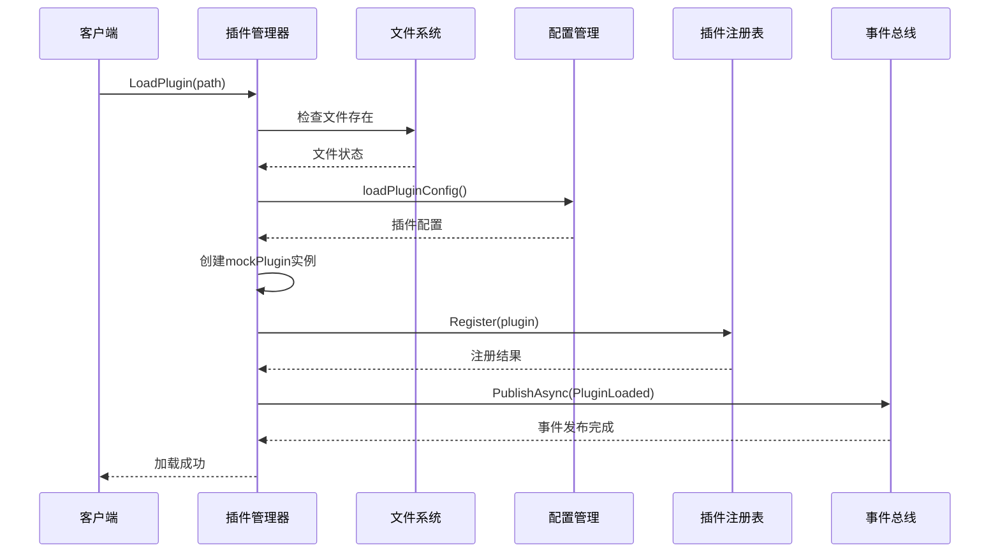
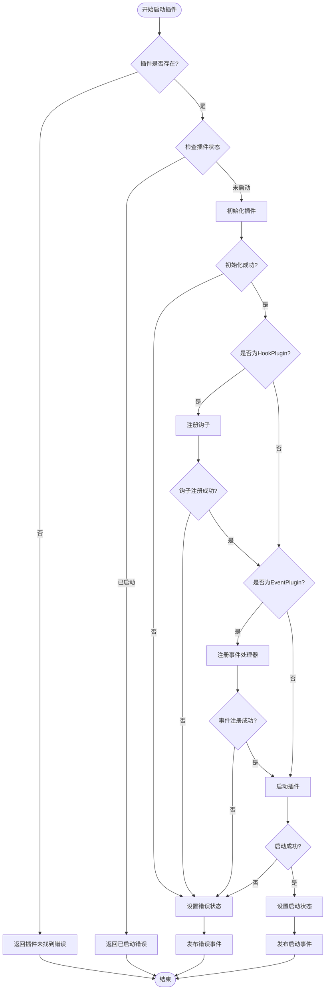
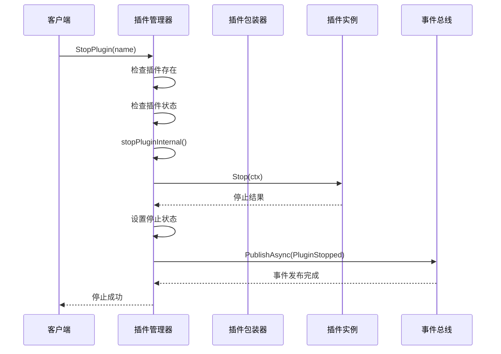
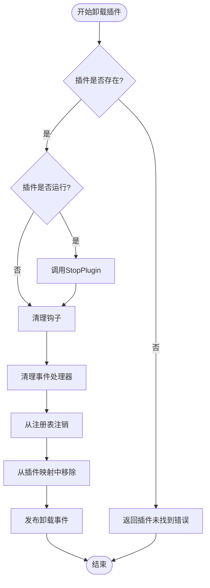
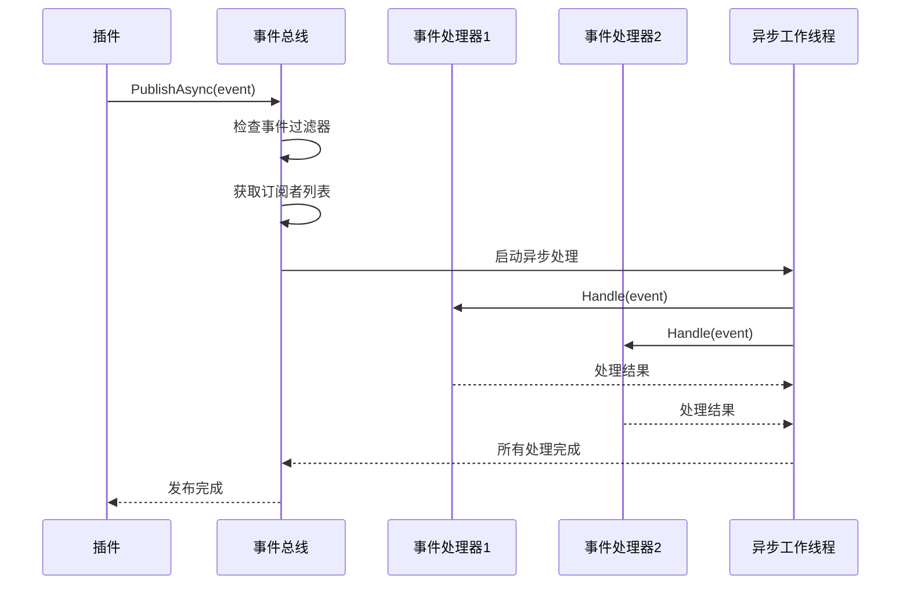
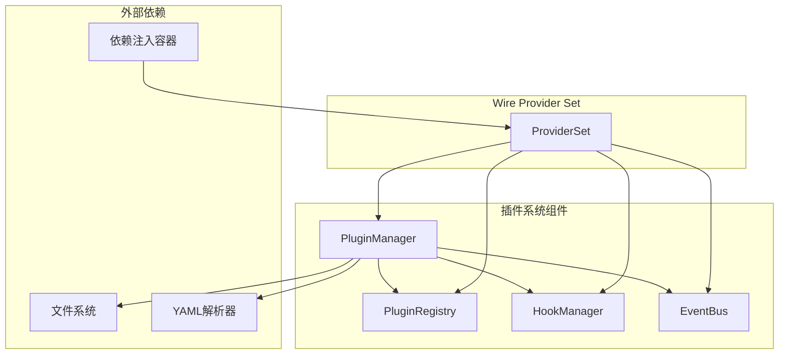
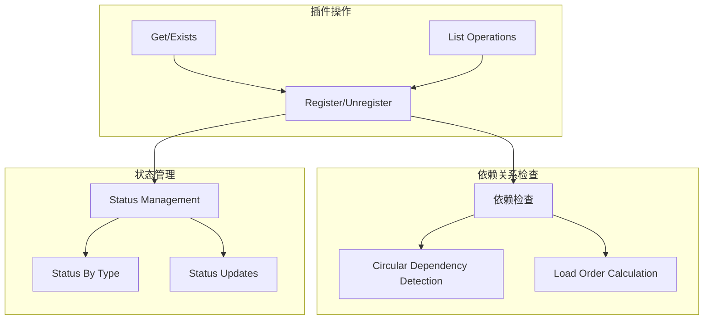

# 插件管理器设计与实现

<cite>
**本文档引用的文件**
- [plugin_manager.go](file://internal/pkg/plugin/plugin_manager.go)
- [interfaces.go](file://internal/pkg/plugin/interfaces.go)
- [types.go](file://internal/pkg/plugin/types.go)
- [plugin_registry.go](file://internal/pkg/plugin/plugin_registry.go)
- [event_bus.go](file://internal/pkg/plugin/event_bus.go)
- [hook_manager.go](file://internal/pkg/plugin/hook_manager.go)
- [wire.go](file://internal/pkg/plugin/wire.go)
- [event.go](file://internal/pkg/plugin/event.go)
- [audit_logger.go](file://plugins/audit_logger.go)
- [auth_enhancer.go](file://plugins/auth_enhancer.go)
</cite>

## 目录
1. [简介](#简介)
2. [项目结构](#项目结构)
3. [核心组件](#核心组件)
4. [架构概览](#架构概览)
5. [详细组件分析](#详细组件分析)
6. [依赖关系分析](#依赖关系分析)
7. [性能考虑](#性能考虑)
8. [故障排除指南](#故障排除指南)
9. [结论](#结论)

## 简介

插件管理器（PluginManager）是Kratos框架中负责插件生命周期管理的核心组件。它提供了完整的插件动态加载、启动、停止和卸载功能，并通过wire依赖注入机制实现服务注册。插件管理器采用模块化设计，支持插件配置热更新、事件驱动架构和钩子机制，为应用程序提供了强大的扩展能力。

## 项目结构

插件管理系统位于`internal/pkg/plugin`目录下，包含以下核心文件：



**图表来源**
- [plugin_manager.go](file://internal/pkg/plugin/plugin_manager.go#L1-L442)
- [interfaces.go](file://internal/pkg/plugin/interfaces.go#L1-L70)
- [types.go](file://internal/pkg/plugin/types.go#L1-L96)

**章节来源**
- [plugin_manager.go](file://internal/pkg/plugin/plugin_manager.go#L1-L50)
- [interfaces.go](file://internal/pkg/plugin/interfaces.go#L1-L70)

## 核心组件

### 插件管理器（PluginManager）

插件管理器是整个插件系统的核心控制器，负责协调插件的完整生命周期管理：

```go
type pluginManagerImpl struct {
    mu              sync.RWMutex
    plugins         map[string]*pluginWrapper
    registry        PluginRegistry
    hookManager     HookManager
    eventBus        EventBus
    configDir       string
    pluginDir       string
    autoLoadEnabled bool
}
```

### 插件包装器（PluginWrapper）

每个插件都被包装在一个wrapper中，包含插件实例、元信息和配置：

```go
type pluginWrapper struct {
    plugin      Plugin
    info        PluginInfo
    config      PluginConfig
    hooks       []Hook
    eventHandlers []EventHandler
}
```

### 插件接口体系

插件系统定义了完整的接口体系：



**图表来源**
- [interfaces.go](file://internal/pkg/plugin/interfaces.go#L8-L68)
- [plugin_manager.go](file://internal/pkg/plugin/plugin_manager.go#L13-L22)

**章节来源**
- [plugin_manager.go](file://internal/pkg/plugin/plugin_manager.go#L13-L22)
- [interfaces.go](file://internal/pkg/plugin/interfaces.go#L8-L68)

## 架构概览

插件管理系统采用分层架构设计，通过事件驱动和钩子机制实现松耦合的插件交互：



**图表来源**
- [plugin_manager.go](file://internal/pkg/plugin/plugin_manager.go#L13-L22)
- [plugin_registry.go](file://internal/pkg/plugin/plugin_registry.go#L8-L15)

## 详细组件分析

### 插件生命周期管理

#### LoadPlugin - 插件加载

插件加载过程包括文件检查、配置加载、插件实例创建和注册：



**图表来源**
- [plugin_manager.go](file://internal/pkg/plugin/plugin_manager.go#L44-L85)

#### StartPlugin - 插件启动

插件启动涉及初始化、钩子注册、事件处理器注册和实际启动：



**图表来源**
- [plugin_manager.go](file://internal/pkg/plugin/plugin_manager.go#L164-L225)

#### StopPlugin - 插件停止

插件停止过程确保安全地关闭插件并清理资源：



**图表来源**
- [plugin_manager.go](file://internal/pkg/plugin/plugin_manager.go#L227-L252)

#### UnloadPlugin - 插件卸载

插件卸载是最复杂的操作，需要清理所有相关资源：



**图表来源**
- [plugin_manager.go](file://internal/pkg/plugin/plugin_manager.go#L87-L162)

### 插件状态管理

插件状态枚举定义了插件的完整生命周期状态：

```go
type PluginStatus string

const (
    PluginStatusUnloaded    PluginStatus = "unloaded"    // 未加载
    PluginStatusLoaded      PluginStatus = "loaded"      // 已加载
    PluginStatusInitialized PluginStatus = "initialized" // 已初始化
    PluginStatusStarted     PluginStatus = "started"     // 已启动
    PluginStatusStopped     PluginStatus = "stopped"     // 已停止
    PluginStatusError       PluginStatus = "error"       // 错误状态
)
```

### 插件配置管理

插件配置支持热更新，通过YAML文件存储：

```mermaid
classDiagram
class PluginConfig {
+bool Enabled
+int Priority
+map[string]interface{} Settings
+time.Duration Timeout
+int RetryCount
+map[string]string Metadata
}
class PluginManager {
+UpdatePluginConfig(name, config) error
+GetPluginConfig(name) PluginConfig
-loadPluginConfig(pluginName) PluginConfig
-savePluginConfig(pluginName, config) error
}
PluginManager --> PluginConfig : manages
```

**图表来源**
- [types.go](file://internal/pkg/plugin/types.go#L47-L56)
- [plugin_manager.go](file://internal/pkg/plugin/plugin_manager.go#L314-L350)

### 事件驱动架构

事件总线实现了异步事件处理机制：



**图表来源**
- [event_bus.go](file://internal/pkg/plugin/event_bus.go#L60-L100)

### 钩子机制

钩子管理器提供了灵活的插件扩展点：

```mermaid
classDiagram
class HookManager {
+RegisterHook(point, hook) error
+UnregisterHook(point, hookName) error
+ExecuteHooks(ctx, point, data) error
+ListHooks(point) []Hook
+GetHook(point, hookName) Hook
}
class Hook {
<<interface>>
+GetName() string
+GetPriority() int
+GetTimeout() time.Duration
+Execute(ctx, data) error
}
class HookData {
+GetContext() context.Context
+GetData() map[string]interface{}
+SetData(key, value)
+GetMetadata() map[string]string
}
HookManager --> Hook : manages
Hook --> HookData : uses
```

**图表来源**
- [hook_manager.go](file://internal/pkg/plugin/hook_manager.go#L15-L25)
- [interfaces.go](file://internal/pkg/plugin/interfaces.go#L25-L35)

**章节来源**
- [plugin_manager.go](file://internal/pkg/plugin/plugin_manager.go#L44-L252)
- [types.go](file://internal/pkg/plugin/types.go#L8-L56)
- [event_bus.go](file://internal/pkg/plugin/event_bus.go#L60-L100)
- [hook_manager.go](file://internal/pkg/plugin/hook_manager.go#L15-L25)

## 依赖关系分析

插件管理系统通过wire依赖注入实现松耦合设计：



**图表来源**
- [wire.go](file://internal/pkg/plugin/wire.go#L5-L14)

### 依赖注入配置

```go
var ProviderSet = wire.NewSet(
    NewPluginManager,
    NewPluginRegistry,
    NewHookManager,
    NewEventBus,
    wire.Bind(new(PluginManager), new(*pluginManagerImpl)),
    wire.Bind(new(PluginRegistry), new(*pluginRegistryImpl)),
    wire.Bind(new(HookManager), new(*hookManagerImpl)),
    wire.Bind(new(EventBus), new(*eventBusImpl)),
)
```

### 插件注册表依赖分析

插件注册表支持复杂的依赖关系管理：



**图表来源**
- [plugin_registry.go](file://internal/pkg/plugin/plugin_registry.go#L179-L240)

**章节来源**
- [wire.go](file://internal/pkg/plugin/wire.go#L5-L14)
- [plugin_registry.go](file://internal/pkg/plugin/plugin_registry.go#L179-L240)

## 性能考虑

### 并发控制

插件管理器使用读写锁确保并发安全：

```go
type pluginManagerImpl struct {
    mu      sync.RWMutex  // 读写锁保护插件映射
    plugins map[string]*pluginWrapper
    // ...
}
```

### 异步事件处理

事件总线支持异步处理以提高性能：

```go
func (eb *eventBusImpl) PublishAsync(ctx context.Context, event Event) error {
    return eb.publish(ctx, event, true)  // 异步模式
}
```

### 超时控制

钩子执行支持超时控制防止阻塞：

```go
hookCtx, cancel := context.WithTimeout(ctx, timeout)
defer cancel()
```

### 内存优化

插件包装器设计避免不必要的内存分配，事件处理器使用池化技术减少GC压力。

## 故障排除指南

### 常见错误类型

插件系统定义了完整的错误处理机制：

```go
const (
    ErrCodePluginNotFound     = "PLUGIN_NOT_FOUND"
    ErrCodePluginAlreadyExist = "PLUGIN_ALREADY_EXIST"
    ErrCodePluginLoadFailed   = "PLUGIN_LOAD_FAILED"
    ErrCodePluginStartFailed  = "PLUGIN_START_FAILED"
    ErrCodePluginStopFailed   = "PLUGIN_STOP_FAILED"
    ErrCodePluginConfigError  = "PLUGIN_CONFIG_ERROR"
    ErrCodePluginTimeout      = "PLUGIN_TIMEOUT"
    ErrCodePluginDependency   = "PLUGIN_DEPENDENCY_ERROR"
    ErrCodePluginPermission   = "PLUGIN_PERMISSION_ERROR"
    ErrCodePluginInternal     = "PLUGIN_INTERNAL_ERROR"
)
```

### 插件加载失败诊断

1. **文件不存在**：检查插件文件路径和权限
2. **配置错误**：验证YAML配置格式和必需字段
3. **依赖缺失**：检查插件依赖关系
4. **权限不足**：确认文件访问权限

### 符号未找到错误

当插件编译时出现符号未找到错误，通常是因为：
- 缺少必要的导入包
- 接口实现不完整
- 函数签名不匹配

### 依赖循环检测

插件注册表自动检测循环依赖并阻止加载：

```go
// 拓扑排序检测循环依赖
if len(result) != len(graph) {
    return nil, NewPluginError(ErrCodePluginDependency, "circular dependency detected", "", nil)
}
```

### 性能监控

建议监控以下指标：
- 插件加载时间
- 钩子执行延迟
- 事件处理队列长度
- 内存使用情况

**章节来源**
- [types.go](file://internal/pkg/plugin/types.go#L68-L85)
- [plugin_registry.go](file://internal/pkg/plugin/plugin_registry.go#L242-L248)

## 结论

插件管理器是一个设计精良的模块化系统，提供了完整的插件生命周期管理功能。其主要优势包括：

1. **模块化设计**：清晰的接口分离和职责划分
2. **事件驱动架构**：支持异步事件处理和松耦合通信
3. **钩子机制**：提供灵活的插件扩展点
4. **依赖注入**：通过wire实现松耦合和可测试性
5. **配置管理**：支持插件配置热更新
6. **错误处理**：完善的错误类型和诊断机制

该系统为Kratos框架提供了强大的扩展能力，使开发者能够轻松地添加新功能而无需修改核心代码。通过合理的抽象和设计模式，插件管理器既保持了灵活性，又确保了系统的稳定性和可维护性。

未来的改进方向可能包括：
- 插件签名验证机制
- 沙箱执行环境
- 动态插件重载
- 更丰富的监控和调试工具