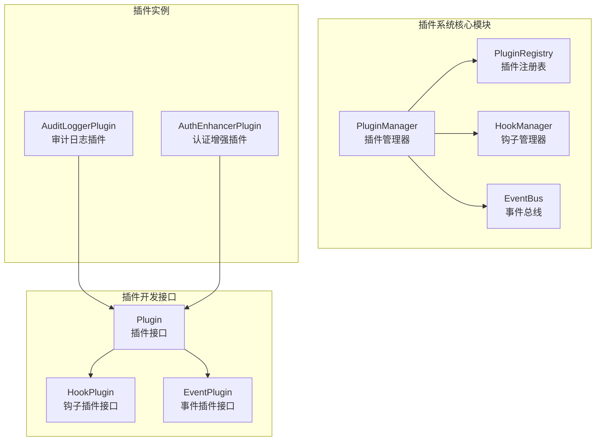
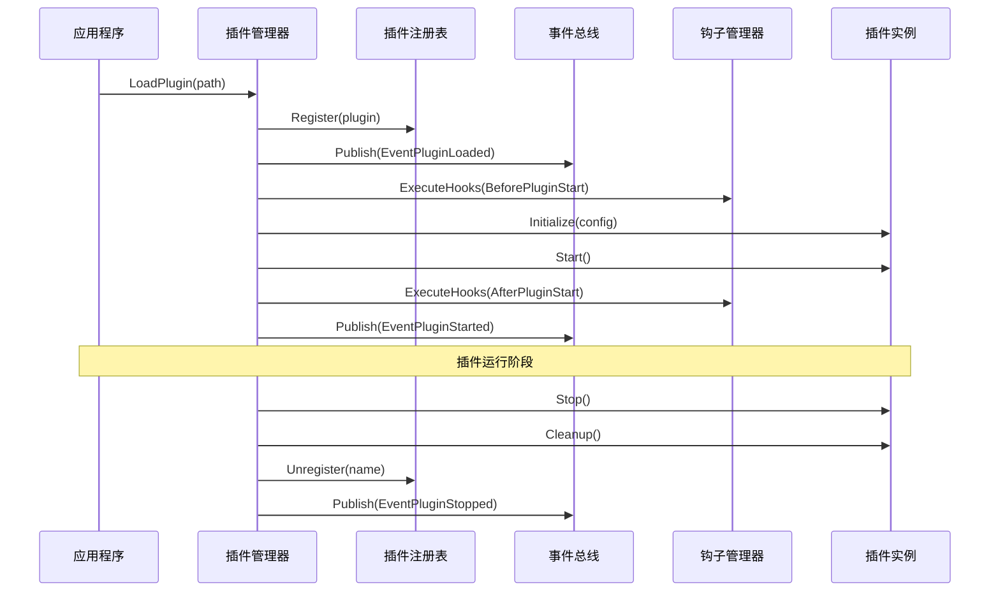
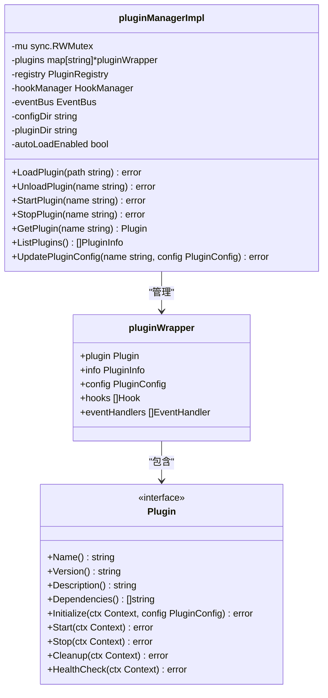
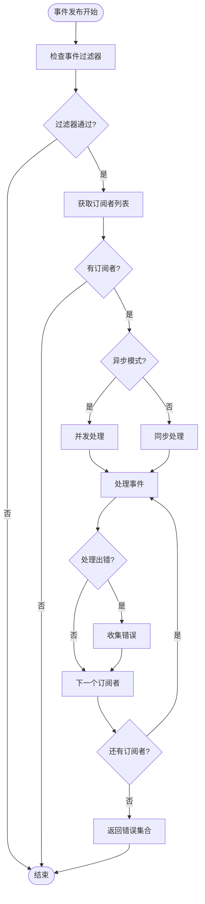
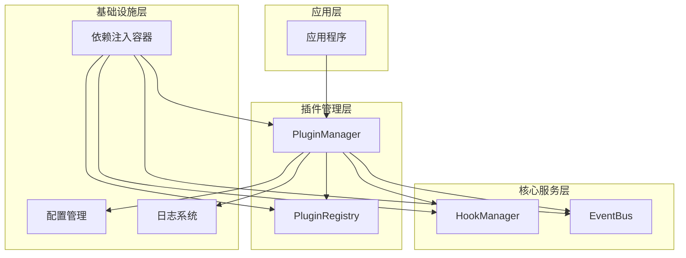

# 插件系统

<cite>
**本文档中引用的文件**
- [audit_logger.go](file://plugins/audit_logger.go)
- [interfaces.go](file://internal/pkg/plugin/interfaces.go)
- [plugin_manager.go](file://internal/pkg/plugin/plugin_manager.go)
- [event_bus.go](file://internal/pkg/plugin/event_bus.go)
- [hook_manager.go](file://internal/pkg/plugin/hook_manager.go)
- [types.go](file://internal/pkg/plugin/types.go)
- [wire.go](file://internal/pkg/plugin/wire.go)
- [plugin_registry.go](file://internal/pkg/plugin/plugin_registry.go)
- [event.go](file://internal/pkg/plugin/event.go)
- [hook.go](file://internal/pkg/plugin/hook.go)
- [main.go](file://cmd/kratos-boilerplate/main.go)
- [wire.go](file://cmd/kratos-boilerplate/wire.go)
</cite>

## 目录
1. [简介](#简介)
2. [项目结构](#项目结构)
3. [核心组件](#核心组件)
4. [架构概览](#架构概览)
5. [详细组件分析](#详细组件分析)
6. [插件开发指南](#插件开发指南)
7. [依赖关系分析](#依赖关系分析)
8. [性能考虑](#性能考虑)
9. [故障排除指南](#故障排除指南)
10. [结论](#结论)

## 简介

本项目采用了一套完整的可插拔插件架构设计，支持运行时功能扩展而无需修改核心代码。该插件系统提供了三个核心机制：

1. **插件管理器（PluginManager）**：负责插件的加载、注册和激活
2. **事件总线（EventBus）**：实现发布/订阅模式，使插件能够监听特定事件
3. **钩子机制（HookManager）**：在关键执行点插入插件行为

这种设计允许开发者通过编写插件来扩展系统功能，同时保持核心系统的稳定性和可维护性。

## 项目结构

插件系统的核心文件组织如下：



**图表来源**
- [plugin_manager.go](file://internal/pkg/plugin/plugin_manager.go#L1-L50)
- [interfaces.go](file://internal/pkg/plugin/interfaces.go#L1-L70)

**章节来源**
- [plugin_manager.go](file://internal/pkg/plugin/plugin_manager.go#L1-L100)
- [interfaces.go](file://internal/pkg/plugin/interfaces.go#L1-L70)

## 核心组件

### 插件管理器（PluginManager）

插件管理器是整个插件系统的核心控制器，负责插件的全生命周期管理：

```go
type PluginManager interface {
    // 插件生命周期管理
    LoadPlugin(path string) error
    UnloadPlugin(name string) error
    StartPlugin(name string) error
    StopPlugin(name string) error

    // 插件查询
    GetPlugin(name string) (Plugin, error)
    ListPlugins() []PluginInfo
    GetPluginStatus(name string) (PluginStatus, error)

    // 配置管理
    UpdatePluginConfig(name string, config PluginConfig) error
    GetPluginConfig(name string) (PluginConfig, error)
}
```

### 事件总线（EventBus）

事件总线实现了发布/订阅模式，支持异步事件处理：

```go
type EventBus interface {
    Subscribe(eventType EventType, handler EventHandler) error
    Unsubscribe(eventType EventType, handlerName string) error
    Publish(ctx context.Context, event Event) error
    PublishAsync(ctx context.Context, event Event) error
    AddFilter(filter EventFilter) error
}
```

### 钩子管理器（HookManager）

钩子管理器在系统的关键执行点插入插件行为：

```go
type HookManager interface {
    RegisterHook(point HookPoint, hook Hook) error
    UnregisterHook(point HookPoint, hookName string) error
    ExecuteHooks(ctx context.Context, point HookPoint, data HookData) error
    ListHooks(point HookPoint) []Hook
}
```

**章节来源**
- [plugin_manager.go](file://internal/pkg/plugin/plugin_manager.go#L25-L50)
- [event_bus.go](file://internal/pkg/plugin/event_bus.go#L25-L50)
- [hook_manager.go](file://internal/pkg/plugin/hook_manager.go#L25-L50)

## 架构概览

插件系统采用分层架构设计，各组件之间通过清晰的接口进行交互：



**图表来源**
- [plugin_manager.go](file://internal/pkg/plugin/plugin_manager.go#L50-L150)
- [event_bus.go](file://internal/pkg/plugin/event_bus.go#L50-L100)

## 详细组件分析

### 插件管理器实现

插件管理器采用包装器模式，为每个插件创建独立的执行环境：



**图表来源**
- [plugin_manager.go](file://internal/pkg/plugin/plugin_manager.go#L15-L30)
- [interfaces.go](file://internal/pkg/plugin/interfaces.go#L10-L25)

### 事件总线实现

事件总线支持异步处理和事件过滤器：



**图表来源**
- [event_bus.go](file://internal/pkg/plugin/event_bus.go#L80-L150)

### 钩子管理器实现

钩子管理器支持优先级排序和超时控制：

```mermaid
classDiagram
class HookManager {
<<interface>>
+RegisterHook(point HookPoint, hook Hook) error
+UnregisterHook(point HookPoint, hookName string) error
+ExecuteHooks(ctx Context, point HookPoint, data HookData) error
+ListHooks(point HookPoint) []Hook
+GetHook(point HookPoint, hookName string) Hook
}
class Hook {
<<interface>>
+GetName() string
+GetPriority() int
+GetTimeout() Duration
+Execute(ctx Context, data HookData) error
}
class HookPoint {
<<enumeration>>
BeforeRequest
AfterRequest
BeforeAuth
AfterAuth
BeforeBiz
AfterBiz
BeforeData
AfterData
}
class HookData {
+GetContext() Context
+GetData() map[string]interface{}
+SetData(key string, value interface{})
+GetMetadata() map[string]string
}
HookManager --> Hook : "管理"
Hook --> HookPoint : "在特定点执行"
Hook --> HookData : "传递数据"
```

**图表来源**
- [hook_manager.go](file://internal/pkg/plugin/hook_manager.go#L25-L50)
- [hook.go](file://internal/pkg/plugin/hook.go#L1-L50)

**章节来源**
- [plugin_manager.go](file://internal/pkg/plugin/plugin_manager.go#L1-L200)
- [event_bus.go](file://internal/pkg/plugin/event_bus.go#L1-L150)
- [hook_manager.go](file://internal/pkg/plugin/hook_manager.go#L1-L150)

## 插件开发指南

### 审计日志插件示例

以审计日志插件为例，展示如何开发一个完整的插件：

```go
// AuditLoggerPlugin 审计日志插件
type AuditLoggerPlugin struct {
    name    string
    config  plugin.PluginConfig
    started bool
}

// 实现插件接口
func (p *AuditLoggerPlugin) Name() string {
    return p.name
}

func (p *AuditLoggerPlugin) Version() string {
    return "1.0.0"
}

func (p *AuditLoggerPlugin) Description() string {
    return "Audit logging plugin for security and compliance"
}

// 注册钩子
func (p *AuditLoggerPlugin) RegisterHooks(manager plugin.HookManager) error {
    // 注册请求前置钩子
    requestHook := plugin.NewBaseHook(
        "audit_logger_pre_request",
        5, // 高优先级
        3*time.Second,
        func(ctx context.Context, data plugin.HookData) error {
            fmt.Println("AuditLoggerPlugin: Pre-request hook executed")
            // 记录请求开始时间、用户信息等
            return nil
        },
    )

    if err := manager.RegisterHook(plugin.HookPointBeforeRequest, requestHook); err != nil {
        return err
    }

    return nil
}

// 注册事件处理器
func (p *AuditLoggerPlugin) RegisterEventHandlers(bus plugin.EventBus) error {
    events := []plugin.EventType{
        plugin.EventUserLogin,
        plugin.EventUserLogout,
        plugin.EventDataCreated,
        plugin.EventDataUpdated,
        plugin.EventDataDeleted,
    }

    eventHandler := plugin.NewBaseEventHandler(
        "audit_logger_event_handler",
        events,
        15*time.Second,
        func(ctx context.Context, event plugin.Event) error {
            fmt.Printf("AuditLoggerPlugin: Event %s received: %+v\n", event.GetType(), event.GetData())
            // 记录详细的审计日志
            return nil
        },
    )

    return bus.Subscribe(plugin.EventUserLogin, eventHandler)
}
```

### 插件开发规范

1. **接口实现**：插件必须实现 `Plugin` 接口
2. **生命周期管理**：正确实现初始化、启动、停止和清理方法
3. **错误处理**：使用统一的错误类型和错误码
4. **配置管理**：支持动态配置更新
5. **健康检查**：提供健康状态检查方法

### 依赖注入配置

使用 Wire 进行依赖注入：

```go
// 插件系统依赖注入配置
var ProviderSet = wire.NewSet(
    NewPluginManager,
    NewPluginRegistry,
    NewHookManager,
    NewEventBus,
    wire.Bind(new(PluginManager), new(*pluginManagerImpl)),
    wire.Bind(new(PluginRegistry), new(*pluginRegistryImpl)),
    wire.Bind(new(HookManager), new(*hookManagerImpl)),
    wire.Bind(new(EventBus), new(*eventBusImpl)),
)
```

**章节来源**
- [audit_logger.go](file://plugins/audit_logger.go#L1-L132)
- [interfaces.go](file://internal/pkg/plugin/interfaces.go#L10-L70)
- [wire.go](file://internal/pkg/plugin/wire.go#L1-L15)

## 依赖关系分析

插件系统的依赖关系图展示了各组件之间的耦合度：



**图表来源**
- [main.go](file://cmd/kratos-boilerplate/main.go#L1-L50)
- [wire.go](file://cmd/kratos-boilerplate/wire.go#L1-L25)

**章节来源**
- [main.go](file://cmd/kratos-boilerplate/main.go#L1-L92)
- [wire.go](file://cmd/kratos-boilerplate/wire.go#L1-L25)

## 性能考虑

### 异步处理优化

事件总线支持异步处理，避免阻塞主流程：

- 默认异步工作者数量：10个
- 支持事件过滤器减少不必要的处理
- 超时控制防止长时间阻塞

### 钩子执行优化

- 优先级排序确保关键钩子优先执行
- 并发执行多个钩子提高性能
- 超时机制防止单个钩子影响整体性能

### 内存管理

- 插件包装器隔离插件状态
- 及时释放不再使用的资源
- 使用连接池优化外部系统访问

## 故障排除指南

### 常见问题及解决方案

1. **插件加载失败**
   - 检查插件文件路径和权限
   - 验证插件配置文件格式
   - 查看插件依赖关系

2. **钩子执行超时**
   - 增加钩子超时时间设置
   - 优化钩子内部逻辑
   - 使用异步处理

3. **事件处理异常**
   - 检查事件过滤器配置
   - 验证事件处理器实现
   - 查看事件总线配置

### 调试工具

- 插件状态监控
- 事件流跟踪
- 钩子执行时间统计
- 错误日志分析

**章节来源**
- [types.go](file://internal/pkg/plugin/types.go#L60-L95)

## 结论

本插件系统提供了一个完整、灵活且高性能的扩展机制。通过插件管理器、事件总线和钩子管理器的协同工作，系统能够在不修改核心代码的情况下实现功能扩展。

### 主要优势

1. **松耦合设计**：各组件职责明确，便于维护和扩展
2. **运行时扩展**：支持动态加载和卸载插件
3. **高性能处理**：异步事件处理和钩子执行
4. **完善的生命周期管理**：从加载到清理的完整流程
5. **丰富的扩展点**：支持钩子和事件两种扩展方式

### 最佳实践建议

1. **合理设计插件边界**：避免插件间过度耦合
2. **优化性能关键路径**：在高频调用的钩子中避免复杂计算
3. **完善错误处理**：确保插件异常不影响主系统稳定性
4. **文档化插件接口**：为第三方插件开发者提供清晰的接口说明
5. **持续监控和优化**：定期评估插件性能和系统稳定性

这套插件系统为 Kratos 框架提供了强大的扩展能力，支持社区贡献和第三方插件开发，是构建可扩展企业级应用的理想选择。