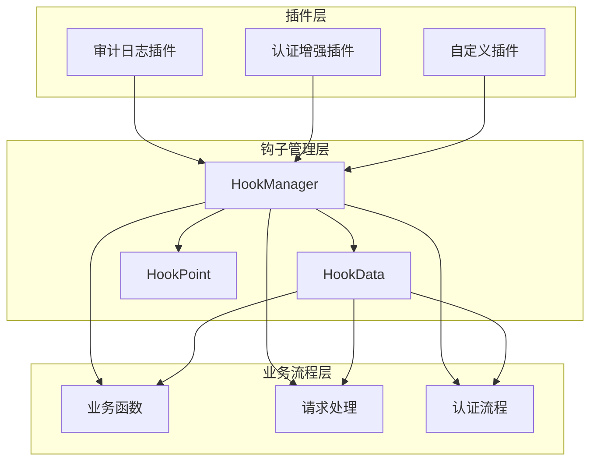
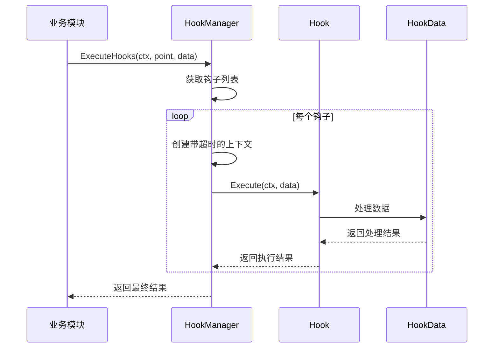
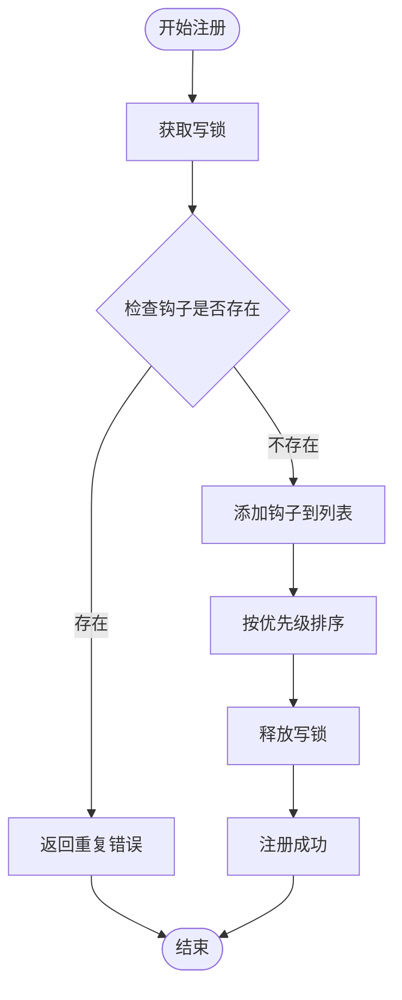
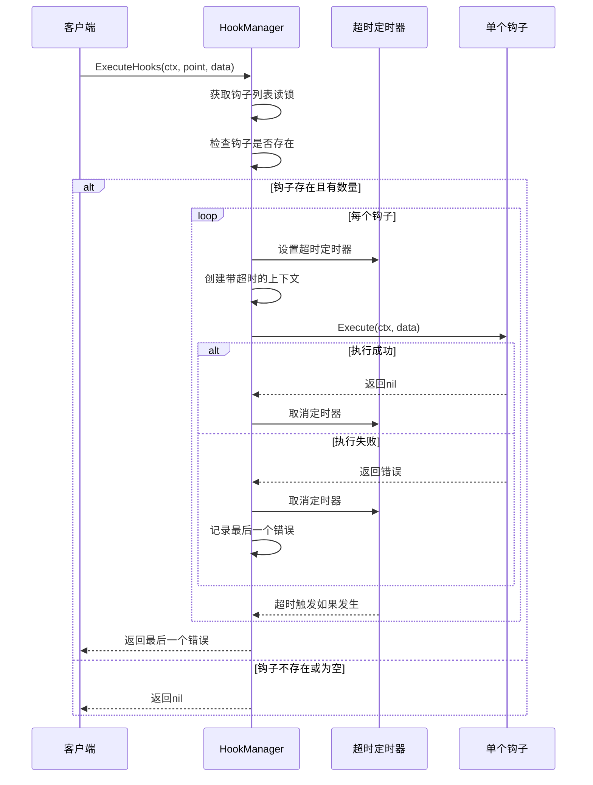
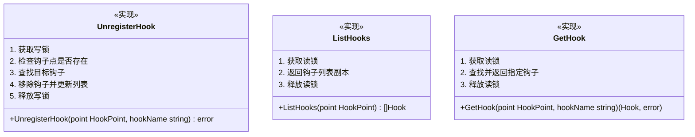
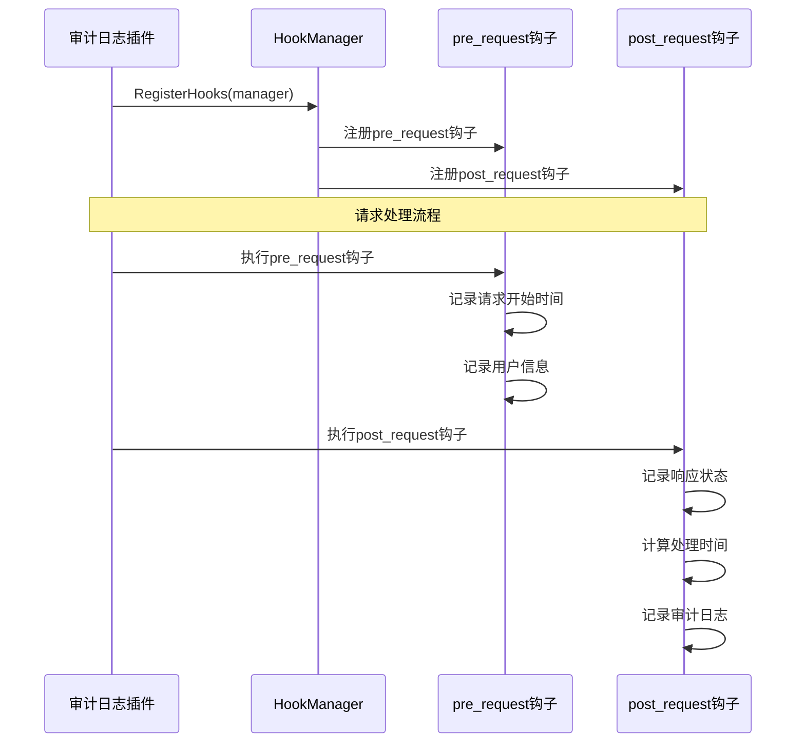

# 钩子机制

<cite>
**本文档引用的文件**
- [hook_manager.go](file://internal/pkg/plugin/hook_manager.go)
- [hook.go](file://internal/pkg/plugin/hook.go)
- [interfaces.go](file://internal/pkg/plugin/interfaces.go)
- [audit_logger.go](file://plugins/audit_logger.go)
- [auth_enhancer.go](file://plugins/auth_enhancer.go)
- [plugin_test.go](file://internal/pkg/plugin/plugin_test.go)
</cite>

## 目录
1. [简介](#简介)
2. [架构概览](#架构概览)
3. [核心组件分析](#核心组件分析)
4. [钩子点详解](#钩子点详解)
5. [钩子数据结构](#钩子数据结构)
6. [钩子管理器实现](#钩子管理器实现)
7. [插件集成示例](#插件集成示例)
8. [性能优化最佳实践](#性能优化最佳实践)
9. [故障排除指南](#故障排除指南)
10. [总结](#总结)

## 简介

钩子机制（HookManager）是Kratos框架中一个强大的扩展系统，它允许开发者在不修改主流程代码的前提下，在预定义的关键执行点（HookPoint）注入自定义逻辑。这种设计模式实现了拦截式扩展，为应用程序提供了高度的灵活性和可扩展性。

钩子机制的核心价值在于：
- **非侵入性扩展**：无需修改现有业务逻辑即可添加新功能
- **运行时管理**：支持动态注册、注销和查询钩子
- **优先级控制**：通过优先级机制确保钩子执行顺序
- **超时保护**：防止阻塞主业务流程的长时间执行
- **上下文传递**：安全地传递业务上下文数据

## 架构概览

钩子机制采用分层架构设计，包含接口定义层、实现层和插件集成层：



**图表来源**
- [hook_manager.go](file://internal/pkg/plugin/hook_manager.go#L1-L235)
- [hook.go](file://internal/pkg/plugin/hook.go#L1-L72)

## 核心组件分析

### HookManager 接口

HookManager是钩子机制的核心接口，定义了钩子的生命周期管理功能：

```mermaid
classDiagram
class HookManager {
<<interface>>
+RegisterHook(point HookPoint, hook Hook) error
+UnregisterHook(point HookPoint, hookName string) error
+ExecuteHooks(ctx context.Context, point HookPoint, data HookData) error
+ListHooks(point HookPoint) []Hook
+GetHook(point HookPoint, hookName string) (Hook, error)
}
class hookManagerImpl {
-mu sync.RWMutex
-hooks map[HookPoint][]hookEntry
-timers map[string]*time.Timer
+RegisterHook(point HookPoint, hook Hook) error
+UnregisterHook(point HookPoint, hookName string) error
+ExecuteHooks(ctx context.Context, point HookPoint, data HookData) error
+ListHooks(point HookPoint) []Hook
+GetHook(point HookPoint, hookName string) (Hook, error)
-executeSingleHook(ctx context.Context, hook Hook, data HookData) error
}
class Hook {
<<interface>>
+GetName() string
+GetPriority() int
+Execute(ctx context.Context, data HookData) error
+GetTimeout() time.Duration
}
class HookData {
<<interface>>
+GetContext() context.Context
+GetData() map[string]interface{}
+SetData(key string, value interface{})
+GetMetadata() map[string]string
}
HookManager <|-- hookManagerImpl
hookManagerImpl --> Hook : manages
hookManagerImpl --> HookData : uses
```

**图表来源**
- [hook_manager.go](file://internal/pkg/plugin/hook_manager.go#L1-L235)
- [hook.go](file://internal/pkg/plugin/hook.go#L46-L70)

### Hook 接口

Hook接口定义了钩子的基本行为规范：



**图表来源**
- [hook_manager.go](file://internal/pkg/plugin/hook_manager.go#L85-L125)

**章节来源**
- [hook_manager.go](file://internal/pkg/plugin/hook_manager.go#L1-L235)
- [hook.go](file://internal/pkg/plugin/hook.go#L46-L70)

## 钩子点详解

HookPoint枚举定义了系统中预设的关键执行点，每个钩子点都有明确的语义和适用场景：

### 请求处理钩子点

```go
// 请求处理钩子点
HookPointBeforeRequest  HookPoint = "before_request"
HookPointAfterRequest   HookPoint = "after_request"
HookPointBeforeResponse HookPoint = "before_response"
HookPointAfterResponse  HookPoint = "after_response"
```

这些钩子点位于HTTP请求处理的不同阶段：
- **BeforeRequest**：请求到达但尚未处理时
- **AfterRequest**：请求处理完成后但响应未发送前
- **BeforeResponse**：响应即将发送但尚未发送时
- **AfterResponse**：响应已发送后

### 认证相关钩子点

```go
// 认证相关钩子点
HookPointBeforeAuth HookPoint = "before_auth"
HookPointAfterAuth  HookPoint = "after_auth"
HookPointAuthFailed HookPoint = "auth_failed"
```

认证钩子点覆盖了完整的认证流程：
- **BeforeAuth**：认证开始前，可用于预验证或速率限制
- **AfterAuth**：认证成功后，可用于安全检查或审计
- **AuthFailed**：认证失败时，可用于错误处理或监控

### 业务逻辑钩子点

```go
// 业务逻辑钩子点
HookPointBeforeBiz HookPoint = "before_biz"
HookPointAfterBiz  HookPoint = "after_biz"
HookPointBizError  HookPoint = "biz_error"
```

业务逻辑钩子点关注核心业务处理：
- **BeforeBiz**：业务逻辑开始前，可用于权限检查
- **AfterBiz**：业务逻辑成功完成后，可用于结果缓存
- **BizError**：业务逻辑发生错误时，可用于异常处理

### 数据访问钩子点

```go
// 数据访问钩子点
HookPointBeforeData HookPoint = "before_data"
HookPointAfterData  HookPoint = "after_data"
HookPointDataError  HookPoint = "data_error"
```

数据访问钩子点监控数据库操作：
- **BeforeData**：数据访问开始前，可用于连接池管理
- **AfterData**：数据访问成功完成后，可用于性能统计
- **DataError**：数据访问发生错误时，可用于重试机制

**章节来源**
- [hook.go](file://internal/pkg/plugin/hook.go#L10-L32)

## 钩子数据结构

HookData结构体提供了安全的数据传递机制，支持上下文信息和业务数据的共享：

```mermaid
classDiagram
class HookData {
<<interface>>
+GetContext() context.Context
+GetData() map[string]interface{}
+SetData(key string, value interface{})
+GetMetadata() map[string]string
}
class hookDataImpl {
-ctx context.Context
-data map[string]interface{}
-metadata map[string]string
+GetContext() context.Context
+GetData() map[string]interface{}
+SetData(key string, value interface{})
+GetMetadata() map[string]string
}
class baseHook {
-name string
-priority int
-timeout time.Duration
-handler func(context.Context, HookData) error
+GetName() string
+GetPriority() int
+Execute(ctx context.Context, data HookData) error
+GetTimeout() time.Duration
}
HookData <|-- hookDataImpl
HookData <-- baseHook : uses
```

**图表来源**
- [hook_manager.go](file://internal/pkg/plugin/hook_manager.go#L167-L234)

### 数据传递机制

HookData的设计遵循以下原则：

1. **线程安全**：通过context.Context确保并发安全
2. **类型安全**：使用interface{}提供灵活的数据存储
3. **元数据支持**：专门的metadata字段用于附加信息
4. **动态扩展**：支持运行时动态设置数据

### 版本兼容性考虑

在设计HookData时需要考虑以下版本兼容性问题：

- **向后兼容**：新增字段不应破坏现有插件
- **数据迁移**：支持从旧版本格式转换
- **默认值处理**：为可选字段提供合理的默认值
- **序列化支持**：确保数据能够正确序列化和反序列化

**章节来源**
- [hook_manager.go](file://internal/pkg/plugin/hook_manager.go#L167-L234)

## 钩子管理器实现

### RegisterHook 方法

RegisterHook方法负责注册新的钩子到指定的钩子点：



**图表来源**
- [hook_manager.go](file://internal/pkg/plugin/hook_manager.go#L25-L50)

### ExecuteHooks 方法

ExecuteHooks方法是钩子机制的核心执行逻辑：



**图表来源**
- [hook_manager.go](file://internal/pkg/plugin/hook_manager.go#L85-L125)

### UnregisterHook 和 ListHooks 方法

这两个方法提供了运行时的钩子管理能力：



**图表来源**
- [hook_manager.go](file://internal/pkg/plugin/hook_manager.go#L56-L112)

**章节来源**
- [hook_manager.go](file://internal/pkg/plugin/hook_manager.go#L25-L125)

## 插件集成示例

### 审计日志插件

审计日志插件展示了如何在认证成功后执行额外的安全检查：



**图表来源**
- [audit_logger.go](file://plugins/audit_logger.go#L70-L100)

### 认证增强插件

认证增强插件演示了在认证前后执行不同逻辑：

```go
func (p *AuthEnhancerPlugin) RegisterHooks(manager plugin.HookManager) error {
    // 注册认证前置钩子
    authHook := plugin.NewBaseHook(
        "auth_enhancer_pre_auth",
        10, // 高优先级
        5*time.Second,
        func(ctx context.Context, data plugin.HookData) error {
            fmt.Println("AuthEnhancerPlugin: Pre-authentication hook executed")
            // 添加JWT验证、速率限制等逻辑
            return nil
        },
    )

    if err := manager.RegisterHook(plugin.HookPointBeforeAuth, authHook); err != nil {
        return err
    }

    // 注册认证后置钩子
    authPostHook := plugin.NewBaseHook(
        "auth_enhancer_post_auth",
        20, // 较低优先级
        5*time.Second,
        func(ctx context.Context, data plugin.HookData) error {
            fmt.Println("AuthEnhancerPlugin: Post-authentication hook executed")
            // 添加认证成功后的日志记录、审计等逻辑
            return nil
        },
    )

    return manager.RegisterHook(plugin.HookPointAfterAuth, authPostHook)
}
```

**章节来源**
- [audit_logger.go](file://plugins/audit_logger.go#L70-L100)
- [auth_enhancer.go](file://plugins/auth_enhancer.go#L60-L90)

## 性能优化最佳实践

### 非阻塞钩子执行

为了确保钩子不会阻塞主业务流程，钩子管理器采用了以下策略：

1. **超时控制**：每个钩子都有独立的超时时间，默认30秒
2. **并发执行**：钩子之间相互独立，互不影响
3. **错误隔离**：单个钩子失败不影响其他钩子执行
4. **资源清理**：及时清理超时的钩子资源

### 优先级管理

通过优先级机制控制钩子执行顺序：

```go
// 按优先级排序（数值越小优先级越高）
sort.Slice(hm.hooks[point], func(i, j int) bool {
    return hm.hooks[point][i].priority < hm.hooks[point][j].priority
})
```

### 内存优化

- 使用sync.RWMutex减少锁竞争
- 及时清理超时的定时器
- 避免在钩子中创建大量临时对象

### 异步处理建议

对于耗时操作，建议使用异步处理：

```go
func asyncHookHandler(ctx context.Context, data plugin.HookData) error {
    go func() {
        // 异步执行耗时操作
        // 不要阻塞当前goroutine
    }()
    return nil
}
```

## 故障排除指南

### 常见问题及解决方案

1. **钩子注册失败**
   - 检查钩子名称是否重复
   - 确认HookManager实例正确初始化
   - 验证HookPoint常量拼写正确

2. **钩子执行超时**
   - 增加钩子的超时时间设置
   - 优化钩子内部逻辑
   - 使用异步处理耗时操作

3. **钩子执行顺序错误**
   - 调整钩子的优先级设置
   - 确保优先级数值正确（越小优先级越高）

4. **内存泄漏**
   - 检查定时器是否正确清理
   - 避免在钩子中持有长生命周期引用

### 调试技巧

1. **启用详细日志**：在钩子中添加调试输出
2. **使用钩子ID**：通过request_id跟踪钩子执行
3. **监控性能指标**：记录钩子执行时间和频率
4. **单元测试**：为每个钩子编写独立的测试用例

**章节来源**
- [hook_manager.go](file://internal/pkg/plugin/hook_manager.go#L85-L125)

## 总结

钩子机制是Kratos框架中一个设计精良的扩展系统，它通过以下特性实现了高效的插件化架构：

### 核心优势

1. **非侵入性**：在不修改主流程代码的情况下添加功能
2. **高灵活性**：支持动态注册和注销钩子
3. **强一致性**：通过优先级和超时机制保证执行顺序和稳定性
4. **易于维护**：清晰的接口定义和实现分离

### 设计亮点

- **分层架构**：接口、实现和插件各司其职
- **并发安全**：完善的锁机制和资源管理
- **错误处理**：优雅的错误传播和恢复机制
- **扩展性**：支持多种类型的钩子和事件处理

### 应用场景

钩子机制特别适用于以下场景：
- 审计和监控系统
- 权限和安全检查
- 日志记录和追踪
- 缓存和性能优化
- 第三方服务集成

通过合理使用钩子机制，开发者可以构建出既稳定又灵活的应用程序架构，为未来的功能扩展奠定坚实的基础。