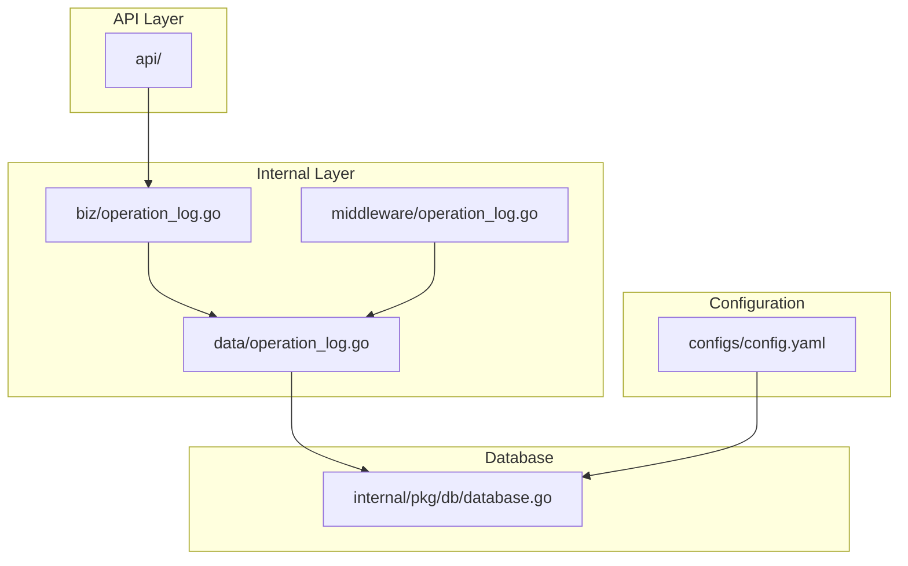
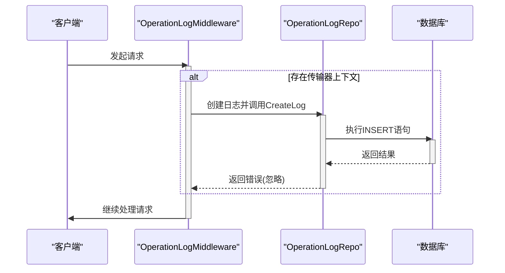
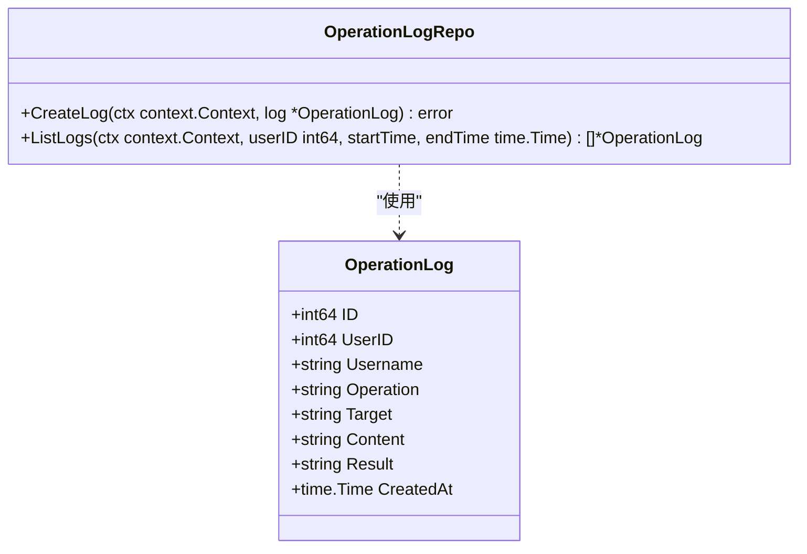
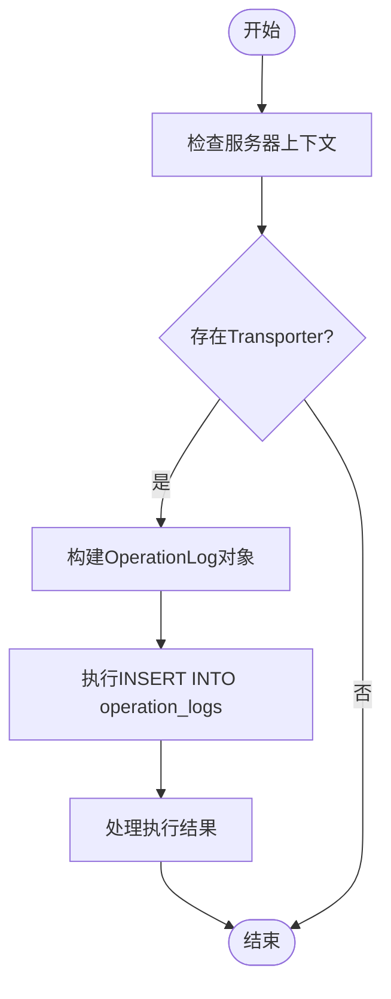
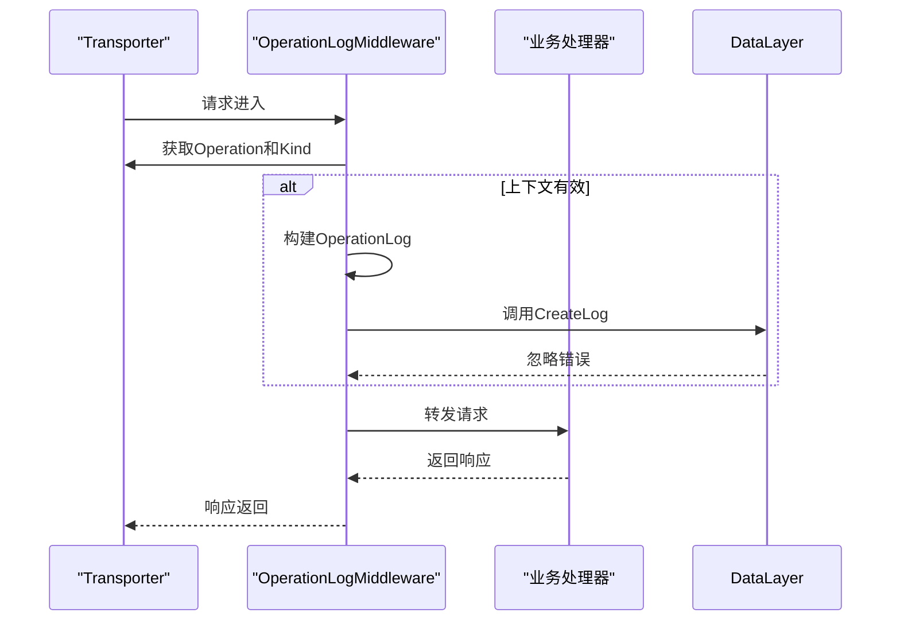

# 操作日志表 (operation_logs)

<cite>
**本文档引用的文件**
- [operation_log.go](file://internal/biz/operation_log.go)
- [operation_log.go](file://internal/data/operation_log.go)
- [operation_log_test.go](file://internal/data/operation_log_test.go)
- [operation_log.go](file://internal/middleware/operation_log.go)
- [operation_log_test.go](file://internal/middleware/operation_log_test.go)
- [data.go](file://internal/data/data.go)
- [database.go](file://internal/pkg/db/database.go)
- [config.yaml](file://configs/config.yaml)
</cite>

## 目录
1. [简介](#简介)
2. [项目结构](#项目结构)
3. [核心组件](#核心组件)
4. [架构概述](#架构概述)
5. [详细组件分析](#详细组件分析)
6. [依赖分析](#依赖分析)
7. [性能考虑](#性能考虑)
8. [故障排除指南](#故障排除指南)
9. [结论](#结论)

## 简介
本文件旨在全面记录 `operation_logs` 表的数据模型设计，涵盖其字段定义、审计用途以及通过中间件自动记录关键业务操作的机制。文档将详细说明操作人标识（operator）、动作类型（action）、结果（result）、目标资源（resource_id）、时间戳（timestamp）及附加上下文（metadata）等字段的设计理念与实现方式。同时，结合 `internal/middleware/operation_log.go` 文件，阐述日志生成时机与上下文注入机制，并描述该表在安全审计、行为追溯和合规性检查中的实际应用。此外，还将提供基于时间范围和操作类型的查询优化建议，并评估是否启用了分区表或归档策略以应对大规模日志存储需求。

## 项目结构
该项目采用典型的分层架构设计，包含 API 定义、内部业务逻辑、数据访问层、中间件和服务等多个模块。操作日志功能主要分布在 `internal/biz`、`internal/data` 和 `internal/middleware` 目录下，其中 `biz` 层定义了领域模型和接口契约，`data` 层实现了具体的数据持久化逻辑，而 `middleware` 层则负责拦截请求并自动生成操作日志。



**Diagram sources**
- [operation_log.go](file://internal/biz/operation_log.go)
- [operation_log.go](file://internal/data/operation_log.go)
- [operation_log.go](file://internal/middleware/operation_log.go)
- [database.go](file://internal/pkg/db/database.go)
- [config.yaml](file://configs/config.yaml)

**Section sources**
- [operation_log.go](file://internal/biz/operation_log.go)
- [operation_log.go](file://internal/data/operation_log.go)
- [operation_log.go](file://internal/middleware/operation_log.go)
- [database.go](file://internal/pkg/db/database.go)
- [config.yaml](file://configs/config.yaml)

## 核心组件
操作日志系统的核心由三个主要部分构成：领域模型 `OperationLog`、仓储接口 `OperationLogRepo` 及其具体实现、以及用于自动记录日志的中间件 `OperationLogMiddleware`。这些组件协同工作，确保所有关键业务操作都能被准确地捕获和存储。

**Section sources**
- [operation_log.go](file://internal/biz/operation_log.go)
- [operation_log.go](file://internal/data/operation_log.go)
- [operation_log.go](file://internal/middleware/operation_log.go)

## 架构概述
整个操作日志系统的架构遵循清晰的分层原则，从上至下的调用流程为：HTTP/gRPC 请求 → 中间件拦截 → 创建日志实体 → 调用仓储方法 → 执行数据库插入。这种设计不仅保证了日志记录的透明性和一致性，还便于后续的功能扩展和维护。



**Diagram sources**
- [operation_log.go](file://internal/middleware/operation_log.go)
- [operation_log.go](file://internal/data/operation_log.go)

## 详细组件分析

### 领域模型分析
`OperationLog` 结构体定义了操作日志的所有必要属性，包括唯一标识符、用户信息、操作详情、结果状态和发生时间。每个字段都有明确的语义含义，共同构成了完整的审计追踪信息。

#### 对象导向组件：


**Diagram sources**
- [operation_log.go](file://internal/biz/operation_log.go)

**Section sources**
- [operation_log.go](file://internal/biz/operation_log.go)

### 数据访问层分析
`operationLogRepo` 实现了 `OperationLogRepo` 接口，提供了创建和查询操作日志的具体方法。它直接与底层数据库交互，利用 SQL 语句完成数据的增删改查操作。值得注意的是，当前实现中并未发现 `operation_logs` 表的迁移脚本，这可能意味着该表需要手动创建或通过其他方式初始化。

#### 复杂逻辑组件：


**Diagram sources**
- [operation_log.go](file://internal/data/operation_log.go)

**Section sources**
- [operation_log.go](file://internal/data/operation_log.go)

### 中间件机制分析
`OperationLogMiddleware` 是一个典型的 Kratos 框架中间件，它在每个请求到达业务处理器之前运行。当中间件检测到有效的传输器上下文时，会提取出操作路径和协议类型，并尝试将其作为一条新的操作日志写入数据库。即使日志记录失败，也不会影响主流程的正常执行，体现了良好的容错设计。

#### API/服务组件：


**Diagram sources**
- [operation_log.go](file://internal/middleware/operation_log.go)

**Section sources**
- [operation_log.go](file://internal/middleware/operation_log.go)

## 依赖分析
通过对代码库的分析可以看出，操作日志系统与其他模块之间存在着紧密但解耦的依赖关系。`biz` 层仅定义接口，不关心具体实现；`data` 层依赖于数据库连接和日志工具；`middleware` 层则依赖于 `transport` 包来获取请求上下文信息。这种依赖注入模式使得各个组件可以独立测试和替换。

```mermaid
graph TD
    A[biz.OperationLog] --> B[data.operationLogRepo]
    B --> C[sql