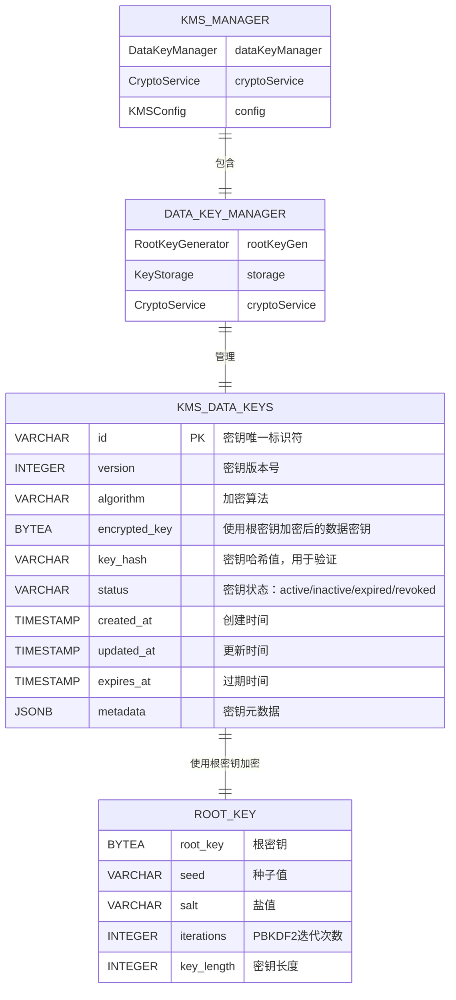
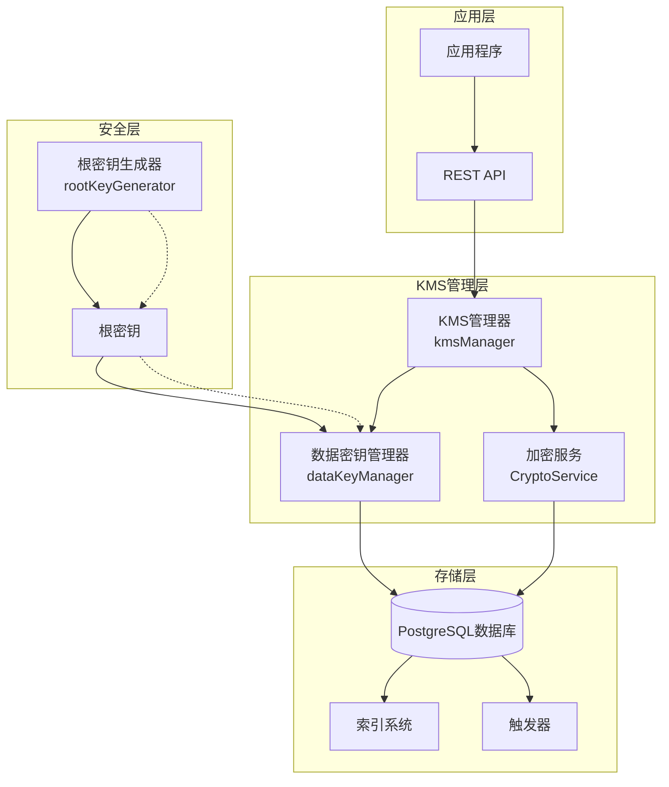
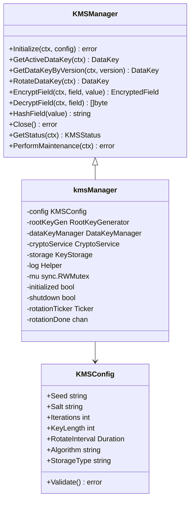
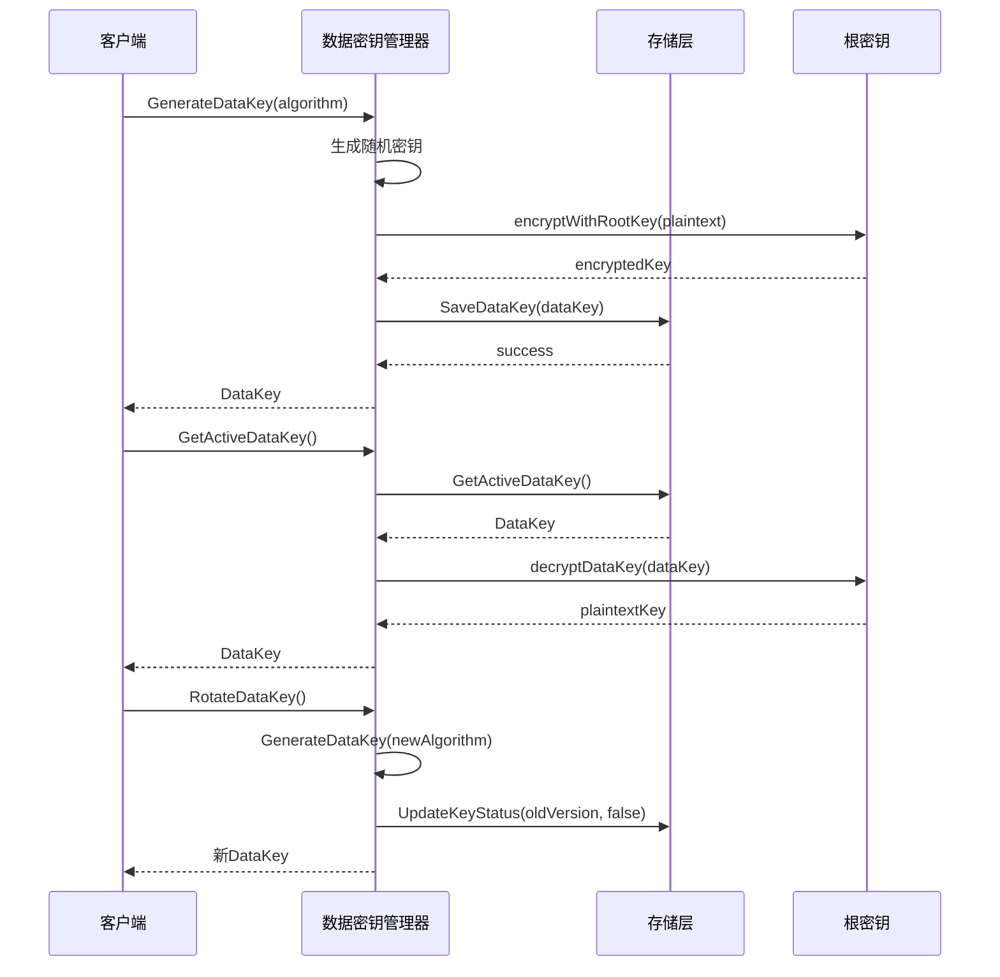
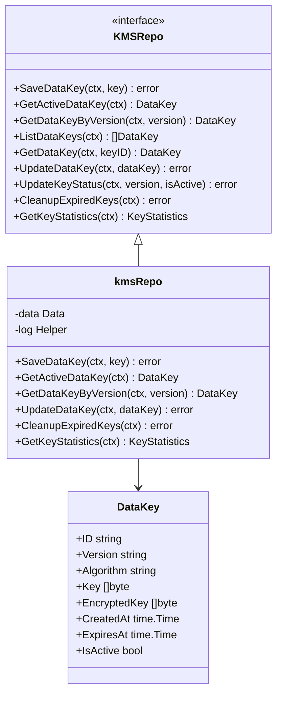
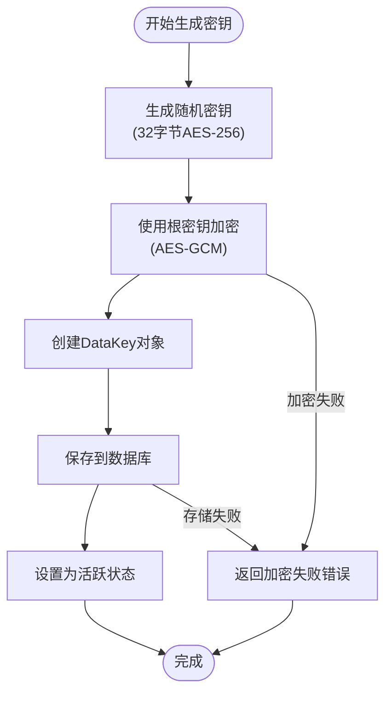
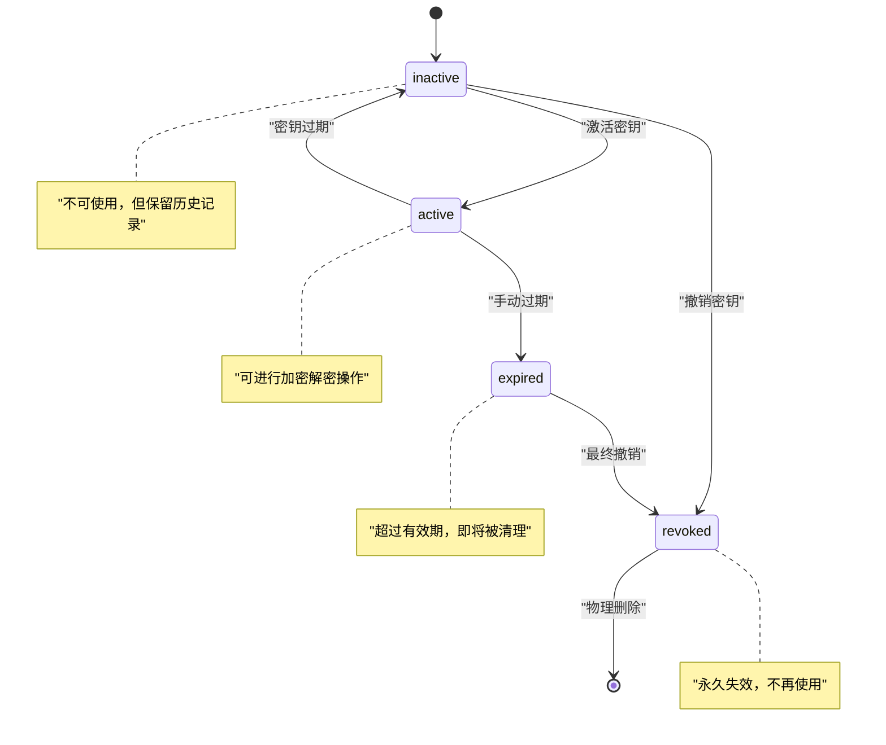
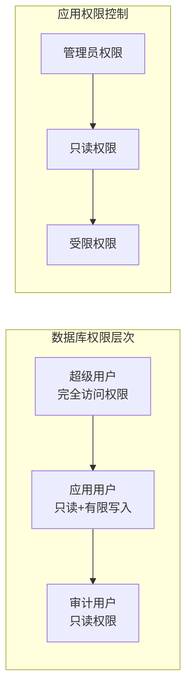

# 数据密钥表 (data_keys)

<cite>
**本文档中引用的文件**
- [migrations/000002_create_kms_data_keys.up.sql](file://migrations/000002_create_kms_data_keys.up.sql)
- [internal/pkg/kms/manager.go](file://internal/pkg/kms/manager.go)
- [internal/biz/kms.go](file://internal/biz/kms.go)
- [internal/data/kms.go](file://internal/data/kms.go)
- [internal/pkg/kms/datakey.go](file://internal/pkg/kms/datakey.go)
- [internal/pkg/kms/rootkey.go](file://internal/pkg/kms/rootkey.go)
- [internal/pkg/kms/manager_test.go](file://internal/pkg/kms/manager_test.go)
</cite>

## 目录
1. [简介](#简介)
2. [表结构设计](#表结构设计)
3. [核心字段详解](#核心字段详解)
4. [架构概览](#架构概览)
5. [详细组件分析](#详细组件分析)
6. [密钥生命周期管理](#密钥生命周期管理)
7. [安全特性](#安全特性)
8. [使用示例](#使用示例)
9. [性能考虑](#性能考虑)
10. [故障排除指南](#故障排除指南)
11. [总结](#总结)

## 简介

数据密钥表 (`kms_data_keys`) 是密钥管理系统 (KMS) 的核心组件，负责存储和管理用于数据加密的临时数据密钥。该表采用分层密钥架构，其中数据密钥本身被根密钥加密保护，确保即使数据库泄露，敏感数据仍然保持安全。

该表的设计遵循了现代密码学的最佳实践，支持多种加密算法，提供密钥版本控制，以及完整的密钥生命周期管理功能。通过与根密钥的逻辑分离，系统实现了强健的安全隔离和灵活的密钥轮换策略。

## 表结构设计



**图表来源**
- [migrations/000002_create_kms_data_keys.up.sql](file://migrations/000002_create_kms_data_keys.up.sql#L1-L70)
- [internal/biz/kms.go](file://internal/biz/kms.go#L8-L18)

**章节来源**
- [migrations/000002_create_kms_data_keys.up.sql](file://migrations/000002_create_kms_data_keys.up.sql#L1-L70)

## 核心字段详解

### 主键和版本控制

- **id**: UUID格式的唯一标识符，确保每个数据密钥的全局唯一性
- **version**: 版本号字段，支持密钥版本追踪和回滚功能

### 加密和安全字段

- **algorithm**: 支持的加密算法包括AES-256-GCM、AES-256-CBC、ChaCha20-Poly1305和SM4-GCM
- **encrypted_key**: 使用根密钥加密后的数据密钥，确保明文密钥永远不会直接存储
- **key_hash**: 密钥哈希值，用于完整性验证和密钥校验

### 状态和生命周期管理

- **status**: 密钥状态枚举，支持active、inactive、expired和revoked四种状态
- **created_at**: 密钥创建时间戳，支持审计和合规性要求
- **updated_at**: 最后更新时间戳，通过触发器自动维护
- **expires_at**: 密钥过期时间，支持自动密钥轮换

### 元数据和扩展性

- **metadata**: JSONB格式的元数据字段，支持自定义标签和属性
- **索引优化**: 多个复合索引确保查询性能和状态约束

**章节来源**
- [migrations/000002_create_kms_data_keys.up.sql](file://migrations/000002_create_kms_data_keys.up.sql#L1-L30)
- [internal/biz/kms.go](file://internal/biz/kms.go#L8-L18)

## 架构概览



**图表来源**
- [internal/pkg/kms/manager.go](file://internal/pkg/kms/manager.go#L1-L50)
- [internal/pkg/kms/datakey.go](file://internal/pkg/kms/datakey.go#L1-L30)

**章节来源**
- [internal/pkg/kms/manager.go](file://internal/pkg/kms/manager.go#L1-L308)

## 详细组件分析

### KMS管理器 (kmsManager)

KMS管理器是整个密钥管理系统的核心协调器，负责初始化、密钥管理和系统生命周期控制。



**图表来源**
- [internal/pkg/kms/manager.go](file://internal/pkg/kms/manager.go#L12-L30)
- [internal/biz/kms.go](file://internal/biz/kms.go#L60-L70)

### 数据密钥管理器 (dataKeyManager)

数据密钥管理器专门负责数据密钥的生成、加密、解密和版本管理。



**图表来源**
- [internal/pkg/kms/datakey.go](file://internal/pkg/kms/datakey.go#L25-L100)
- [internal/data/kms.go](file://internal/data/kms.go#L25-L100)

### 存储层接口

存储层提供了统一的数据访问接口，支持多种存储后端。



**图表来源**
- [internal/biz/kms.go](file://internal/biz/kms.go#L15-L40)
- [internal/data/kms.go](file://internal/data/kms.go#L15-L30)

**章节来源**
- [internal/pkg/kms/manager.go](file://internal/pkg/kms/manager.go#L1-L308)
- [internal/pkg/kms/datakey.go](file://internal/pkg/kms/datakey.go#L1-L251)
- [internal/data/kms.go](file://internal/data/kms.go#L1-L332)

## 密钥生命周期管理

### 密钥生成流程



**图表来源**
- [internal/pkg/kms/datakey.go](file://internal/pkg/kms/datakey.go#L25-L50)

### 密钥轮换机制

系统支持自动和手动两种密钥轮换模式：

1. **自动轮换**: 基于配置的时间间隔定期执行
2. **手动轮换**: 通过API接口主动触发
3. **版本控制**: 每个密钥都有唯一的版本号
4. **状态管理**: 支持密钥的激活、停用和过期

### 密钥状态转换



**章节来源**
- [internal/pkg/kms/datakey.go](file://internal/pkg/kms/datakey.go#L50-L100)
- [internal/data/kms.go](file://internal/data/kms.go#L100-L150)

## 安全特性

### 分层密钥架构

系统采用分层密钥架构，确保安全性：

1. **根密钥**: 存储在内存中，不持久化
2. **数据密钥**: 使用根密钥加密后存储在数据库中
3. **明文密钥**: 仅在内存中短暂存在，用于加密解密操作

### 访问控制和权限隔离



### 数据库层面的安全防护

1. **索引优化**: 多个复合索引确保查询性能
2. **约束检查**: 状态和算法的有效性约束
3. **触发器**: 自动维护更新时间戳
4. **视图**: 提供统计信息的只读访问

**章节来源**
- [migrations/000002_create_kms_data_keys.up.sql](file://migrations/000002_create_kms_data_keys.up.sql#L30-L70)

## 使用示例

### 基本密钥操作

```go
// 初始化KMS管理器
manager := kms.NewKMSManager(storage, config, logger)

// 获取活跃数据密钥
ctx := context.Background()
dataKey, err := manager.GetActiveDataKey(ctx)
if err != nil {
    return err
}

// 使用数据密钥加密字段
encryptedField, err := manager.EncryptField(ctx, "password", []byte("secret"))
if err != nil {
    return err
}

// 使用数据密钥解密字段
decryptedData, err := manager.DecryptField(ctx, encryptedField)
if err != nil {
    return err
}
```

### 密钥轮换示例

```go
// 手动轮换密钥
newKey, err := manager.RotateDataKey(ctx)
if err != nil {
    return err
}

// 获取特定版本的密钥
oldKey, err := manager.GetDataKeyByVersion(ctx, "v123456789")
if err != nil {
    return err
}
```

### 批量加密操作

```go
// 批量加密多个字段
fields := map[string][]byte{
    "email":    []byte("user@example.com"),
    "phone":    []byte("+861234567890"),
    "address":  []byte("北京市朝阳区"),
}

encryptedFields, err := cryptoService.EncryptBatch(ctx, fields)
if err != nil {
    return err
}

// 批量解密
decryptedFields, err := cryptoService.DecryptBatch(ctx, encryptedFields)
if err != nil {
    return err
}
```

**章节来源**
- [internal/pkg/kms/manager_test.go](file://internal/pkg/kms/manager_test.go#L30-L100)

## 性能考虑

### 查询优化

1. **索引策略**: 多个复合索引确保高效查询
2. **分页查询**: 支持大数据集的分页浏览
3. **统计视图**: 提供预计算的统计信息

### 缓存机制

1. **内存缓存**: 活跃密钥在内存中缓存
2. **LRU策略**: 最近使用的密钥优先缓存
3. **自动清理**: 过期密钥自动从缓存中移除

### 并发控制

1. **读写锁**: 使用RWMutex确保线程安全
2. **连接池**: 数据库连接池优化性能
3. **批量操作**: 支持批量加密解密操作

## 故障排除指南

### 常见错误及解决方案

1. **密钥未找到 (ErrKeyNotFound)**
   - 检查密钥版本号是否正确
   - 验证密钥是否已被撤销或过期
   - 确认数据库连接正常

2. **密钥解密失败 (ErrKeyDecryptionFail)**
   - 验证根密钥是否正确
   - 检查加密算法兼容性
   - 确认密钥格式是否正确

3. **系统未初始化 (ErrKMSNotInitialized)**
   - 确保KMS管理器已正确初始化
   - 检查配置参数是否有效
   - 验证根密钥生成过程

### 监控和诊断

```go
// 获取KMS系统状态
status, err := manager.GetStatus(ctx)
if err != nil {
    return err
}

// 输出系统状态信息
fmt.Printf("初始化状态: %v\n", status.Initialized)
fmt.Printf("活跃密钥版本: %s\n", status.ActiveKeyVersion)
fmt.Printf("密钥统计: %v\n", status.KeyStatistics)
```

**章节来源**
- [internal/biz/kms.go](file://internal/biz/kms.go#L90-L140)
- [internal/pkg/kms/manager.go](file://internal/pkg/kms/manager.go#L250-L308)

## 总结

数据密钥表 (`kms_data_keys`) 是密钥管理系统的核心组件，通过精心设计的架构和安全机制，为敏感数据加密提供了强大而可靠的基础。该表支持：

- **多算法支持**: AES-256-GCM、AES-256-CBC、ChaCha20-Poly1305、SM4-GCM
- **完整生命周期管理**: 从生成到销毁的全过程跟踪
- **强安全隔离**: 分层密钥架构确保数据安全
- **高性能设计**: 多级索引和缓存机制优化性能
- **灵活扩展**: 支持配置驱动的密钥轮换和算法选择

通过与根密钥的逻辑分离和完善的访问控制机制，该系统能够在保证安全性的同时，提供良好的性能和可用性。对于需要处理敏感数据的应用程序，这是一个理想的密钥管理解决方案。