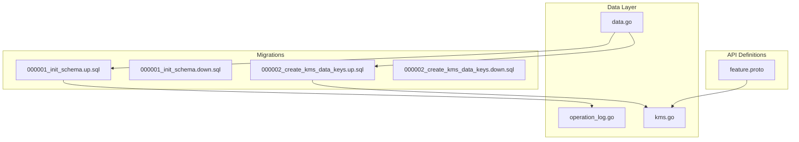
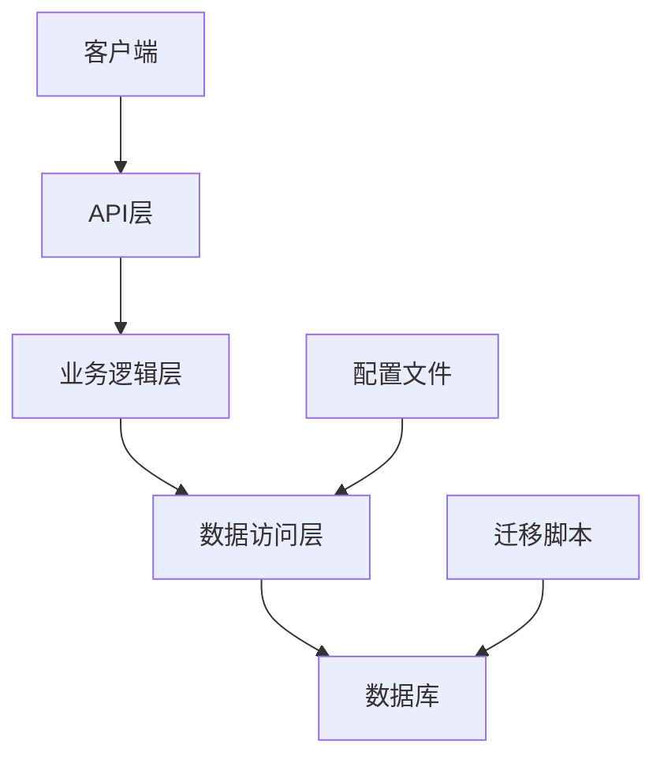

# 数据库设计

<cite>
**本文档引用的文件**
- [000001_init_schema.up.sql](file://migrations/000001_init_schema.up.sql)
- [000001_init_schema.down.sql](file://migrations/000001_init_schema.down.sql)
- [000002_create_kms_data_keys.up.sql](file://migrations/000002_create_kms_data_keys.up.sql)
- [000002_create_kms_data_keys.down.sql](file://migrations/000002_create_kms_data_keys.down.sql)
- [operation_log.go](file://internal/data/operation_log.go)
- [kms.go](file://internal/data/kms.go)
- [data.go](file://internal/data/data.go)
- [feature.proto](file://api/feature/v1/feature.proto)
</cite>

## 目录
1. [介绍](#介绍)
2. [项目结构](#项目结构)
3. [核心组件](#核心组件)
4. [架构概述](#架构概述)
5. [详细组件分析](#详细组件分析)
6. [依赖分析](#依赖分析)
7. [性能考虑](#性能考虑)
8. [故障排除指南](#故障排除指南)
9. [结论](#结论)

## 介绍
本数据库设计文档全面描述了系统中所有实体表的结构、关系和约束。文档重点介绍了用户管理、密钥管理（KMS）、操作日志记录和功能开关等核心功能模块的数据库实现。通过详细的ER图展示表间关系，并解释每个迁移脚本的作用，特别是up.sql和down.sql的配对设计如何支持版本回滚。同时提供了读写分离、连接池配置和性能优化建议。

## 项目结构
项目中的数据库相关文件主要分布在`migrations`目录下，包含初始化模式和创建KMS数据密钥表的SQL脚本。这些脚本定义了数据库的初始状态和后续变更。业务逻辑层的数据访问对象（DAO）位于`internal/data`包中，负责与数据库进行交互。

**Diagram sources**
- [000001_init_schema.up.sql](file://migrations/000001_init_schema.up.sql)
- [000002_create_kms_data_keys.up.sql](file://migrations/000002_create_kms_data_keys.up.sql)
- [operation_log.go](file://internal/data/operation_log.go)
- [kms.go](file://internal/data/kms.go)
- [data.go](file://internal/data/data.go)

**Section sources**
- [migrations](file://migrations)
- [internal/data](file://internal/data)

## 核心组件
系统的核心数据库组件包括users表用于存储用户信息，kms_data_keys表用于KMS的数据密钥存储，operation_logs表记录关键操作日志，以及feature_toggles表保存功能开关的配置策略。这些组件共同构成了系统的安全性和可维护性基础。

**Section sources**
- [000001_init_schema.up.sql](file://migrations/000001_init_schema.up.sql)
- [000002_create_kms_data_keys.up.sql](file://migrations/000002_create_kms_data_keys.up.sql)
- [operation_log.go](file://internal/data/operation_log.go)
- [kms.go](file://internal/data/kms.go)

## 架构概述
系统采用分层架构设计，其中数据访问层（Data Layer）封装了对数据库的操作，业务逻辑层（Biz Layer）处理应用的核心逻辑，而API层则暴露服务接口。数据库迁移脚本确保了数据库模式的一致性和可追溯性。

**Diagram sources**
- [data.go](file://internal/data/data.go)
- [operation_log.go](file://internal/data/operation_log.go)
- [kms.go](file://internal/data/kms.go)

## 详细组件分析

### 用户表分析
users表是系统中最基本的实体之一，包含了用户的身份信息和账户状态。该表使用哈希值来支持加密字段的检索，同时保持敏感信息的安全性。

#### 表结构
| 字段名 | 类型 | 约束 | 描述 |
|-------|------|------|------|
| id | SERIAL | PRIMARY KEY | 用户唯一标识符 |
| username | VARCHAR(255) | NOT NULL, UNIQUE | 用户名 |
| password | VARCHAR(255) | NOT NULL | 密码哈希 |
| email_encrypted | BYTEA | - | 加密后的邮箱 |
| email_hash | VARCHAR(64) | - | 邮箱哈希，用于检索 |
| phone_encrypted | BYTEA | - | 加密后的电话号码 |
| phone_hash | VARCHAR(64) | - | 电话号码哈希，用于检索 |
| name_encrypted | BYTEA | - | 加密后的姓名 |
| name_hash | VARCHAR(64) | - | 姓名哈希，用于检索 |
| created_at | TIMESTAMP | NOT NULL, DEFAULT CURRENT_TIMESTAMP | 创建时间 |
| updated_at | TIMESTAMP | NOT NULL, DEFAULT CURRENT_TIMESTAMP | 更新时间 |

#### 索引设置
- `idx_users_email_hash`: 在email_hash上创建索引以加速基于邮箱的查询。
- `idx_users_phone_hash`: 在phone_hash上创建索引以加速基于电话号码的查询。
- `idx_users_name_hash`: 在name_hash上创建索引以加速基于姓名的查询。

**Section sources**
- [000001_init_schema.up.sql](file://migrations/000001_init_schema.up.sql)

### KMS数据密钥表分析
kms_data_keys表用于存储由根密钥加密后的数据密钥，支持多种加密算法和密钥生命周期管理。

#### 表结构
| 字段名 | 类型 | 约束 | 描述 |
|-------|------|------|------|
| id | VARCHAR(36) | PRIMARY KEY | 密钥唯一标识符 |
| version | INTEGER | NOT NULL | 密钥版本号 |
| algorithm | VARCHAR(50) | NOT NULL, DEFAULT 'AES-256-GCM' | 加密算法 |
| encrypted_key | BYTEA | NOT NULL | 使用根密钥加密后的数据密钥 |
| key_hash | VARCHAR(64) | NOT NULL | 密钥哈希值，用于验证 |
| status | VARCHAR(20) | NOT NULL, DEFAULT 'active' | 密钥状态：active-活跃, inactive-非活跃, expired-过期, revoked-撤销 |
| created_at | TIMESTAMP WITH TIME ZONE | NOT NULL, DEFAULT CURRENT_TIMESTAMP | 创建时间 |
| updated_at | TIMESTAMP WITH TIME ZONE | NOT NULL, DEFAULT CURRENT_TIMESTAMP | 更新时间 |
| expires_at | TIMESTAMP WITH TIME ZONE | - | 过期时间 |
| metadata | JSONB | - | 密钥元数据，JSON格式 |

#### 约束与索引
- **CHECK约束**: 
  - `kms_data_keys_status_check`: 确保status只能是'active', 'inactive', 'expired', 'revoked'之一。
  - `kms_data_keys_algorithm_check`: 确保algorithm只能是'AES-256-GCM', 'AES-256-CBC', 'ChaCha20-Poly1305', 'SM4-GCM'之一。
- **唯一索引**: `idx_kms_data_keys_version_status`在version和status上创建唯一索引，当status为'active'时保证版本唯一。
- **其他索引**: 包括version, status, created_at, expires_at, key_hash上的索引以优化查询性能。

#### 触发器
- `trigger_update_kms_data_keys_updated_at`: 在每次更新前自动更新updated_at字段。

#### 统计视图
- `kms_key_stats`: 提供密钥统计信息的视图，包括按状态和算法分组的密钥数量、最早和最晚创建时间以及过期密钥数量。

**Diagram sources**
- [000002_create_kms_data_keys.up.sql](file://migrations/000002_create_kms_data_keys.up.sql)

**Section sources**
- [000002_create_kms_data_keys.up.sql](file://migrations/000002_create_kms_data_keys.up.sql)
- [kms.go](file://internal/data/kms.go)

### 操作日志表分析
operation_logs表记录了系统中的关键操作，包括操作人、动作类型、结果和时间戳。

#### 表结构
| 字段名 | 类型 | 约束 | 描述 |
|-------|------|------|------|
| id | BIGSERIAL | PRIMARY KEY | 日志条目唯一标识符 |
| user_id | BIGINT | NOT NULL | 用户标识 |
| username | VARCHAR(255) | NOT NULL | 用户名 |
| operation | VARCHAR(255) | NOT NULL | 操作类型 |
| target | VARCHAR(255) | NOT NULL | 操作对象 |
| content | TEXT | NOT NULL | 操作内容 |
| result | VARCHAR(255) | NOT NULL | 操作结果 |
| created_at | TIMESTAMP WITH TIME ZONE | NOT NULL, DEFAULT CURRENT_TIMESTAMP | 操作时间 |

#### 查询方法
- `CreateLog`: 插入新的操作日志记录。
- `ListLogs`: 根据用户ID和时间范围查询操作日志。

**Section sources**
- [operation_log.go](file://internal/data/operation_log.go)

### 功能开关表分析
feature_toggles表保存