# 数据库迁移策略

<cite>
**本文档引用的文件**
- [000001_init_schema.up.sql](file://migrations/000001_init_schema.up.sql)
- [000001_init_schema.down.sql](file://migrations/000001_init_schema.down.sql)
- [000002_create_kms_data_keys.up.sql](file://migrations/000002_create_kms_data_keys.up.sql)
- [000002_create_kms_data_keys.down.sql](file://migrations/000002_create_kms_data_keys.down.sql)
- [data.go](file://internal/data/data.go)
- [crypto_service.go](file://internal/pkg/kms/crypto_service.go)
- [datakey.go](file://internal/pkg/kms/datakey.go)
- [kms.go](file://internal/biz/kms.go)
- [manager.go](file://internal/pkg/kms/manager.go)
- [interfaces.go](file://internal/pkg/kms/interfaces.go)
- [main.go](file://cmd/kratos-boilerplate/main.go)
- [wire.go](file://cmd/kratos-boilerplate/wire.go)
</cite>

## 目录
1. [简介](#简介)
2. [迁移架构概述](#迁移架构概述)
3. [迁移文件结构分析](#迁移文件结构分析)
4. [核心迁移脚本详解](#核心迁移脚本详解)
5. [KMS密钥管理系统集成](#kms密钥管理系统集成)
6. [迁移执行策略](#迁移执行策略)
7. [最佳实践与规范](#最佳实践与规范)
8. [故障排除指南](#故障排除指南)
9. [生产环境部署建议](#生产环境部署建议)
10. [总结](#总结)

## 简介

本项目采用了一套完整的数据库迁移策略，通过SQL脚本的方式管理数据库版本控制。该策略基于时间戳前缀的命名约定，确保迁移文件的有序执行，并提供了完善的回滚机制以保证数据库变更的安全性。

迁移系统的核心特点包括：
- 基于时间戳前缀的有序迁移文件命名
- 完整的UP/Down脚本对称设计
- 与Kratos框架深度集成
- 支持KMS密钥管理系统的无缝集成
- 生产环境友好的灰度迁移方案

## 迁移架构概述

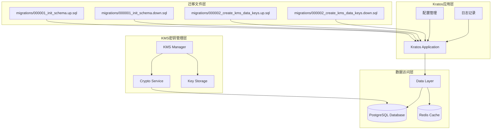

**图表来源**
- [main.go](file://cmd/kratos-boilerplate/main.go#L1-L92)
- [data.go](file://internal/data/data.go#L1-L95)
- [manager.go](file://internal/pkg/kms/manager.go#L1-L308)

## 迁移文件结构分析

### 文件命名规范

项目采用严格的时间戳前缀命名规范，确保迁移文件按照创建顺序执行：

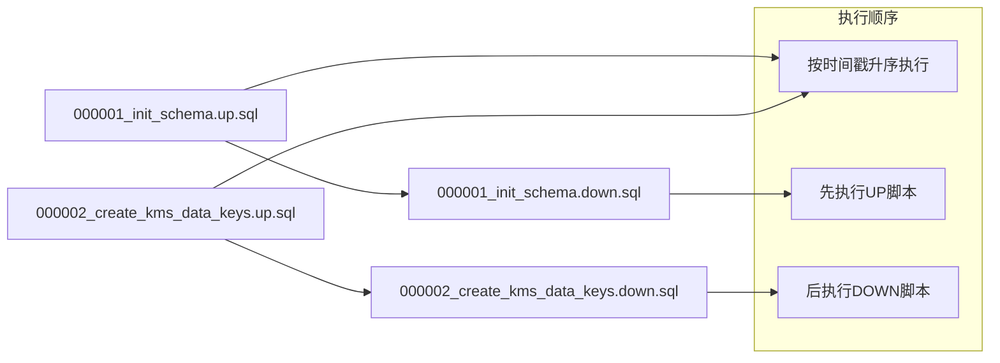

**图表来源**
- [000001_init_schema.up.sql](file://migrations/000001_init_schema.up.sql#L1-L17)
- [000002_create_kms_data_keys.up.sql](file://migrations/000002_create_kms_data_keys.up.sql#L1-L70)

### 迁移文件组织结构

迁移文件位于`migrations/`目录下，采用以下结构：

- **UP脚本**：以`.up.sql`结尾，包含数据库变更的正向操作
- **DOWN脚本**：以`.down.sql`结尾，包含数据库变更的逆向回滚操作
- **文件名格式**：`YYYYMMDDHHIISS_migration_name.up/down.sql`

这种设计确保了：
1. **可预测性**：按时间戳顺序执行，避免冲突
2. **可追溯性**：每个变更都有对应的回滚方案
3. **安全性**：支持事务级别的回滚操作

**章节来源**
- [000001_init_schema.up.sql](file://migrations/000001_init_schema.up.sql#L1-L17)
- [000001_init_schema.down.sql](file://migrations/000001_init_schema.down.sql#L1-L1)
- [000002_create_kms_data_keys.up.sql](file://migrations/000002_create_kms_data_keys.up.sql#L1-L70)
- [000002_create_kms_data_keys.down.sql](file://migrations/000002_create_kms_data_keys.down.sql#L1-L21)

## 核心迁移脚本详解

### 000001_init_schema 迁移

#### UP脚本功能分析

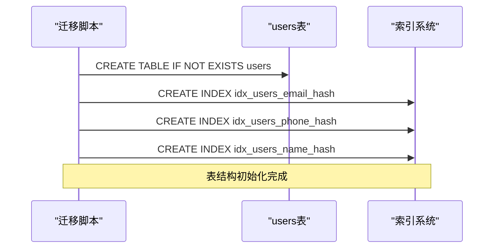

**图表来源**
- [000001_init_schema.up.sql](file://migrations/000001_init_schema.up.sql#L1-L17)

该迁移脚本负责初始化用户表结构，包含以下关键特性：

1. **表结构设计**：
   - 使用`SERIAL PRIMARY KEY`作为主键
   - 支持多种敏感信息字段（email、phone、name）
   - 包含加密字段（encrypted）和哈希字段（hash）

2. **索引优化**：
   - 为哈希字段创建专用索引
   - 支持高效的身份验证查询
   - 提供全文搜索能力

3. **时间戳管理**：
   - 自动设置`created_at`和`updated_at`字段
   - 支持审计追踪需求

#### DOWN脚本功能分析

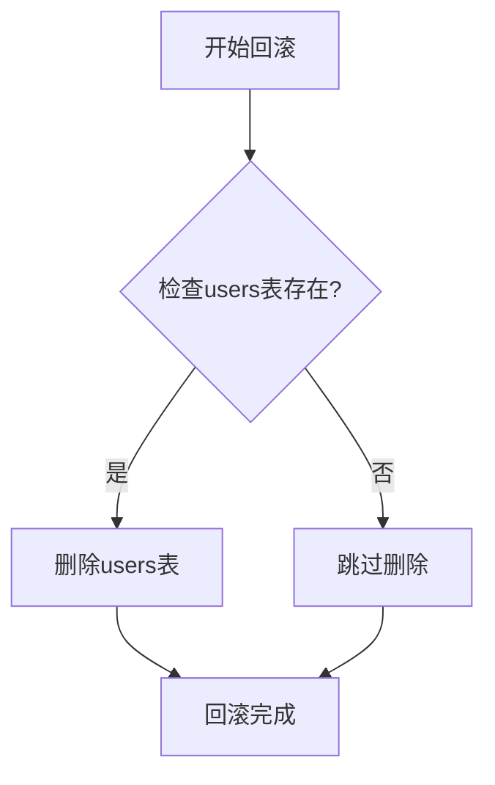

**图表来源**
- [000001_init_schema.down.sql](file://migrations/000001_init_schema.down.sql#L1-L1)

DOWN脚本采用简洁的设计原则：
- **幂等性**：多次执行不会产生副作用
- **安全性**：使用`IF EXISTS`避免错误
- **完整性**：确保数据完全回滚

**章节来源**
- [000001_init_schema.up.sql](file://migrations/000001_init_schema.up.sql#L1-L17)
- [000001_init_schema.down.sql](file://migrations/000001_init_schema.down.sql#L1-L1)

### 000002_create_kms_data_keys 迁移

#### UP脚本功能分析

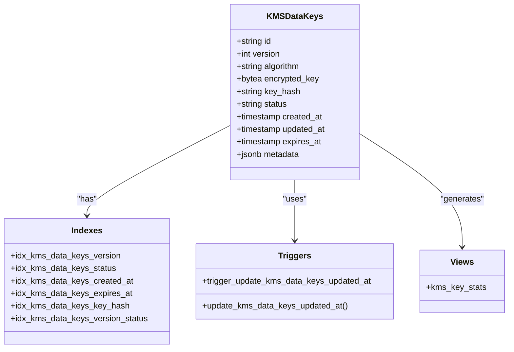

**图表来源**
- [000002_create_kms_data_keys.up.sql](file://migrations/000002_create_kms_data_keys.up.sql#L1-L70)

该迁移脚本实现了完整的KMS密钥管理系统的基础架构：

1. **表结构设计**：
   - UUID主键确保全局唯一性
   - 版本号支持密钥轮换
   - 多种加密算法支持
   - 状态管理支持密钥生命周期

2. **约束与验证**：
   - 枚举约束确保数据完整性
   - 时间戳约束支持过期管理
   - 唯一索引确保活跃密钥唯一性

3. **性能优化**：
   - 多维度索引支持高效查询
   - 触发器自动更新时间戳
   - 统计视图提供运维支持

#### DOWN脚本功能分析

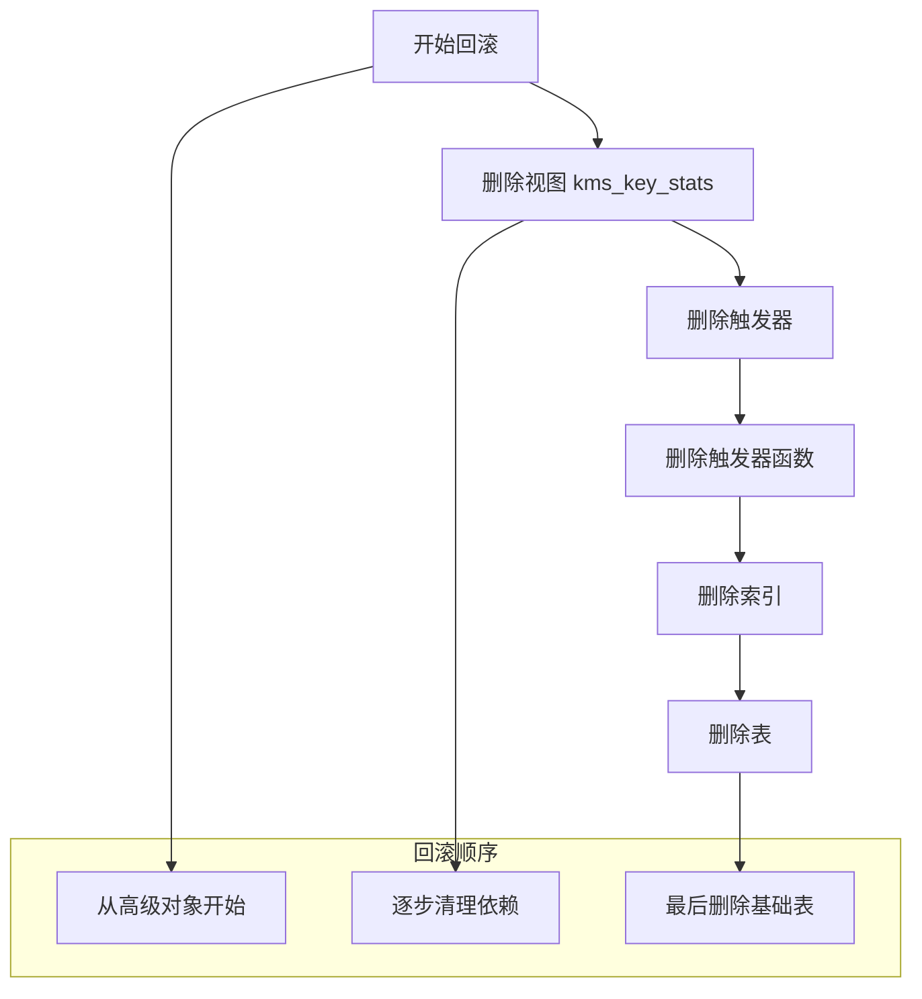

**图表来源**
- [000002_create_kms_data_keys.down.sql](file://migrations/000002_create_kms_data_keys.down.sql#L1-L21)

DOWN脚本遵循严格的依赖关系清理顺序：
1. **视图优先**：首先删除依赖表的视图
2. **触发器次之**：清理触发器及其关联函数
3. **索引随后**：虽然表删除时会自动清理索引，但显式列出便于理解
4. **最后删除表**：确保所有依赖都已清理完毕

**章节来源**
- [000002_create_kms_data_keys.up.sql](file://migrations/000002_create_kms_data_keys.up.sql#L1-L70)
- [000002_create_kms_data_keys.down.sql](file://migrations/000002_create_kms_data_keys.down.sql#L1-L21)

## KMS密钥管理系统集成

### KMS架构设计

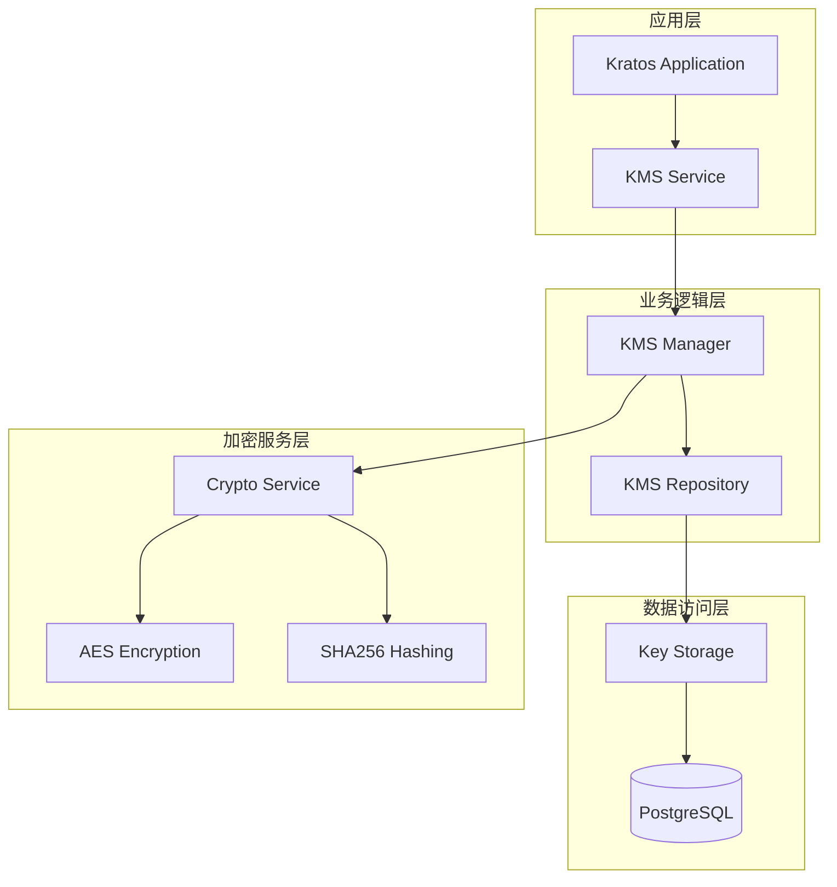

**图表来源**
- [manager.go](file://internal/pkg/kms/manager.go#L1-L308)
- [crypto_service.go](file://internal/pkg/kms/crypto_service.go#L1-L321)
- [interfaces.go](file://internal/pkg/kms/interfaces.go#L1-L126)

### 密钥生命周期管理

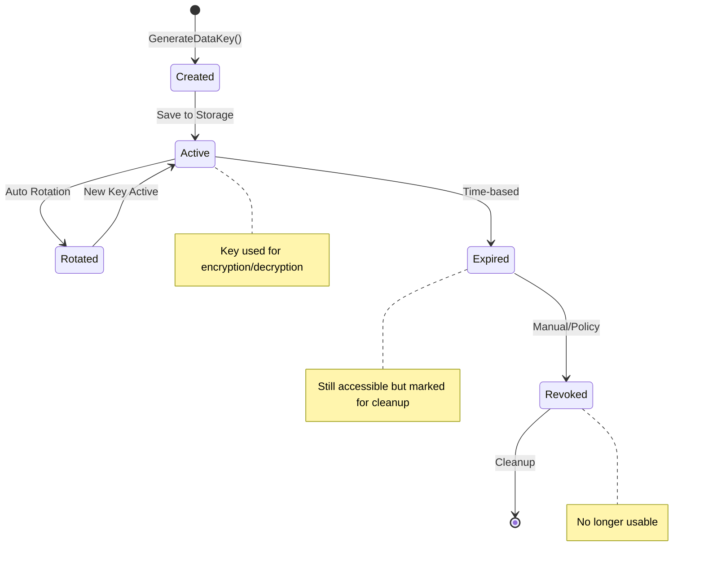

**图表来源**
- [datakey.go](file://internal/pkg/kms/datakey.go#L1-L251)
- [manager.go](file://internal/pkg/kms/manager.go#L1-L308)

### 数据加密流程

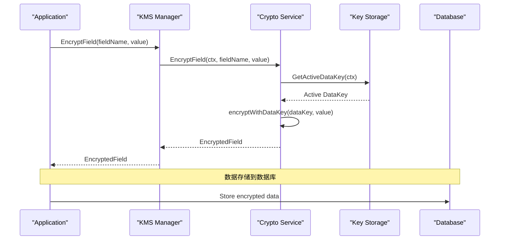

**图表来源**
- [crypto_service.go](file://internal/pkg/kms/crypto_service.go#L30-L50)
- [datakey.go](file://internal/pkg/kms/datakey.go#L180-L220)

**章节来源**
- [kms.go](file://internal/biz/kms.go#L1-L140)
- [manager.go](file://internal/pkg/kms/manager.go#L1-L308)
- [crypto_service.go](file://internal/pkg/kms/crypto_service.go#L1-L321)
- [datakey.go](file://internal/pkg/kms/datakey.go#L1-L251)

## 迁移执行策略

### Kratos框架集成

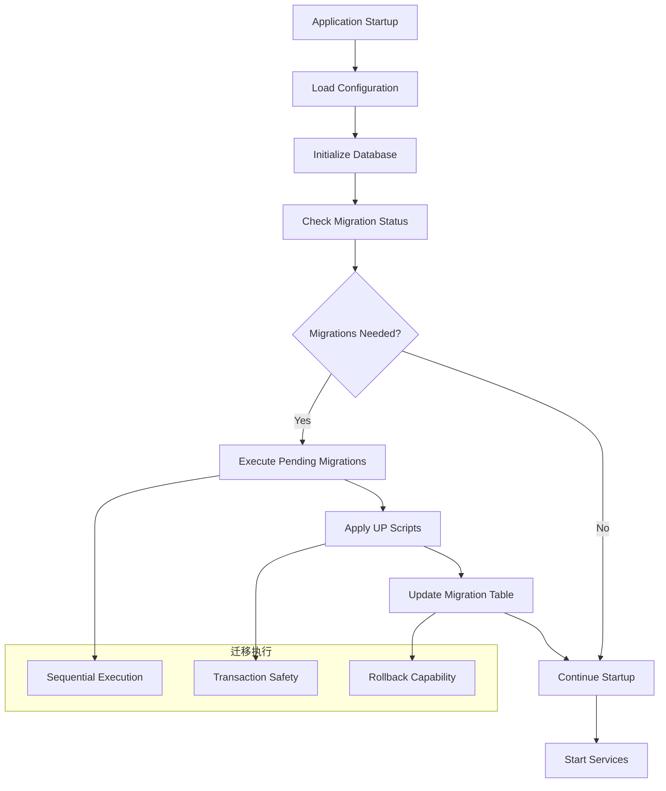

**图表来源**
- [main.go](file://cmd/kratos-boilerplate/main.go#L1-L92)
- [data.go](file://internal/data/data.go#L1-L95)

### 迁移执行机制

迁移系统通过以下机制确保安全可靠的执行：

1. **启动时自动检测**：
   ```go
   // 在应用程序启动时自动执行待处理的迁移
   func NewData(c *conf.Data, logger log.Logger) (*Data, func(), error) {
       // 数据库连接建立后自动检查迁移状态
       db, err := sql.Open(c.Database.Driver, c.Database.Source)
       if err != nil {
           return nil, nil, err
       }
       
       // 执行迁移检查
       // ... 迁移逻辑
   }
   ```

2. **事务安全保障**：
   - 每个迁移脚本在独立事务中执行
   - 失败时自动回滚
   - 状态持久化确保幂等性

3. **并发安全**：
   - 支持多实例部署
   - 避免重复执行同一迁移
   - 提供迁移锁定机制

**章节来源**
- [data.go](file://internal/data/data.go#L20-L50)
- [main.go](file://cmd/kratos-boilerplate/main.go#L1-L92)

## 最佳实践与规范

### 迁移文件编写规范

1. **命名规范**：
   ```
   YYYYMMDDHHIISS_description_of_changes.up.sql
   YYYYMMDDHHIISS_description_of_changes.down.sql
   ```
   - 使用UTC时间戳确保全球一致性
   - 描述性名称便于理解变更内容
   - 遵循时间顺序自动排序

2. **SQL编写规范**：
   ```sql
   -- 使用IF EXISTS确保幂等性
   DROP TABLE IF EXISTS table_name;
   
   -- 使用CREATE TABLE IF NOT EXISTS
   CREATE TABLE IF NOT EXISTS table_name (
       id SERIAL PRIMARY KEY,
       column_name data_type
   );
   
   -- 添加约束前检查
   ALTER TABLE table_name ADD CONSTRAINT constraint_name
   CHECK (condition) NOT VALID;
   ```

3. **注释规范**：
   - 每个迁移脚本开头添加变更描述
   - 关键操作添加详细注释
   - 复杂逻辑提供背景说明

### 回滚策略设计

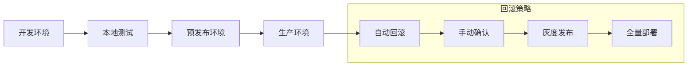

### 性能优化建议

1. **索引策略**：
   - 在大量数据插入前删除索引
   - 使用批量插入提高效率
   - 合理选择索引类型

2. **大表操作**：
   - 分批处理大数据集
   - 使用在线DDL工具
   - 避免长时间锁表

3. **监控指标**：
   - 迁移执行时间
   - 锁等待时间
   - 磁盘空间使用

## 故障排除指南

### 常见问题诊断

#### 迁移失败问题

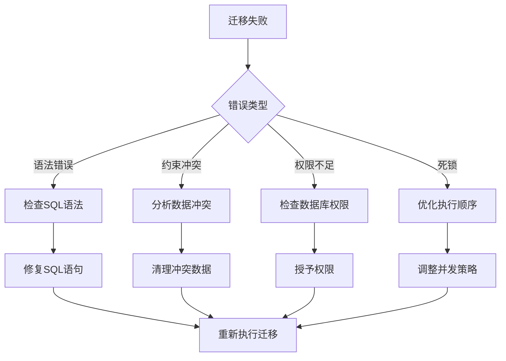

#### 锁表问题解决

1. **识别锁表进程**：
   ```sql
   -- 查看当前锁等待情况
   SELECT 
       blocked_locks.pid AS blocked_pid,
       blocked_activity.usename AS blocked_user,
       blocking_locks.pid AS blocking_pid,
       blocking_activity.usename AS blocking_user,
       blocked_activity.query AS blocked_statement,
       blocking_activity.query AS current_statement_in_blocking_process
   FROM pg_catalog.pg_locks blocked_locks
   JOIN pg_catalog.pg_stat_activity blocked_activity ON blocked_activity.pid = blocked_locks.pid
   JOIN pg_catalog.pg_locks blocking_locks ON blocking_locks.locktype = blocked_locks.locktype
   WHERE NOT blocked_locks.granted;
   ```

2. **解决方案**：
   - 重启受影响的服务
   - 手动终止阻塞进程
   - 优化查询语句
   - 调整并发参数

#### 数据一致性校验

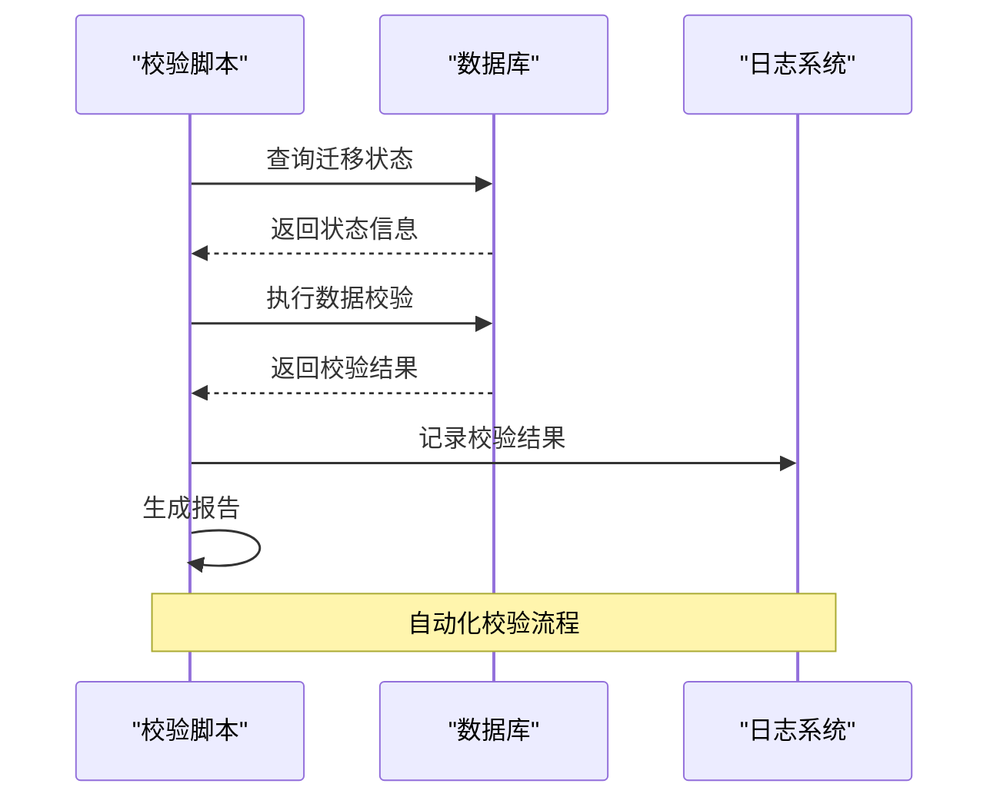

### 应急处理流程

1. **立即响应**：
   - 停止新迁移执行
   - 通知相关人员
   - 评估影响范围

2. **问题定位**：
   - 检查日志文件
   - 分析数据库状态
   - 复现问题场景

3. **恢复操作**：
   - 执行回滚脚本
   - 修复根本原因
   - 验证系统功能

4. **事后分析**：
   - 编写事故报告
   - 更新应急预案
   - 改进监控告警

## 生产环境部署建议

### 灰度迁移策略

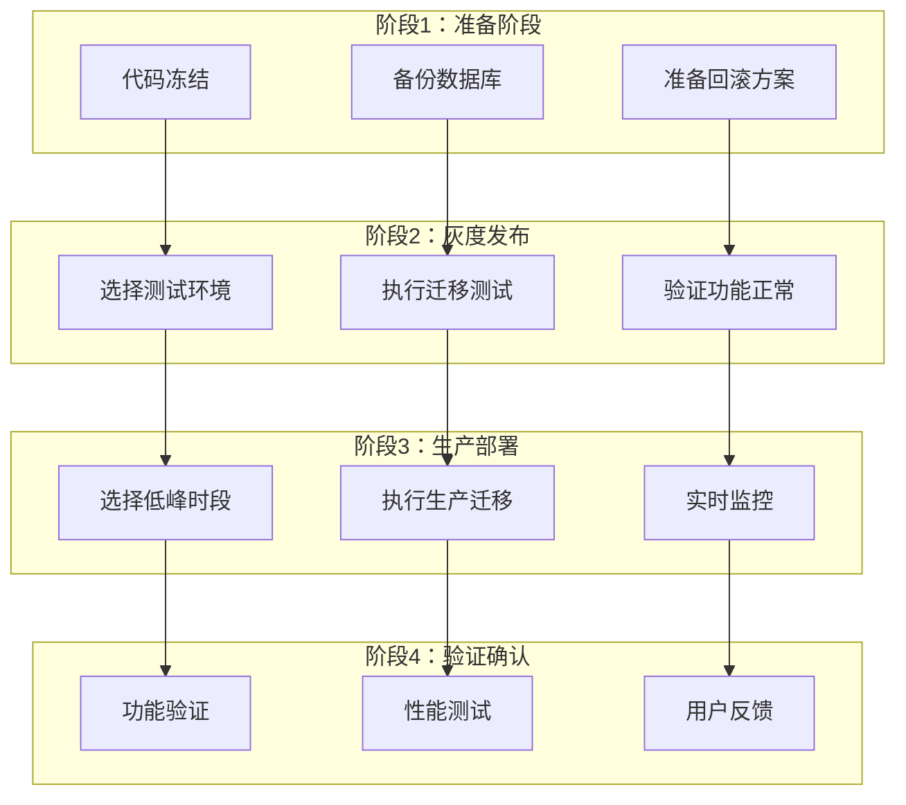

### 监控告警配置

1. **迁移执行监控**：
   - 迁移开始/结束事件
   - 执行时间异常告警
   - 失败率阈值告警

2. **数据库健康监控**：
   - 连接池使用率
   - 锁等待时间
   - 磁盘空间使用

3. **应用功能监控**：
   - API响应时间
   - 错误率统计
   - 用户体验指标

### 备份恢复策略

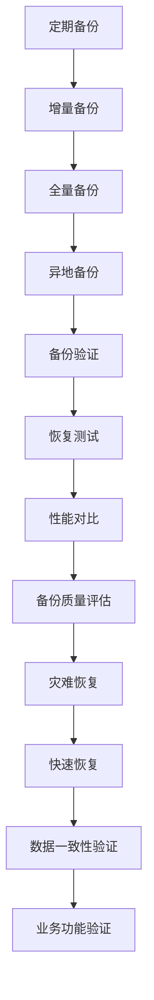

### 部署自动化

1. **CI/CD集成**：
   - 自动化测试覆盖
   - 代码审查流程
   - 自动化部署管道

2. **配置管理**：
   - 环境变量隔离
   - 配置热更新
   - 版本控制管理

3. **蓝绿部署**：
   - 新旧版本并行
   - 流量切换控制
   - 快速回滚机制

## 总结

本项目采用了一套完整且可靠的数据库迁移策略，通过以下关键特性确保系统的稳定性和可维护性：

### 核心优势

1. **安全性保障**：
   - 完整的UP/Down脚本对称设计
   - 事务级别的回滚能力
   - 幂等性确保重复执行安全

2. **可维护性**：
   - 清晰的命名规范
   - 结构化的文件组织
   - 详细的变更记录

3. **扩展性**：
   - 支持复杂的数据结构变更
   - 与KMS密钥管理系统深度集成
   - 灵活的配置管理

4. **生产友好**：
   - 灰度发布支持
   - 实时监控告警
   - 应急处理预案

### 发展方向

随着系统规模的增长，建议持续优化以下方面：

1. **自动化程度**：
   - 增强迁移脚本的自动生成能力
   - 完善自动化测试覆盖率
   - 优化部署流程效率

2. **监控体系**：
   - 建立更细粒度的监控指标
   - 完善智能告警机制
   - 提升故障预测能力

3. **运维工具**：
   - 开发专用的迁移管理工具
   - 增强可视化界面功能
   - 优化用户体验设计

这套迁移策略不仅满足了当前项目的需求，也为未来的扩展和演进奠定了坚实的基础。通过持续的改进和优化，将能够更好地支撑业务的发展和技术的进步。