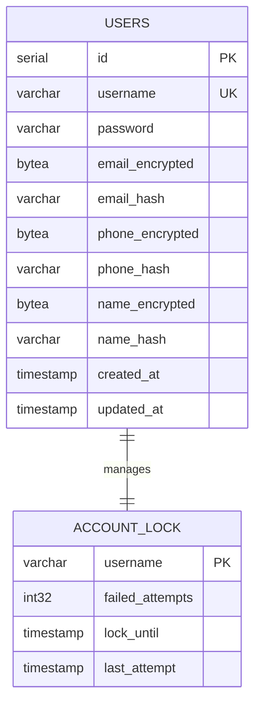
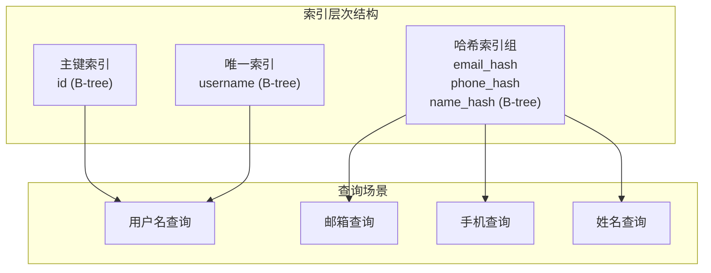
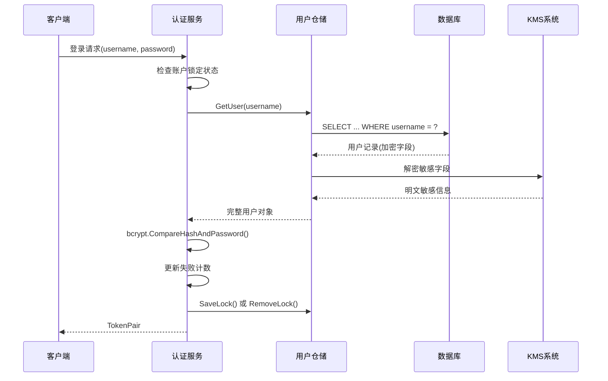
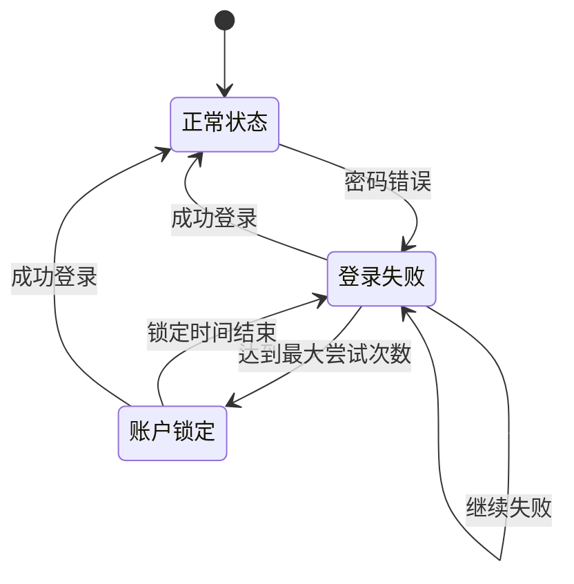

# 用户表 (users) 数据模型文档

<cite>
**本文档引用的文件**
- [000001_init_schema.up.sql](file://migrations/000001_init_schema.up.sql)
- [000001_init_schema.down.sql](file://migrations/000001_init_schema.down.sql)
- [auth.go](file://internal/biz/auth.go)
- [auth.go](file://internal/data/auth.go)
- [auth_database_test.go](file://internal/data/auth_database_test.go)
- [config.yaml](file://configs/config.yaml)
- [Login.vue](file://frontend/src/views/Login.vue)
</cite>

## 目录
1. [简介](#简介)
2. [表结构设计](#表结构设计)
3. [字段详细说明](#字段详细说明)
4. [索引设计](#索引设计)
5. [业务逻辑集成](#业务逻辑集成)
6. [安全特性](#安全特性)
7. [典型查询示例](#典型查询示例)
8. [性能优化建议](#性能优化建议)
9. [故障排除指南](#故障排除指南)
10. [总结](#总结)

## 简介

用户表 (users) 是 kratos-boilerplate 项目的核心数据模型，负责存储系统用户的认证信息和基本属性。该表采用 PostgreSQL 数据库设计，实现了完整的用户生命周期管理，包括注册、登录、账户锁定等核心功能。

## 表结构设计



**图表来源**
- [000001_init_schema.up.sql](file://migrations/000001_init_schema.up.sql#L1-L17)
- [auth.go](file://internal/biz/auth.go#L100-L110)

**章节来源**
- [000001_init_schema.up.sql](file://migrations/000001_init_schema.up.sql#L1-L17)

## 字段详细说明

### 主键字段

#### id (SERIAL PRIMARY KEY)
- **类型**: SERIAL (自动递增整数)
- **用途**: 系统内部唯一标识符
- **设计意图**: 提供高效的行定位和关联查询支持
- **性能特点**: 自动索引，适合主键查询

### 核心认证字段

#### username (VARCHAR(255) NOT NULL UNIQUE)
- **类型**: VARCHAR(255)
- **约束**: NOT NULL, UNIQUE
- **用途**: 用户登录凭据
- **设计意图**: 支持多种字符集，确保用户名唯一性
- **业务含义**: 用户在系统中的识别名称

#### password (VARCHAR(255) NOT NULL)
- **类型**: VARCHAR(255)
- **约束**: NOT NULL
- **用途**: 存储加密后的用户密码
- **设计意图**: 支持bcrypt等现代密码哈希算法
- **安全特性**: 不直接存储明文密码

### 敏感信息字段

#### email_encrypted (BYTEA)
- **类型**: BYTEA (二进制大对象)
- **用途**: 加密存储的电子邮件地址
- **设计意图**: 符合数据保护法规要求
- **加密方式**: 使用KMS系统进行端到端加密

#### email_hash (VARCHAR(64))
- **类型**: VARCHAR(64)
- **用途**: 电子邮件地址的哈希值
- **设计意图**: 支持基于邮箱的快速查询
- **哈希算法**: SM3或SHA-256

#### phone_encrypted (BYTEA)
- **类型**: BYTEA
- **用途**: 加密存储的手机号码
- **设计意图**: 保护个人隐私信息

#### phone_hash (VARCHAR(64))
- **类型**: VARCHAR(64)
- **用途**: 手机号码的哈希值
- **设计意图**: 支持基于手机号的快速查询

#### name_encrypted (BYTEA)
- **类型**: BYTEA
- **用途**: 加密存储的用户姓名
- **设计意图**: 保护个人身份信息

#### name_hash (VARCHAR(64))
- **类型**: VARCHAR(64)
- **用途**: 用户姓名的哈希值
- **设计意图**: 支持基于姓名的快速查询

### 时间戳字段

#### created_at (TIMESTAMP NOT NULL DEFAULT CURRENT_TIMESTAMP)
- **类型**: TIMESTAMP
- **约束**: NOT NULL, DEFAULT CURRENT_TIMESTAMP
- **用途**: 记录用户创建时间
- **设计意图**: 支持审计和统计分析

#### updated_at (TIMESTAMP NOT NULL DEFAULT CURRENT_TIMESTAMP)
- **类型**: TIMESTAMP
- **约束**: NOT NULL, DEFAULT CURRENT_TIMESTAMP
- **设计意图**: 自动更新记录修改时间
- **触发机制**: 通常通过数据库触发器实现

**章节来源**
- [000001_init_schema.up.sql](file://migrations/000001_init_schema.up.sql#L1-L17)
- [auth.go](file://internal/biz/auth.go#L30-L45)

## 索引设计

### 主键索引
- **类型**: B-tree
- **字段**: id
- **用途**: 快速行定位
- **性能特点**: O(log n) 查询复杂度

### 唯一索引
- **类型**: B-tree
- **字段**: username
- **用途**: 确保用户名唯一性
- **性能特点**: O(log n) 查找复杂度

### 哈希索引
- **类型**: B-tree
- **字段**: email_hash, phone_hash, name_hash
- **用途**: 支持基于加密字段的快速查询
- **性能特点**: O(log n) 查找复杂度



**图表来源**
- [000001_init_schema.up.sql](file://migrations/000001_init_schema.up.sql#L12-L16)

**章节来源**
- [000001_init_schema.up.sql](file://migrations/000001_init_schema.up.sql#L12-L16)

## 业务逻辑集成

### 认证流程集成



**图表来源**
- [auth.go](file://internal/biz/auth.go#L300-L380)
- [auth.go](file://internal/data/auth.go#L120-L180)

### 账户锁定机制



**图表来源**
- [auth.go](file://internal/biz/auth.go#L610-L640)

**章节来源**
- [auth.go](file://internal/biz/auth.go#L300-L380)
- [auth.go](file://internal/biz/auth.go#L610-L640)

## 安全特性

### 密码安全

#### 密码加密存储
- **算法**: bcrypt
- **成本因子**: 默认值
- **盐值**: 自动生成
- **安全性**: 抵御彩虹表攻击

#### 密码强度验证
```go
func validatePassword(password string) error {
    if len(password) < 8 {
        return fmt.Errorf("密码长度至少为8位")
    }
    // 其他密码策略检查
    return nil
}
```

### 敏感信息保护

#### 加密存储机制
- **加密算法**: AES-256-GCM
- **密钥管理**: KMS系统
- **完整性保护**: HMAC-SHA256
- **随机性**: CSPRNG生成的IV

#### 哈希索引设计
- **目的**: 支持快速查询而不暴露明文
- **算法**: SM3/SHA-256
- **用途**: 防止暴力破解

### 账户锁定机制

#### 失败尝试监控
- **监控范围**: 所有登录尝试
- **失败计数**: 内存缓存存储
- **阈值设置**: 可配置，默认5次
- **锁定时长**: 可配置，默认30分钟

#### 锁定状态管理
```go
type AccountLock struct {
    Username       string
    FailedAttempts int32
    LockUntil      time.Time
    LastAttempt    time.Time
}
```

**章节来源**
- [auth.go](file://internal/biz/auth.go#L250-L280)
- [auth.go](file://internal/biz/auth.go#L610-L640)

## 典型查询示例

### 注册查询
```sql
INSERT INTO users (
    username, password, 
    email_encrypted, email_hash,
    phone_encrypted, phone_hash,
    name_encrypted, name_hash,
    created_at, updated_at
) VALUES ($1, $2, $3, $4, $5, $6, $7, $8, $9, $10)
RETURNING id;
```

### 登录查询
```sql
SELECT id, username, password, 
    email_encrypted, phone_encrypted, name_encrypted,
    created_at, updated_at 
FROM users 
WHERE username = $1;
```

### 基于邮箱查询
```sql
SELECT id, username, password, 
    email_encrypted, phone_encrypted, name_encrypted,
    created_at, updated_at 
FROM users 
WHERE email_hash = $1;
```

### 账户锁定查询
```sql
SELECT username, failed_attempts, 
    lock_until, last_attempt 
FROM account_locks 
WHERE username = $1;
```

### 用户信息更新
```sql
UPDATE users 
SET password = $1, 
    email_encrypted = $2, 
    phone_encrypted = $3, 
    name_encrypted = $4, 
    updated_at = CURRENT_TIMESTAMP
WHERE id = $5;
```

**章节来源**
- [auth.go](file://internal/data/auth.go#L80-L120)
- [auth.go](file://internal/data/auth.go#L120-L180)

## 性能优化建议

### 查询性能优化

#### 索引策略
1. **主键索引**: 保持默认配置，适用于所有查询场景
2. **唯一索引**: 确保用户名查询的高效性
3. **哈希索引**: 根据实际查询模式调整索引覆盖范围

#### 缓存策略
- **内存缓存**: 账户锁定状态使用sync.Map
- **连接池**: 数据库连接池配置优化
- **查询缓存**: 对频繁查询的用户信息实施缓存

### 存储优化

#### 分区策略
- **按时间分区**: 按created_at字段分区
- **按用户ID分区**: 支持大规模用户场景
- **混合分区**: 结合时间+用户ID分区

#### 归档策略
- **历史数据归档**: 定期归档超过1年的用户数据
- **压缩存储**: 使用pg_compress扩展压缩历史数据
- **冷热分离**: 将活跃用户与历史用户分离存储

### 并发控制

#### 锁机制
- **乐观锁**: 使用updated_at字段实现版本控制
- **悲观锁**: 在关键业务场景使用行级锁
- **分布式锁**: 账户锁定状态的并发控制

## 故障排除指南

### 常见问题诊断

#### 登录失败问题
1. **检查账户锁定状态**
```sql
SELECT * FROM account_locks WHERE username = 'problematic_user';
```

2. **验证密码哈希**
```sql
SELECT password FROM users WHERE username = 'problematic_user';
```

3. **检查索引有效性**
```sql
SELECT schemaname, tablename, indexname, indexdef 
FROM pg_indexes 
WHERE tablename = 'users';
```

#### 性能问题排查
1. **慢查询分析**
```sql
EXPLAIN ANALYZE SELECT * FROM users WHERE username = 'test';
```

2. **索引使用情况**
```sql
SELECT relname, seq_scan, idx_scan 
FROM pg_stat_user_tables 
WHERE relname = 'users';
```

3. **锁等待情况**
```sql
SELECT blocked_locks.pid AS blocked_pid,
       blocked_activity.usename AS blocked_user,
       blocking_locks.pid AS blocking_pid,
       blocking_activity.usename AS blocking_user,
       blocked_activity.query AS blocked_query,
       blocking_activity.query AS blocking_query
FROM pg_catalog.pg_locks blocked_locks
JOIN pg_catalog.pg_stat_activity blocked_activity ON blocked_activity.pid = blocked_locks.pid
JOIN pg_catalog.pg_locks blocking_locks ON blocking_locks.locktype = blocked_locks.locktype
AND blocking_locks.database IS NOT DISTINCT FROM blocked_locks.database
AND blocking_locks.relation IS NOT DISTINCT FROM blocked_locks.relation
AND blocking_locks.page IS NOT DISTINCT FROM blocked_locks.page
AND blocking_locks.tuple IS NOT DISTINCT FROM blocked_locks.tuple
AND blocking_locks.virtualxid IS NOT DISTINCT FROM blocked_locks.virtualxid
AND blocking_locks.transactionid IS NOT DISTINCT FROM blocked_locks.transactionid
AND blocking_locks.classid IS NOT DISTINCT FROM blocked_locks.classid
AND blocking_locks.objid IS NOT DISTINCT FROM blocked_locks.objid
AND blocking_locks.objsubid IS NOT DISTINCT FROM blocked_locks.objsubid
AND blocking_locks.pid != blocked_locks.pid
JOIN pg_catalog.pg_stat_activity blocking_activity ON blocking_activity.pid = blocking_locks.pid
WHERE NOT blocked_locks.granted;
```

### 监控指标

#### 关键性能指标
- **查询响应时间**: 目标 < 100ms
- **连接池使用率**: 目标 < 80%
- **索引命中率**: 目标 > 95%
- **锁定等待时间**: 目标 < 10ms

#### 安全监控指标
- **登录失败率**: 异常增长需关注
- **账户锁定频率**: 异常模式需调查
- **密码重试次数**: 监控暴力破解尝试

**章节来源**
- [auth.go](file://internal/data/auth_database_test.go#L50-L100)

## 总结

用户表 (users) 是 kratos-boilerplate 项目的核心数据模型，采用了现代化的安全设计理念和高性能的数据库设计。该表不仅满足了基本的用户认证需求，还实现了完整的账户安全管理功能。

### 设计亮点

1. **安全优先**: 敏感信息加密存储，密码使用bcrypt哈希
2. **性能优化**: 合理的索引设计，支持多种查询场景
3. **业务完整**: 集成账户锁定、验证码等安全机制
4. **可扩展性**: 支持未来功能扩展和性能优化

### 最佳实践建议

1. **定期备份**: 确保用户数据的安全性和可恢复性
2. **监控告警**: 建立完善的性能和安全监控体系
3. **定期审计**: 定期检查索引使用情况和查询性能
4. **安全更新**: 及时更新加密算法和安全策略

该用户表设计为构建安全、可靠、高性能的用户管理系统提供了坚实的基础，是企业级应用开发的重要参考模板。